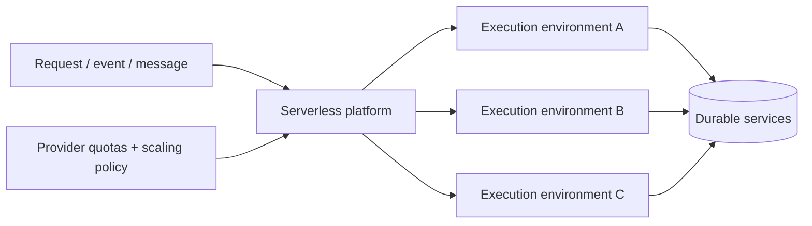
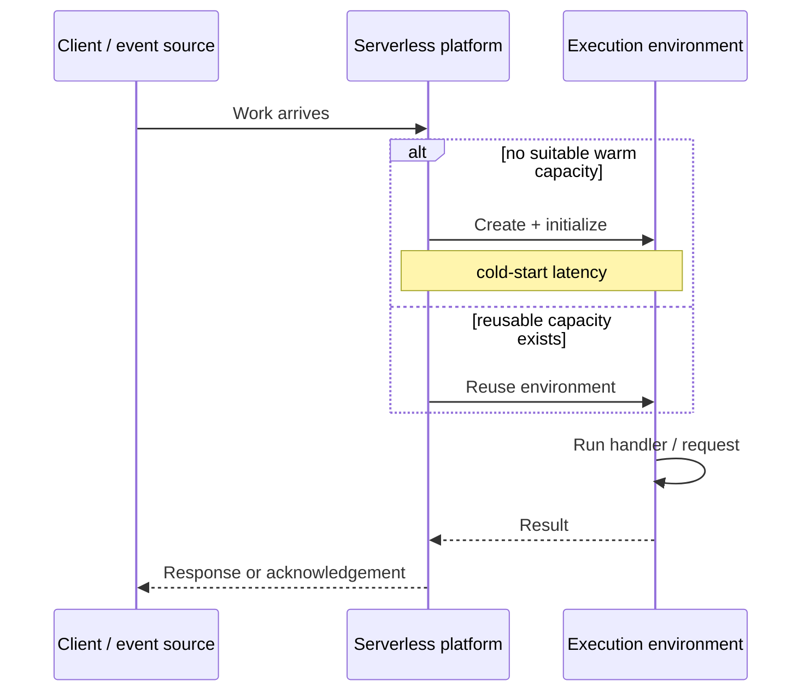
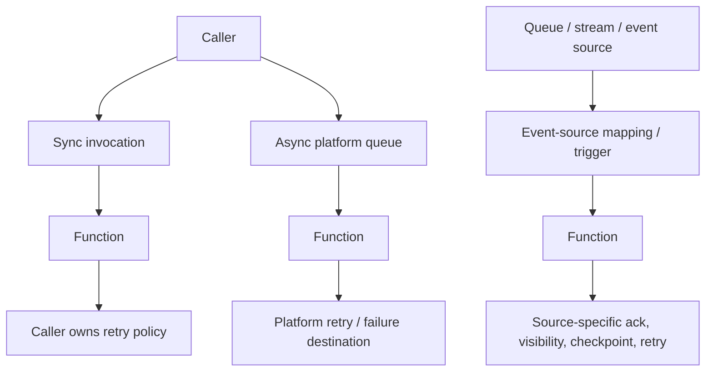
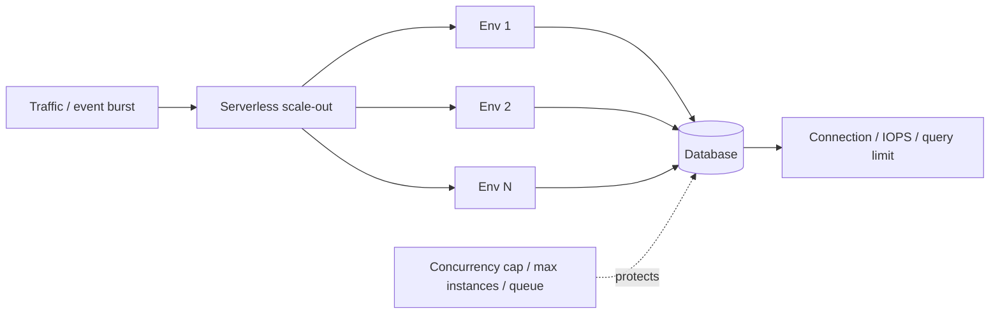

# Serverless Compute: Reason About Execution, Scaling, and Failure Semantics

## TL;DR

On February 13, 2023, Pipedream lost access to the AWS Lambda API in the account where it ran customer workflows. Workflow executions, event sources, deploys, and tests were affected; queued events accumulated until downstream services were also impacted, and inbound HTTP requests returned 504s for part of the incident. Pipedream's postmortem emphasized both how much engineering work Lambda had removed for them and how a managed execution service still creates a real platform dependency. **Serverless removes direct server management; it does not remove capacity limits, lifecycle transitions, queues, retries, or failure boundaries.**

> 💡 **Rule of thumb:** Treat serverless as a **provider-managed execution and capacity contract**. Assume an execution environment may appear, be reused, scale out, throttle, or disappear according to product-specific rules; keep durable state external, make retries safe, bound concurrency against downstream capacity, and measure startup plus queueing separately from handler time.

- **Serverless still runs on servers:** The provider owns more of host provisioning, patching, placement, and execution-environment lifecycle, while you still own application correctness, dependencies, limits, and recovery.
- **Environment reuse is an optimization, not a guarantee:** Warm memory, connections, and temporary files can reduce latency, but correctness cannot depend on the same environment serving the next invocation.
- **Concurrency and scaling are different levers:** One environment may handle one or many simultaneous requests depending on the product; the platform then adds or removes environments according to traffic, queue depth, CPU, plan, and quotas.
- **Invocation mode defines failure semantics:** Synchronous requests, asynchronous event queues, and queue/stream event sources differ in who retries, how long work is retained, how duplicates appear, and where backpressure belongs.
- **Fatal pitfall:** Letting elastic compute scale faster than the systems behind it. Thousands of fresh invocations can exhaust database connections, API quotas, or queue consumers long before the serverless platform reaches its own limit.



<TermBox term="Execution Environment">
An **execution environment** is the provider-managed runtime context that executes application code. It may contain a language runtime, memory, temporary storage, network connections, and cached initialization state. Its exact isolation, concurrency, reuse, and shutdown behavior are product-specific.
</TermBox>

## Serverless is an ownership boundary, not the absence of servers

"No servers" is a misleading mental model. Servers, hosts, runtimes, networks, and schedulers still exist. What changes is **who operates the capacity lifecycle**.

With a VM, you usually choose and manage the machine lifecycle. With a container platform, you package a process and delegate varying amounts of scheduling. With serverless compute, the provider typically owns more of:

- provisioning execution capacity;
- deciding when environments are created or removed;
- patching the managed runtime or host;
- routing invocations to available capacity;
- autoscaling within product and account limits;
- metering usage according to the service's billing model.

You still own code, dependency behavior, data durability, IAM, network access, timeouts, retries, observability, downstream load, and recovery semantics.

## Cold and warm are lifecycle states, not application guarantees

A **cold start** happens when the platform must create or initialize execution capacity before work can run. Initialization can include starting the runtime, loading code, importing dependencies, creating framework state, and preparing network resources.

<TermBox term="Cold Start">
A **cold start** is additional startup latency incurred when a serverless platform initializes a new execution environment before handling work. A **warm** invocation reuses already-initialized capacity, but the lifetime and reuse policy of that capacity are controlled by the platform.
</TermBox>



Warm reuse is useful for SDK clients, connection pools, parsed configuration, or cached static assets. AWS Lambda explicitly documents reuse as an optimization; Cloud Run can keep idle instances for a period; Azure hosting plans can keep or pre-provision capacity. None of those mechanisms make process memory durable.

Design correctness as if any invocation may land on a fresh environment.

## Ephemeral state may survive briefly and still be non-durable

AWS Lambda exposes temporary `/tmp` storage per execution environment. Cloud Run instances have in-memory and container-local state whose lifetime ends with the instance. Azure Functions similarly runs code inside replaceable app instances according to the hosting plan.

This creates a subtle rule:

- **cache** may live locally;
- **durable state** may not depend on local environment lifetime.

A warm environment might make a file, variable, or connection appear persistent during testing. That is not a durability guarantee. Put business state in a database, object store, durable queue, or another service whose lifecycle is independent from one execution environment.

## Invocation mode determines who owns retry and acknowledgement

Do not reason about "a function call" without naming how the function is invoked.



For **synchronous invocation**, the caller normally waits for a response. A timeout can be ambiguous: the caller may stop waiting while the remote code has already performed a side effect.

For **asynchronous invocation**, the platform can acknowledge receipt before the function finishes. AWS Lambda, for example, places asynchronous events on an internal queue and has documented retry behavior for function and system errors.

For **queue or stream triggers**, the queue, stream, trigger adapter, or event-source mapping usually owns delivery position and retry behavior. Batch size, visibility timeout, checkpointing, poison-message handling, and partial failure rules become part of correctness.

Provider and trigger rules are different. Never infer retry semantics from the word "serverless."

## At-least-once delivery turns idempotency into a compute concern

Retries, redelivery, eventual queues, client reconnects, and timeout ambiguity mean the same logical event can execute more than once.

An event-driven function should answer:

- What stable event or operation key identifies duplicate work?
- Which side effects can be replayed safely?
- Is the idempotency record committed atomically with the business effect?
- How long must duplicate detection live?
- What happens when the function times out after the side effect but before acknowledgement?
- Where do permanently failed events go?

If the answer is "the provider retries it," the design is incomplete. The provider can re-execute code; it cannot infer whether charging a card or sending a fulfillment command twice is safe.

## Concurrency is not the same as instance count

<TermBox term="Concurrency">
**Concurrency** is the amount of work executing at the same time. A serverless product may express it as concurrent invocations, concurrent requests per instance, trigger-specific work per instance, or a combination. **Scaling** changes the number of execution environments; **concurrency** changes how much work each environment or function handles simultaneously.
</TermBox>

Provider contracts differ materially:

| Platform | Concurrency / scaling mental model | Warm-capacity control |
| --- | --- | --- |
| **AWS Lambda** | Standard functions scale execution environments as concurrent invocations grow, subject to account/function concurrency controls and scaling limits. Invocation source changes retry behavior. | Provisioned concurrency can keep pre-initialized environments; reserved concurrency can reserve and cap function concurrency. |
| **Google Cloud Run / Cloud Run functions** | A Cloud Run instance can process multiple concurrent requests; services autoscale instance count and can scale to zero. Concurrency and max-instance settings influence scale and downstream pressure. | Minimum instances can keep idle capacity available to reduce startup latency. |
| **Azure Functions** | Function app instances can process multiple events concurrently; fixed or dynamic per-instance concurrency and scale behavior depend on trigger and hosting plan. | Flex Consumption, Premium, and other plans provide different always-ready/prewarmed behaviors. |

These are examples, not a universal abstraction. Exact limits, defaults, timeout ceilings, billing units, and supported controls change by product and plan, so verify the selected provider contract.

## Scale-to-zero trades idle capacity for startup work

When the platform can **scale to zero**, idle compute cost can fall substantially because no active worker is kept solely for future traffic. The first work after idle may then need to create capacity.

Warm controls such as **minimum instances**, **provisioned concurrency**, **always ready**, or other prewarmed capacity shift the trade-off:

```text
less idle capacity -> lower idle cost -> more startup exposure
more warm capacity -> higher idle cost -> lower startup exposure
```

Do not optimize cold starts in isolation. Measure request latency distribution, initialization time, queueing time, traffic bursts, and the actual business cost of slower first requests.

## Elastic scale must be bounded by downstream capacity



A platform that can add compute quickly can amplify pressure on:

- database connection limits;
- transaction-lock contention;
- third-party API rate limits;
- object-store or messaging quotas;
- NAT ports and outbound connection ceilings;
- downstream CPU or storage IOPS.

Use **backpressure** deliberately: reserved concurrency, maximum instances, trigger concurrency, queue consumer limits, token buckets, or another admission mechanism. The exact control is platform-specific, but the invariant is stable: compute concurrency must be compatible with dependency capacity.

## Quotas and throttling are normal operating states

Autoscaling stops somewhere.

Account quotas, regional capacity, per-function limits, trigger limits, API quotas, and provider scaling rates can produce throttling such as HTTP 429 or service-specific errors. Treat this as a designed state:

- expose throttle metrics;
- distinguish platform throttle from application errors;
- decide whether callers retry, queue, shed load, or fail fast;
- use jittered backoff when retry is appropriate;
- reserve capacity for critical workloads where the product supports it.

Unlimited autoscaling is not a serverless guarantee.

## Timeout is a correctness boundary

Every request path has multiple timeout layers: client, gateway, function/service, SDK, database, and queue visibility or acknowledgement windows.

If a handler reaches its platform timeout:

- the client may already have disconnected;
- a transaction may have committed;
- a remote API may have accepted a side effect;
- the event may later be retried;
- cleanup code might not finish.

Propagate deadlines where possible and make side effects recoverable. For long-running work, move execution to a job/workflow model whose lifecycle matches the task instead of extending an HTTP request indefinitely.

## Production micro-scenario: a successful side effect looks like a failed invocation

An object-upload event invokes a serverless function that creates an invoice, calls an email provider, then records "notification sent." The email provider accepts the message, but the database write stalls and the function hits its timeout. The event source later redelivers the same event.

- **Impact:** Customers receive duplicate invoice emails, and some downstream actions run twice even though the original invocation looked like a timeout.
- **Root cause:** The team treated one invocation as one business operation. It did not model timeout ambiguity or at-least-once redelivery, and it used no stable idempotency key around side effects.
- **Correct pattern:** Derive a stable operation key from the event/business identity, persist idempotent progress in durable storage, separate retryable steps, bound the timeout, and route repeatedly failing events to an observable failure path.

## Observability must cover platform behavior, not only handler logs

A serverless dashboard that only charts application exceptions misses much of the system.

Track, where the platform exposes them:

- invocation/request count and error rate;
- concurrency and active instance/environment count;
- cold-start or initialization duration;
- throttles and quota failures;
- queue depth, oldest-event age, retry count, and dead-letter/failure destinations;
- handler duration and timeout rate;
- downstream connection saturation and latency;
- cost or billed duration/resource consumption;
- deployment/version/revision identity.

Correlate logs, metrics, and traces with the invocation/event ID and deployed version. Short-lived environments make local inspection less useful than durable telemetry.

## Check your mental model

> **Scenario:** A function initializes a database client outside its handler. During a quiet period, the same environment handles several requests and the client is reused. The team concludes that the function now has a persistent database session and stores a user's workflow state in global memory to avoid a database write.

<details>
<summary>Show the reasoning</summary>

Connection reuse can be a good performance optimization, but it does not change the lifecycle contract. The provider may recycle the environment, create additional environments during a burst, or route the next invocation elsewhere.

Global memory can therefore be absent, duplicated across environments, or stale. Keep the database client reusable if the provider/runtime supports that pattern, but keep workflow state in a durable external system. Treat warm state as cache, never as the authoritative copy.

</details>

## Serverless reasoning checklist

- [ ] **Invocation mode:** Is each trigger synchronous, asynchronous, queue/stream based, scheduled, or event driven, and who owns retry?
- [ ] **Duplicate safety:** Can every retryable business operation tolerate duplicate execution through a stable idempotency strategy?
- [ ] **Environment lifetime:** Does correctness survive a fresh execution environment on every invocation?
- [ ] **Cold-start budget:** Are startup and queueing latency measured separately from handler duration?
- [ ] **Warm capacity:** Is minimum/provisioned/always-ready capacity justified by the latency objective and its cost?
- [ ] **Concurrency model:** Do you know per-instance and total concurrency semantics for the selected product and trigger?
- [ ] **Downstream protection:** Are database connections, APIs, and other dependencies protected from compute scale-out?
- [ ] **Quota behavior:** What happens at platform/account limits—queue, throttle, shed load, or fail?
- [ ] **Timeout semantics:** Can the system reconcile a timeout after a side effect may already have happened?
- [ ] **State boundary:** Are durable records outside ephemeral memory and temporary filesystem state?
- [ ] **Backlog recovery:** Can queues drain after an outage without causing a second overload?
- [ ] **Telemetry:** Can you observe initialization, concurrency, throttles, queue age, retries, versions, and downstream pressure?

## Boundary with Containers vs Serverless

This lesson explains the **execution and lifecycle semantics** you must reason about after adopting a serverless platform. It does not decide whether serverless is the right operating model for a workload.

Use [Containers vs Serverless](/docs/engineering-judgment/decision-guides/containers-vs-serverless) when choosing the operating model. Use [Containers](/docs/cloud-infrastructure/containers) when you need the image/process/storage/resource boundary underneath a containerized workload.

## Sources

- [Pipedream: Post-mortem on our 2/13 AWS incident](https://pipedream.com/blog/post-mortem-on-our-2-13-aws-incident/)
- [AWS Lambda: Running code with Lambda](https://docs.aws.amazon.com/lambda/latest/dg/concepts-how-lambda-runs-code.html)
- [AWS Lambda: Understanding function scaling](https://docs.aws.amazon.com/lambda/latest/dg/lambda-concurrency.html)
- [AWS Lambda: Asynchronous error handling and retries](https://docs.aws.amazon.com/lambda/latest/dg/invocation-async-error-handling.html)
- [Google Cloud Run: Instance autoscaling](https://cloud.google.com/run/docs/about-instance-autoscaling)
- [Google Cloud Run: Maximum concurrent requests](https://cloud.google.com/run/docs/about-concurrency)
- [Google Cloud Run: Container runtime contract](https://cloud.google.com/run/docs/container-contract)
- [Azure Functions: Concurrency](https://learn.microsoft.com/en-us/azure/azure-functions/functions-concurrency)
- [Azure Functions: Hosting and scale](https://learn.microsoft.com/en-us/azure/azure-functions/functions-scale)

## Related lessons

- [Containers](/docs/cloud-infrastructure/containers)
- [Cloud Compute](/docs/cloud-infrastructure/cloud-compute)
- [Idempotency](/docs/backend-engineering/idempotency)
- [Message Queues](/docs/backend-engineering/message-queues)
