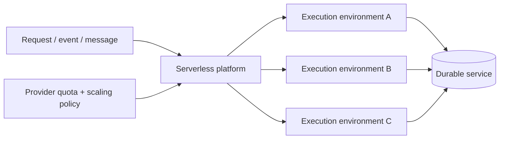
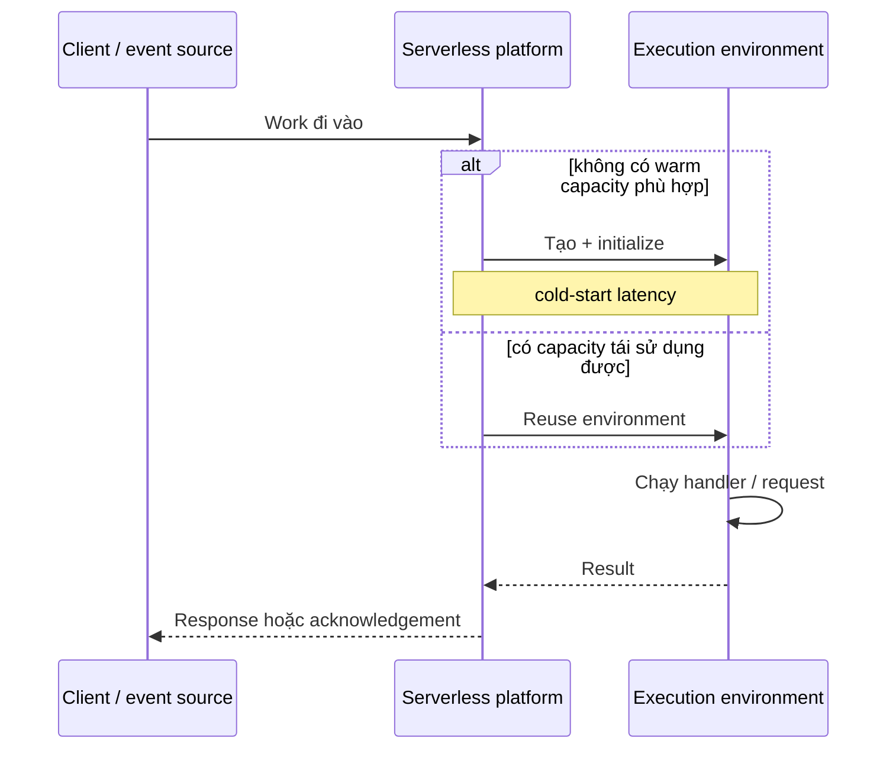
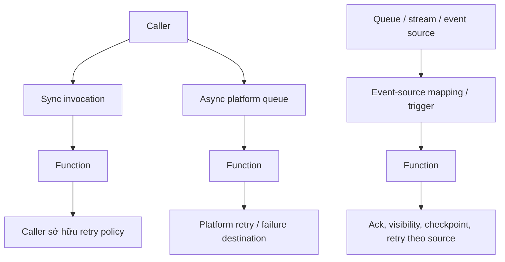
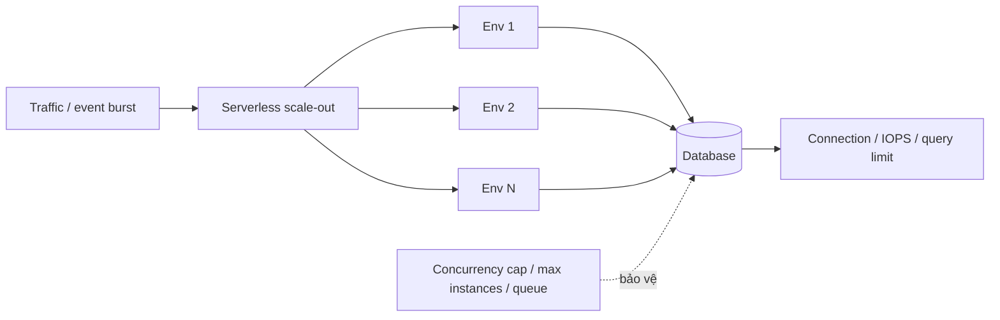

# Serverless Compute: Suy luận về Thực thi, Co giãn và Ngữ nghĩa Lỗi

## TL;DR

Ngày 13 tháng 02 năm 2023, Pipedream mất quyền truy cập AWS Lambda API trong account dùng để chạy workflow của khách hàng. Workflow execution, event source, deploy và test đều bị ảnh hưởng; event tồn đọng trong queue tăng dần cho tới khi kéo theo downstream impact, và inbound HTTP request trả 504 trong một phần thời gian sự cố. Postmortem của Pipedream vừa ghi nhận lượng công việc vận hành mà Lambda đã giúp họ loại bỏ, vừa cho thấy managed execution service vẫn là một dependency production thật sự. **Serverless giảm việc trực tiếp quản lý server; nó không xóa capacity limit, lifecycle transition, queue, retry hay failure boundary.**

> 💡 **Quy tắc bỏ túi:** Xem serverless là **execution và capacity contract do nhà cung cấp quản lý**. Giả định execution environment có thể xuất hiện, được tái sử dụng, scale out, throttle hoặc biến mất theo rule riêng của từng sản phẩm; giữ durable state bên ngoài, làm retry an toàn, giới hạn concurrency theo downstream capacity và đo startup/queueing tách khỏi handler time.

- **Serverless vẫn chạy trên server:** Nhà cung cấp sở hữu nhiều hơn phần host provisioning, patching, placement và execution-environment lifecycle; đội ứng dụng vẫn sở hữu correctness, dependency, limit và recovery.
- **Environment reuse là optimization, không phải guarantee:** Warm memory, connection và temporary file có thể giảm latency, nhưng correctness không được phụ thuộc cùng environment phục vụ invocation kế tiếp.
- **Concurrency và scaling là hai lever khác nhau:** Một environment có thể xử lý một hoặc nhiều request đồng thời tùy sản phẩm; platform sau đó thêm/bớt environment dựa trên traffic, queue depth, CPU, hosting plan và quota.
- **Invocation mode quyết định failure semantics:** Synchronous request, asynchronous event queue và queue/stream event source khác nhau ở retry owner, thời gian giữ work, duplicate behavior và vị trí đặt backpressure.
- **Cạm bẫy chết người:** Để elastic compute scale nhanh hơn hệ thống phía sau. Hàng nghìn invocation mới có thể làm cạn database connection, API quota hoặc consumer capacity trước khi serverless platform chạm limit của chính nó.



<TermBox term="Execution Environment">
**Execution environment / môi trường thực thi** là runtime context do nhà cung cấp quản lý để chạy application code. Nó có thể chứa language runtime, memory, temporary storage, network connection và cached initialization state. Isolation, concurrency, reuse và shutdown behavior cụ thể là contract riêng của từng sản phẩm.
</TermBox>

## Serverless là ownership boundary, không phải không còn máy chủ

"No servers" là mental model gây hiểu nhầm. Server, host, runtime, network và scheduler vẫn tồn tại. Điều thay đổi là **ai vận hành capacity lifecycle**.

Với VM, đội thường chọn và quản lý machine lifecycle. Với container platform, đội đóng gói process và ủy thác một phần scheduling. Với serverless compute, nhà cung cấp thường sở hữu nhiều hơn các việc:

- provision execution capacity;
- quyết định khi nào environment được tạo hoặc loại bỏ;
- patch managed runtime hoặc host;
- route invocation vào capacity sẵn có;
- autoscale trong giới hạn product/account;
- meter usage theo billing model của service.

Đội ứng dụng vẫn sở hữu code, dependency behavior, data durability, IAM, network access, timeout, retry, observability, downstream load và recovery semantics.

## Cold và warm là trạng thái lifecycle, không phải guarantee của ứng dụng

**Cold start / khởi động lạnh** xảy ra khi platform phải tạo hoặc initialize execution capacity trước khi work chạy được. Initialization có thể gồm start runtime, load code, import dependency, tạo framework state và chuẩn bị network resource.

<TermBox term="Cold Start">
**Cold start** là startup latency phát sinh khi serverless platform initialize execution environment mới trước khi xử lý work. **Warm** invocation tái sử dụng capacity đã được initialize, nhưng lifetime và reuse policy của capacity đó do platform kiểm soát.
</TermBox>



Warm reuse hữu ích cho SDK client, connection pool, parsed configuration hoặc cached static asset. AWS Lambda mô tả reuse như một optimization; Cloud Run có thể giữ idle instance trong một khoảng thời gian; các hosting plan của Azure có thể giữ hoặc pre-provision capacity. Không cơ chế nào trong số đó biến process memory thành durable state.

Hãy thiết kế correctness như thể invocation bất kỳ có thể rơi vào một environment hoàn toàn mới.

## Ephemeral state có thể tồn tại ngắn hạn nhưng vẫn không durable

AWS Lambda cung cấp temporary `/tmp` storage riêng theo execution environment. Cloud Run instance có in-memory và container-local state kết thúc cùng instance. Azure Functions cũng chạy code trong các app instance có thể được thay thế theo hosting plan.

Điều này tạo ra một rule tinh tế:

- **cache** có thể nằm local;
- **durable state / trạng thái bền** không được phụ thuộc lifetime của environment.

Warm environment có thể khiến file, variable hoặc connection trông như "persistent" trong lúc test. Đó không phải durability guarantee. Business state phải nằm ở database, object store, durable queue hoặc service khác có lifecycle độc lập với một execution environment.

## Invocation mode quyết định retry và acknowledgement thuộc về ai

Đừng suy luận về "một function call" nếu chưa gọi tên cách function được invoke.



Với **synchronous / đồng bộ invocation**, caller thường chờ response. Timeout có thể mơ hồ: caller ngừng chờ trong khi remote code đã thực hiện side effect.

Với **asynchronous / bất đồng bộ invocation**, platform có thể acknowledge receipt trước khi function hoàn tất. AWS Lambda, ví dụ, đặt asynchronous event vào internal queue và có retry behavior riêng cho function/system error.

Với **queue hoặc stream trigger**, queue, stream, trigger adapter hay event-source mapping thường sở hữu delivery position và retry behavior. Batch size, visibility timeout, checkpointing, poison-message handling và partial failure rule đều trở thành một phần correctness.

Rule giữa provider và trigger **khác nhau**. Không bao giờ suy ra retry semantics chỉ từ từ "serverless".

## At-least-once delivery biến idempotency thành compute concern

Retry, redelivery/giao lại, eventually consistent queue, client reconnect và timeout ambiguity khiến cùng một logical event có thể chạy hơn một lần.

Một event-driven function cần trả lời:

- Event hay operation key ổn định nào định danh duplicate work?
- Side effect nào replay được an toàn?
- Idempotency record có commit atomically với business effect không?
- Duplicate detection cần sống bao lâu?
- Điều gì xảy ra nếu function timeout sau side effect nhưng trước acknowledgement?
- Event fail vĩnh viễn đi đâu?

Nếu câu trả lời chỉ là "provider sẽ retry", design chưa hoàn chỉnh. Provider có thể chạy lại code; nó không thể tự suy ra charge thẻ hay gửi fulfillment command hai lần có an toàn hay không.

## Concurrency không đồng nghĩa với instance count

<TermBox term="Concurrency">
**Concurrency / độ đồng thời** là lượng work đang thực thi cùng lúc. Một serverless product có thể biểu diễn nó thành concurrent invocation, concurrent request trên mỗi instance, trigger-specific work trên mỗi instance, hoặc kết hợp nhiều cách. **Scaling** thay đổi số execution environment; **concurrency** thay đổi lượng work một environment hay function xử lý đồng thời.
</TermBox>

Contract từng nhà cung cấp khác nhau rõ rệt:

| Nền tảng | Mental model concurrency / scaling | Warm-capacity control |
| --- | --- | --- |
| **AWS Lambda** | Standard function scale execution environment khi concurrent invocation tăng, chịu account/function concurrency control và scaling limit. Invocation source làm thay đổi retry semantics. | Provisioned concurrency giữ pre-initialized environment; reserved concurrency có thể reserve và cap function concurrency. |
| **Google Cloud Run / Cloud Run functions** | Một Cloud Run instance có thể xử lý nhiều concurrent request; service autoscale instance count và có thể scale to zero. Concurrency/max-instance setting ảnh hưởng scale và downstream pressure. | Minimum instance có thể giữ idle capacity để giảm startup latency. |
| **Azure Functions** | Function app instance có thể xử lý nhiều event đồng thời; fixed/dynamic per-instance concurrency và scale behavior phụ thuộc trigger lẫn hosting plan. | Flex Consumption, Premium và các plan khác có always-ready/prewarmed behavior khác nhau. |

Đây chỉ là ví dụ, không phải universal abstraction. Limit, default, timeout ceiling, billing unit và control cụ thể thay đổi theo product/plan; phải verify contract của provider được chọn.

## Scale-to-zero đánh đổi idle capacity lấy startup work

Khi platform có thể **scale to zero / co về 0**, idle compute cost có thể giảm mạnh vì không cần giữ active worker chỉ để chờ traffic tương lai. Work đầu tiên sau thời gian idle có thể phải tạo lại capacity.

Warm control như **minimum instance**, **provisioned concurrency**, **always ready** hoặc prewarmed capacity khác làm dịch chuyển trade-off:

```text
ít idle capacity hơn -> idle cost thấp hơn -> startup exposure cao hơn
nhiều warm capacity hơn -> idle cost cao hơn -> startup exposure thấp hơn
```

Đừng tối ưu cold start riêng lẻ. Hãy đo latency distribution, initialization time, queueing time, traffic burst và business cost thật sự của first-request latency.

## Elastic scale phải bị giới hạn bởi downstream capacity



Platform có thể thêm compute nhanh cũng có thể khuếch đại áp lực lên:

- database connection limit;
- transaction-lock contention;
- third-party API rate limit;
- object-store hoặc messaging quota;
- NAT port và outbound connection ceiling;
- downstream CPU hoặc storage IOPS.

Dùng **backpressure / áp lực ngược** có chủ đích: reserved concurrency, maximum instances, trigger concurrency, queue consumer limit, token bucket hoặc admission mechanism khác. Control cụ thể tùy nền tảng, nhưng invariant bền vững là: compute concurrency phải tương thích với dependency capacity.

## Quota và throttling là trạng thái vận hành bình thường

Autoscaling luôn dừng ở một điểm nào đó.

Account quota, regional capacity, per-function limit, trigger limit, API quota và provider scaling rate có thể tạo throttling như HTTP 429 hoặc error riêng của service. Hãy design cho trạng thái này:

- expose throttle metric;
- phân biệt platform throttle với application error;
- quyết định caller sẽ retry, queue, shed load hay fail fast;
- dùng jittered backoff khi retry phù hợp;
- reserve capacity cho critical workload nếu sản phẩm hỗ trợ.

Unlimited autoscaling không phải serverless guarantee.

## Timeout là correctness boundary

Mỗi request path có nhiều lớp timeout: client, gateway, function/service, SDK, database và queue visibility/acknowledgement window.

Nếu handler chạm platform timeout:

- client có thể đã disconnect;
- transaction có thể đã commit;
- remote API có thể đã chấp nhận side effect;
- event có thể được retry sau đó;
- cleanup code có thể không kịp hoàn tất.

Propagate deadline khi có thể và làm side effect recoverable. Với long-running work, chuyển sang job/workflow model có lifecycle phù hợp thay vì kéo dài HTTP request vô hạn.

## Micro-scenario production: side effect thành công nhưng invocation trông như thất bại

Một object-upload event invoke serverless function để tạo invoice, gọi email provider rồi ghi "notification sent". Email provider đã nhận message, nhưng database write bị stall và function chạm timeout. Event source sau đó redeliver cùng event.

- **Hậu quả:** Khách hàng nhận email invoice trùng lặp, và một số downstream action chạy hai lần dù invocation đầu nhìn bên ngoài chỉ giống timeout.
- **Nguyên nhân cốt lõi:** Đội đánh đồng một invocation với một business operation. Hệ thống không model timeout ambiguity hay at-least-once redelivery và không có stable idempotency key quanh side effect.
- **Cách khắc phục chuẩn:** Tạo stable operation key từ event/business identity, persist idempotent progress vào durable storage, tách retryable step, giới hạn timeout và route event fail lặp lại sang failure path có observability.

## Observability phải bao phủ platform behavior, không chỉ handler log

Dashboard serverless chỉ vẽ application exception sẽ bỏ sót phần lớn hệ thống.

Theo dõi, nếu platform expose được:

- invocation/request count và error rate;
- concurrency và active instance/environment count;
- cold-start hoặc initialization duration;
- throttle và quota failure;
- queue depth, oldest-event age, retry count và dead-letter/failure destination;
- handler duration và timeout rate;
- downstream connection saturation và latency;
- cost hoặc billed duration/resource consumption;
- deployment/version/revision identity.

Correlation log, metric và trace với invocation/event ID cùng deployed version. Environment sống ngắn khiến local inspection kém hữu ích hơn durable telemetry.

## Kiểm tra mental model

> **Tình huống:** Một function initialize database client bên ngoài handler. Trong thời gian ít traffic, cùng environment xử lý nhiều request và client được tái sử dụng. Đội kết luận function giờ có persistent database session rồi lưu workflow state của user trong global memory để tránh một database write.

<details>
<summary>Xem giải thích chi tiết</summary>

Connection reuse có thể là performance optimization tốt, nhưng nó không thay đổi lifecycle contract. Provider có thể recycle environment, tạo thêm environment khi traffic burst hoặc route invocation kế tiếp sang nơi khác.

Global memory vì vậy có thể biến mất, bị nhân bản giữa nhiều environment hoặc stale. Hãy reuse database client nếu provider/runtime hỗ trợ pattern đó, nhưng giữ workflow state trong external durable system. Xem warm state là cache, không bao giờ là authoritative copy.

</details>

## Checklist suy luận serverless

- [ ] **Invocation mode:** Mỗi trigger là synchronous, asynchronous, queue/stream based, scheduled hay event driven, và ai sở hữu retry?
- [ ] **Duplicate safety:** Mọi retryable business operation có chịu duplicate execution bằng stable idempotency strategy không?
- [ ] **Environment lifetime:** Correctness có sống sót nếu mỗi invocation nhận fresh execution environment không?
- [ ] **Cold-start budget:** Startup và queueing latency có được đo riêng khỏi handler duration không?
- [ ] **Warm capacity:** Minimum/provisioned/always-ready capacity có được biện minh bằng latency objective và cost không?
- [ ] **Concurrency model:** Có hiểu per-instance và total concurrency semantics của product/trigger đã chọn không?
- [ ] **Downstream protection:** Database connection, API và dependency khác có được bảo vệ trước compute scale-out không?
- [ ] **Quota behavior:** Khi chạm platform/account limit, hệ thống sẽ queue, throttle, shed load hay fail?
- [ ] **Timeout semantics:** Hệ thống có reconcile được timeout xảy ra sau khi side effect có thể đã thành công không?
- [ ] **State boundary:** Durable record có nằm ngoài ephemeral memory và temporary filesystem state không?
- [ ] **Backlog recovery:** Queue có drain được sau outage mà không tạo overload lần hai không?
- [ ] **Telemetry:** Có quan sát được initialization, concurrency, throttle, queue age, retry, version và downstream pressure không?

## Ranh giới với Containers vs Serverless

Bài này giải thích **execution và lifecycle semantics** cần suy luận sau khi đã dùng serverless platform. Nó không quyết định serverless có phải operating model phù hợp cho workload hay không.

Dùng [Containers vs Serverless](/vi/docs/engineering-judgment/decision-guides/containers-vs-serverless) khi chọn operating model. Dùng [Containers](/vi/docs/cloud-infrastructure/containers) khi cần hiểu image/process/storage/resource boundary phía dưới một containerized workload.

## Nguồn

- [Pipedream: Post-mortem on our 2/13 AWS incident](https://pipedream.com/blog/post-mortem-on-our-2-13-aws-incident/)
- [AWS Lambda: Running code with Lambda](https://docs.aws.amazon.com/lambda/latest/dg/concepts-how-lambda-runs-code.html)
- [AWS Lambda: Understanding function scaling](https://docs.aws.amazon.com/lambda/latest/dg/lambda-concurrency.html)
- [AWS Lambda: Asynchronous error handling and retries](https://docs.aws.amazon.com/lambda/latest/dg/invocation-async-error-handling.html)
- [Google Cloud Run: Instance autoscaling](https://cloud.google.com/run/docs/about-instance-autoscaling)
- [Google Cloud Run: Maximum concurrent requests](https://cloud.google.com/run/docs/about-concurrency)
- [Google Cloud Run: Container runtime contract](https://cloud.google.com/run/docs/container-contract)
- [Azure Functions: Concurrency](https://learn.microsoft.com/en-us/azure/azure-functions/functions-concurrency)
- [Azure Functions: Hosting and scale](https://learn.microsoft.com/en-us/azure/azure-functions/functions-scale)

## Bài liên quan

- [Containers](/vi/docs/cloud-infrastructure/containers)
- [Cloud Compute](/vi/docs/cloud-infrastructure/cloud-compute)
- [Idempotency](/vi/docs/backend-engineering/idempotency)
- [Message Queues](/vi/docs/backend-engineering/message-queues)
