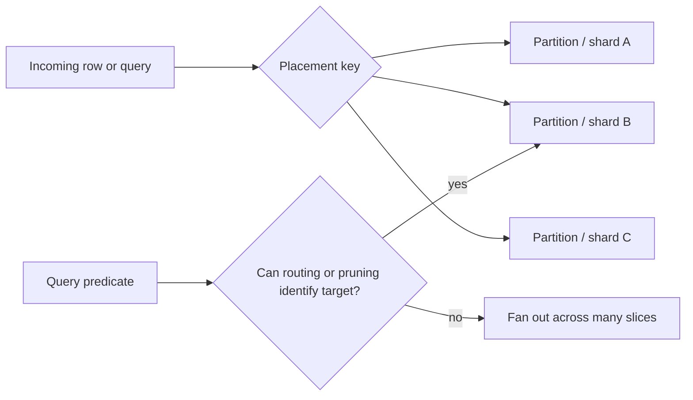
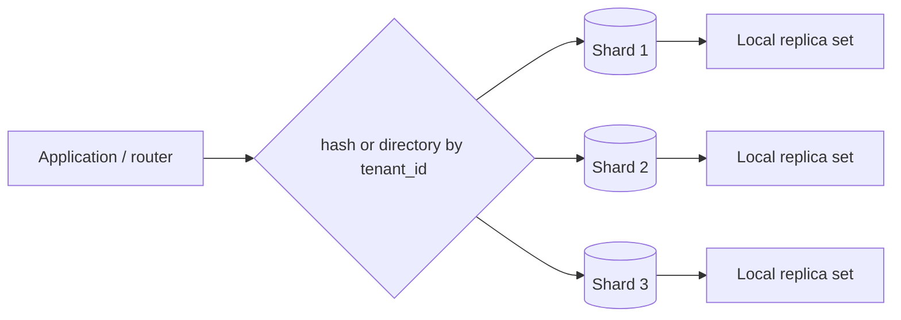
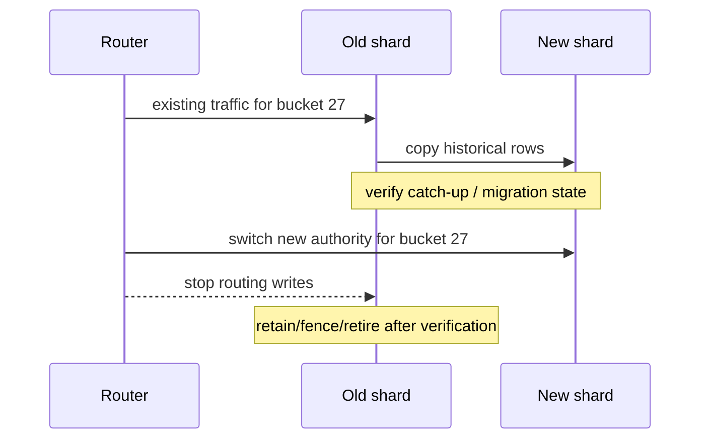

# Partitioning & Sharding: Reason About Data Placement

## TL;DR

Partitioning and sharding both answer a placement question:

> Which physical data slice owns this row, and which slices must a query touch?

But they operate at different boundaries.

```text
partitioning
  -> split one logical table into multiple physical partitions
  -> commonly stays inside one database system / cluster
  -> optimizer can prune irrelevant partitions when predicates match partition bounds

sharding
  -> split ownership across multiple database nodes or independent data domains
  -> routing becomes an application / middleware / distributed-database concern
  -> cross-shard reads and writes become distributed work
```

The key design rule is not “partition big tables” or “shard when traffic grows.” It is:

```text
choose placement key
  -> predict read/write routing
  -> identify hotspots and fan-out
  -> preserve integrity where possible
  -> define movement / resharding path
  -> measure whether the placement actually reduces work
```



<TermBox term="Data placement key">
A **data placement key** is the attribute or derived value used to decide where a row belongs.

Inside PostgreSQL declarative partitioning, that is the **partition key**. In a sharded architecture, the equivalent routing concept is often called the **shard key**.

**Why it matters:** the placement key determines locality. Queries aligned with it can touch a small subset of data; queries unrelated to it may need broad fan-out.
</TermBox>

## 1. Partitioning is physical organization behind one logical table

PostgreSQL declarative partitioning lets one logical table route rows into child partitions according to partition bounds.

The partitioned parent is virtual: the actual row storage lives in the partitions.

A simple time-partitioned table might look like:

```sql
CREATE TABLE events (
  tenant_id bigint NOT NULL,
  event_id bigint NOT NULL,
  occurred_at timestamptz NOT NULL,
  payload jsonb NOT NULL
) PARTITION BY RANGE (occurred_at);

CREATE TABLE events_2026_09
  PARTITION OF events
  FOR VALUES FROM ('2026-09-01') TO ('2026-10-01');
```

Inserts targeting the parent are routed according to the partition key. If no partition accepts the key and there is no suitable default partition, the insert fails.

Partitioning changes physical placement without requiring every ordinary query to name a child table directly.

## 2. Range, list, and hash partitioning encode different locality assumptions

PostgreSQL declarative partitioning supports three main strategies.

### Range partitioning

**Range partitioning** assigns non-overlapping ranges of a partition key.

```text
2026-07 -> partition A
2026-08 -> partition B
2026-09 -> partition C
```

It fits data with natural ordering and lifecycle boundaries, such as timestamps or numeric ranges.

Typical reasons include:

- queries frequently filter by time window;
- old data is retired in chunks;
- recent data has different access intensity;
- operational maintenance benefits from time-bounded slices.

### List partitioning

**List partitioning** maps explicit key values to partitions.

```text
region = 'apac' -> partition APAC
region = 'emea' -> partition EMEA
region = 'amer' -> partition AMER
```

It is useful when the value groups are known and meaningful, but operational complexity grows if the category set changes frequently.

### Hash partitioning

**Hash partitioning** maps rows using a modulus/remainder rule derived from the partition key.

It can spread rows more evenly when ordered ranges are not useful, but it gives up the intuitive lifecycle boundaries of range partitioning.

The strategy name is less important than the workload question:

> Which predicates and maintenance operations should be able to identify only a small subset of physical data?

## 3. Partition pruning is where placement can become query savings

<TermBox term="Partition pruning">
**Partition pruning** is the planner/executor optimization that proves some partitions cannot contain rows matching a query and excludes them from the scan.

**Why it matters:** partitioning does not automatically make a query faster. The query benefits only when its predicates let PostgreSQL eliminate irrelevant partitions or when smaller physical structures improve the remaining work.
</TermBox>

Suppose `events` is partitioned by `occurred_at`.

This query aligns with the partition key:

```sql
SELECT count(*)
FROM events
WHERE occurred_at >= '2026-09-01'
  AND occurred_at <  '2026-09-08';
```

PostgreSQL can use the partition bounds to prune partitions outside that time window.

But this query has no time predicate:

```sql
SELECT *
FROM events
WHERE tenant_id = 42;
```

If every time partition might contain tenant 42, partitioning by time alone does not tell the planner which partition is irrelevant. The query can still need many partitions.

```mermaid
flowchart TD
  Q1[WHERE occurred_at in September] --> P{Bounds prove location?}
  P -->|yes| S[Scan September partition(s)]
  Q2[WHERE tenant_id = 42] --> N{Time bound known?}
  N -->|no| A[Potentially scan many time partitions]
```

Use `EXPLAIN` / `EXPLAIN ANALYZE` to verify pruning instead of assuming it happened.

## 4. The best partition key usually follows important predicates or lifecycle boundaries

PostgreSQL's own partitioning guidance emphasizes choosing columns that commonly appear in query `WHERE` clauses when that lets partitions be pruned.

But query filtering is not the only reason.

A good partition key can also align with:

- deletion or archival boundaries;
- data-retention policies;
- maintenance windows;
- tenant or geography ownership;
- write distribution;
- operational isolation.

A time key is strong when the workload is time-shaped. A tenant key is strong when most work is tenant-scoped. A compound strategy can help when both dimensions matter, but sub-partitioning adds metadata and operational complexity.

Do not choose a key because it “looks evenly distributed” without checking whether the important queries can route or prune by it.

## 5. Partitioning and indexing solve different layers of the access problem

Partition pruning decides **which partitions need consideration**.

Indexes decide **how to find rows efficiently inside the partitions that remain**.

Those are complementary.

```text
query predicate
  -> prune partitions using partition bounds
  -> for surviving partition(s), choose index/scan access path
```

PostgreSQL documentation explicitly notes that partition pruning is driven by partition bounds, not by the presence of an index on the partition key.

A partition can still need indexes for its local query workload.

## 6. Too many partitions are not free

Partitioning reduces some data structures into smaller pieces, but every partition is also another database object with planning, locking, metadata, maintenance, index, and operational cost.

The wrong response to a large table is not:

```text
more partitions = always better
```

Instead reason about:

- average partitions touched per important query;
- total partition count;
- planner overhead;
- DDL/maintenance automation;
- indexes per partition;
- retention jobs;
- connection/query concurrency;
- observability by partition.

A daily partitioning scheme may be appropriate for a high-volume event store but absurd for a table with modest volume and ten-year retention if it creates thousands of mostly unnecessary partitions.

## 7. Partition maintenance should be designed before the table gets large

Time-based partitioning often exists partly so old data can be detached or dropped as a unit.

PostgreSQL supports operations such as `ATTACH PARTITION` and `DETACH PARTITION`; `DETACH PARTITION ... CONCURRENTLY` can use a reduced lock level compared with a non-concurrent detach, subject to documented restrictions.

This suggests an operational pattern:

```text
create future partition ahead of time
  -> ingest into known bounds
  -> observe size / query behavior
  -> detach old partition
  -> archive / transform / drop outside hot path
```

Avoid making the first partition-maintenance design during an incident when an insert is failing because tomorrow's partition does not exist.

## 8. Constraints reveal an important partitioning boundary

A common misconception is that a unique index on each child partition automatically guarantees global uniqueness across the whole logical table.

That is not generally true.

In PostgreSQL, a `UNIQUE` or `PRIMARY KEY` constraint on a partitioned table must include all partition-key columns, and the partition key cannot contain expressions/functions for this purpose. The reason is structural: child indexes directly enforce uniqueness only inside their own partitions, so the partition layout must make duplicates across partitions impossible.

Example:

```sql
CREATE TABLE orders (
  tenant_id bigint NOT NULL,
  order_id bigint NOT NULL,
  created_at timestamptz NOT NULL,
  PRIMARY KEY (tenant_id, order_id, created_at)
) PARTITION BY RANGE (created_at);
```

If the business invariant is instead “`order_id` alone is globally unique forever,” a time partition key creates a mismatch that needs an explicit solution rather than a hopeful local index.

This is a strong design signal:

> placement boundaries change where integrity can be enforced cheaply and locally.

## 9. Sharding moves the placement boundary across database nodes

<TermBox term="Shard key">
A **shard key** is the value used to route a row or request to an owning shard in a distributed data layout.

**Why it matters:** the shard key determines which work stays local to one database node and which work becomes distributed fan-out, cross-shard coordination, or data movement.
</TermBox>

Sharding is conceptually similar to partitioning but operationally more consequential.



Each shard can have its own storage, indexes, transaction log, replicas, failover state, and operational limits.

PostgreSQL core provides partitioning and foreign-data mechanisms, but an application should not assume that ordinary declarative partitioning magically provides a complete distributed-sharding control plane. Routing, rebalance, cross-node semantics, and failure handling depend on the chosen architecture or distributed database layer.

## 10. A good shard key maximizes locality for dominant transactions

Suppose a SaaS product stores projects, tasks, comments, and permissions.

If most operations are scoped to one tenant, `tenant_id` can be a powerful shard key because it co-locates a tenant's working set:

```text
tenant 42 -> shard B
  projects
  tasks
  comments
  memberships
```

Then common request paths can stay on one shard.

A random `project_id` shard key might distribute rows evenly, but a request that loads a tenant dashboard could scatter across many shards.

Evaluate candidate shard keys by:

- read locality;
- write locality;
- transaction locality;
- join locality;
- expected cardinality;
- skew / hotspot risk;
- tenant or entity growth;
- moveability during resharding;
- regulatory/geographic constraints.

Even distribution is useful, but locality is often the bigger correctness and cost lever.

## 11. Hotspots are the hidden failure mode of “natural” shard keys

A shard key can be perfectly easy to route and still distribute load badly.

Examples:

```text
shard by country
  -> one country generates 70% of traffic

shard by tenant_id
  -> one enterprise tenant generates 40% of writes

shard by date range
  -> all new writes hit the newest shard
```

This is a **hotspot** problem: one placement slice reaches CPU, I/O, connection, lock, or storage limits while other shards remain mostly idle.

Do not measure only row count balance. Measure load balance.

A “whale tenant” strategy might require dedicated placement, sub-sharding, bucket indirection, or a migration path that lets one logical tenant occupy multiple physical buckets without breaking application identity.

## 12. Fan-out turns a simple logical query into distributed work

When the router cannot identify one shard from the request, the system may need a scatter/gather pattern:

```text
query
  -> shard A
  -> shard B
  -> shard C
  -> merge / sort / aggregate results
```

This is **fan-out**.

Fan-out multiplies:

- network calls;
- tail-latency exposure;
- partial-failure cases;
- connection use;
- result merging;
- retry complexity;
- ordering/pagination difficulty.

A query that is cheap on one shard can become expensive when executed across 100 shards.

This is why “can route by shard key?” should be a first-class API/data-access review question.

## 13. Cross-shard transactions are a design smell to quantify, not a forbidden concept

A transaction touching two shards is not automatically wrong. But it has crossed the local atomicity boundary.

The system must now define what coordinates the write.

Possible strategies include:

- redesign ownership so the invariant is local to one shard;
- accept asynchronous workflows with idempotency and compensation;
- use a distributed transaction mechanism when its latency/availability/operational trade-offs are justified;
- centralize a small global invariant in a dedicated authority.

The dangerous design is accidental cross-shard work hidden behind a repository method that still looks like one local transaction.

Write the invariant first, then decide whether it can be colocated.

## 14. Global uniqueness becomes more expensive across shards

Within one PostgreSQL partitioned table, uniqueness has explicit partition-key constraints as described earlier.

Across independent shards, a local unique index only proves uniqueness **inside that shard**.

If the product requires a globally unique human-readable username, slug, or external identifier, common patterns include:

- route that identifier deterministically to one owning shard;
- reserve it in a global directory/authority;
- generate identifiers with collision properties that do not require central lookup;
- scope uniqueness to tenant/shard when the product semantics allow it.

Never infer global uniqueness from “every shard has a unique index.”

## 15. Resharding is part of the initial design, not future cleanup

Growth changes placement assumptions.

A shard that once held 10 million rows can later become too large or too hot. A tenant distribution can become skewed. Hardware shape can change. Regions can be added.

A resharding plan needs answers for:

```text
how is new ownership represented?
how are reads routed during movement?
where do new writes go during movement?
how is copied data verified?
how are dual writes avoided or reconciled?
when is old ownership fenced?
how is rollback performed?
```

A routing directory or virtual-bucket layer can make movement easier because logical ownership does not need to equal physical node identity forever.



The exact migration protocol depends on the datastore, but the authority-transfer problem exists in every resharding system.

## 16. Partitioning and sharding can be combined

A shard may still contain partitioned tables.

For example:

```text
route by tenant bucket -> choose shard
inside shard -> partition events by month
inside monthly partition -> use indexes for local predicates
```

That can be powerful because each layer solves a different placement problem:

- sharding spreads ownership across nodes;
- partitioning organizes one shard's large logical table;
- indexing narrows access inside the surviving physical slice.

But every layer adds operational state. Use the minimum number of placement dimensions that solve measured constraints.

## 17. Production scenario: time partitioning helps retention but breaks tenant locality

A multi-tenant audit platform stores billions of events. The team partitions by month because retention is 13 months and deleting old monthly partitions is operationally convenient.

Later, nearly every interactive request becomes:

```sql
SELECT ...
FROM events
WHERE tenant_id = $1
ORDER BY occurred_at DESC
LIMIT 100;
```

Many requests do not have a bounded time predicate because the UI asks for “latest events for this tenant.” At the same time, one enterprise tenant produces much more traffic than all others.

The team then proposes sharding only by month, assuming “we already partition by time, so the same key should scale out.”

**Impact:** tenant reads fan out across many monthly slices, old/current boundaries complicate pagination, the newest shard becomes the write hotspot, and the largest tenant can still dominate the active month. The retention-friendly key does not provide tenant locality.

**Root cause:** one placement dimension was expected to solve two different problems. Time range is excellent for lifecycle management, but the dominant online workload is tenant-scoped and skewed. The design optimized partition maintenance before modeling request routing and future shard ownership.

**Correct pattern:** keep time partitioning where it materially simplifies retention, but design shard ownership around the dominant transaction/read locality such as tenant or virtual tenant buckets. Give very large tenants an escape hatch, preserve time as a secondary partitioning dimension within a shard when useful, and verify with `EXPLAIN` plus routing telemetry that ordinary requests touch the intended number of partitions/shards.

## 18. Review data placement with a routing worksheet

For each important operation, record:

```text
operation                 placement key known?  slices touched  invariant scope
create tenant task        yes: tenant_id        1               one tenant
load tenant recent events yes: tenant_id        1 shard         one tenant
search all tenants        no                    many            read-only fan-out
reserve global username   maybe global owner    1 authority     global uniqueness
monthly retention         time boundary         partition set   lifecycle
```

This turns “we use sharding” into concrete evidence.

Also monitor:

- rows/bytes per partition and shard;
- QPS/write rate per shard;
- top keys by load;
- partitions/shards touched per request;
- pruning effectiveness;
- fan-out tail latency;
- cross-shard transaction frequency;
- migration/resharding progress;
- routing errors and unknown-key fallbacks.

## Self-check: did partitioning by time make tenant queries selective?

An `events` table is partitioned monthly by `occurred_at`.

A query runs:

```sql
SELECT *
FROM events
WHERE tenant_id = 42;
```

There is an index on `tenant_id` in every monthly partition.

Can the application conclude that PostgreSQL will prune all but one monthly partition?

<details>
<summary>Show the reasoning</summary>

No. Partition pruning is based on the partition bounds. Because the query does not constrain `occurred_at`, every monthly partition may contain rows for tenant 42, so the partition key does not prove that most partitions can be skipped.

The per-partition `tenant_id` indexes can still make the local scan inside each touched partition cheaper, but indexing and partition pruning are different mechanisms.

If tenant-scoped queries dominate, the design should reconsider whether time alone is the right placement dimension, whether requests can supply a useful time bound, or whether tenant-based sharding/partitioning should be introduced at another layer.
</details>

## Production checklist

- [ ] **Goal:** write whether partitioning exists for query pruning, retention, maintenance, isolation, or another measured reason.
- [ ] **Partition key:** choose a key aligned with important predicates and/or lifecycle boundaries.
- [ ] **Pruning evidence:** use `EXPLAIN` / `EXPLAIN ANALYZE` to verify irrelevant partitions are actually pruned.
- [ ] **Indexes:** design indexes for the surviving partitions; do not confuse indexing with pruning.
- [ ] **Partition count:** bound planning/metadata/maintenance cost instead of assuming more partitions are better.
- [ ] **Future partitions:** automate creation/attachment before incoming rows reach new bounds.
- [ ] **Retention:** make detach/drop/archive behavior an explicit lifecycle procedure.
- [ ] **Uniqueness:** verify whether required unique/primary-key invariants are enforceable with the chosen partition key.
- [ ] **Shard key:** choose a routing key that maximizes locality for dominant reads, writes, joins, and transactions.
- [ ] **Skew:** measure load by key and shard, not only row counts.
- [ ] **Hotspot escape hatch:** define how unusually large keys/tenants can move or split.
- [ ] **Fan-out:** observe how many shards each request touches and budget for tail latency/partial failure.
- [ ] **Cross-shard invariants:** make distributed coordination explicit rather than accidental.
- [ ] **Global uniqueness:** define the authority that proves uniqueness across shards.
- [ ] **Resharding:** document authority transfer, routing cutover, verification, rollback, and fencing before it is urgent.
- [ ] **Layering:** use sharding, partitioning, and indexing for distinct measured problems rather than stacking them by default.

## Agent rule

When proposing partitioning or sharding, do not start with the number of partitions or shards. Start with the dominant operations and invariants. Name the placement key, show how each important request routes, state how many slices it touches, identify hotspot and global-integrity risks, and explain how ownership can move later. Treat a placement scheme as successful only when routing/pruning evidence shows that it reduces the intended work.

## Sources

- [PostgreSQL 18 — Table Partitioning](https://www.postgresql.org/docs/18/ddl-partitioning.html)
- [PostgreSQL 18 — Constraints](https://www.postgresql.org/docs/18/ddl-constraints.html)
- [PostgreSQL 18 — Foreign Data](https://www.postgresql.org/docs/18/ddl-foreign-data.html)
- [PostgreSQL 18 — postgres_fdw](https://www.postgresql.org/docs/18/postgres-fdw.html)
- [PostgreSQL 18 — ALTER TABLE](https://www.postgresql.org/docs/18/sql-altertable.html)
