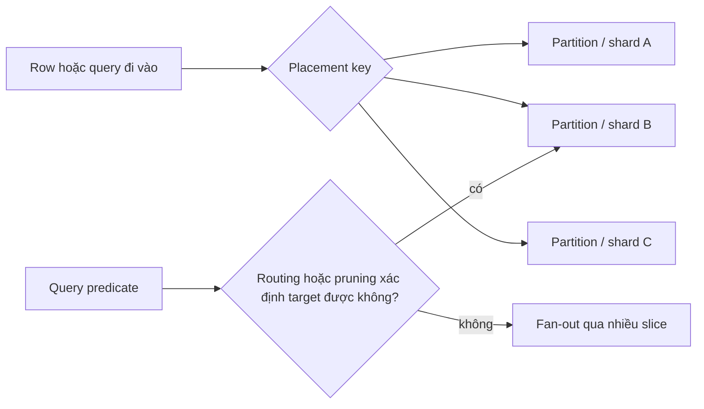
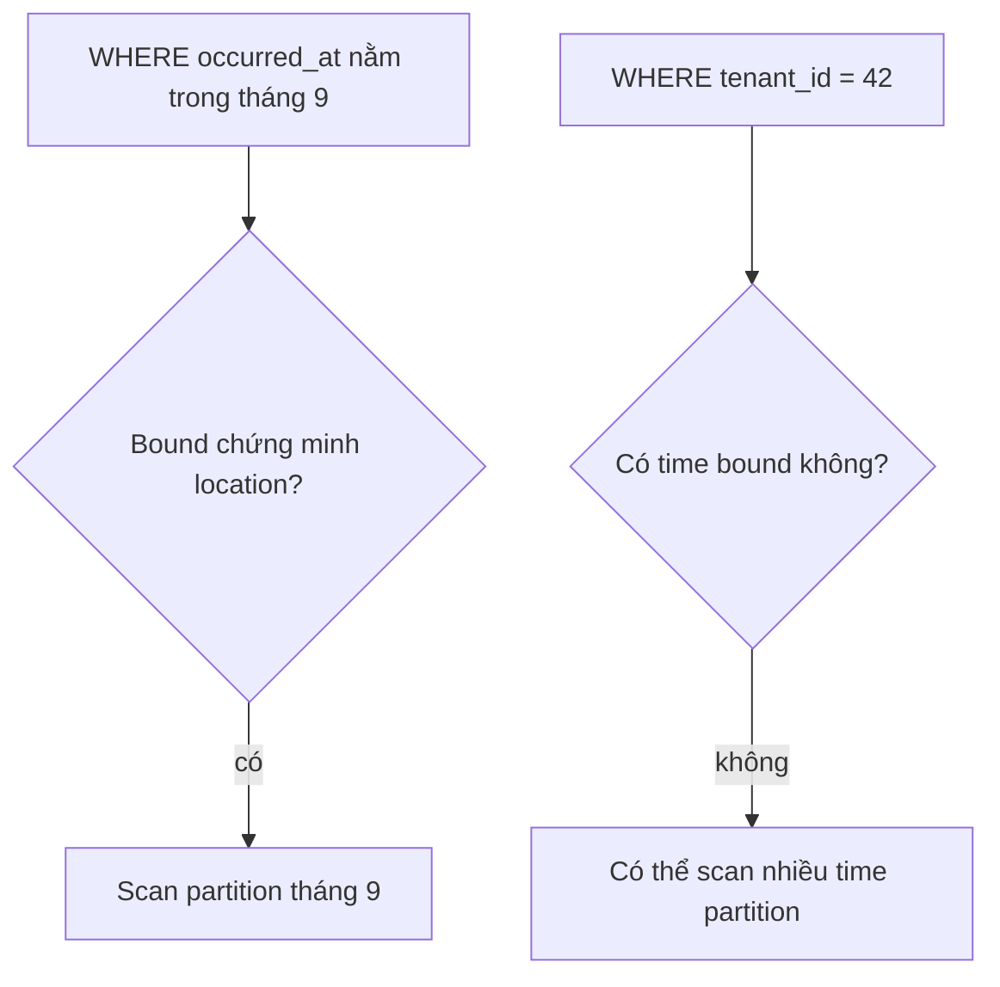
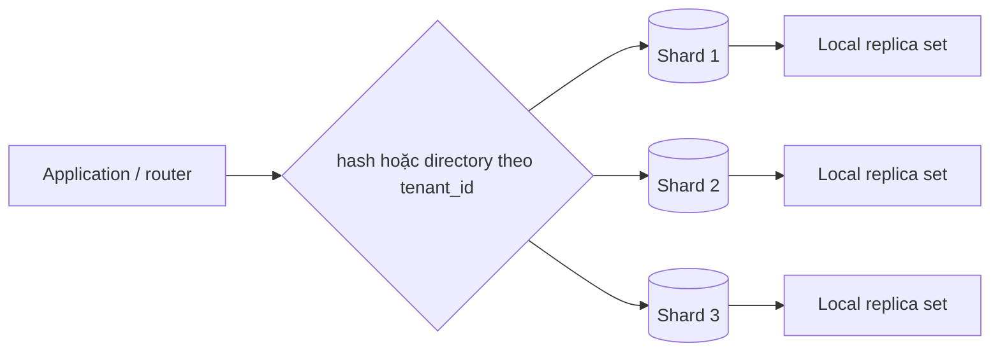
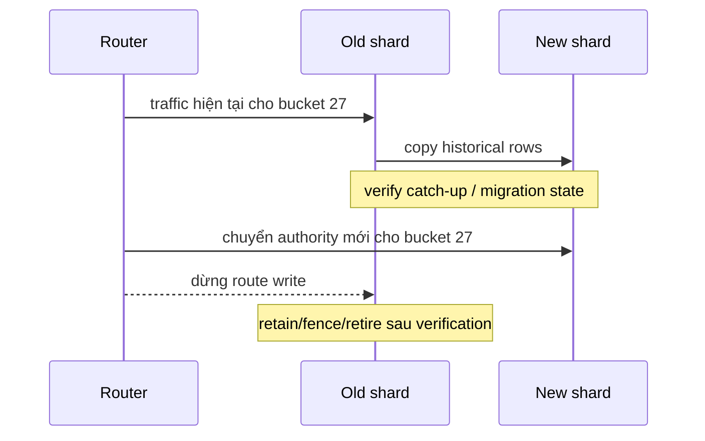

# Partitioning & Sharding: Suy luận về Cách đặt Dữ liệu

## Tóm tắt

Partitioning và sharding đều trả lời một câu hỏi về placement:

> Physical data slice nào sở hữu row này, và query phải chạm vào những slice nào?

Nhưng chúng hoạt động ở hai ranh giới khác nhau.

```text
partitioning
  -> chia một logical table thành nhiều physical partition
  -> thường vẫn ở trong một database system / cluster
  -> optimizer có thể prune partition không liên quan khi predicate khớp partition bound

sharding
  -> chia ownership qua nhiều database node hoặc data domain độc lập
  -> routing trở thành trách nhiệm của application / middleware / distributed database
  -> read và write liên shard trở thành distributed work
```

Quy tắc thiết kế không phải “table lớn thì partition” hay “traffic tăng thì shard”. Quy tắc là:

```text
chọn placement key
  -> dự đoán read/write routing
  -> nhận diện hotspot và fan-out
  -> giữ integrity local ở nơi có thể
  -> định nghĩa đường đi khi move / reshard
  -> đo xem placement có thật sự giảm work không
```



<TermBox term="Data placement key">
**Data placement key** là attribute hoặc derived value dùng để quyết định row thuộc về đâu.

Trong declarative partitioning của PostgreSQL, đó là **khóa phân vùng**. Trong kiến trúc sharded, khái niệm routing tương đương thường được gọi là **khóa shard**.

**Vì sao quan trọng:** placement key quyết định locality. Query align với key có thể chỉ chạm một phần nhỏ dữ liệu; query không liên quan tới key có thể phải fan-out rộng.
</TermBox>

## 1. Partitioning là tổ chức vật lý phía sau một logical table

Declarative partitioning của PostgreSQL cho phép một logical table route row vào các child partition theo partition bound.

Partitioned parent là virtual: row thật được lưu trong các partition.

Ví dụ table event partition theo thời gian:

```sql
CREATE TABLE events (
  tenant_id bigint NOT NULL,
  event_id bigint NOT NULL,
  occurred_at timestamptz NOT NULL,
  payload jsonb NOT NULL
) PARTITION BY RANGE (occurred_at);

CREATE TABLE events_2026_09
  PARTITION OF events
  FOR VALUES FROM ('2026-09-01') TO ('2026-10-01');
```

Insert vào parent sẽ được route theo khóa phân vùng. Nếu không partition nào nhận key đó và cũng không có default partition phù hợp, insert sẽ fail.

Partitioning thay đổi physical placement mà không bắt ordinary query phải gọi tên từng child table.

## 2. Range, list và hash partitioning mã hóa các giả định locality khác nhau

PostgreSQL declarative partitioning hỗ trợ ba strategy chính.

### Phân vùng theo range

**Phân vùng theo range** chia các range không overlap của partition key.

```text
2026-07 -> partition A
2026-08 -> partition B
2026-09 -> partition C
```

Nó phù hợp khi dữ liệu có trật tự tự nhiên và lifecycle boundary rõ, như timestamp hoặc numeric range.

Lý do thường gặp:

- query hay filter theo time window;
- dữ liệu cũ được retire theo chunk;
- dữ liệu mới có access intensity khác dữ liệu cũ;
- maintenance hưởng lợi từ slice có time bound rõ.

### Phân vùng theo list

**Phân vùng theo list** map explicit key value vào partition.

```text
region = 'apac' -> partition APAC
region = 'emea' -> partition EMEA
region = 'amer' -> partition AMER
```

Nó hữu ích khi value group đã biết và có ý nghĩa nghiệp vụ, nhưng complexity tăng nếu category set thay đổi liên tục.

### Phân vùng theo hash

**Phân vùng theo hash** map row theo modulus/remainder rule sinh từ partition key.

Nó có thể dàn row đều hơn khi ordered range không hữu ích, nhưng mất lifecycle boundary trực quan của range partitioning.

Tên strategy ít quan trọng hơn câu hỏi workload:

> Predicate và maintenance operation nào cần xác định được chỉ một subset nhỏ physical data?

## 3. Partition pruning là nơi placement có thể biến thành query saving

<TermBox term="Partition pruning">
**Partition pruning** là optimization nơi planner/executor chứng minh một số partition không thể chứa row thỏa query và loại chúng khỏi scan.

**Vì sao quan trọng:** partitioning không tự động làm query nhanh hơn. Query chỉ hưởng lợi khi predicate giúp PostgreSQL loại bỏ partition không liên quan, hoặc khi physical structure nhỏ hơn làm phần work còn lại rẻ hơn.
</TermBox>

Giả sử `events` partition theo `occurred_at`.

Query này align với partition key:

```sql
SELECT count(*)
FROM events
WHERE occurred_at >= '2026-09-01'
  AND occurred_at <  '2026-09-08';
```

PostgreSQL có thể dùng partition bound để prune partition ngoài time window đó.

Nhưng query này không có time predicate:

```sql
SELECT *
FROM events
WHERE tenant_id = 42;
```

Nếu mọi time partition đều có thể chứa tenant 42, partitioning theo time không giúp planner chứng minh partition nào không liên quan. Query vẫn có thể phải chạm nhiều partition.



Dùng `EXPLAIN` / `EXPLAIN ANALYZE` để xác nhận pruning thay vì giả định nó xảy ra.

## 4. Partition key tốt thường đi theo predicate quan trọng hoặc lifecycle boundary

Guidance của PostgreSQL nhấn mạnh việc chọn column thường xuất hiện trong `WHERE` clause khi điều đó cho phép prune partition.

Nhưng query filtering không phải lý do duy nhất.

Một partition key tốt còn có thể align với:

- deletion hoặc archival boundary;
- data-retention policy;
- maintenance window;
- tenant hoặc geography ownership;
- write distribution;
- operational isolation.

Time key mạnh khi workload có hình dạng theo thời gian. Tenant key mạnh khi phần lớn work tenant-scoped. Compound strategy có thể hữu ích khi cả hai dimension quan trọng, nhưng sub-partitioning thêm metadata và operational complexity.

Đừng chọn key chỉ vì “trông phân phối đều” nếu important query không route hoặc prune được bằng key đó.

## 5. Partitioning và indexing giải quyết hai tầng khác nhau của access problem

Partition pruning quyết định **partition nào cần được xét**.

Index quyết định **cách tìm row hiệu quả bên trong partition còn lại**.

Hai cơ chế bổ sung nhau.

```text
query predicate
  -> prune partition bằng partition bound
  -> trên partition còn lại, chọn index/scan access path
```

PostgreSQL ghi rõ partition pruning dựa trên partition bound, không dựa vào việc partition key có index hay không.

Mỗi partition vẫn có thể cần index cho local query workload của nó.

## 6. Quá nhiều partition không miễn phí

Partitioning chia data structure thành phần nhỏ hơn, nhưng mỗi partition cũng là database object có cost về planning, locking, metadata, maintenance, index và vận hành.

Phản xạ sai với table lớn là:

```text
càng nhiều partition càng tốt
```

Thay vào đó, hãy suy luận về:

- số partition trung bình mỗi important query chạm tới;
- tổng partition count;
- planner overhead;
- DDL/maintenance automation;
- index trên mỗi partition;
- retention job;
- connection/query concurrency;
- observability theo partition.

Partition theo ngày có thể hợp lý với high-volume event store nhưng vô lý với table volume vừa phải và retention mười năm nếu nó tạo hàng nghìn partition gần như không cần thiết.

## 7. Partition maintenance phải được thiết kế trước khi table phình lớn

Time-based partitioning thường tồn tại một phần vì old data có thể detach hoặc drop theo cả unit.

PostgreSQL hỗ trợ `ATTACH PARTITION` và `DETACH PARTITION`; `DETACH PARTITION ... CONCURRENTLY` có thể dùng lock level thấp hơn non-concurrent detach, tùy các restriction được document.

Operational pattern hữu ích:

```text
tạo future partition sớm
  -> ingest vào bound đã biết
  -> quan sát size / query behavior
  -> detach old partition
  -> archive / transform / drop ngoài hot path
```

Đừng để lần đầu thiết kế maintenance xảy ra trong incident khi insert fail vì partition của ngày mai chưa tồn tại.

## 8. Constraint cho thấy một ranh giới quan trọng của partitioning

Một hiểu lầm phổ biến là unique index trên từng child partition tự động chứng minh global uniqueness trên toàn logical table.

Điều đó nhìn chung không đúng.

Trong PostgreSQL, `UNIQUE` hoặc `PRIMARY KEY` constraint trên partitioned table phải chứa toàn bộ partition-key column; partition key cũng không được dùng expression/function cho constraint loại này. Lý do mang tính cấu trúc: child index trực tiếp enforce uniqueness chỉ trong partition của nó, nên partition layout phải làm duplicate xuyên partition trở nên bất khả thi.

Ví dụ:

```sql
CREATE TABLE orders (
  tenant_id bigint NOT NULL,
  order_id bigint NOT NULL,
  created_at timestamptz NOT NULL,
  PRIMARY KEY (tenant_id, order_id, created_at)
) PARTITION BY RANGE (created_at);
```

Nếu business invariant thật sự là “`order_id` một mình phải duy nhất toàn cục vĩnh viễn,” time partition key tạo ra mismatch cần solution tường minh chứ không thể dựa vào local unique index.

Đây là design signal quan trọng:

> Placement boundary thay đổi nơi integrity có thể được enforce rẻ và local.

## 9. Sharding đẩy placement boundary qua nhiều database node

<TermBox term="Shard key">
**Khóa shard** là value dùng để route row hoặc request tới shard sở hữu nó trong distributed data layout.

**Vì sao quan trọng:** shard key quyết định work nào giữ local trên một database node và work nào biến thành distributed fan-out, coordination liên shard hoặc data movement.
</TermBox>

Sharding giống partitioning ở mặt khái niệm nhưng có hậu quả vận hành lớn hơn.



Mỗi shard có thể có storage, index, transaction log, replica, failover state và operational limit riêng.

PostgreSQL core có partitioning và foreign-data mechanism, nhưng application không nên giả định ordinary declarative partitioning tự nhiên biến thành complete distributed-sharding control plane. Routing, rebalance, cross-node semantics và failure handling phụ thuộc kiến trúc hoặc distributed database layer được chọn.

## 10. Shard key tốt tối đa locality cho dominant transaction

Giả sử SaaS product lưu project, task, comment và permission.

Nếu phần lớn operation scoped theo tenant, `tenant_id` có thể là shard key mạnh vì co-locate working set của một tenant:

```text
tenant 42 -> shard B
  projects
  tasks
  comments
  memberships
```

Common request path khi đó có thể ở trong một shard.

Một random `project_id` shard key có thể dàn row đều, nhưng request load tenant dashboard có thể phải scatter qua nhiều shard.

Đánh giá candidate shard key theo:

- read locality;
- write locality;
- transaction locality;
- join locality;
- expected cardinality;
- skew / hotspot risk;
- tốc độ tăng của tenant hoặc entity;
- khả năng move khi reshard;
- regulatory/geographic constraint.

Even distribution hữu ích, nhưng locality thường là leverage lớn hơn về correctness và cost.

## 11. Hotspot là failure mode ẩn của “natural” shard key

Shard key có thể cực kỳ dễ route nhưng vẫn phân phối load rất tệ.

Ví dụ:

```text
shard theo country
  -> một country tạo 70% traffic

shard theo tenant_id
  -> một enterprise tenant tạo 40% write

shard theo date range
  -> toàn bộ write mới đổ vào newest shard
```

Đây là **hotspot**: một placement slice chạm giới hạn CPU, I/O, connection, lock hoặc storage trong khi shard khác gần như nhàn rỗi.

Đừng chỉ đo row-count balance. Hãy đo load balance.

Chiến lược cho “whale tenant” có thể cần dedicated placement, sub-sharding, bucket indirection hoặc migration path cho phép một logical tenant dùng nhiều physical bucket mà không phá application identity.

## 12. Fan-out biến logical query đơn giản thành distributed work

Khi router không xác định được một shard từ request, hệ thống có thể phải dùng scatter/gather:

```text
query
  -> shard A
  -> shard B
  -> shard C
  -> merge / sort / aggregate result
```

Đây là **fan-out** hay quét nhiều shard.

Fan-out nhân lên:

- network call;
- tail-latency exposure;
- partial-failure case;
- connection use;
- result merging;
- retry complexity;
- ordering/pagination difficulty.

Query rẻ trên một shard có thể trở nên đắt khi chạy qua 100 shard.

Vì vậy “có route được bằng shard key không?” phải là câu hỏi first-class trong API/data-access review.

## 13. Transaction liên shard là design smell cần đo, không phải khái niệm bị cấm

Transaction chạm hai shard không tự động sai. Nhưng nó đã vượt local atomicity boundary.

Hệ thống bây giờ phải nói rõ ai coordinate write.

Một số hướng:

- redesign ownership để invariant local trong một shard;
- chấp nhận asynchronous workflow với idempotency và compensation;
- dùng distributed transaction mechanism khi latency/availability/operational trade-off hợp lý;
- centralize một global invariant nhỏ vào dedicated authority.

Thiết kế nguy hiểm là cross-shard work xảy ra ngầm phía sau repository method vẫn trông như một local transaction.

Viết invariant trước, rồi quyết định nó có thể co-locate hay không.

## 14. Global uniqueness đắt hơn qua các shard độc lập

Trong một PostgreSQL partitioned table, uniqueness có partition-key restriction tường minh như phần trước.

Qua các independent shard, local unique index chỉ chứng minh **duy nhất bên trong shard đó**.

Nếu product cần globally unique human-readable username, slug hoặc external identifier, pattern thường gặp gồm:

- route identifier đó deterministically tới một owning shard;
- reserve nó tại global directory/authority;
- sinh identifier có collision property không cần central lookup;
- scope uniqueness theo tenant/shard nếu product semantics cho phép.

Đừng suy ra global uniqueness từ câu “mỗi shard đều có unique index.”

## 15. Resharding là một phần của initial design, không phải cleanup về sau

Growth làm thay đổi placement assumption.

Shard từng chứa 10 triệu row có thể về sau quá lớn hoặc quá nóng. Tenant distribution có thể skew. Hardware shape có thể đổi. Region mới có thể được thêm.

Kế hoạch resharding phải trả lời:

```text
ownership mới được biểu diễn thế nào?
read route ra sao trong lúc move?
new write đi đâu trong lúc move?
copied data được verify thế nào?
dual write được tránh hoặc reconcile ra sao?
khi nào old ownership bị fence?
rollback bằng cách nào?
```

Routing directory hoặc virtual-bucket layer có thể làm movement dễ hơn vì logical ownership không cần đồng nhất với physical node identity mãi mãi.



Exact migration protocol phụ thuộc datastore, nhưng bài toán authority transfer tồn tại trong mọi resharding system.

## 16. Partitioning và sharding có thể kết hợp

Một shard vẫn có thể chứa partitioned table.

Ví dụ:

```text
route theo tenant bucket -> chọn shard
trong shard -> partition events theo tháng
trong monthly partition -> dùng index cho local predicate
```

Cách này mạnh vì mỗi layer giải quyết một placement problem khác nhau:

- sharding phân ownership qua nhiều node;
- partitioning tổ chức logical table lớn trong một shard;
- indexing thu hẹp access trong physical slice còn lại.

Nhưng mỗi layer thêm operational state. Dùng ít placement dimension nhất có thể để giải quyết measured constraint.

## 17. Tình huống production: time partitioning giúp retention nhưng phá tenant locality

Một multi-tenant audit platform lưu hàng tỷ event. Team partition theo tháng vì retention là 13 tháng và drop old monthly partition rất tiện vận hành.

Sau đó gần như mọi interactive request thành:

```sql
SELECT ...
FROM events
WHERE tenant_id = $1
ORDER BY occurred_at DESC
LIMIT 100;
```

Nhiều request không có bounded time predicate vì UI hỏi “latest events của tenant này”. Đồng thời một enterprise tenant tạo traffic cao hơn rất nhiều tenant khác.

Team tiếp tục đề xuất shard chỉ theo tháng, với giả định “đã partition theo time thì dùng luôn key đó khi scale out.”

**Hậu quả:** tenant read fan-out qua nhiều monthly slice, boundary giữa old/current partition làm pagination phức tạp, newest shard trở thành write hotspot, và tenant lớn nhất vẫn có thể thống trị active month. Key tốt cho retention không tạo tenant locality.

**Nguyên nhân cốt lõi:** một placement dimension bị kỳ vọng giải quyết hai problem khác nhau. Time range rất tốt cho lifecycle management, nhưng dominant online workload lại tenant-scoped và skewed. Thiết kế tối ưu partition maintenance trước khi model request routing và future shard ownership.

**Cách khắc phục chuẩn:** giữ time partitioning khi nó thật sự đơn giản hóa retention, nhưng thiết kế shard ownership theo dominant transaction/read locality như tenant hoặc virtual tenant bucket. Cho tenant cực lớn một escape hatch, giữ time như secondary partitioning dimension bên trong shard khi hữu ích, và verify bằng `EXPLAIN` cộng routing telemetry rằng ordinary request chạm đúng số partition/shard dự kiến.

## 18. Review data placement bằng routing worksheet

Với mỗi important operation, ghi lại:

```text
operation                 biết placement key?  slice chạm tới  invariant scope
create tenant task        có: tenant_id        1              một tenant
load recent tenant events có: tenant_id        1 shard        một tenant
search all tenants        không                nhiều          read-only fan-out
reserve global username   global owner         1 authority    global uniqueness
monthly retention         time boundary        partition set  lifecycle
```

Cách này biến câu “chúng ta dùng sharding” thành concrete evidence.

Cũng nên monitor:

- row/byte trên mỗi partition và shard;
- QPS/write rate mỗi shard;
- top key theo load;
- số partition/shard mỗi request chạm;
- pruning effectiveness;
- fan-out tail latency;
- tần suất cross-shard transaction;
- migration/resharding progress;
- routing error và unknown-key fallback.

## Tự kiểm tra: partition theo time có làm tenant query selective không?

Table `events` partition theo tháng bằng `occurred_at`.

Query chạy:

```sql
SELECT *
FROM events
WHERE tenant_id = 42;
```

Mỗi monthly partition đều có index trên `tenant_id`.

Application có thể kết luận PostgreSQL sẽ loại bỏ partition và chỉ scan một monthly partition không?

<details>
<summary>Xem giải thích chi tiết</summary>

Không. Partition pruning dựa trên partition bound. Vì query không constrain `occurred_at`, mọi monthly partition đều có thể chứa row của tenant 42, nên khóa phân vùng không chứng minh được rằng phần lớn partition có thể bỏ qua.

Index `tenant_id` trên từng partition vẫn có thể làm local scan trong mỗi partition được chạm rẻ hơn, nhưng indexing và partition pruning là hai mechanism khác nhau.

Nếu tenant-scoped query là dominant workload, design cần xem lại time một mình có phải placement dimension phù hợp không, request có thể cung cấp time bound hữu ích không, hoặc tenant-based sharding/partitioning nên được thêm ở layer khác.
</details>

## Checklist production

- [ ] **Mục tiêu:** ghi rõ partitioning phục vụ query pruning, retention, maintenance, isolation hay measured reason nào khác.
- [ ] **Khóa phân vùng:** chọn key align với important predicate và/hoặc lifecycle boundary.
- [ ] **Bằng chứng pruning:** dùng `EXPLAIN` / `EXPLAIN ANALYZE` để verify partition không liên quan thật sự được prune.
- [ ] **Index:** thiết kế index cho partition còn lại; không nhầm indexing với pruning.
- [ ] **Partition count:** giới hạn planning/metadata/maintenance cost thay vì mặc định càng nhiều partition càng tốt.
- [ ] **Future partition:** automate creation/attachment trước khi incoming row chạm new bound.
- [ ] **Retention:** biến detach/drop/archive thành lifecycle procedure tường minh.
- [ ] **Uniqueness:** verify required unique/primary-key invariant có enforce được với partition key đã chọn không.
- [ ] **Khóa shard:** chọn routing key tối đa locality cho dominant read, write, join và transaction.
- [ ] **Skew:** đo load theo key và shard, không chỉ row count.
- [ ] **Hotspot escape hatch:** định nghĩa cách unusually large key/tenant có thể move hoặc split.
- [ ] **Fan-out:** quan sát số shard mỗi request chạm và budget cho tail latency/partial failure.
- [ ] **Invariant liên shard:** làm distributed coordination tường minh thay vì accidental.
- [ ] **Global uniqueness:** xác định authority chứng minh uniqueness qua các shard.
- [ ] **Resharding:** document authority transfer, routing cutover, verification, rollback và fencing trước khi khẩn cấp.
- [ ] **Layering:** dùng sharding, partitioning và indexing cho các measured problem khác nhau thay vì stack mặc định.

## Quy tắc cho agent

Khi đề xuất partitioning hoặc sharding, đừng bắt đầu bằng số partition hay shard. Hãy bắt đầu bằng dominant operation và invariant. Gọi tên placement key, cho thấy mỗi important request route thế nào, nói rõ nó chạm bao nhiêu slice, nhận diện hotspot và global-integrity risk, và giải thích ownership có thể move sau này bằng cách nào. Chỉ xem placement scheme là thành công khi routing/pruning evidence cho thấy nó giảm đúng loại work dự kiến.

## Nguồn tham khảo

- [PostgreSQL 18 — Table Partitioning](https://www.postgresql.org/docs/18/ddl-partitioning.html)
- [PostgreSQL 18 — Constraints](https://www.postgresql.org/docs/18/ddl-constraints.html)
- [PostgreSQL 18 — Foreign Data](https://www.postgresql.org/docs/18/ddl-foreign-data.html)
- [PostgreSQL 18 — postgres_fdw](https://www.postgresql.org/docs/18/postgres-fdw.html)
- [PostgreSQL 18 — ALTER TABLE](https://www.postgresql.org/docs/18/sql-altertable.html)
