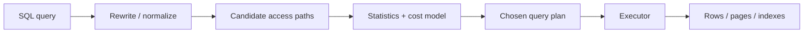
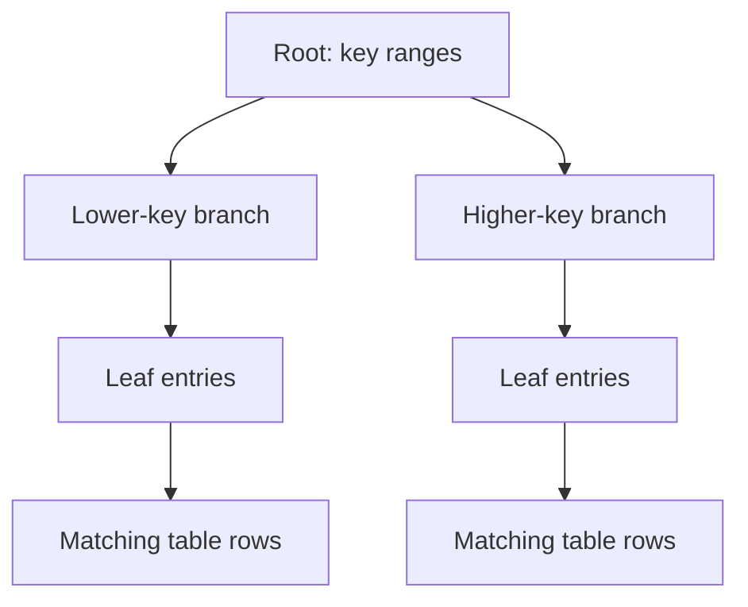
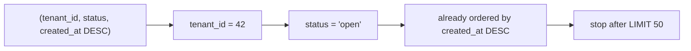

# Database Indexes & Query Plans: Choose Access Paths with Evidence

## TL;DR

An index does not make a query fast by itself. It gives the database another **access path**. The query planner compares available paths using table statistics and a cost model, then chooses the plan it expects to be cheapest.

Operate with three habits:

1. shape indexes around real predicates, ordering, limits, and projections;
2. inspect the chosen plan instead of assuming an index will be used;
3. compare estimated rows with actual rows before changing schema or planner settings.

## One mental model: the index is a route, the plan is the chosen route



A table scan, an index scan, a bitmap path, and an index-only scan are not success or failure labels. They are different ways to satisfy the same relational request.

<TermBox term="Selectivity">
**Selectivity** describes how narrowly a predicate filters rows. A highly selective predicate matches a small fraction of a table; a weakly selective predicate matches many rows.

**Why it matters here:** an index lookup has navigation and random-access costs. If a query needs a large share of the table, reading the table more directly can be cheaper than bouncing through an index and then fetching many heap rows.
</TermBox>

## Why a sequential scan can be the correct plan

Suppose `orders` has millions of rows, but most rows are `status = 'completed'`.

```sql
SELECT id, customer_id, total_cents
FROM orders
WHERE status = 'completed';
```

An index on `status` exists. That does **not** imply the planner should use it. If the predicate returns most of the table, a sequential scan can be cheaper because the executor is going to touch a large amount of table data anyway.

Contrast that with a narrow lookup:

```sql
SELECT id, customer_id, total_cents
FROM orders
WHERE id = 918273;
```

A B-tree index on a unique identifier is a natural candidate because the lookup is highly selective.

The useful question is not “why is PostgreSQL ignoring my index?” Start with:

> Given the estimated number of rows and the cost of fetching them, why did the planner prefer this access path?

## B-tree indexes: narrow the search space, then fetch rows

PostgreSQL B-tree indexes are the default index type and support common equality and range comparisons. Conceptually, the index keeps ordered keys that help the executor narrow the part of the index it must inspect.



This diagram is a mental model, not a physical page-layout specification. Real indexes have page splits, fill factors, internal pages, concurrency behavior, and storage details that matter at deeper levels.

### Composite indexes encode an order of usefulness

For a query such as:

```sql
SELECT id, total_cents, created_at
FROM orders
WHERE tenant_id = 42
  AND status = 'open'
ORDER BY created_at DESC
LIMIT 50;
```

this index matches the query shape well:

```sql
CREATE INDEX orders_open_feed_idx
ON orders (tenant_id, status, created_at DESC)
INCLUDE (id, total_cents);
```



<TermBox term="Composite index">
A **composite (multicolumn) index** indexes more than one key column in a defined order.

**Why it matters here:** for a B-tree, equality constraints on leading columns are especially effective at narrowing the scanned portion. A following range or ordering column can then shape how much of the remaining index must be visited. PostgreSQL can sometimes use later columns in additional ways, so treat “leftmost prefix” as a working heuristic rather than an absolute planner law; verify the actual plan.
</TermBox>

The query and index align on four dimensions:

- `tenant_id` narrows to one tenant;
- `status` narrows within that tenant;
- `created_at DESC` can satisfy the requested order;
- `LIMIT 50` lets execution stop early once enough rows are found.

`INCLUDE` columns are payload, not search keys. They can help an index cover a query, but they also make the index larger.

## Read a plan as a hypothesis about work

Start with `EXPLAIN` when you only want the estimated plan:

```sql
EXPLAIN
SELECT id, total_cents, created_at
FROM orders
WHERE tenant_id = 42
  AND status = 'open'
ORDER BY created_at DESC
LIMIT 50;
```

A simplified plan might look like this:

```text
Limit
  -> Index Scan using orders_open_feed_idx on orders
       Index Cond: ((tenant_id = 42) AND (status = 'open'))
```

The exact node names, costs, estimates, and selected strategy depend on PostgreSQL version, statistics, table contents, configuration, and query shape. Do not teach an illustrative plan as a guaranteed output.

Useful scan nodes to recognize:

| Plan shape | Working interpretation |
| --- | --- |
| `Seq Scan` | Read table pages directly and filter rows. Often reasonable for small tables or broad predicates. |
| `Index Scan` | Use index entries to locate matching table rows. Useful when the index narrows work enough to justify row fetches. |
| `Index Only Scan` | Try to satisfy the query from the index without visiting every matching heap tuple. Visibility information still affects whether heap fetches are needed. |
| `Bitmap Index Scan` + `Bitmap Heap Scan` | Collect matching row locations first, then visit table pages in batches. Often useful between very narrow index scans and broad sequential scans. |

### `EXPLAIN ANALYZE` changes the question

```sql
EXPLAIN (ANALYZE, BUFFERS)
SELECT id, total_cents, created_at
FROM orders
WHERE tenant_id = 42
  AND status = 'open'
ORDER BY created_at DESC
LIMIT 50;
```

`ANALYZE` actually executes the statement and reports runtime observations. For `SELECT`, that is usually what you want when investigating a representative query. For statements with side effects, remember that `EXPLAIN ANALYZE` executes those side effects too; use a safe environment or an explicit transaction/rollback strategy where appropriate.

`BUFFERS` helps distinguish work satisfied from shared buffers from work that required additional reads, but one execution is still only one sample. Cache state, concurrent load, parameters, and data distribution can change the result.

## Estimated rows versus actual rows is often the highest-value comparison

<TermBox term="Cardinality estimate">
A **cardinality estimate** is the planner's estimate of how many rows a plan node will produce.

**Why it matters here:** many later cost decisions depend on row counts. If the planner expects 10 rows but execution produces 100,000, the chosen join, scan, or sort strategy may be reasonable for the estimate and poor for reality.
</TermBox>

When estimates and actual rows diverge badly, investigate before adding indexes at random:

- are table statistics current after a large data change?
- are values heavily skewed rather than uniformly distributed?
- are two columns correlated in a way single-column statistics do not capture well?
- is the query comparing an expression or cast different from the indexed expression?
- does the production parameter distribution differ from the value you tested?

The first goal is to explain the estimate. Only then decide whether the correction belongs in indexing, statistics, query shape, or data modeling.

## Index-only scans are possible, not automatic

A covering index can contain all columns needed by a query. In PostgreSQL, that can make an index-only scan possible, but the executor may still need heap visits to confirm tuple visibility. Therefore:

- “all selected columns are in the index” does not guarantee zero heap fetches;
- a wider covering index costs more storage and write work;
- measure whether avoiding table visits matters for this workload before adding payload columns.

This is why the earlier example uses `INCLUDE (id, total_cents)` as a possible optimization, not a universal default.

## Production scenario: the endpoint that became slow after data grew

A multi-tenant order dashboard is fast during launch. Months later, the `GET /orders?status=open` endpoint becomes one of the highest-latency reads after the largest tenants accumulate far more history.

The query is:

```sql
SELECT id, total_cents, created_at
FROM orders
WHERE tenant_id = $1
  AND status = 'open'
ORDER BY created_at DESC
LIMIT 50;
```

The schema has separate indexes on `tenant_id`, `status`, and `created_at`, but no index aligned to the combined predicate and ordering.

**Impact:** large tenants see slow dashboard loads and elevated database I/O during traffic peaks.

**Root cause:** the team treated “the filter columns are indexed” as equivalent to “the query has an efficient access path.” The planner must still combine predicates, fetch rows, and satisfy ordering. Separate single-column indexes do not automatically provide the same ordered path as a well-chosen composite index.

**Correct pattern:** capture a representative `EXPLAIN (ANALYZE, BUFFERS)` in a safe environment, inspect estimates and sort/scan work, then test a composite index aligned with tenant, status, and recency. Re-run the plan and compare the amount of work. Keep the index only if the read benefit justifies its storage and write cost.

The key engineering change is not “add this exact index.” It is changing the workflow from **index guessing** to **query-shape → plan → hypothesis → measured change → plan again**.

## Common indexing traps

### One index per filter column

Several single-column indexes may be combinable through bitmap operations, but that is not equivalent to a composite B-tree whose ordering matches a frequent query. Compare actual plans instead of counting indexes.

### Indexing a low-selectivity flag by default

A boolean or status column can be valuable in a composite or partial index, but a standalone index on a value present in most rows may offer little benefit for broad reads.

### Hiding the indexed value behind a different expression

If the query applies a function, cast, or expression, a plain index on the underlying column might not support the predicate as expected. PostgreSQL supports expression indexes, but they should match a real query pattern and carry their own maintenance cost.

### Assuming stale estimates are an index problem

PostgreSQL's planner depends on statistics. After large data changes, `ANALYZE` data matters. A wrong row estimate can lead to a poor plan even when useful indexes already exist.

### Keeping every index forever

Each additional index consumes storage and adds work to writes and maintenance. An index that protects an important read path can be worth that cost; an unused speculative index is not free.

## Exercise

You have this query:

```sql
SELECT id, occurred_at, payload
FROM audit_events
WHERE account_id = 77
  AND event_type = 'login_failed'
  AND occurred_at >= now() - interval '7 days'
ORDER BY occurred_at DESC
LIMIT 100;
```

Candidate indexes:

```sql
-- A
CREATE INDEX audit_events_account_idx
ON audit_events (account_id);

-- B
CREATE INDEX audit_events_feed_idx
ON audit_events (account_id, event_type, occurred_at DESC);

-- C
CREATE INDEX audit_events_time_idx
ON audit_events (occurred_at DESC, account_id, event_type);
```

Before opening the explanation, predict which index is the best **starting hypothesis** for this exact query shape. Then name one reason the planner might still choose a different plan in a real database.

<details>
<summary>Show the reasoning</summary>

**B** is the strongest starting hypothesis. Equality on `account_id` and `event_type` narrows the B-tree before the time range/order is considered, and `occurred_at DESC` aligns with the requested ordering and limit.

That is still not a guarantee. A tiny table, unusual value distribution, stale statistics, a very broad seven-day window, different parameter values, or a changed query projection can alter the cheapest plan. Verify with `EXPLAIN`, then use `EXPLAIN ANALYZE` safely when you need runtime evidence.

</details>

## Query-plan review checklist

- [ ] **Query shape:** Have I written down the exact predicates, ordering, limit, and selected columns that matter?
- [ ] **Selectivity:** Which predicates actually narrow the row set for production values?
- [ ] **Key order:** Does a candidate composite index place stable equality constraints before the range/order portion of this workload?
- [ ] **Plan:** Did I inspect the chosen access path rather than infer it from the schema?
- [ ] **Estimates:** Are estimated rows reasonably close to actual rows for representative parameters?
- [ ] **Sort work:** Is the executor sorting a large intermediate result that an index order could avoid?
- [ ] **Heap work:** Would a covering/index-only strategy remove meaningful row fetches, or only make the index wider?
- [ ] **Write cost:** What insert/update/delete and storage cost does this index add?
- [ ] **Re-check:** After changing the index or query, did I capture the plan again and compare work rather than only wall-clock time?

## Agent rule

When asked to optimize a SQL query, do not prescribe an index from column names alone. First recover the query shape, existing indexes, representative parameter values, and an `EXPLAIN` plan. Prefer the smallest schema change that produces a clearly better access path, and verify estimates plus runtime work after the change.

## Related concepts

- **Relational Data Model** — table shape and relationships determine what access patterns exist.
- **SQL Querying** — predicates, joins, ordering, aggregation, and projection define the work the planner must satisfy.
- **Database Transactions** — indexes participate in writes and therefore affect transactional write cost.
- **Transaction Isolation** — visibility rules are one reason an index-only path may still need heap checks.
- **Backend Request Lifecycle** — database time is only one stage of end-to-end request latency.

Use the [Backend Systems](/docs/learning-paths/backend-systems) path to place indexing and query plans before transactions, isolation, partial failure, and reliability topics.

## Sources

Primary PostgreSQL references verified on **2026-09-10**:

- [PostgreSQL documentation — Indexes](https://www.postgresql.org/docs/current/indexes.html)
- [PostgreSQL documentation — Multicolumn Indexes](https://www.postgresql.org/docs/current/indexes-multicolumn.html)
- [PostgreSQL documentation — Index-Only Scans and Covering Indexes](https://www.postgresql.org/docs/current/indexes-index-only-scans.html)
- [PostgreSQL documentation — Using EXPLAIN](https://www.postgresql.org/docs/current/using-explain.html)
- [PostgreSQL documentation — EXPLAIN](https://www.postgresql.org/docs/current/sql-explain.html)
- [PostgreSQL documentation — ANALYZE](https://www.postgresql.org/docs/current/sql-analyze.html)

This lesson is classified as **evolving** with a 180-day review target because planner behavior, available plan features, and database-version details continue to evolve even though the core indexing mental model is durable.
