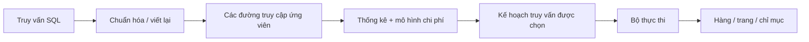
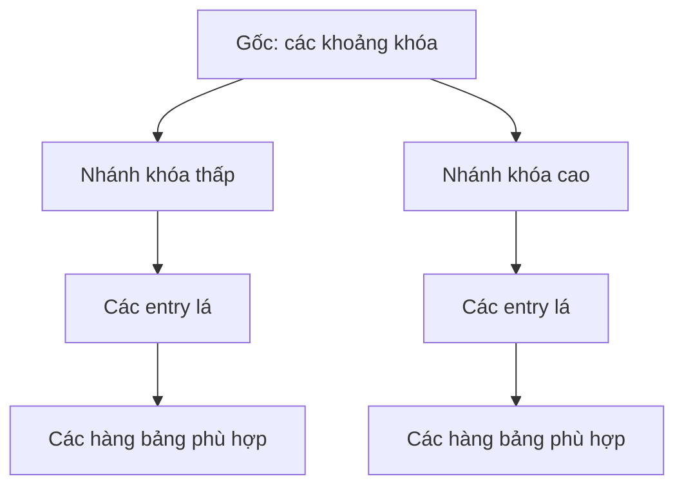
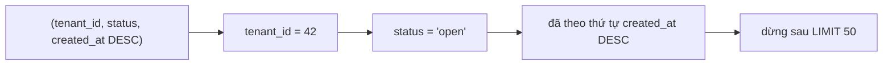

# Chỉ mục Cơ sở dữ liệu & Kế hoạch Truy vấn: Chọn Đường truy cập bằng Bằng chứng

## Tóm tắt

Một chỉ mục không tự làm truy vấn nhanh. Nó cung cấp thêm một **đường truy cập**. Bộ lập kế hoạch truy vấn so sánh các đường có thể dùng dựa trên thống kê của bảng và mô hình chi phí, rồi chọn kế hoạch mà nó dự đoán là rẻ nhất.

Ba thói quen vận hành quan trọng:

1. thiết kế chỉ mục theo predicate, thứ tự sắp xếp, giới hạn và cột trả về của truy vấn thật;
2. đọc kế hoạch được chọn thay vì giả định chỉ mục chắc chắn được dùng;
3. so sánh số hàng ước lượng với số hàng thực tế trước khi đổi schema hoặc cấu hình planner.

## Một mô hình tư duy: chỉ mục là tuyến đường, kế hoạch là tuyến được chọn



Quét tuần tự, quét chỉ mục, đường bitmap hay quét chỉ dùng chỉ mục không phải nhãn “tốt” hoặc “xấu”. Chúng là những cách khác nhau để thực hiện cùng một yêu cầu quan hệ.

<TermBox term="Độ chọn lọc (Selectivity)">
**Độ chọn lọc** mô tả một predicate lọc dữ liệu hẹp đến mức nào. Predicate có độ chọn lọc cao chỉ khớp một phần nhỏ của bảng; predicate có độ chọn lọc thấp khớp nhiều hàng.

**Vì sao quan trọng ở đây:** đi qua chỉ mục có chi phí điều hướng và truy cập hàng. Nếu truy vấn cần phần lớn bảng, đọc bảng trực tiếp có thể rẻ hơn việc đi qua chỉ mục rồi vẫn phải lấy rất nhiều hàng từ heap.
</TermBox>

## Vì sao quét tuần tự có thể là kế hoạch đúng

Giả sử `orders` có hàng triệu hàng và phần lớn có `status = 'completed'`.

```sql
SELECT id, customer_id, total_cents
FROM orders
WHERE status = 'completed';
```

Có chỉ mục trên `status` không có nghĩa planner phải dùng nó. Nếu predicate trả về phần lớn bảng, `Seq Scan` có thể rẻ hơn vì bộ thực thi dù sao cũng phải chạm vào rất nhiều dữ liệu bảng.

So sánh với lookup hẹp:

```sql
SELECT id, customer_id, total_cents
FROM orders
WHERE id = 918273;
```

B-tree trên một định danh duy nhất là ứng viên tự nhiên vì lookup có độ chọn lọc cao.

Thay vì hỏi “vì sao PostgreSQL bỏ qua chỉ mục của tôi?”, hãy bắt đầu bằng câu hỏi:

> Với số hàng được ước lượng và chi phí lấy chúng, vì sao planner ưu tiên đường truy cập này?

## B-tree: thu hẹp không gian tìm kiếm rồi lấy hàng

B-tree là kiểu chỉ mục mặc định của PostgreSQL và hỗ trợ các so sánh equality/range phổ biến. Về mặt mô hình tư duy, chỉ mục giữ các khóa theo thứ tự để bộ thực thi có thể thu hẹp phần chỉ mục cần đọc.



Sơ đồ này là mô hình tư duy, không phải mô tả vật lý chính xác của page layout. Ở mức sâu hơn còn có page split, fill factor, concurrency và các chi tiết lưu trữ khác.

### Chỉ mục ghép mã hóa thứ tự hữu ích

Với truy vấn:

```sql
SELECT id, total_cents, created_at
FROM orders
WHERE tenant_id = 42
  AND status = 'open'
ORDER BY created_at DESC
LIMIT 50;
```

chỉ mục sau khớp khá tốt với shape của truy vấn:

```sql
CREATE INDEX orders_open_feed_idx
ON orders (tenant_id, status, created_at DESC)
INCLUDE (id, total_cents);
```



<TermBox term="Chỉ mục ghép (Composite index)">
**Chỉ mục ghép** chứa nhiều cột khóa theo một thứ tự xác định.

**Vì sao quan trọng ở đây:** với B-tree, các điều kiện equality trên những cột khóa đầu đặc biệt hiệu quả để thu hẹp phạm vi cần quét. Cột range hoặc ordering phía sau có thể tiếp tục giảm công việc. PostgreSQL đôi khi còn tận dụng các cột sau theo cách khác, vì vậy hãy xem “leftmost prefix” như heuristic làm việc chứ không phải luật tuyệt đối; luôn xác minh bằng kế hoạch thật.
</TermBox>

Truy vấn và chỉ mục trên khớp ở bốn điểm:

- `tenant_id` thu hẹp về một tenant;
- `status` thu hẹp tiếp trong tenant đó;
- `created_at DESC` phù hợp thứ tự cần trả;
- `LIMIT 50` cho phép dừng sớm khi đã đủ kết quả.

Các cột trong `INCLUDE` là payload, không phải khóa tìm kiếm. Chúng có thể giúp chỉ mục cover truy vấn nhưng cũng làm chỉ mục lớn hơn.

## Đọc kế hoạch như một giả thuyết về lượng công việc

Dùng `EXPLAIN` trước khi bạn chỉ muốn kế hoạch ước lượng:

```sql
EXPLAIN
SELECT id, total_cents, created_at
FROM orders
WHERE tenant_id = 42
  AND status = 'open'
ORDER BY created_at DESC
LIMIT 50;
```

Một kế hoạch đơn giản hóa có thể trông như sau:

```text
Limit
  -> Index Scan using orders_open_feed_idx on orders
       Index Cond: ((tenant_id = 42) AND (status = 'open'))
```

Tên node, cost, estimate và chiến lược được chọn phụ thuộc vào phiên bản PostgreSQL, thống kê, dữ liệu, cấu hình và shape truy vấn. Không nên dạy một plan minh họa như output chắc chắn.

Các dạng scan nên nhận biết:

| Dạng kế hoạch | Cách hiểu thực hành |
| --- | --- |
| `Seq Scan` | Đọc trang bảng trực tiếp rồi lọc hàng. Thường hợp lý với bảng nhỏ hoặc predicate rộng. |
| `Index Scan` | Dùng entry chỉ mục để tìm hàng bảng phù hợp. Hữu ích khi chỉ mục giảm đủ nhiều công việc. |
| `Index Only Scan` | Cố gắng trả dữ liệu từ chỉ mục mà không ghé mọi heap tuple. Thông tin visibility vẫn ảnh hưởng số lần phải đọc heap. |
| `Bitmap Index Scan` + `Bitmap Heap Scan` | Gom vị trí hàng phù hợp trước, sau đó ghé các trang bảng theo lô. Thường hữu ích ở vùng giữa lookup rất hẹp và quét rất rộng. |

### `EXPLAIN ANALYZE` đổi câu hỏi

```sql
EXPLAIN (ANALYZE, BUFFERS)
SELECT id, total_cents, created_at
FROM orders
WHERE tenant_id = 42
  AND status = 'open'
ORDER BY created_at DESC
LIMIT 50;
```

`ANALYZE` thực thi câu lệnh thật rồi báo quan sát runtime. Với `SELECT`, đây thường là thứ cần khi điều tra một truy vấn đại diện. Với câu lệnh có side effect, nhớ rằng `EXPLAIN ANALYZE` cũng thực thi side effect đó; hãy dùng môi trường an toàn hoặc transaction/rollback phù hợp.

`BUFFERS` giúp phân biệt công việc được thỏa từ shared buffers và công việc cần thêm đọc dữ liệu, nhưng một lần chạy vẫn chỉ là một mẫu. Cache state, tải đồng thời, parameter và phân bố dữ liệu đều có thể làm kết quả khác đi.

## So sánh estimated rows với actual rows thường là bước có giá trị cao nhất

<TermBox term="Ước lượng số hàng (Cardinality estimate)">
**Ước lượng số hàng** là dự đoán của planner về số hàng một node sẽ tạo ra.

**Vì sao quan trọng ở đây:** nhiều quyết định cost phía sau phụ thuộc vào số hàng. Nếu planner dự đoán 10 hàng nhưng runtime tạo 100.000 hàng, join, scan hoặc sort được chọn có thể hợp lý với estimate nhưng tệ với thực tế.
</TermBox>

Khi estimate và actual rows lệch mạnh, hãy điều tra trước khi thêm chỉ mục ngẫu nhiên:

- thống kê có còn mới sau một đợt tăng/đổi dữ liệu lớn không?
- giá trị có skew mạnh thay vì phân bố đều không?
- hai cột có tương quan mà thống kê đơn cột không mô tả tốt không?
- truy vấn có function/cast khác với expression đã được đánh chỉ mục không?
- phân bố parameter ở production có khác giá trị bạn đang thử không?

Mục tiêu đầu tiên là giải thích estimate. Sau đó mới quyết định sửa ở chỉ mục, thống kê, query shape hay mô hình dữ liệu.

## Index-only scan là khả năng, không phải bảo đảm

Một covering index có thể chứa đủ các cột truy vấn cần. Trong PostgreSQL, điều đó có thể cho phép `Index Only Scan`, nhưng executor vẫn có thể phải ghé heap để xác nhận visibility. Vì vậy:

- “mọi cột SELECT đều có trong index” không đồng nghĩa zero heap fetch;
- covering index rộng hơn làm tăng storage và write work;
- chỉ nên thêm payload columns khi việc giảm heap visit có ý nghĩa với workload thật.

Vì vậy ví dụ trước dùng `INCLUDE (id, total_cents)` như một khả năng tối ưu, không phải mặc định chung.

## Kịch bản production: endpoint chậm đi sau khi dữ liệu tăng

Một dashboard đơn hàng multi-tenant chạy nhanh lúc mới ra mắt. Vài tháng sau, endpoint `GET /orders?status=open` trở thành một trong các read có latency cao nhất khi những tenant lớn tích lũy nhiều lịch sử hơn.

Truy vấn:

```sql
SELECT id, total_cents, created_at
FROM orders
WHERE tenant_id = $1
  AND status = 'open'
ORDER BY created_at DESC
LIMIT 50;
```

Schema có các chỉ mục riêng trên `tenant_id`, `status` và `created_at`, nhưng chưa có chỉ mục khớp với predicate kết hợp và ordering.

**Hậu quả:** tenant lớn thấy dashboard chậm và database I/O tăng mạnh vào giờ cao điểm.

**Nguyên nhân cốt lõi:** team coi “các cột filter đã có index” tương đương “truy vấn có đường truy cập hiệu quả”. Planner vẫn phải kết hợp predicate, lấy hàng và thỏa ordering. Nhiều single-column index không tự động tạo cùng ordered path như một composite index phù hợp.

**Cách khắc phục chuẩn:** lấy một `EXPLAIN (ANALYZE, BUFFERS)` đại diện trong môi trường an toàn, xem estimate cùng scan/sort work, rồi thử một composite index khớp tenant, status và recency. Chạy plan lại và so sánh lượng công việc. Chỉ giữ index nếu lợi ích read xứng với storage và write cost.

Thay đổi quan trọng không phải “hãy thêm đúng index này”, mà là chuyển workflow từ **đoán index** sang **query shape → plan → giả thuyết → thay đổi có đo lường → đọc plan lại**.

## Những bẫy indexing thường gặp

### Mỗi cột filter một index

Nhiều single-column index đôi khi có thể kết hợp qua bitmap, nhưng không tương đương với composite B-tree có ordering khớp một truy vấn thường xuyên. So sánh plan thật thay vì đếm số index.

### Mặc định index một flag có độ chọn lọc thấp

Cột boolean hoặc status có thể hữu ích trong composite/partial index, nhưng một standalone index trên giá trị xuất hiện ở phần lớn hàng có thể giúp rất ít cho read rộng.

### Che giá trị được index phía sau expression khác

Nếu query áp function, cast hoặc expression, chỉ mục thường trên cột gốc có thể không hỗ trợ predicate như mong đợi. PostgreSQL có expression index, nhưng nó cũng phải bám một query pattern thật và mang chi phí bảo trì riêng.

### Coi estimate cũ là vấn đề index

Planner phụ thuộc thống kê. Sau thay đổi dữ liệu lớn, thông tin từ `ANALYZE` rất quan trọng. Estimate sai có thể dẫn tới plan tệ ngay cả khi index phù hợp đã tồn tại.

### Giữ mọi index mãi mãi

Mỗi index thêm storage và write/maintenance work. Index bảo vệ một read path quan trọng có thể đáng giá; index suy đoán nhưng không dùng thì không miễn phí.

## Bài tập

Bạn có truy vấn:

```sql
SELECT id, occurred_at, payload
FROM audit_events
WHERE account_id = 77
  AND event_type = 'login_failed'
  AND occurred_at >= now() - interval '7 days'
ORDER BY occurred_at DESC
LIMIT 100;
```

Ba ứng viên:

```sql
-- A
CREATE INDEX audit_events_account_idx
ON audit_events (account_id);

-- B
CREATE INDEX audit_events_feed_idx
ON audit_events (account_id, event_type, occurred_at DESC);

-- C
CREATE INDEX audit_events_time_idx
ON audit_events (occurred_at DESC, account_id, event_type);
```

Trước khi mở phần giải thích, hãy dự đoán index nào là **giả thuyết khởi đầu** tốt nhất cho query shape này. Sau đó nêu một lý do planner vẫn có thể chọn plan khác trong database thật.

<details>
<summary>Xem giải thích chi tiết</summary>

**B** là giả thuyết khởi đầu mạnh nhất. Equality trên `account_id` và `event_type` giúp thu hẹp B-tree trước khi xét time range/order, còn `occurred_at DESC` khớp ordering và limit.

Đó vẫn không phải bảo đảm. Bảng rất nhỏ, phân bố giá trị bất thường, thống kê cũ, cửa sổ bảy ngày quá rộng, parameter khác hoặc projection thay đổi đều có thể làm plan khác rẻ hơn. Xác minh bằng `EXPLAIN`, rồi dùng `EXPLAIN ANALYZE` an toàn khi cần bằng chứng runtime.

</details>

## Checklist review query plan

- [ ] **Query shape:** Tôi đã ghi rõ predicate, ordering, limit và các cột trả về quan trọng chưa?
- [ ] **Độ chọn lọc:** Predicate nào thực sự thu hẹp tập hàng với giá trị production?
- [ ] **Thứ tự khóa:** Composite index có đặt equality constraints ổn định trước phần range/order của workload không?
- [ ] **Plan:** Tôi đã xem access path được chọn thay vì suy từ schema chưa?
- [ ] **Estimate:** Estimated rows có gần actual rows với parameter đại diện không?
- [ ] **Sort:** Executor có đang sort một intermediate result lớn mà index order có thể tránh không?
- [ ] **Heap work:** Covering/index-only có loại bỏ đủ row fetch để đáng làm index rộng hơn không?
- [ ] **Write cost:** Index này thêm chi phí insert/update/delete và storage bao nhiêu?
- [ ] **Đo lại:** Sau khi đổi index hoặc query, tôi có lấy plan lại và so sánh lượng công việc thay vì chỉ nhìn wall-clock time không?

## Quy tắc cho agent

Khi được yêu cầu tối ưu một truy vấn SQL, không đề xuất chỉ mục chỉ từ tên cột. Trước tiên phải lấy query shape, các index đang có, parameter đại diện và một `EXPLAIN` plan. Ưu tiên thay đổi schema nhỏ nhất tạo ra access path tốt hơn rõ ràng, rồi xác minh estimate và runtime work sau thay đổi.

## Khái niệm liên quan

- **Relational Data Model** — shape của bảng và quan hệ quyết định các access pattern có thể có.
- **SQL Querying** — predicate, join, ordering, aggregation và projection xác định công việc planner phải thỏa.
- **Database Transactions** — index tham gia write path nên ảnh hưởng chi phí ghi transactional.
- **Transaction Isolation** — visibility là một lý do index-only path vẫn có thể phải ghé heap.
- **Backend Request Lifecycle** — thời gian database chỉ là một phần của end-to-end request latency.

Dùng lộ trình [Backend Systems](/vi/docs/learning-paths/backend-systems) để đặt indexing/query plans trước transactions, isolation, partial failure và các chủ đề reliability.

## Nguồn

Các tài liệu PostgreSQL chính thức được xác minh ngày **2026-09-10**:

- [PostgreSQL documentation — Indexes](https://www.postgresql.org/docs/current/indexes.html)
- [PostgreSQL documentation — Multicolumn Indexes](https://www.postgresql.org/docs/current/indexes-multicolumn.html)
- [PostgreSQL documentation — Index-Only Scans and Covering Indexes](https://www.postgresql.org/docs/current/indexes-index-only-scans.html)
- [PostgreSQL documentation — Using EXPLAIN](https://www.postgresql.org/docs/current/using-explain.html)
- [PostgreSQL documentation — EXPLAIN](https://www.postgresql.org/docs/current/sql-explain.html)
- [PostgreSQL documentation — ANALYZE](https://www.postgresql.org/docs/current/sql-analyze.html)

Bài này được phân loại **evolving** với chu kỳ review 180 ngày vì hành vi planner, các tính năng plan và chi tiết theo phiên bản database vẫn tiếp tục thay đổi dù mental model cốt lõi về indexing khá bền vững.
