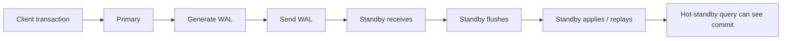
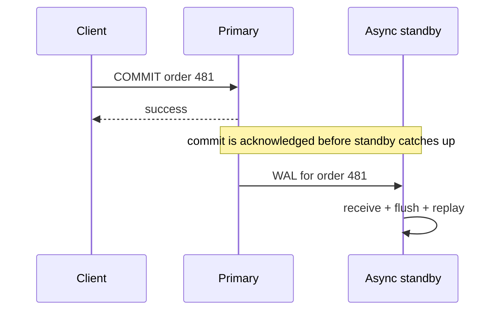
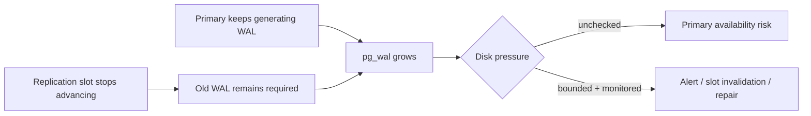
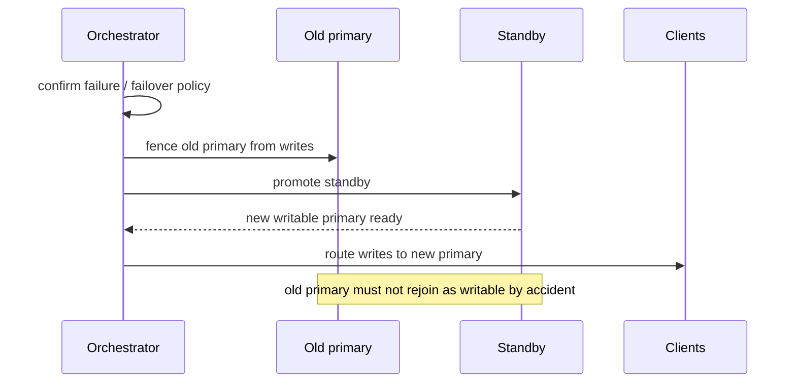

# Database Replication: Reason About Copies, Lag, and Failover

## TL;DR

Replication creates additional database copies for availability, disaster tolerance, and read capacity. The hard part is not copying bytes. The hard part is defining **when a copy is allowed to be stale, what a successful commit guarantees, which node may accept writes, and how failover avoids two primaries**.

For PostgreSQL physical streaming replication, use this mental model:

```text
primary changes data
  -> change produces WAL
  -> WAL is sent to standby
  -> standby receives WAL
  -> standby writes / flushes WAL
  -> standby replays WAL
  -> replayed commit becomes visible to standby queries
```

Those are different progress points. A transaction can be committed on the primary while an asynchronous standby has not received or replayed it yet.



The practical rule is:

> Replication is a consistency contract plus a failure-recovery mechanism, not merely “another database server.”

## 1. First decide why the replica exists

A replica can serve several different goals:

```text
high availability      -> promote a standby after primary failure
read scaling           -> route eligible read-only traffic away from primary
disaster recovery      -> keep a copy in another failure domain
maintenance flexibility -> switch roles during planned work
change distribution    -> publish selected data to other systems
```

These goals do not imply the same topology or guarantees.

A reporting replica can tolerate seconds of staleness but may need long-running queries. A failover standby may need very small recovery-point loss and fast promotion. A cross-region replica may intentionally accept more latency to survive a regional failure.

Start reviews by writing the requirement before choosing “async”, “sync”, “read replica”, or “multi-region”.

## 2. Physical streaming replication follows WAL

PostgreSQL physical streaming replication keeps a standby updated by sending **write-ahead log (WAL)** records from an upstream server. The standby continuously replays those records against its copy of the database.

Streaming replication sends WAL records as they are generated rather than waiting for a complete WAL segment to fill. It is asynchronous by default.

This is different from logical replication. Logical replication publishes logical data changes to subscribers and can operate at a more selective data level. This lesson focuses on physical primary/standby replication because that is where hot-standby reads, WAL retention, promotion, and failover semantics meet directly.

### One source of writes simplifies authority

A common topology has one primary accepting writes and one or more standbys receiving its WAL:

```text
               +--> standby A -> read-only traffic
client writes -> primary
               +--> standby B -> HA / failover candidate
```

The primary is not authoritative because it is “newer hardware.” It is authoritative because the topology currently designates it as the writable node on the active timeline.

During failover that authority must move deliberately.

## 3. Replication lag is a correctness input, not only a monitoring chart

<TermBox term="Replication lag">
**Replication lag** is the distance between an upstream database's replication progress and the downstream replica's receive, flush, or replay progress.

Lag can be expressed in WAL positions/bytes, elapsed time around replay, or workload-specific freshness. No single number captures every failure mode.

**Why it matters:** routing a correctness-sensitive read to a replica means the application is accepting whatever freshness contract that route provides.
</TermBox>

A standby can lag because of:

- network delay or disconnection;
- insufficient WAL receive bandwidth;
- slow storage while writing or flushing WAL;
- slow WAL replay because the standby cannot keep up;
- long standby queries that conflict with replay;
- resource saturation on the standby;
- an upstream cascading standby that is itself behind.

A replica being “healthy” does not necessarily mean it is current enough for every request.

### Receive, flush, and replay are not the same point

Reason about progress explicitly:

```text
received -> bytes arrived at standby
flushed  -> WAL reached the standby's durable storage
replayed -> changes have been applied to the standby database
visible  -> the replayed commit can be observed by standby queries
```

A durability acknowledgment and a query-visibility acknowledgment are different guarantees.

## 4. Asynchronous replication trades freshness and failover loss window for lower commit latency

PostgreSQL streaming replication is asynchronous by default. The primary can report a successful commit without waiting for the standby to catch up.

That keeps the remote standby off the primary commit path, but it creates two consequences:

1. **read staleness:** a query routed immediately to the standby may not see the commit yet;
2. **failover data-loss window:** if the primary is catastrophically lost before recent WAL reaches the promoted standby, acknowledged transactions can be absent after failover.

This is not a bug in asynchronous replication. It is the contract.



The application must decide whether that window is acceptable for the data class involved.

## 5. Read-after-write is not automatic on an asynchronous read replica

Consider this request flow:

```text
POST /projects -> primary creates project 9001
GET /projects/9001 -> load balancer sends read to async replica
replica has not replayed the commit yet
GET returns not found
```

Both database nodes can be behaving correctly according to the topology.

If the product promises immediate read-after-write behavior, common strategies include:

- route the writer's subsequent correctness-sensitive reads to the primary for a bounded period;
- attach a causal/freshness token and only use a replica after it has reached the required replication position;
- choose synchronous settings that wait for the required standby progress where the latency trade-off is justified;
- avoid routing operations that enforce permissions, uniqueness assumptions, or workflow transitions to replicas whose freshness is insufficient.

Do not “fix” this by sleeping 100 milliseconds. Lag is workload- and failure-dependent.

## 6. Synchronous replication moves a chosen standby acknowledgment onto the commit path

PostgreSQL can designate synchronous standbys. When synchronous replication is configured, `synchronous_commit` determines what remote progress a transaction waits for.

The important distinction is:

```text
synchronous_commit = on
  -> wait for selected synchronous standby(s) to receive and flush commit WAL durably
  -> does NOT by itself mean a standby query has replayed the commit

synchronous_commit = remote_apply
  -> wait until selected synchronous standby(s) have replayed the commit
  -> commit is visible to queries on those standby(s)
```

`remote_write` waits for the standby to write WAL to its operating system but not necessarily flush it to durable storage. `local` and `off` weaken or remove the remote wait in different ways.

### “Synchronous” does not mean every replica everywhere is current

The primary waits according to `synchronous_standby_names` and the transaction's `synchronous_commit` mode. Other asynchronous standbys can still lag.

A safe statement is:

> This commit waited for the configured synchronous acknowledgment policy.

An unsafe statement is:

> Every replica is now current.

## 7. Synchronous replication buys guarantees with commit-path coupling

Putting a standby acknowledgment on the commit path adds a new availability/latency dependency.

If the required synchronous standby is slow or unavailable and no eligible replacement satisfies the configuration, commits can wait.

That creates a deliberate trade-off:

```text
stronger remote durability / visibility guarantee
  <->
higher commit latency and tighter dependency on standby health
```

Use synchronous replication because a specific recovery-point or causal-read guarantee requires it, not because “sync sounds safer.”

Different transaction classes can also use different `synchronous_commit` settings when the application has a clear durability policy.

## 8. Hot standby gives read capacity, but replay still has priority decisions

A PostgreSQL hot standby accepts read-only queries while recovery is replaying WAL.

That does not make standby reads independent of recovery. A standby query can conflict with WAL replay. For example, the primary may vacuum away a row version that a long-running standby query would still like to see.

The standby then has a choice controlled by configuration: delay WAL replay for some period or cancel the conflicting query so recovery can continue.

`max_standby_streaming_delay` controls how long WAL received through streaming replication may be delayed by conflicts. It is **not simply a per-query execution timeout**.

### Reporting freshness and query longevity compete

For a reporting replica:

```text
allow long standby queries
  -> WAL replay may wait longer
  -> replica can become further behind

prioritize replica freshness
  -> replay advances quickly
  -> conflicting long queries may be canceled
```

There is no universal correct setting. The replica's job determines the trade-off.

## 9. hot_standby_feedback trades fewer cleanup conflicts for possible primary bloat

`hot_standby_feedback` lets a standby tell its upstream server about transaction horizons needed by standby queries. This can prevent some query cancellations caused by cleanup records.

But that protection is not free: delaying removal of dead row versions can increase table bloat on the primary for some workloads.

This is the same style of trade-off introduced in the MVCC lesson:

```text
standby needs old row versions longer
  -> feedback protects those versions upstream
  -> primary cleanup horizon may move more slowly
  -> primary can retain more dead tuples
```

Treat `hot_standby_feedback = on` as an operational policy with monitoring, not as a magic “stop replica query errors” switch.

## 10. Replication slots protect continuity by retaining required WAL

<TermBox term="Replication slot">
A **replication slot** records replication progress so the upstream server can retain WAL, and for relevant slot types visibility-related data, that a consumer still needs.

**Why it matters:** a temporarily disconnected standby can resume from its known position instead of discovering that required WAL was already recycled.
</TermBox>

Without enough retained WAL, a standby that falls too far behind may need to be reinitialized from a fresh base backup.

Slots solve that continuity problem by making retention consumer-aware.

But retention changes the failure mode.

## 11. A stalled replication slot can turn consumer failure into primary disk pressure

If a slot stops advancing, PostgreSQL can keep retaining WAL needed by that slot.



PostgreSQL warns that replication slots can retain enough WAL to fill the space allocated to `pg_wal`. `max_slot_wal_keep_size` can cap retention, but if required WAL is removed after the slot falls too far behind, the slot/standby may no longer be able to continue from that position.

Monitor at least:

- whether each slot is active;
- its retained/restart WAL position;
- how much WAL can still be written before retention becomes unsafe when that signal is available;
- disk usage and growth rate in `pg_wal`;
- why an inactive slot still exists.

A slot is durable state. Give it an owner and lifecycle.

## 12. Replication and backup solve different failure classes

A replica is designed to follow changes. That means it can faithfully reproduce bad changes too:

```text
accidental DELETE -> replicated
bad migration     -> replicated
application corruption -> replicated
```

High availability asks, “Can another database copy continue service when this node fails?”

Backup/recovery asks, “Can we restore an earlier trustworthy state after data loss or corruption?”

A healthy replication topology does not eliminate the need for tested backups and restore procedures.

## 13. Failover is an authority transfer, not just a server restart

<TermBox term="Failover and fencing">
**Failover** promotes a standby so it can become the new writable primary after the old primary is unavailable.

**Fencing** ensures the old primary cannot continue accepting writes after authority moves. Without fencing, two nodes can both believe they are primary, creating split-brain behavior and possible data loss.
</TermBox>

PostgreSQL provides mechanisms such as `pg_ctl promote` / `pg_promote()` to promote a standby. It does not provide the complete external system that detects primary failure, chooses a failover target, moves client traffic, and fences the old primary.

A safe failover sequence reasons about authority explicitly:



Failover testing must include what happens when the old primary comes back.

## 14. Failover has both recovery-time and recovery-point questions

Two separate questions matter:

```text
How long until writes can resume?      -> recovery time
How much acknowledged data can be lost? -> recovery point
```

Asynchronous replication can offer fast promotion while still having a nonzero window of acknowledged commits that had not reached the promoted standby.

Synchronous durability can reduce that data-loss window for commits that satisfied the policy, but it can increase normal commit latency and create waiting when required standbys are unavailable.

Write the desired failure contract in product terms:

- “payment ledger commits acknowledged to clients must survive loss of the primary host”;
- “analytics events may lose up to a small recent window during regional catastrophe”;
- “a user must see a just-created project on the next request.”

Then choose routing and replication policies that actually imply those guarantees.

## 15. Cascading replication changes dependency shape

A standby can stream WAL to downstream standbys. This reduces the primary's direct fan-out and can help distant topologies.

But the dependency graph now matters:

```text
primary -> regional standby -> downstream reporting standby
```

If the regional standby is delayed or unavailable, its downstream replicas inherit that dependency. PostgreSQL physical cascading replication is asynchronous, so do not assume a synchronous policy on the primary automatically extends to downstream cascaded standbys.

Draw the actual replication graph during incident review instead of saying “we have three replicas.”

## 16. Production scenario: the write succeeded, but the next read says it did not

An API creates a project on the primary, returns `201 Created`, then the frontend immediately loads the project page. Generic read routing sends the GET to an asynchronous standby that is 1.8 seconds behind during a write burst.

The replica returns no row. The application converts that absence into “project creation failed” and lets the user submit again.

**Impact:** users see intermittent not-found screens after successful writes; duplicate logical operations appear when retries are not independently idempotent; support sees contradictory logs because the write and read hit different database nodes.

**Root cause:** the system treated a healthy asynchronous replica as equivalent to the primary for a read-after-write contract. Routing knew that the request was read-only, but not that it depended causally on a just-acknowledged write.

**Correct pattern:** define which reads require causal freshness, route those reads to the primary or to a replica proven to have replayed the required position, keep ordinary stale-tolerant reads eligible for replicas, expose replica identity/freshness in traces, and keep write retries independently idempotent rather than relying on replica timing.

## 17. Review replication with failure evidence, not topology labels

A diagram that says “primary + 2 replicas” proves very little.

For each replica, be able to answer:

```text
what purpose does this replica serve?
who is allowed to write?
what commit acknowledgment does the primary wait for?
how stale may this replica be for each read class?
what happens when its slot stops advancing?
can long queries delay replay or cause primary bloat through feedback?
who promotes a standby?
who fences the old primary?
how do clients discover the new writer?
what backup restores corruption that replication copied everywhere?
```

Operational evidence should include replication progress, lag by stage, WAL/disk retention, slot state, standby query cancellations, promotion events, and client-routing behavior.

## Self-check: did synchronous commit make the replica immediately queryable?

A PostgreSQL cluster has one configured synchronous standby.

Transaction A commits on the primary with `synchronous_commit = on`. The client receives success and immediately sends a read to that synchronous standby.

Can the application conclude that the standby query must already see A's row?

<details>
<summary>Show the reasoning</summary>

No. With synchronous replication configured, `synchronous_commit = on` waits for the current synchronous standby(s) to receive the commit record and flush it to durable storage. That is a remote durability guarantee, not necessarily a replay/visibility guarantee.

If the contract requires the selected synchronous standby to have replayed the commit before success returns, PostgreSQL provides `synchronous_commit = remote_apply`. That mode waits for replay so the transaction is visible to queries on the synchronous standby(s).

The broader rule is to name the exact acknowledgment stage you need: receive, durable flush, or replay/visibility.

</details>

## Production checklist

- [ ] **Replica purpose:** every replica has an explicit HA, read-scaling, DR, or distribution job.
- [ ] **Write authority:** the topology has one unambiguous writable authority unless a deliberately different architecture proves otherwise.
- [ ] **Commit contract:** document whether commits wait only for local durability, remote write, remote flush, or remote apply.
- [ ] **Read-after-write:** correctness-sensitive reads do not route to a replica without an explicit freshness guarantee.
- [ ] **Lag budget:** each replica-backed read class has a tolerable freshness bound or fallback behavior.
- [ ] **Lag evidence:** monitor receive, flush, and replay progress rather than one generic “replica healthy” flag.
- [ ] **Hot-standby conflicts:** decide whether freshness or long reporting queries win when WAL replay conflicts.
- [ ] **Feedback trade-off:** monitor primary bloat if `hot_standby_feedback` protects long standby queries.
- [ ] **Slot lifecycle:** replication slots have owners, lag/disk alerts, and a retirement procedure.
- [ ] **WAL retention:** bound and observe the risk that a stalled consumer grows `pg_wal` or loses its restart position.
- [ ] **Failover:** promotion, routing, and client reconnection are tested procedures rather than assumptions.
- [ ] **Fencing:** the old primary cannot rejoin as a writer after failover without explicit reconciliation.
- [ ] **Recovery contract:** recovery-time and recovery-point goals are written separately.
- [ ] **Backups:** replication is paired with tested backup/restore for logical corruption and historical recovery.
- [ ] **Topology graph:** cascading dependencies and failure domains are drawn explicitly.

## Agent rule

When proposing or reviewing database replication, do not say “add a read replica” or “use synchronous replication” without naming the contract. State the writable authority, the commit acknowledgment stage, the allowed replica freshness for each read class, the WAL-retention mechanism, and the failover/fencing procedure. Treat replica lag as application-visible correctness state whenever reads depend on recent writes.

## Sources

- [PostgreSQL 18 — High Availability, Load Balancing, and Replication](https://www.postgresql.org/docs/18/high-availability.html)
- [PostgreSQL 18 — Log-Shipping Standby Servers and Streaming Replication](https://www.postgresql.org/docs/18/warm-standby.html)
- [PostgreSQL 18 — Replication Configuration](https://www.postgresql.org/docs/18/runtime-config-replication.html)
- [PostgreSQL 18 — Write Ahead Log / synchronous_commit](https://www.postgresql.org/docs/18/runtime-config-wal.html)
- [PostgreSQL 18 — Failover](https://www.postgresql.org/docs/18/warm-standby-failover.html)
- [PostgreSQL 18 — Hot Standby](https://www.postgresql.org/docs/18/hot-standby.html)
- [PostgreSQL 18 — pg_replication_slots](https://www.postgresql.org/docs/18/view-pg-replication-slots.html)
- [PostgreSQL 18 — Streaming Replication Protocol](https://www.postgresql.org/docs/18/protocol-replication.html)
