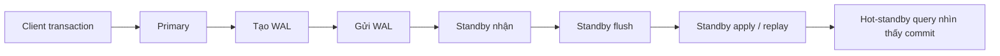
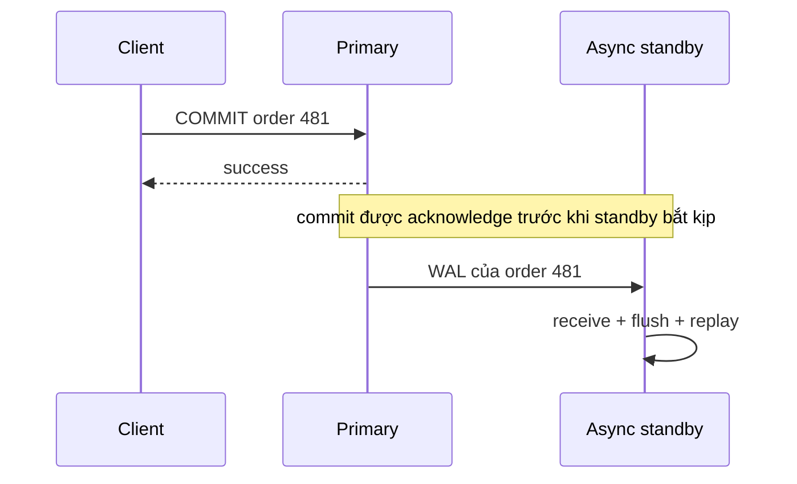
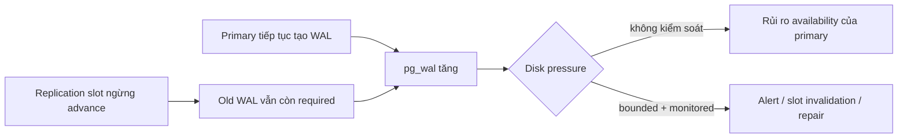
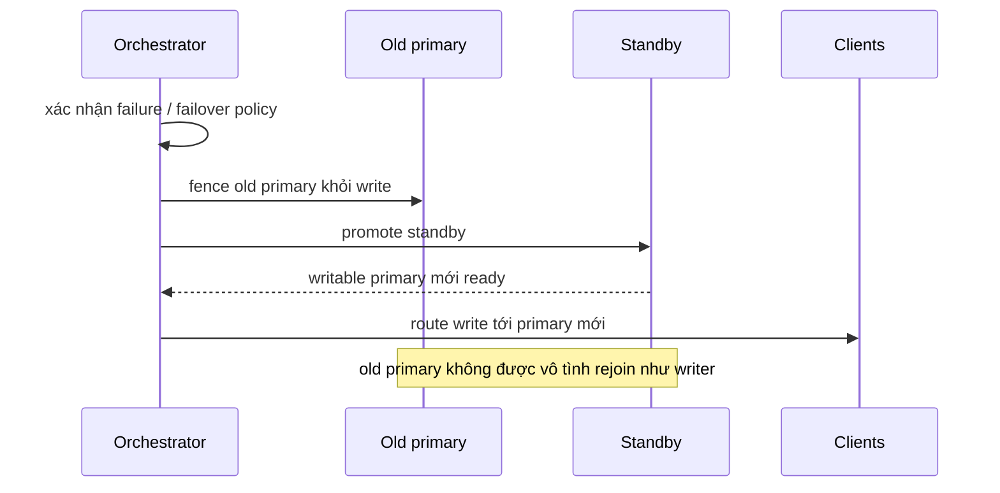

# Database Replication: Suy luận về Bản sao, Độ trễ và Failover

## Tóm tắt

Replication tạo thêm các bản sao database để tăng availability, khả năng chịu thảm họa và read capacity. Phần khó không phải copy byte. Phần khó là xác định **khi nào một bản sao được phép stale, một commit thành công cam kết điều gì, node nào được phép ghi, và failover tránh hai primary bằng cách nào**.

Với physical streaming replication của PostgreSQL, hãy dùng mental model này:

```text
primary thay đổi dữ liệu
  -> thay đổi tạo WAL
  -> WAL được gửi tới standby
  -> standby nhận WAL
  -> standby write / flush WAL
  -> standby replay WAL
  -> commit đã replay trở nên visible với query trên standby
```

Đó là các mốc tiến độ khác nhau. Một transaction có thể đã commit trên primary trong khi asynchronous standby vẫn chưa nhận hoặc replay nó.



Quy tắc thực hành là:

> Replication là một consistency contract cộng với cơ chế phục hồi sau failure, không chỉ là “một database server khác”.

## 1. Trước hết hãy xác định replica tồn tại để làm gì

Một replica có thể phục vụ nhiều mục tiêu khác nhau:

```text
high availability       -> promote standby sau khi primary hỏng
read scaling            -> chuyển read-only traffic phù hợp khỏi primary
disaster recovery       -> giữ bản sao ở failure domain khác
maintenance flexibility -> đổi vai trò khi bảo trì có kế hoạch
change distribution     -> publish dữ liệu được chọn sang hệ thống khác
```

Các mục tiêu này không suy ra cùng topology hay cùng guarantee.

Reporting replica có thể chấp nhận stale vài giây nhưng cần query chạy lâu. Failover standby có thể cần recovery-point loss rất nhỏ và promotion nhanh. Cross-region replica có thể chủ động chấp nhận latency cao hơn để sống sót khi cả region gặp sự cố.

Hãy bắt đầu review bằng cách viết requirement trước khi chọn “async”, “sync”, “read replica” hay “multi-region”.

## 2. Physical streaming replication đi theo WAL

PostgreSQL physical streaming replication giữ standby cập nhật bằng cách gửi **write-ahead log (WAL)** từ upstream server. Standby liên tục replay các record đó lên bản sao database của nó.

Streaming replication gửi WAL record khi chúng được tạo thay vì chờ đầy một WAL segment. Mặc định nó chạy bất đồng bộ.

Cơ chế này khác logical replication. Logical replication publish logical data change tới subscriber và có thể hoạt động ở mức dữ liệu chọn lọc hơn. Bài này tập trung vào physical primary/standby replication vì hot-standby read, WAL retention, promotion và failover semantics giao nhau trực tiếp ở đây.

### Một nguồn ghi giúp authority rõ ràng

Topology phổ biến có một primary nhận write và một hoặc nhiều standby nhận WAL:

```text
               +--> standby A -> read-only traffic
client writes -> primary
               +--> standby B -> HA / failover candidate
```

Primary không authoritative vì nó là “máy mới hơn”. Nó authoritative vì topology hiện tại chỉ định nó là writable node trên active timeline.

Khi failover, authority đó phải được chuyển một cách có chủ đích.

## 3. Replication lag là input correctness, không chỉ là biểu đồ monitoring

<TermBox term="Replication lag">
**Replication lag** là khoảng cách giữa tiến độ replication của upstream database và tiến độ receive, flush hoặc replay của downstream replica.

Lag có thể được biểu diễn bằng WAL position/byte, thời gian quanh replay hoặc freshness theo workload. Không có một con số duy nhất mô tả mọi failure mode.

**Vì sao quan trọng:** route một correctness-sensitive read sang replica nghĩa là application đang chấp nhận freshness contract mà route đó cung cấp.
</TermBox>

Standby có thể lag vì:

- network delay hoặc disconnect;
- bandwidth nhận WAL không đủ;
- storage chậm khi write hoặc flush WAL;
- WAL replay chậm vì standby không theo kịp;
- query dài trên standby xung đột với replay;
- resource saturation trên standby;
- upstream cascading standby bản thân nó cũng đang lag.

Replica “healthy” không nhất thiết current đủ cho mọi request.

### Receive, flush và replay không phải cùng một mốc

Hãy suy luận tiến độ một cách tường minh:

```text
received -> byte đã tới standby
flushed  -> WAL đã tới durable storage của standby
replayed -> thay đổi đã được apply vào database standby
visible  -> commit đã replay có thể được query trên standby nhìn thấy
```

Durability acknowledgment và query-visibility acknowledgment là hai guarantee khác nhau.

## 4. Asynchronous replication đổi freshness và failover loss window lấy commit latency thấp hơn

PostgreSQL streaming replication mặc định bất đồng bộ. Primary có thể báo commit thành công mà không chờ standby bắt kịp.

Điều đó giữ remote standby ra khỏi primary commit path, nhưng tạo hai hệ quả:

1. **read staleness:** query được route ngay sang standby có thể chưa thấy commit;
2. **failover data-loss window:** nếu primary bị mất hoàn toàn trước khi WAL gần nhất tới standby được promote, acknowledged transaction có thể không tồn tại sau failover.

Đây không phải bug của asynchronous replication. Đây chính là contract.



Application phải quyết định window đó có chấp nhận được với loại dữ liệu này không.

## 5. Read-after-write không tự động có trên asynchronous read replica

Xét flow request này:

```text
POST /projects -> primary tạo project 9001
GET /projects/9001 -> load balancer gửi read sang async replica
replica chưa replay commit
GET trả not found
```

Cả hai database node đều có thể đang hoạt động đúng theo topology.

Nếu product cam kết read-after-write ngay lập tức, các chiến lược phổ biến gồm:

- route correctness-sensitive read tiếp theo của writer về primary trong một khoảng giới hạn;
- gắn causal/freshness token và chỉ dùng replica sau khi nó đạt replication position yêu cầu;
- chọn synchronous setting chờ đúng standby progress cần thiết khi latency trade-off là hợp lý;
- không route operation thực thi permission, uniqueness assumption hoặc workflow transition sang replica có freshness không đủ.

Đừng “fix” bằng cách sleep 100 millisecond. Lag phụ thuộc workload và failure.

## 6. Synchronous replication đưa acknowledgment của standby được chọn vào commit path

PostgreSQL có thể chỉ định synchronous standby. Khi synchronous replication được cấu hình, `synchronous_commit` quyết định transaction chờ remote progress tới đâu.

Khác biệt quan trọng:

```text
synchronous_commit = on
  -> chờ synchronous standby được chọn receive và flush commit WAL xuống durable storage
  -> tự nó KHÔNG có nghĩa standby query đã replay commit

synchronous_commit = remote_apply
  -> chờ synchronous standby được chọn replay commit
  -> commit visible với query trên standby đó
```

`remote_write` chờ standby write WAL vào operating system nhưng chưa nhất thiết flush tới durable storage. `local` và `off` làm yếu hoặc bỏ remote wait theo những cách khác nhau.

### “Synchronous” không có nghĩa mọi replica ở mọi nơi đều current

Primary chờ theo `synchronous_standby_names` và `synchronous_commit` mode của transaction. Các asynchronous standby khác vẫn có thể lag.

Câu an toàn là:

> Commit này đã chờ đúng configured synchronous acknowledgment policy.

Câu không an toàn là:

> Mọi replica bây giờ đều current.

## 7. Synchronous replication mua guarantee bằng commit-path coupling

Đưa standby acknowledgment vào commit path tạo thêm dependency về availability và latency.

Nếu synchronous standby bắt buộc bị chậm hoặc unavailable và không có eligible replacement thỏa cấu hình, commit có thể phải chờ.

Trade-off có chủ đích là:

```text
remote durability / visibility guarantee mạnh hơn
  <->
commit latency cao hơn và phụ thuộc chặt hơn vào standby health
```

Dùng synchronous replication vì một recovery-point hoặc causal-read guarantee cụ thể yêu cầu nó, không phải vì “sync nghe an toàn hơn”.

Các transaction class khác nhau cũng có thể dùng `synchronous_commit` khác nhau nếu application có durability policy rõ ràng.

## 8. Hot standby cho read capacity, nhưng replay vẫn có quyết định ưu tiên

PostgreSQL hot standby nhận read-only query trong khi recovery đang replay WAL.

Điều đó không làm standby read độc lập với recovery. Standby query có thể conflict với WAL replay. Ví dụ primary có thể vacuum row version mà một long-running standby query vẫn muốn nhìn thấy.

Standby phải chọn theo configuration: trì hoãn WAL replay một khoảng hoặc cancel conflicting query để recovery tiếp tục.

`max_standby_streaming_delay` kiểm soát WAL nhận qua streaming replication được phép bị trì hoãn bao lâu bởi conflict. Nó **không đơn giản là timeout execution của từng query**.

### Reporting freshness và tuổi thọ query cạnh tranh với nhau

Với reporting replica:

```text
cho phép standby query chạy lâu
  -> WAL replay có thể chờ lâu hơn
  -> replica có thể tụt xa hơn

ưu tiên replica freshness
  -> replay tiến nhanh
  -> conflicting long query có thể bị cancel
```

Không có setting đúng cho mọi hệ thống. Job của replica quyết định trade-off.

## 9. hot_standby_feedback đổi ít cleanup conflict hơn lấy nguy cơ primary bloat

`hot_standby_feedback` cho standby báo upstream server về transaction horizon mà standby query còn cần. Điều này có thể ngăn một số query cancellation do cleanup record.

Nhưng protection này không miễn phí: trì hoãn xóa dead row version có thể làm tăng table bloat trên primary với một số workload.

Đây là cùng loại trade-off đã xuất hiện trong bài MVCC:

```text
standby cần old row version lâu hơn
  -> feedback bảo vệ version đó upstream
  -> cleanup horizon trên primary có thể tiến chậm hơn
  -> primary có thể giữ nhiều dead tuple hơn
```

Hãy xem `hot_standby_feedback = on` như operational policy cần monitoring, không phải magic switch “ngừng replica query error”.

## 10. Replication slot bảo vệ continuity bằng cách giữ WAL còn cần

<TermBox term="Replication slot">
**Replication slot** lưu replication progress để upstream server có thể giữ WAL, và với loại slot liên quan là visibility-related data, mà consumer vẫn cần.

**Vì sao quan trọng:** standby tạm disconnect có thể resume từ position đã biết thay vì phát hiện required WAL đã bị recycle.
</TermBox>

Nếu không giữ đủ WAL, standby tụt quá xa có thể phải reinitialize từ base backup mới.

Slot giải quyết continuity problem đó bằng retention theo consumer.

Nhưng retention làm failure mode thay đổi.

## 11. Replication slot bị đứng có thể biến consumer failure thành disk pressure trên primary

Nếu slot ngừng advance, PostgreSQL có thể tiếp tục giữ WAL mà slot đó cần.



PostgreSQL cảnh báo replication slot có thể giữ đủ WAL để lấp đầy space dành cho `pg_wal`. `max_slot_wal_keep_size` có thể giới hạn retention, nhưng nếu required WAL bị xóa sau khi slot tụt quá xa, slot/standby có thể không tiếp tục được từ position đó.

Tối thiểu hãy monitor:

- mỗi slot có active không;
- retained/restart WAL position;
- còn có thể tạo bao nhiêu WAL trước khi retention trở nên unsafe khi signal đó có sẵn;
- disk usage và growth rate trong `pg_wal`;
- vì sao inactive slot vẫn tồn tại.

Slot là durable state. Hãy cho nó owner và lifecycle.

## 12. Replication và backup giải quyết hai failure class khác nhau

Replica được thiết kế để đi theo change. Vì vậy nó cũng có thể trung thành replicate bad change:

```text
accidental DELETE -> replicated
bad migration     -> replicated
application corruption -> replicated
```

High availability hỏi: “Một database copy khác có tiếp tục service khi node này hỏng không?”

Backup/recovery hỏi: “Có restore được một trạng thái đáng tin cậy trước đó sau data loss hoặc corruption không?”

Replication topology healthy không loại bỏ nhu cầu backup/restore procedure đã được test.

## 13. Failover là chuyển authority, không chỉ restart server

<TermBox term="Failover và fencing">
**Failover** promote standby để nó trở thành writable primary mới sau khi primary cũ unavailable.

**Fencing** bảo đảm primary cũ không thể tiếp tục nhận write sau khi authority đã chuyển. Không có fencing, hai node có thể cùng nghĩ mình là primary, tạo split-brain và nguy cơ data loss.
</TermBox>

PostgreSQL cung cấp mechanism như `pg_ctl promote` / `pg_promote()` để promote standby. PostgreSQL không cung cấp toàn bộ external system phát hiện primary failure, chọn failover target, chuyển client traffic và fence primary cũ.

Failover an toàn phải suy luận authority tường minh:



Failover testing phải bao gồm chuyện gì xảy ra khi primary cũ quay lại.

## 14. Failover có cả câu hỏi recovery time và recovery point

Hai câu hỏi riêng biệt đều quan trọng:

```text
Bao lâu cho tới khi write chạy lại?          -> recovery time
Bao nhiêu acknowledged data có thể bị mất?  -> recovery point
```

Asynchronous replication có thể promote nhanh nhưng vẫn có nonzero window của acknowledged commit chưa tới standby được promote.

Synchronous durability có thể giảm data-loss window cho commit đã thỏa policy, nhưng làm normal commit latency cao hơn và có thể gây wait khi required standby unavailable.

Hãy viết failure contract bằng ngôn ngữ product:

- “payment ledger commit đã acknowledge cho client phải sống sót nếu mất primary host”;
- “analytics event có thể mất một recent window nhỏ khi cả region gặp catastrophe”;
- “user phải thấy project vừa tạo ở request kế tiếp.”

Sau đó chọn routing và replication policy thật sự suy ra các guarantee đó.

## 15. Cascading replication thay đổi dependency shape

Một standby có thể stream WAL tới downstream standby. Điều này giảm direct fan-out từ primary và có thể hữu ích cho topology xa.

Nhưng dependency graph bây giờ quan trọng:

```text
primary -> regional standby -> downstream reporting standby
```

Nếu regional standby lag hoặc unavailable, downstream replica kế thừa dependency đó. PostgreSQL physical cascading replication hiện là asynchronous, vì vậy đừng giả định synchronous policy ở primary tự động kéo dài tới downstream cascaded standby.

Khi incident review, hãy vẽ replication graph thật thay vì chỉ nói “chúng ta có ba replica”.

## 16. Tình huống production: write thành công nhưng read kế tiếp nói rằng chưa có

Một API tạo project trên primary, trả `201 Created`, rồi frontend lập tức load project page. Generic read routing gửi GET sang asynchronous standby đang lag 1,8 giây trong một write burst.

Replica không trả row. Application biến sự vắng mặt đó thành “project creation failed” và cho user submit lại.

**Hậu quả:** user thỉnh thoảng thấy not-found ngay sau successful write; duplicate logical operation xuất hiện nếu retry không độc lập idempotent; support thấy log mâu thuẫn vì write và read đi tới hai database node khác nhau.

**Nguyên nhân cốt lõi:** hệ thống coi healthy asynchronous replica tương đương primary cho read-after-write contract. Routing chỉ biết request là read-only, nhưng không biết nó phụ thuộc nhân quả vào một write vừa được acknowledge.

**Cách khắc phục chuẩn:** xác định read nào cần causal freshness, route read đó về primary hoặc replica đã chứng minh replay tới required position, giữ ordinary stale-tolerant read đủ điều kiện đi replica, đưa replica identity/freshness vào trace, và giữ write retry độc lập idempotent thay vì dựa vào replica timing.

## 17. Review replication bằng failure evidence, không bằng topology label

Diagram chỉ nói “primary + 2 replicas” chứng minh rất ít.

Với mỗi replica, phải trả lời được:

```text
replica này phục vụ mục đích gì?
ai được phép write?
primary chờ commit acknowledgment nào?
replica được stale bao nhiêu với từng read class?
chuyện gì xảy ra khi slot ngừng advance?
long query có delay replay hoặc gây primary bloat qua feedback không?
ai promote standby?
ai fence primary cũ?
client khám phá writer mới bằng cách nào?
backup nào restore corruption mà replication đã copy khắp nơi?
```

Operational evidence nên gồm replication progress, lag theo từng stage, WAL/disk retention, slot state, standby query cancellation, promotion event và client-routing behavior.

## Tự kiểm tra: synchronous commit có làm replica lập tức query được không?

Một PostgreSQL cluster có một configured synchronous standby.

Transaction A commit trên primary với `synchronous_commit = on`. Client nhận success rồi lập tức gửi read tới synchronous standby đó.

Application có thể kết luận standby query chắc chắn đã nhìn thấy row của A chưa?

<details>
<summary>Xem giải thích chi tiết</summary>

Chưa. Khi synchronous replication được cấu hình, `synchronous_commit = on` chờ synchronous standby hiện tại nhận commit record và flush nó xuống durable storage. Đó là remote durability guarantee, chưa nhất thiết là replay/visibility guarantee.

Nếu contract yêu cầu synchronous standby được chọn đã replay commit trước khi success trả về, PostgreSQL cung cấp `synchronous_commit = remote_apply`. Mode này chờ replay nên transaction đã visible với query trên synchronous standby đó.

Quy tắc rộng hơn là gọi tên chính xác acknowledgment stage cần thiết: receive, durable flush hay replay/visibility.

</details>

## Checklist production

- [ ] **Mục đích replica:** mỗi replica có job HA, read-scaling, DR hoặc distribution rõ ràng.
- [ ] **Write authority:** topology có một writable authority không mơ hồ trừ khi kiến trúc khác được thiết kế và chứng minh có chủ đích.
- [ ] **Commit contract:** document commit chỉ chờ local durability, remote write, remote flush hay remote apply.
- [ ] **Read-after-write:** correctness-sensitive read không đi replica nếu chưa có freshness guarantee tường minh.
- [ ] **Lag budget:** mỗi replica-backed read class có freshness bound hoặc fallback behavior chấp nhận được.
- [ ] **Lag evidence:** monitor receive, flush và replay progress thay vì một flag “replica healthy” chung chung.
- [ ] **Hot-standby conflict:** quyết định freshness hay long reporting query thắng khi WAL replay conflict.
- [ ] **Feedback trade-off:** monitor primary bloat nếu `hot_standby_feedback` bảo vệ long standby query.
- [ ] **Slot lifecycle:** replication slot có owner, lag/disk alert và retirement procedure.
- [ ] **WAL retention:** giới hạn và quan sát rủi ro stalled consumer làm `pg_wal` tăng hoặc mất restart position.
- [ ] **Failover:** promotion, routing và client reconnection là procedure đã test thay vì assumption.
- [ ] **Fencing:** primary cũ không thể rejoin như writer sau failover nếu chưa reconciliation tường minh.
- [ ] **Recovery contract:** recovery-time và recovery-point goal được viết riêng.
- [ ] **Backup:** replication đi cùng backup/restore đã test cho logical corruption và historical recovery.
- [ ] **Topology graph:** cascading dependency và failure domain được vẽ tường minh.

## Quy tắc cho agent

Khi đề xuất hoặc review database replication, đừng nói “thêm read replica” hay “dùng synchronous replication” mà không gọi tên contract. Hãy nêu writable authority, commit acknowledgment stage, freshness được phép của replica với từng read class, WAL-retention mechanism và failover/fencing procedure. Xem replica lag là application-visible correctness state bất cứ khi nào read phụ thuộc vào recent write.

## Nguồn tham khảo

- [PostgreSQL 18 — High Availability, Load Balancing, and Replication](https://www.postgresql.org/docs/18/high-availability.html)
- [PostgreSQL 18 — Log-Shipping Standby Servers and Streaming Replication](https://www.postgresql.org/docs/18/warm-standby.html)
- [PostgreSQL 18 — Replication Configuration](https://www.postgresql.org/docs/18/runtime-config-replication.html)
- [PostgreSQL 18 — Write Ahead Log / synchronous_commit](https://www.postgresql.org/docs/18/runtime-config-wal.html)
- [PostgreSQL 18 — Failover](https://www.postgresql.org/docs/18/warm-standby-failover.html)
- [PostgreSQL 18 — Hot Standby](https://www.postgresql.org/docs/18/hot-standby.html)
- [PostgreSQL 18 — pg_replication_slots](https://www.postgresql.org/docs/18/view-pg-replication-slots.html)
- [PostgreSQL 18 — Streaming Replication Protocol](https://www.postgresql.org/docs/18/protocol-replication.html)
