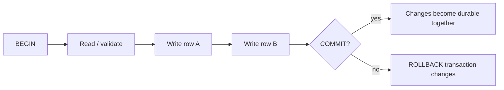
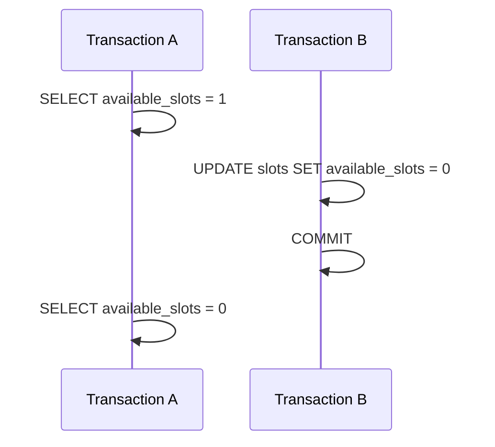
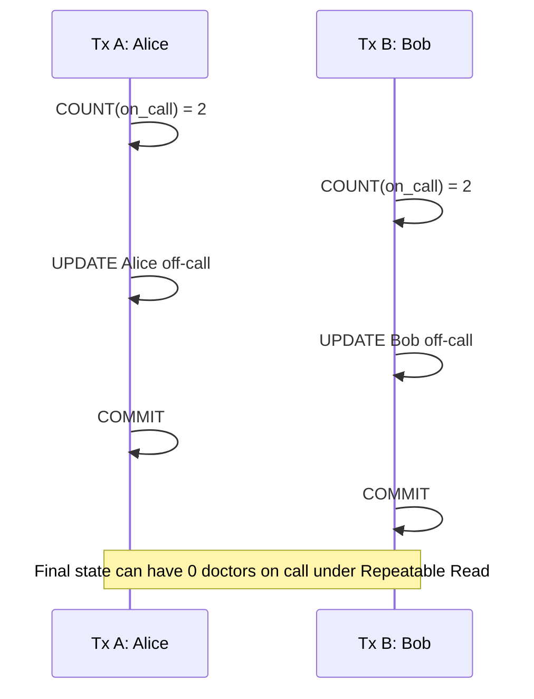

# Database Transactions & Isolation: Preserve Invariants Under Concurrency

## TL;DR

A transaction gives several statements one commit-or-rollback boundary. **Isolation** answers a different question: what may concurrent transactions observe, and which interleavings are allowed to commit?

The operating pattern is:

1. write the business invariant first;
2. keep the transaction boundary no larger than that invariant requires;
3. choose an isolation/locking strategy that protects the invariant under concurrency;
4. treat serialization failures as an expected control-flow outcome and retry the **whole transaction**;
5. keep external side effects outside assumptions that a database transaction cannot actually guarantee.

## One mental model: atomicity is not isolation



A transfer can be atomic and still be wrong under concurrency if two transactions make decisions from snapshots that do not protect the same invariant.

<TermBox term="Transaction">
A **transaction** is a unit of database work that ends in commit or rollback. PostgreSQL also supports savepoints for rolling back a portion of work inside a larger transaction.

**Why it matters here:** transaction boundaries define which database changes succeed or fail together. They do not, by themselves, make every read-modify-write workflow safe from concurrent decisions.
</TermBox>

## Start from the invariant, not the isolation-level name

Suppose a transfer must preserve this invariant:

> Money is not created or lost inside the database transfer: debit and credit either both commit or neither commits.

```sql
BEGIN;

UPDATE accounts
SET balance_cents = balance_cents - 10_000
WHERE id = 1;

UPDATE accounts
SET balance_cents = balance_cents + 10_000
WHERE id = 2;

COMMIT;
```

That transaction boundary protects the two writes from partial commit. But another rule such as “an account must never become negative” needs additional reasoning. If the application first reads a balance, decides it is sufficient, and later writes, concurrent transactions can race around that decision unless the SQL shape, lock, constraint, or isolation strategy closes the gap.

A useful review sequence is:

- What must remain true after every successful commit?
- Which rows or predicates determine that truth?
- Can two transactions both make a locally valid decision and together violate it?
- What database mechanism rejects or serializes the bad interleaving?

## Read Committed: a fresh snapshot for each statement

PostgreSQL's default isolation level is `Read Committed`. A plain `SELECT` sees data committed before that statement began. Two consecutive statements in the same transaction can therefore observe different committed worlds.



That behavior is often exactly right. It allows a transaction to see newer committed state as it proceeds. It also means “I read this once earlier in the transaction” is not automatically a stable premise for later logic.

For direct updates of predetermined rows, SQL can often let the database perform the concurrency-sensitive operation atomically:

```sql
UPDATE accounts
SET balance_cents = balance_cents - 10_000
WHERE id = 1
  AND balance_cents >= 10_000
RETURNING balance_cents;
```

If no row is returned, the debit did not happen. This can be safer than a separate `SELECT` followed by a later unconditional `UPDATE`.

<TermBox term="Snapshot">
A **snapshot** determines which row versions a statement or transaction can see.

**Why it matters here:** under PostgreSQL `Read Committed`, each statement gets a new snapshot; under `Repeatable Read` and `Serializable`, the transaction keeps a stable snapshot beginning with its first data-access statement. A stable snapshot prevents some anomalies, but it is not the same as proving every concurrent outcome is serializable.
</TermBox>

## Repeatable Read: stable view, but not every invariant is safe

At `Repeatable Read`, successive queries see a stable snapshot. PostgreSQL's implementation prevents dirty reads, nonrepeatable reads, and phantom reads, but **serialization anomalies can still occur**.

A classic example is write skew. Imagine two doctors, Alice and Bob, are both on call. The invariant is:

> At least one doctor must remain on call.

Two concurrent transactions each see two on-call doctors and independently take one different doctor off call:



Because the transactions update different rows, row-level write conflict alone does not necessarily stop this outcome. Each transaction's decision was valid in its own snapshot; the pair of commits violates the cross-row invariant.

This is the key distinction:

- stable reads protect you from a moving snapshot;
- serializable execution protects you from committed outcomes that cannot be explained by any one-at-a-time ordering.

## Serializable: either a serializable outcome or an abort

PostgreSQL `Serializable` uses the same snapshot-style visibility as `Repeatable Read` plus monitoring for dangerous read/write dependency patterns. If concurrent transactions would produce an outcome inconsistent with every serial ordering, PostgreSQL aborts one of them.

The application contract therefore includes retry behavior.

```text
ERROR: could not serialize access due to read/write dependencies among transactions
SQLSTATE: 40001
```

<TermBox term="Serialization failure">
A **serialization failure** is a deliberate transaction abort used to prevent an unsafe concurrent outcome. PostgreSQL reports it with SQLSTATE `40001`.

**Why it matters here:** it is not enough to catch the error around one SQL statement and continue. The transaction's reads and decisions came from a snapshot that is no longer safe to commit. Abort and retry the entire transaction logic from the beginning.
</TermBox>

A service-level retry shape is conceptually:

```text
for bounded attempt count:
  begin transaction at required isolation
  re-read current state
  re-run validation and decisions
  perform writes
  commit
  if SQLSTATE == 40001:
    discard transaction result and retry from the beginning
```

Use bounded retries and observability. If serialization failures become frequent, investigate transaction size, hot contention, access patterns, and whether the chosen strategy matches the workload instead of hiding sustained contention behind infinite retries.

PostgreSQL documentation also recommends considering retry for deadlocks (`40P01`). Treat that as a separate failure class with the same core lesson: a dead transaction cannot be resumed from the middle.

## When explicit row locks are the clearer tool

Sometimes a transaction intentionally coordinates around specific existing rows. `SELECT ... FOR UPDATE` can make that coordination explicit.

```sql
BEGIN;

SELECT id, balance_cents
FROM accounts
WHERE id IN (1, 2)
ORDER BY id
FOR UPDATE;

-- validate invariant and perform both updates

COMMIT;
```

The deterministic `ORDER BY id` is not magic deadlock prevention, but consistently acquiring the same logical resources in the same order is an important deadlock-reduction technique.

Use locks when the protected resource is concrete and the blocking behavior is acceptable. Do not reach for row locks to protect a predicate that includes rows that do not exist yet; that is exactly where constraints, a different data model, or Serializable reasoning may be more appropriate.

Also remember the cost: a transaction holding locks while waiting on an HTTP call, user input, or slow computation expands contention and can turn a correctness tool into an availability problem.

## Transactions stop at the database boundary

This is unsafe reasoning:

```text
BEGIN
  charge payment provider
  insert order
  send email
COMMIT
```

The database cannot roll back a successful card charge or an email that has already been sent. A local transaction gives atomicity only over resources participating in that transaction.

For cross-system workflows, use patterns designed for partial failure: idempotency keys, durable state transitions, transactional outbox, reconciliation, and compensating actions where appropriate. Do not make the database transaction longer while pretending that external systems joined it.

## Production scenario: the last-seat oversell

A ticket service stores one inventory row with `remaining = 1`. The application flow is:

1. `SELECT remaining`;
2. if it is positive, call pricing logic;
3. later `UPDATE inventory SET remaining = remaining - 1`;
4. create the reservation.

Under load, two requests can make their acceptance decision before either request's write becomes visible to the other.

**Impact:** two customers receive confirmed reservations for the final seat, forcing refunds and manual support.

**Root cause:** the business invariant “remaining inventory never goes below zero and each successful reservation consumes exactly one unit” lived in application timing rather than in one concurrency-safe database operation or protected transaction strategy.

**Correct pattern:** express the decrement as a conditional update (`... WHERE remaining > 0`) when one row fully represents the invariant, or use an appropriate lock/Serializable transaction when the decision spans multiple rows or predicates. Make reservation creation part of the same local transaction. If the transaction can fail with `40001`, retry the whole decision with fresh state. Handle payment or messaging through idempotent/durable cross-system patterns rather than assuming the database can roll them back.

The deeper lesson is to move correctness from “these requests probably do not overlap” to a database-enforced rule about which overlapping executions may commit.

## Common mistakes

### “It is in a transaction, so it is race-free”

Atomic commit does not imply serial execution. Identify the concurrent reads and decisions that support the writes.

### Retrying only the failed statement

A serialization failure invalidates the transaction attempt. Re-run the whole unit of decision-making in a new transaction.

### Raising isolation globally without measuring contention

Higher guarantees have operational trade-offs. Choose the guarantee from invariants and workload, then observe retries, lock waits, transaction duration, and throughput.

### Holding a transaction open across remote I/O

Remote latency lengthens lock/snapshot lifetime and increases contention. Persist local intent, commit promptly, and coordinate external work with durable workflow patterns.

### Assuming Repeatable Read means Serializable

In PostgreSQL, `Repeatable Read` is stronger than the SQL-standard minimum and prevents phantoms, but it can still allow serialization anomalies such as write skew. Use the actual PostgreSQL semantics, not a generic isolation-level mnemonic.

## Self-check

Two concurrent transactions run at PostgreSQL `Repeatable Read`. Each transaction counts active approvers for a tenant, sees two, and deactivates a different approver. The business rule says at least one approver must remain active.

What is missing if both transactions update different rows?

<details>
<summary>Show the reasoning</summary>

A stable snapshot is not enough. Each transaction can make a valid decision from its own snapshot and update a different row, allowing a write-skew outcome that violates the cross-row invariant.

Potential fixes depend on the model: serialize access through a row that represents the invariant, take appropriate explicit locks, redesign the constraint so the database can enforce it directly, or run the whole decision at `Serializable` and retry transaction attempts that fail with `40001`.

</details>

## Transaction review checklist

- [ ] **Invariant:** Can I state what must remain true after every successful commit?
- [ ] **Boundary:** Are all database writes required for that invariant in the same transaction?
- [ ] **Concurrency:** Can two transactions both pass validation from their own visible state and jointly violate the invariant?
- [ ] **SQL shape:** Can a conditional `UPDATE`, unique constraint, or other database constraint replace a read-then-write race?
- [ ] **Isolation:** Do I understand the PostgreSQL semantics of the selected isolation level rather than relying on a generic label?
- [ ] **Locks:** If I use explicit locks, are the resources and acquisition order deliberate, and is blocking acceptable?
- [ ] **Retries:** Does the application retry the entire transaction on `40001` with a bounded, observable policy?
- [ ] **Duration:** Is remote I/O or unrelated computation keeping the transaction open longer than integrity requires?
- [ ] **External effects:** Are payment, messaging, and other non-database side effects handled with idempotency/durable workflow patterns?
- [ ] **Observability:** Can I see lock waits, deadlocks, serialization failures, transaction duration, and retry counts in production?

## Agent rule

When reviewing a transactional workflow, do not stop at `BEGIN`/`COMMIT`. Extract the invariant, enumerate the concurrent reads and writes, identify the database mechanism that rejects unsafe interleavings, and verify the retry boundary. If external systems are involved, explicitly separate local transaction guarantees from cross-system delivery guarantees.

## Related concepts

- **Database Indexes & Query Plans** — access paths affect the time transactions hold snapshots and locks.
- **MVCC** — row-version visibility is the mechanism behind PostgreSQL snapshots.
- **Idempotency** — retries and cross-system workflows need repeatable effects, not only repeatable requests.
- **Partial Failure** — remote systems can succeed or fail independently of a local database transaction.
- **Transactional Outbox** — atomically records local state plus an intent to publish work after commit.

Continue through the [Backend Systems](/docs/learning-paths/backend-systems) path toward partial failure, timeouts, retries, delivery semantics, and the transactional outbox.

## Sources

Primary PostgreSQL references verified on **2026-09-10**:

- [PostgreSQL documentation — Transactions](https://www.postgresql.org/docs/current/tutorial-transactions.html)
- [PostgreSQL documentation — Transaction Isolation](https://www.postgresql.org/docs/current/transaction-iso.html)
- [PostgreSQL documentation — Explicit Locking](https://www.postgresql.org/docs/current/explicit-locking.html)
- [PostgreSQL documentation — Serialization Failure Handling](https://www.postgresql.org/docs/current/mvcc-serialization-failure-handling.html)
- [PostgreSQL documentation — SET TRANSACTION](https://www.postgresql.org/docs/current/sql-set-transaction.html)

This lesson is **evolving** with a 180-day review target because concurrency behavior, operational guidance, and version-specific database details can change even though the core invariant-first reasoning model is durable.
