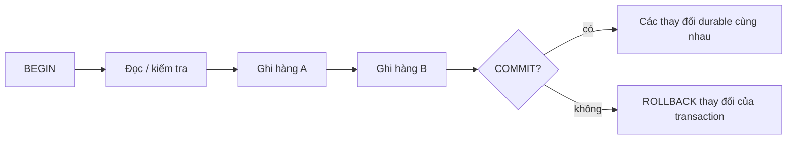
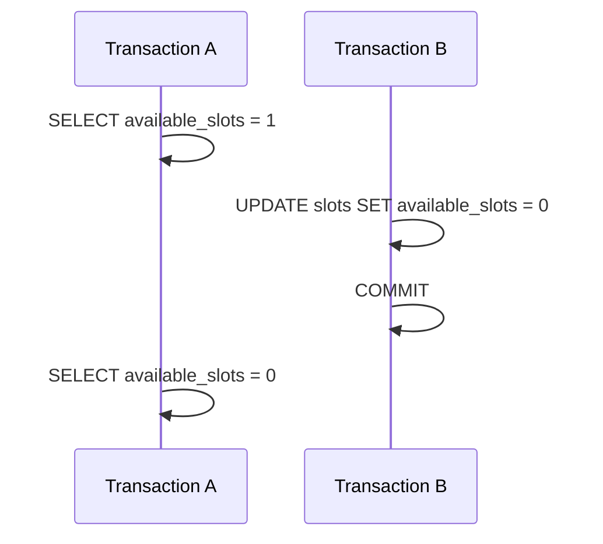
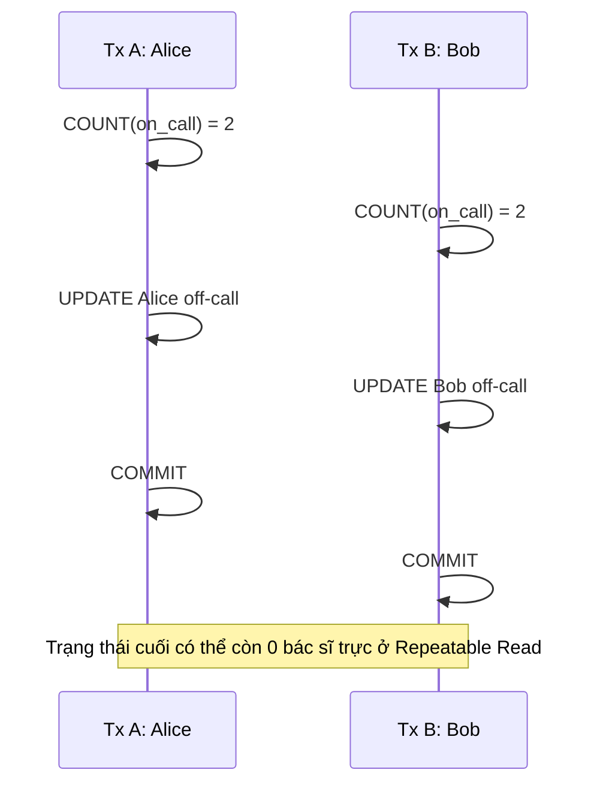

# Transaction & Isolation: Đảm bảo tính nhất quán khi có đồng thời

Hãy hình dung hệ thống trực ban của một bệnh viện cấp cứu với quy định sinh tử: *"Luôn luôn phải có ít nhất một bác sĩ trực tại khoa bất kể thời điểm nào."* Đúng 03:00:00 sáng, hai bác sĩ trực là Alice và Bob đều kiệt sức và nộp đơn xin nghỉ cùng một giây qua ứng dụng di động. Hai transaction cơ sở dữ liệu đồng thời được mở trên PostgreSQL ở mức cô lập `Repeatable Read`.

Transaction A truy vấn lịch trực, đếm thấy 2 bác sĩ đang trực, thỏa mãn điều kiện nên duyệt cho Alice nghỉ. Cùng thời điểm đó, transaction B cũng truy vấn lịch trực, đếm thấy 2 bác sĩ đang trực, thỏa mãn điều kiện nên duyệt cho Bob nghỉ. Do Alice và Bob cập nhật trên hai dòng dữ liệu hoàn toàn khác nhau, cơ chế khóa hàng (row-level lock) không hề phát sinh xung đột. Cả hai transaction commit trót lọt không một lỗi nhỏ. Chỉ một phần nghìn giây sau, khoa cấp cứu rơi vào thảm kịch: **không còn bất kỳ bác sĩ nào trực ban**.

Đó chính là thảm họa **Write Skew** kinh điển. Cả hai transaction đều ra quyết định hoàn toàn hợp lệ trên snapshot cục bộ của mình, nhưng sự xen kẽ đồng thời của chúng đã phá hủy hoàn toàn ràng buộc bất biến (invariant) cốt lõi của hệ thống. Đặt câu lệnh giữa `BEGIN` và `COMMIT` chỉ mang lại tính nguyên tử (atomicity), chứ tuyệt đối không giúp ứng dụng miễn nhiễm với race condition. Để làm chủ hệ thống chịu tải cao, bạn phải phân biệt rạch ròi giữa `Read Committed`, `Repeatable Read`, vận dụng khóa tường minh (`FOR UPDATE`) và mức cô lập `Serializable` đi kèm vòng lặp retry loop xử lý mã lỗi serialization failure `40001`.

> 💡 **Quy tắc bỏ túi:** Một transaction mang tính nguyên tử (atomic) chỉ đảm bảo các thao tác ghi cùng thành công hoặc cùng thất bại—chứ không bảo đảm các quyết định đồng thời là an toàn. Nếu ràng buộc bất biến (invariant) trải dài trên nhiều hàng, bạn bắt buộc phải dùng khóa tường minh (`SELECT ... FOR UPDATE`), database constraint, hoặc mức cô lập `Serializable` đi kèm vòng lặp retry khi gặp mã lỗi `40001`.

## Tóm tắt

- **Atomicity không đồng nghĩa với Isolation:** `BEGIN` và `COMMIT` chỉ cam kết các thao tác ghi cùng thành công hoặc cùng rollback. Ranh giới này không ngăn được các session chạy song song đọc dữ liệu trung gian hoặc đưa ra những quyết định xung đột.
- **Ranh giới snapshot quyết định tính khả kiến (visibility):** Trong `Read Committed`, mỗi câu lệnh SQL nhận một snapshot dữ liệu mới; trong khi ở `Repeatable Read` và `Serializable`, transaction giữ nguyên một snapshot ổn định duy nhất từ câu lệnh truy vấn dữ liệu đầu tiên.
- **Write Skew phá vỡ các invariant liên hàng:** `Repeatable Read` trong PostgreSQL triệt tiêu hoàn toàn dirty read, non-repeatable read và phantom read, nhưng vẫn để lọt lỗi write skew khi các transaction chỉnh sửa các hàng độc lập dựa trên tập dữ liệu đọc chung.
- **Serializable bắt buộc phải có retry loop:** Khi chạy ở mức `Serializable`, PostgreSQL chủ động theo dõi các chu trình phụ thuộc đọc/ghi và lập tức ngắt một transaction bằng mã lỗi serialization failure `40001`. Ứng dụng phải bắt mã lỗi này và thử lại toàn bộ transaction từ đầu.
- **Transaction dừng lại ở ranh giới database:** Cơ sở dữ liệu không thể rollback tiền đã trừ qua cổng thanh toán hay email đã gửi cho khách hàng. Tuyệt đối không đưa network I/O vào trong transaction; hãy dùng pattern Transactional Outbox.
- **Cạm bẫy chết người:** Lầm tưởng `Repeatable Read` ngăn chặn được mọi race condition. Mức cô lập này chỉ giữ snapshot ổn định, nhưng vẫn để lọt thảm họa Write Skew trừ khi bạn khóa dữ liệu có chủ đích hoặc nâng lên mức `Serializable`.

## Một mental model: atomicity không phải isolation



Một thao tác chuyển tiền có thể đảm bảo tính nguyên tử (atomic) nhưng kết quả vẫn bị sai lệch khi có concurrency nếu hai transaction cùng ra quyết định dựa trên các snapshot không bảo toàn được invariant chung.

<TermBox term="Transaction">
**Transaction** là một đơn vị công việc trong cơ sở dữ liệu kết thúc bằng commit hoặc rollback. PostgreSQL cũng hỗ trợ savepoint để rollback một phần công việc bên trong transaction lớn hơn.

**Vì sao quan trọng ở đây:** Ranh giới transaction quyết định những thay đổi nào trong cơ sở dữ liệu sẽ thành công hoặc thất bại cùng nhau. Bản thân ranh giới này không tự động bảo vệ quy trình đọc-sửa-ghi (read-modify-write) an toàn trước các quyết định chạy đồng thời.
</TermBox>

## Bắt đầu từ invariant, không phải tên isolation level

Giả sử giao dịch chuyển tiền phải bảo toàn ràng buộc bất biến (invariant):

> Tiền không được tự sinh ra hoặc mất đi trong quá trình chuyển tiền: ghi nợ (debit) và ghi có (credit) phải cùng commit hoặc cùng không commit.

```sql
BEGIN;

UPDATE accounts
SET balance_cents = balance_cents - 10_000
WHERE id = 1;

UPDATE accounts
SET balance_cents = balance_cents + 10_000
WHERE id = 2;

COMMIT;
```

Ranh giới transaction này bảo vệ hai thao tác ghi không bị commit dở dang (partial commit). Tuy nhiên, một quy tắc nghiệp vụ như “số dư tài khoản không bao giờ được âm” đòi hỏi tư duy sâu hơn. Nếu ứng dụng đọc số dư trước, thấy đủ tiền rồi mới thực hiện ghi sau đó, các transaction chạy song song có thể chen ngang vào khoảng thời gian ra quyết định này trừ khi cú pháp SQL, khóa (lock), ràng buộc dữ liệu (constraint) hoặc chiến lược isolation chủ động chặn đứng kẽ hở đó.

Một chuỗi câu hỏi review hữu ích:

- Điều gì phải luôn đúng sau mọi commit thành công?
- Những hàng dữ liệu hoặc điều kiện vị từ (predicate) nào quyết định điều đó?
- Hai transaction có thể đều đưa ra quyết định hợp lệ cục bộ nhưng khi kết hợp lại sẽ phá vỡ invariant không?
- Cơ chế cơ sở dữ liệu (database mechanism) nào sẽ từ chối hoặc tuần tự hóa kiểu xen kẽ xung đột đó?

## Read Committed: mỗi statement có snapshot mới

Isolation mặc định của PostgreSQL là `Read Committed`. Một `SELECT` thông thường thấy dữ liệu đã commit trước lúc statement bắt đầu. Vì vậy hai statement liên tiếp trong cùng transaction có thể thấy hai trạng thái committed khác nhau.



Hành vi này thường hoàn toàn phù hợp. Transaction có thể thấy state mới đã commit khi nó tiếp tục chạy. Nhưng điều đó cũng có nghĩa “tôi đã đọc giá trị này trước đó trong transaction” không tự động trở thành premise ổn định cho logic phía sau.

Với update trực tiếp trên hàng xác định, SQL thường có thể để database thực hiện operation nhạy với concurrency theo cách atomic hơn:

```sql
UPDATE accounts
SET balance_cents = balance_cents - 10_000
WHERE id = 1
  AND balance_cents >= 10_000
RETURNING balance_cents;
```

Nếu không có hàng nào được trả về thì debit không xảy ra. Cách này có thể an toàn hơn một `SELECT` riêng rồi một `UPDATE` vô điều kiện ở phía sau.

<TermBox term="Snapshot">
**Snapshot** quyết định version nào của các hàng mà statement hoặc transaction có thể nhìn thấy.

**Vì sao quan trọng ở đây:** trong PostgreSQL `Read Committed`, mỗi statement có snapshot mới; trong `Repeatable Read` và `Serializable`, transaction giữ snapshot ổn định từ statement truy cập dữ liệu đầu tiên. Snapshot ổn định ngăn một số anomaly nhưng không đồng nghĩa mọi kết quả concurrent đều serializable.
</TermBox>

## Repeatable Read: view ổn định nhưng không bảo vệ mọi invariant

Ở `Repeatable Read`, các query liên tiếp thấy một snapshot ổn định. PostgreSQL ngăn dirty read, nonrepeatable read và phantom read ở level này, nhưng **serialization anomaly vẫn có thể xảy ra**.

Ví dụ write skew kinh điển: có hai bác sĩ Alice và Bob đều đang trực. Invariant là:

> Phải luôn còn ít nhất một bác sĩ đang trực.

Hai transaction chạy đồng thời đều thấy có hai bác sĩ trực và mỗi transaction tắt trạng thái trực của một người khác nhau:



Vì hai transaction update hai hàng khác nhau, row-level write conflict đơn thuần không nhất thiết chặn outcome này. Mỗi quyết định đều hợp lệ trong snapshot riêng nhưng hai commit cùng nhau phá invariant liên hàng.

Điểm phân biệt quan trọng:

- stable reads bảo vệ khỏi snapshot thay đổi giữa chừng;
- serializable execution bảo vệ khỏi outcome đã commit mà không thể giải thích bằng bất kỳ thứ tự chạy từng transaction một nào.

## Serializable: hoặc outcome serializable, hoặc transaction bị abort

PostgreSQL `Serializable` có kiểu visibility giống `Repeatable Read` nhưng thêm theo dõi các read/write dependency nguy hiểm. Nếu các transaction concurrent sẽ tạo outcome không tương thích với mọi serial ordering, PostgreSQL abort một transaction.

Vì vậy application contract phải bao gồm retry.

```text
ERROR: could not serialize access due to read/write dependencies among transactions
SQLSTATE: 40001
```

<TermBox term="Serialization failure">
**Serialization failure** là transaction abort có chủ đích để ngăn outcome concurrent không an toàn. PostgreSQL báo lỗi này bằng SQLSTATE `40001`.

**Vì sao quan trọng ở đây:** không thể chỉ catch quanh một SQL statement rồi tiếp tục transaction cũ. Các read và decision của attempt đó dựa trên snapshot không còn an toàn để commit. Hãy abort và retry toàn bộ transaction logic từ đầu.
</TermBox>

Retry ở service layer nên có hình dạng khái niệm như sau:

```text
for bounded attempt count:
  bắt đầu transaction với isolation phù hợp
  đọc lại state hiện tại
  chạy lại validation và decision
  thực hiện write
  commit
  nếu SQLSTATE == 40001:
    bỏ toàn bộ kết quả attempt và chạy lại từ đầu
```

Dùng retry có giới hạn và có observability. Nếu serialization failure xảy ra thường xuyên, hãy điều tra transaction size, hot contention, access pattern và việc strategy có phù hợp workload không; không nên che contention kéo dài bằng infinite retry.

PostgreSQL cũng khuyến nghị cân nhắc retry deadlock (`40P01`). Đây là failure class khác nhưng cùng lesson cốt lõi: transaction đã chết không thể tiếp tục từ giữa.

## Khi explicit row lock là công cụ rõ ràng hơn

Một số transaction cố ý phối hợp quanh các hàng hiện có cụ thể. `SELECT ... FOR UPDATE` có thể làm coordination đó explicit.

```sql
BEGIN;

SELECT id, balance_cents
FROM accounts
WHERE id IN (1, 2)
ORDER BY id
FOR UPDATE;

-- kiểm tra invariant và thực hiện cả hai update

COMMIT;
```

`ORDER BY id` cố định không phải phép màu chống deadlock, nhưng việc luôn acquire cùng logical resources theo cùng thứ tự là một kỹ thuật quan trọng để giảm deadlock.

Dùng lock khi resource cần bảo vệ là cụ thể và blocking chấp nhận được. Không nên dùng row lock như thể nó có thể bảo vệ predicate gồm những hàng chưa tồn tại; trong trường hợp đó constraint, data model khác hoặc Serializable reasoning có thể phù hợp hơn.

Cũng phải nhớ chi phí: transaction giữ lock trong lúc chờ HTTP call, input người dùng hoặc computation chậm sẽ kéo dài contention và có thể biến correctness tool thành availability problem.

## Transaction dừng ở ranh giới database

Reasoning sau là không an toàn:

```text
BEGIN
  charge payment provider
  insert order
  send email
COMMIT
```

Database không thể rollback một card charge đã thành công hay email đã gửi. Local transaction chỉ cho atomicity trên những resource tham gia transaction đó.

Với cross-system workflow, dùng pattern dành cho partial failure: idempotency key, durable state transition, transactional outbox, reconciliation và compensating action khi phù hợp. Đừng kéo transaction dài hơn trong khi giả định external system đã tham gia vào nó.

## Kịch bản production: oversell ghế cuối cùng

Một ticket service lưu inventory trong một hàng với `remaining = 1`. Application flow:

1. `SELECT remaining`;
2. nếu còn hàng, gọi pricing logic;
3. sau đó `UPDATE inventory SET remaining = remaining - 1`;
4. tạo reservation.

Khi tải cao, hai request có thể cùng ra quyết định chấp thuận đặt chỗ trước khi thao tác ghi của request bên kia trở nên khả kiến (visible).

**Hậu quả:** hai khách cùng nhận confirmed reservation cho ghế cuối, dẫn đến refund và xử lý support thủ công.

**Nguyên nhân cốt lõi:** business invariant “remaining không xuống dưới 0 và mỗi reservation thành công tiêu thụ đúng một đơn vị” nằm trong timing của application thay vì một database operation concurrency-safe hoặc transaction strategy được bảo vệ.

**Cách khắc phục chuẩn:** biểu diễn decrement bằng conditional update (`... WHERE remaining > 0`) khi một hàng đại diện đầy đủ invariant, hoặc dùng lock/Serializable transaction phù hợp khi decision trải trên nhiều hàng hoặc predicate. Reservation creation phải nằm trong cùng local transaction. Nếu transaction có thể lỗi `40001`, retry toàn bộ decision với state mới. Payment hoặc messaging phải dùng pattern idempotent/durable thay vì giả định database có thể rollback chúng.

Bài học sâu sắc hơn ở đây là chuyển hóa tính đúng đắn (correctness) từ phỏng đoán mơ hồ “các request chắc không chạy trùng nhau đâu” thành các quy tắc bất biến được database thực thi nghiêm ngặt về việc những luồng thực thi xen kẽ nào mới được phép commit.

## Những lỗi thường gặp

### “Đã đặt trong transaction thì chắc chắn không còn race condition”

Commit mang tính nguyên tử (atomic) hoàn toàn không đồng nghĩa với thực thi tuần tự (serial execution). Kỹ sư bắt buộc phải phân tích kỹ các thao tác đọc song song và logic ra quyết định làm tiền đề cho các lệnh ghi.

### Chỉ retry câu lệnh SQL bị lỗi

Lỗi serialization failure làm vô hiệu hóa toàn bộ lần chạy của transaction đó. Cố tiếp tục chạy các câu lệnh sau là vô nghĩa; bạn phải rollback và thực thi lại toàn bộ chu trình nghiệp vụ trong một transaction mới toanh.

### Tăng mức isolation trên toàn hệ thống mà không đo lường độ tranh chấp

Mức cô lập càng cao thì chi phí đánh đổi về hiệu năng và nghẽn tài nguyên càng lớn. Hãy lựa chọn isolation level dựa trên invariant và đặc thù workload, sau đó theo dõi sát sao tỉ lệ retry, thời gian chờ lock (lock wait), thời lượng transaction và throughput thực tế.

### Giữ transaction mở trong khi chờ gọi remote I/O

Độ trễ mạng từ các lệnh gọi API bên ngoài sẽ kéo dài thời gian giữ lock và snapshot, thổi bùng sự tranh chấp tài nguyên. Hãy ghi nhận ý định vào local database, commit sớm nhất có thể, rồi điều phối công việc bên ngoài bằng các pattern workflow bền vững như Transactional Outbox.

### Nhầm tưởng Repeatable Read tương đương với Serializable

Trong PostgreSQL, `Repeatable Read` mạnh hơn tiêu chuẩn SQL ANSI tối thiểu và ngăn chặn được phantom read, nhưng vẫn hoàn toàn để lọt các bất thường như Write Skew. Bạn phải nắm vững cơ chế thực tế của PostgreSQL thay vì học vẹt theo các định nghĩa lý thuyết chung chung.

## Tự kiểm tra

Hai transaction concurrent chạy PostgreSQL `Repeatable Read`. Mỗi transaction đếm active approver của một tenant, thấy hai người, rồi deactivate một approver khác nhau. Business rule yêu cầu luôn còn ít nhất một approver active.

Điều gì còn thiếu nếu hai transaction update hai hàng khác nhau?

<details>
<summary>Xem giải thích chi tiết</summary>

Snapshot ổn định vẫn chưa đủ. Mỗi transaction có thể ra quyết định hợp lệ trong snapshot riêng và update hàng khác nhau, tạo write-skew outcome phá invariant liên hàng.

Fix có thể khác tùy model: serialize access qua một hàng đại diện invariant, dùng explicit lock phù hợp, redesign constraint để database enforce trực tiếp, hoặc chạy toàn decision ở `Serializable` và retry transaction attempt lỗi `40001`.

</details>

## Checklist review transaction

- [ ] **Invariant:** Tôi có thể phát biểu điều gì phải luôn đúng sau mọi commit thành công không?
- [ ] **Boundary:** Tất cả database write cần cho invariant có nằm trong cùng transaction không?
- [ ] **Concurrency:** Hai transaction có thể cùng pass validation từ state mà mỗi bên thấy rồi cùng nhau phá invariant không?
- [ ] **SQL shape:** Conditional `UPDATE`, unique constraint hoặc database constraint khác có thể thay read-then-write race không?
- [ ] **Isolation:** Tôi hiểu semantics PostgreSQL của isolation level đang chọn hay chỉ dựa vào label chung?
- [ ] **Locks:** Nếu dùng explicit lock, resource và thứ tự acquire có chủ đích không, và blocking có chấp nhận được không?
- [ ] **Retries:** Application có retry toàn transaction khi gặp `40001` với policy bounded và observable không?
- [ ] **Duration:** Remote I/O hoặc computation không liên quan có giữ transaction mở lâu hơn integrity cần không?
- [ ] **External effects:** Payment, messaging và non-database side effect có dùng idempotency/durable workflow pattern không?
- [ ] **Observability:** Production có nhìn thấy lock wait, deadlock, serialization failure, transaction duration và retry count không?

## Quy tắc cho agent

Khi review transactional workflow, không dừng ở `BEGIN`/`COMMIT`. Hãy trích xuất invariant, liệt kê concurrent read/write, xác định database mechanism nào từ chối unsafe interleaving, và xác minh retry boundary. Nếu có external system, phải tách rõ local transaction guarantee khỏi cross-system delivery guarantee.

## Khái niệm liên quan

- **Database Indexes & Query Plans** — access path ảnh hưởng thời gian transaction giữ snapshot và lock.
- **MVCC** — row-version visibility là cơ chế phía sau snapshot của PostgreSQL.
- **Idempotency** — retry và cross-system workflow cần effect có thể lặp an toàn, không chỉ request có thể lặp.
- **Partial Failure** — remote system có thể thành công hoặc thất bại độc lập với local database transaction.
- **Transactional Outbox** — ghi local state và intent publish cùng một transaction rồi xử lý publish sau commit.

Tiếp tục theo lộ trình [Backend Systems](/vi/docs/learning-paths/backend-systems) tới partial failure, timeouts, retries, delivery semantics và transactional outbox.

## Nguồn

Các tài liệu PostgreSQL chính thức được xác minh ngày **2026-09-10**:

- [PostgreSQL documentation — Transactions](https://www.postgresql.org/docs/current/tutorial-transactions.html)
- [PostgreSQL documentation — Transaction Isolation](https://www.postgresql.org/docs/current/transaction-iso.html)
- [PostgreSQL documentation — Explicit Locking](https://www.postgresql.org/docs/current/explicit-locking.html)
- [PostgreSQL documentation — Serialization Failure Handling](https://www.postgresql.org/docs/current/mvcc-serialization-failure-handling.html)
- [PostgreSQL documentation — SET TRANSACTION](https://www.postgresql.org/docs/current/sql-set-transaction.html)

Bài này được phân loại **evolving** với chu kỳ review 180 ngày vì concurrency behavior, guidance vận hành và chi tiết theo phiên bản database vẫn có thể thay đổi dù mental model invariant-first khá bền vững.
