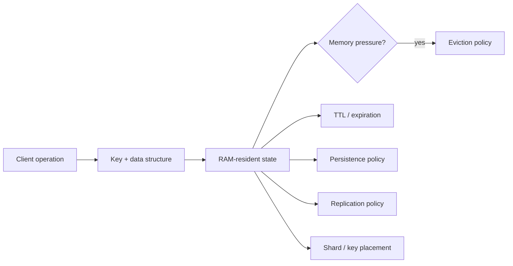
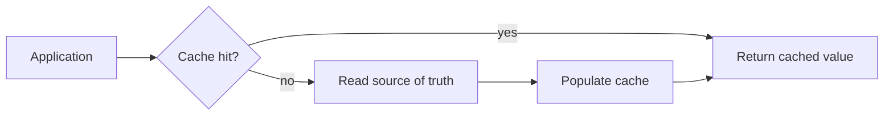
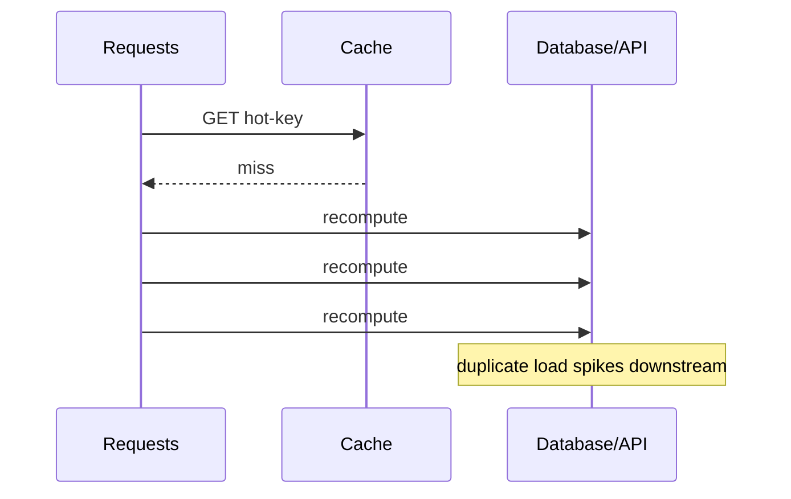
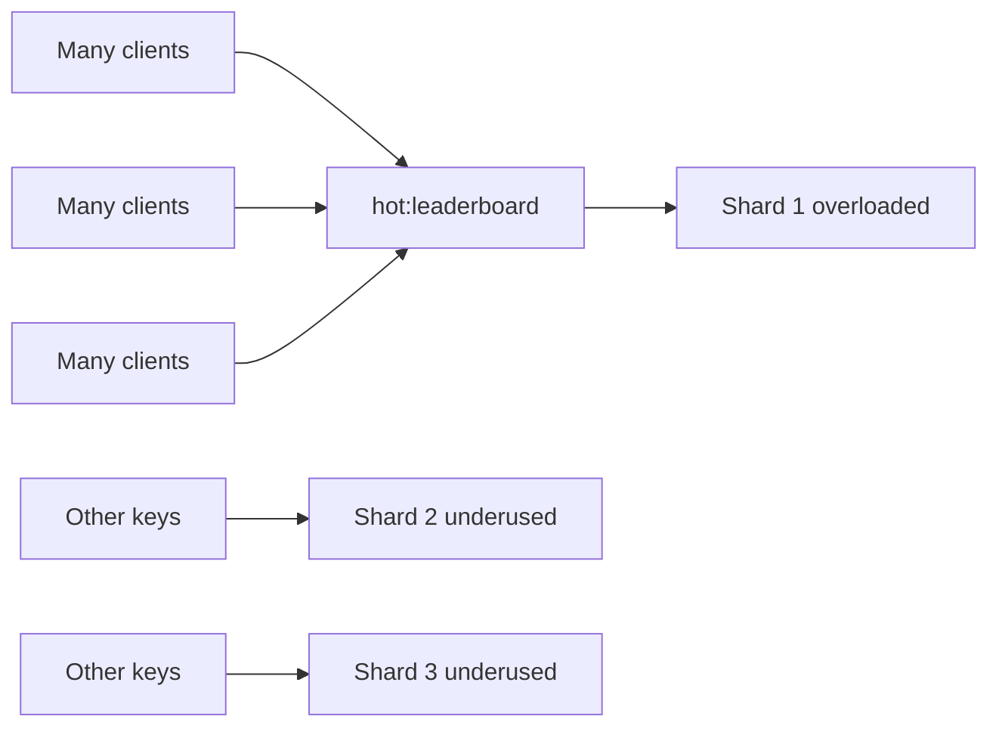

# In-Memory Data Stores: Reason About Latency, Memory, and Durability

## TL;DR

An in-memory data store keeps its active data primarily in RAM so reads and writes can avoid much of the latency of disk-oriented storage paths. The useful engineering question is not “is RAM fast?” It is:

> **What correctness and failure contract are you buying with that fast access path?**

A durable relational database, an evictable cache, an in-memory primary with persistence, and a replicated ephemeral counter service can all expose key/value APIs while making very different promises.

Use this mental model:

```text
request
  -> choose key + data structure
  -> access RAM-resident working set
  -> maybe expire or evict data under policy
  -> maybe persist writes to durable storage
  -> maybe replicate to another node
  -> maybe route/shard the key across a cluster
```

Each “maybe” is a contract decision, not an implementation footnote.



<TermBox term="Working set">
A **working set** is the portion of data actively needed by the workload over a relevant time window.

**Why it matters here:** an in-memory design is economical when the important working set fits the available memory budget. If the workload continually touches more data than RAM can hold, eviction, misses, remote fetches, or tiering behavior can dominate the latency story.
</TermBox>

## 1. “In memory” describes placement, not correctness

RAM changes the latency profile, but it does not tell you whether data is:

- durable after process or host failure;
- replicated to another machine;
- allowed to disappear under memory pressure;
- automatically deleted after a TTL;
- authoritative or merely a copy;
- consistent across replicas;
- recoverable to a historical point in time.

Two systems can both be “in-memory” while one is an evictable cache and the other is a primary database with append-only persistence and replicas.

Before selecting a product, classify the state:

```text
recomputable copy        -> cache
short-lived coordination -> locks / leases / rate counters
session-like state       -> bounded lifetime, explicit loss tolerance
queue-like transient data -> delivery contract matters
primary business record  -> durability + recovery contract matters
```

The data's role determines which failures are acceptable.

## 2. Cache and source of truth are different roles

A cache is valuable because the application can usually recover from a miss by loading or recomputing the value from an authoritative source.



That recovery path is what makes eviction safe.

If deleting a key means permanently losing the only accepted copy of a business fact, the store is no longer “just a cache.” It is carrying authoritative state and must be reviewed for durability, replication, backup, recovery, and mutation semantics accordingly.

A useful review question is:

> If this entire keyspace vanished at 03:00, what would we rebuild, what would we lose, and what customer-visible contract would be violated?

If the answer is unclear, the source-of-truth boundary is unclear.

## 3. Memory is a capacity budget, not an infinite speed tier

RAM is finite and expensive relative to colder storage. An in-memory design therefore needs an explicit memory budget.

For Redis, `maxmemory` defines the memory limit used for the dataset, and `maxmemory-policy` determines what happens when that budget is exceeded.

The important engineering distinction is:

```text
memory budget exceeded
  -> evict selected keys
or
  -> reject writes that need more memory
```

Those outcomes have very different application consequences.

Do not size only from raw payload bytes. Real memory consumption also includes key metadata, data-structure overhead, allocator fragmentation, replication/persistence buffers, client output buffers, and workload-specific temporary allocations.

Measure the deployed workload rather than assuming that “10 GB of JSON” means “10 GB of RAM.”

## 4. Eviction is a correctness policy

<TermBox term="Eviction">
**Eviction** is deliberate removal of stored entries to stay within a memory limit.

Redis can use policies such as `allkeys-lru`, `allkeys-lfu`, volatile-key variants, random policies, or `noeviction`.

**Why it matters here:** once eviction is enabled, application correctness must tolerate any key eligible under that policy disappearing before the application explicitly deletes it.
</TermBox>

For a pure cache, eviction is expected behavior: a miss reloads data from the source of truth.

For correctness-bearing state, eviction can be dangerous:

```text
idempotency record evicted early -> duplicate logical operation may execute
rate-limit counter evicted       -> caller may regain burst capacity
session state evicted            -> user may be logged out or lose workflow state
lease metadata evicted           -> coordination assumptions may break
```

Do not store correctness state in the same evictable pool as disposable cache entries unless the contract explicitly tolerates that loss.

### LRU and LFU are policies, not prophecy

Redis documents LRU and LFU eviction as approximations designed to be efficient. They do not magically know business value.

A rarely-read idempotency key can be more important than a heavily-read product-page cache entry. Access frequency alone cannot express that semantic difference.

Separate workloads when their eviction meaning differs.

## 5. TTL and eviction solve different problems

A TTL says when a key should stop existing because its lifetime has expired.

Eviction says what may be removed early because memory is under pressure.

```text
TTL / expiration -> time-based lifecycle policy
eviction         -> capacity-pressure policy
```

These are not interchangeable.

Redis `EXPIRE` associates a timeout with a key. After the timeout expires, Redis deletes the key. The remaining lifetime can be inspected with `TTL` or `PTTL`.

A key can therefore disappear because:

- application code deleted it;
- its TTL expired;
- an eviction policy removed it;
- the dataset was lost during a failure not covered by durability/replication guarantees.

Your API contract should not collapse all of those into “cache miss” when their meanings differ.

## 6. TTL is part of the business guarantee when state has a retention window

Consider an idempotency record:

```text
idempotency:{customer}:{operation}
  -> response/result fingerprint
  -> TTL = 24 hours
```

That TTL is not housekeeping trivia. It defines how long the service promises to recognize a retry as the same logical operation.

Likewise:

```text
password-reset token -> security lifetime
rate-limit bucket     -> enforcement window
session               -> authentication/session lifetime
cache entry            -> freshness/recomputation policy
```

For correctness-bearing state, record the retention requirement before choosing the TTL.

Also consider synchronized expiry waves. If millions of keys share nearly the same expiration time, the application can experience a burst of misses and recomputation after they expire.

Jittering cache TTLs can reduce coordinated cache-miss spikes when exact synchronized expiry is not required.

## 7. Cache stampedes are a concurrency problem

When a popular cache entry expires, many requests can miss simultaneously and all recompute the same expensive value.



This is often called a cache stampede, dogpile, or thundering-herd effect.

Mitigations include:

- single-flight/request coalescing so one caller refreshes while others wait;
- stale-while-revalidate where serving slightly stale data is acceptable;
- probabilistic or jittered early refresh;
- per-key locks with bounded wait and failure handling;
- prewarming when the hot set is predictable.

The correct strategy depends on whether stale data is safe and how expensive recomputation is.

## 8. Persistence changes restart behavior, not the fact that RAM is the serving path

<TermBox term="Persistence">
**Persistence** writes enough information to durable storage that an in-memory dataset can be reconstructed after a restart or failure.

Redis supports RDB snapshots, AOF logging, both together, or no persistence.

**Why it matters here:** persistence turns “memory was lost” from guaranteed data loss into a recovery question, but each persistence mode still has its own latency, recovery-time, and data-loss window.
</TermBox>

Redis documents two main open-source persistence mechanisms:

### RDB snapshots

RDB creates point-in-time snapshots of the dataset at configured intervals.

Strengths include compact snapshots and fast bulk restore. The trade-off is that writes after the latest completed snapshot can be lost if the process or host fails before the next snapshot.

### AOF

The append-only file logs write operations so Redis can replay them during startup.

The durability window depends on the configured fsync policy. More frequent synchronization can reduce the loss window while increasing write-path cost.

### RDB + AOF

Using both can combine snapshot/recovery benefits with a more granular write log.

The key lesson is not “always enable both.” It is to write the required recovery contract first:

```text
How much acknowledged state may we lose?
How quickly must the service restart?
How large can recovery files become?
What backup survives host or site loss?
```

## 9. Persistence is not the same as replication

Persistence answers:

> Can this node reconstruct data after losing memory or restarting?

Replication answers:

> Is another live node receiving a copy of changes?

You often need both.

Redis replication is asynchronous by default. A primary can acknowledge a write before replicas have fully processed it. Redis offers `WAIT` to request acknowledgments from replicas, but its own documentation explicitly warns that this does not turn Redis into a strongly consistent CP system and does not make failover loss impossible.

So do not write:

```text
replica exists -> acknowledged write cannot be lost
```

Instead document the exact failure and persistence configuration that supports the required recovery point.

## 10. Replication and failover can expose stale or lost state

Suppose a session token is written to the primary and the primary fails immediately afterward.

If the write had not reached the promoted replica, the new primary may not contain that token.

For a disposable cache, that may be a harmless miss.

For authoritative session, idempotency, or workflow state, it can violate a user-visible guarantee.

That is why the same Redis topology can be safe for one keyspace and unsafe for another.

Classify data by loss tolerance rather than classifying the product once for every use case.

## 11. Sharding increases aggregate capacity but does not make every key faster

Redis Cluster partitions keys across **16,384 hash slots**. Each key maps to one slot, and each slot is owned by one shard at a time.

This allows a cluster to spread different keys across nodes and scale aggregate memory/throughput.

But one operation on one key still goes to the shard that owns that key.

```text
many independent keys -> can spread across shards
one extremely hot key  -> concentrates on one shard
```

This connects directly to the previous Partitioning & Sharding lesson: distribution helps only when the partitioning unit matches the workload.

## 12. Hot keys are a locality bottleneck

A **hot key** receives a disproportionate share of traffic.



Adding shards does not automatically split one key across them.

Common responses include:

- redesigning the key so work can be partitioned safely;
- replicating read-mostly hot data behind an architecture that tolerates consistency trade-offs;
- aggregating writes locally/batch-wise when exact per-event global serialization is unnecessary;
- moving expensive computation out of the hot request path;
- examining whether the chosen data structure/command has unexpectedly high complexity.

Do not blindly randomize keys if requests need atomic operations across the values you just separated.

## 13. Data structures shape both latency and semantics

In-memory systems are attractive partly because they expose specialized structures close to the serving path: strings/counters, hashes, sets, sorted sets, streams, probabilistic structures, and more.

Choose the structure from the operation you need to perform atomically or efficiently.

Examples:

```text
INCR-style counter     -> rate/accounting counters
SET membership         -> deduplication / membership checks
sorted set             -> ranked scores / delayed scheduling patterns
hash                    -> grouped fields under one key
stream                  -> append/read consumer patterns
```

But do not assume every command is constant time. Complexity varies by command, collection size, result size, and server implementation.

A fast storage medium cannot compensate for an operation that scans or returns unbounded data.

## 14. Network round trips can dominate tiny in-memory operations

If each server-side operation is very cheap, client/server round-trip time can become a large share of request latency.

Redis pipelining allows clients to send multiple commands without waiting for each reply before sending the next one, reducing repeated RTT cost and improving throughput.

But pipelining is not a correctness primitive and not a cure for slow commands or hot keys. Large pipelines can also require memory to queue replies.

Reason separately about:

```text
server execution cost
network round trips
payload size
client serialization
queueing under load
```

“In memory” only directly addresses part of that path.

## 15. Atomic operations are valuable, but multi-key boundaries matter

A single atomic counter increment can be far safer than application-side read-modify-write:

```text
GET counter
counter = counter + 1
SET counter
```

which races under concurrency.

Prefer datastore-native atomic operations for counters, set-if-absent, conditional expiry, and other supported patterns.

However, once related keys live on different shards, multi-key operations may be restricted or require coordination. In Redis Cluster, hash tags can deliberately co-locate related keys into the same hash slot when atomic multi-key behavior is required.

That improves locality at the cost of concentrating those keys on one shard. Again, locality and distribution are a trade-off, not independent knobs.

## 16. Separate cache failure from application failure where possible

A cache or in-memory dependency should not automatically become a single point of failure for workflows that could continue safely without it.

For a cache-aside read:

```text
cache unavailable
  -> maybe fall back to source of truth
  -> protect source with bounded concurrency / load shedding
  -> avoid turning one cache outage into a database stampede
```

For correctness-bearing state:

```text
rate-limit store unavailable
idempotency store unavailable
session authority unavailable
```

there may be no safe fallback. The application must deliberately choose fail-open, fail-closed, degraded mode, or request rejection based on the business/security invariant.

Do not invent a fallback merely because availability is desirable.

## 17. Production scenario: disposable cache and correctness state share one eviction pool

A checkout service uses one Redis cluster for product cache entries, rate-limit counters, and payment idempotency records. The cluster uses an `allkeys-lru` eviction policy because the team thinks “Redis is just cache.” A traffic spike fills memory with large product responses.

The eviction policy begins removing least-recently-used keys across the entire keyspace, including idempotency records that were supposed to survive for 24 hours.

**Impact:** some retried checkout requests no longer find their idempotency records and execute a second logical payment attempt; rate-limit counters also disappear early, temporarily relaxing admission control; operational dashboards show normal Redis availability because no node crashed.

**Root cause:** the architecture classified the Redis deployment instead of classifying each kind of state. Disposable cache entries and correctness-bearing records had different loss/retention contracts but shared one memory budget and one eviction policy.

**Correct pattern:** separate state classes whose loss semantics differ, or configure a store/policy where correctness-bearing records cannot be evicted before their promised retention window; size and monitor memory headroom, keep TTL semantics explicit, choose persistence/replication according to recovery requirements, and make payment retries independently protected by durable business constraints where possible.

## 18. Review an in-memory design by writing the failure table

Before production, write a table like:

| State | Authoritative? | TTL | Evictable? | Persistence | Replication | Loss tolerance | Rebuild path |
|---|---|---:|---|---|---|---|---|
| product cache | no | 5 min | yes | none | optional | full loss okay | database/API |
| login session | maybe | 8 h | usually no | explicit | explicit | product-defined | re-auth / durable record |
| idempotency key | correctness metadata | 24 h | no before contract expires | explicit | explicit | very low | durable operation record |
| rate counter | enforcement state | 1 min | contract-dependent | often none | topology-dependent | security/product-defined | next window |

The exact answers vary. The important thing is that they exist.

## Self-check: can persistence make eviction safe?

A Redis instance stores payment idempotency records with a 24-hour TTL. It enables AOF persistence, but the instance also uses `allkeys-lru` because memory is tight.

Does AOF persistence guarantee those idempotency records remain available for the full 24 hours?

<details>
<summary>Show the reasoning</summary>

No. Persistence and eviction solve different problems.

AOF can help reconstruct the dataset represented by the persisted write history after restart, according to its durability policy. But an eviction policy is allowed to delete eligible keys during normal operation when the configured memory budget is exceeded.

Once an idempotency key is evicted, that removal becomes part of the datastore's current state. Persistence does not override the eviction contract and resurrect the key until its original TTL.

If the business guarantee requires the record to remain available for 24 hours, the memory/eviction design must preserve that retention contract independently of persistence.
</details>

## Production checklist

- [ ] **Role:** classify every keyspace as cache, coordination state, session state, transient stream, or authoritative business state.
- [ ] **Source of truth:** know what reconstructs the data if the entire in-memory store disappears.
- [ ] **Working set:** measure the active working set and real memory overhead, not only serialized payload bytes.
- [ ] **Memory budget:** configure and monitor explicit memory limits/headroom.
- [ ] **Eviction:** ensure every key eligible for eviction is semantically safe to lose early.
- [ ] **TTL contract:** treat TTL as part of retention/security/correctness semantics where applicable.
- [ ] **Stampede control:** protect expensive recomputation paths when hot entries expire or are evicted.
- [ ] **Persistence:** choose RDB/AOF/none from a written recovery-point and recovery-time requirement.
- [ ] **Replication:** do not assume an asynchronous replica has every acknowledged write.
- [ ] **Failover:** test what state can disappear when a replica becomes primary.
- [ ] **Hot keys:** observe per-key/per-shard concentration rather than only cluster-wide utilization.
- [ ] **Sharding:** keep related atomic operations colocated intentionally; measure resulting hotspot risk.
- [ ] **Operation complexity:** bound collection sizes, result sizes, and expensive commands.
- [ ] **Network path:** consider pipelining/batching where repeated RTT dominates and semantics permit it.
- [ ] **Fallback:** define fail-open, fail-closed, degraded, or source-of-truth fallback behavior explicitly.
- [ ] **Evidence:** monitor memory usage, evictions, expirations, hit rate, latency, replication health, persistence health, hot keys, and shard imbalance.

## Agent rule

When proposing an in-memory data store, do not justify it only with “Redis is fast.” State what the data means, whether it is authoritative, whether it may be evicted, how long it must live, what persistence and replication guarantee after failure, how hot keys map to shards, and what the application does when the store is unavailable. Treat memory pressure as a correctness event whenever eviction can remove state the business still needs.

## Sources

- [Redis Docs — Key eviction](https://redis.io/docs/latest/develop/reference/eviction/)
- [Redis Docs — EXPIRE](https://redis.io/docs/latest/commands/expire/)
- [Redis Docs — TTL](https://redis.io/docs/latest/commands/ttl/)
- [Redis Docs — Persistence](https://redis.io/docs/latest/operate/oss_and_stack/management/persistence/)
- [Redis Docs — Replication](https://redis.io/docs/latest/operate/oss_and_stack/management/replication/)
- [Redis Docs — Scale with Redis Cluster](https://redis.io/docs/latest/operate/oss_and_stack/management/scaling/)
- [Redis Docs — Pipelining](https://redis.io/docs/latest/develop/using-commands/pipelining/)
- [Redis Docs — Diagnosing latency issues](https://redis.io/docs/latest/operate/oss_and_stack/management/optimization/latency/)

This lesson is classified as **evolving** with a 180-day review target because Redis eviction options, persistence behavior, clustering capabilities, and operational guidance continue to evolve even though the core memory/durability trade-offs are durable.
