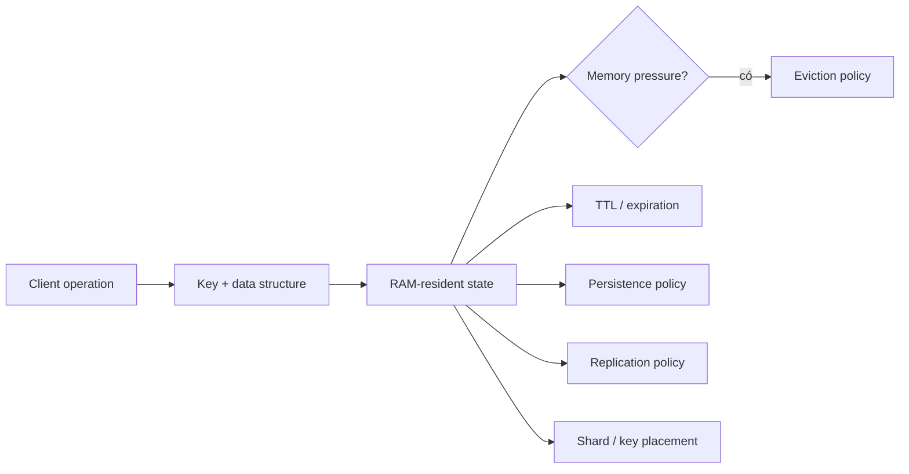
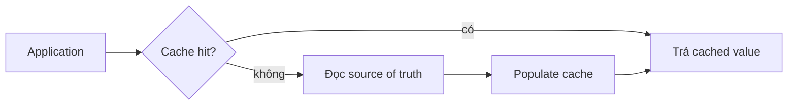
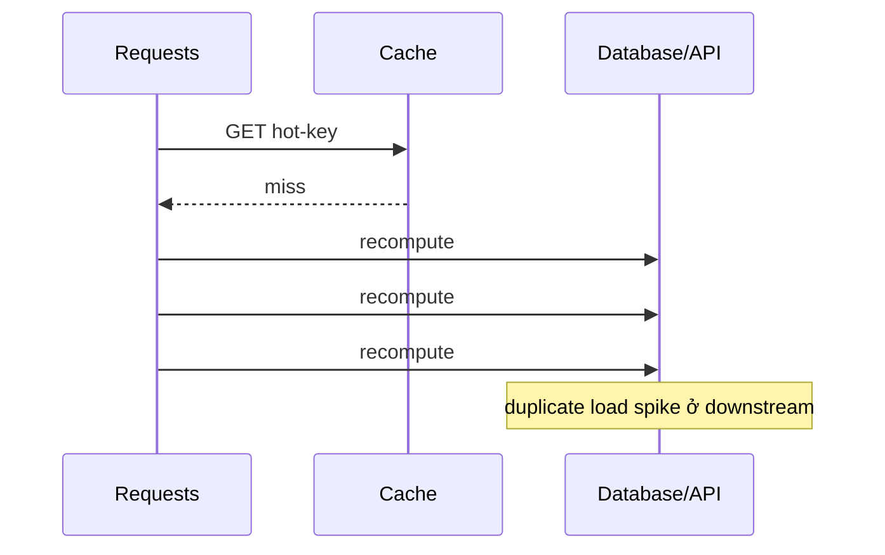
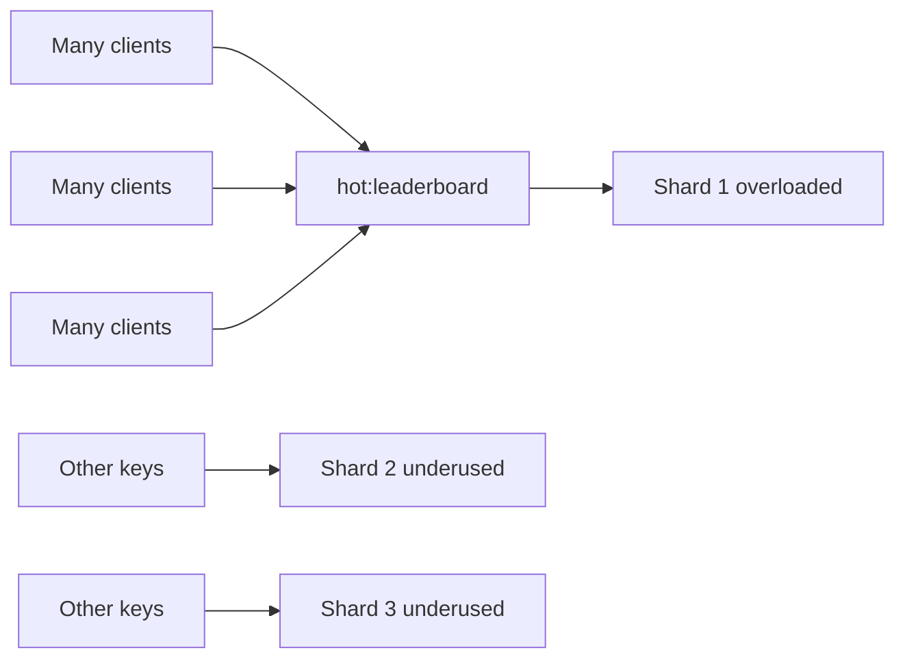

# In-Memory Data Stores: Suy luận về Độ trễ, Bộ nhớ và Durability

## Tóm tắt

In-memory data store giữ phần dữ liệu đang phục vụ chủ yếu trong RAM để read/write tránh phần lớn latency của storage path thiên về disk. Câu hỏi kỹ thuật có ích không phải “RAM có nhanh không?” mà là:

> **Bạn đang mua correctness và failure contract nào bằng fast access path đó?**

Một relational database bền vững, một cache được phép evict, một in-memory primary có persistence, và một replicated ephemeral counter service đều có thể trông giống key/value store nhưng hứa những điều rất khác nhau.

Mental model:

```text
request
  -> chọn key + data structure
  -> truy cập RAM-resident working set
  -> có thể expire hoặc evict dưới policy
  -> có thể persist write xuống durable storage
  -> có thể replicate sang node khác
  -> có thể route/shard key qua cluster
```

Mỗi chữ “có thể” ở trên là một contract decision, không phải chi tiết implementation phụ.



<TermBox term="Working set">
**Working set** là phần dữ liệu workload đang cần tích cực trong một khoảng thời gian có ý nghĩa.

**Vì sao quan trọng:** thiết kế in-memory hợp lý khi working set quan trọng vừa trong memory budget. Nếu workload liên tục chạm nhiều dữ liệu hơn RAM có thể giữ, eviction, cache miss, remote fetch hoặc tiering sẽ chi phối latency.
</TermBox>

## 1. “In memory” nói về placement, không nói về correctness

RAM thay đổi latency profile, nhưng không cho biết dữ liệu có:

- durable sau process/host failure hay không;
- được replicate sang máy khác hay không;
- được phép biến mất khi thiếu memory hay không;
- tự động bị xóa sau TTL hay không;
- authoritative hay chỉ là bản copy;
- consistent giữa replica hay không;
- recover được về historical point hay không.

Hai hệ thống đều “in-memory” nhưng một cái có thể chỉ là evictable cache, còn cái kia là primary database với append-only persistence và replica.

Trước khi chọn product, hãy phân loại state:

```text
recomputable copy        -> cache
short-lived coordination -> lock / lease / rate counter
session-like state       -> lifetime có giới hạn, loss tolerance rõ
queue-like transient data -> delivery contract quan trọng
primary business record  -> durability + recovery contract quan trọng
```

Vai trò của dữ liệu quyết định failure nào được chấp nhận.

## 2. Cache và source of truth là hai vai trò khác nhau

Cache có giá trị vì application thường có thể phục hồi cache miss bằng cách load hoặc recompute từ authoritative source.



Recovery path này là lý do eviction có thể an toàn.

Nếu xóa một key đồng nghĩa mất vĩnh viễn bản duy nhất của business fact, store đó không còn “chỉ là cache”. Nó đang giữ authoritative state và phải được review theo durability, replication, backup, recovery và mutation semantics tương ứng.

Một câu hỏi review hữu ích:

> Nếu toàn bộ keyspace biến mất lúc 03:00, thứ gì rebuild được, thứ gì mất hẳn, và customer-visible contract nào bị vi phạm?

Nếu chưa trả lời được, source-of-truth boundary vẫn chưa rõ.

## 3. Memory là capacity budget, không phải speed tier vô hạn

RAM hữu hạn và đắt hơn cold storage. Thiết kế in-memory vì vậy cần memory budget tường minh.

Với Redis, `maxmemory` xác định memory limit của dataset, còn `maxmemory-policy` quyết định chuyện gì xảy ra khi vượt budget.

Điểm phân biệt quan trọng:

```text
memory budget bị vượt
  -> evict key được chọn
hoặc
  -> reject write cần thêm memory
```

Hai outcome này có hậu quả application hoàn toàn khác nhau.

Đừng size chỉ từ raw payload bytes. Memory thực còn gồm key metadata, data-structure overhead, allocator fragmentation, replication/persistence buffer, client output buffer và temporary allocation theo workload.

Hãy đo workload thật thay vì giả định “10 GB JSON” bằng “10 GB RAM”.

## 4. Eviction là correctness policy

<TermBox term="Eviction">
**Eviction** là việc chủ động loại stored entry để giữ hệ thống trong memory limit.

Redis hỗ trợ các policy như `allkeys-lru`, `allkeys-lfu`, các volatile-key variant, random policy hoặc `noeviction`.

**Vì sao quan trọng:** khi bật eviction, application correctness phải chịu được việc mọi key đủ điều kiện theo policy có thể biến mất trước khi application chủ động xóa.
</TermBox>

Với pure cache, eviction là behavior mong đợi: miss thì load lại từ source of truth.

Với correctness-bearing state, eviction có thể nguy hiểm:

```text
idempotency record bị evict sớm -> duplicate logical operation có thể chạy
rate-limit counter bị evict       -> caller có thể lấy lại burst capacity
session state bị evict            -> user có thể logout hoặc mất workflow state
lease metadata bị evict           -> coordination assumption có thể hỏng
```

Đừng đặt correctness state vào cùng evictable pool với disposable cache entry trừ khi contract chấp nhận việc mất đó.

### LRU và LFU là policy, không phải business oracle

Redis mô tả LRU/LFU eviction là approximation tối ưu cho hiệu quả, không phải hiểu biết về business value.

Một idempotency key ít được read có thể quan trọng hơn một product-page cache entry được đọc liên tục. Access frequency không diễn đạt được semantic difference đó.

Hãy tách workload khi ý nghĩa eviction khác nhau.

## 5. TTL và eviction giải hai bài toán khác nhau

TTL nói key nên ngừng tồn tại khi nào vì lifetime đã hết.

Eviction nói key nào có thể bị loại sớm vì memory pressure.

```text
TTL / expiration -> time-based lifecycle policy
eviction         -> capacity-pressure policy
```

Hai khái niệm không thay thế nhau.

Redis `EXPIRE` gắn timeout với key. Sau khi timeout hết, Redis xóa key. Lifetime còn lại có thể xem bằng `TTL` hoặc `PTTL`.

Một key có thể biến mất vì:

- application code xóa;
- TTL hết hạn;
- eviction policy loại bỏ;
- dataset mất trong failure ngoài phạm vi durability/replication guarantee.

API contract không nên gom mọi trường hợp này thành “cache miss” nếu semantic khác nhau.

## 6. TTL là một phần business guarantee khi state có retention window

Ví dụ idempotency record:

```text
idempotency:{customer}:{operation}
  -> response/result fingerprint
  -> TTL = 24 giờ
```

TTL này không phải housekeeping trivia. Nó định nghĩa service hứa nhận ra retry như cùng logical operation trong bao lâu.

Tương tự:

```text
password-reset token -> security lifetime
rate-limit bucket     -> enforcement window
session               -> authentication/session lifetime
cache entry            -> freshness/recomputation policy
```

Với correctness-bearing state, hãy viết retention requirement trước khi chọn TTL.

Cũng phải nghĩ về synchronized expiry wave. Nếu hàng triệu key có gần cùng expiration time, application có thể gặp burst cache miss và recomputation cùng lúc.

Jitter cache TTL có thể giảm coordinated miss spike nếu business không cần expire đồng loạt chính xác.

## 7. Cache stampede là concurrency problem

Khi một hot cache entry hết hạn, nhiều request có thể miss đồng thời và cùng recompute expensive value.



Hiện tượng này thường được gọi là cache stampede, dogpile hoặc thundering herd.

Mitigation thường gồm:

- single-flight/request coalescing để một caller refresh, caller khác chờ;
- stale-while-revalidate nếu stale data chấp nhận được;
- probabilistic/jittered early refresh;
- per-key lock với bounded wait và failure handling;
- prewarming khi hot set dự đoán được.

Strategy đúng phụ thuộc vào việc stale data có an toàn không và recomputation đắt đến đâu.

## 8. Persistence thay đổi restart behavior, không thay đổi việc RAM là serving path

<TermBox term="Persistence">
**Persistence** ghi đủ thông tin xuống durable storage để in-memory dataset có thể reconstruct sau restart hoặc failure.

Redis hỗ trợ RDB snapshot, AOF logging, kết hợp cả hai, hoặc không persistence.

**Vì sao quan trọng:** persistence biến “memory mất” từ guaranteed data loss thành recovery question, nhưng mỗi mode vẫn có latency, recovery-time và data-loss window riêng.
</TermBox>

Redis mô tả hai cơ chế persistence chính:

### RDB snapshot

RDB tạo point-in-time snapshot của dataset theo interval cấu hình.

Ưu điểm là snapshot compact và bulk restore nhanh. Trade-off là write sau snapshot gần nhất có thể mất nếu process/host chết trước snapshot tiếp theo.

### AOF

Append-only file log write operation để Redis replay khi startup.

Durability window phụ thuộc fsync policy. Sync thường xuyên hơn có thể giảm loss window nhưng tăng cost trên write path.

### RDB + AOF

Kết hợp cả hai có thể lấy benefit của snapshot/recovery và granular write log.

Bài học không phải “luôn bật cả hai”, mà là viết recovery contract trước:

```text
Bao nhiêu acknowledged state được phép mất?
Service phải restart nhanh đến đâu?
Recovery file có thể lớn bao nhiêu?
Backup nào sống sót khi host/site mất?
```

## 9. Persistence không phải replication

Persistence trả lời:

> Node này có reconstruct data sau khi mất memory/restart không?

Replication trả lời:

> Có live node khác đang nhận copy của change không?

Nhiều hệ thống cần cả hai.

Redis replication mặc định asynchronous. Primary có thể acknowledge write trước khi replica xử lý xong. Redis có `WAIT` để yêu cầu acknowledgment từ replica, nhưng tài liệu chính thức nói rõ lệnh này không biến Redis thành strongly consistent CP system và không loại bỏ hoàn toàn khả năng mất write khi failover.

Vì vậy đừng suy luận:

```text
có replica -> acknowledged write không thể mất
```

Hãy document failure + persistence configuration cụ thể tạo nên recovery point cần thiết.

## 10. Replication và failover có thể làm lộ stale hoặc lost state

Giả sử session token được write vào primary rồi primary fail ngay sau đó.

Nếu write chưa tới replica được promote, new primary có thể không có token đó.

Với disposable cache, đây có thể chỉ là harmless miss.

Với authoritative session, idempotency hoặc workflow state, đây có thể vi phạm user-visible guarantee.

Cùng một Redis topology có thể an toàn cho keyspace này nhưng không an toàn cho keyspace khác.

Hãy phân loại data theo loss tolerance thay vì phân loại product một lần cho mọi use case.

## 11. Sharding tăng aggregate capacity nhưng không làm mọi key nhanh hơn

Redis Cluster chia key qua **16.384 hash slot**. Mỗi key map vào một slot và mỗi slot thuộc một shard tại một thời điểm.

Điều này giúp cluster trải các key khác nhau qua node và scale tổng memory/throughput.

Nhưng một operation trên một key vẫn đi tới shard sở hữu key đó.

```text
nhiều independent key -> có thể spread qua shard
một cực-hot key       -> tập trung lên một shard
```

Điều này nối trực tiếp với bài Partitioning & Sharding: distribution chỉ giúp khi partitioning unit phù hợp workload.

## 12. Hot key là locality bottleneck

**Hot key** nhận tỷ lệ traffic vượt trội.



Thêm shard không tự động split một key qua nhiều shard.

Response thường gặp:

- redesign key để work partition được an toàn;
- replicate read-mostly hot data nếu consistency trade-off cho phép;
- aggregate write theo local/batch khi không cần global serialization từng event;
- đưa expensive computation khỏi hot request path;
- kiểm tra data structure/command có complexity cao ngoài dự tính không.

Đừng randomize key mù quáng nếu request cần atomic operation qua những value vừa bị tách ra.

## 13. Data structure quyết định cả latency lẫn semantics

In-memory system hấp dẫn một phần vì expose specialized structure gần serving path: string/counter, hash, set, sorted set, stream, probabilistic structure và hơn nữa.

Chọn structure từ operation cần atomic hoặc efficient.

Ví dụ:

```text
INCR-style counter -> rate/accounting counter
SET membership     -> deduplication / membership check
sorted set         -> ranking / delayed scheduling pattern
hash               -> group field dưới một key
stream             -> append/read consumer pattern
```

Nhưng đừng giả định mọi command đều constant time. Complexity thay đổi theo command, collection size, result size và implementation.

Fast storage medium không cứu được operation scan hoặc trả unbounded data.

## 14. Network round trip có thể lớn hơn tiny in-memory operation

Nếu server-side operation rất rẻ, client/server RTT có thể chiếm phần lớn request latency.

Redis pipelining cho phép client gửi nhiều command mà không chờ từng reply trước khi gửi command tiếp, giảm repeated RTT cost và tăng throughput.

Nhưng pipelining không phải correctness primitive và không chữa slow command/hot key. Pipeline quá lớn còn dùng memory để queue reply.

Hãy tách riêng:

```text
server execution cost
network round trips
payload size
client serialization
queueing under load
```

“In memory” chỉ trực tiếp giải một phần path.

## 15. Atomic operation có giá trị, nhưng multi-key boundary vẫn quan trọng

Một atomic counter increment an toàn hơn application-side read-modify-write:

```text
GET counter
counter = counter + 1
SET counter
```

vốn race dưới concurrency.

Ưu tiên datastore-native atomic operation cho counter, set-if-absent, conditional expiry và pattern được support.

Nhưng khi related key nằm trên shard khác nhau, multi-key operation có thể bị hạn chế hoặc cần coordination. Redis Cluster có hash tag để cố ý co-locate related key vào cùng hash slot khi cần atomic multi-key behavior.

Điều này tăng locality nhưng cũng tập trung các key đó lên một shard. Locality và distribution là trade-off, không phải hai knob độc lập.

## 16. Nếu có thể, tách cache failure khỏi application failure

Cache/in-memory dependency không nên mặc định trở thành single point of failure cho workflow có thể tiếp tục an toàn mà không cần nó.

Với cache-aside read:

```text
cache unavailable
  -> có thể fallback về source of truth
  -> bảo vệ source bằng bounded concurrency / load shedding
  -> tránh biến cache outage thành database stampede
```

Với correctness-bearing state:

```text
rate-limit store unavailable
idempotency store unavailable
session authority unavailable
```

có thể không có safe fallback. Application phải cố ý chọn fail-open, fail-closed, degraded mode hoặc reject request theo business/security invariant.

Đừng invent fallback chỉ vì availability nghe hấp dẫn.

## 17. Tình huống production: disposable cache và correctness state dùng chung eviction pool

Checkout service dùng một Redis cluster cho product cache entry, rate-limit counter và payment idempotency record. Cluster dùng `allkeys-lru` vì team nghĩ “Redis chỉ là cache”. Một traffic spike làm memory đầy bởi product response lớn.

Eviction policy bắt đầu loại least-recently-used key trên toàn keyspace, bao gồm idempotency record đáng lẽ phải tồn tại 24 giờ.

**Hậu quả:** một số retry checkout không còn thấy idempotency record và thực hiện payment logical operation lần hai; rate-limit counter cũng biến mất sớm, tạm thời nới admission control; dashboard vẫn cho thấy Redis available vì không node nào crash.

**Nguyên nhân cốt lõi:** kiến trúc phân loại cả Redis deployment thay vì phân loại từng loại state. Disposable cache và correctness-bearing record có loss/retention contract khác nhau nhưng dùng chung memory budget và eviction policy.

**Cách khắc phục chuẩn:** tách state class có loss semantics khác nhau, hoặc dùng store/policy mà correctness-bearing record không thể bị evict trước retention window đã hứa; size và monitor memory headroom, làm TTL semantics rõ ràng, chọn persistence/replication theo recovery requirement, và bảo vệ payment retry thêm bằng durable business constraint khi có thể.

## 18. Review in-memory design bằng failure table

Trước production, hãy viết bảng kiểu:

| State | Authoritative? | TTL | Evictable? | Persistence | Replication | Loss tolerance | Rebuild path |
|---|---|---:|---|---|---|---|---|
| product cache | không | 5 phút | có | none | optional | mất hết vẫn ổn | database/API |
| login session | tùy contract | 8 giờ | thường không | explicit | explicit | product-defined | re-auth / durable record |
| idempotency key | correctness metadata | 24 giờ | không trước khi contract hết | explicit | explicit | rất thấp | durable operation record |
| rate counter | enforcement state | 1 phút | tùy contract | thường none | topology-dependent | security/product-defined | window tiếp theo |

Đáp án cụ thể có thể khác. Điều quan trọng là chúng tồn tại.

## Tự kiểm tra: persistence có làm eviction trở nên an toàn không?

Một Redis instance giữ payment idempotency record với TTL 24 giờ. Nó bật AOF persistence nhưng cũng dùng `allkeys-lru` vì memory chật.

AOF có đảm bảo idempotency record luôn tồn tại đủ 24 giờ không?

<details>
<summary>Xem giải thích chi tiết</summary>

Không. Persistence và eviction giải hai bài toán khác nhau.

AOF có thể giúp reconstruct dataset từ persisted write history sau restart theo durability policy. Nhưng eviction policy được phép xóa eligible key trong normal operation khi memory budget bị vượt.

Khi idempotency key đã bị evict, deletion đó trở thành state hiện tại của datastore. Persistence không override eviction contract để hồi sinh key tới hết TTL ban đầu.

Nếu business guarantee yêu cầu record tồn tại 24 giờ, memory/eviction design phải bảo toàn retention contract đó độc lập với persistence.
</details>

## Checklist production

- [ ] **Role:** phân loại từng keyspace là cache, coordination state, session state, transient stream hay authoritative business state.
- [ ] **Source of truth:** biết thứ gì reconstruct data nếu toàn bộ in-memory store biến mất.
- [ ] **Working set:** đo active working set và memory overhead thật, không chỉ serialized payload byte.
- [ ] **Memory budget:** cấu hình và monitor memory limit/headroom rõ ràng.
- [ ] **Eviction:** đảm bảo mọi key đủ điều kiện eviction đều an toàn khi mất sớm.
- [ ] **TTL contract:** coi TTL là retention/security/correctness semantics khi phù hợp.
- [ ] **Stampede control:** bảo vệ expensive recomputation path khi hot entry expire/evict.
- [ ] **Persistence:** chọn RDB/AOF/none từ recovery-point và recovery-time requirement đã viết.
- [ ] **Replication:** không giả định asynchronous replica có mọi acknowledged write.
- [ ] **Failover:** test state nào có thể biến mất khi replica trở thành primary.
- [ ] **Hot key:** quan sát per-key/per-shard concentration thay vì chỉ cluster-wide utilization.
- [ ] **Sharding:** chủ động colocate related atomic operation và đo hotspot risk sinh ra.
- [ ] **Operation complexity:** bound collection size, result size và expensive command.
- [ ] **Network path:** cân nhắc pipelining/batching khi repeated RTT chi phối và semantics cho phép.
- [ ] **Fallback:** định nghĩa fail-open, fail-closed, degraded hoặc source-of-truth fallback rõ ràng.
- [ ] **Evidence:** monitor memory usage, eviction, expiration, hit rate, latency, replication health, persistence health, hot key và shard imbalance.

## Quy tắc cho agent

Khi đề xuất in-memory data store, đừng biện minh chỉ bằng “Redis nhanh”. Hãy nêu dữ liệu có ý nghĩa gì, có authoritative không, có thể bị evict không, phải sống bao lâu, persistence/replication hứa gì sau failure, hot key map vào shard ra sao, và application làm gì khi store unavailable. Xem memory pressure là correctness event bất cứ khi nào eviction có thể loại state mà business vẫn cần.

## Nguồn tham khảo

- [Redis Docs — Key eviction](https://redis.io/docs/latest/develop/reference/eviction/)
- [Redis Docs — EXPIRE](https://redis.io/docs/latest/commands/expire/)
- [Redis Docs — TTL](https://redis.io/docs/latest/commands/ttl/)
- [Redis Docs — Persistence](https://redis.io/docs/latest/operate/oss_and_stack/management/persistence/)
- [Redis Docs — Replication](https://redis.io/docs/latest/operate/oss_and_stack/management/replication/)
- [Redis Docs — Scale with Redis Cluster](https://redis.io/docs/latest/operate/oss_and_stack/management/scaling/)
- [Redis Docs — Pipelining](https://redis.io/docs/latest/develop/using-commands/pipelining/)
- [Redis Docs — Diagnosing latency issues](https://redis.io/docs/latest/operate/oss_and_stack/management/optimization/latency/)

Bài này được phân loại **evolving** với chu kỳ review 180 ngày vì eviction option, persistence behavior, clustering capability và operational guidance của Redis tiếp tục thay đổi dù các trade-off cốt lõi về memory/durability khá bền vững.
