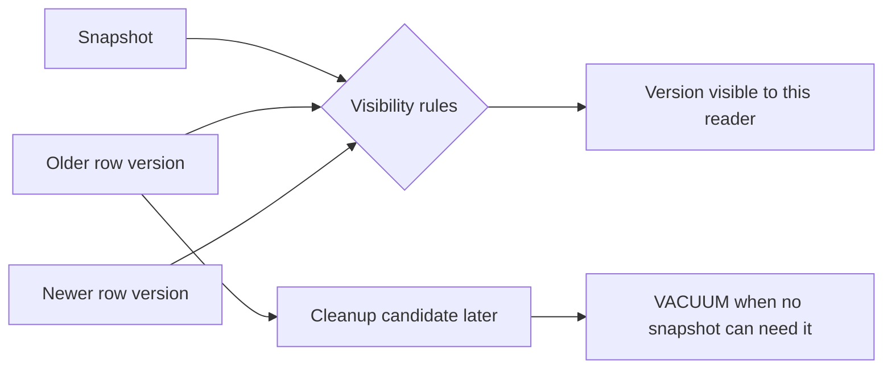
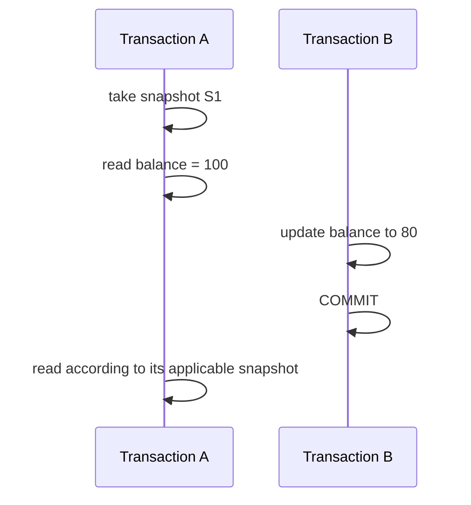
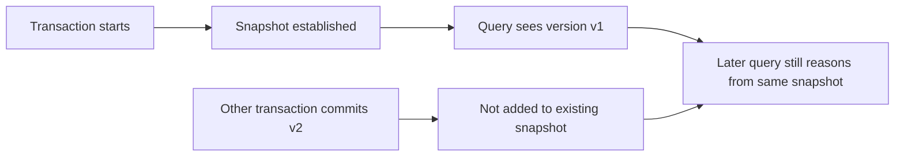

# MVCC: Reason About Snapshots and Row Versions

## TL;DR

Multi-version concurrency control (MVCC) lets a database keep **multiple row versions** so readers can evaluate a consistent snapshot while concurrent transactions continue changing data.

For PostgreSQL, use this mental model:

```text
statement or transaction takes a snapshot
  -> snapshot defines which transactions count as visible
  -> each logical row may have multiple physical tuple versions
  -> visibility rules choose the version this snapshot may see
  -> UPDATE / DELETE can leave older versions behind temporarily
  -> VACUUM reclaims versions that no relevant snapshot can need
```

MVCC reduces read-versus-write blocking, but it does **not** remove concurrency conflicts, row locks, transaction isolation rules, or cleanup work. The central mistake to avoid is treating “the row in the table” as one mutable object with one universally current value.



<TermBox term="MVCC">
**Multi-version concurrency control** is a concurrency-control approach in which the database preserves multiple versions of data so transactions can read a snapshot without requiring ordinary readers to block ordinary writers.

**Why it matters here:** concurrency becomes a visibility problem as well as a locking problem. Two sessions can read different committed versions of the same logical row because their snapshots represent different database moments.
</TermBox>

## 1. A logical row can have more than one physical version

Suppose an account row begins as:

```text
account 42 -> balance = 100
```

Transaction B updates the balance to `80`. A useful MVCC model is not “the database overwrites 100 with 80 and every reader instantly sees 80.” Instead, the database can preserve an older version long enough for readers whose snapshots still need it while making the newer version visible to later snapshots after B commits.

Conceptually:

```text
logical account 42
  version v1: balance = 100
  version v2: balance = 80
```

The versions are implementation records, not two business accounts. Visibility rules decide which version represents account 42 for a particular statement or transaction.

PostgreSQL implements MVCC using tuple versions associated with transaction visibility information. You normally reason from snapshots and isolation semantics rather than reading internal tuple headers in application code.

## 2. A snapshot is a visibility boundary, not a full database copy

<TermBox term="Snapshot">
A **snapshot** records enough transaction-visibility information for PostgreSQL to decide which row versions a statement or transaction may observe.

It is not a copied database image. It is a logical visibility boundary evaluated against row versions as queries run.
</TermBox>

Consider two transactions:



Whether A sees `100` or `80` on the later read depends on its isolation level and when PostgreSQL takes the snapshot used by that statement.

This is why “B committed first” is not enough to predict what A sees. You also need to know **which snapshot A is using**.

## 3. Visibility asks whether a version belongs to your database view

A row version can be physically present and still be invisible to your current snapshot.

At a practical level, visibility reasoning asks questions such as:

```text
Was the creating transaction committed before this snapshot considers it visible?
Was the version deleted or replaced by a transaction visible to this snapshot?
Was that changing transaction still in progress when the snapshot was taken?
Does the current transaction have special visibility to its own work?
```

Do not turn these questions into hand-written application rules. PostgreSQL owns the visibility algorithm. The application-level value is understanding why concurrent sessions can legitimately observe different versions.

### “Committed” does not always mean “visible to every already-running reader”

A newly committed version can be visible to a later statement using a newer snapshot while remaining invisible to an older transaction-level snapshot.

That is not stale-cache behavior. It is transaction isolation implemented through snapshot visibility.

## 4. Read Committed refreshes the snapshot per statement

PostgreSQL's default `Read Committed` isolation level gives each statement a snapshot that sees rows committed before that statement began.

```text
BEGIN;
SELECT balance FROM accounts WHERE id = 42;  -- statement snapshot S1
-- another transaction commits balance = 80
SELECT balance FROM accounts WHERE id = 42;  -- newer statement snapshot S2
COMMIT;
```

The two `SELECT` statements can therefore see different committed values inside one transaction.

MVCC makes that possible without requiring the first reader to keep writers blocked merely to preserve its first statement's view.

## 5. Repeatable Read keeps one stable transaction view

At PostgreSQL `Repeatable Read`, statements in a transaction see a snapshot established at the first non-transaction-control statement. Later commits from other transactions do not become visible inside that transaction's snapshot.



The benefit is a stable database view for repeated reasoning. The cost is that concurrency conflicts can still force the transaction to abort rather than letting every interleaving commit.

PostgreSQL documents that applications using `Repeatable Read` or `Serializable` must be prepared to retry transactions that fail with serialization errors.

## 6. MVCC reduces reader-writer blocking; it does not mean “no locks”

PostgreSQL's MVCC model allows ordinary reading to avoid conflicting with ordinary writing in the common case. That is a major concurrency advantage.

But statements still acquire locks for important purposes:

- row-changing statements coordinate with other row-changing statements;
- `SELECT ... FOR UPDATE` deliberately locks selected rows;
- DDL can require table locks that conflict with ordinary access;
- foreign-key enforcement and unique checks can create waits around concurrent changes;
- deadlocks remain possible when transactions acquire conflicting locks in different orders.

A useful distinction is:

```text
snapshot visibility -> which committed/in-progress versions may be read
locking             -> who must wait when operations conflict over protected resources
```

MVCC and locking cooperate. They are not competing explanations where only one applies.

## 7. UPDATE creates a newer version while the older version may remain useful

In PostgreSQL, updating a row creates a new tuple version. The previous version cannot always disappear immediately because an older snapshot may still be allowed to see it.

Conceptually:

```text
before UPDATE
  v1 -> visible to older and current snapshots

after UPDATE commits
  v1 -> still needed by some older snapshots
  v2 -> visible to newer snapshots

later
  v1 -> no active/relevant snapshot can need it
  v1 -> reclaimable by VACUUM
```

This model explains why update-heavy tables can accumulate dead row versions and why transaction lifetime affects storage cleanup.

## 8. DELETE also leaves history until it is safe to reclaim

A committed `DELETE` makes a row absent for snapshots that can see the delete. It does not require PostgreSQL to erase the old tuple bytes immediately.

Older snapshots may still need the prior row version. Once that version is no longer potentially visible, PostgreSQL can reclaim its space for reuse.

The consequence is important for operations: logical deletion and physical space reclamation are different events.

## 9. VACUUM is part of the MVCC lifecycle

<TermBox term="VACUUM">
In PostgreSQL, **VACUUM** reclaims or makes reusable space from obsolete row versions, maintains the visibility map, and helps protect against transaction ID wraparound. Planner statistics are gathered by `ANALYZE`, which can run separately or as an optional step with `VACUUM`.

**Why it matters here:** keeping old versions is what enables snapshot reads, but versions that no valid snapshot can need must eventually be cleaned up so history does not grow without bound.
</TermBox>

PostgreSQL's routine maintenance documentation separates these responsibilities: `VACUUM` handles obsolete row-version cleanup, visibility-map maintenance, and transaction-ID aging, while `ANALYZE` gathers statistics used by the query planner. The autovacuum subsystem can schedule both activities as tables change.

Standard `VACUUM` normally marks space for reuse inside the relation. It does not generally shrink the table file back to the operating system. `VACUUM FULL` is a different, heavier rewrite that requires an exclusive table lock and should not be treated as routine MVCC cleanup.

### Visibility map is an optimization aid, not the snapshot itself

PostgreSQL maintains a visibility map that can mark pages where tuples are known to be visible to all transactions. That information can let some index-only scans avoid fetching heap tuples just to re-check visibility.

Do not confuse that map with a transaction snapshot. A snapshot describes a transaction's view; the visibility map summarizes page-level facts useful for maintenance and query execution.

## 10. Long-running transactions can keep old versions alive

If a transaction keeps an old snapshot open, PostgreSQL must remain conservative about removing row versions that snapshot might still need.

This creates an operational chain:

```text
old snapshot remains active
  -> older tuple versions may remain potentially visible
  -> cleanup horizon cannot advance past what active work may need
  -> dead versions accumulate under write traffic
  -> tables/indexes can bloat and vacuum work becomes harder
```

A transaction does not need to be actively querying every second to matter. An application that begins a transaction and then waits on user input, remote I/O, a job queue, or forgotten connection-pool code can hold a snapshot much longer than intended.

Practical review questions include:

- How long can this transaction remain open?
- Does application code perform network calls while holding the transaction?
- Are idle-in-transaction sessions monitored?
- Can batch readers use smaller transaction boundaries?
- Are vacuum lag, dead tuples, and relation growth observable?

## 11. Transaction IDs are finite, so old history cannot remain unfrozen forever

PostgreSQL uses transaction identifiers as part of MVCC visibility. Traditional transaction IDs are finite and wrap around.

PostgreSQL therefore needs vacuuming and **freezing** to mark sufficiently old row versions so they remain safely interpretable as old/visible as transaction IDs continue advancing.

The operational lesson is not to memorize wraparound arithmetic. It is:

```text
MVCC metadata ages
  -> vacuum must eventually visit old data
  -> freezing prevents ancient committed rows from becoming ambiguous
  -> disabling or starving autovacuum can become a correctness/availability risk, not merely a disk-space issue
```

PostgreSQL's documentation describes transaction ID wraparound protection as one of the reasons every table must be vacuumed over time.

## 12. MVCC does not make every read-modify-write workflow safe

A snapshot can give each transaction a coherent view while two transactions still make decisions that conflict at the business level.

Example:

```text
Transaction A snapshot: doctor A is on call, doctor B is on call
Transaction B snapshot: doctor A is on call, doctor B is on call
A marks doctor A off call
B marks doctor B off call
```

If the invariant says at least one doctor must remain on call, each transaction's snapshot can look individually valid while the combined commits violate the rule under an insufficient isolation/locking strategy.

That problem belongs to transaction-isolation reasoning, not to “turning MVCC on.” PostgreSQL already uses MVCC; you still must select transaction boundaries and conflict handling that preserve the invariant.

## 13. Production scenario: an idle reporting transaction causes table growth

A reporting endpoint starts a transaction, runs an initial query, then streams result preparation through several remote enrichment calls before committing. A connection timeout bug sometimes leaves the session `idle in transaction` for hours. Meanwhile, a high-write `events` table receives frequent updates and deletes.

**Impact:** dead tuples accumulate, table and index sizes grow, vacuum cannot reclaim as much space as expected, query latency degrades as more pages are touched, and maintenance pressure rises even though the report itself is mostly read-only.

**Root cause:** the team treated a read-only transaction as harmless. Its old snapshot kept a visibility horizon open while write-heavy tables continued producing obsolete row versions. The transaction boundary included remote waiting that did not need database snapshot consistency.

**Correct pattern:** keep reporting transaction boundaries as short as the required consistency window, do not hold database transactions open across unrelated remote I/O, monitor long-running and idle-in-transaction sessions, set appropriate transaction/session timeouts, and observe dead tuples plus vacuum progress instead of reacting only after disk growth becomes obvious.

## 14. Diagnose MVCC problems by separating three questions

When production behavior looks strange, separate:

### What can the transaction see?

Check isolation level, statement/transaction snapshot timing, and whether the expected writer committed before the relevant snapshot boundary.

### What is waiting?

Check row/table locks, blocked sessions, deadlocks, and deliberately locking statements such as `SELECT ... FOR UPDATE`.

### What cannot be cleaned up yet?

Check long-running transactions, replication/maintenance horizons where relevant, dead tuple accumulation, vacuum progress, and transaction age.

Combining all three into “the database is locked” or “MVCC is stale” hides the real mechanism.

## Self-check: why can two committed values both be correct observations?

Transaction A runs at `Repeatable Read` and establishes a snapshot while `accounts.balance = 100`. Transaction B later updates the balance to `80` and commits. A queries the row again before it ends. A new Transaction C starts after B commits.

Predict what A and C can see before opening the explanation.

<details>
<summary>Show the reasoning</summary>

Transaction A continues to reason from its established `Repeatable Read` snapshot, so B's later commit does not become visible inside A merely because B committed successfully. A can continue seeing the row version representing balance `100`.

Transaction C starts after B committed and can take a snapshot in which the newer version is visible, so C can see balance `80`.

The database is not claiming that the account has two simultaneous business balances. MVCC preserves multiple physical versions so different valid snapshots can map the same logical row to different visible versions.
</details>

## Production checklist

- [ ] **Snapshot scope:** know whether the isolation level takes a new snapshot per statement or preserves one transaction view.
- [ ] **Version model:** reason about a logical row separately from the physical tuple versions that may temporarily represent it.
- [ ] **Visibility:** explain unexpected reads using snapshot timing before blaming caches or replication.
- [ ] **Locks:** inspect blocking separately from snapshot visibility; MVCC does not eliminate writer conflicts or explicit locks.
- [ ] **Transaction lifetime:** keep transactions no longer than the consistency/invariant requires.
- [ ] **Remote work:** avoid holding a transaction open across unrelated network calls, user think time, or queue waits.
- [ ] **Vacuum health:** monitor dead tuples, vacuum/autovacuum activity, relation growth, and maintenance lag on write-heavy tables.
- [ ] **Idle sessions:** detect and bound `idle in transaction` sessions.
- [ ] **Isolation failures:** treat serialization failures as expected retryable transaction outcomes where higher isolation is used.
- [ ] **Wraparound protection:** do not disable or indefinitely starve vacuuming required for transaction ID aging and freezing.
- [ ] **DDL boundary:** remember that some heavy table-rewriting operations have locking/MVCC caveats beyond ordinary DML behavior.
- [ ] **Evidence:** diagnose visibility, blocking, and cleanup horizons as distinct mechanisms before changing database settings.

## Agent rule

When diagnosing PostgreSQL concurrency, do not say “MVCC means reads never block” and stop. Identify the snapshot scope, the row versions that can be visible to that snapshot, any locks that coordinate conflicting operations, and the cleanup horizon that determines when obsolete versions become reclaimable. Keep application transactions short enough that snapshot consistency does not accidentally become a storage-maintenance problem.

## Sources

- [PostgreSQL 18 — Concurrency Control: Introduction](https://www.postgresql.org/docs/18/mvcc-intro.html)
- [PostgreSQL 18 — Transaction Isolation](https://www.postgresql.org/docs/18/transaction-iso.html)
- [PostgreSQL 18 — SET TRANSACTION](https://www.postgresql.org/docs/18/sql-set-transaction.html)
- [PostgreSQL 18 — Explicit Locking](https://www.postgresql.org/docs/18/explicit-locking.html)
- [PostgreSQL 18 — Serialization Failure Handling](https://www.postgresql.org/docs/18/mvcc-serialization-failure-handling.html)
- [PostgreSQL 18 — Routine Vacuuming](https://www.postgresql.org/docs/18/routine-vacuuming.html)
- [PostgreSQL 18 — System Information Functions and Operators](https://www.postgresql.org/docs/18/functions-info.html)
- [PostgreSQL 18 — Concurrency Control Caveats](https://www.postgresql.org/docs/18/mvcc-caveats.html)
