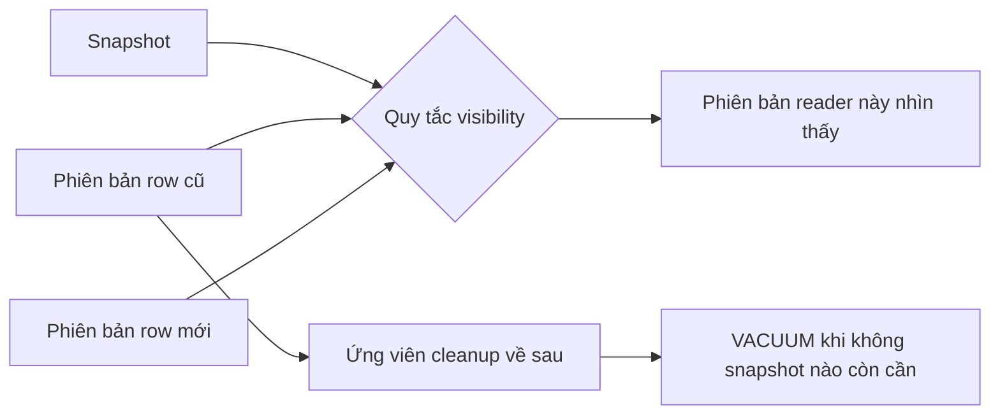
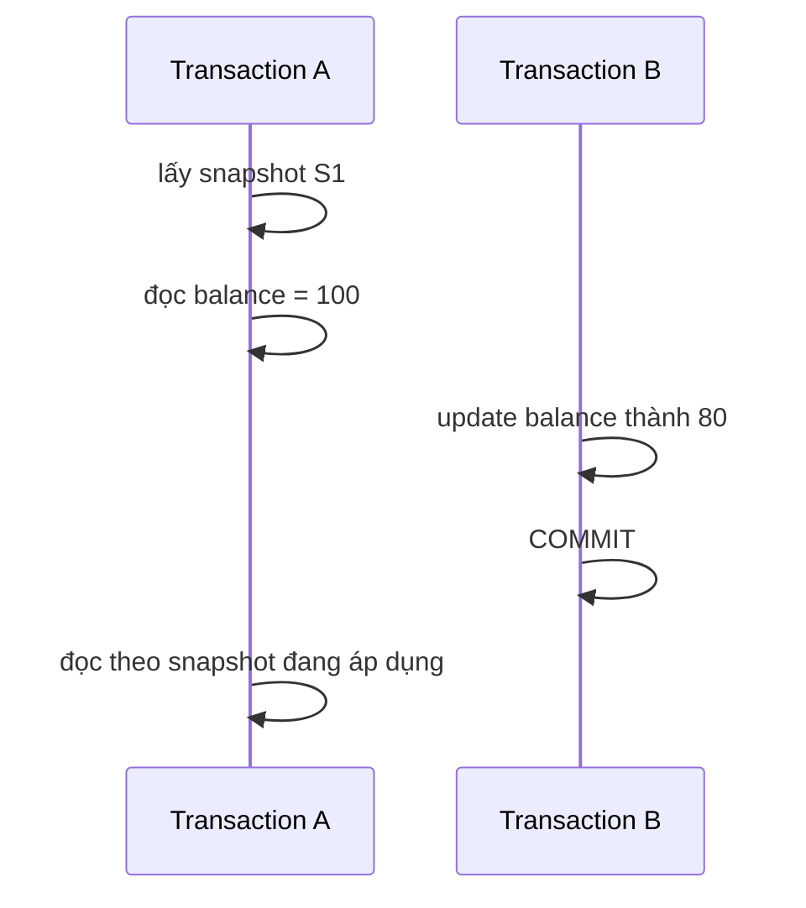
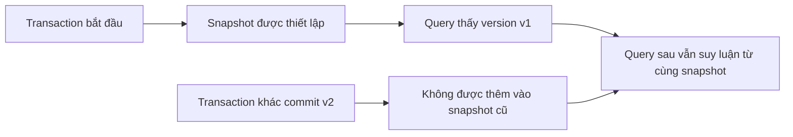

# MVCC: Suy luận về Snapshot và Phiên bản Row

## Tóm tắt

Multiversion concurrency control (MVCC) cho phép cơ sở dữ liệu giữ **nhiều phiên bản row** để reader có thể đánh giá một snapshot nhất quán trong khi các transaction đồng thời vẫn tiếp tục thay đổi dữ liệu.

Với PostgreSQL, hãy dùng mental model này:

```text
statement hoặc transaction lấy snapshot
  -> snapshot xác định transaction nào được xem là visible
  -> một logical row có thể có nhiều physical tuple version
  -> visibility rule chọn version mà snapshot hiện tại được phép thấy
  -> UPDATE / DELETE có thể để lại version cũ tạm thời
  -> VACUUM thu hồi version mà không snapshot hợp lệ nào còn cần
```

MVCC giảm việc read và write chặn lẫn nhau, nhưng **không** loại bỏ concurrency conflict, row lock, transaction isolation rule hay công việc cleanup. Sai lầm trọng tâm cần tránh là coi “row trong bảng” như một object mutable duy nhất với một giá trị hiện tại chung cho mọi reader.



<TermBox term="MVCC">
**Multiversion concurrency control** là cách kiểm soát concurrency trong đó database giữ nhiều phiên bản dữ liệu để transaction có thể đọc theo snapshot mà ordinary reader không phải chặn ordinary writer.

**Vì sao quan trọng:** concurrency trở thành bài toán visibility bên cạnh bài toán locking. Hai session có thể hợp lệ khi đọc hai committed version khác nhau của cùng một logical row vì snapshot của chúng đại diện cho hai thời điểm database khác nhau.
</TermBox>

## 1. Một logical row có thể có nhiều physical version

Giả sử một row account ban đầu là:

```text
account 42 -> balance = 100
```

Transaction B cập nhật balance thành `80`. Mental model hữu ích của MVCC không phải “database overwrite 100 bằng 80 và mọi reader lập tức thấy 80”. Thay vào đó, database có thể giữ version cũ đủ lâu cho reader có snapshot vẫn còn cần nó, đồng thời làm version mới visible cho snapshot về sau sau khi B commit.

Về mặt khái niệm:

```text
logical account 42
  version v1: balance = 100
  version v2: balance = 80
```

Hai version này là implementation record, không phải hai business account. Visibility rule quyết định version nào đại diện cho account 42 đối với một statement hoặc transaction cụ thể.

PostgreSQL triển khai MVCC bằng tuple version gắn với thông tin transaction visibility. Application code bình thường nên suy luận từ snapshot và isolation semantics thay vì đọc tuple header nội bộ.

## 2. Snapshot là ranh giới visibility, không phải bản copy toàn database

<TermBox term="Snapshot">
**Snapshot** lưu đủ thông tin về transaction visibility để PostgreSQL quyết định row version nào một statement hoặc transaction được phép quan sát.

Nó không phải bản copy vật lý của database. Nó là ranh giới visibility logic được áp dụng lên row version khi query chạy.
</TermBox>

Xét hai transaction:



A nhìn thấy `100` hay `80` ở lần đọc sau phụ thuộc vào isolation level và thời điểm PostgreSQL lấy snapshot cho statement đó.

Vì vậy, chỉ biết “B đã commit trước” vẫn chưa đủ để đoán A nhìn thấy gì. Cần biết thêm **A đang dùng snapshot nào**.

## 3. Visibility hỏi một version có thuộc database view hiện tại không

Một row version có thể đang tồn tại vật lý nhưng vẫn invisible với snapshot hiện tại.

Ở mức thực hành, suy luận về visibility đặt các câu hỏi như:

```text
transaction tạo version này đã commit trước ranh giới snapshot chưa?
version này đã bị delete hoặc thay thế bởi transaction visible với snapshot chưa?
transaction thay đổi version còn đang chạy khi snapshot được lấy không?
transaction hiện tại có visibility đặc biệt với chính thay đổi của nó không?
```

Đừng biến các câu hỏi này thành hand-written visibility logic trong application. PostgreSQL sở hữu thuật toán visibility. Giá trị ở tầng application là hiểu vì sao các session đồng thời có thể hợp lệ khi quan sát các version khác nhau.

### “Đã commit” không đồng nghĩa “mọi reader đang chạy đều thấy ngay”

Một version vừa commit có thể visible với statement sau dùng snapshot mới hơn nhưng vẫn invisible với transaction-level snapshot cũ.

Đây không phải stale-cache behavior. Đây là transaction isolation được triển khai bằng snapshot visibility.

## 4. Read Committed làm mới snapshot theo từng statement

Isolation level mặc định `Read Committed` của PostgreSQL cho mỗi statement một snapshot nhìn thấy row đã commit trước khi statement đó bắt đầu.

```text
BEGIN;
SELECT balance FROM accounts WHERE id = 42;  -- statement snapshot S1
-- transaction khác commit balance = 80
SELECT balance FROM accounts WHERE id = 42;  -- statement snapshot S2 mới hơn
COMMIT;
```

Vì vậy hai câu `SELECT` trong cùng một transaction có thể thấy hai committed value khác nhau.

MVCC cho phép điều đó mà không bắt reader đầu tiên giữ writer bị block chỉ để bảo toàn view của statement trước.

## 5. Repeatable Read giữ một transaction view ổn định

Ở `Repeatable Read` của PostgreSQL, các statement trong transaction nhìn theo snapshot được thiết lập tại statement đầu tiên không phải transaction-control. Commit về sau từ transaction khác không tự xuất hiện trong snapshot đó.



Lợi ích là database view ổn định để suy luận lặp lại. Đổi lại, concurrency conflict vẫn có thể khiến transaction abort thay vì cho mọi interleaving commit.

PostgreSQL ghi rõ application dùng `Repeatable Read` hoặc `Serializable` phải sẵn sàng retry transaction khi gặp serialization error.

## 6. MVCC giảm reader-writer blocking; không có nghĩa “không còn lock”

MVCC của PostgreSQL cho ordinary read tránh xung đột với ordinary write trong trường hợp phổ biến. Đây là lợi thế concurrency lớn.

Tuy nhiên statement vẫn lấy lock cho nhiều mục đích quan trọng:

- statement thay đổi row phải phối hợp với statement khác cũng thay đổi row;
- `SELECT ... FOR UPDATE` chủ động lock row được chọn;
- DDL có thể cần table lock xung đột với ordinary access;
- foreign-key enforcement và unique check có thể tạo wait quanh concurrent change;
- deadlock vẫn có thể xảy ra khi transaction lấy các lock xung đột theo thứ tự khác nhau.

Phân biệt hữu ích:

```text
snapshot visibility -> committed/in-progress version nào được phép đọc
locking             -> operation nào phải chờ khi tranh chấp protected resource
```

MVCC và locking phối hợp với nhau. Không nên giải thích hệ thống như thể chỉ một trong hai cơ chế tồn tại.

## 7. UPDATE tạo version mới hơn trong khi version cũ có thể vẫn hữu ích

Trong PostgreSQL, update một row tạo tuple version mới. Version trước không phải lúc nào cũng biến mất ngay vì snapshot cũ có thể vẫn được phép thấy nó.

Về mặt khái niệm:

```text
trước UPDATE
  v1 -> visible với snapshot cũ và hiện tại

sau khi UPDATE commit
  v1 -> vẫn cần cho một số snapshot cũ
  v2 -> visible với snapshot mới hơn

về sau
  v1 -> không active/relevant snapshot nào còn cần
  v1 -> VACUUM có thể thu hồi
```

Mental model này giải thích vì sao table có nhiều update có thể tích lũy dead row version và vì sao transaction lifetime ảnh hưởng đến cleanup storage.

## 8. DELETE cũng để lại lịch sử cho đến khi có thể thu hồi an toàn

Một `DELETE` đã commit làm row trở thành absent đối với snapshot nhìn thấy delete đó. PostgreSQL không bắt buộc phải xóa byte của tuple cũ ngay lập tức.

Snapshot cũ vẫn có thể cần prior row version. Khi version đó không còn khả năng visible, PostgreSQL có thể thu hồi space để tái sử dụng.

Hệ quả vận hành quan trọng: logical deletion và physical space reclamation là hai thời điểm khác nhau.

## 9. VACUUM là một phần của vòng đời MVCC

<TermBox term="VACUUM">
Trong PostgreSQL, **VACUUM** thực hiện maintenance gồm thu hồi hoặc làm reusable space từ obsolete row version, duy trì planner statistics/visibility information và bảo vệ khỏi transaction ID wraparound.

**Vì sao quan trọng:** giữ old version là điều cho phép snapshot read hoạt động, nhưng version mà không valid snapshot nào còn cần phải được cleanup để lịch sử không tăng vô hạn.
</TermBox>

Tài liệu routine vacuuming của PostgreSQL liệt kê nhiều lý do phải vacuum đều đặn, gồm thu hồi space của updated/deleted row version, duy trì planner statistics và visibility map, cùng bảo vệ khỏi transaction ID wraparound.

Standard `VACUUM` thường đánh dấu space để tái sử dụng bên trong relation. Nó không mặc định shrink table file trả về operating system. `VACUUM FULL` là một operation rewrite nặng hơn, cần exclusive table lock và không nên bị hiểu như routine MVCC cleanup.

### Visibility map là trợ giúp tối ưu, không phải snapshot

PostgreSQL duy trì visibility map có thể đánh dấu page nơi tuple được biết là visible với mọi transaction. Thông tin đó cho phép một số index-only scan tránh fetch heap tuple chỉ để re-check visibility.

Đừng nhầm map này với transaction snapshot. Snapshot mô tả view của transaction; visibility map tóm tắt page-level fact phục vụ maintenance và query execution.

## 10. Transaction chạy lâu có thể giữ old version sống lâu

Nếu một transaction giữ snapshot cũ mở, PostgreSQL phải thận trọng khi xóa row version mà snapshot đó vẫn có thể cần.

Chuỗi tác động vận hành:

```text
snapshot cũ vẫn active
  -> tuple version cũ có thể vẫn potentially visible
  -> cleanup horizon không thể đi qua phần active work còn cần
  -> dead version tích lũy dưới write traffic
  -> table/index có thể bloat và vacuum khó làm việc hơn
```

Transaction không cần query liên tục từng giây mới gây ảnh hưởng. Application bắt đầu transaction rồi chờ user input, remote I/O, job queue hoặc connection-pool code bị quên có thể giữ snapshot lâu hơn dự kiến rất nhiều.

Các câu hỏi review thực tế:

- Transaction này có thể mở bao lâu?
- Application có gọi network trong lúc giữ transaction không?
- Session `idle in transaction` có được monitor không?
- Batch reader có thể dùng transaction boundary nhỏ hơn không?
- Vacuum lag, dead tuple và relation growth có observable không?

## 11. Transaction ID là hữu hạn nên old history không thể mãi chưa được freeze

PostgreSQL dùng transaction identifier như một phần của MVCC visibility. Transaction ID truyền thống có kích thước hữu hạn và có wraparound.

Vì vậy PostgreSQL cần vacuuming và **freezing** để đánh dấu row version đủ cũ sao cho chúng vẫn được diễn giải an toàn là old/visible khi transaction ID tiếp tục tăng.

Bài học vận hành không phải nhớ wraparound arithmetic. Bài học là:

```text
MVCC metadata già đi
  -> vacuum cuối cùng phải đi qua old data
  -> freezing ngăn ancient committed row trở nên mơ hồ
  -> tắt hoặc làm autovacuum đói tài nguyên có thể thành rủi ro correctness/availability, không chỉ là vấn đề disk space
```

Tài liệu PostgreSQL mô tả transaction ID wraparound protection là một trong các lý do mọi table phải được vacuum theo thời gian.

## 12. MVCC không làm mọi read-modify-write workflow tự động an toàn

Snapshot có thể cho mỗi transaction một coherent view trong khi hai transaction vẫn đưa ra business decision xung đột.

Ví dụ:

```text
Snapshot Transaction A: doctor A đang on call, doctor B đang on call
Snapshot Transaction B: doctor A đang on call, doctor B đang on call
A đánh dấu doctor A off call
B đánh dấu doctor B off call
```

Nếu invariant yêu cầu luôn còn ít nhất một doctor on call, mỗi snapshot riêng lẻ có thể trông hợp lệ nhưng commit kết hợp vẫn vi phạm rule dưới isolation/locking strategy chưa đủ mạnh.

Vấn đề này thuộc transaction-isolation reasoning, không phải “bật MVCC”. PostgreSQL đã dùng MVCC; bạn vẫn phải chọn transaction boundary và conflict handling bảo vệ invariant.

## 13. Tình huống production: reporting transaction bỏ idle làm table phình ra

Một reporting endpoint bắt đầu transaction, chạy query đầu tiên, rồi chuẩn bị stream kết quả qua nhiều remote enrichment call trước khi commit. Một bug timeout đôi lúc để session ở trạng thái `idle in transaction` hàng giờ. Trong lúc đó, table `events` có write traffic cao liên tục update và delete.

**Hậu quả:** dead tuple tích lũy, kích thước table và index tăng, vacuum không thu hồi được nhiều space như kỳ vọng, query latency xấu dần vì nhiều page phải được chạm hơn và maintenance pressure tăng dù report gần như chỉ đọc.

**Nguyên nhân cốt lõi:** team coi read-only transaction là vô hại. Snapshot cũ của nó giữ visibility horizon mở trong khi write-heavy table tiếp tục tạo obsolete row version. Transaction boundary còn bao gồm remote wait không cần snapshot consistency của database.

**Cách khắc phục chuẩn:** giữ reporting transaction boundary ngắn đúng bằng consistency window thực sự cần, không giữ database transaction mở qua unrelated remote I/O, monitor long-running và `idle in transaction` session, đặt transaction/session timeout phù hợp, và quan sát dead tuple cùng vacuum progress thay vì chỉ phản ứng khi disk growth đã rõ ràng.

## 14. Chẩn đoán vấn đề MVCC bằng ba câu hỏi tách biệt

Khi behavior production có vẻ bất thường, hãy tách ba câu hỏi:

### Transaction được nhìn thấy gì?

Kiểm tra isolation level, thời điểm lấy statement/transaction snapshot và writer kỳ vọng đã commit trước snapshot boundary liên quan chưa.

### Operation nào đang phải chờ?

Kiểm tra row/table lock, blocked session, deadlock và statement cố ý locking như `SELECT ... FOR UPDATE`.

### Dữ liệu cũ nào chưa thể cleanup?

Kiểm tra long-running transaction, replication/maintenance horizon khi có liên quan, dead tuple accumulation, vacuum progress và transaction age.

Gộp cả ba thành “database bị lock” hoặc “MVCC stale” sẽ che mất mechanism thật.

## Tự kiểm tra: vì sao hai committed value đều có thể là quan sát đúng?

Transaction A chạy `Repeatable Read` và thiết lập snapshot khi `accounts.balance = 100`. Transaction B sau đó update balance thành `80` rồi commit. A query row lần nữa trước khi kết thúc. Transaction C mới bắt đầu sau khi B commit.

Hãy đoán A và C có thể thấy gì trước khi mở phần giải thích.

<details>
<summary>Xem giải thích chi tiết</summary>

Transaction A tiếp tục suy luận từ `Repeatable Read` snapshot đã thiết lập, nên commit về sau của B không tự trở nên visible bên trong A chỉ vì B commit thành công. A có thể tiếp tục thấy row version biểu diễn balance `100`.

Transaction C bắt đầu sau khi B commit và có thể lấy snapshot trong đó version mới đã visible, nên C có thể thấy balance `80`.

Database không tuyên bố account có hai business balance đồng thời. MVCC giữ nhiều physical version để các valid snapshot khác nhau có thể map cùng logical row tới visible version khác nhau.
</details>

## Checklist production

- [ ] **Phạm vi snapshot:** biết isolation level lấy snapshot mới theo statement hay giữ một transaction view.
- [ ] **Mô hình version:** suy luận logical row tách biệt khỏi physical tuple version có thể tạm thời đại diện cho nó.
- [ ] **Visibility:** giải thích unexpected read bằng snapshot timing trước khi đổ lỗi cho cache hoặc replication.
- [ ] **Lock:** kiểm tra blocking tách khỏi snapshot visibility; MVCC không loại bỏ writer conflict hay explicit lock.
- [ ] **Tuổi thọ transaction:** giữ transaction không dài hơn consistency/invariant thực sự yêu cầu.
- [ ] **Remote work:** tránh giữ transaction mở qua unrelated network call, user think time hoặc queue wait.
- [ ] **Vacuum health:** monitor dead tuple, vacuum/autovacuum activity, relation growth và maintenance lag trên write-heavy table.
- [ ] **Idle session:** phát hiện và giới hạn session `idle in transaction`.
- [ ] **Isolation failure:** xem serialization failure là retryable transaction outcome dự kiến khi dùng isolation level cao hơn.
- [ ] **Wraparound protection:** không tắt hoặc làm vacuum cần cho transaction ID aging/freezing bị đói tài nguyên vô thời hạn.
- [ ] **Ranh giới DDL:** nhớ rằng một số heavy table-rewrite operation có locking/MVCC caveat ngoài ordinary DML behavior.
- [ ] **Bằng chứng:** chẩn đoán visibility, blocking và cleanup horizon như các mechanism riêng trước khi đổi database setting.

## Quy tắc cho agent

Khi chẩn đoán PostgreSQL concurrency, đừng dừng ở câu “MVCC nghĩa là read không block”. Hãy xác định snapshot scope, row version nào có thể visible với snapshot đó, lock nào phối hợp các operation xung đột và cleanup horizon nào quyết định lúc obsolete version có thể được thu hồi. Giữ application transaction đủ ngắn để snapshot consistency không vô tình biến thành vấn đề storage maintenance.

## Nguồn tham khảo

- [PostgreSQL 18 — Concurrency Control: Introduction](https://www.postgresql.org/docs/18/mvcc-intro.html)
- [PostgreSQL 18 — Transaction Isolation](https://www.postgresql.org/docs/18/transaction-iso.html)
- [PostgreSQL 18 — SET TRANSACTION](https://www.postgresql.org/docs/18/sql-set-transaction.html)
- [PostgreSQL 18 — Explicit Locking](https://www.postgresql.org/docs/18/explicit-locking.html)
- [PostgreSQL 18 — Serialization Failure Handling](https://www.postgresql.org/docs/18/mvcc-serialization-failure-handling.html)
- [PostgreSQL 18 — Routine Vacuuming](https://www.postgresql.org/docs/18/routine-vacuuming.html)
- [PostgreSQL 18 — System Information Functions and Operators](https://www.postgresql.org/docs/18/functions-info.html)
- [PostgreSQL 18 — Concurrency Control Caveats](https://www.postgresql.org/docs/18/mvcc-caveats.html)
