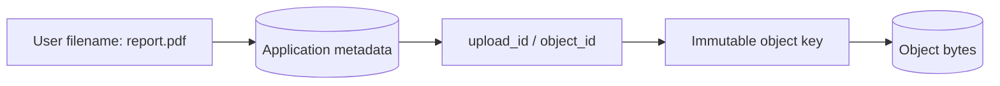
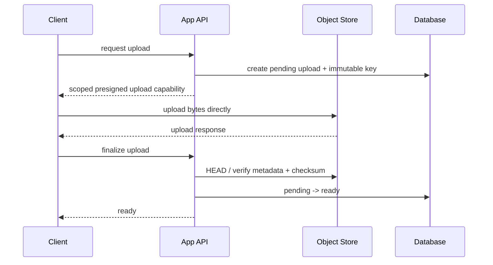
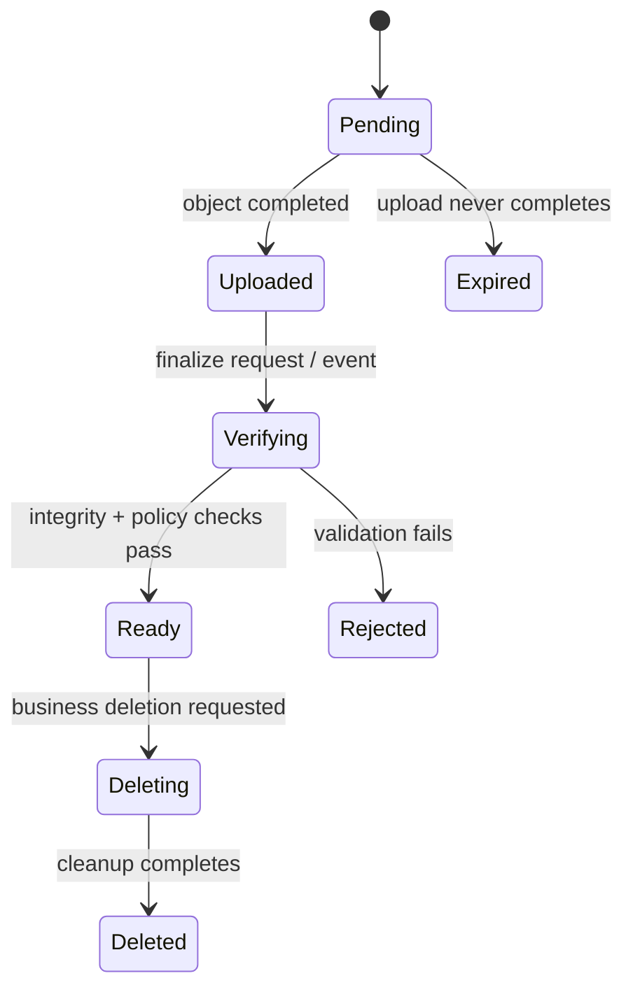

# Object Storage: Reason About Identity, Integrity, and Lifecycle

## TL;DR

Object storage is built around a simple abstraction:

```text
bucket + object key -> bytes + metadata
```

That simplicity is powerful, but production systems still need explicit contracts for **identity, authorization, upload completion, integrity, lifecycle, and metadata ownership**.

A useful mental model is:


The object store can durably hold bytes while your application is still wrong about whether those bytes are complete, owned by the right tenant, safe to expose, or ready for processing.

## 1. Object storage is not a filesystem with a bigger disk

Object storage organizes data as independent objects. Each object has an identifier, bytes, and metadata. APIs typically expose operations such as put, get, head, list, copy, and delete.

This differs from a POSIX-style filesystem where applications manipulate directories, file descriptors, offsets, permissions, and mutable byte ranges.

A practical distinction:

```text
filesystem
  directory hierarchy
  path lookup
  mutable files / byte ranges
  local or mounted filesystem semantics

object storage
  bucket namespace
  object key lookup
  whole-object API semantics
  metadata + policy around each object
  service boundary reached over an API
```

Do not design against object storage by assuming filesystem behavior that the object API never promised.

## 2. Bucket and object key form the storage identity

<TermBox term="Object key">
An **object key** is the name used to identify an object inside a bucket.

In Amazon S3, the key uniquely identifies an object within its bucket. Keys can contain delimiters such as `/`, but S3's core data model is flat; console “folders” are inferred from key prefixes.

**Why it matters:** key design becomes part of application identity, routing, authorization, lifecycle selection, and operational debugging.
</TermBox>

A key such as:

```text
tenants/t42/invoices/2026/09/inv_81a7.pdf
```

looks hierarchical, but the slash-separated pieces are still characters in one key. Prefixes are useful conventions, not independent directories with filesystem semantics.

Useful key design questions:

- Does the key expose private information that should not appear in logs or URLs?
- Is the key stable if a user renames a file?
- Can two concurrent uploads accidentally choose the same key?
- Does the key encode tenant ownership clearly enough for policy and operations?
- Can lifecycle or inventory jobs select the intended object family by prefix or tags?

## 3. Prefer immutable storage identity over mutable human names

Human-facing filenames are poor primary identifiers.

Consider:

```text
uploads/report.pdf
```

Two users, retries, or concurrent replacements can collide on the same key. If the application overwrites the key in place, caches, asynchronous processors, and audit trails can disagree about which bytes “report.pdf” meant at a particular time.

A safer design is:

```text
object key: tenants/t42/uploads/01J.../original.pdf
logical name: report.pdf
```

The database stores the logical filename and points to an immutable storage key.



This separates **business identity** from **storage identity**. A rename can change metadata without moving bytes, while replacement can create a new object identity rather than silently mutating an old one.

## 4. Object storage should not automatically become your application source of truth

For many systems, the object store is authoritative for the bytes but the application database is authoritative for business metadata.

Example:

```text
object store owns:
  bytes
  storage-level checksum
  object version / storage metadata

application database owns:
  tenant_id
  logical filename
  media type accepted by the product
  processing state
  visibility / authorization state
  upload ownership
  retention policy chosen by the business
```

That distinction makes reconciliation possible.

If an object exists but no database row references it, it may be an orphan. If a row claims `ready` but the object is missing, the application metadata is inconsistent. Those are different failures and need different repair paths.

## 5. Modern S3 consistency is stronger than old folklore

Amazon S3 provides strong read-after-write consistency for object `PUT` and `DELETE` operations, including overwrites, and for subsequent `GET` and `LIST` requests after a successful write response.

Updates to a single key are atomic: concurrent readers observe the old object or the new object, not a partially mixed object.

Therefore, do **not** explain a missing S3 object after a successful `PUT` by repeating the old “S3 is eventually consistent” rule.

But strong object-store consistency does not make your multi-system workflow atomic.

This can still fail:

```text
1. PostgreSQL row -> status = ready
2. upload to S3 -> network error before completion
3. worker reads row
4. worker cannot retrieve complete object
```

The problem is cross-system coordination, not S3 read-after-write consistency.

## 6. Direct upload removes your application server from the byte path

Large uploads do not always need to flow through an application server.

A common pattern is:



Benefits include reducing application-server bandwidth and avoiding proxying very large bodies through workers that exist mainly for business logic.

The important word is **scoped**. A direct-upload credential or presigned URL is a capability. Its key, operation, expiration, content expectations, and tenant association should be deliberately constrained.

## 7. A presigned URL is delegated authority, not proof of business ownership

<TermBox term="Presigned URL">
A **presigned URL** grants time-limited ability to perform a specific object-store request using the permissions of the signer, without giving the caller the signer's long-lived cloud credentials.

In S3, the URL is bound to details such as bucket, key, HTTP method, and expiration.

**Why it matters:** anyone who obtains a usable presigned URL can exercise that delegated capability until it expires or another policy blocks it. The application must allocate and authorize the key before signing it.
</TermBox>

Do not accept this sequence:

```text
client supplies arbitrary bucket/key
server signs it
```

Prefer:

```text
server verifies tenant + intent
server allocates key under owned namespace
server records pending upload
server signs only the required operation
```

The object key should be derived from trusted application state, not blindly accepted from the client.

## 8. Same-key upload can be an overwrite

In S3, uploading to an existing key replaces the current object when versioning does not provide a new visible identity to the application.

That matters for retries and presigned uploads. A URL that remains valid may be usable more than once before expiry, and the same key can be overwritten.

If “create exactly one immutable asset” is the business intent, use a unique allocated key and, when supported by the workflow, conditional write semantics that reject an existing key instead of relying on “we probably only upload once.”

Immutability makes retries, CDN behavior, background processing, and auditing easier to reason about.

## 9. Multipart upload is a construction protocol, not a partially visible object

Large objects can be uploaded as independent parts.

Multipart upload separates the workflow into:

```text
create multipart upload
  -> upload part 1
  -> upload part 2
  -> ...
  -> complete multipart upload
  -> final object exists
```

Parts can be retried independently, which is valuable for large transfers or unreliable networks.

But the application should distinguish:

```text
parts uploaded != object finalized
```

Do not mark business metadata `ready` just because every client-side part request returned success. The completion operation is the boundary that asks the object store to assemble the final object.

Incomplete multipart uploads also need cleanup. A lifecycle policy can abort abandoned multipart uploads so failed clients do not leave indefinite storage residue.

## 10. Integrity needs a checksum contract

<TermBox term="Checksum">
A **checksum** is a compact value derived from bytes so a system can detect corruption or transfer mismatch by recomputing and comparing the value.

Object stores can validate checksums during upload and retain checksum metadata for later verification.

**Why it matters:** “HTTP request succeeded” and “the application received exactly the intended bytes” are related but distinct claims. Integrity evidence makes the latter explicit.
</TermBox>

For direct or multipart uploads, decide:

- Which checksum algorithm is accepted?
- Who calculates it: client, trusted backend, object store, or more than one participant?
- Is the checksum stored in application metadata for later reconciliation?
- Does the processing pipeline verify the expected checksum before expensive work?

This becomes especially useful when objects cross systems, Regions, or long-lived archives.

## 11. Do not assume ETag means MD5

An S3 `ETag` is useful object metadata, but it is **not a universal content-MD5 contract**.

For example, multipart-uploaded objects do not use a plain MD5 digest of the complete object as their ETag. Some encryption paths also produce ETags that are not an MD5 digest of object data.

Therefore this is unsafe as a universal integrity rule:

```text
if local_md5 == ETag:
  upload is valid
```

Use the object's explicit checksum facilities when your application needs a checksum guarantee.

## 12. Versioning changes overwrite and delete semantics

S3 Versioning allows multiple versions of the same object key to coexist with distinct version IDs.

With versioning enabled:

```text
PUT same key -> new version
previous version -> remains noncurrent
DELETE without version ID -> normally creates a delete marker
```

This can make accidental overwrite or deletion recoverable, but it also means storage lifecycle and deletion logic must account for noncurrent versions.

Versioning is not a substitute for application history. Your product may still need to record which object version was attached to which invoice, user submission, model artifact, or audit event.

If exact replay matters, persist the storage version identifier with the business record instead of only storing a mutable key.

## 13. Lifecycle policy is part of storage design

Object storage is attractive partly because data can outlive the process that created it. Without lifecycle ownership, that strength becomes unbounded cost and forgotten data.

A lifecycle rule can express policies such as:

```text
new object
  -> frequent-access storage class
  -> transition after N days
  -> archive after M days
  -> expire when retention allows
```

Lifecycle decisions should come from business data classes, not one global “move everything to archive after 30 days” rule.

Consider separately:

- active product assets;
- reconstructable derived artifacts;
- customer exports;
- compliance records;
- failed/incomplete uploads;
- noncurrent versions;
- temporary processing outputs.

The cost model is not only storage price per GB. Retrieval latency, retrieval charges, minimum storage duration, requests, replication, and operational recovery expectations can matter too.

## 14. Deletion is a workflow, not just one DELETE request

A business “delete file” operation may need to coordinate:

```text
authorization
  -> hide from product reads
  -> delete or tombstone application metadata
  -> delete current object / version
  -> delete derivatives / thumbnails
  -> purge caches if required
  -> retain audit evidence
  -> honor legal or retention constraints
```

With versioning or Object Lock, “deleted from normal reads” may not mean “all bytes permanently erased.”

Your API should distinguish product visibility, recoverability, retention, and permanent deletion rather than collapsing them into one vague `deleted = true` flag.

## 15. Object Lock and retention solve a different problem from backup

S3 Object Lock can protect object versions with write-once-read-many retention semantics. It requires versioning and can prevent protected versions from being overwritten or permanently deleted during the retention window.

That is useful for compliance or tamper-resistance requirements, but it is not the same thing as a complete backup strategy.

A backup design still asks:

- Can we recover after a bad application migration?
- Is the recovery copy isolated enough from the same credentials and automation?
- Can we restore metadata and object references together?
- Have we tested restore time and restore correctness?

Retention, replication, versioning, and backup address overlapping but different failure modes.

## 16. Metadata is usually small enough to keep transactional

Do not put every business attribute into opaque object metadata simply because the object store supports metadata fields.

Transactional databases are usually better at relationships, constraints, state transitions, search predicates, and multi-row invariants.

A common split is:

```text
PostgreSQL row
  id
  tenant_id
  object_key
  object_version
  checksum
  logical_name
  declared_media_type
  verified_media_type
  size_bytes
  status
  created_at

Object store
  immutable bytes
  storage metadata
```

This keeps authoritative workflow state queryable and lets object storage specialize in durable byte storage.

## 17. Content type and filename are untrusted input

A client-provided filename or `Content-Type` header is not proof that the uploaded bytes are safe or actually match the declaration.

For user uploads, production systems commonly separate:

```text
upload accepted
  -> object quarantined / not public
  -> inspect size and magic bytes / media format
  -> malware or policy scanning when required
  -> generate safe derivatives
  -> mark ready for intended use
```

Do not publish an upload merely because the object store accepted it.

The exact security pipeline depends on the product, but the storage lesson is durable: **storage acceptance is not application validation**.

## 18. Background processing needs immutable input identity

Object storage pairs naturally with asynchronous processing:

```text
upload completed
  -> enqueue object_id + immutable key/version
  -> worker downloads exact input
  -> process
  -> write derivative under new immutable key
  -> transactionally update metadata
```

Avoid queue messages that say only:

```text
process latest file at uploads/user-7/avatar.jpg
```

If the key is overwritten before the worker runs, the worker may process different bytes from the event that triggered it.

Prefer an immutable key or explicit object version so the job refers to one stable input.

## 19. Cross-system workflows need reconciliation

Your database and object store do not share one ordinary ACID transaction.

That creates states such as:

```text
object exists, DB row missing
DB row exists, object missing
DB says pending, object completed
DB says ready, checksum mismatch
object deleted, derivative still exists
```

Design a reconciliation job that can classify and repair or quarantine these states.

A durable workflow often uses state transitions:



State machines make partial failure visible instead of pretending a distributed workflow is atomic.

## 20. Production scenario: database says ready before upload is truly finalized

A media API creates row `asset_42` and returns a presigned multipart-upload workflow. The client uploads all parts. Before `CompleteMultipartUpload` and checksum verification finish, the client calls `POST /assets/asset_42/publish`.

The API trusts the client's claim and marks the row `ready`. A background transcoder reads the row immediately. Meanwhile a retry reuses the same human-derived key `users/u9/video.mp4`, overwriting what another workflow expects.

**Impact:** workers intermittently see a missing or unexpected object; users can receive the wrong bytes under a stable URL; abandoned multipart parts accumulate; support sees database records that say `ready` even though storage state never reached the intended final object.

**Root cause:** the system confused client-side upload progress with object-store completion, used a mutable shared key as identity, and had no checksum-backed finalize transition between storage state and business state.

**Correct pattern:** allocate a unique immutable key before signing, keep the database row `pending`, upload directly with a tightly scoped capability, complete multipart upload, verify the finalized object and expected checksum/size, then transition metadata to `ready`. Queue workers by immutable object identity, clean abandoned multipart uploads with lifecycle rules, and reconcile orphan/missing states explicitly.

## Self-check: does strong S3 consistency remove the need for an upload state machine?

Suppose S3 strongly exposes a successful completed `PUT` to subsequent reads. Can the application safely replace its `pending -> ready` state machine with “if the key exists, the upload is ready”?

<details>
<summary>Show the reasoning</summary>

No.

Strong read-after-write consistency answers a storage visibility question: after a successful write, what do later object-store reads observe?

Your application still has separate questions:

- Was this key allocated to the authenticated tenant?
- Did multipart completion finish?
- Does the final size/checksum match the expected upload?
- Did content validation or security scanning pass?
- Did the database record the exact object identity/version?
- Is the object approved for public or downstream processing?

Those facts span application policy and multiple systems. A state machine is how the application represents those facts and partial failures explicitly.
</details>

## Production checklist

- [ ] **Identity:** allocate immutable object IDs/keys instead of using human filenames as storage identity.
- [ ] **Namespace:** make tenant or ownership boundaries explicit without leaking unnecessary private data in keys.
- [ ] **Source of truth:** state which system owns bytes and which owns business metadata/workflow state.
- [ ] **Consistency:** do not rely on obsolete eventual-consistency assumptions for modern S3 `PUT`/`DELETE`/`GET`/`LIST` behavior.
- [ ] **Authorization:** scope presigned capabilities to the intended bucket, key, operation, and lifetime.
- [ ] **Finalize:** separate upload progress from completed object state.
- [ ] **Multipart cleanup:** abort abandoned multipart uploads through lifecycle policy or explicit cleanup.
- [ ] **Integrity:** verify checksum/size when correctness depends on exact bytes.
- [ ] **ETag:** do not universally treat ETag as content MD5.
- [ ] **Validation:** treat filename, declared media type, and uploaded bytes as untrusted until product checks pass.
- [ ] **Versioning:** decide whether overwrite/delete recovery needs object versioning and persist version IDs when exact replay matters.
- [ ] **Lifecycle:** classify active, temporary, archive, failed-upload, and noncurrent-version retention separately.
- [ ] **Deletion:** distinguish product hiding, recoverability, retention, and permanent deletion.
- [ ] **Workers:** send immutable key/version identity to asynchronous processors.
- [ ] **Reconciliation:** detect orphan objects, missing objects, stale metadata, and failed derivatives.
- [ ] **Observability:** measure upload failures, finalize latency, multipart abandonment, checksum failures, storage growth, lifecycle transitions, and processing lag.

## Agent rule

When proposing object storage, do not stop at “put files in S3.” Specify object identity, who owns business metadata, how upload authority is delegated, what proves completion and integrity, whether keys are mutable, how asynchronous workers identify exact bytes, what versioning/lifecycle/deletion mean, and how database/object-store divergence is reconciled.

## Sources

- [Amazon S3 User Guide — What is Amazon S3? / data consistency model](https://docs.aws.amazon.com/AmazonS3/latest/userguide/Welcome.html)
- [Amazon S3 User Guide — Naming Amazon S3 objects](https://docs.aws.amazon.com/AmazonS3/latest/userguide/object-keys.html)
- [Amazon S3 User Guide — Presigned URLs](https://docs.aws.amazon.com/AmazonS3/latest/userguide/using-presigned-url.html)
- [Amazon S3 User Guide — Multipart upload overview](https://docs.aws.amazon.com/AmazonS3/latest/userguide/mpuoverview.html)
- [Amazon S3 User Guide — Checking object integrity](https://docs.aws.amazon.com/AmazonS3/latest/userguide/checking-object-integrity-upload.html)
- [Amazon S3 API — Object / ETag semantics](https://docs.aws.amazon.com/AmazonS3/latest/API/API_Object.html)
- [Amazon S3 User Guide — How S3 Versioning works](https://docs.aws.amazon.com/AmazonS3/latest/userguide/versioning-workflows.html)
- [Amazon S3 User Guide — Managing object lifecycle](https://docs.aws.amazon.com/AmazonS3/latest/userguide/object-lifecycle-mgmt.html)
- [Amazon S3 User Guide — Object Lock](https://docs.aws.amazon.com/AmazonS3/latest/userguide/object-lock.html)

This lesson is classified as **evolving** with a 180-day review target because provider APIs, checksum support, storage classes, security defaults, and lifecycle features evolve while the core object-identity and cross-system workflow model remains durable.
