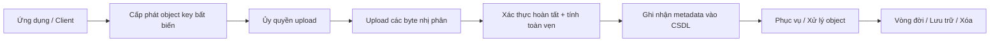
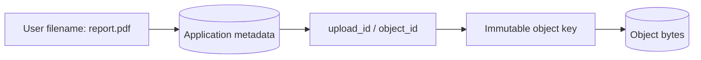
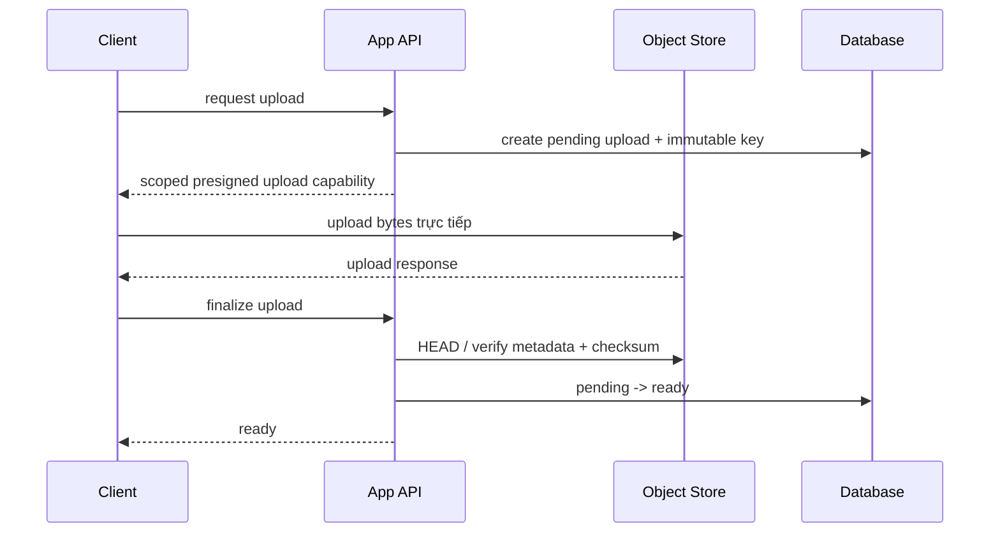
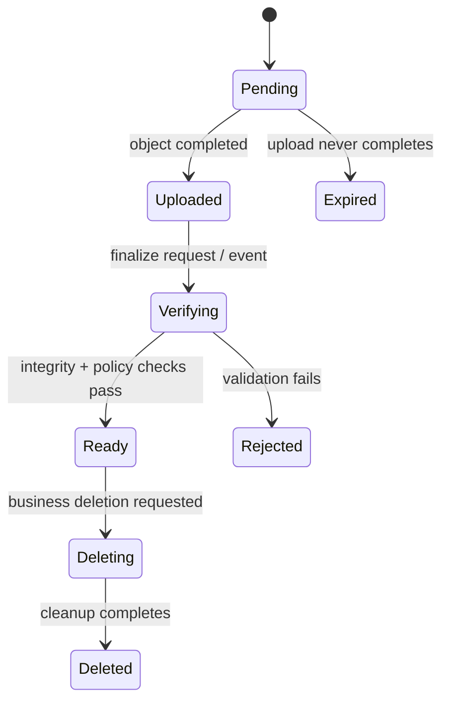

# Object Storage: Suy luận về định danh, toàn vẹn và vòng đời đối tượng

## Tóm tắt

Vào kỳ thanh toán cuối tháng, ban giám đốc kỹ thuật bàng hoàng khi hóa đơn đám mây AWS S3 tăng vọt hàng ngàn đô la một cách bất thường, dù dung lượng tệp thực tế của ứng dụng gần như không tăng. Thủ phạm là gì? Hàng triệu lượt người dùng upload video trên điện thoại bị rớt mạng giữa chừng; mỗi phiên **multipart upload** dở dang đã bỏ lại hàng loạt chunk rác vô chủ âm thầm tích tụ trong bucket suốt nhiều tháng trời mà không hề có bất kỳ quy tắc vòng đời (**lifecycle policy**) nào tự động dọn dẹp. Chưa dừng lại ở đó, máy chủ ứng dụng liên tục quá tải và sập nguồn vì một quyết định kiến trúc sai lầm: đội ngũ phát triển nhầm lẫn nghiêm trọng giữa dữ liệu tệp thô (**object payload** trong S3) và metadata nghiệp vụ, lưu toàn bộ trạng thái thanh toán, quyền xem và thẻ phân loại vào metadata của S3 thay vì lưu trong PostgreSQL, khiến mỗi request đơn giản đều phải gọi hàng loạt API `HeadObject` đắt đỏ và nghẽn mạng.

> 💡 **Quy tắc bỏ túi:** Lưu trữ payload tệp thô bất biến trong object storage, và lưu toàn bộ metadata nghiệp vụ có tính giao dịch trong cơ sở dữ liệu quan hệ (như PostgreSQL). Luôn gán khóa object bất biến, kiểm tra tính toàn vẹn bằng checksum chuyên dụng, và bắt buộc cấu hình lifecycle rule để tự động hủy các phiên multipart upload dở dang.

- **Không gian khóa phẳng với định danh bất biến:** Object storage tổ chức dữ liệu thành các đối tượng độc lập trong **bucket**, định danh bằng **khóa object (object key)**; cấu trúc lưu trữ hoàn toàn **phẳng** (thư mục chỉ là quy ước trực quan dựa trên tiền tố **prefix**), và các key nên được thiết kế **bất biến (immutable)** thay vì dùng tên tệp người dùng dễ thay đổi.
- **Phân định ranh giới giữa payload và metadata:** Object store là **nguồn sự thật (source of truth)** cho các byte nhị phân của tệp, trong khi cơ sở dữ liệu quan hệ (như PostgreSQL) nắm giữ trạng thái nghiệp vụ, quyền truy cập và liên kết dữ liệu giao dịch.
- **Tải lên trực tiếp và multipart upload:** Sử dụng **presigned** URL để client tải trực tiếp lên cloud mà không làm nghẽn băng thông của application server; với tệp lớn, giao thức **multipart upload** cho phép truyền từng phần độc lập nhưng chỉ hoàn tất khi có bước xác nhận lắp ghép cuối cùng.
- **Tính toàn vẹn vượt trên ETag:** S3 hiện đại cam kết **nhất quán mạnh (strong read-after-write consistency)**, nhưng việc đảm bảo dữ liệu không bị hỏng hóc đòi hỏi hợp đồng kiểm tra mã **checksum** tường minh, bởi vì **ETag** không phải lúc nào cũng là mã băm MD5 của toàn bộ nội dung.
- **Quản trị vòng đời và phiên bản hóa:** Kích hoạt **phiên bản hóa (versioning)** để bảo vệ dữ liệu trước rủi ro xóa nhầm, đồng thời cấu hình **vòng đời (lifecycle)** tự động chuyển đổi qua các **lớp lưu trữ (storage class)** rẻ hơn và tự động hủy các phần multipart dang dở.
- **Cạm bẫy chết người (Chi phí chunk rác multipart & nhầm lẫn vai trò metadata):** Các phiên multipart upload bị hủy giữa chừng sẽ âm thầm biến thành rác tính phí đắt đỏ nếu thiếu quy tắc lifecycle dọn dẹp, trong khi việc lạm dụng S3 làm database lưu trữ metadata động sẽ biến các câu truy vấn thông thường thành những lời gọi HTTP chậm chạp và tốn kém.

```text
bucket + object key -> bytes + metadata
```

Sự đơn giản đó rất mạnh mẽ, nhưng các hệ thống production thực tế vẫn đòi hỏi cam kết rõ ràng cho **định danh, phân quyền, hoàn tất tải lên, tính toàn vẹn, vòng đời và quyền sở hữu metadata**.

Mental model hữu ích:



Object store có thể lưu trữ byte dữ liệu bền vững, nhưng hệ thống vẫn có thể sai lầm nếu ứng dụng không nắm chắc liệu dữ liệu đó đã hoàn tất chưa, thuộc về đúng tenant chưa, có an toàn để chia sẻ công khai không, hoặc đã sẵn sàng cho processing chưa.

## 1. Object storage không phải filesystem có ổ đĩa lớn hơn

Object storage tổ chức dữ liệu thành các object độc lập. Mỗi object có identifier, bytes và metadata. API thường expose operation như put, get, head, list, copy và delete.

Điều này khác POSIX-style filesystem, nơi application thao tác directory, file descriptor, offset, permission và mutable byte range.

Phân biệt thực tế:

```text
hệ thống tệp (filesystem)
  phân cấp theo thư mục
  tra cứu theo đường dẫn (path)
  các tệp và dải byte có thể ghi đè/sửa đổi (mutable)
  ngữ nghĩa gắn liền với ổ đĩa cục bộ hoặc ổ đĩa mạng

object storage
  không gian tên theo bucket
  tra cứu theo khóa object (object key)
  thao tác trên toàn bộ object (toàn bộ payload)
  siêu dữ liệu và chính sách gắn liền với từng object
  ranh giới dịch vụ phân tán truy cập qua API
```

Đừng bao giờ thiết kế hệ thống tương tác với object storage bằng việc áp đặt những giả định về filesystem mà API của object storage không hề cam kết.

## 2. Bucket và object key tạo nên storage identity

<TermBox term="Object key">
**Object key (khóa object)** là chuỗi định danh duy nhất dùng để nhận diện một đối tượng bên trong một bucket.

Trong Amazon S3, khóa này xác định duy nhất một object trong bucket tương ứng. Khóa có thể chứa các ký tự phân cách như dấu gạch chéo `/`, nhưng mô hình dữ liệu cốt lõi của S3 hoàn toàn là **phẳng (flat)**; giao diện “thư mục” hiển thị trên AWS Console thực chất chỉ được suy ra từ tiền tố (**prefix**) của khóa.

**Vì sao quan trọng:** Thiết kế khóa object gắn liền với danh tính ứng dụng, khả năng định tuyến, phân quyền truy cập, áp dụng quy tắc vòng đời và công tác điều tra lỗi vận hành.
</TermBox>

Một khóa dạng như:

```text
tenants/t42/invoices/2026/09/inv_81a7.pdf
```

trông có vẻ mang tính phân cấp thư mục, nhưng các phần ngăn cách bằng dấu gạch chéo thực chất vẫn chỉ là các ký tự trong một chuỗi định danh phẳng. Tiền tố (**prefix**) là một quy ước hữu ích, chứ không phải là một thư mục độc lập mang ngữ nghĩa của hệ thống tệp POSIX.

Các câu hỏi then chốt khi thiết kế khóa:

- Khóa có làm lộ thông tin nhạy cảm/riêng tư trong log hoặc URL công khai không?
- Khóa có bị phá vỡ nếu người dùng đổi tên hiển thị của tệp hay không?
- Hai phiên tải lên đồng thời có nguy cơ vô tình chọn trùng cùng một khóa hay không?
- Khóa có thể hiện rõ ràng quyền sở hữu của tenant để phục vụ phân quyền và vận hành không?
- Các tác vụ quản trị vòng đời hoặc thống kê có thể lọc đúng nhóm đối tượng cần xử lý bằng prefix hoặc tag không?

## 3. Ưu tiên immutable storage identity hơn mutable human name

Tên tệp do người dùng đặt (human-facing filename) là một định danh chính rất mong manh và kém an toàn.

Xét tình huống:

```text
uploads/report.pdf
```

Hai người dùng, hai lần thử lại (retry) hoặc hai thao tác cập nhật đồng thời có thể xung đột ghi đè trên cùng một khóa. Nếu ứng dụng cho phép ghi đè trực tiếp tại chỗ, tầng cache, các worker xử lý nền bất đồng bộ và hệ thống nhật ký kiểm toán (audit trail) sẽ không thể đồng nhất xem “report.pdf” tương ứng với các byte dữ liệu nào tại một thời điểm nhất định.

Thiết kế chuẩn kỹ thuật:

```text
object key: tenants/t42/uploads/01J.../original.pdf
logical name: report.pdf
```

Cơ sở dữ liệu lưu tên tệp logic hiển thị cho người dùng và trỏ tới một khóa lưu trữ **bất biến (immutable)** trên object store.



Cách này tách **business identity** khỏi **storage identity**. Rename chỉ đổi metadata mà không cần move bytes; replacement có thể tạo object identity mới thay vì âm thầm mutate identity cũ.

## 4. Object storage không nên tự động trở thành application source of truth

Trong nhiều hệ thống, object store authoritative cho bytes còn application database authoritative cho business metadata.

Ví dụ:

```text
object store sở hữu:
  bytes
  storage-level checksum
  object version / storage metadata

application database sở hữu:
  tenant_id
  logical filename
  media type được product chấp nhận
  processing state
  visibility / authorization state
  upload ownership
  retention policy do business chọn
```

Phân biệt này giúp reconciliation khả thi.

Nếu object tồn tại nhưng không có database row tham chiếu, nó có thể là orphan. Nếu row nói `ready` nhưng object thiếu, application metadata đang inconsistency. Đây là hai failure khác nhau và cần repair path khác nhau.

## 5. Consistency của S3 hiện đại mạnh hơn folklore cũ

Amazon S3 cung cấp strong read-after-write consistency cho object `PUT` và `DELETE`, gồm cả overwrite, và cho `GET`/`LIST` sau khi write trả thành công.

Update trên một key là atomic: concurrent reader thấy object cũ hoặc object mới, không thấy hỗn hợp partial/corrupt giữa hai version.

Vì vậy đừng giải thích một object S3 bị “mất” sau successful `PUT` bằng rule cũ “S3 eventually consistent”.

Nhưng strong consistency ở object store không làm multi-system workflow trở thành atomic.

Flow này vẫn fail:

```text
1. PostgreSQL row -> status = ready
2. upload lên S3 -> network error trước completion
3. worker đọc row
4. worker không lấy được complete object
```

Problem là cross-system coordination, không phải S3 read-after-write consistency.

## 6. Direct upload đưa application server ra khỏi byte path

Large upload không nhất thiết phải đi xuyên application server.

Pattern phổ biến:



Lợi ích gồm giảm application-server bandwidth và tránh proxy body rất lớn qua worker vốn tồn tại chủ yếu để xử lý business logic.

Từ quan trọng là **scoped**. Direct-upload credential hoặc presigned URL là một capability. Key, operation, expiration, content expectation và tenant association phải được giới hạn có chủ đích.

## 7. Presigned URL là delegated authority, không phải bằng chứng business ownership

<TermBox term="Presigned URL">
**Presigned URL** cấp quyền có thời hạn để thực hiện một object-store request cụ thể bằng permission của signer, mà không trao long-lived cloud credential của signer cho caller.

Trong S3, URL gắn với thông tin như bucket, key, HTTP method và expiration.

**Vì sao quan trọng:** ai có một presigned URL còn hiệu lực có thể exercise capability đó cho tới khi URL hết hạn hoặc policy khác chặn. Application phải allocate và authorize key trước khi sign.
</TermBox>

Không nên chấp nhận flow:

```text
client gửi arbitrary bucket/key
server sign nó
```

Nên ưu tiên:

```text
server verify tenant + intent
server allocate key trong owned namespace
server record pending upload
server chỉ sign operation cần thiết
```

Object key nên được derive từ trusted application state, không blindly accept từ client.

## 8. Upload cùng key có thể là overwrite

Trong S3, upload vào existing key thay current object; nếu versioning enabled thì version mới được tạo nhưng application vẫn phải hiểu identity nào nó đang tham chiếu.

Điều này quan trọng với retry và presigned upload. URL còn hiệu lực có thể được dùng nhiều lần trước expiration, và cùng key có thể bị overwrite.

Nếu business intent là “tạo đúng một immutable asset”, hãy dùng unique allocated key và, khi workflow hỗ trợ, conditional write semantics để reject existing key thay vì dựa vào giả định “chắc chỉ upload một lần”.

Immutability làm retry, CDN behavior, background processing và auditing dễ reasoning hơn.

## 9. Multipart upload là construction protocol, không phải partially visible object

Large object có thể được upload thành các part độc lập.

Multipart upload tách workflow thành:

```text
create multipart upload
  -> upload part 1
  -> upload part 2
  -> ...
  -> complete multipart upload
  -> final object tồn tại
```

Part có thể retry độc lập, rất hữu ích cho large transfer hoặc unreliable network.

Nhưng application phải phân biệt:

```text
parts uploaded != object finalized
```

Đừng mark business metadata `ready` chỉ vì mọi client-side part request đều success. Completion operation mới là boundary yêu cầu object store assemble final object.

Incomplete multipart upload cũng cần cleanup. Lifecycle policy có thể abort abandoned multipart upload để failed client không để storage residue vô thời hạn.

## 10. Integrity cần checksum contract

<TermBox term="Checksum">
**Checksum** là giá trị compact được derive từ bytes để system phát hiện corruption hoặc transfer mismatch bằng cách recompute và compare.

Object store có thể validate checksum trong upload và giữ checksum metadata cho verification về sau.

**Vì sao quan trọng:** “HTTP request success” và “application nhận đúng từng byte như intended” là hai claim liên quan nhưng khác nhau. Integrity evidence làm claim sau explicit.
</TermBox>

Với direct hoặc multipart upload, hãy quyết định:

- Algorithm checksum nào được chấp nhận?
- Ai tính nó: client, trusted backend, object store hay nhiều participant?
- Checksum có được lưu trong application metadata để reconciliation sau này không?
- Processing pipeline có verify expected checksum trước expensive work không?

Điều này đặc biệt hữu ích khi object đi qua nhiều system, Region hoặc archive dài hạn.

## 11. Đừng giả định ETag nghĩa là MD5

S3 `ETag` là object metadata hữu ích, nhưng **không phải universal content-MD5 contract**.

Ví dụ, object upload bằng multipart không dùng plain MD5 digest của complete object làm ETag. Một số encryption path cũng tạo ETag không phải MD5 digest của object data.

Vì vậy rule này không an toàn nếu dùng universal:

```text
if local_md5 == ETag:
  upload valid
```

Hãy dùng checksum facility explicit của object khi application thật sự cần checksum guarantee.

## 12. Versioning thay đổi semantics của overwrite và delete

S3 Versioning cho nhiều version của cùng object key coexist với version ID khác nhau.

Khi versioning enabled:

```text
PUT same key -> new version
previous version -> còn lại dưới dạng noncurrent
DELETE không có version ID -> thường tạo delete marker
```

Điều này giúp accidental overwrite/delete có thể recover, nhưng cũng có nghĩa storage lifecycle và deletion logic phải xử lý noncurrent version.

Versioning không thay thế application history. Product vẫn có thể cần record object version nào được attach vào invoice, user submission, model artifact hoặc audit event nào.

Nếu exact replay quan trọng, hãy persist storage version identifier cùng business record thay vì chỉ lưu mutable key.

## 13. Lifecycle policy là một phần của storage design

Object storage hấp dẫn vì data có thể sống lâu hơn process tạo ra nó. Không có lifecycle ownership, sức mạnh này biến thành cost không giới hạn và forgotten data.

Lifecycle rule có thể biểu diễn policy như:

```text
new object
  -> frequent-access storage class
  -> transition sau N ngày
  -> archive sau M ngày
  -> expire khi retention cho phép
```

Lifecycle decision nên đi từ business data class, không phải một global rule “mọi thứ xuống archive sau 30 ngày”.

Nên tách riêng:

- active product asset;
- reconstructable derived artifact;
- customer export;
- compliance record;
- failed/incomplete upload;
- noncurrent version;
- temporary processing output.

Cost model không chỉ là storage price trên GB. Retrieval latency, retrieval charge, minimum storage duration, request, replication và operational recovery expectation cũng có thể quan trọng.

## 14. Deletion là workflow, không chỉ một DELETE request

Business operation “delete file” có thể phải coordinate:

```text
authorization
  -> hide khỏi product read
  -> delete/tombstone application metadata
  -> delete current object / version
  -> delete derivative / thumbnail
  -> purge cache nếu cần
  -> retain audit evidence
  -> honor legal/retention constraint
```

Với versioning hoặc Object Lock, “đã xóa khỏi normal read” không nhất thiết nghĩa “mọi byte đã permanently erased”.

API nên phân biệt product visibility, recoverability, retention và permanent deletion thay vì gộp tất cả vào một flag `deleted = true` mơ hồ.

## 15. Object Lock và retention giải bài toán khác backup

S3 Object Lock có thể bảo vệ object version bằng write-once-read-many retention semantics. Nó yêu cầu versioning và có thể ngăn protected version bị overwrite hoặc permanently delete trong retention window.

Điều đó hữu ích cho compliance hoặc tamper-resistance requirement, nhưng không giống một complete backup strategy.

Backup design vẫn phải hỏi:

- Có recover được sau bad application migration không?
- Recovery copy có đủ isolated khỏi cùng credential và automation không?
- Có restore metadata và object reference cùng nhau được không?
- Restore time và restore correctness đã test chưa?

Retention, replication, versioning và backup cover các failure mode có overlap nhưng khác nhau.

## 16. Metadata thường đủ nhỏ để giữ transactional

Đừng bỏ mọi business attribute vào opaque object metadata chỉ vì object store support metadata field.

Transactional database thường phù hợp hơn cho relationship, constraint, state transition, search predicate và multi-row invariant.

Một cách chia phổ biến:

```text
PostgreSQL row
  id
  tenant_id
  object_key
  object_version
  checksum
  logical_name
  declared_media_type
  verified_media_type
  size_bytes
  status
  created_at

Object store
  immutable bytes
  storage metadata
```

Cách này giữ authoritative workflow state queryable và để object storage chuyên về durable byte storage.

## 17. Content type và filename là untrusted input

Client-provided filename hoặc `Content-Type` header không chứng minh uploaded bytes an toàn hay thật sự đúng declaration.

Với user upload, production system thường tách:

```text
upload accepted
  -> object quarantined / chưa public
  -> inspect size và magic bytes / media format
  -> malware hoặc policy scanning khi cần
  -> generate safe derivative
  -> mark ready cho intended use
```

Đừng publish upload chỉ vì object store đã accept nó.

Security pipeline chính xác phụ thuộc product, nhưng storage lesson bền vững là: **storage acceptance không phải application validation**.

## 18. Background processing cần immutable input identity

Object storage kết hợp tự nhiên với asynchronous processing:

```text
upload completed
  -> enqueue object_id + immutable key/version
  -> worker download exact input
  -> process
  -> write derivative dưới new immutable key
  -> transactionally update metadata
```

Tránh queue message chỉ nói:

```text
process latest file at uploads/user-7/avatar.jpg
```

Nếu key bị overwrite trước khi worker chạy, worker có thể process bytes khác event đã trigger nó.

Ưu tiên immutable key hoặc explicit object version để job refer tới một stable input.

## 19. Cross-system workflow cần reconciliation

Database và object store không share một ordinary ACID transaction.

Do đó có thể xuất hiện state:

```text
object tồn tại, DB row thiếu
DB row tồn tại, object thiếu
DB nói pending, object đã completed
DB nói ready, checksum mismatch
object deleted, derivative vẫn tồn tại
```

Hãy thiết kế reconciliation job để classify và repair/quarantine các state này.

Durable workflow thường dùng state transition:



State machine làm partial failure visible thay vì giả vờ distributed workflow là atomic.

## 20. Tình huống production: database nói ready trước khi upload thật sự finalized

Một media API tạo row `asset_42` và trả presigned multipart-upload workflow. Client upload tất cả part. Trước khi `CompleteMultipartUpload` và checksum verification kết thúc, client gọi `POST /assets/asset_42/publish`.

API tin claim của client và mark row `ready`. Background transcoder đọc row ngay. Đồng thời một retry reuse cùng human-derived key `users/u9/video.mp4`, overwrite thứ mà workflow khác đang chờ.

**Hậu quả:** worker lúc thấy missing object, lúc thấy unexpected object; user có thể nhận nhầm bytes dưới stable URL; abandoned multipart part tích tụ; support thấy database record nói `ready` dù storage state chưa từng đạt intended final object.

**Nguyên nhân cốt lõi:** system nhầm client-side upload progress với object-store completion, dùng mutable shared key làm identity, và không có checksum-backed finalize transition giữa storage state và business state.

**Cách khắc phục chuẩn:** allocate unique immutable key trước khi sign, giữ database row ở `pending`, upload trực tiếp bằng capability scope hẹp, complete multipart upload, verify finalized object cùng expected checksum/size, rồi mới transition metadata sang `ready`. Queue worker bằng immutable object identity, cleanup abandoned multipart bằng lifecycle rule và reconcile orphan/missing state explicit.

## Tự kiểm tra: strong S3 consistency có loại bỏ nhu cầu upload state machine không?

Giả sử S3 expose successful completed `PUT` mạnh và nhất quán cho read sau đó. Application có thể thay state machine `pending -> ready` bằng “key tồn tại thì upload ready” không?

<details>
<summary>Xem giải thích chi tiết</summary>

Không.

Strong read-after-write consistency trả lời storage visibility question: sau successful write, subsequent object-store read thấy gì?

Application vẫn có các câu hỏi riêng:

- Key này có được allocate cho authenticated tenant không?
- Multipart completion đã finish chưa?
- Final size/checksum có match expected upload không?
- Content validation hoặc security scanning đã pass chưa?
- Database đã record exact object identity/version chưa?
- Object đã được approve cho public/downstream processing chưa?

Các fact đó trải qua application policy và nhiều system. State machine là cách application represent các fact và partial failure explicit.
</details>

## Checklist production

- [ ] **Identity:** allocate immutable object ID/key thay vì dùng human filename làm storage identity.
- [ ] **Namespace:** làm rõ tenant/ownership boundary mà không leak private data không cần thiết trong key.
- [ ] **Source of truth:** nêu system nào sở hữu bytes và system nào sở hữu business metadata/workflow state.
- [ ] **Consistency:** không dựa vào obsolete eventual-consistency assumption cho behavior S3 `PUT`/`DELETE`/`GET`/`LIST` hiện đại.
- [ ] **Authorization:** scope presigned capability theo intended bucket, key, operation và lifetime.
- [ ] **Finalize:** tách upload progress khỏi completed object state.
- [ ] **Multipart cleanup:** abort abandoned multipart bằng lifecycle policy hoặc explicit cleanup.
- [ ] **Integrity:** verify checksum/size khi correctness phụ thuộc exact bytes.
- [ ] **ETag:** không universal treat ETag như content MD5.
- [ ] **Validation:** xem filename, declared media type và uploaded bytes là untrusted cho tới khi product check pass.
- [ ] **Versioning:** quyết định overwrite/delete recovery có cần object versioning không và persist version ID nếu exact replay quan trọng.
- [ ] **Lifecycle:** classify active, temporary, archive, failed-upload và noncurrent-version retention riêng.
- [ ] **Deletion:** phân biệt product hiding, recoverability, retention và permanent deletion.
- [ ] **Workers:** gửi immutable key/version identity cho asynchronous processor.
- [ ] **Reconciliation:** detect orphan object, missing object, stale metadata và failed derivative.
- [ ] **Observability:** đo upload failure, finalize latency, multipart abandonment, checksum failure, storage growth, lifecycle transition và processing lag.

## Quy tắc cho agent

Khi đề xuất object storage, đừng dừng ở “đưa file vào S3”. Hãy nêu object identity, ai sở hữu business metadata, upload authority được delegate thế nào, điều gì chứng minh completion và integrity, key có mutable không, asynchronous worker nhận diện exact bytes ra sao, versioning/lifecycle/deletion có nghĩa gì, và database/object-store divergence được reconcile thế nào.

## Nguồn tham khảo

- [Amazon S3 User Guide — What is Amazon S3? / data consistency model](https://docs.aws.amazon.com/AmazonS3/latest/userguide/Welcome.html)
- [Amazon S3 User Guide — Naming Amazon S3 objects](https://docs.aws.amazon.com/AmazonS3/latest/userguide/object-keys.html)
- [Amazon S3 User Guide — Presigned URLs](https://docs.aws.amazon.com/AmazonS3/latest/userguide/using-presigned-url.html)
- [Amazon S3 User Guide — Multipart upload overview](https://docs.aws.amazon.com/AmazonS3/latest/userguide/mpuoverview.html)
- [Amazon S3 User Guide — Checking object integrity](https://docs.aws.amazon.com/AmazonS3/latest/userguide/checking-object-integrity-upload.html)
- [Amazon S3 API — Object / ETag semantics](https://docs.aws.amazon.com/AmazonS3/latest/API/API_Object.html)
- [Amazon S3 User Guide — How S3 Versioning works](https://docs.aws.amazon.com/AmazonS3/latest/userguide/versioning-workflows.html)
- [Amazon S3 User Guide — Managing object lifecycle](https://docs.aws.amazon.com/AmazonS3/latest/userguide/object-lifecycle-mgmt.html)
- [Amazon S3 User Guide — Object Lock](https://docs.aws.amazon.com/AmazonS3/latest/userguide/object-lock.html)

Bài này được phân loại **evolving** với chu kỳ review 180 ngày vì provider API, checksum support, storage class, security default và lifecycle feature tiếp tục thay đổi dù core object-identity và cross-system workflow model khá bền vững.
