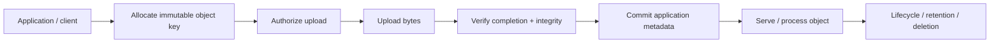
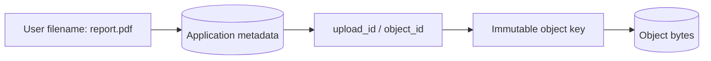
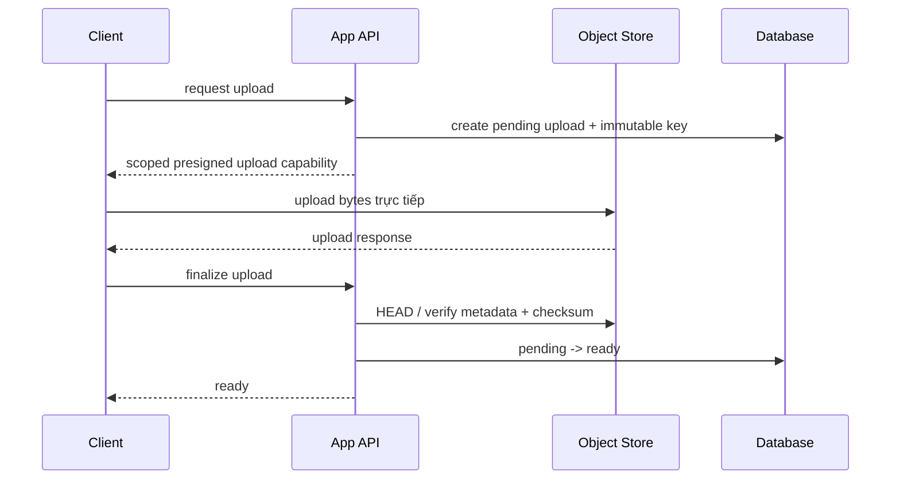
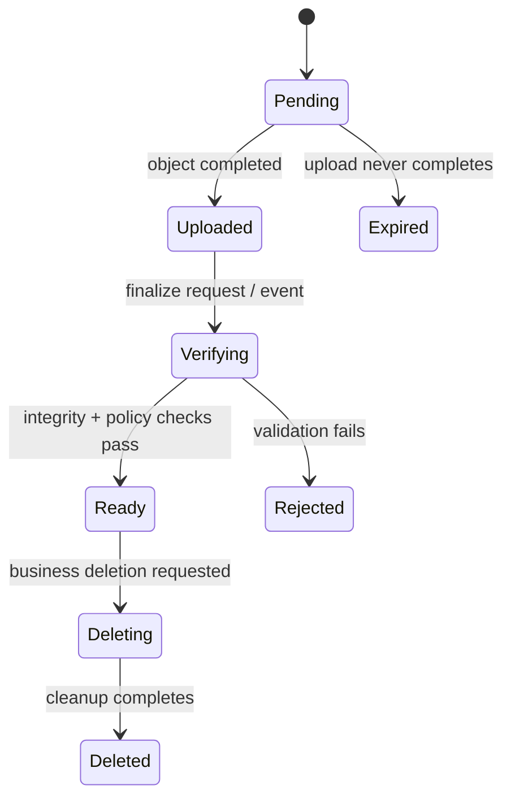

# Object Storage: Suy luận về Identity, Integrity và Lifecycle

## Tóm tắt

Object storage xoay quanh một abstraction đơn giản:

```text
bucket + object key -> bytes + metadata
```

Sự đơn giản đó rất mạnh, nhưng production system vẫn cần contract rõ ràng cho **identity, authorization, upload completion, integrity, lifecycle và metadata ownership**.

Mental model hữu ích:



Object store có thể giữ bytes bền vững trong khi application vẫn sai về việc bytes đó đã complete chưa, thuộc đúng tenant chưa, có an toàn để expose không, hoặc đã sẵn sàng cho processing chưa.

## 1. Object storage không phải filesystem có ổ đĩa lớn hơn

Object storage tổ chức dữ liệu thành các object độc lập. Mỗi object có identifier, bytes và metadata. API thường expose operation như put, get, head, list, copy và delete.

Điều này khác POSIX-style filesystem, nơi application thao tác directory, file descriptor, offset, permission và mutable byte range.

Phân biệt thực tế:

```text
filesystem
  directory hierarchy
  path lookup
  mutable file / byte range
  local hoặc mounted filesystem semantics

object storage
  bucket namespace
  object key lookup
  whole-object API semantics
  metadata + policy quanh từng object
  service boundary truy cập qua API
```

Đừng thiết kế object storage bằng cách giả định filesystem behavior mà object API chưa từng hứa.

## 2. Bucket và object key tạo nên storage identity

<TermBox term="Object key">
**Object key (khóa object)** là tên dùng để nhận diện object bên trong một bucket.

Trong Amazon S3, key định danh duy nhất một object trong bucket. Key có thể chứa delimiter như `/`, nhưng core data model của S3 là phẳng; “folder” trong console chỉ được suy ra từ key prefix.

**Vì sao quan trọng:** key design trở thành một phần của application identity, routing, authorization, lifecycle selection và operational debugging.
</TermBox>

Một key như:

```text
tenants/t42/invoices/2026/09/inv_81a7.pdf
```

trông có hierarchy, nhưng các phần ngăn bằng slash vẫn chỉ là character trong một key. Prefix là convention hữu ích, không phải directory độc lập có filesystem semantics.

Các câu hỏi quan trọng khi thiết kế key:

- Key có làm lộ private information không nên xuất hiện trong log hay URL không?
- Key có ổn định nếu user rename file không?
- Hai concurrent upload có vô tình chọn cùng key không?
- Key có encode tenant ownership đủ rõ cho policy và operations không?
- Lifecycle/inventory job có select đúng object family bằng prefix hoặc tag không?

## 3. Ưu tiên immutable storage identity hơn mutable human name

Human-facing filename là primary identifier kém an toàn.

Ví dụ:

```text
uploads/report.pdf
```

Hai user, retry hoặc concurrent replacement có thể collision trên cùng key. Nếu application overwrite key tại chỗ, cache, asynchronous processor và audit trail có thể không đồng thuận “report.pdf” nghĩa là bytes nào tại một thời điểm cụ thể.

Thiết kế an toàn hơn:

```text
object key: tenants/t42/uploads/01J.../original.pdf
logical name: report.pdf
```

Database lưu logical filename và trỏ tới immutable storage key.



Cách này tách **business identity** khỏi **storage identity**. Rename chỉ đổi metadata mà không cần move bytes; replacement có thể tạo object identity mới thay vì âm thầm mutate identity cũ.

## 4. Object storage không nên tự động trở thành application source of truth

Trong nhiều hệ thống, object store authoritative cho bytes còn application database authoritative cho business metadata.

Ví dụ:

```text
object store sở hữu:
  bytes
  storage-level checksum
  object version / storage metadata

application database sở hữu:
  tenant_id
  logical filename
  media type được product chấp nhận
  processing state
  visibility / authorization state
  upload ownership
  retention policy do business chọn
```

Phân biệt này giúp reconciliation khả thi.

Nếu object tồn tại nhưng không có database row tham chiếu, nó có thể là orphan. Nếu row nói `ready` nhưng object thiếu, application metadata đang inconsistency. Đây là hai failure khác nhau và cần repair path khác nhau.

## 5. Consistency của S3 hiện đại mạnh hơn folklore cũ

Amazon S3 cung cấp strong read-after-write consistency cho object `PUT` và `DELETE`, gồm cả overwrite, và cho `GET`/`LIST` sau khi write trả thành công.

Update trên một key là atomic: concurrent reader thấy object cũ hoặc object mới, không thấy hỗn hợp partial/corrupt giữa hai version.

Vì vậy đừng giải thích một object S3 bị “mất” sau successful `PUT` bằng rule cũ “S3 eventually consistent”.

Nhưng strong consistency ở object store không làm multi-system workflow trở thành atomic.

Flow này vẫn fail:

```text
1. PostgreSQL row -> status = ready
2. upload lên S3 -> network error trước completion
3. worker đọc row
4. worker không lấy được complete object
```

Problem là cross-system coordination, không phải S3 read-after-write consistency.

## 6. Direct upload đưa application server ra khỏi byte path

Large upload không nhất thiết phải đi xuyên application server.

Pattern phổ biến:



Lợi ích gồm giảm application-server bandwidth và tránh proxy body rất lớn qua worker vốn tồn tại chủ yếu để xử lý business logic.

Từ quan trọng là **scoped**. Direct-upload credential hoặc presigned URL là một capability. Key, operation, expiration, content expectation và tenant association phải được giới hạn có chủ đích.

## 7. Presigned URL là delegated authority, không phải bằng chứng business ownership

<TermBox term="Presigned URL">
**Presigned URL** cấp quyền có thời hạn để thực hiện một object-store request cụ thể bằng permission của signer, mà không trao long-lived cloud credential của signer cho caller.

Trong S3, URL gắn với thông tin như bucket, key, HTTP method và expiration.

**Vì sao quan trọng:** ai có một presigned URL còn hiệu lực có thể exercise capability đó cho tới khi URL hết hạn hoặc policy khác chặn. Application phải allocate và authorize key trước khi sign.
</TermBox>

Không nên chấp nhận flow:

```text
client gửi arbitrary bucket/key
server sign nó
```

Nên ưu tiên:

```text
server verify tenant + intent
server allocate key trong owned namespace
server record pending upload
server chỉ sign operation cần thiết
```

Object key nên được derive từ trusted application state, không blindly accept từ client.

## 8. Upload cùng key có thể là overwrite

Trong S3, upload vào existing key thay current object; nếu versioning enabled thì version mới được tạo nhưng application vẫn phải hiểu identity nào nó đang tham chiếu.

Điều này quan trọng với retry và presigned upload. URL còn hiệu lực có thể được dùng nhiều lần trước expiration, và cùng key có thể bị overwrite.

Nếu business intent là “tạo đúng một immutable asset”, hãy dùng unique allocated key và, khi workflow hỗ trợ, conditional write semantics để reject existing key thay vì dựa vào giả định “chắc chỉ upload một lần”.

Immutability làm retry, CDN behavior, background processing và auditing dễ reasoning hơn.

## 9. Multipart upload là construction protocol, không phải partially visible object

Large object có thể được upload thành các part độc lập.

Multipart upload tách workflow thành:

```text
create multipart upload
  -> upload part 1
  -> upload part 2
  -> ...
  -> complete multipart upload
  -> final object tồn tại
```

Part có thể retry độc lập, rất hữu ích cho large transfer hoặc unreliable network.

Nhưng application phải phân biệt:

```text
parts uploaded != object finalized
```

Đừng mark business metadata `ready` chỉ vì mọi client-side part request đều success. Completion operation mới là boundary yêu cầu object store assemble final object.

Incomplete multipart upload cũng cần cleanup. Lifecycle policy có thể abort abandoned multipart upload để failed client không để storage residue vô thời hạn.

## 10. Integrity cần checksum contract

<TermBox term="Checksum">
**Checksum** là giá trị compact được derive từ bytes để system phát hiện corruption hoặc transfer mismatch bằng cách recompute và compare.

Object store có thể validate checksum trong upload và giữ checksum metadata cho verification về sau.

**Vì sao quan trọng:** “HTTP request success” và “application nhận đúng từng byte như intended” là hai claim liên quan nhưng khác nhau. Integrity evidence làm claim sau explicit.
</TermBox>

Với direct hoặc multipart upload, hãy quyết định:

- Algorithm checksum nào được chấp nhận?
- Ai tính nó: client, trusted backend, object store hay nhiều participant?
- Checksum có được lưu trong application metadata để reconciliation sau này không?
- Processing pipeline có verify expected checksum trước expensive work không?

Điều này đặc biệt hữu ích khi object đi qua nhiều system, Region hoặc archive dài hạn.

## 11. Đừng giả định ETag nghĩa là MD5

S3 `ETag` là object metadata hữu ích, nhưng **không phải universal content-MD5 contract**.

Ví dụ, object upload bằng multipart không dùng plain MD5 digest của complete object làm ETag. Một số encryption path cũng tạo ETag không phải MD5 digest của object data.

Vì vậy rule này không an toàn nếu dùng universal:

```text
if local_md5 == ETag:
  upload valid
```

Hãy dùng checksum facility explicit của object khi application thật sự cần checksum guarantee.

## 12. Versioning thay đổi semantics của overwrite và delete

S3 Versioning cho nhiều version của cùng object key coexist với version ID khác nhau.

Khi versioning enabled:

```text
PUT same key -> new version
previous version -> còn lại dưới dạng noncurrent
DELETE không có version ID -> thường tạo delete marker
```

Điều này giúp accidental overwrite/delete có thể recover, nhưng cũng có nghĩa storage lifecycle và deletion logic phải xử lý noncurrent version.

Versioning không thay thế application history. Product vẫn có thể cần record object version nào được attach vào invoice, user submission, model artifact hoặc audit event nào.

Nếu exact replay quan trọng, hãy persist storage version identifier cùng business record thay vì chỉ lưu mutable key.

## 13. Lifecycle policy là một phần của storage design

Object storage hấp dẫn vì data có thể sống lâu hơn process tạo ra nó. Không có lifecycle ownership, sức mạnh này biến thành cost không giới hạn và forgotten data.

Lifecycle rule có thể biểu diễn policy như:

```text
new object
  -> frequent-access storage class
  -> transition sau N ngày
  -> archive sau M ngày
  -> expire khi retention cho phép
```

Lifecycle decision nên đi từ business data class, không phải một global rule “mọi thứ xuống archive sau 30 ngày”.

Nên tách riêng:

- active product asset;
- reconstructable derived artifact;
- customer export;
- compliance record;
- failed/incomplete upload;
- noncurrent version;
- temporary processing output.

Cost model không chỉ là storage price trên GB. Retrieval latency, retrieval charge, minimum storage duration, request, replication và operational recovery expectation cũng có thể quan trọng.

## 14. Deletion là workflow, không chỉ một DELETE request

Business operation “delete file” có thể phải coordinate:

```text
authorization
  -> hide khỏi product read
  -> delete/tombstone application metadata
  -> delete current object / version
  -> delete derivative / thumbnail
  -> purge cache nếu cần
  -> retain audit evidence
  -> honor legal/retention constraint
```

Với versioning hoặc Object Lock, “đã xóa khỏi normal read” không nhất thiết nghĩa “mọi byte đã permanently erased”.

API nên phân biệt product visibility, recoverability, retention và permanent deletion thay vì gộp tất cả vào một flag `deleted = true` mơ hồ.

## 15. Object Lock và retention giải bài toán khác backup

S3 Object Lock có thể bảo vệ object version bằng write-once-read-many retention semantics. Nó yêu cầu versioning và có thể ngăn protected version bị overwrite hoặc permanently delete trong retention window.

Điều đó hữu ích cho compliance hoặc tamper-resistance requirement, nhưng không giống một complete backup strategy.

Backup design vẫn phải hỏi:

- Có recover được sau bad application migration không?
- Recovery copy có đủ isolated khỏi cùng credential và automation không?
- Có restore metadata và object reference cùng nhau được không?
- Restore time và restore correctness đã test chưa?

Retention, replication, versioning và backup cover các failure mode có overlap nhưng khác nhau.

## 16. Metadata thường đủ nhỏ để giữ transactional

Đừng bỏ mọi business attribute vào opaque object metadata chỉ vì object store support metadata field.

Transactional database thường phù hợp hơn cho relationship, constraint, state transition, search predicate và multi-row invariant.

Một cách chia phổ biến:

```text
PostgreSQL row
  id
  tenant_id
  object_key
  object_version
  checksum
  logical_name
  declared_media_type
  verified_media_type
  size_bytes
  status
  created_at

Object store
  immutable bytes
  storage metadata
```

Cách này giữ authoritative workflow state queryable và để object storage chuyên về durable byte storage.

## 17. Content type và filename là untrusted input

Client-provided filename hoặc `Content-Type` header không chứng minh uploaded bytes an toàn hay thật sự đúng declaration.

Với user upload, production system thường tách:

```text
upload accepted
  -> object quarantined / chưa public
  -> inspect size và magic bytes / media format
  -> malware hoặc policy scanning khi cần
  -> generate safe derivative
  -> mark ready cho intended use
```

Đừng publish upload chỉ vì object store đã accept nó.

Security pipeline chính xác phụ thuộc product, nhưng storage lesson bền vững là: **storage acceptance không phải application validation**.

## 18. Background processing cần immutable input identity

Object storage kết hợp tự nhiên với asynchronous processing:

```text
upload completed
  -> enqueue object_id + immutable key/version
  -> worker download exact input
  -> process
  -> write derivative dưới new immutable key
  -> transactionally update metadata
```

Tránh queue message chỉ nói:

```text
process latest file at uploads/user-7/avatar.jpg
```

Nếu key bị overwrite trước khi worker chạy, worker có thể process bytes khác event đã trigger nó.

Ưu tiên immutable key hoặc explicit object version để job refer tới một stable input.

## 19. Cross-system workflow cần reconciliation

Database và object store không share một ordinary ACID transaction.

Do đó có thể xuất hiện state:

```text
object tồn tại, DB row thiếu
DB row tồn tại, object thiếu
DB nói pending, object đã completed
DB nói ready, checksum mismatch
object deleted, derivative vẫn tồn tại
```

Hãy thiết kế reconciliation job để classify và repair/quarantine các state này.

Durable workflow thường dùng state transition:



State machine làm partial failure visible thay vì giả vờ distributed workflow là atomic.

## 20. Tình huống production: database nói ready trước khi upload thật sự finalized

Một media API tạo row `asset_42` và trả presigned multipart-upload workflow. Client upload tất cả part. Trước khi `CompleteMultipartUpload` và checksum verification kết thúc, client gọi `POST /assets/asset_42/publish`.

API tin claim của client và mark row `ready`. Background transcoder đọc row ngay. Đồng thời một retry reuse cùng human-derived key `users/u9/video.mp4`, overwrite thứ mà workflow khác đang chờ.

**Hậu quả:** worker lúc thấy missing object, lúc thấy unexpected object; user có thể nhận nhầm bytes dưới stable URL; abandoned multipart part tích tụ; support thấy database record nói `ready` dù storage state chưa từng đạt intended final object.

**Nguyên nhân cốt lõi:** system nhầm client-side upload progress với object-store completion, dùng mutable shared key làm identity, và không có checksum-backed finalize transition giữa storage state và business state.

**Cách khắc phục chuẩn:** allocate unique immutable key trước khi sign, giữ database row ở `pending`, upload trực tiếp bằng capability scope hẹp, complete multipart upload, verify finalized object cùng expected checksum/size, rồi mới transition metadata sang `ready`. Queue worker bằng immutable object identity, cleanup abandoned multipart bằng lifecycle rule và reconcile orphan/missing state explicit.

## Tự kiểm tra: strong S3 consistency có loại bỏ nhu cầu upload state machine không?

Giả sử S3 expose successful completed `PUT` mạnh và nhất quán cho read sau đó. Application có thể thay state machine `pending -> ready` bằng “key tồn tại thì upload ready” không?

<details>
<summary>Xem giải thích chi tiết</summary>

Không.

Strong read-after-write consistency trả lời storage visibility question: sau successful write, subsequent object-store read thấy gì?

Application vẫn có các câu hỏi riêng:

- Key này có được allocate cho authenticated tenant không?
- Multipart completion đã finish chưa?
- Final size/checksum có match expected upload không?
- Content validation hoặc security scanning đã pass chưa?
- Database đã record exact object identity/version chưa?
- Object đã được approve cho public/downstream processing chưa?

Các fact đó trải qua application policy và nhiều system. State machine là cách application represent các fact và partial failure explicit.
</details>

## Checklist production

- [ ] **Identity:** allocate immutable object ID/key thay vì dùng human filename làm storage identity.
- [ ] **Namespace:** làm rõ tenant/ownership boundary mà không leak private data không cần thiết trong key.
- [ ] **Source of truth:** nêu system nào sở hữu bytes và system nào sở hữu business metadata/workflow state.
- [ ] **Consistency:** không dựa vào obsolete eventual-consistency assumption cho behavior S3 `PUT`/`DELETE`/`GET`/`LIST` hiện đại.
- [ ] **Authorization:** scope presigned capability theo intended bucket, key, operation và lifetime.
- [ ] **Finalize:** tách upload progress khỏi completed object state.
- [ ] **Multipart cleanup:** abort abandoned multipart bằng lifecycle policy hoặc explicit cleanup.
- [ ] **Integrity:** verify checksum/size khi correctness phụ thuộc exact bytes.
- [ ] **ETag:** không universal treat ETag như content MD5.
- [ ] **Validation:** xem filename, declared media type và uploaded bytes là untrusted cho tới khi product check pass.
- [ ] **Versioning:** quyết định overwrite/delete recovery có cần object versioning không và persist version ID nếu exact replay quan trọng.
- [ ] **Lifecycle:** classify active, temporary, archive, failed-upload và noncurrent-version retention riêng.
- [ ] **Deletion:** phân biệt product hiding, recoverability, retention và permanent deletion.
- [ ] **Workers:** gửi immutable key/version identity cho asynchronous processor.
- [ ] **Reconciliation:** detect orphan object, missing object, stale metadata và failed derivative.
- [ ] **Observability:** đo upload failure, finalize latency, multipart abandonment, checksum failure, storage growth, lifecycle transition và processing lag.

## Quy tắc cho agent

Khi đề xuất object storage, đừng dừng ở “đưa file vào S3”. Hãy nêu object identity, ai sở hữu business metadata, upload authority được delegate thế nào, điều gì chứng minh completion và integrity, key có mutable không, asynchronous worker nhận diện exact bytes ra sao, versioning/lifecycle/deletion có nghĩa gì, và database/object-store divergence được reconcile thế nào.

## Nguồn tham khảo

- [Amazon S3 User Guide — What is Amazon S3? / data consistency model](https://docs.aws.amazon.com/AmazonS3/latest/userguide/Welcome.html)
- [Amazon S3 User Guide — Naming Amazon S3 objects](https://docs.aws.amazon.com/AmazonS3/latest/userguide/object-keys.html)
- [Amazon S3 User Guide — Presigned URLs](https://docs.aws.amazon.com/AmazonS3/latest/userguide/using-presigned-url.html)
- [Amazon S3 User Guide — Multipart upload overview](https://docs.aws.amazon.com/AmazonS3/latest/userguide/mpuoverview.html)
- [Amazon S3 User Guide — Checking object integrity](https://docs.aws.amazon.com/AmazonS3/latest/userguide/checking-object-integrity-upload.html)
- [Amazon S3 API — Object / ETag semantics](https://docs.aws.amazon.com/AmazonS3/latest/API/API_Object.html)
- [Amazon S3 User Guide — How S3 Versioning works](https://docs.aws.amazon.com/AmazonS3/latest/userguide/versioning-workflows.html)
- [Amazon S3 User Guide — Managing object lifecycle](https://docs.aws.amazon.com/AmazonS3/latest/userguide/object-lifecycle-mgmt.html)
- [Amazon S3 User Guide — Object Lock](https://docs.aws.amazon.com/AmazonS3/latest/userguide/object-lock.html)

Bài này được phân loại **evolving** với chu kỳ review 180 ngày vì provider API, checksum support, storage class, security default và lifecycle feature tiếp tục thay đổi dù core object-identity và cross-system workflow model khá bền vững.
