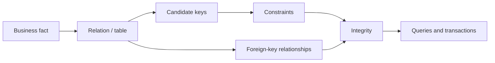
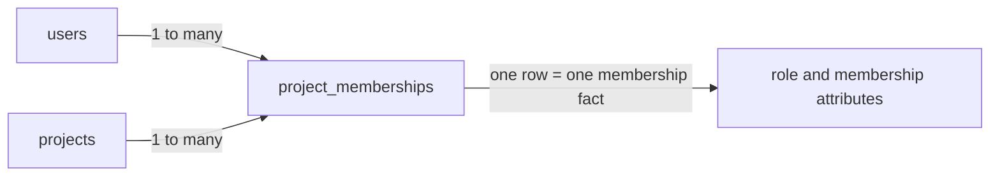

# Relational Data Model: Put Business Facts Under Constraints

## TL;DR

A relational schema is not just a collection of tables. It is a model of **business facts, identities, relationships, and invariants** that the database can keep consistent even when many callers write concurrently.

Use this reasoning sequence:

```text
name the fact
  -> identify what uniquely identifies it
  -> define relationships and cardinality
  -> make optionality explicit
  -> encode durable invariants as constraints
  -> remove accidental duplicated facts
  -> denormalize only with an ownership and repair plan
  -> evolve the schema without creating two sources of truth
```



<TermBox term="Relational model">
A **relational model** represents facts as relations made of attributes and tuples, with keys and constraints defining identity and valid relationships.

**Why it matters:** application code changes, retries, concurrent writers, data imports, and maintenance scripts all touch the same durable state. Important invariants are safer when the data model expresses them directly instead of relying only on caller discipline.
</TermBox>

## 1. Model facts before you model screens or JSON payloads

Start by asking what statements must remain true about the business.

For a commerce system, examples of facts include:

```text
customer C has email E
order O belongs to customer C
order line L references product P
membership M grants user U a role in project P
invoice I covers subscription S for billing period B
```

A useful table usually corresponds to one coherent kind of fact. Columns describe that fact; keys identify it; foreign keys connect it to other facts.

Do not begin with “the frontend sends this object, so let us persist that object unchanged.” API shapes optimize transport and client ergonomics. Durable relational models optimize identity, integrity, change, and queryable relationships.

## 2. Relation, row, and attribute are different levels of the model

In practical SQL:

- a **table** represents a relation-like collection of facts;
- a **row** represents one fact instance;
- a **column** represents one attribute of those facts.

For example:

```sql
CREATE TABLE projects (
  id bigint PRIMARY KEY,
  tenant_id bigint NOT NULL,
  name text NOT NULL
);
```

`projects` is the collection, one row is one project fact, and `id`, `tenant_id`, and `name` are attributes.

The mathematical relational model and SQL are not identical. SQL has `NULL`, ordering only when requested, and can allow duplicate rows unless keys or uniqueness constraints prevent them. Use relational theory as a reasoning model, while designing for the actual semantics of your SQL database.

## 3. Keys answer “which fact is this?”

<TermBox term="Candidate key">
A **candidate key** is a minimal set of attributes whose values uniquely identify a row according to the business model.

A table can have several candidate keys. One is commonly selected as the primary key; other business identities should usually remain protected with `UNIQUE` constraints when they must also be unique.
</TermBox>

Suppose a tenant imports customers from an external CRM:

```text
internal id                     -> 918273
(tenant_id, external_customer_id) -> (42, "cus_abc")
```

The internal surrogate `id` is convenient for joins, but it does not make the external business identity stop being unique.

A robust model can enforce both:

```sql
CREATE TABLE customers (
  id bigint PRIMARY KEY,
  tenant_id bigint NOT NULL,
  external_customer_id text NOT NULL,
  email text NOT NULL,
  UNIQUE (tenant_id, external_customer_id)
);
```

A common mistake is to add a surrogate primary key and accidentally remove the real-world uniqueness rule. Then duplicate business facts become perfectly valid rows because every duplicate received a different generated ID.

### Primary key is a selected identity, not every invariant

A primary key gives every row a stable database identity. It does not automatically encode:

- one membership per `(project_id, user_id)`;
- one invoice per `(subscription_id, billing_period)`;
- one webhook delivery record per provider event ID;
- one active reservation per constrained business resource.

Those are separate invariants and need their own constraints or a different data shape.

## 4. Foreign keys encode referential integrity

A foreign key says that a relationship cannot point at a row that does not exist.

```sql
CREATE TABLE orders (
  id bigint PRIMARY KEY,
  customer_id bigint NOT NULL REFERENCES customers(id),
  status text NOT NULL
);
```

Without the foreign key, an `orders.customer_id` can become a meaningless number after a bug, manual repair, or partial migration.

PostgreSQL's current documentation describes foreign keys as a mechanism for maintaining **referential integrity**: referencing values must match an eligible referenced row. That is stronger than “the API checks the customer before insert,” because the database protects the rule for every writer that uses the table.

Foreign-key actions such as `ON DELETE RESTRICT`, `CASCADE`, or `SET NULL` are business decisions. Choose them from ownership semantics, not convenience.

Ask:

```text
if parent disappears, should child disappear?
should deletion be rejected while children exist?
is the relationship allowed to become absent?
do we preserve historical references instead of deleting either side?
```

## 5. Cardinality tells you how many relationships are valid

Common shapes are:

```text
one-to-one
one-to-many
many-to-many
```

### One-to-many

One customer can have many orders, while each order belongs to one customer:

```text
customers 1 ---- * orders
```

The foreign key lives naturally on `orders`.

### One-to-one

If every user may have at most one active profile row:

```sql
CREATE TABLE user_profiles (
  user_id bigint PRIMARY KEY REFERENCES users(id),
  display_name text NOT NULL
);
```

The primary key on `user_id` simultaneously references the user and prevents multiple profile rows.

### Many-to-many

Users can belong to many projects and projects can contain many users. Model the relationship itself as a relation:

```sql
CREATE TABLE project_memberships (
  project_id bigint NOT NULL REFERENCES projects(id),
  user_id bigint NOT NULL REFERENCES users(id),
  role text NOT NULL,
  PRIMARY KEY (project_id, user_id)
);
```



The join table is not “just plumbing.” It owns attributes of the relationship, such as role, joined time, invitation source, or state.

## 6. Nullability is part of the domain contract

`NULL` is not merely a storage default. It means the value is absent or unknown according to SQL semantics.

If a value is required for every valid row, say so:

```sql
email text NOT NULL
```

If a relationship is genuinely optional, nullable can be correct:

```sql
reviewed_by_user_id bigint NULL REFERENCES users(id)
```

But avoid one nullable column representing several hidden states:

```text
shipped_at = NULL
```

Does that mean:

- order not paid;
- paid but not packed;
- digital order with no shipment;
- shipment canceled;
- legacy row missing data?

If those states drive behavior, model state explicitly instead of forcing every query to reinterpret the same `NULL` differently.

## 7. Constraints are executable invariants

<TermBox term="Integrity constraint">
An **integrity constraint** is a rule the database enforces so invalid state cannot be committed through ordinary data-changing operations.

Typical relational constraints include `NOT NULL`, `CHECK`, `UNIQUE`, `PRIMARY KEY`, and `FOREIGN KEY`.
</TermBox>

Example:

```sql
CREATE TABLE invoice_lines (
  id bigint PRIMARY KEY,
  invoice_id bigint NOT NULL REFERENCES invoices(id),
  line_number integer NOT NULL CHECK (line_number > 0),
  quantity integer NOT NULL CHECK (quantity > 0),
  unit_price_cents bigint NOT NULL CHECK (unit_price_cents >= 0),
  UNIQUE (invoice_id, line_number)
);
```

PostgreSQL 18 documents these constraint families directly, and its primary-key semantics require unique, non-null values. The exact syntax varies across databases; the modeling principle does not.

Prefer constraints for rules that are:

- local to durable data;
- stable enough to be part of the schema contract;
- required regardless of which application path performs the write.

Do not force every policy into a database `CHECK`. Rules that depend on external services, current time in complex ways, cross-system state, or rapidly changing product policy may belong elsewhere. The question is where the invariant can actually be enforced correctly.

## 8. Normalize by asking which fact determines which attribute

Normalization is useful because duplicated facts create update anomalies.

Bad shape:

```text
orders
  order_id
  customer_id
  customer_email
  customer_plan
  customer_plan_discount_percent
```

If `customer_plan` is a current customer fact rather than a historical order snapshot, every new order duplicates it. A plan change now requires many rows to agree.

Reason with dependencies:

```text
customer_id -> current customer_email
customer_id -> current customer_plan
plan_id     -> plan_discount_policy
order_id    -> order-specific totals and snapshot facts
```

Store each authoritative fact where its identity naturally owns it, then join when you need combined views.

### Normal forms are tools, not a scoring system

At practical application depth:

- **1NF** pushes toward atomic attributes and rows with a stable shape;
- **2NF** removes attributes that depend on only part of a composite key;
- **3NF** removes attributes that really depend on another non-key fact rather than the row's key.

Do not normalize because “higher is always better.” Normalize to remove ambiguous ownership and write anomalies. Stop when the model makes facts and invariants clear enough for the workload.

## 9. Distinguish authoritative facts from snapshots and derived data

Duplicated values are not always wrong.

An order may intentionally snapshot the shipping address and unit price used at purchase time. Those are historical order facts even if a customer later edits their profile or the product price changes.

Contrast:

```text
customers.current_email          -> current authoritative fact
orders.checkout_email_snapshot   -> historical fact at checkout
```

The names and update rules should make the distinction explicit.

Derived values also need ownership:

```text
order_total = sum(order_lines)
```

Options include:

- compute on read;
- maintain a stored derived value transactionally;
- update asynchronously with documented staleness;
- materialize for analytics or search.

If you store derived data, define how it is repaired when the update path fails. “We keep both in sync in application code” is not a sufficient invariant by itself.

## 10. Denormalization is a deliberate copy with a consistency contract

Denormalization can reduce joins, preserve historical snapshots, serve a read model, or move expensive computation off a hot path.

Before adding a duplicate field, write down:

```text
source of truth
copy owner
update mechanism
allowed staleness
rebuild / repair path
failure behavior
```

If you cannot answer those, you are creating a second source of truth rather than a controlled read optimization.

Indexes solve access-path problems. Denormalization changes the data model. Do not copy data merely because one query is slow before checking whether the relational model and indexes already support the workload.

## 11. Schema evolution should preserve one authoritative interpretation

A production schema changes while old and new application versions may overlap.

For a risky rename or split, prefer an expand-and-contract sequence:


During migration, avoid indefinite dual-write logic where either column can independently become authoritative.

For example, splitting `full_name` into structured fields can require:

1. add new nullable columns or a new relation;
2. deploy code that writes through one controlled compatibility path;
3. backfill old rows;
4. verify completeness and invariants;
5. move reads;
6. add final constraints when data satisfies them;
7. remove the obsolete representation.

PostgreSQL's current table-modification documentation notes that adding a constraint checks existing data immediately. That is operationally important: migration order must prepare existing rows before tightening the invariant.

## 12. Production scenario: two rows claim the same membership

A project service stores:

```text
project_memberships
  id                primary key
  project_id
  user_id
  role
```

The API checks whether a membership exists before inserting. There is no foreign key on `project_id` or `user_id`, and no `UNIQUE (project_id, user_id)` constraint. Separately, `projects.owner_user_id` sometimes duplicates the same ownership fact represented by a membership row with `role = 'owner'`.

Two invitation requests race. Both check “membership does not exist,” then both insert. Later, one row is promoted to `admin`; another remains `viewer`. A cleanup path updates `projects.owner_user_id` but not the membership role.

**Impact:** authorization queries can return conflicting answers for the same user and project. Billing and audit exports count duplicate memberships, and deleting a user can leave orphaned membership rows.

**Root cause:** the schema gave each physical row a surrogate identity but failed to encode the business identity `(project_id, user_id)`. It also stored one ownership fact in two independently writable places, creating two sources of truth. Caller-side check-then-insert was mistaken for a durable uniqueness invariant.

**Correct pattern:** choose one authoritative membership model, enforce foreign keys for referenced identities and a unique composite key for one membership per user/project, and represent ownership with one explicitly owned invariant. If a read-optimized copy is required, give it a derived-data update and repair contract rather than treating both copies as authoritative.

## 13. Review a relational schema with invariant questions

For every table, ask:

- What fact does one row represent?
- Which attributes identify that fact in the business domain?
- Which candidate key became the primary key, and which other uniqueness rules still matter?
- Which relationships are mandatory or optional?
- What is the cardinality of each relationship?
- Which invalid states does the database reject itself?
- Which values are historical snapshots versus current authoritative facts?
- Is any business fact independently writable in more than one place?
- If data is denormalized, where is the source of truth and how is the copy repaired?
- Can the schema evolve through a compatibility window without ambiguous ownership?

## Self-check: should `product_name` live on an order line?

<details>
<summary>Reveal the reasoning</summary>

It depends on what the column means.

If `order_lines.product_name` means “the current product name,” duplicating it from `products.name` creates an update problem and should usually be joined or treated as derived data.

If it means “the product description shown to the buyer when the order was placed,” then it is an intentional historical snapshot owned by the order line. A later product rename should not rewrite history.

The modeling question is not “is duplication allowed?” It is “what fact does this value represent, who owns it, and should it change when the source entity changes?”
</details>

## Production checklist

- [ ] Each table has a one-sentence definition of the fact represented by one row.
- [ ] Candidate/business keys are identified before choosing surrogate IDs for convenience.
- [ ] Required business uniqueness is enforced with primary or unique constraints.
- [ ] Required relationships use foreign keys where the database owns both sides.
- [ ] Cardinality and deletion/update behavior are explicit.
- [ ] `NULL` represents genuine optionality or unknown state, not several hidden workflow states.
- [ ] Stable row-local invariants use `NOT NULL`, `CHECK`, or equivalent constraints where appropriate.
- [ ] Many-to-many relationships are modeled as first-class relations with their own attributes.
- [ ] Normalization removes accidental duplicated facts and update anomalies.
- [ ] Intentional snapshots and denormalized copies name a source of truth and repair mechanism.
- [ ] Derived data has a documented consistency/staleness contract.
- [ ] Schema migrations use staged compatibility rather than indefinite dual authority.

## Agent rule

When reviewing a relational schema, never stop at “the tables look reasonable.” Name the fact represented by each row, identify its candidate keys, state relationship cardinality and optionality, locate every authoritative copy of the fact, and point to the database constraint or explicit consistency mechanism that keeps each durable invariant true.

## Sources

- [PostgreSQL 18 — Data Definition](https://www.postgresql.org/docs/18/ddl.html)
- [PostgreSQL 18 — Constraints](https://www.postgresql.org/docs/18/ddl-constraints.html)
- [PostgreSQL 18 — Foreign Keys tutorial](https://www.postgresql.org/docs/18/tutorial-fk.html)
- [PostgreSQL 18 — Modifying Tables](https://www.postgresql.org/docs/18/ddl-alter.html)
