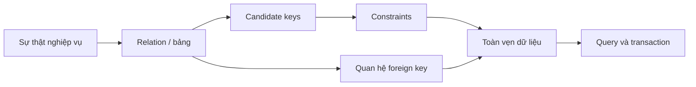
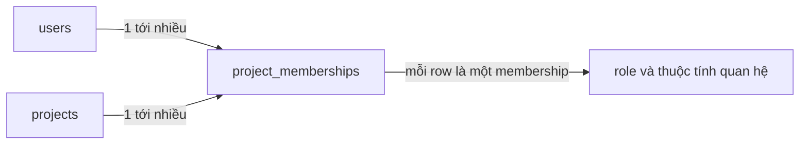
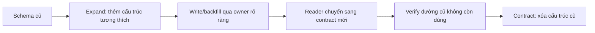

# Mô hình Dữ liệu Quan hệ: Đặt Sự thật Nghiệp vụ dưới Ràng buộc

## Tóm tắt

Một lược đồ quan hệ không chỉ là tập hợp các bảng. Nó là mô hình của **sự thật nghiệp vụ, danh tính, quan hệ và bất biến** mà cơ sở dữ liệu phải giữ nhất quán ngay cả khi nhiều luồng ghi chạy đồng thời.

Hãy suy luận theo thứ tự:

```text
đặt tên sự thật
  -> xác định điều gì định danh duy nhất sự thật đó
  -> mô tả quan hệ và cardinality
  -> làm rõ tính bắt buộc / tùy chọn
  -> mã hóa bất biến bền vững bằng constraint
  -> loại bỏ bản sao sự thật ngoài ý muốn
  -> chỉ denormalize khi có owner và đường sửa chữa
  -> tiến hóa schema mà không tạo hai nguồn sự thật
```



<TermBox term="Relational model">
**Mô hình quan hệ** biểu diễn sự thật bằng các relation gồm thuộc tính và tuple; khóa và constraint xác định danh tính cùng các quan hệ hợp lệ.

**Vì sao quan trọng:** code ứng dụng thay đổi, retry, ghi đồng thời, import dữ liệu và script bảo trì đều tác động lên cùng trạng thái bền vững. Bất biến quan trọng an toàn hơn khi data model diễn đạt trực tiếp thay vì chỉ dựa vào kỷ luật của caller.
</TermBox>

## 1. Mô hình hóa sự thật trước màn hình hay JSON

Bắt đầu bằng câu hỏi: những phát biểu nào về nghiệp vụ phải luôn đúng?

Ví dụ trong hệ thống thương mại:

```text
khách hàng C có email E
đơn hàng O thuộc khách hàng C
dòng đơn hàng L tham chiếu sản phẩm P
membership M cấp vai trò cho user U trong project P
invoice I thuộc subscription S ở kỳ thanh toán B
```

Một bảng tốt thường biểu diễn một loại sự thật nhất quán. Cột mô tả sự thật đó; khóa định danh nó; foreign key nối nó với các sự thật khác.

Đừng bắt đầu bằng “frontend gửi object này nên lưu nguyên object.” API shape tối ưu cho truyền dữ liệu và trải nghiệm client. Mô hình quan hệ bền vững tối ưu cho danh tính, tính toàn vẹn, thay đổi và quan hệ có thể truy vấn.

## 2. Relation, row và attribute nằm ở các tầng khác nhau

Trong SQL thực tế:

- **table** biểu diễn một tập hợp sự thật theo kiểu relation;
- **row** biểu diễn một instance của sự thật;
- **column** biểu diễn một thuộc tính của sự thật đó.

Ví dụ:

```sql
CREATE TABLE projects (
  id bigint PRIMARY KEY,
  tenant_id bigint NOT NULL,
  name text NOT NULL
);
```

`projects` là tập hợp, một row là một project, còn `id`, `tenant_id`, `name` là các thuộc tính.

Mô hình quan hệ toán học và SQL không hoàn toàn giống nhau. SQL có `NULL`, không có thứ tự nếu không yêu cầu rõ, và có thể cho phép row trùng nếu không có key hay uniqueness constraint. Dùng relational theory làm mental model, nhưng thiết kế theo semantics thật của hệ quản trị SQL đang dùng.

## 3. Key trả lời câu hỏi “đây là sự thật nào?”

<TermBox term="Candidate key">
**Candidate key** là tập thuộc tính tối thiểu có giá trị định danh duy nhất một row theo mô hình nghiệp vụ.

Một bảng có thể có nhiều candidate key. Thường ta chọn một key làm primary key; các danh tính nghiệp vụ khác vẫn nên được bảo vệ bằng `UNIQUE` nếu chúng cũng phải duy nhất.
</TermBox>

Giả sử mỗi tenant import khách hàng từ CRM ngoài:

```text
internal id                       -> 918273
(tenant_id, external_customer_id) -> (42, "cus_abc")
```

Surrogate `id` tiện cho join, nhưng không làm biến mất quy tắc duy nhất của danh tính bên ngoài.

```sql
CREATE TABLE customers (
  id bigint PRIMARY KEY,
  tenant_id bigint NOT NULL,
  external_customer_id text NOT NULL,
  email text NOT NULL,
  UNIQUE (tenant_id, external_customer_id)
);
```

Sai lầm phổ biến là thêm surrogate primary key rồi vô tình bỏ quy tắc uniqueness thật của nghiệp vụ. Khi đó hai sự thật trùng nhau vẫn là hai row “hợp lệ” vì mỗi row có generated ID khác nhau.

### Primary key không phải mọi invariant

Primary key cho mỗi row một danh tính ổn định trong database. Nó không tự động bảo đảm:

- một membership duy nhất cho `(project_id, user_id)`;
- một invoice cho `(subscription_id, billing_period)`;
- một bản ghi delivery cho mỗi event ID của provider;
- một reservation hoạt động cho một tài nguyên nghiệp vụ bị giới hạn.

Đó là các invariant riêng và cần constraint riêng hoặc data shape khác.

## 4. Foreign key mã hóa referential integrity

Foreign key nói rằng một quan hệ không thể trỏ tới row không tồn tại.

```sql
CREATE TABLE orders (
  id bigint PRIMARY KEY,
  customer_id bigint NOT NULL REFERENCES customers(id),
  status text NOT NULL
);
```

Không có foreign key, `orders.customer_id` có thể thành một con số vô nghĩa sau bug, thao tác sửa tay hoặc migration dở dang.

Tài liệu PostgreSQL hiện hành mô tả foreign key như cơ chế duy trì **referential integrity**: giá trị tham chiếu phải khớp một row hợp lệ ở phía được tham chiếu. Điều này mạnh hơn “API kiểm tra customer trước khi insert” vì database bảo vệ quy tắc cho mọi writer.

Các hành động như `ON DELETE RESTRICT`, `CASCADE`, `SET NULL` là quyết định nghiệp vụ, không phải lựa chọn vì tiện.

Hãy hỏi:

```text
parent biến mất thì child có nên biến mất?
có nên chặn delete khi child còn tồn tại?
quan hệ có được phép trở thành absent?
có cần giữ tham chiếu lịch sử thay vì xóa?
```

## 5. Cardinality cho biết có bao nhiêu quan hệ là hợp lệ

Ba dạng thường gặp:

```text
one-to-one
one-to-many
many-to-many
```

### One-to-many

Một customer có nhiều orders, mỗi order thuộc một customer:

```text
customers 1 ---- * orders
```

Foreign key nằm tự nhiên ở `orders`.

### One-to-one

Nếu mỗi user chỉ có tối đa một profile:

```sql
CREATE TABLE user_profiles (
  user_id bigint PRIMARY KEY REFERENCES users(id),
  display_name text NOT NULL
);
```

Primary key trên `user_id` vừa tham chiếu user vừa ngăn nhiều profile row.

### Many-to-many

User có thể thuộc nhiều project và project có nhiều user. Hãy mô hình hóa chính relationship thành một relation:

```sql
CREATE TABLE project_memberships (
  project_id bigint NOT NULL REFERENCES projects(id),
  user_id bigint NOT NULL REFERENCES users(id),
  role text NOT NULL,
  PRIMARY KEY (project_id, user_id)
);
```



Join table không chỉ là “plumbing”. Nó sở hữu thuộc tính của relationship như role, thời điểm tham gia, nguồn invitation hoặc state.

## 6. Nullability là một phần của domain contract

`NULL` không chỉ là default lưu trữ. Nó biểu diễn giá trị absent hoặc unknown theo semantics của SQL.

Nếu mọi row hợp lệ đều phải có giá trị, hãy nói rõ:

```sql
email text NOT NULL
```

Nếu relationship thực sự optional, nullable có thể đúng:

```sql
reviewed_by_user_id bigint NULL REFERENCES users(id)
```

Nhưng tránh dùng một nullable column để đại diện nhiều state ẩn:

```text
shipped_at = NULL
```

Nó có nghĩa là chưa thanh toán, đã thanh toán nhưng chưa đóng gói, đơn digital không cần ship, shipment bị hủy, hay dữ liệu legacy thiếu?

Nếu các state đó quyết định behavior, hãy model state tường minh thay vì buộc mọi query tự diễn giải cùng một `NULL` theo nhiều nghĩa.

## 7. Constraint là invariant có thể thực thi

<TermBox term="Integrity constraint">
**Integrity constraint** là quy tắc database tự enforce để trạng thái không hợp lệ không thể được commit qua các thao tác thay đổi dữ liệu thông thường.

Các constraint quan hệ quen thuộc gồm `NOT NULL`, `CHECK`, `UNIQUE`, `PRIMARY KEY` và `FOREIGN KEY`.
</TermBox>

Ví dụ:

```sql
CREATE TABLE invoice_lines (
  id bigint PRIMARY KEY,
  invoice_id bigint NOT NULL REFERENCES invoices(id),
  line_number integer NOT NULL CHECK (line_number > 0),
  quantity integer NOT NULL CHECK (quantity > 0),
  unit_price_cents bigint NOT NULL CHECK (unit_price_cents >= 0),
  UNIQUE (invoice_id, line_number)
);
```

PostgreSQL 18 mô tả trực tiếp các nhóm constraint này; primary key yêu cầu giá trị vừa unique vừa non-null. Cú pháp cụ thể có thể khác giữa các database, nhưng nguyên tắc modeling không đổi.

Ưu tiên constraint cho quy tắc:

- nằm trong durable data;
- đủ ổn định để trở thành schema contract;
- phải đúng bất kể application path nào thực hiện write.

Không ép mọi policy vào database `CHECK`. Quy tắc phụ thuộc external service, thời gian theo cách phức tạp, cross-system state hoặc product policy thay đổi nhanh có thể thuộc tầng khác. Câu hỏi là invariant có thể được enforce đúng ở đâu.

## 8. Chuẩn hóa bằng cách hỏi fact nào quyết định attribute nào

Normalization hữu ích vì fact bị lặp tạo update anomaly.

Data shape kém:

```text
orders
  order_id
  customer_id
  customer_email
  customer_plan
  customer_plan_discount_percent
```

Nếu `customer_plan` là trạng thái hiện tại của customer chứ không phải snapshot lịch sử của order, mỗi order mới lại copy nó. Khi plan đổi, nhiều row phải cùng đổi để nhất quán.

Hãy suy luận theo dependency:

```text
customer_id -> current customer_email
customer_id -> current customer_plan
plan_id     -> plan_discount_policy
order_id    -> order-specific totals và snapshot facts
```

Lưu mỗi authoritative fact tại nơi identity tự nhiên của nó sở hữu, rồi join khi cần view kết hợp.

### Normal form là công cụ, không phải điểm số

Ở mức ứng dụng thực tế:

- **1NF** hướng tới attribute nguyên tử và row có shape ổn định;
- **2NF** loại attribute chỉ phụ thuộc một phần composite key;
- **3NF** loại attribute thực ra phụ thuộc một non-key fact khác thay vì key của row.

Đừng normalize chỉ vì “cao hơn luôn tốt hơn”. Normalize để loại ownership mơ hồ và write anomaly. Dừng khi model đã làm fact và invariant đủ rõ cho workload.

## 9. Phân biệt authoritative fact, snapshot và derived data

Giá trị lặp không phải lúc nào cũng sai.

Order có thể chủ động snapshot địa chỉ giao hàng và unit price tại thời điểm mua. Đó là historical order facts dù customer sửa profile hoặc giá sản phẩm đổi sau này.

```text
customers.current_email          -> fact hiện tại, authoritative
orders.checkout_email_snapshot   -> fact lịch sử tại checkout
```

Tên cột và update rule phải làm rõ khác biệt.

Derived value cũng cần owner:

```text
order_total = sum(order_lines)
```

Có thể:

- tính khi read;
- lưu và cập nhật transactionally;
- cập nhật async với staleness được ghi rõ;
- materialize cho analytics hoặc search.

Nếu lưu derived data, phải định nghĩa cách repair khi update path fail. “Application code giữ hai bên đồng bộ” tự nó chưa phải invariant đủ mạnh.

## 10. Denormalization là bản sao có consistency contract

Denormalization có thể giảm join, giữ snapshot lịch sử, phục vụ read model hoặc đưa computation ra khỏi hot path.

Trước khi copy field, hãy ghi:

```text
source of truth
owner của bản copy
cơ chế update
staleness cho phép
đường rebuild / repair
failure behavior
```

Nếu không trả lời được, bạn đang tạo source of truth thứ hai chứ không phải read optimization có kiểm soát.

Index giải quyết access path. Denormalization thay đổi data model. Đừng copy data chỉ vì một query chậm trước khi kiểm tra relational model và index đã phù hợp workload chưa.

## 11. Schema evolution phải giữ một cách diễn giải authoritative

Production schema thay đổi trong khi version ứng dụng cũ và mới có thể chạy chồng nhau.

Với rename hoặc split rủi ro, ưu tiên expand-and-contract:



Trong migration, tránh dual-write vô thời hạn nơi hai column đều có thể tự trở thành authoritative.

Ví dụ split `full_name` thành cấu trúc mới:

1. thêm column nullable hoặc relation mới;
2. deploy code ghi qua một compatibility path có owner;
3. backfill row cũ;
4. verify completeness và invariant;
5. chuyển read;
6. thêm constraint cuối khi dữ liệu đã thỏa;
7. xóa representation cũ.

Tài liệu PostgreSQL hiện hành lưu ý rằng khi thêm constraint, dữ liệu hiện có sẽ được kiểm tra ngay. Vì vậy migration order phải chuẩn bị data trước khi siết invariant.

## 12. Tình huống production: hai row cùng nhận một membership

Một project service lưu:

```text
project_memberships
  id                primary key
  project_id
  user_id
  role
```

API kiểm tra membership trước khi insert. Không có foreign key cho `project_id` hay `user_id`, cũng không có `UNIQUE (project_id, user_id)`. Đồng thời `projects.owner_user_id` đôi khi lặp cùng ownership fact vốn cũng được biểu diễn bằng membership `role = 'owner'`.

Hai invitation request chạy đua. Cả hai cùng thấy “membership chưa tồn tại” rồi cùng insert. Sau đó một row được promote thành `admin`, row kia vẫn là `viewer`. Một cleanup path cập nhật `projects.owner_user_id` nhưng không cập nhật membership role.

**Hậu quả:** authorization query có thể trả kết quả mâu thuẫn cho cùng user/project. Billing và audit export đếm membership trùng; xóa user có thể để lại orphaned membership row.

**Nguyên nhân cốt lõi:** schema cho mỗi physical row một surrogate identity nhưng không encode business identity `(project_id, user_id)`. Nó còn lưu cùng ownership fact ở hai nơi có thể ghi độc lập, tạo hai source of truth. Check-then-insert ở caller bị hiểu nhầm là durable uniqueness invariant.

**Cách khắc phục chuẩn:** chọn một membership model authoritative, enforce foreign key cho identity được tham chiếu và unique composite key để mỗi user/project chỉ có một membership, đồng thời biểu diễn ownership bằng một invariant có owner rõ. Nếu cần read-optimized copy, cấp cho nó update/repair contract của derived data thay vì coi cả hai bản là authoritative.

## 13. Review relational schema bằng câu hỏi về invariant

Với mỗi table, hãy hỏi:

- Một row biểu diễn fact gì?
- Attribute nào định danh fact đó trong nghiệp vụ?
- Candidate key nào được chọn làm primary key, và uniqueness rule nào vẫn còn quan trọng?
- Relationship nào mandatory, relationship nào optional?
- Cardinality của từng relationship là gì?
- Invalid state nào database tự reject?
- Giá trị nào là historical snapshot, giá trị nào là current authoritative fact?
- Có business fact nào được ghi độc lập ở nhiều nơi không?
- Nếu denormalize, source of truth ở đâu và copy được repair thế nào?
- Schema có thể tiến hóa qua compatibility window mà không tạo ownership mơ hồ không?

## Tự kiểm tra: `product_name` có nên nằm trên order line không?

<details>
<summary>Xem giải thích chi tiết</summary>

Tùy thuộc column đó có nghĩa gì.

Nếu `order_lines.product_name` có nghĩa “tên sản phẩm hiện tại”, copy từ `products.name` tạo update problem; thường nên join hoặc coi là derived data.

Nếu nó có nghĩa “mô tả sản phẩm mà người mua nhìn thấy lúc đặt hàng”, đó là historical snapshot có chủ đích và thuộc về order line. Việc rename product sau này không nên viết lại lịch sử.

Câu hỏi modeling không phải “có được duplicate không?” mà là “giá trị này biểu diễn fact gì, ai sở hữu nó, và nó có nên thay đổi khi source entity thay đổi không?”
</details>

## Checklist production

- [ ] Mỗi table có một câu mô tả fact mà một row biểu diễn.
- [ ] Candidate/business key được xác định trước khi chọn surrogate ID vì tiện.
- [ ] Business uniqueness bắt buộc được enforce bằng primary hoặc unique constraint.
- [ ] Relationship bắt buộc dùng foreign key khi database sở hữu cả hai phía.
- [ ] Cardinality và behavior khi delete/update được ghi rõ.
- [ ] `NULL` biểu diễn optionality/unknown thật, không gói nhiều workflow state ẩn.
- [ ] Invariant ổn định trên row dùng `NOT NULL`, `CHECK` hoặc constraint tương đương khi phù hợp.
- [ ] Many-to-many relationship được model thành relation hạng nhất với attribute riêng.
- [ ] Normalization loại duplicated fact ngoài ý muốn và update anomaly.
- [ ] Snapshot và denormalized copy có source of truth cùng repair mechanism.
- [ ] Derived data có consistency/staleness contract.
- [ ] Schema migration dùng compatibility theo giai đoạn thay vì dual authority vô thời hạn.

## Quy tắc cho agent

Khi review relational schema, đừng dừng ở “các table trông hợp lý”. Hãy nêu fact mà mỗi row biểu diễn, xác định candidate key, nói rõ cardinality và optionality, tìm mọi authoritative copy của cùng fact, rồi chỉ ra database constraint hoặc consistency mechanism cụ thể giữ từng durable invariant đúng.

## Nguồn tham khảo

- [PostgreSQL 18 — Data Definition](https://www.postgresql.org/docs/18/ddl.html)
- [PostgreSQL 18 — Constraints](https://www.postgresql.org/docs/18/ddl-constraints.html)
- [PostgreSQL 18 — Foreign Keys tutorial](https://www.postgresql.org/docs/18/tutorial-fk.html)
- [PostgreSQL 18 — Modifying Tables](https://www.postgresql.org/docs/18/ddl-alter.html)
