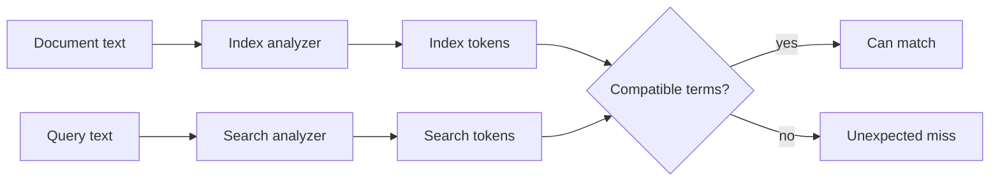
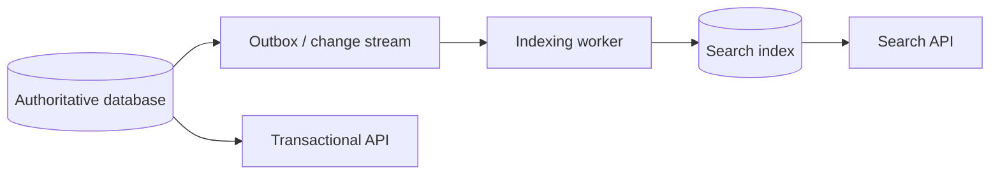

# Search Indexes: Reason About Analysis, Relevance, and Freshness

## TL;DR

A search index is a retrieval structure optimized for answering questions such as “which documents mention these concepts, satisfy these filters, and rank best for this query?” It is not the same thing as a relational database index, and in many architectures it is a **derived projection rather than the authoritative source of truth**.

Use this mental model:

```text
source document
  -> mapping chooses field semantics
  -> analyzer turns text into normalized tokens
  -> inverted index maps terms to matching documents
  -> query text is analyzed
  -> candidate documents are retrieved and filtered
  -> relevance scoring ranks the remaining candidates
  -> refresh controls when recent indexing work becomes searchable
```


The engineering work is therefore not “put JSON in Elasticsearch.” You must define text semantics, freshness expectations, ranking behavior, update propagation, and safe index evolution.

## 1. A search index and a database index solve different retrieval problems

A relational B-tree index usually helps the database find authoritative rows efficiently for predicates, ordering, joins, or uniqueness enforcement.

A search index usually builds a retrieval representation over document fields so users can search human language, combine filters, and rank matches by relevance.

```text
relational index
  row values -> ordered/searchable access path to authoritative table rows

search index
  analyzed terms + structured fields -> candidate document IDs + relevance signals
```

The word **index** appears in both, but the data model and correctness questions differ.

A database index is normally maintained transactionally with its table by the database engine. A separate search engine may be updated asynchronously from another source of truth, which introduces an explicit freshness boundary.

## 2. The inverted index reverses the lookup direction

<TermBox term="Inverted index">
An **inverted index** maps searchable terms to the documents that contain those terms, often with additional information such as term frequency or positions.

Instead of scanning every document to ask “does this document contain `database`?”, search can look up the term `database` and retrieve its posting list of matching documents.

**Why it matters here:** text search performance comes from precomputing this reverse lookup structure, but what enters the structure depends on analysis and mapping choices made at index time.
</TermBox>

Suppose three documents contain:

```text
d1: "distributed database systems"
d2: "database indexing"
d3: "distributed tracing"
```

A simplified inverted index might look like:

```text
distributed -> d1, d3
database    -> d1, d2
systems     -> d1
indexing    -> d2
tracing     -> d3
```

Real search engines store much richer metadata, but the core idea is enough to explain why analysis mistakes can make a document effectively invisible to a query.

## 3. Mapping decides what a field means

In Elasticsearch, mappings define field types and therefore how values are indexed and queried.

Two string-like field types matter constantly:

### `text`

A `text` field is analyzed for full-text search. Human-readable content such as a product title or article body is typically tokenized and normalized so queries can match words rather than only the exact original string.

### `keyword`

A `keyword` field preserves a structured value for exact-style operations such as term-level filtering, sorting, and aggregations.

Examples:

```text
title:       text
category_id: keyword
status:      keyword
sku:         keyword
brand_name:  text + keyword multi-field when both search and exact aggregation matter
```

A common failure is mapping everything as `text` because “users search it,” then discovering exact filters and aggregations behave awkwardly. The opposite failure is mapping human-language content only as `keyword`, then expecting natural full-text matching.

Elasticsearch multi-fields allow one source string to be indexed in multiple ways, for example as `text` for search and as `keyword` for sorting or aggregation.

## 4. Analysis turns language into searchable terms

<TermBox term="Analyzer">
An **analyzer** converts text into tokens for indexing or querying. It can tokenize input and apply normalization such as lowercasing, stop-word handling, stemming, or other token filters.

**Why it matters here:** the inverted index contains the analyzer's output, not the original sentence as one opaque search key. Query analysis must produce compatible terms if you expect matches.
</TermBox>

Consider:

```text
"Running Shoes for Developers"
```

A simplified analyzer might produce:

```text
running
shoes
for
developers
```

Another analyzer might lowercase, remove common words, stem variants, or apply language-specific rules.

Those choices define recall and precision. Aggressive stemming can match more variants but may collapse terms users intended to distinguish. Synonyms can improve recall but may change scoring and phrase behavior.

Treat analyzer configuration as part of product search semantics, not merely infrastructure configuration.

## 5. Index-time and search-time analysis must be compatible

Elasticsearch analyzes `text` values when documents are indexed and analyzes query strings during full-text search.

In most cases, using the same analyzer at both stages is the simplest safe choice because documents and queries are normalized into compatible tokens.



A different `search_analyzer` can be deliberate for cases such as autocomplete or search-time synonyms, but it should be tested as a relevance decision rather than added casually.

Elasticsearch also documents that the analyzer setting of an existing mapped field cannot simply be changed through the update mapping API. Analyzer evolution therefore often leads to a versioned-index/reindex workflow.

## 6. Full-text query and exact filter are different intents

A `match` query analyzes its input and is a standard full-text query for analyzed text fields.

An exact structured filter such as:

```text
status = "published"
category_id = "shoes"
country = "VN"
```

should usually use keyword/numeric/date/boolean semantics rather than language analysis.

A useful search request separates:

```text
must rank by textual relevance
  title matches "running shoes"

must be exactly eligible
  status = active
  tenant_id = t42
  inventory_region = vn-south
```

Do not make security or tenant isolation depend on fuzzy relevance logic. Authorization and exact eligibility filters are correctness boundaries.

## 7. Relevance is an ordering model, not truth

Search often returns many plausible candidates. Ranking decides which appear first.

Elasticsearch uses BM25 as its default text similarity. BM25 considers signals such as term occurrence and document/field-length relationships to score lexical matches.

You do not need to memorize the formula to reason well about the system.

The practical model is:

```text
candidate retrieval
  + textual relevance
  + exact filters
  + optional boosts/business signals
  -> ordered result list
```

Relevance scores are comparative ranking signals. A score is not a probability that the document is “correct,” and score values should not be treated as stable business identifiers across mapping/query changes.

Evaluate ranking with representative query sets and product metrics, not one visually pleasing demo query.

## 8. Better recall and better precision pull in different directions

**Recall** asks how many relevant documents were retrieved.

**Precision** asks how many retrieved documents were actually relevant.

Examples:

```text
more synonyms / fuzziness -> may improve recall, may reduce precision
stricter phrase matching  -> may improve precision, may miss useful variants
aggressive stemming       -> may join variants, may merge distinct meanings
more fields searched      -> may find more candidates, may add noise
```

The right balance is product-specific. Search for legal clauses, e-commerce products, source code, support tickets, and observability logs can require very different trade-offs.

## 9. Search visibility is near real-time, not necessarily immediate

<TermBox term="Refresh">
A **refresh** in Elasticsearch writes recent indexing-buffer contents into a new searchable segment and opens it for search.

A refresh makes operations since the previous refresh visible to search. It is lighter than a full durable commit and is why Elasticsearch describes search visibility as **near real-time (NRT)** rather than strictly immediate.
</TermBox>

Elasticsearch periodically refreshes actively searched indices; its current default behavior is typically about one second for indices that have received a search within the previous 30 seconds.

That means this sequence is possible:

```text
index document -> indexing request succeeds
immediate search -> document not returned yet
later refresh -> document becomes searchable
```

This is not the same problem as asynchronous database-to-search propagation. Even after Elasticsearch accepts an indexing operation, search visibility has its own refresh boundary.

## 10. Do not force refresh on every write without measuring the cost

Elasticsearch APIs offer refresh controls. `refresh=true` can force the affected shards to refresh immediately, while `refresh=wait_for` waits until a refresh makes the change visible rather than forcing one immediately.

Those options are useful when a specific workflow requires read-after-index visibility.

But a global rule of “force refresh after every write” can create many small segments and hurt both indexing and search performance.

Prefer to classify flows:

```text
ordinary catalog update -> near-real-time visibility is acceptable
admin publishes then verifies -> wait for visibility may be justified
bulk backfill -> throughput matters more than per-document immediate searchability
```

A freshness guarantee belongs to the product workflow, not to every write automatically.

## 11. Segments explain the refresh-versus-throughput trade-off

Lucene indexes are composed of segments. New data can be written into new segments and made searchable, while background merging later combines smaller segments.

Conceptually:

```text
indexing buffer
  -> refresh
  -> small searchable segment
  -> more refreshes create more segments
  -> background merges consolidate segments
```

More frequent refreshes can reduce search visibility delay but increase segment-management work. Less frequent refreshes can improve bulk indexing efficiency while increasing freshness latency.

This is another reason to measure freshness as an SLO instead of treating the refresh interval as an arbitrary tuning knob.

## 12. A separate search index is usually a derived projection

A common architecture keeps transactional truth in a relational database and publishes a search-optimized document to Elasticsearch.



The search document may denormalize fields from several relational tables:

```json
{
  "product_id": "p42",
  "title": "Running Shoes",
  "brand": "Atlas",
  "category": "footwear",
  "price": 990000,
  "in_stock": true
}
```

That document is excellent for retrieval, but duplicating facts creates synchronization work.

The source-of-truth question must remain explicit:

```text
Can search results be stale?
Which database state reconstructs the search document?
How are failed indexing events retried?
How do we detect missing or duplicate projections?
How do deletes/tombstones propagate?
```

## 13. Search freshness has multiple clocks

When a database is authoritative and Elasticsearch is downstream, a user-visible stale result can come from several stages:

```text
T0 database transaction commits
T1 change event becomes available
T2 indexing worker processes event
T3 Elasticsearch acknowledges index/update
T4 refresh makes change searchable
T5 cache/CDN/client receives fresh search response
```

Measure the stage that the product actually cares about.

“Consumer lag is zero” does not prove the document is searchable. “Index API latency is low” does not prove the source projection is current. “Search cluster is green” does not prove every database change arrived.

End-to-end freshness evidence should compare authoritative version/timestamp information with what search can actually return.

## 14. Ordering matters when the same document changes rapidly

Suppose product `p42` changes twice:

```text
v10: in_stock = false
v11: in_stock = true
```

If asynchronous workers process v11 and later overwrite it with delayed v10, the search projection becomes stale even though every event was eventually delivered.

Useful defenses include:

- carry a monotonically increasing source version or commit sequence;
- make downstream updates conditional on version ordering when the platform supports it;
- partition event streams by entity so related changes preserve order where practical;
- make indexing handlers idempotent;
- reconcile the projection periodically from the source of truth.

Exactly-once delivery slogans are less useful than proving the final projection cannot move backward.

## 15. Mapping and analyzer changes often require reindexing

Some search semantics are encoded when tokens are written into the index. Changing an analyzer later does not retroactively transform already-indexed terms.

Elasticsearch's Reindex API copies documents from a source index to a different destination. Importantly, the destination should be configured first: Reindex does **not** automatically copy mappings, shard counts, replicas, or other source settings for you.

A safe versioned workflow is:

```text
products-v7 is serving traffic
  -> create products-v8 with intended mapping/analyzers
  -> backfill / reindex documents
  -> catch up writes that changed during backfill
  -> validate counts, samples, freshness, and ranking
  -> atomically move products-read alias to v8
  -> keep v7 briefly for rollback
```

This turns schema/analyzer evolution into a controlled data migration instead of an in-place surprise.

## 16. Alias swap separates logical name from physical index version

Elasticsearch aliases let applications use a stable logical name while the physical index changes.

The aliases API supports multiple actions in one atomic operation, so you can remove an alias from an old index and add it to a new one without a window where the application must learn a new physical name.

```text
application searches -> products-read

before: products-read -> products-v7
after:  products-read -> products-v8
```

The alias swap is only the final routing step. It does not prove the new index is correct. Validation must happen before the swap.

## 17. Reindexing while writes continue needs a catch-up plan

A long backfill races with production mutations.

If you copy the old index for 30 minutes while products keep changing, the destination can be stale at cutover unless new writes are also captured.

Common strategies include:

- rebuild from the authoritative database while consuming a change stream from a recorded high-water mark;
- dual-write or dual-index during migration, with explicit failure handling;
- temporarily quiesce writes for a small dataset where downtime is acceptable;
- run a second reconciliation pass and verify source versions before cutover.

Do not choose dual-write casually. Two independent writes create partial-failure problems. An outbox/change-stream approach often gives a cleaner replayable boundary when the source database owns the transaction.

## 18. Shards distribute search work, but fan-out has a cost

An Elasticsearch index is divided into shards. Queries may execute across multiple shards and merge results.

This creates a familiar trade-off from the Partitioning & Sharding lesson:

```text
more shards
  -> more distribution / parallel capacity opportunities
  -> more per-shard metadata and coordination
  -> broad searches may fan out to more places
```

Do not pick shard count by a universal “GB per shard” slogan alone. Workload, growth, query shape, failure recovery, and cluster topology all matter.

Routing can restrict related documents/searches to selected shards when the access pattern permits, but routing is a locality contract: queries that lack the routing key may still need broader fan-out.

## 19. Search indexes should expose their own operational evidence

Useful signals include:

- indexing throughput and failures;
- indexing queue/backpressure;
- source-to-search freshness lag;
- refresh latency/rate;
- segment count and merge pressure;
- search p50/p95/p99 latency;
- rejected/timed-out searches;
- query fan-out and shard hotspots;
- document count differences versus source of truth;
- ranking quality metrics for representative query sets.

Separate **cluster health**, **data freshness**, and **search quality**. A green cluster can return stale or poorly ranked results.

## 20. Production scenario: analyzer evolution ships as an in-place change

An e-commerce team indexes product names with a generic analyzer. They later introduce language-specific stemming and synonyms for Vietnamese search. The team changes application query analysis first and expects existing indexed documents to match the new token semantics immediately.

At the same time, product updates flow asynchronously from PostgreSQL to Elasticsearch, but there is no end-to-end freshness metric.

**Impact:** some searches unexpectedly lose products while others become overly broad; newly updated prices and stock status appear inconsistently; support sees “correct in database, wrong in search” cases that cannot be separated into analysis bugs versus propagation lag.

**Root cause:** the team treated analyzer configuration as a query-only option and the search index as if it were authoritative/current by definition. Existing indexed terms were produced by the old analyzer, and asynchronous projection freshness was not measured.

**Correct pattern:** create a versioned destination index with the intended mapping/analyzers, reindex/backfill from an authoritative source, capture concurrent changes, evaluate representative queries plus source-to-search freshness, then atomically swap a stable alias after validation. Keep rollback possible until the new index has proven correct under production traffic.

## Self-check: does a successful index request guarantee immediate search visibility?

An API updates a product in Elasticsearch and receives a successful response from the indexing operation. The next line of application code immediately issues a normal search query for that product.

Can the application assume the search must already return the new version?

<details>
<summary>Show the reasoning</summary>

No. Elasticsearch search visibility is near real-time and is separated by a refresh boundary. A successful indexing operation does not, by itself, mean a normal search has already opened a segment containing that change.

If a workflow specifically requires search visibility before continuing, use an explicit freshness strategy such as waiting for a refresh with an appropriate request policy, or design the workflow to read the authoritative source instead. Forcing `refresh=true` after every write is not a free correctness upgrade; it can damage indexing/search efficiency.

Also distinguish this refresh delay from upstream projection lag. If the authoritative database update has not reached Elasticsearch yet, waiting for Elasticsearch's next refresh cannot fix the missing event.
</details>

## Production checklist

- [ ] **Source of truth:** identify whether the search index is authoritative or a rebuildable projection.
- [ ] **Field semantics:** map human-language fields as `text` and structured exact fields with appropriate keyword/numeric/date/boolean types.
- [ ] **Multi-fields:** use multiple representations deliberately when the same value needs full-text search plus sorting/aggregation/exact filtering.
- [ ] **Analyzer contract:** test index-time and search-time analysis with representative languages, synonyms, punctuation, casing, and morphology.
- [ ] **Exact boundaries:** keep tenant/security/status eligibility in exact filters rather than relevance scoring.
- [ ] **Ranking evidence:** evaluate BM25/boosting/query changes with representative relevance cases and product metrics.
- [ ] **Refresh contract:** define which flows tolerate NRT visibility and which require an explicit wait/fallback.
- [ ] **Projection freshness:** measure database-commit-to-searchable latency end to end.
- [ ] **Ordering:** prevent delayed older updates from overwriting newer search documents.
- [ ] **Idempotency:** make indexing/retry handlers safe under duplicate delivery.
- [ ] **Deletes:** ensure delete/tombstone events propagate and reconcile missing cleanup.
- [ ] **Reindex:** preconfigure destination mappings/settings before copying documents.
- [ ] **Catch-up:** account for source changes that occur during long backfills.
- [ ] **Alias cutover:** validate the new index before atomically moving the logical read alias.
- [ ] **Rollback:** retain the prior index/version long enough to reverse a bad cutover when practical.
- [ ] **Shard fan-out:** measure query breadth and hotspot behavior instead of assuming more shards always improve search.
- [ ] **Operations:** monitor indexing failures, freshness lag, refresh/merge pressure, search latency, shard health, and result-quality signals separately.

## Agent rule

When proposing or reviewing a search index, do not stop at “use Elasticsearch for full-text search.” State what is authoritative, how fields are analyzed and mapped, which filters are exact, how ranking is evaluated, when a write becomes searchable, how source changes propagate, and how mapping/analyzer evolution is reindexed and cut over. Treat freshness and relevance as product contracts with measurable evidence.

## Sources

- [Elastic Docs — Near real-time search](https://www.elastic.co/docs/manage-data/data-store/near-real-time-search)
- [Elastic Docs — Index and search analysis](https://www.elastic.co/docs/manage-data/data-store/text-analysis/index-search-analysis)
- [Elasticsearch Reference — `analyzer`](https://www.elastic.co/docs/reference/elasticsearch/mapping-reference/analyzer)
- [Elasticsearch Reference — `keyword` field type](https://www.elastic.co/docs/reference/elasticsearch/mapping-reference/keyword)
- [Elasticsearch Reference — Multi-fields](https://www.elastic.co/docs/reference/elasticsearch/mapping-reference/multi-fields)
- [Elasticsearch Reference — Match query](https://www.elastic.co/docs/reference/query-languages/query-dsl/query-dsl-match-query)
- [Elasticsearch Reference — Similarity / BM25](https://www.elastic.co/docs/reference/elasticsearch/mapping-reference/similarity)
- [Elasticsearch API — Reindex](https://www.elastic.co/docs/api/doc/elasticsearch/operation/operation-reindex)
- [Elastic Docs — Aliases](https://www.elastic.co/docs/manage-data/data-store/aliases)
- [Elasticsearch Reference — Refresh parameter](https://www.elastic.co/docs/reference/elasticsearch/rest-apis/refresh-parameter)

This lesson is classified as **evolving** with a 180-day review target because analyzer capabilities, mapping types, relevance tooling, near-real-time behavior, and operational guidance continue to evolve while the core retrieval/freshness model remains durable.
