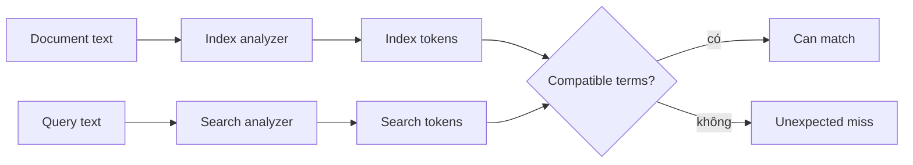
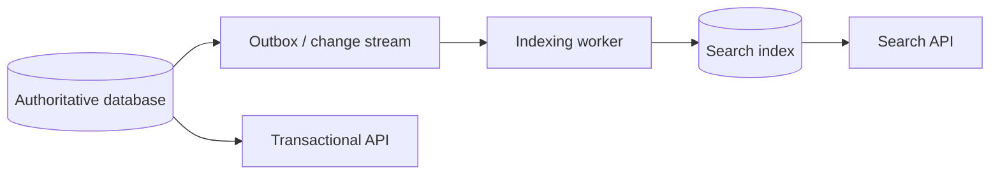

# Search Indexes: Suy luận về Analysis, Relevance và Freshness

## Tóm tắt

Search index là retrieval structure tối ưu cho câu hỏi kiểu “document nào chứa những concept này, thỏa filter này, và nên xếp hạng cao nhất cho query này?”. Nó không giống relational database index, và trong nhiều kiến trúc nó là **derived projection chứ không phải source of truth authoritative**.

Mental model:

```text
source document
  -> mapping chọn semantic của field
  -> analyzer biến text thành normalized token
  -> inverted index map term sang document phù hợp
  -> query text được analyze
  -> candidate document được retrieve và filter
  -> relevance scoring xếp hạng candidate còn lại
  -> refresh quyết định indexing work mới khi nào searchable
```


Vì vậy công việc kỹ thuật không phải chỉ “đưa JSON vào Elasticsearch”. Ta phải định nghĩa text semantics, freshness expectation, ranking behavior, update propagation và cách tiến hóa index an toàn.

## 1. Search index và database index giải hai retrieval problem khác nhau

Relational B-tree index thường giúp database tìm authoritative row hiệu quả cho predicate, ordering, join hoặc uniqueness enforcement.

Search index thường xây retrieval representation trên document field để user tìm human language, kết hợp filter và rank match theo relevance.

```text
relational index
  row value -> ordered/searchable access path tới authoritative table row

search index
  analyzed term + structured field -> candidate document ID + relevance signal
```

Từ **index** xuất hiện trong cả hai, nhưng data model và correctness question khác nhau.

Database index thường được database engine maintain transactionally cùng table. Một search engine riêng có thể được update bất đồng bộ từ source of truth khác, tạo ra freshness boundary rõ ràng.

## 2. Inverted index đảo chiều lookup

<TermBox term="Inverted index">
**Inverted index (chỉ mục đảo)** map searchable term sang những document chứa term đó, thường kèm thêm metadata như term frequency hoặc position.

Thay vì scan mọi document để hỏi “document này có `database` không?”, search có thể lookup term `database` rồi lấy posting list các document phù hợp.

**Vì sao quan trọng:** text search nhanh nhờ precompute reverse lookup này, nhưng thứ được đưa vào structure phụ thuộc analysis và mapping ở index time.
</TermBox>

Giả sử ba document chứa:

```text
d1: "distributed database systems"
d2: "database indexing"
d3: "distributed tracing"
```

Một inverted index đơn giản có thể là:

```text
distributed -> d1, d3
database    -> d1, d2
systems     -> d1
indexing    -> d2
tracing     -> d3
```

Search engine thật lưu metadata phong phú hơn nhiều, nhưng mental model này đủ để giải thích vì sao analysis sai có thể làm một document gần như vô hình với query.

## 3. Mapping quyết định một field có ý nghĩa gì

Trong Elasticsearch, mapping định nghĩa field type và vì vậy quyết định value được index/query như thế nào.

Hai string-like field type gặp liên tục:

### `text`

Một **text field (trường text)** được analyze cho full-text search. Human-readable content như product title hoặc article body thường được tokenize và normalize để query match theo word thay vì chỉ exact original string.

### `keyword`

Một **keyword field (trường keyword)** giữ structured value cho exact-style operation như term-level filter, sort và aggregation.

Ví dụ:

```text
title:       text
category_id: keyword
status:      keyword
sku:         keyword
brand_name:  text + keyword multi-field khi vừa cần search vừa cần exact aggregation
```

Failure phổ biến là map mọi thứ thành `text` vì “user sẽ search”, rồi exact filter/aggregation trở nên awkward. Failure ngược lại là map human-language content chỉ thành `keyword`, rồi mong natural full-text matching.

Elasticsearch multi-field cho phép một source string được index theo nhiều cách, ví dụ `text` cho search và `keyword` cho sort/aggregation.

## 4. Analysis biến language thành searchable term

<TermBox term="Analyzer">
**Analyzer (bộ phân tích)** chuyển text thành token khi indexing hoặc querying. Nó có thể tokenize input rồi áp dụng normalization như lowercase, stop-word handling, stemming hoặc token filter khác.

**Vì sao quan trọng:** inverted index chứa output của analyzer, không phải nguyên sentence như một search key opaque. Query analysis phải tạo compatible term nếu ta muốn match.
</TermBox>

Ví dụ:

```text
"Running Shoes for Developers"
```

Một analyzer đơn giản có thể tạo:

```text
running
shoes
for
developers
```

Analyzer khác có thể lowercase, bỏ common word, stem variant hoặc áp dụng language-specific rule.

Các lựa chọn đó định nghĩa recall và precision. Aggressive stemming có thể match nhiều variant hơn nhưng cũng collapse term user muốn phân biệt. Synonym có thể tăng recall nhưng thay đổi scoring và phrase behavior.

Hãy xem analyzer configuration là product search semantics, không chỉ infrastructure configuration.

## 5. Index-time và search-time analysis phải tương thích

Elasticsearch analyze `text` value khi document được index và analyze query string khi full-text search.

Trong đa số trường hợp, dùng cùng analyzer ở hai stage là lựa chọn đơn giản và an toàn nhất vì document/query được normalize thành compatible token.



Một `search_analyzer` khác biệt có thể có chủ đích cho autocomplete hoặc search-time synonym, nhưng phải được test như relevance decision chứ không nên thêm tùy tiện.

Elasticsearch cũng document rằng analyzer setting của existing mapped field không thể đơn giản đổi bằng update mapping API. Vì vậy analyzer evolution thường dẫn tới versioned-index/reindex workflow.

## 6. Full-text query và exact filter là hai intent khác nhau

`match query` analyze input và là standard full-text query cho analyzed text field.

Exact structured filter kiểu:

```text
status = "published"
category_id = "shoes"
country = "VN"
```

thường nên dùng keyword/numeric/date/boolean semantics thay vì language analysis.

Một search request tốt tách riêng:

```text
phải rank theo textual relevance
  title matches "running shoes"

phải exact eligible
  status = active
  tenant_id = t42
  inventory_region = vn-south
```

Đừng để security hoặc tenant isolation phụ thuộc fuzzy relevance logic. Authorization và exact eligibility filter là correctness boundary.

## 7. Relevance là ordering model, không phải truth

Search thường trả về nhiều candidate hợp lý. Ranking quyết định cái nào lên trước.

Elasticsearch dùng BM25 làm default text similarity. BM25 xét các signal như term occurrence và quan hệ document/field length để score lexical match.

Không cần thuộc công thức để reasoning đúng.

Mental model thực tế:

```text
candidate retrieval
  + textual relevance
  + exact filters
  + optional boost/business signal
  -> ordered result list
```

Relevance score là comparative ranking signal. Nó không phải xác suất document “đúng”, và score value không nên bị coi là business identifier ổn định qua mapping/query change.

Hãy evaluate ranking bằng representative query set và product metric thay vì một demo query nhìn đẹp.

## 8. Recall tốt hơn và precision tốt hơn thường kéo ngược chiều

**Recall** hỏi bao nhiêu relevant document đã được retrieve.

**Precision** hỏi bao nhiêu retrieved document thật sự relevant.

Ví dụ:

```text
thêm synonym / fuzziness -> có thể tăng recall, giảm precision
strict phrase matching   -> có thể tăng precision, miss useful variant
aggressive stemming      -> có thể join variant, merge meaning khác nhau
search nhiều field hơn   -> có thể thêm candidate, cũng thêm noise
```

Balance đúng phụ thuộc product. Search legal clause, e-commerce product, source code, support ticket và observability log có trade-off rất khác nhau.

## 9. Search visibility là near real-time, không nhất thiết immediate

<TermBox term="Refresh">
**Refresh** trong Elasticsearch ghi recent indexing-buffer content thành searchable segment mới và mở segment đó cho search.

Refresh làm operation kể từ refresh trước visible cho search. Nó nhẹ hơn full durable commit và là lý do Elasticsearch mô tả search visibility là **near real-time (NRT, gần thời gian thực)** chứ không strictly immediate.
</TermBox>

Elasticsearch periodically refresh index có search activity; behavior mặc định hiện tại thường khoảng một giây cho index đã nhận ít nhất một search trong 30 giây trước đó.

Vì vậy sequence này hoàn toàn có thể xảy ra:

```text
index document -> indexing request success
immediate search -> document chưa được trả về
later refresh -> document trở nên searchable
```

Đây không phải cùng một problem với async database-to-search propagation. Ngay cả sau khi Elasticsearch accept indexing operation, search visibility vẫn có refresh boundary riêng.

## 10. Đừng force refresh sau mọi write nếu chưa đo cost

Elasticsearch API có refresh control. `refresh=true` có thể force affected shard refresh ngay, còn `refresh=wait_for` chờ tới khi refresh làm change visible thay vì force refresh ngay lập tức.

Các option này hữu ích khi một workflow cụ thể cần read-after-index visibility.

Nhưng rule toàn cục “force refresh sau mọi write” có thể tạo nhiều small segment và làm cả indexing/search kém hiệu quả.

Hãy phân loại flow:

```text
ordinary catalog update -> near-real-time visibility chấp nhận được
admin publish rồi verify -> wait for visibility có thể hợp lý
bulk backfill -> throughput quan trọng hơn per-document immediate searchability
```

Freshness guarantee thuộc product workflow, không tự động thuộc mọi write.

## 11. Segment giải thích refresh-vs-throughput trade-off

Lucene index được cấu thành từ segment. New data có thể được ghi vào segment mới và trở nên searchable, còn background merge sau đó combine small segment.

Conceptually:

```text
indexing buffer
  -> refresh
  -> small searchable segment
  -> refresh nhiều tạo nhiều segment
  -> background merge consolidate segment
```

Refresh thường xuyên hơn có thể giảm search visibility delay nhưng tăng segment-management work. Refresh thưa hơn có thể giúp bulk indexing hiệu quả hơn nhưng tăng freshness latency.

Đây là lý do khác để đo freshness như SLO thay vì coi refresh interval là tuning knob tùy ý.

## 12. Search index riêng thường là derived projection

Kiến trúc phổ biến giữ transactional truth trong relational database rồi publish search-optimized document sang Elasticsearch.



Search document có thể denormalize field từ nhiều relational table:

```json
{
  "product_id": "p42",
  "title": "Running Shoes",
  "brand": "Atlas",
  "category": "footwear",
  "price": 990000,
  "in_stock": true
}
```

Document này rất tốt cho retrieval, nhưng duplicate fact tạo synchronization work.

Source-of-truth question phải rõ:

```text
Search result được stale bao lâu?
Database state nào reconstruct search document?
Failed indexing event retry thế nào?
Detect missing/duplicate projection ra sao?
Delete/tombstone propagate thế nào?
```

## 13. Search freshness có nhiều clock

Khi database authoritative và Elasticsearch downstream, user-visible stale result có thể sinh ra ở nhiều stage:

```text
T0 database transaction commit
T1 change event available
T2 indexing worker process event
T3 Elasticsearch acknowledge index/update
T4 refresh làm change searchable
T5 cache/CDN/client nhận fresh search response
```

Hãy đo stage product thật sự quan tâm.

“Consumer lag bằng 0” không chứng minh document searchable. “Index API latency thấp” không chứng minh source projection current. “Search cluster green” không chứng minh mọi database change đã tới.

End-to-end freshness evidence nên compare authoritative version/timestamp với thứ search thật sự trả về.

## 14. Ordering quan trọng khi cùng document đổi liên tục

Giả sử product `p42` đổi hai lần:

```text
v10: in_stock = false
v11: in_stock = true
```

Nếu async worker process v11 rồi delayed v10 overwrite sau đó, search projection trở nên stale dù mọi event cuối cùng đều delivered.

Defense hữu ích:

- mang theo monotonically increasing source version hoặc commit sequence;
- condition downstream update theo version ordering khi platform support;
- partition event stream theo entity để related change giữ order khi khả thi;
- làm indexing handler idempotent;
- reconcile projection định kỳ từ source of truth.

Exactly-once slogan ít hữu ích hơn việc chứng minh final projection không thể đi lùi.

## 15. Mapping/analyzer change thường cần reindex

Một số search semantic được encode khi token ghi vào index. Đổi analyzer về sau không retroactively transform already-indexed term.

Elasticsearch Reindex API copy document từ source index sang destination khác. Quan trọng: destination phải được configure trước; Reindex **không** tự copy mapping, shard count, replica hay setting khác từ source.

Một versioned workflow an toàn:

```text
products-v7 đang serve traffic
  -> create products-v8 với mapping/analyzer dự kiến
  -> backfill / reindex document
  -> catch up write thay đổi trong lúc backfill
  -> validate count, sample, freshness và ranking
  -> atomically move products-read alias sang v8
  -> giữ v7 ngắn hạn cho rollback
```

Cách này biến schema/analyzer evolution thành controlled data migration thay vì in-place surprise.

## 16. Alias swap tách logical name khỏi physical index version

Elasticsearch alias cho application dùng stable logical name trong khi physical index thay đổi.

Aliases API support nhiều action trong một atomic operation, nên có thể remove alias khỏi old index rồi add vào new index mà không có window application phải học physical name mới.

```text
application searches -> products-read

before: products-read -> products-v7
after:  products-read -> products-v8
```

Alias swap chỉ là final routing step. Nó không chứng minh new index đúng. Validation phải xong trước swap.

## 17. Reindex trong khi write tiếp tục cần catch-up plan

Long backfill race với production mutation.

Nếu copy old index trong 30 phút trong khi product tiếp tục đổi, destination có thể stale lúc cutover nếu new write không được capture.

Strategy phổ biến:

- rebuild từ authoritative database đồng thời consume change stream từ recorded high-water mark;
- dual-write/dual-index trong migration với explicit failure handling;
- tạm quiesce write cho dataset nhỏ nếu downtime chấp nhận được;
- chạy reconciliation pass thứ hai và verify source version trước cutover.

Đừng chọn dual-write tùy tiện. Hai independent write tạo partial-failure problem. Outbox/change-stream thường cho replayable boundary sạch hơn khi source database sở hữu transaction.

## 18. Shard distribute search work nhưng fan-out có cost

Elasticsearch index được chia thành shard. Query có thể execute trên nhiều shard rồi merge result.

Trade-off quen thuộc từ bài Partitioning & Sharding:

```text
thêm shard
  -> thêm cơ hội distribution / parallel capacity
  -> thêm per-shard metadata và coordination
  -> broad search có thể fan out tới nhiều nơi hơn
```

Đừng chọn shard count chỉ bằng slogan “GB mỗi shard” chung chung. Workload, growth, query shape, failure recovery và cluster topology đều quan trọng.

Routing có thể giới hạn related document/search vào shard được chọn khi access pattern cho phép, nhưng routing là locality contract: query không có routing key vẫn có thể cần fan-out rộng hơn.

## 19. Search index phải expose operational evidence riêng

Signal hữu ích gồm:

- indexing throughput và failure;
- indexing queue/backpressure;
- source-to-search freshness lag;
- refresh latency/rate;
- segment count và merge pressure;
- search p50/p95/p99 latency;
- rejected/timed-out search;
- query fan-out và shard hotspot;
- document count difference so với source of truth;
- ranking-quality metric cho representative query set.

Hãy tách **cluster health**, **data freshness** và **search quality**. Green cluster vẫn có thể trả stale hoặc poorly ranked result.

## 20. Tình huống production: analyzer evolution được ship như in-place change

Một e-commerce team index product name bằng generic analyzer. Sau đó họ thêm Vietnamese-specific stemming và synonym. Team đổi application query analysis trước rồi kỳ vọng existing indexed document match new token semantic ngay lập tức.

Đồng thời product update đi bất đồng bộ từ PostgreSQL sang Elasticsearch nhưng không có end-to-end freshness metric.

**Hậu quả:** một số search bất ngờ mất product, số khác trở nên quá rộng; price/stock mới xuất hiện không nhất quán; support gặp case “database đúng, search sai” nhưng không phân biệt được analysis bug và propagation lag.

**Nguyên nhân cốt lõi:** team coi analyzer configuration như query-only option và coi search index mặc định authoritative/current. Existing indexed term được sinh bởi old analyzer, còn async projection freshness không được đo.

**Cách khắc phục chuẩn:** tạo versioned destination index với intended mapping/analyzer, reindex/backfill từ authoritative source, capture concurrent change, evaluate representative query cùng source-to-search freshness, rồi atomically swap stable alias sau validation. Giữ khả năng rollback cho tới khi new index chứng minh ổn dưới production traffic.

## Tự kiểm tra: successful index request có đảm bảo immediate search visibility không?

Một API update product trong Elasticsearch và nhận successful response từ indexing operation. Ngay dòng code tiếp theo, application chạy normal search query cho product đó.

Application có thể giả định search chắc chắn trả new version chưa?

<details>
<summary>Xem giải thích chi tiết</summary>

Không. Elasticsearch search visibility là near-real-time và bị ngăn bởi refresh boundary. Successful indexing operation tự nó không có nghĩa normal search đã mở segment chứa change đó.

Nếu workflow thật sự cần search visibility trước khi tiếp tục, hãy dùng explicit freshness strategy như chờ refresh bằng request policy phù hợp, hoặc thiết kế workflow đọc authoritative source. Force `refresh=true` sau mọi write không phải correctness upgrade miễn phí; nó có thể làm indexing/search kém hiệu quả.

Cũng phải phân biệt refresh delay với upstream projection lag. Nếu authoritative database update chưa tới Elasticsearch, chờ refresh tiếp theo của Elasticsearch không sửa được missing event.
</details>

## Checklist production

- [ ] **Source of truth:** xác định search index authoritative hay rebuildable projection.
- [ ] **Field semantics:** map human-language field thành `text`; structured exact field dùng keyword/numeric/date/boolean type phù hợp.
- [ ] **Multi-fields:** dùng nhiều representation có chủ đích khi cùng value cần full-text search cộng sort/aggregation/exact filtering.
- [ ] **Analyzer contract:** test index-time/search-time analysis với language, synonym, punctuation, casing và morphology đại diện.
- [ ] **Exact boundaries:** giữ tenant/security/status eligibility trong exact filter thay vì relevance scoring.
- [ ] **Ranking evidence:** evaluate BM25/boost/query change bằng representative relevance case và product metric.
- [ ] **Refresh contract:** xác định flow nào chịu được NRT visibility và flow nào cần explicit wait/fallback.
- [ ] **Projection freshness:** đo database-commit-to-searchable latency end to end.
- [ ] **Ordering:** ngăn delayed older update overwrite newer search document.
- [ ] **Idempotency:** làm indexing/retry handler an toàn với duplicate delivery.
- [ ] **Deletes:** đảm bảo delete/tombstone event propagate và reconcile missing cleanup.
- [ ] **Reindex:** preconfigure destination mapping/settings trước khi copy document.
- [ ] **Catch-up:** xử lý source change xảy ra trong long backfill.
- [ ] **Alias cutover:** validate new index trước khi atomically move logical read alias.
- [ ] **Rollback:** giữ previous index/version đủ lâu để reverse bad cutover khi phù hợp.
- [ ] **Shard fan-out:** đo query breadth/hotspot thay vì giả định thêm shard luôn cải thiện search.
- [ ] **Operations:** monitor indexing failure, freshness lag, refresh/merge pressure, search latency, shard health và result-quality signal riêng biệt.

## Quy tắc cho agent

Khi đề xuất hoặc review search index, đừng dừng ở “dùng Elasticsearch cho full-text search”. Hãy nêu thứ gì authoritative, field được analyze/map thế nào, filter nào exact, ranking được evaluate ra sao, write khi nào trở thành searchable, source change propagate thế nào, và mapping/analyzer evolution được reindex/cutover ra sao. Xem freshness và relevance là product contract có measurable evidence.

## Nguồn tham khảo

- [Elastic Docs — Near real-time search](https://www.elastic.co/docs/manage-data/data-store/near-real-time-search)
- [Elastic Docs — Index and search analysis](https://www.elastic.co/docs/manage-data/data-store/text-analysis/index-search-analysis)
- [Elasticsearch Reference — `analyzer`](https://www.elastic.co/docs/reference/elasticsearch/mapping-reference/analyzer)
- [Elasticsearch Reference — `keyword` field type](https://www.elastic.co/docs/reference/elasticsearch/mapping-reference/keyword)
- [Elasticsearch Reference — Multi-fields](https://www.elastic.co/docs/reference/elasticsearch/mapping-reference/multi-fields)
- [Elasticsearch Reference — Match query](https://www.elastic.co/docs/reference/query-languages/query-dsl/query-dsl-match-query)
- [Elasticsearch Reference — Similarity / BM25](https://www.elastic.co/docs/reference/elasticsearch/mapping-reference/similarity)
- [Elasticsearch API — Reindex](https://www.elastic.co/docs/api/doc/elasticsearch/operation/operation-reindex)
- [Elastic Docs — Aliases](https://www.elastic.co/docs/manage-data/data-store/aliases)
- [Elasticsearch Reference — Refresh parameter](https://www.elastic.co/docs/reference/elasticsearch/rest-apis/refresh-parameter)

Bài này được phân loại **evolving** với chu kỳ review 180 ngày vì analyzer capability, mapping type, relevance tooling, near-real-time behavior và operational guidance tiếp tục thay đổi dù retrieval/freshness model cốt lõi khá bền vững.
