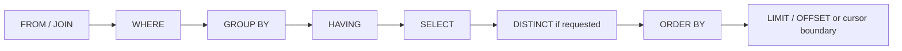
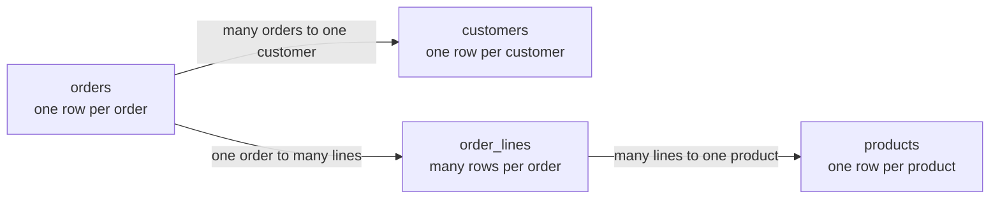
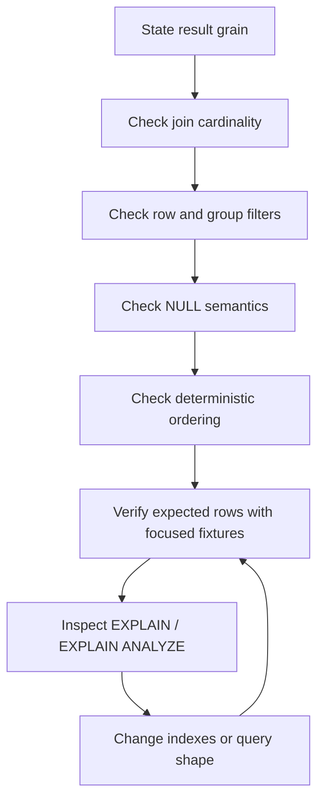

# SQL Querying: Ask Precise Questions of Relational Data

## TL;DR

A correct SQL query starts by defining the **result grain**: what one output row means. Only then decide how to join source relations, filter rows, aggregate groups, project columns, order results, and take a subset.

Use this reasoning sequence:

```text
state what one result row means
  -> identify source relations
  -> join without changing the grain accidentally
  -> filter source rows
  -> group only when the result grain requires it
  -> filter groups
  -> compute output expressions
  -> make ordering deterministic
  -> paginate from that ordering
  -> inspect the plan only after semantics are correct
```



The written order of a `SELECT` statement is not the same as its logical processing model. PostgreSQL 18 documents source construction before row filtering, grouping, output expressions, duplicate elimination, sorting, and limiting. That model explains many otherwise surprising SQL errors.

<TermBox term="Result grain">
The **result grain** is the meaning of one output row: one customer, one order, one order line, one day, one tenant-and-day pair, or another explicitly named unit.

**Why it matters:** joins and grouping can silently change how many rows represent the same business entity. If the intended grain is unclear, a query can look plausible while returning duplicated facts or incorrect aggregates.
</TermBox>

## 1. Start with the question, not the clauses

Before writing SQL, state the output in one sentence.

Examples:

```text
one row per active customer
one row per order placed this week
one row per tenant with its paid-order count
one row per product with revenue for the current month
```

Then name the columns that belong to that grain.

Suppose the requirement is:

> Return one row per paid order, including the customer email and the order total.

A direct query can preserve that grain:

```sql
SELECT
  o.id,
  o.placed_at,
  o.total_cents,
  c.email
FROM orders AS o
JOIN customers AS c ON c.id = o.customer_id
WHERE o.status = 'paid';
```

`orders` provides the one-row-per-order grain. Joining one customer for each order adds attributes without multiplying order rows.

Do not begin with `SELECT *` across every related table and reduce the result afterward. That reverses the reasoning: it creates an unknown row set first and asks correctness questions later.

## 2. `FROM` and `JOIN` construct the candidate row set

A join combines rows that satisfy a relationship condition. The important question is not only whether the join condition matches valid rows, but **how many rows on each side can match**.



Joining `orders` to `customers` normally preserves one row per order. Joining `orders` to `order_lines` changes the row grain to one row per matching order line unless you aggregate again.

For example:

```sql
SELECT
  o.id,
  o.total_cents,
  l.product_id
FROM orders AS o
JOIN order_lines AS l ON l.order_id = o.id;
```

An order with four lines now appears four times. That is not a SQL bug. It is the natural result of the relationship cardinality.

### Prefer explicit joins

Write relationship conditions where a reviewer can see them:

```sql
SELECT o.id, c.email
FROM orders AS o
JOIN customers AS c
  ON c.id = o.customer_id;
```

Avoid a cross join followed by an easy-to-miss predicate when an ordinary relationship join communicates the intent better.

### Put predicates on the boundary they actually describe

With outer joins, predicate placement can change semantics.

If the requirement is “all customers, plus their paid orders if any,” this preserves customers with no paid order:

```sql
SELECT c.id, o.id AS order_id
FROM customers AS c
LEFT JOIN orders AS o
  ON o.customer_id = c.id
 AND o.status = 'paid';
```

Moving `o.status = 'paid'` into `WHERE` removes rows where the right side is absent, effectively discarding customers without matching paid orders.

## 3. `WHERE` filters source rows before grouping

`WHERE` answers: **which candidate rows are allowed to participate?**

```sql
SELECT id, customer_id, total_cents
FROM orders
WHERE status = 'paid'
  AND placed_at >= DATE '2026-09-01';
```

Combine conditions deliberately. Parentheses make mixed `AND` / `OR` logic reviewable:

```sql
WHERE tenant_id = $1
  AND (
    status = 'paid'
    OR status = 'refunded'
  )
```

Without the parentheses, operator precedence can produce a result that crosses a tenant boundary or includes unintended rows.

Filtering is part of the query contract, not just a performance technique. First write the predicate that matches the business question. Then use indexes and query-plan evidence to make the correct predicate efficient.

## 4. `NULL` introduces three-valued logic

<TermBox term="Three-valued logic">
SQL conditions can evaluate to **true**, **false**, or **unknown**. Comparisons involving `NULL` usually produce unknown because `NULL` represents an absent or unknown value rather than an ordinary comparable value.

Rows pass a `WHERE` condition only when the condition is true; false and unknown are both filtered out.
</TermBox>

This is wrong:

```sql
WHERE shipped_at = NULL
```

Use:

```sql
WHERE shipped_at IS NULL
```

Ordinary equality is also not a null-safe comparison between two nullable expressions:

```sql
left_value = right_value
```

In PostgreSQL, `IS NOT DISTINCT FROM` provides equality-like behavior that treats two null values as comparable:

```sql
left_value IS NOT DISTINCT FROM right_value
```

Be explicit about whether `NULL` means unknown, not applicable, not yet assigned, or another state in the data model. A query cannot repair an ambiguous schema meaning after the fact.

### `NOT IN` deserves special care with nullable inputs

A nullable value inside a `NOT IN` set can make the predicate evaluate to unknown in cases developers often expect to be true. Prefer a null-aware formulation such as `NOT EXISTS` when the business rule is about absence of a matching row:

```sql
SELECT c.id
FROM customers AS c
WHERE NOT EXISTS (
  SELECT 1
  FROM blocked_customers AS b
  WHERE b.customer_id = c.id
);
```

## 5. `GROUP BY` changes the result grain

Grouping intentionally changes many input rows into one output row per group.

Requirement:

> Return one row per customer with the count and total value of paid orders.

```sql
SELECT
  customer_id,
  COUNT(*) AS paid_order_count,
  SUM(total_cents) AS paid_total_cents
FROM orders
WHERE status = 'paid'
GROUP BY customer_id;
```

The input grain is one row per order. The output grain is one row per customer.

This transition should be stated explicitly in code review because every selected non-aggregate expression must belong to the group identity or be otherwise valid under the database's grouping rules.

### `WHERE` filters rows; `HAVING` filters groups

Use `WHERE` for conditions that decide which source rows enter aggregation:

```sql
WHERE status = 'paid'
```

Use `HAVING` for conditions that depend on the aggregate result:

```sql
HAVING COUNT(*) >= 5
```

Complete example:

```sql
SELECT
  customer_id,
  COUNT(*) AS paid_order_count
FROM orders
WHERE status = 'paid'
GROUP BY customer_id
HAVING COUNT(*) >= 5;
```

Do not move row-level conditions into `HAVING` merely because the query already groups. Filtering earlier expresses the intended semantics and avoids making irrelevant rows participate in the grouping step.

## 6. `SELECT` shapes the output; `DISTINCT` is not a join repair tool

The select list chooses output expressions after the source rows and groups have been determined logically.

Prefer naming the contract explicitly:

```sql
SELECT
  o.id AS order_id,
  o.placed_at,
  o.total_cents
FROM orders AS o;
```

`SELECT *` can be reasonable for exploration, but application queries benefit from an explicit output shape because schema additions do not silently widen the payload.

`DISTINCT` removes duplicate output rows. It does not prove the join was correct.

Suspicious pattern:

```sql
SELECT DISTINCT c.id, c.email
FROM customers AS c
JOIN orders AS o ON o.customer_id = c.id
JOIN order_lines AS l ON l.order_id = o.id;
```

If the requirement is “customers who have at least one order line,” express existence directly:

```sql
SELECT c.id, c.email
FROM customers AS c
WHERE EXISTS (
  SELECT 1
  FROM orders AS o
  JOIN order_lines AS l ON l.order_id = o.id
  WHERE o.customer_id = c.id
);
```

The second query communicates that matching child rows are a condition, not part of the output grain.

## 7. Window functions add calculations without collapsing rows

Aggregates with `GROUP BY` collapse rows into groups. Window functions can calculate across related rows while preserving the current row set.

Example: rank orders within each customer while keeping one row per order:

```sql
SELECT
  id,
  customer_id,
  total_cents,
  ROW_NUMBER() OVER (
    PARTITION BY customer_id
    ORDER BY placed_at DESC, id DESC
  ) AS customer_order_rank
FROM orders;
```

PostgreSQL processes window functions after ordinary grouping and aggregation. If you need to filter on a window result, put the window calculation in a subquery or CTE and filter in the outer query:

```sql
WITH ranked_orders AS (
  SELECT
    id,
    customer_id,
    ROW_NUMBER() OVER (
      PARTITION BY customer_id
      ORDER BY placed_at DESC, id DESC
    ) AS position
  FROM orders
)
SELECT id, customer_id
FROM ranked_orders
WHERE position <= 3;
```

## 8. `ORDER BY` is part of correctness whenever order matters

Without `ORDER BY`, SQL does not promise a stable row order. The database may choose different scan, join, or parallel execution strategies over time.

If an API promises “newest orders first,” write that contract:

```sql
ORDER BY placed_at DESC, id DESC
```

The second key makes ties deterministic when multiple orders share the same timestamp.

PostgreSQL also lets you specify null placement explicitly when it matters:

```sql
ORDER BY reviewed_at DESC NULLS LAST, id DESC
```

Do not rely on current physical order, primary-key insertion patterns, or a plan that happened to return rows in a convenient sequence.

## 9. Pagination inherits the ordering contract

Offset pagination is easy to express:

```sql
SELECT id, placed_at, total_cents
FROM orders
WHERE tenant_id = $1
ORDER BY placed_at DESC, id DESC
LIMIT 50
OFFSET 500;
```

But a large `OFFSET` still requires the server to compute and skip preceding rows, and concurrent inserts can shift page boundaries between requests.

For feeds or large ordered collections, keyset pagination often maps better to the ordering contract.

First page:

```sql
SELECT id, placed_at, total_cents
FROM orders
WHERE tenant_id = $1
ORDER BY placed_at DESC, id DESC
LIMIT 50;
```

Next page after cursor `(last_placed_at, last_id)`:

```sql
SELECT id, placed_at, total_cents
FROM orders
WHERE tenant_id = $1
  AND (placed_at, id) < ($2, $3)
ORDER BY placed_at DESC, id DESC
LIMIT 50;
```

The cursor must encode enough ordering fields to resume from a unique boundary. A timestamp-only cursor is ambiguous when several rows share that timestamp.

Pagination is therefore not merely `LIMIT` syntax. It is an API contract built on deterministic ordering and a defined behavior under concurrent data changes.

## 10. Subqueries and CTEs make boundaries explicit

A subquery is useful when one stage needs to produce a relation that another stage consumes.

```sql
SELECT customer_id, paid_total_cents
FROM (
  SELECT
    customer_id,
    SUM(total_cents) AS paid_total_cents
  FROM orders
  WHERE status = 'paid'
  GROUP BY customer_id
) AS totals
WHERE paid_total_cents >= 100000;
```

A common table expression gives a name to that intermediate relation:

```sql
WITH paid_totals AS (
  SELECT
    customer_id,
    SUM(total_cents) AS paid_total_cents
  FROM orders
  WHERE status = 'paid'
  GROUP BY customer_id
)
SELECT customer_id, paid_total_cents
FROM paid_totals
WHERE paid_total_cents >= 100000;
```

Use CTEs to clarify stages, reuse a meaningful intermediate result, or support recursive/data-modifying forms when appropriate. Do not assume that rewriting a subquery as a CTE automatically makes the query faster. Query-plan behavior depends on the database and query shape.

## 11. Parameterize values; do not concatenate untrusted input into SQL

Keep query structure separate from runtime values.

Unsafe construction conceptually looks like:

```text
"... WHERE email = '" + userInput + "'"
```

Prefer driver-supported bind parameters:

```sql
SELECT id, email
FROM customers
WHERE tenant_id = $1
  AND email = $2;
```

Parameterization is a security boundary against SQL injection for data values and also preserves clearer type handling.

Identifiers such as table names, column names, or sort directions usually cannot be passed as ordinary value parameters. If product behavior permits dynamic identifiers, choose from an allowlisted set and generate only the known-safe fragment.

## 12. Prove semantics before tuning the plan

A fast wrong query is still wrong.

Use a correctness-first review loop:



Before opening `EXPLAIN`, answer:

```text
what does one output row mean?
which join can multiply that row?
which predicates run before grouping?
which predicates filter groups?
what does NULL mean in each nullable column?
is ordering unique when the consumer depends on sequence?
can pagination resume from an unambiguous boundary?
```

Then inspect the actual execution strategy in the companion lesson on database indexes and query plans.

## 13. Production scenario: a revenue report doubles money and skips orders

An analytics endpoint needs one row per order with the customer's email and captured revenue. The implementation joins `orders` to `payment_attempts` because it needs payment status:

```sql
SELECT DISTINCT
  o.id,
  o.placed_at,
  o.total_cents,
  c.email
FROM orders AS o
JOIN customers AS c ON c.id = o.customer_id
JOIN payment_attempts AS p ON p.order_id = o.id
WHERE p.status = 'captured'
ORDER BY o.placed_at DESC
LIMIT 100 OFFSET $1;
```

Some orders have multiple captured attempt records after provider reconciliation. A later version removes `DISTINCT` to expose another payment column, while a separate aggregate query sums `o.total_cents` across the multiplied join. Several orders also share the same `placed_at` timestamp.

**Impact:** the dashboard overstates revenue, exports contain duplicate orders, and users paging through the endpoint can see an order twice or miss one as equal timestamps move across offset boundaries.

**Root cause:** the query never declared its intended one-row-per-order grain. A one-to-many payment join silently multiplied orders, `DISTINCT` hid the symptom without establishing ownership of the selected payment fact, and the ordering lacked a unique tie-breaker. Offset pagination inherited that unstable order.

**Correct pattern:** define which payment fact belongs to one order in this report, reduce payment data to at most one row per order before joining or use an existence predicate when only presence matters, test aggregates against fixtures with multiple attempts, order by a unique tuple such as `(placed_at DESC, id DESC)`, and use a cursor containing the same ordering keys when stable continuation matters.

## 14. Review queries with small adversarial fixtures

Happy-path fixtures rarely expose SQL mistakes. Add rows that stress the semantics:

```text
parent with zero children
parent with one child
parent with several children
two rows with equal sort keys
nullable value on each side of a comparison
empty aggregate input
rows added between pagination requests
```

Check exact row identities and aggregate values, not only row counts.

For a query expected to return one row per customer, a test that says “returned 20 rows” is weak. A test that proves customer IDs are unique and totals match known source facts protects the intended grain.

## Self-check: where should the paid-order filter go?

You need one row per customer, including customers with zero paid orders, plus `paid_order_count`.

Which shape preserves the requirement?

```sql
-- A
SELECT c.id, COUNT(o.id)
FROM customers AS c
LEFT JOIN orders AS o ON o.customer_id = c.id
WHERE o.status = 'paid'
GROUP BY c.id;
```

```sql
-- B
SELECT c.id, COUNT(o.id)
FROM customers AS c
LEFT JOIN orders AS o
  ON o.customer_id = c.id
 AND o.status = 'paid'
GROUP BY c.id;
```

<details>
<summary>Show the reasoning</summary>

**B** preserves all customers. The status predicate is part of which order rows may match the optional right side of the left join.

In **A**, customers with no matching order receive a null-extended right side, then `WHERE o.status = 'paid'` rejects that row because the condition is not true. The query therefore loses customers with zero paid orders.

The general rule is to place a predicate where its meaning belongs, then verify the result grain with zero-, one-, and many-child fixtures.
</details>

## Production checklist

- [ ] **Result grain:** one output row has an explicit business meaning.
- [ ] **Join cardinality:** every join is reviewed for whether it preserves or multiplies that grain.
- [ ] **Outer-join predicates:** filters are placed in `ON` or `WHERE` according to the intended optional-row semantics.
- [ ] **Row filtering:** `WHERE` contains source-row conditions before grouping.
- [ ] **Group filtering:** `HAVING` is reserved for conditions on grouped/aggregate results.
- [ ] **NULL semantics:** nullable comparisons intentionally handle true, false, and unknown.
- [ ] **Projection:** application queries select the fields they actually promise rather than depending on incidental `*` expansion.
- [ ] **Duplicate handling:** `DISTINCT` is used because duplicate output rows are semantically duplicates, not to mask a multiplying join.
- [ ] **Ordering:** consumer-visible sequence uses an explicit and deterministic `ORDER BY`.
- [ ] **Pagination:** cursor or offset behavior is defined from the same ordering contract.
- [ ] **Composition:** subqueries and CTEs make semantic stages clearer rather than obscuring grain changes.
- [ ] **Parameterization:** runtime values use bind parameters; dynamic identifiers are allowlisted.
- [ ] **Adversarial fixtures:** tests include zero/many children, equal sort keys, nullable values, and pagination boundaries where relevant.
- [ ] **Optimization evidence:** indexes and query rewrites are evaluated only after the correct result is established, using `EXPLAIN` or `EXPLAIN ANALYZE` when appropriate.

## Agent rule

When writing or reviewing SQL, state the intended result grain before optimizing. For every join, say whether it preserves or multiplies that grain; separate row filters from group filters; reason explicitly about `NULL`; make consumer-visible ordering deterministic; parameterize runtime values; and do not use `DISTINCT`, indexes, or `EXPLAIN` to hide an unresolved correctness problem.

## Sources

- [PostgreSQL 18 — SELECT](https://www.postgresql.org/docs/18/sql-select.html)
- [PostgreSQL 18 — Table Expressions](https://www.postgresql.org/docs/18/queries-table-expressions.html)
- [PostgreSQL 18 — Comparison Functions and Operators](https://www.postgresql.org/docs/18/functions-comparison.html)
- [PostgreSQL 18 — Sorting Rows](https://www.postgresql.org/docs/18/queries-order.html)
- [PostgreSQL 18 — LIMIT and OFFSET](https://www.postgresql.org/docs/18/queries-limit.html)
- [PostgreSQL 18 — WITH Queries](https://www.postgresql.org/docs/18/queries-with.html)
- [PostgreSQL 18 — Window Functions](https://www.postgresql.org/docs/18/tutorial-window.html)
