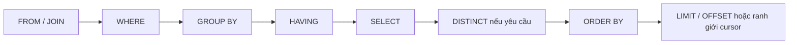
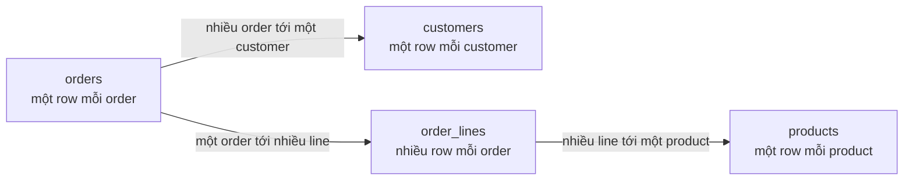
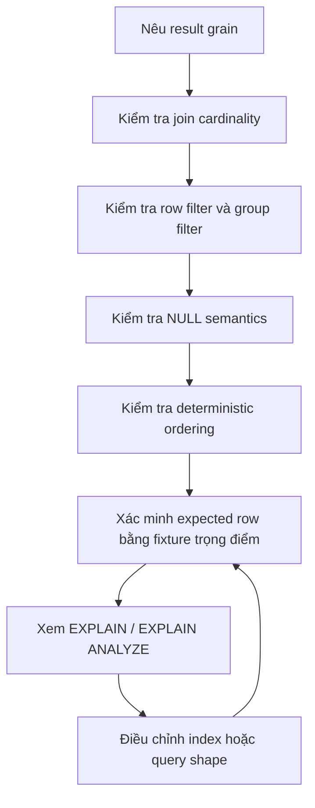

# Truy vấn SQL: Đặt Câu hỏi Chính xác cho Dữ liệu Quan hệ

## Tóm tắt

Một truy vấn SQL đúng bắt đầu bằng việc xác định **result grain**: một row đầu ra đại diện cho điều gì. Sau đó mới quyết định cách nối các relation nguồn, lọc row, gom nhóm, chọn cột, sắp xếp kết quả và lấy một phần dữ liệu.

Hãy suy luận theo thứ tự:

```text
nêu ý nghĩa của một row kết quả
  -> xác định các relation nguồn
  -> join mà không vô tình đổi grain
  -> lọc row nguồn
  -> chỉ group khi grain đầu ra yêu cầu
  -> lọc group
  -> tính output expression
  -> tạo thứ tự tất định
  -> paginate dựa trên thứ tự đó
  -> chỉ xem query plan sau khi semantics đã đúng
```



Thứ tự viết của một câu `SELECT` không giống hoàn toàn với mô hình xử lý logic. PostgreSQL 18 mô tả việc tạo nguồn dữ liệu trước khi lọc row, grouping, tính output expression, loại duplicate, sorting và limiting. Mental model này giải thích nhiều hành vi SQL tưởng như bất ngờ.

<TermBox term="Result grain">
**Result grain** là ý nghĩa của một row đầu ra: một customer, một order, một order line, một ngày, một cặp tenant-và-ngày, hoặc một đơn vị khác được gọi tên rõ ràng.

**Vì sao quan trọng:** join và grouping có thể âm thầm thay đổi số row đại diện cho cùng một entity nghiệp vụ. Nếu grain mục tiêu không rõ, query có thể trông hợp lý nhưng vẫn trả về duplicate hoặc aggregate sai.
</TermBox>

## 1. Bắt đầu từ câu hỏi, không phải từ các clause

Trước khi viết SQL, hãy mô tả output bằng một câu.

Ví dụ:

```text
một row cho mỗi customer đang hoạt động
một row cho mỗi order được tạo trong tuần này
một row cho mỗi tenant kèm số paid order
một row cho mỗi product kèm revenue của tháng hiện tại
```

Sau đó xác định những cột thuộc grain đó.

Giả sử yêu cầu là:

> Trả về một row cho mỗi paid order, kèm email của customer và tổng tiền order.

Một query trực tiếp có thể giữ nguyên grain:

```sql
SELECT
  o.id,
  o.placed_at,
  o.total_cents,
  c.email
FROM orders AS o
JOIN customers AS c ON c.id = o.customer_id
WHERE o.status = 'paid';
```

`orders` cung cấp grain một-row-mỗi-order. Join đúng một customer cho mỗi order chỉ bổ sung thuộc tính mà không nhân số order row.

Đừng bắt đầu bằng `SELECT *` trên mọi bảng liên quan rồi mới cố thu gọn kết quả. Cách đó đảo ngược quá trình suy luận: tạo một tập row chưa rõ nghĩa trước rồi mới hỏi xem nó có đúng hay không.

## 2. `FROM` và `JOIN` tạo tập row ứng viên

Join kết hợp những row thỏa điều kiện quan hệ. Câu hỏi quan trọng không chỉ là điều kiện join có match đúng row hay không, mà còn là **mỗi phía có thể match bao nhiêu row**.



Join `orders` với `customers` thường giữ grain một row mỗi order. Join `orders` với `order_lines` đổi grain thành một row mỗi order line match, trừ khi bạn aggregate lại.

Ví dụ:

```sql
SELECT
  o.id,
  o.total_cents,
  l.product_id
FROM orders AS o
JOIN order_lines AS l ON l.order_id = o.id;
```

Một order có bốn line giờ xuất hiện bốn lần. Đây không phải bug của SQL. Nó là kết quả tự nhiên của relationship cardinality.

### Ưu tiên join tường minh

Viết điều kiện quan hệ ở nơi reviewer nhìn thấy ngay:

```sql
SELECT o.id, c.email
FROM orders AS o
JOIN customers AS c
  ON c.id = o.customer_id;
```

Tránh tạo cross join rồi mới thêm predicate dễ bị bỏ sót khi một relationship join thông thường diễn đạt ý định rõ hơn.

### Đặt predicate đúng boundary mà nó mô tả

Với outer join, vị trí predicate có thể thay đổi semantics.

Nếu yêu cầu là “tất cả customer, kèm paid order nếu có”, query này giữ lại customer không có paid order:

```sql
SELECT c.id, o.id AS order_id
FROM customers AS c
LEFT JOIN orders AS o
  ON o.customer_id = c.id
 AND o.status = 'paid';
```

Nếu chuyển `o.status = 'paid'` xuống `WHERE`, các row không có phía phải sẽ bị loại, khiến customer không có paid order biến mất khỏi kết quả.

## 3. `WHERE` lọc row nguồn trước grouping

`WHERE` trả lời câu hỏi: **row ứng viên nào được phép tham gia?**

```sql
SELECT id, customer_id, total_cents
FROM orders
WHERE status = 'paid'
  AND placed_at >= DATE '2026-09-01';
```

Kết hợp điều kiện có chủ đích. Parentheses giúp logic `AND` / `OR` dễ review:

```sql
WHERE tenant_id = $1
  AND (
    status = 'paid'
    OR status = 'refunded'
  )
```

Thiếu parentheses có thể khiến precedence tạo ra tập kết quả vượt tenant boundary hoặc chứa row ngoài ý muốn.

Filtering là một phần của query contract, không chỉ là kỹ thuật performance. Trước tiên hãy viết predicate đúng với câu hỏi nghiệp vụ. Sau đó mới dùng index và query-plan evidence để làm predicate đúng đó chạy hiệu quả.

## 4. `NULL` tạo logic ba giá trị

<TermBox term="Logic ba giá trị">
Điều kiện SQL có thể cho ra **true**, **false** hoặc **unknown**. So sánh có `NULL` thường cho ra unknown vì `NULL` biểu diễn giá trị vắng mặt hoặc chưa biết, không phải một giá trị thông thường có thể so sánh trực tiếp.

Một row chỉ đi qua `WHERE` khi điều kiện là true; false và unknown đều bị loại.
</TermBox>

Cách này sai:

```sql
WHERE shipped_at = NULL
```

Hãy dùng:

```sql
WHERE shipped_at IS NULL
```

Equality thông thường cũng không phải phép so sánh null-safe giữa hai expression nullable:

```sql
left_value = right_value
```

Trong PostgreSQL, `IS NOT DISTINCT FROM` cung cấp hành vi gần equality nhưng coi hai giá trị null là có thể so sánh:

```sql
left_value IS NOT DISTINCT FROM right_value
```

Hãy xác định rõ `NULL` trong từng cột có nghĩa là chưa biết, không áp dụng, chưa được gán hay một trạng thái khác. Query không thể sửa một schema có semantics mơ hồ sau khi dữ liệu đã tồn tại.

### Cẩn thận với `NOT IN` khi input có thể nullable

Một giá trị nullable bên trong tập `NOT IN` có thể khiến predicate trả về unknown ở những trường hợp developer thường kỳ vọng là true. Khi business rule nói về việc không tồn tại row match, một dạng null-aware như `NOT EXISTS` thường rõ hơn:

```sql
SELECT c.id
FROM customers AS c
WHERE NOT EXISTS (
  SELECT 1
  FROM blocked_customers AS b
  WHERE b.customer_id = c.id
);
```

## 5. `GROUP BY` thay đổi result grain

Grouping chủ động biến nhiều input row thành một output row cho mỗi group.

Yêu cầu:

> Trả về một row cho mỗi customer với số lượng và tổng giá trị paid order.

```sql
SELECT
  customer_id,
  COUNT(*) AS paid_order_count,
  SUM(total_cents) AS paid_total_cents
FROM orders
WHERE status = 'paid'
GROUP BY customer_id;
```

Input grain là một row mỗi order. Output grain là một row mỗi customer.

Sự chuyển đổi này nên được nói rõ trong code review vì mọi non-aggregate expression trong `SELECT` phải thuộc group identity hoặc hợp lệ theo grouping rule của database.

### `WHERE` lọc row; `HAVING` lọc group

Dùng `WHERE` cho điều kiện quyết định source row nào được đưa vào aggregation:

```sql
WHERE status = 'paid'
```

Dùng `HAVING` cho điều kiện phụ thuộc kết quả aggregate:

```sql
HAVING COUNT(*) >= 5
```

Ví dụ hoàn chỉnh:

```sql
SELECT
  customer_id,
  COUNT(*) AS paid_order_count
FROM orders
WHERE status = 'paid'
GROUP BY customer_id
HAVING COUNT(*) >= 5;
```

Đừng chuyển row-level condition vào `HAVING` chỉ vì query đã có grouping. Lọc sớm đúng semantics và tránh để các row không liên quan tham gia grouping.

## 6. `SELECT` tạo output; `DISTINCT` không phải công cụ sửa join

Select list chọn output expression sau khi source row và group đã được xác định theo logic.

Nên mô tả contract một cách rõ ràng:

```sql
SELECT
  o.id AS order_id,
  o.placed_at,
  o.total_cents
FROM orders AS o;
```

`SELECT *` có thể tiện khi khám phá dữ liệu, nhưng application query nên có output shape tường minh để việc thêm cột vào schema không âm thầm mở rộng payload.

`DISTINCT` loại duplicate output row. Nó không chứng minh join là đúng.

Pattern đáng nghi:

```sql
SELECT DISTINCT c.id, c.email
FROM customers AS c
JOIN orders AS o ON o.customer_id = c.id
JOIN order_lines AS l ON l.order_id = o.id;
```

Nếu yêu cầu là “customer có ít nhất một order line”, hãy diễn đạt existence trực tiếp:

```sql
SELECT c.id, c.email
FROM customers AS c
WHERE EXISTS (
  SELECT 1
  FROM orders AS o
  JOIN order_lines AS l ON l.order_id = o.id
  WHERE o.customer_id = c.id
);
```

Query thứ hai nói rõ child row match là điều kiện tồn tại, không phải một phần của output grain.

## 7. Window function thêm phép tính mà không collapse row

Aggregate với `GROUP BY` collapse nhiều row thành group. Window function có thể tính trên các row liên quan nhưng vẫn giữ row set hiện tại.

Ví dụ: xếp hạng order trong từng customer mà vẫn giữ một row mỗi order:

```sql
SELECT
  id,
  customer_id,
  total_cents,
  ROW_NUMBER() OVER (
    PARTITION BY customer_id
    ORDER BY placed_at DESC, id DESC
  ) AS customer_order_rank
FROM orders;
```

PostgreSQL xử lý window function sau ordinary grouping và aggregation. Nếu cần filter theo kết quả window, hãy đặt phép tính window trong subquery hoặc CTE rồi filter ở query ngoài:

```sql
WITH ranked_orders AS (
  SELECT
    id,
    customer_id,
    ROW_NUMBER() OVER (
      PARTITION BY customer_id
      ORDER BY placed_at DESC, id DESC
    ) AS position
  FROM orders
)
SELECT id, customer_id
FROM ranked_orders
WHERE position <= 3;
```

## 8. `ORDER BY` là một phần của correctness khi thứ tự có ý nghĩa

Không có `ORDER BY`, SQL không hứa một row order ổn định. Database có thể chọn scan, join hoặc parallel execution khác nhau theo thời gian.

Nếu API cam kết “order mới nhất trước”, hãy viết contract đó:

```sql
ORDER BY placed_at DESC, id DESC
```

Key thứ hai làm tie trở nên tất định khi nhiều order có cùng timestamp.

PostgreSQL cũng cho phép xác định rõ vị trí null khi cần:

```sql
ORDER BY reviewed_at DESC NULLS LAST, id DESC
```

Đừng phụ thuộc vào physical order hiện tại, pattern tăng của primary key hay một plan tình cờ trả row theo thứ tự thuận tiện.

## 9. Pagination kế thừa ordering contract

Offset pagination dễ viết:

```sql
SELECT id, placed_at, total_cents
FROM orders
WHERE tenant_id = $1
ORDER BY placed_at DESC, id DESC
LIMIT 50
OFFSET 500;
```

Nhưng `OFFSET` lớn vẫn buộc server tính rồi bỏ qua các row trước đó, và insert đồng thời có thể làm dịch page boundary giữa các request.

Với feed hoặc ordered collection lớn, keyset pagination thường khớp ordering contract tốt hơn.

Trang đầu:

```sql
SELECT id, placed_at, total_cents
FROM orders
WHERE tenant_id = $1
ORDER BY placed_at DESC, id DESC
LIMIT 50;
```

Trang tiếp theo sau cursor `(last_placed_at, last_id)`:

```sql
SELECT id, placed_at, total_cents
FROM orders
WHERE tenant_id = $1
  AND (placed_at, id) < ($2, $3)
ORDER BY placed_at DESC, id DESC
LIMIT 50;
```

Cursor phải chứa đủ ordering field để resume từ một boundary duy nhất. Cursor chỉ chứa timestamp sẽ mơ hồ khi nhiều row có cùng timestamp.

Vì vậy pagination không chỉ là cú pháp `LIMIT`. Nó là API contract dựa trên deterministic ordering và hành vi được định nghĩa khi dữ liệu thay đổi đồng thời.

## 10. Subquery và CTE làm rõ các boundary xử lý

Truy vấn con hữu ích khi một stage cần tạo ra một relation để stage khác sử dụng.

```sql
SELECT customer_id, paid_total_cents
FROM (
  SELECT
    customer_id,
    SUM(total_cents) AS paid_total_cents
  FROM orders
  WHERE status = 'paid'
  GROUP BY customer_id
) AS totals
WHERE paid_total_cents >= 100000;
```

Common table expression đặt tên cho intermediate relation đó:

```sql
WITH paid_totals AS (
  SELECT
    customer_id,
    SUM(total_cents) AS paid_total_cents
  FROM orders
  WHERE status = 'paid'
  GROUP BY customer_id
)
SELECT customer_id, paid_total_cents
FROM paid_totals
WHERE paid_total_cents >= 100000;
```

Dùng CTE để làm rõ stage, tái sử dụng một intermediate result có ý nghĩa, hoặc hỗ trợ recursive/data-modifying form khi phù hợp. Đừng giả định đổi subquery thành CTE tự động làm query nhanh hơn. Query-plan behavior phụ thuộc database và query shape.

## 11. Tham số hóa value; không nối input không tin cậy vào SQL

Giữ query structure tách khỏi runtime value.

Cách xây dựng không an toàn về mặt ý tưởng:

```text
"... WHERE email = '" + userInput + "'"
```

Ưu tiên bind parameter do driver hỗ trợ:

```sql
SELECT id, email
FROM customers
WHERE tenant_id = $1
  AND email = $2;
```

Tham số hóa là một security boundary chống SQL injection cho data value và cũng giúp type handling rõ ràng hơn.

Identifier như table name, column name hoặc sort direction thường không thể truyền bằng ordinary value parameter. Nếu product cho phép identifier động, hãy chọn từ một allowlist đóng và chỉ tạo fragment đã biết là an toàn.

## 12. Chứng minh semantics trước khi tối ưu plan

Một query chạy nhanh nhưng sai vẫn là query sai.

Dùng vòng review ưu tiên correctness:



Trước khi mở `EXPLAIN`, hãy trả lời:

```text
một output row có nghĩa gì?
join nào có thể nhân row đó?
predicate nào chạy trước grouping?
predicate nào lọc group?
NULL có nghĩa gì trong từng nullable column?
ordering có unique khi consumer phụ thuộc sequence không?
pagination có resume từ một boundary không mơ hồ không?
```

Sau đó mới phân tích execution strategy thật trong bài companion về database index và query plan.

## 13. Tình huống production: báo cáo revenue nhân đôi tiền và bỏ sót order

Một analytics endpoint cần một row mỗi order cùng email customer và revenue đã capture. Implementation join `orders` với `payment_attempts` vì cần payment status:

```sql
SELECT DISTINCT
  o.id,
  o.placed_at,
  o.total_cents,
  c.email
FROM orders AS o
JOIN customers AS c ON c.id = o.customer_id
JOIN payment_attempts AS p ON p.order_id = o.id
WHERE p.status = 'captured'
ORDER BY o.placed_at DESC
LIMIT 100 OFFSET $1;
```

Một số order có nhiều captured attempt record sau quá trình reconciliation với provider. Phiên bản sau bỏ `DISTINCT` để lấy thêm payment column, trong khi một aggregate query khác cộng `o.total_cents` trên join đã bị nhân row. Nhiều order cũng có cùng `placed_at` timestamp.

**Hậu quả:** dashboard báo revenue cao hơn thực tế, export chứa duplicate order, và user paginate qua endpoint có thể thấy một order hai lần hoặc bỏ sót một order khi các timestamp bằng nhau dịch qua offset boundary.

**Nguyên nhân cốt lõi:** query không hề khai báo grain một-row-mỗi-order. One-to-many payment join âm thầm nhân order, `DISTINCT` chỉ che triệu chứng mà không xác định payment fact nào thuộc về mỗi order, và ordering thiếu unique tie-breaker. Offset pagination kế thừa thứ tự không ổn định đó.

**Cách khắc phục chuẩn:** xác định payment fact nào thuộc một order trong report, giảm payment data xuống tối đa một row mỗi order trước khi join hoặc dùng existence predicate nếu chỉ cần biết có tồn tại, test aggregate bằng fixture có nhiều attempt, order theo tuple duy nhất như `(placed_at DESC, id DESC)`, và dùng cursor chứa đúng các ordering key đó khi cần continuation ổn định.

## 14. Review query bằng fixture có chủ đích gây khó

Happy-path fixture hiếm khi lộ lỗi SQL. Hãy thêm các row kiểm tra semantics:

```text
parent không có child
parent có một child
parent có nhiều child
hai row có sort key bằng nhau
nullable value ở mỗi phía phép so sánh
aggregate input rỗng
row mới được thêm giữa hai pagination request
```

Kiểm tra chính xác row identity và aggregate value, không chỉ row count.

Nếu query phải trả một row mỗi customer, test chỉ nói “trả về 20 row” là yếu. Test chứng minh customer ID không duplicate và total khớp source fact mới thực sự bảo vệ grain mục tiêu.

## Tự kiểm tra: paid-order filter nên đặt ở đâu?

Bạn cần một row mỗi customer, kể cả customer có zero paid order, kèm `paid_order_count`.

Query nào giữ đúng yêu cầu?

```sql
-- A
SELECT c.id, COUNT(o.id)
FROM customers AS c
LEFT JOIN orders AS o ON o.customer_id = c.id
WHERE o.status = 'paid'
GROUP BY c.id;
```

```sql
-- B
SELECT c.id, COUNT(o.id)
FROM customers AS c
LEFT JOIN orders AS o
  ON o.customer_id = c.id
 AND o.status = 'paid'
GROUP BY c.id;
```

<details>
<summary>Xem giải thích chi tiết</summary>

**B** giữ lại mọi customer. Status predicate là một phần của điều kiện xác định order row nào được phép match phía phải tùy chọn của left join.

Trong **A**, customer không có matching order nhận phía phải được null-extend, rồi `WHERE o.status = 'paid'` loại row đó vì condition không phải true. Query vì vậy làm mất customer có zero paid order.

Quy tắc tổng quát là đặt predicate ở nơi semantics của nó thuộc về, sau đó xác minh result grain bằng fixture có zero, one và many child.
</details>

## Checklist production

- [ ] **Result grain:** một output row có ý nghĩa nghiệp vụ rõ ràng.
- [ ] **Join cardinality:** mọi join đều được review xem giữ nguyên hay nhân grain đó.
- [ ] **Outer-join predicate:** filter nằm trong `ON` hoặc `WHERE` theo đúng semantics của optional row.
- [ ] **Row filtering:** `WHERE` chứa điều kiện source-row trước grouping.
- [ ] **Group filtering:** `HAVING` chỉ dành cho điều kiện trên grouped/aggregate result.
- [ ] **NULL semantics:** nullable comparison xử lý có chủ đích true, false và unknown.
- [ ] **Projection:** application query chỉ chọn field thực sự cam kết thay vì phụ thuộc vào `*` mở rộng ngoài ý muốn.
- [ ] **Duplicate handling:** `DISTINCT` được dùng vì output row thực sự là duplicate về semantics, không phải để che multiplying join.
- [ ] **Ordering:** sequence mà consumer nhìn thấy có `ORDER BY` rõ ràng và tất định.
- [ ] **Pagination:** cursor hoặc offset behavior xuất phát từ cùng ordering contract.
- [ ] **Composition:** subquery và CTE làm semantic stage rõ hơn thay vì che grain change.
- [ ] **Tham số hóa:** runtime value dùng bind parameter; dynamic identifier được allowlist.
- [ ] **Fixture bất lợi:** test bao gồm zero/many child, equal sort key, nullable value và pagination boundary khi có liên quan.
- [ ] **Optimization evidence:** chỉ đánh giá index và query rewrite sau khi kết quả đúng đã được xác lập, dùng `EXPLAIN` hoặc `EXPLAIN ANALYZE` khi phù hợp.

## Quy tắc cho agent

Khi viết hoặc review SQL, hãy nêu result grain mục tiêu trước khi optimization. Với mỗi join, nói rõ nó giữ hay nhân grain; tách row filter khỏi group filter; suy luận tường minh về `NULL`; làm consumer-visible ordering tất định; tham số hóa runtime value; và không dùng `DISTINCT`, index hay `EXPLAIN` để che một correctness problem chưa được giải quyết.

## Nguồn tham khảo

- [PostgreSQL 18 — SELECT](https://www.postgresql.org/docs/18/sql-select.html)
- [PostgreSQL 18 — Table Expressions](https://www.postgresql.org/docs/18/queries-table-expressions.html)
- [PostgreSQL 18 — Comparison Functions and Operators](https://www.postgresql.org/docs/18/functions-comparison.html)
- [PostgreSQL 18 — Sorting Rows](https://www.postgresql.org/docs/18/queries-order.html)
- [PostgreSQL 18 — LIMIT and OFFSET](https://www.postgresql.org/docs/18/queries-limit.html)
- [PostgreSQL 18 — WITH Queries](https://www.postgresql.org/docs/18/queries-with.html)
- [PostgreSQL 18 — Window Functions](https://www.postgresql.org/docs/18/tutorial-window.html)
