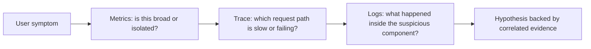
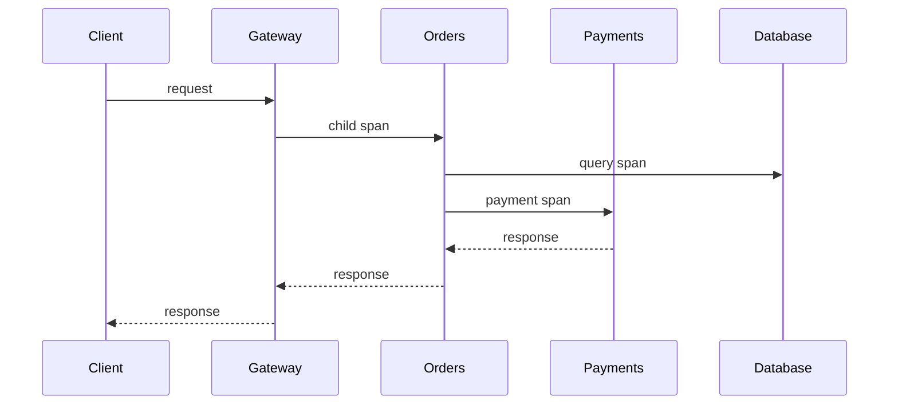
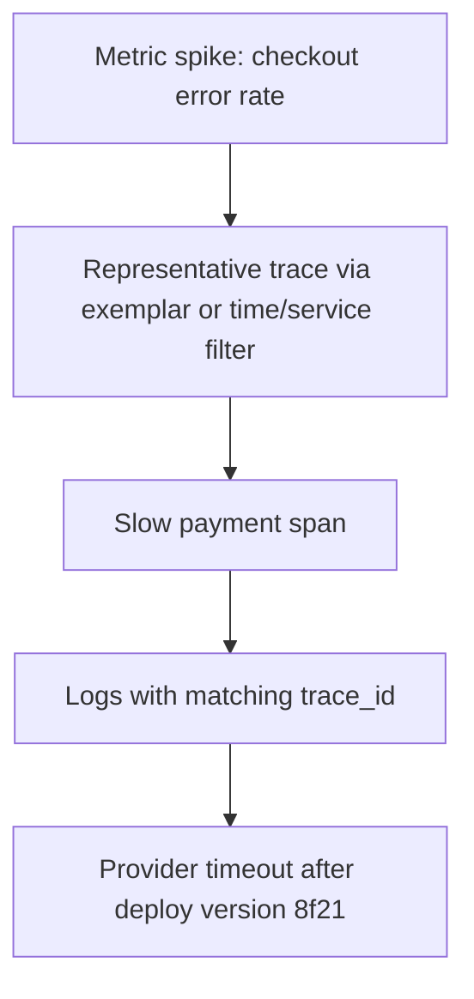

# Logs, Metrics & Traces: Diagnose Production with Correlated Evidence

## TL;DR

Observability is not “collect every signal.” It is the ability to move from a user-visible symptom to evidence that explains **where, when, and why** the system behaved that way.

Use the three core telemetry signals for different jobs:

- **Metrics** answer aggregate questions such as “Did error rate rise?” and “Which service is slow?”
- **Traces** reconstruct request causality across boundaries: “Where did this request spend time?”
- **Logs** provide event detail: “What did this component know when it made this decision?”

The signals become much more useful when they share stable resource attributes and correlation identifiers such as `trace_id`. Treat metric cardinality and trace sampling as explicit budgets, not accidental defaults.

## Start from a question, not a dashboard

A production investigation usually starts with a symptom:



You do not always follow this exact order. The stable principle is to use one signal to narrow the search space for the next.

<TermBox term="Observability">
**Observability** is the capability to understand a system's internal behavior from the telemetry it emits, including when the failure mode was not predicted in advance.

**Why it matters here:** dashboards that only confirm known failure modes are monitoring. A useful observability system also lets engineers ask new questions during an incident.
</TermBox>

## Metrics tell you what is changing at scale

Metrics aggregate numeric measurements over time. For request-serving systems, a practical starting point is the **RED** set:

- **Rate**: how much work is arriving?
- **Errors**: how much work is failing?
- **Duration**: how long does work take?

For resource-oriented systems, saturation signals such as queue depth, CPU pressure, connection-pool utilization, or memory pressure may be equally important.

Metrics are good for alerts and fleet-wide comparison because they are compact. They are poor at retaining every detail of an individual request.

### Cardinality is a design constraint

Every distinct combination of metric attributes can create another time series. A metric such as:

```text
http.server.request.duration{
  service="checkout",
  route="/orders/:id",
  method="GET",
  status_code="200"
}
```

has bounded dimensions. Adding `user_id`, raw URL paths, request IDs, or unbounded error messages can explode **cardinality**.

<TermBox term="Cardinality">
Metric **cardinality** is the number of distinct attribute combinations that create separate series.

**Why it matters here:** high-cardinality dimensions increase storage and query cost and can make the telemetry system itself unreliable. Put per-request identifiers in logs or traces, not ordinary metric labels.
</TermBox>

A useful metric attribute should have a bounded value space and support a concrete operational question.

## Traces tell you where one request went

A distributed trace models one request or unit of work as related spans. Each span describes an operation and its parent/child relationship.



A trace lets you see that total latency was 1.8 s and, for example, 1.4 s belonged to the payment dependency rather than the database.

### Preserve correlation context

A `trace_id` identifies the distributed trace. Propagating trace context across HTTP, RPC, queues, and background work allows independently emitted telemetry to be correlated.

When logs contain the active `trace_id`, you can pivot from a slow trace to the detailed logs produced during that same request. Resource attributes such as service name, deployment version, and environment should also be consistent across signals.

Do not generate a new unrelated trace identifier at every hop. Correlation depends on propagation, not merely on having an ID-shaped field.

## Logs tell you what a component knew

A log record is an event with context. Useful structured logs capture fields engineers can query consistently:

```text
ts=2026-09-10T05:00:00Z
level=error
service=payments
trace_id=7f4...
operation=authorize
provider=bank-a
error.type=timeout
retry_attempt=2
```

Avoid treating logs as prose dumps. A stable schema makes filtering and aggregation possible, while a short human-readable message can still help during local debugging.

Also avoid logging secrets, credentials, payment data, session tokens, or unnecessary personal data. Observability systems often replicate telemetry widely and retain it longer than application memory.

## Correlation is more valuable than duplication

The goal is not to copy every field into every signal.



Good correlation usually requires:

- consistent service/resource naming;
- propagated trace context;
- `trace_id` in structured logs when a trace context exists;
- deployment/version attributes so regressions can be tied to changes;
- timestamps with synchronized clocks;
- links or exemplars where the telemetry stack supports them.

## Sampling is a budget, not a truth filter

Recording and retaining every production trace can be too expensive. **Sampling** selects a subset.

Head sampling makes the decision near trace creation. It is simple and predictable, but the sampler may not yet know that the request will become slow or fail. Tail sampling makes a decision after more of the trace is observed, which can preserve interesting errors or latency outliers but requires additional collection infrastructure and buffering.

<TermBox term="Trace sampling">
**Trace sampling** reduces telemetry volume by retaining only a subset of trace data according to a defined policy.

**Why it matters here:** sampled data is evidence with known selection rules. A 1% sample cannot be interpreted as if it were a complete event ledger.
</TermBox>

Sampling policies should preserve the questions you need to answer. Common strategies combine a baseline probabilistic sample with preferential retention for errors, unusually slow requests, or selected critical flows.

## Operate with explicit telemetry budgets

An observability design should state what it is willing to spend and lose:

| Signal | Main operational value | Primary budget risk |
| --- | --- | --- |
| metrics | alerting, trends, comparison | cardinality explosion |
| traces | request causality and latency attribution | span volume and sampling bias |
| logs | detailed event context | ingestion volume, sensitive data, noisy schemas |

Budgets should be reviewed when traffic, tenant count, route count, or instrumentation changes. A harmless-looking new label can multiply metric series; an added span in a hot loop can multiply trace volume.

## Production scenario: checkout latency after a deployment

At 14:05, the checkout p95 latency alert fires. CPU and database utilization look normal. A deployment finished at 14:00.

**Impact:** about 12% of checkout requests exceed the latency objective, and a smaller subset times out. The issue affects only requests that invoke one payment provider.

**Root cause:** metrics show the latency increase is isolated to the payment path and started with one deployment version. Sampled traces show a new payment span dominates request duration. Logs with the same `trace_id` reveal the client is waiting on a provider timeout and then retrying. A new unbounded `customer_id` metric label also created a cardinality spike, increasing telemetry cost but not helping the diagnosis.

**Correct pattern:** keep low-cardinality RED metrics for service health, preserve deployment attributes, trace the cross-service request path, correlate logs with `trace_id`, remove unbounded identifiers from metric labels, and use a sampling policy that retains enough slow/error traces to investigate regressions. The investigation should move from symptom → narrowed scope → request causality → detailed event evidence.

The lesson is not “always start with metrics.” It is to build telemetry that allows fast pivots between aggregate behavior and request-level evidence.

## Self-check

Your API exposes `request_duration_seconds{user_id, route, status}` and emits logs without trace context. During an incident, you can see the error-rate spike but cannot find logs for the requests represented by a slow trace.

Before opening the answer, identify the two observability design mistakes.

<details>
<summary>Show the reasoning</summary>

First, `user_id` is an unbounded metric dimension and can cause a cardinality explosion. Metrics should normally use bounded attributes such as normalized route, status class, service, or region when those dimensions support an operational question.

Second, the logs are not correlated with the distributed trace. Propagate trace context and include the active `trace_id` in structured logs so engineers can pivot from a suspicious span to events from the same request.

</details>

## Production checklist

- [ ] Define the service questions each metric, log field, and span is meant to answer.
- [ ] Track request Rate, Errors, and Duration where they represent user-facing health.
- [ ] Keep metric attributes bounded; review cardinality before adding new dimensions.
- [ ] Propagate trace context across service and asynchronous boundaries.
- [ ] Include `trace_id` in structured logs when trace context is available.
- [ ] Attach stable resource attributes such as service, environment, and deployment version.
- [ ] Define trace sampling rules and know which classes of traffic they may miss.
- [ ] Protect secrets and sensitive data from telemetry pipelines.
- [ ] Observe the telemetry pipeline itself: dropped data, exporter failures, queue pressure, and ingestion cost.

## Agent rule

When diagnosing a production symptom, do not infer root cause from one dashboard panel. State the symptom, use aggregate signals to narrow scope, inspect representative request causality, correlate detailed events with `trace_id`, and distinguish **observed evidence** from hypotheses.

## References

- OpenTelemetry, **Signals**: https://opentelemetry.io/docs/concepts/signals/
- OpenTelemetry, **Observability primer**: https://opentelemetry.io/docs/concepts/observability-primer/
- OpenTelemetry, **Sampling**: https://opentelemetry.io/docs/concepts/sampling/
- OpenTelemetry Specification, **Metrics**: https://opentelemetry.io/docs/specs/otel/metrics/
- OpenTelemetry, **Metrics cardinality**: https://opentelemetry.io/docs/zero-code/obi/cardinality/
