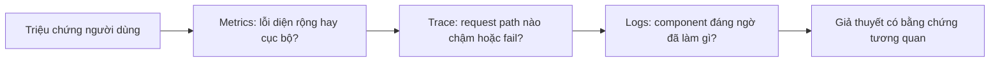
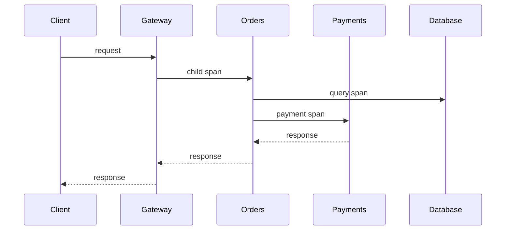
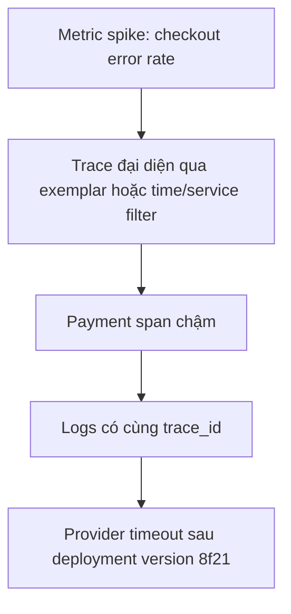

# Logs, Metrics & Traces: Chẩn đoán production bằng bằng chứng tương quan

## Tóm tắt

Observability không có nghĩa là “thu thập mọi tín hiệu”. Mục tiêu là đi từ một triệu chứng người dùng nhìn thấy đến bằng chứng giải thích được hệ thống đã sai ở **đâu, khi nào và vì sao**.

Ba tín hiệu telemetry cốt lõi có vai trò khác nhau:

- **Metrics** trả lời câu hỏi tổng hợp như “error rate có tăng không?” và “service nào đang chậm?”.
- **Traces** dựng lại quan hệ nhân quả của request xuyên qua nhiều boundary: “request này tốn thời gian ở đâu?”.
- **Logs** cho chi tiết sự kiện: “component này biết gì khi nó đưa ra quyết định?”.

Các tín hiệu hữu ích hơn nhiều khi dùng chung resource attributes ổn định và correlation identifiers như `trace_id`. Hãy coi metric cardinality và trace sampling là budget có chủ đích, không phải mặc định ngẫu nhiên.

## Bắt đầu từ câu hỏi, không phải dashboard

Một production investigation thường bắt đầu bằng triệu chứng:



Không phải lúc nào cũng đi theo đúng thứ tự này. Nguyên tắc ổn định là dùng một tín hiệu để thu hẹp không gian tìm kiếm cho tín hiệu kế tiếp.

<TermBox term="Observability">
**Observability** là khả năng hiểu hành vi bên trong của hệ thống thông qua telemetry mà nó phát ra, kể cả khi failure mode chưa được dự đoán trước.

**Tại sao quan trọng:** dashboard chỉ xác nhận các lỗi đã biết là monitoring. Một hệ observability hữu ích còn cho phép kỹ sư đặt câu hỏi mới trong lúc incident đang diễn ra.
</TermBox>

## Metrics cho biết điều gì đang thay đổi ở quy mô lớn

Metrics tổng hợp phép đo số theo thời gian. Với request-serving system, điểm bắt đầu thực dụng là bộ **RED**:

- **Rate**: có bao nhiêu work đang đến?
- **Errors**: bao nhiêu work đang fail?
- **Duration**: work mất bao lâu?

Với hệ thống thiên về tài nguyên, saturation như queue depth, CPU pressure, connection-pool utilization hoặc memory pressure cũng quan trọng.

Metrics tốt cho alert và so sánh toàn fleet vì gọn. Nhưng chúng không giữ đầy đủ chi tiết của từng request riêng lẻ.

### Cardinality là một ràng buộc thiết kế

Mỗi tổ hợp metric attributes khác nhau có thể tạo thêm một time series. Ví dụ:

```text
http.server.request.duration{
  service="checkout",
  route="/orders/:id",
  method="GET",
  status_code="200"
}
```

có các dimension tương đối bounded. Nếu thêm `user_id`, raw URL path, request ID hoặc error message không giới hạn, **cardinality** có thể bùng nổ.

<TermBox term="Cardinality">
Metric **cardinality** là số lượng tổ hợp attribute khác nhau tạo thành các series riêng biệt.

**Tại sao quan trọng:** cardinality cao làm tăng storage/query cost và có thể khiến chính telemetry system trở nên thiếu ổn định. Per-request identifier nên nằm trong logs hoặc traces, không phải metric labels thông thường.
</TermBox>

Một metric attribute tốt nên có value space hữu hạn và phục vụ một operational question cụ thể.

## Traces cho biết một request đã đi qua đâu

Distributed trace biểu diễn một request hoặc unit of work bằng các span có quan hệ với nhau. Mỗi span mô tả một operation và quan hệ parent/child.



Trace giúp bạn thấy tổng latency là 1.8 giây và, ví dụ, 1.4 giây nằm ở payment dependency thay vì database.

### Giữ correlation context xuyên boundary

`trace_id` định danh distributed trace. Propagate trace context qua HTTP, RPC, queues và background work giúp các telemetry record phát ra độc lập vẫn có thể tương quan.

Khi logs chứa `trace_id` đang active, bạn có thể pivot từ một slow trace sang các log chi tiết phát sinh trong cùng request. Resource attributes như service name, deployment version và environment cũng nên nhất quán giữa các signal.

Đừng tạo một trace identifier mới không liên quan ở mỗi hop. Correlation phụ thuộc vào propagation, không chỉ vào việc có một field trông giống ID.

## Logs cho biết component đã biết gì

Log record là một event có context. Structured logs hữu ích nên có các field có thể query ổn định:

```text
ts=2026-09-10T05:00:00Z
level=error
service=payments
trace_id=7f4...
operation=authorize
provider=bank-a
error.type=timeout
retry_attempt=2
```

Đừng biến logs thành các đoạn prose khó query. Schema ổn định giúp filter và aggregate; một message ngắn dễ đọc vẫn có thể hữu ích khi debug local.

Cũng không nên log secrets, credentials, payment data, session tokens hay personal data không cần thiết. Telemetry thường được replicate rộng và giữ lâu hơn application memory.

## Correlation đáng giá hơn duplication

Mục tiêu không phải copy mọi field vào mọi signal.



Correlation tốt thường cần:

- service/resource naming nhất quán;
- propagated trace context;
- `trace_id` trong structured logs khi có trace context;
- deployment/version attributes để gắn regression với thay đổi;
- timestamp với clock được đồng bộ;
- links hoặc exemplars nếu telemetry stack hỗ trợ.

## Sampling là budget, không phải bộ lọc chân lý

Ghi và lưu mọi production trace có thể quá đắt. **Sampling** chọn một tập con.

Head sampling quyết định gần lúc trace được tạo. Nó đơn giản và dễ dự đoán, nhưng sampler có thể chưa biết request sau đó sẽ chậm hoặc fail. Tail sampling quyết định sau khi đã quan sát thêm trace, nên có thể giữ các error hoặc latency outlier thú vị, nhưng cần thêm collector infrastructure và buffering.

<TermBox term="Trace sampling">
**Trace sampling** giảm telemetry volume bằng cách chỉ giữ một tập con trace data theo policy xác định.

**Tại sao quan trọng:** sampled data là bằng chứng chịu ảnh hưởng của selection rule. Sample 1% không thể được đọc như một event ledger đầy đủ.
</TermBox>

Sampling policy phải bảo toàn những câu hỏi bạn cần trả lời. Một chiến lược phổ biến là baseline probabilistic sample cộng với ưu tiên giữ error, unusually slow request hoặc critical flow.

## Vận hành với telemetry budget rõ ràng

Một observability design nên nói rõ hệ thống chấp nhận tốn và mất gì:

| Signal | Giá trị vận hành chính | Rủi ro budget chính |
| --- | --- | --- |
| metrics | alerting, trends, comparison | cardinality explosion |
| traces | request causality và latency attribution | span volume và sampling bias |
| logs | event context chi tiết | ingestion volume, sensitive data, schema nhiễu |

Budget cần được review khi traffic, số tenant, route count hoặc instrumentation thay đổi. Một label mới tưởng vô hại có thể nhân số metric series; một span mới trong hot loop có thể nhân trace volume.

## Production scenario: checkout chậm sau deployment

Lúc 14:05, alert checkout p95 latency bật lên. CPU và database utilization vẫn bình thường. Một deployment vừa xong lúc 14:00.

**Hậu quả:** khoảng 12% checkout request vượt latency objective, và một phần nhỏ timeout. Vấn đề chỉ ảnh hưởng các request gọi một payment provider cụ thể.

**Nguyên nhân cốt lõi:** metrics cho thấy latency tăng chỉ ở payment path và bắt đầu cùng một deployment version. Sampled traces cho thấy một payment span mới chiếm phần lớn request duration. Logs có cùng `trace_id` cho thấy client đang chờ provider timeout rồi retry. Một metric label `customer_id` mới không bounded cũng tạo cardinality spike, tăng telemetry cost nhưng không giúp chẩn đoán.

**Cách khắc phục chuẩn:** giữ low-cardinality RED metrics cho service health, lưu deployment attributes, trace request path xuyên service, correlate logs bằng `trace_id`, loại unbounded identifiers khỏi metric labels, và dùng sampling policy đủ giữ các slow/error trace để điều tra regression. Investigation nên đi theo symptom → narrowed scope → request causality → detailed event evidence.

Bài học không phải “luôn bắt đầu bằng metrics”. Bài học là xây telemetry cho phép pivot nhanh giữa aggregate behavior và request-level evidence.

## Tự kiểm tra

API của bạn expose `request_duration_seconds{user_id, route, status}` và emit logs không có trace context. Trong incident, bạn thấy error-rate spike nhưng không tìm được log cho các request thuộc slow trace.

Trước khi mở đáp án, hãy chỉ ra hai lỗi thiết kế observability.

<details>
<summary>Xem lập luận</summary>

Thứ nhất, `user_id` là metric dimension không bounded và có thể gây cardinality explosion. Metrics thường nên dùng bounded attributes như normalized route, status class, service hoặc region khi các dimension đó phục vụ operational question.

Thứ hai, logs không correlate với distributed trace. Hãy propagate trace context và đưa `trace_id` đang active vào structured logs để kỹ sư có thể pivot từ suspicious span sang event của cùng request.

</details>

## Checklist production

- [ ] Xác định câu hỏi vận hành mà mỗi metric, log field và span cần trả lời.
- [ ] Theo dõi request Rate, Errors và Duration khi chúng đại diện cho user-facing health.
- [ ] Giữ metric attributes bounded; review cardinality trước khi thêm dimension mới.
- [ ] Propagate trace context qua service và asynchronous boundaries.
- [ ] Đưa `trace_id` vào structured logs khi có trace context.
- [ ] Gắn resource attributes ổn định như service, environment và deployment version.
- [ ] Định nghĩa trace sampling rules và hiểu traffic class nào có thể bị bỏ lỡ.
- [ ] Bảo vệ secrets và sensitive data khỏi telemetry pipelines.
- [ ] Quan sát chính telemetry pipeline: dropped data, exporter failures, queue pressure và ingestion cost.

## Agent rule

Khi chẩn đoán production symptom, đừng suy root cause từ một dashboard panel. Hãy nêu symptom, dùng aggregate signals để thu hẹp scope, kiểm tra request causality đại diện, correlate detailed events bằng `trace_id`, và phân biệt rõ **bằng chứng quan sát được** với giả thuyết.

## Tài liệu tham khảo

- OpenTelemetry, **Signals**: https://opentelemetry.io/docs/concepts/signals/
- OpenTelemetry, **Observability primer**: https://opentelemetry.io/docs/concepts/observability-primer/
- OpenTelemetry, **Sampling**: https://opentelemetry.io/docs/concepts/sampling/
- OpenTelemetry Specification, **Metrics**: https://opentelemetry.io/docs/specs/otel/metrics/
- OpenTelemetry, **Metrics cardinality**: https://opentelemetry.io/docs/zero-code/obi/cardinality/
