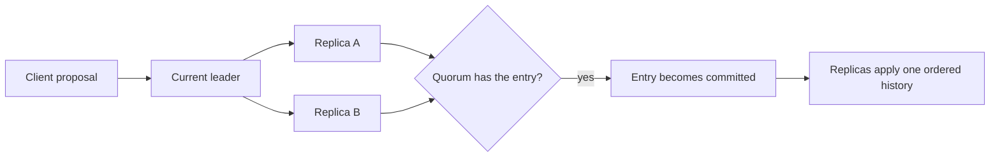
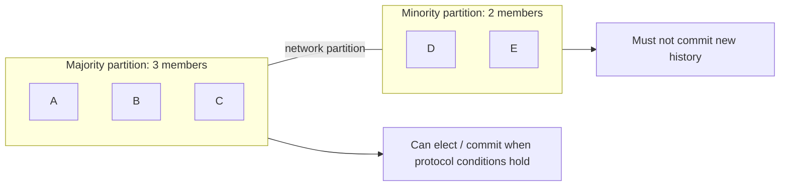

# Consensus: Agree on One Committed History Through Failure

## TL;DR

Consensus is the problem of making independent nodes **agree on one value or ordered history even when messages are delayed and some nodes fail**.

At recognition depth, keep five ideas straight:

- **replication is not consensus**: having copies does not prove that nodes agreed on which history is authoritative;
- a consensus group normally requires a **quorum**, commonly a majority, before a decision becomes committed;
- leader-based protocols such as Raft use **leader election**, terms, and a replicated log to organize agreement;
- a network partition may leave one side with enough votes to continue while the minority must stop committing new work;
- if the group loses quorum, preserving safety means giving up progress until enough members can communicate again.



<TermBox term="Quorum">
A **quorum** is the minimum voting set a protocol requires before it treats a decision as accepted or committed.

In a simple majority system, a 3-member group needs 2 votes and a 5-member group needs 3. The deeper reason is not the arithmetic by itself: valid quorums are chosen so they **overlap**, creating quorum intersection that prevents two independent majorities from safely committing conflicting histories at the same logical position.
</TermBox>

## Replication is not consensus

Replication answers: **how do multiple nodes obtain copies of state?**

Consensus answers: **how do those nodes agree on which value, leader, or ordered history is authoritative?**

A primary can asynchronously copy data to followers without running a consensus protocol for every commit. A leaderless store can replicate values and reconcile them later. Conversely, a replicated state machine often combines both ideas: consensus decides which log entries are committed, then replication carries those entries to members.

So these statements are unsafe shortcuts:

```text
three replicas -> consensus happened
quorum reads/writes -> one linearizable consensus history
leader exists -> leader still has authority
```

Consensus is about the **agreement rule**, not the mere presence of copies or a node called “leader.”

## Safety and liveness pull in different directions

Two words help classify what a consensus system is trying to preserve:

- **Safety:** nothing bad happens. Two correct participants do not commit incompatible decisions for the same position.
- **Liveness:** something good eventually happens. New proposals eventually commit when the assumptions required for progress hold.

Under a hard partition, a protocol may deliberately sacrifice liveness on the minority side to preserve safety. Refusing writes can be the correct result.

This is the same systems habit used in earlier lessons: a timeout or unreachable peer does not prove a peer is dead. Consensus protocols therefore need voting and history rules that remain safe when failure detection is imperfect.

<TermBox term="Term / epoch">
A **term** or **epoch** is a monotonically advancing logical generation used to distinguish an older authority from a newer one.

Raft calls this a term. Other systems may use epochs, ballot numbers, or similar generations. The names differ, but the purpose is related: stale authority must not outrank a newer decision.
</TermBox>

## Leader election establishes current authority

Leader-based consensus protocols usually organize time into logical generations. In Raft, a node may become a candidate, ask peers for votes, and become leader only after winning the required election quorum.

```mermaid
sequenceDiagram
  participant A as Node A
  participant B as Node B
  participant C as Node C

  A->>A: election timeout; start term 12
  A->>B: request vote for term 12
  A->>C: request vote for term 12
  B-->>A: vote granted
  C-->>A: vote granted
  A->>A: quorum reached; become leader
  A-->>B: heartbeat / log replication
  A-->>C: heartbeat / log replication
```

A node remembering that it *used to be leader* is not enough. Its authority depends on the protocol's current term and quorum rules.

Leader election is only one part of consensus. The harder safety question is what happens to history before, during, and after leadership changes.

## A replicated log separates proposed from committed

Raft is a consensus algorithm for managing a **replicated log**. A leader orders proposed commands into log entries and sends them to followers. An entry being present on one or more nodes does not automatically make it committed.

The **commit boundary** matters:

1. a client sends a proposal;
2. the leader appends an entry locally;
3. followers replicate the entry;
4. the protocol observes the required quorum condition;
5. the entry becomes committed under the protocol's rules;
6. replicas apply committed entries to their state machines in order.

An **uncommitted** entry may disappear or be overwritten after a leadership change. A client or operator must not equate “I saw it in a node's log” with “the cluster committed it.”

Current etcd failure documentation illustrates this boundary: after leader failure, previously sent but uncommitted writes may be lost, while committed writes are preserved by the consensus rules.

## Quorum intersection is why two majorities cannot be disjoint

For a simple majority quorum, any two valid majorities share at least one member.

With five members:

```text
quorum A = {1, 2, 3}
quorum B = {3, 4, 5}
intersection = {3}
```

That overlap lets the protocol carry safety information from one decision to the next. Real consensus proofs include more conditions than this one observation, but quorum intersection is the core shape to recognize.

Odd-sized groups are common because an even-sized group often increases cost without increasing simple majority failure tolerance:

| Members | Majority | Permanent member failures tolerated before quorum is lost |
| ---: | ---: | ---: |
| 3 | 2 | 1 |
| 4 | 3 | 1 |
| 5 | 3 | 2 |
| 6 | 4 | 2 |
| 7 | 4 | 3 |

That does **not** mean “always use five” or “more members are free.” Wider groups add replication, disk, and network work to the consensus path.

## A network partition creates a majority side and a minority side

Consider a 5-member consensus group split by a network partition into groups of 3 and 2.



The minority may still be alive, have disks, and serve process health checks. It simply lacks the votes required to establish a new committed history safely.

If the entire cluster loses quorum, writes that require consensus must stop. etcd documents this directly: majority loss means the cluster cannot accept new writes until quorum is restored or disaster recovery deliberately forms a new cluster from a trusted recovery point.

This is why “force the isolated node to keep serving writes” is usually a dangerous availability shortcut rather than a harmless operational tweak.

## Consensus has a failure model

Classic Raft and Paxos-style consensus are normally discussed under **crash fault / crash failure** and network delay assumptions: nodes can stop, restart, or become unreachable, but the protocol is not designed to make arbitrary malicious participants safe by itself.

A **Byzantine** participant can lie, equivocate, or send different fabricated information to different peers. Byzantine fault-tolerant protocols require different assumptions and mechanisms.

Do not upgrade a guarantee by vocabulary. Saying “we use Raft” does not imply Byzantine fault tolerance, immunity to software bugs, correct business logic, or protection from correlated operator mistakes.

## Consensus has physical latency costs

Agreement is coordination, and coordination crosses machines.

Current etcd documentation describes consensus commit latency as constrained by network round-trip time and durable disk I/O. A wide-area quorum can improve failure-domain separation, but it also puts more network latency on the path that establishes agreement.

That gives a practical design tension:

```text
wider failure-domain placement
  -> potentially better survival of local failures
  -> usually higher consensus latency
  -> stricter need to understand quorum placement
```

Consensus is therefore best reserved for state that genuinely needs one authoritative decision path: cluster membership, leader ownership, metadata, coordination records, strongly ordered state-machine commands, and similar control state.

## Consensus does not make every business effect exactly once

A consensus group can decide that log entry 184 is committed exactly once in its own history. That does not automatically make an external email, payment charge, webhook, or database write happen exactly once.

The moment a committed command triggers effects outside the consensus state machine, **Delivery Semantics**, idempotency, transactions, and reconciliation become relevant again.

Keep these boundaries separate:

- consensus decides authoritative history inside its scope;
- replication distributes that state;
- consistency describes what observers may see;
- delivery semantics describes repeated or missed message processing;
- business correctness depends on how effects cross those boundaries.

## Production scenario: an isolated old leader keeps accepting configuration writes

A control-plane service stores routing configuration in a 5-member consensus group. A network failure isolates two members, including the old leader, from the other three.

The three-member side elects a new leader and continues committing configuration changes. The isolated old leader is still reachable from one internal admin tool, and a custom “availability fallback” allows that tool to write directly to the old leader's local store without quorum.

**Impact:** operators see two incompatible routing configurations. When connectivity returns, local writes from the minority cannot be part of the committed consensus history, yet downstream systems may already have acted on them.

**Root cause:** the fallback treated the last-known leader as authoritative after it lost quorum. The team confused process liveness with consensus authority and bypassed the commit boundary.

**Correct pattern:** require consensus-backed writes to obtain the current quorum-defined authority, reject or fail closed on the minority side, expose loss of quorum as an explicit operational state, and keep external side effects tied to committed state rather than uncommitted local observations. If quorum is permanently lost, use a documented disaster-recovery procedure rather than inventing a second history in place.

## Self-check

A 5-member Raft-style group partitions into a 2-member side containing the previous leader and a 3-member side. The previous leader can still reach clients but cannot reach the other three members. Can it safely keep committing new entries because it was leader before the partition?

<details>
<summary>Show the reasoning</summary>

No. A previous leadership role does not replace the current quorum requirement. The 2-member minority cannot form a majority of five, so it must not commit new history. The 3-member side can potentially elect a current leader and make progress. Preserving safety requires the minority to stop consensus writes even if that reduces availability for clients still routed to it.

</details>

## Review checklist

- [ ] **Agreement scope:** What exact value, log, or metadata history is the consensus group making authoritative?
- [ ] **Quorum:** How many members are required for election and commit, and which failure domains do those members occupy?
- [ ] **Authority:** How does a term, epoch, ballot, or equivalent generation invalidate stale leaders?
- [ ] **Commit boundary:** Can operators and clients distinguish replicated-but-uncommitted state from committed state?
- [ ] **Partition behavior:** What does the minority side return when it cannot form quorum?
- [ ] **Failure model:** Is the protocol designed for crash faults only, or for a stronger model such as Byzantine faults?
- [ ] **Latency:** What network RTT and durable-storage latency are on the consensus path?
- [ ] **Recovery:** Is majority-loss recovery documented and tested without silently creating two authoritative histories?

## Agent rule

- [ ] **Do not infer consensus from copies:** Find the actual election and commit rules before claiming one authoritative history.
- [ ] **Name the quorum:** State which participants and how many votes establish authority or commitment.
- [ ] **Respect uncommitted state:** Never promote a local log entry to business truth merely because a node persisted it.
- [ ] **Fail closed without quorum:** Do not invent a write bypass that creates an independent minority history.
- [ ] **Keep scopes separate:** Distinguish consensus, replication, consistency, delivery semantics, and external side-effect guarantees.
- [ ] **Verify the failure model:** Do not describe a crash-fault protocol as Byzantine fault tolerant unless the actual protocol provides that property.

## Sources

Primary sources checked on **2026-09-17**:

- [Ongaro & Ousterhout — In Search of an Understandable Consensus Algorithm](https://raft.github.io/raft.pdf)
- [etcd v3.7 — Failure modes](https://etcd.io/docs/v3.7/op-guide/failures/)
- [etcd v3.7 — API guarantees](https://etcd.io/docs/v3.7/learning/api_guarantees/)
- [etcd v3.7 — Performance](https://etcd.io/docs/v3.7/op-guide/performance/)
- [etcd v3.7 — Disaster recovery](https://etcd.io/docs/v3.7/op-guide/recovery/)