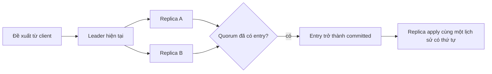
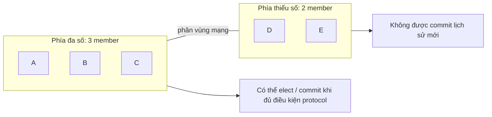

# Đồng thuận phân tán: Thống nhất một lịch sử đã commit khi có lỗi

## Tóm tắt

Đồng thuận phân tán là bài toán làm cho các node độc lập **thống nhất một giá trị hoặc một lịch sử có thứ tự dù message bị trễ và một số node gặp lỗi**.

Ở mức độ nhận diện, hãy giữ rõ năm ý:

- **replication không tự động là consensus**: có nhiều bản sao không chứng minh rằng các node đã thống nhất lịch sử nào là authoritative;
- một consensus group thường cần **quorum**, phổ biến là đa số, trước khi một quyết định được xem là committed;
- protocol dựa trên leader như Raft dùng **bầu leader**, term và replicated log để tổ chức agreement;
- network partition có thể để một phía còn đủ vote tiếp tục, còn phía thiểu số phải dừng commit công việc mới;
- nếu group mất quorum, giữ safety đồng nghĩa phải từ bỏ tiến triển cho đến khi đủ member giao tiếp lại được.



<TermBox term="Quorum">
**Quorum** là tập vote tối thiểu mà protocol yêu cầu trước khi xem một quyết định là được chấp nhận hoặc committed.

Trong hệ majority đơn giản, group 3 node cần 2 vote và group 5 node cần 3. Lý do sâu hơn không chỉ là phép tính: các quorum hợp lệ được chọn để **giao nhau**, tạo quorum intersection nhằm ngăn hai đa số độc lập cùng commit hai lịch sử xung đột tại cùng một vị trí logic.
</TermBox>

## Replication không tự động là consensus

Replication trả lời: **làm sao nhiều node có được các bản sao của state?**

Consensus trả lời: **làm sao các node đó thống nhất giá trị, leader hoặc lịch sử có thứ tự nào là authoritative?**

Một primary có thể sao chép dữ liệu bất đồng bộ sang follower mà không chạy consensus protocol cho từng commit. Một leaderless store có thể replicate nhiều version rồi reconcile sau. Ngược lại, replicated state machine thường kết hợp cả hai ý: consensus quyết định log entry nào được committed, sau đó replication mang những entry đó tới các member.

Vì vậy các suy luận tắt sau là không an toàn:

```text
ba replica -> consensus đã xảy ra
quorum read/write -> đã có một lịch sử consensus linearizable duy nhất
có leader -> leader vẫn còn authority
```

Consensus nói về **quy tắc agreement**, không phải chỉ về số lượng bản sao hay một node mang tên “leader”.

## Safety và liveness kéo theo hai mục tiêu khác nhau

Hai từ giúp phân loại điều consensus system cố giữ:

- **Safety / an toàn:** không xảy ra điều xấu. Hai participant đúng không commit hai quyết định không tương thích cho cùng một vị trí.
- **Liveness / khả năng tiến triển:** cuối cùng vẫn xảy ra điều tốt. Proposal mới cuối cùng được commit khi các giả định cần cho tiến triển được thỏa mãn.

Trong một partition cứng, protocol có thể chủ động hy sinh liveness ở phía thiểu số để giữ safety. Từ chối write có thể chính là kết quả đúng.

Đây cũng là thói quen suy luận từ các bài trước: timeout hoặc peer unreachable không chứng minh peer đã chết. Vì vậy consensus protocol cần voting rule và history rule vẫn an toàn khi failure detection không hoàn hảo.

<TermBox term="Term / epoch">
**Term** hoặc **epoch / kỷ nguyên** là một thế hệ logic tăng đơn điệu, dùng để phân biệt authority cũ với authority mới.

Raft gọi nó là term hay nhiệm kỳ. Hệ khác có thể dùng epoch, ballot number hoặc generation tương tự. Tên khác nhau nhưng mục đích liên quan: authority cũ không được vượt authority của một quyết định mới hơn.
</TermBox>

## Bầu leader thiết lập authority hiện tại

Consensus protocol dựa trên leader thường tổ chức thời gian theo các thế hệ logic. Trong Raft, một node có thể trở thành candidate, xin vote từ peer và chỉ trở thành leader sau khi thắng election quorum cần thiết.

```mermaid
sequenceDiagram
  participant A as Node A
  participant B as Node B
  participant C as Node C

  A->>A: election timeout; bắt đầu term 12
  A->>B: xin vote cho term 12
  A->>C: xin vote cho term 12
  B-->>A: cấp vote
  C-->>A: cấp vote
  A->>A: đạt quorum; trở thành leader
  A-->>B: heartbeat / log replication
  A-->>C: heartbeat / log replication
```

Một node nhớ rằng nó *đã từng là leader* là chưa đủ. Authority của nó phụ thuộc vào term hiện tại và quorum rule của protocol.

Leader election chỉ là một phần của consensus. Câu hỏi safety khó hơn nằm ở chuyện lịch sử được xử lý thế nào trước, trong và sau khi leadership đổi.

## Replicated log tách proposed khỏi committed

Raft là consensus algorithm để quản lý một **replicated log**. Leader sắp proposal thành log entry có thứ tự rồi gửi chúng cho follower. Entry xuất hiện trên một hoặc nhiều node chưa tự động có nghĩa nó đã committed.

**Commit boundary** là ranh giới quan trọng:

1. client gửi proposal;
2. leader append entry cục bộ;
3. follower sao chép entry;
4. protocol quan sát điều kiện quorum cần thiết;
5. entry trở thành committed theo rule của protocol;
6. replica apply các entry đã committed vào state machine theo thứ tự.

Một entry **chưa commit / uncommitted** có thể biến mất hoặc bị ghi đè sau leadership change. Client hoặc operator không được đánh đồng “tôi thấy entry trong log của một node” với “cluster đã commit entry đó”.

Tài liệu failure hiện tại của etcd minh họa đúng boundary này: sau leader failure, write đã gửi nhưng chưa commit có thể mất, trong khi write đã committed được consensus rule bảo toàn.

## Quorum intersection khiến hai majority không thể tách rời hoàn toàn

Với majority quorum đơn giản, bất kỳ hai đa số hợp lệ nào cũng có ít nhất một member giao nhau.

Với năm member:

```text
quorum A = {1, 2, 3}
quorum B = {3, 4, 5}
điểm giao nhau = {3}
```

Phần chồng lấp đó giúp protocol mang thông tin safety từ quyết định trước sang quyết định sau. Proof consensus thực tế có nhiều điều kiện hơn quan sát này, nhưng quorum intersection là hình dạng cốt lõi cần nhận diện.

Group số lẻ rất phổ biến vì thêm một node để thành group số chẵn thường tăng cost mà không tăng simple-majority failure tolerance:

| Số member | Majority | Số member lỗi vĩnh viễn chịu được trước khi mất quorum |
| ---: | ---: | ---: |
| 3 | 2 | 1 |
| 4 | 3 | 1 |
| 5 | 3 | 2 |
| 6 | 4 | 2 |
| 7 | 4 | 3 |

Điều này **không** có nghĩa “luôn dùng năm node” hoặc “thêm member là miễn phí”. Group rộng hơn đưa thêm replication, disk và network work vào consensus path.

## Network partition tạo phía đa số và phía thiểu số

Xét consensus group 5 node bị phân vùng mạng thành hai nhóm 3 và 2.



Phía thiểu số có thể vẫn sống, còn disk và vẫn pass process health check. Nó chỉ thiếu số vote cần để thiết lập một lịch sử committed mới một cách an toàn.

Nếu toàn cluster mất quorum, write cần consensus phải dừng. etcd ghi rõ điều này: mất đa số nghĩa cluster không thể nhận write mới cho đến khi quorum được khôi phục hoặc disaster recovery chủ đích tạo cluster mới từ một recovery point đáng tin cậy.

Đó là lý do “ép node bị cô lập tiếp tục phục vụ write” thường là availability shortcut nguy hiểm, không phải một chỉnh sửa vận hành vô hại.

## Consensus có failure model

Raft và consensus kiểu Paxos cổ điển thường được giải thích dưới giả định **lỗi crash / crash failure** cùng network delay: node có thể dừng, restart hoặc unreachable, nhưng protocol tự nó không được thiết kế để an toàn trước participant tùy ý nói dối.

Một participant **Byzantine** có thể nói dối, equivocate hoặc gửi thông tin bịa khác nhau cho từng peer. Byzantine fault-tolerant protocol cần giả định và cơ chế khác.

Đừng nâng guarantee chỉ bằng từ vựng. Nói “chúng tôi dùng Raft” không đồng nghĩa Byzantine fault tolerance, miễn nhiễm software bug, business logic đúng, hay an toàn trước correlated operator mistake.

## Consensus có chi phí độ trễ vật lý

Agreement là coordination, và coordination đi qua máy khác.

Tài liệu etcd hiện tại mô tả consensus commit latency bị giới hạn bởi network round-trip time (RTT) và durable disk I/O. Quorum trải rộng theo địa lý có thể tăng tách biệt failure domain, nhưng cũng đưa thêm network latency vào đường thiết lập agreement.

Điều đó tạo tension thực tế:

```text
phân bố rộng hơn theo failure domain
  -> có thể sống tốt hơn trước local failure
  -> thường tăng consensus latency
  -> cần hiểu quorum placement nghiêm ngặt hơn
```

Vì vậy consensus phù hợp nhất với state thực sự cần một đường quyết định authoritative: cluster membership, leader ownership, metadata, coordination record, strongly ordered state-machine command và control state tương tự.

## Consensus không biến mọi business effect thành exactly-once

Consensus group có thể quyết định log entry 184 được committed đúng một lần trong lịch sử nội bộ của nó. Điều đó không tự động khiến email, payment charge, webhook hay database write bên ngoài xảy ra exactly-once.

Ngay khi committed command kích hoạt effect bên ngoài consensus state machine, **Delivery Semantics**, idempotency, transaction và reconciliation lại trở nên quan trọng.

Giữ các boundary này tách biệt:

- consensus quyết định lịch sử authoritative trong scope của nó;
- replication phân phối state đó;
- consistency mô tả observer được phép nhìn thấy gì;
- delivery semantics mô tả xử lý message lặp hoặc bỏ sót;
- business correctness phụ thuộc vào cách effect đi qua các boundary đó.

## Kịch bản production: leader cũ bị cô lập vẫn nhận write cấu hình

Một control-plane service lưu routing configuration trong consensus group 5 member. Một network failure cô lập hai member, bao gồm leader cũ, khỏi ba member còn lại.

Phía ba member elect leader mới và tiếp tục commit thay đổi configuration. Leader cũ bị cô lập vẫn reachable từ một internal admin tool, và một “availability fallback” tự chế cho phép tool đó write trực tiếp vào local store của leader cũ mà không có quorum.

**Hậu quả:** operator thấy hai routing configuration không tương thích. Khi connectivity trở lại, local write từ phía thiểu số không thể trở thành một phần của committed consensus history, nhưng downstream system có thể đã hành động theo chúng.

**Nguyên nhân cốt lõi:** fallback xem last-known leader là authoritative ngay cả sau khi nó mất quorum. Team nhầm process liveness với consensus authority và bypass commit boundary.

**Cách khắc phục chuẩn:** yêu cầu write được consensus bảo vệ phải có authority do quorum hiện tại xác lập, reject hoặc fail closed ở phía thiểu số, expose mất quorum như một trạng thái vận hành rõ ràng, và chỉ gắn external side effect với committed state thay vì local observation chưa commit. Nếu quorum mất vĩnh viễn, dùng disaster-recovery procedure được tài liệu hóa thay vì tự tạo một lịch sử thứ hai.

## Tự kiểm tra

Một group kiểu Raft có 5 member bị partition thành phía 2 member chứa leader trước đó và phía 3 member. Leader cũ vẫn reachable từ client nhưng không reach được ba member kia. Nó có thể an toàn tiếp tục commit entry mới chỉ vì trước partition nó là leader không?

<details>
<summary>Show the reasoning</summary>

Không. Vai trò leader trước đó không thay thế quorum requirement hiện tại. Phía thiểu số 2 member không thể tạo majority của năm, nên không được commit lịch sử mới. Phía 3 member có thể elect leader hiện tại và tiếp tục tiến triển. Giữ safety yêu cầu phía thiểu số dừng consensus write dù điều đó làm giảm availability cho client vẫn bị route tới nó.

</details>

## Checklist review

- [ ] **Scope agreement:** Consensus group đang làm authoritative cho giá trị, log hay metadata history nào?
- [ ] **Quorum:** Cần bao nhiêu member cho election và commit, và các member đó nằm trong failure domain nào?
- [ ] **Authority:** Term, epoch, ballot hoặc generation tương đương vô hiệu leader cũ như thế nào?
- [ ] **Commit boundary:** Operator và client có phân biệt state đã replicate nhưng chưa commit với committed state không?
- [ ] **Partition behavior:** Phía thiểu số trả gì khi không thể tạo quorum?
- [ ] **Failure model:** Protocol chỉ thiết kế cho crash fault hay cho mô hình mạnh hơn như Byzantine fault?
- [ ] **Latency:** Network RTT và durable-storage latency nào nằm trên consensus path?
- [ ] **Recovery:** Quy trình majority-loss recovery có được tài liệu hóa và test mà không âm thầm tạo hai authoritative history không?

## Quy tắc cho agent

- [ ] **Không suy consensus từ bản sao:** Tìm election rule và commit rule thật trước khi claim một lịch sử authoritative.
- [ ] **Nêu rõ quorum:** Chỉ ra participant nào và bao nhiêu vote thiết lập authority hoặc commitment.
- [ ] **Tôn trọng state chưa commit:** Không nâng local log entry thành business truth chỉ vì một node đã persist nó.
- [ ] **Fail closed khi mất quorum:** Không phát minh write bypass tạo independent minority history.
- [ ] **Tách scope:** Phân biệt consensus, replication, consistency, delivery semantics và guarantee của external side effect.
- [ ] **Xác minh failure model:** Không mô tả crash-fault protocol là Byzantine fault tolerant nếu protocol thực tế không cung cấp thuộc tính đó.

## Nguồn tham khảo

Các nguồn chính được kiểm tra ngày **2026-09-17**:

- [Ongaro & Ousterhout — In Search of an Understandable Consensus Algorithm](https://raft.github.io/raft.pdf)
- [etcd v3.7 — Failure modes](https://etcd.io/docs/v3.7/op-guide/failures/)
- [etcd v3.7 — API guarantees](https://etcd.io/docs/v3.7/learning/api_guarantees/)
- [etcd v3.7 — Performance](https://etcd.io/docs/v3.7/op-guide/performance/)
- [etcd v3.7 — Disaster recovery](https://etcd.io/docs/v3.7/op-guide/recovery/)