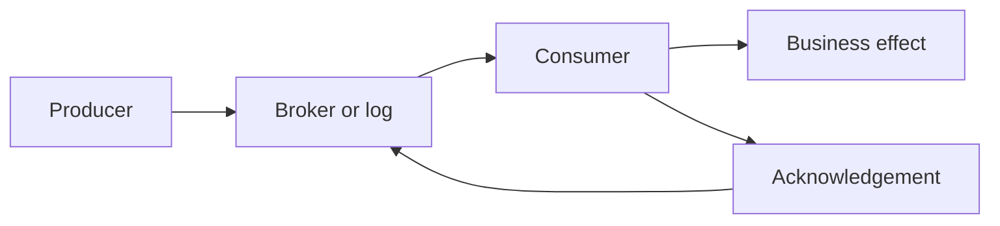
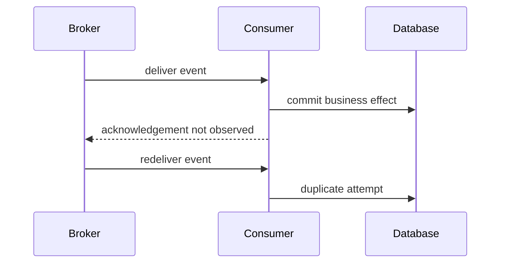
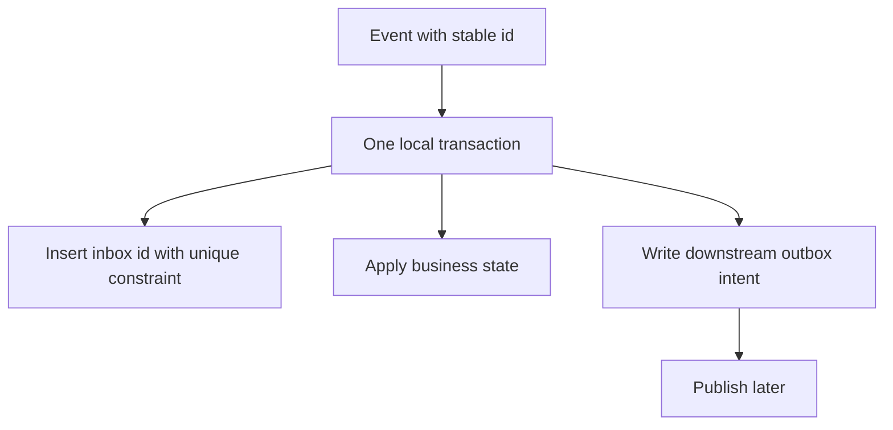

# Delivery Semantics: Reason About Loss, Duplicates, and Effects

## TL;DR

Delivery semantics describe what can happen when a producer, broker, consumer, or network fails around a message handoff. The useful question is not “does the queue guarantee exactly once?” but **what is the scope of the guarantee, where can failure happen, and what business effect can repeat?**

- **At-most-once:** a message may be lost, but the delivery path does not intentionally redeliver it.
- **At-least-once:** the system retries or redelivers until success is observed, so duplicates are possible.
- **Exactly-once:** only meaningful with a precise scope. A broker or stream may provide transactional or deduplicated processing inside its boundary, while an external database, payment API, email, or other side effect still needs coordination.

<TermBox term="Delivery Semantics">
**Delivery semantics** describe the observable loss and duplication behavior of a message handoff under retries and failure. They are properties of a boundary and protocol, not a universal statement about the whole business workflow.
</TermBox>

## Start with the failure window

A consumer normally has to do two things:

1. apply some business effect;
2. tell the broker or log that the delivery is complete.

Those operations are rarely one atomic action.

If the consumer acknowledges **before** the effect, then a crash can lose work. If it acknowledges **after** the effect, then a crash between the effect and acknowledgement can cause redelivery and duplicate processing.

<TermBox term="Acknowledgement">
An **acknowledgement** is evidence that ownership of a delivery has moved far enough for the sender or broker to stop retaining or retrying it. Ack timing is part of your correctness model.
</TermBox>

## Compare the three common guarantees

| Guarantee | What failure may cause | Typical trade-off |
| --- | --- | --- |
| **At-most-once** | message loss | avoids protocol-level redelivery, but may drop work |
| **At-least-once** | duplicate delivery or processing | favors eventual processing; consumers must tolerate repeats |
| **Exactly-once** | depends on the defined boundary | usually requires deduplication or atomic coordination of input progress and output |

### At-most-once

At-most-once is appropriate when losing an occasional item is preferable to repeating it, or when the data is cheap to regenerate. A consumer can move its checkpoint or acknowledge before doing work, but failure after that point can drop the effect permanently.

Do not read “at-most-once” as “the business action happened once.” It can also mean **zero times**.

### At-least-once

At-least-once keeps responsibility for a message until success is observed. RabbitMQ manual acknowledgements, for example, requeue unacknowledged deliveries when a consumer connection closes. Amazon SQS standard queues also document at-least-once delivery, so the same message can be received more than once.

At-least-once is often the practical default for durable work, but duplicate delivery is expected behavior, not an edge case to ignore.

### Exactly-once needs a boundary

“Exactly-once” is not one universal property. Ask exactly once **where?**

A stream processor may atomically commit consumed offsets and derived records inside one transactional system. A FIFO queue may deduplicate producer retries inside a bounded window. Neither claim automatically makes an external payment charge, email send, warehouse reservation, or webhook effect happen exactly once.

Apache Kafka’s current design documentation explicitly separates publishing durability from consuming semantics and notes that strong end-to-end semantics require coordination with the destination.

## Make duplicate processing converge

At-least-once delivery becomes safe when repeated processing converges on the same logical result.

Common patterns include:

- **Idempotent update:** set `order.status = 'shipped'` rather than “increment shipped count”.
- **Unique event identity:** store `event_id` under a unique constraint before applying an effect.
- **Inbox table:** record consumed message IDs in the same database transaction as local state changes.
- **Idempotency key downstream:** reuse a stable key when calling another service that supports deduplication.
- **Outbox after local commit:** persist downstream intent with the business transaction and publish later.

<TermBox term="Idempotent Consumer">
An **idempotent consumer** can process the same logical message more than once without multiplying the intended business effect. This can come from naturally idempotent state transitions, deduplication records, uniqueness constraints, or downstream idempotency keys.
</TermBox>

The transaction above does not magically make every remote effect exactly once. It gives the local service an atomic boundary: either it records the event and state transition together, or neither is committed.

## Ordering is a separate contract

Delivery semantics and ordering are related but different.

A system can be at-least-once **and** ordered within a partition or message group. Another may redeliver an older message after a newer one has already been processed. Global ordering is expensive and uncommon; guarantees are usually scoped by partition, key, queue, or consumer group.

When order matters:

- identify the ordering key;
- include a monotonic version or sequence when possible;
- define whether late or duplicate events are ignored, merged, or reconciled;
- do not assume a retry preserves global order.

For state transitions such as `CREATED -> PAID -> SHIPPED`, a consumer should reject or reconcile stale transitions rather than blindly trusting arrival order.

## Poison messages and dead-letter handling

Some messages will never succeed without intervention: invalid payloads, unsupported schema versions, missing reference data, or deterministic business violations.

Infinite redelivery of a poison message wastes capacity and can block useful work. Bound attempts or delivery count, preserve diagnostic context, and route terminal failures to a **dead-letter queue or equivalent failure stream**.

A DLQ is not a correctness strategy by itself. Operators still need:

- reason and exception metadata;
- original message identity;
- replay rules;
- a way to prevent replay from duplicating effects;
- alerting on growth and age.

## Production scenario

A payment service emits `OrderPaid(eventId=evt-42, orderId=o-17)`. A fulfillment consumer inserts a shipment row, then acknowledges the message.

The database commit succeeds, but the consumer crashes before the broker observes the acknowledgement. The broker redelivers `evt-42`.

**Impact:** a naive consumer inserts a second shipment, triggers a second warehouse reservation, or sends a duplicate downstream command even though the broker behaved correctly for at-least-once delivery.

**Root cause:** the team treated message acknowledgement as if it were atomic with the business effect and interpreted “reliable delivery” as “one business effect.”

**Correct pattern:** make `eventId` a stable deduplication identity; insert it under a unique constraint in the same local transaction that creates the shipment; treat a uniqueness conflict as an already-applied event; acknowledge only after that transaction commits. If a downstream reservation must happen later, persist an outbox record and call the downstream service with a stable idempotency key.

This gives the local service **effectively-once business state transition under redelivery** without pretending the entire distributed workflow has one global exactly-once transaction.

## Reasoning checklist for any messaging guarantee

When a platform says “exactly once,” ask:

1. Is the claim about producer publish, broker storage, consumer delivery, stream processing, or external effects?
2. What happens if the consumer crashes after the effect but before ack or checkpoint commit?
3. Can the same logical event carry a stable identity?
4. Where is deduplication state stored, and is it atomic with the local effect?
5. What is the ordering scope?
6. What happens to poison messages?
7. How are replays distinguished from accidental duplicates?

## Self-check

A consumer charges a card, then commits its queue checkpoint. The charge succeeds but the process crashes before the checkpoint commit. The broker redelivers the message. Does an “at-least-once” queue violate its contract?

Show the reasoning

No. Redelivery is exactly what at-least-once allows. The unsafe part is the business effect: the consumer performed a non-idempotent remote action before durably recording progress. Use a stable payment idempotency key or a coordinated state machine so the repeated delivery converges on the same logical charge.

## Delivery semantics checklist

- [ ] Name the guarantee and its exact boundary.
- [ ] Model the crash window around effect and acknowledgement.
- [ ] Expect duplicates under at-least-once delivery.
- [ ] Give logical events stable identities.
- [ ] Make local effects idempotent or deduplicated atomically.
- [ ] Define ordering scope and stale-event behavior.
- [ ] Bound poison-message retries and operate a DLQ or failure stream.
- [ ] Treat vendor “exactly-once” claims as scoped, not global business guarantees.
- [ ] Observe deliveries, redeliveries, duplicate suppressions, DLQ volume, and consumer lag.

## Agent rule

Before accepting a messaging guarantee, recover the full failure boundary: producer confirmation, broker durability, consumer acknowledgement, checkpoint timing, duplicate behavior, ordering scope, local transaction boundary, downstream side effects, replay behavior, and poison-message policy. Never translate a scoped transport guarantee into a stronger business-effect guarantee without proving the coordination mechanism.

## Sources

Primary references verified on **2026-09-16**:

- [Apache Kafka 4.0 Design — Message Delivery Semantics](https://kafka.apache.org/40/design/design/)
- [RabbitMQ — Consumer Acknowledgements and Publisher Confirms](https://www.rabbitmq.com/docs/confirms)
- [Amazon SQS — At-least-once delivery](https://docs.aws.amazon.com/AWSSimpleQueueService/latest/SQSDeveloperGuide/standard-queues-at-least-once-delivery.html)
