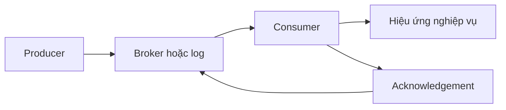
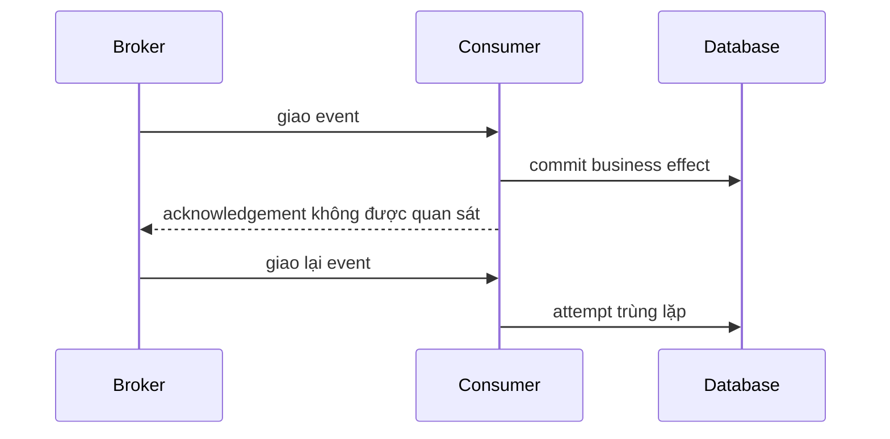
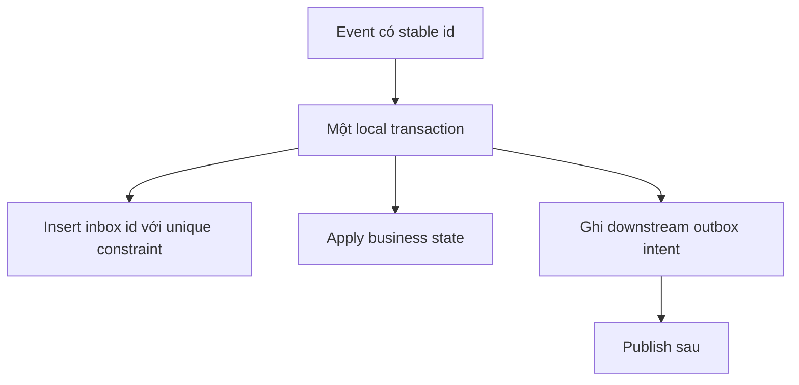

# Ngữ nghĩa giao nhận: Suy luận về mất mát, trùng lặp và hiệu ứng

## Tóm tắt

Delivery semantics mô tả điều gì có thể xảy ra khi producer, broker, consumer hoặc network lỗi quanh thời điểm giao message. Câu hỏi hữu ích không phải “queue có exactly-once không?” mà là **guarantee có scope ở đâu, failure có thể xảy ra ở đâu, và business effect nào có thể lặp?**

- **At-most-once / tối đa một lần:** message có thể mất, nhưng delivery path không chủ động giao lại.
- **At-least-once / ít nhất một lần:** hệ thống retry hoặc redeliver cho tới khi quan sát được success, nên duplicate là điều bình thường.
- **Exactly-once / chính xác một lần:** chỉ có nghĩa khi scope được định nghĩa chính xác. Broker hoặc stream có thể transactional/deduplicate trong boundary của nó, nhưng database, payment API, email hay side effect ngoài boundary vẫn cần coordination.

<TermBox term="Delivery Semantics">
**Ngữ nghĩa giao nhận** mô tả hành vi mất mát và trùng lặp có thể quan sát ở một message handoff khi có retry và failure. Đây là thuộc tính của một boundary/protocol cụ thể, không phải lời hứa cho toàn bộ workflow nghiệp vụ.
</TermBox>

## Bắt đầu từ cửa sổ lỗi

Consumer thường phải làm hai việc:

1. áp dụng business effect;
2. báo cho broker hoặc log rằng delivery đã hoàn tất.

Hai việc này hiếm khi là một atomic action.

Nếu consumer xác nhận **trước** khi effect hoàn tất, crash có thể làm mất công việc. Nếu xác nhận **sau** effect, crash giữa effect và acknowledgement có thể gây giao lại và xử lý trùng.

<TermBox term="Acknowledgement">
**Acknowledgement / xác nhận** là bằng chứng cho thấy ownership của delivery đã chuyển đủ xa để sender hoặc broker có thể ngừng giữ hoặc retry nó. Thời điểm ack là một phần của correctness model.
</TermBox>

## So sánh ba guarantee phổ biến

| Guarantee | Failure có thể gây ra | Đánh đổi thường gặp |
| --- | --- | --- |
| **At-most-once** | mất message | tránh protocol-level redelivery nhưng có thể bỏ mất công việc |
| **At-least-once** | delivery hoặc processing trùng | ưu tiên eventual processing; consumer phải chịu được việc lặp |
| **Exactly-once** | phụ thuộc boundary được định nghĩa | thường cần deduplication hoặc atomic coordination giữa input progress và output |

### At-most-once

At-most-once phù hợp khi mất một item đôi lúc còn tốt hơn việc lặp nó, hoặc khi dữ liệu có thể regenerate rẻ. Consumer có thể move checkpoint hoặc ack trước khi làm việc, nhưng failure sau thời điểm đó có thể làm effect biến mất vĩnh viễn.

Đừng đọc “at-most-once” thành “business action xảy ra đúng một lần.” Nó cũng có thể xảy ra **zero lần**.

### At-least-once

At-least-once giữ trách nhiệm với message cho tới khi success được quan sát. Với manual acknowledgement, RabbitMQ requeue delivery chưa ack khi connection của consumer đóng. Amazon SQS standard queue cũng document at-least-once delivery, vì vậy cùng một message có thể được receive nhiều hơn một lần.

At-least-once thường là default thực dụng cho durable work, nhưng duplicate delivery là behavior được thiết kế trước, không phải edge case có thể bỏ qua.

### Exactly-once cần boundary

“Exactly-once” không phải một thuộc tính toàn cục. Hãy hỏi chính xác một lần **ở đâu?**

Stream processor có thể atomically commit consumed offset và derived record trong cùng transactional system. FIFO queue có thể deduplicate producer retry trong một time window giới hạn. Các guarantee đó không tự biến external payment charge, email, warehouse reservation hoặc webhook thành effect chính xác một lần.

Tài liệu thiết kế Kafka hiện tại cũng tách publishing durability khỏi consuming semantics và chỉ ra rằng end-to-end semantics mạnh cần coordination với destination.

## Làm duplicate processing hội tụ

At-least-once delivery trở nên an toàn khi xử lý lặp hội tụ về cùng logical result.

Các pattern phổ biến:

- **Idempotent update:** set `order.status = 'shipped'` thay vì “tăng shipped count”.
- **Stable event identity:** lưu `event_id` dưới unique constraint trước khi áp dụng effect.
- **Inbox table:** record consumed message ID trong cùng database transaction với local state change.
- **Idempotency key downstream:** dùng lại stable key khi gọi service khác có hỗ trợ deduplication.
- **Outbox sau local commit:** persist downstream intent cùng business transaction rồi publish sau.

<TermBox term="Idempotent Consumer">
**Idempotent consumer** có thể xử lý cùng logical message nhiều lần mà không nhân business effect dự kiến. Điều này có thể đến từ state transition vốn idempotent, deduplication record, unique constraint hoặc downstream idempotency key.
</TermBox>

Transaction trên không biến mọi remote effect thành exactly-once. Nó tạo một atomic boundary cục bộ: event record và state transition cùng commit, hoặc cả hai cùng không commit.

## Ordering là contract riêng

Delivery semantics và ordering liên quan nhưng không giống nhau.

Một hệ thống có thể at-least-once **và** giữ thứ tự trong một partition hoặc message group. Hệ thống khác có thể giao lại message cũ sau khi message mới hơn đã được xử lý. Global ordering đắt và hiếm; guarantee thường scope theo partition, key, queue hoặc consumer group.

Khi thứ tự quan trọng:

- xác định ordering key;
- mang monotonic version hoặc sequence khi có thể;
- định nghĩa late/duplicate event sẽ bị ignore, merge hay reconcile;
- không giả định retry giữ global order.

Với state transition như `CREATED -> PAID -> SHIPPED`, consumer nên reject hoặc reconcile stale transition thay vì mù quáng tin arrival order.

## Poison message và dead-letter handling

Một số message sẽ không bao giờ thành công nếu không có can thiệp: payload sai, schema version không hỗ trợ, thiếu reference data hoặc business violation deterministic.

Giao lại vô hạn một poison message sẽ tốn capacity và có thể chặn useful work. Hãy bound attempt hoặc delivery count, giữ diagnostic context và route terminal failure sang **dead-letter queue (DLQ) hoặc failure stream tương đương**.

DLQ tự nó không phải correctness strategy. Operator vẫn cần:

- reason và exception metadata;
- original message identity;
- replay rule;
- cơ chế để replay không nhân effect;
- alert khi volume hoặc age tăng.

## Kịch bản production

Payment service phát `OrderPaid(eventId=evt-42, orderId=o-17)`. Fulfillment consumer insert shipment row rồi acknowledgement message.

Database commit thành công nhưng consumer crash trước khi broker quan sát được xác nhận. Broker giao lại `evt-42`.

**Hậu quả:** consumer ngây thơ insert shipment thứ hai, trigger warehouse reservation lần hai hoặc phát duplicate downstream command dù broker đang hoạt động đúng với at-least-once delivery.

**Nguyên nhân cốt lõi:** team xem message acknowledgement như thể atomic với business effect và diễn giải “reliable delivery” thành “một business effect.”

**Cách khắc phục chuẩn:** dùng `eventId` làm stable deduplication identity; insert nó dưới unique constraint trong cùng local transaction tạo shipment; xem uniqueness conflict là event đã được apply; chỉ acknowledgement sau khi transaction commit. Nếu downstream reservation phải diễn ra sau, persist outbox record và gọi downstream service bằng stable idempotency key.

Cách này tạo **effectively-once local business state transition dưới redelivery** mà không giả vờ toàn bộ distributed workflow có một global exactly-once transaction.

## Checklist suy luận cho mọi messaging guarantee

Khi platform nói “exactly once,” hãy hỏi:

1. Claim nói về producer publish, broker storage, consumer delivery, stream processing hay external effect?
2. Điều gì xảy ra nếu consumer crash sau effect nhưng trước ack hoặc checkpoint commit?
3. Cùng logical event có stable identity không?
4. Deduplication state được lưu ở đâu, và có atomic với local effect không?
5. Ordering scope là gì?
6. Poison message đi đâu?
7. Replay được phân biệt với accidental duplicate như thế nào?

## Tự kiểm tra

Consumer charge thẻ rồi mới commit queue checkpoint. Charge thành công nhưng process crash trước checkpoint commit. Broker giao lại message. Queue “at-least-once” có vi phạm contract không?

Xem giải thích chi tiết

Không. Redelivery chính là behavior mà at-least-once cho phép. Phần không an toàn là business effect: consumer thực hiện remote action không idempotent trước khi persist progress. Dùng stable payment idempotency key hoặc coordinated state machine để delivery lặp hội tụ vào cùng logical charge.

## Checklist delivery semantics

- [ ] Gọi tên guarantee và boundary chính xác.
- [ ] Mô hình crash window quanh effect và acknowledgement.
- [ ] Kỳ vọng duplicate dưới at-least-once delivery.
- [ ] Cho logical event stable identity.
- [ ] Làm local effect idempotent hoặc deduplicate atomically.
- [ ] Định nghĩa ordering scope và stale-event behavior.
- [ ] Bound poison-message retry và vận hành DLQ hoặc failure stream.
- [ ] Xem vendor claim “exactly-once” là scoped, không phải global business guarantee.
- [ ] Quan sát delivery, redelivery, duplicate suppression, DLQ volume và consumer lag.

## Agent rule

Trước khi chấp nhận một messaging guarantee, hãy recover toàn bộ failure boundary: producer confirmation, broker durability, consumer acknowledgement, checkpoint timing, duplicate behavior, ordering scope, local transaction boundary, downstream side effect, replay behavior và poison-message policy. Không được nâng một scoped transport guarantee thành business-effect guarantee mạnh hơn nếu chưa chứng minh cơ chế coordination.

## Nguồn

Nguồn chính kiểm tra ngày **2026-09-16**:

- [Apache Kafka 4.0 Design — Message Delivery Semantics](https://kafka.apache.org/40/design/design/)
- [RabbitMQ — Consumer Acknowledgements and Publisher Confirms](https://www.rabbitmq.com/docs/confirms)
- [Amazon SQS — At-least-once delivery](https://docs.aws.amazon.com/AWSSimpleQueueService/latest/SQSDeveloperGuide/standard-queues-at-least-once-delivery.html)
