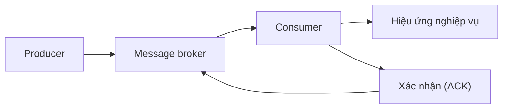
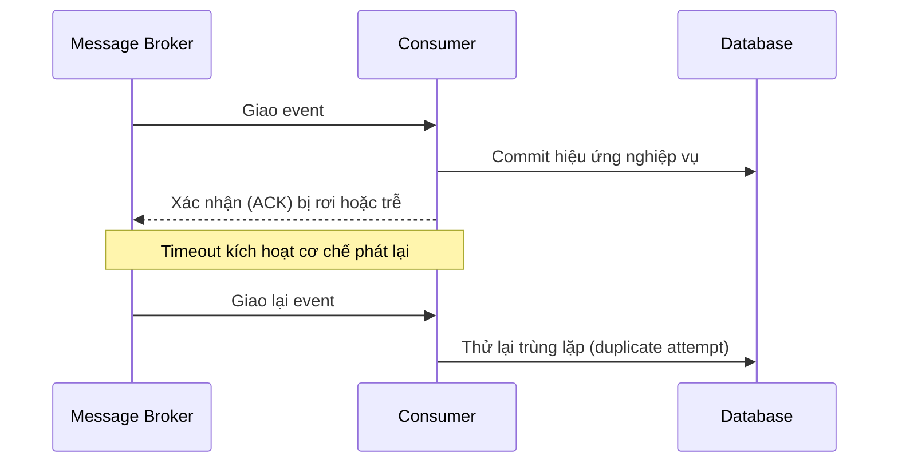
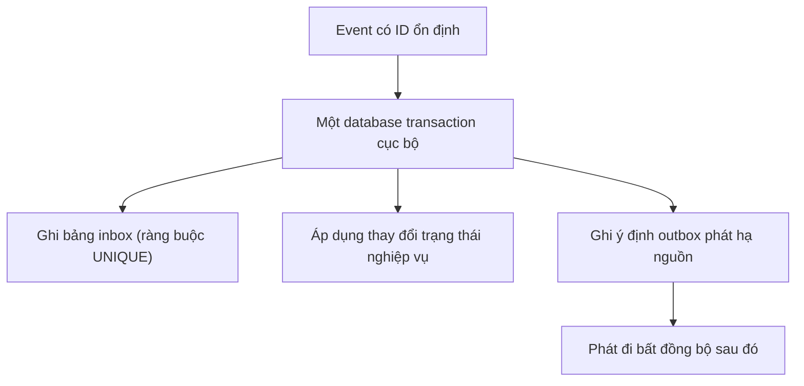

# Ngữ nghĩa giao nhận: Suy luận về mất mát, trùng lặp và hiệu ứng

2 giờ sáng, một sự cố chập chờn mạng thoáng qua làm rơi mất gói tin xác nhận (ACK) giữa consumer và message broker. Broker đinh ninh message chưa tới đích nên lập tức kích hoạt cơ chế phát lại (redelivery). Chỉ vài giây sau, consumer phụ trách thanh toán nhận lại đúng sự kiện đó, trừ tiền thẻ tín dụng của khách hàng lần thứ hai và gửi đi 2 email xác nhận. Trong buổi họp mổ xẻ sự cố (post-mortem), kỹ sư ngơ ngác phân trần: *"Sao lại bị xử lý lặp được? Message broker của chúng ta cam kết giao nhận đáng tin cậy cơ mà!"*

Hệ thống phân tán không vận hành bằng phép màu mà chạy trên hạ tầng mạng vốn dĩ không đáng tin cậy. Khi xảy ra phân mảnh mạng (network partition), tiến trình sập (crash) hay quá thời gian chờ (timeout), ngữ nghĩa giao nhận (delivery semantics) chính là ranh giới kỹ thuật vạch rõ điều hệ thống đảm bảo và điều ứng dụng bắt buộc phải tự xử lý.

## TL;DR

> 💡 **Quy tắc bỏ túi:** Ngữ nghĩa giao nhận là cam kết của tầng truyền tải mạng, còn lọc trùng là trách nhiệm của thực thể nghiệp vụ. Tuyệt đối không phó mặc cho message broker bảo đảm "chính xác một lần" đối với các tác dụng phụ nghiệp vụ nếu consumer không được thiết kế lũy đẳng (idempotent).

- **At-most-once (tối đa một lần):** Ưu tiên thông lượng tối đa và triệt tiêu nguy cơ trùng lặp; message có thể bị mất trắng khi xảy ra sự cố, nhưng hệ thống cam kết không bao giờ chủ động phát lại.
- **At-least-once (ít nhất một lần):** Lựa chọn thực chiến chuẩn mực cho các tác vụ cần độ bền vững. Broker kiên trì phát lại cho tới khi nhận được xác nhận (ACK), đồng nghĩa **trùng lặp là điều tất yếu** khi mạng chập chờn hoặc tiến trình xử lý sập.
- **Exactly-once (chính xác một lần):** Chỉ là một trừu tượng có phạm vi giới hạn nghiêm ngặt (như transactional stream nội bộ của Apache Kafka); hoàn toàn không có cơ chế thần kỳ nào tự động bảo đảm chính xác một lần xuyên qua database bên ngoài, cổng thanh toán hay email.
- **Thứ tự độc lập với giao nhận:** Việc phát lại trong at-least-once thường xuyên làm đảo lộn thứ tự đến của message; cần dựa vào partition key hoặc sequence tăng đơn điệu (monotonic) thay vì kỳ vọng thứ tự toàn cục.
- **Cạm bẫy chết người:** Xác nhận (ACK) trước khi commit database sẽ làm mất dữ liệu vĩnh viễn nếu tiến trình sập; ngược lại, ACK sau commit mà thiếu consumer lũy đẳng hoặc bảng inbox sẽ gây trừ tiền hai lần hoặc tạo đơn hàng trùng lặp khi broker phát lại.

<TermBox term="Delivery Semantics">
**Ngữ nghĩa giao nhận** mô tả hành vi mất mát và trùng lặp có thể quan sát ở một message handoff khi có retry và failure. Đây là thuộc tính của một boundary/protocol cụ thể, không phải lời hứa cho toàn bộ workflow nghiệp vụ.
</TermBox>

## Bắt đầu từ cửa sổ lỗi

Trong một kiến trúc hướng sự kiện (event-driven architecture), consumer thường phải thực hiện hai tác vụ tách biệt:

1. Áp dụng hiệu ứng nghiệp vụ (business effect) bền vững (ghi database, trừ tiền tài khoản, phát lệnh sang dịch vụ khác).
2. Gửi tín hiệu xác nhận (acknowledgement / ACK) báo cho message broker hoặc tịnh tiến offset log rằng message đã xử lý xong.

Hai thao tác này trên hai hệ sinh thái độc lập gần như không bao giờ có thể tạo thành một hành động nguyên tử (atomic action) duy nhất nếu không có cơ chế điều phối phân tán đắt đỏ.

Nếu consumer gửi xác nhận **trước** khi ghi thành công vào database, một sự cố sập nguồn (crash) hay hết bộ nhớ (OOM) giữa chừng sẽ làm mất vĩnh viễn dữ liệu. Ngược lại, nếu consumer chỉ xác nhận **sau** khi ghi database, bất kỳ trục trặc mạng hay sự cố crash nào xảy ra giữa thời điểm commit và thời điểm broker nhận được ACK đều khiến broker phát lại message, dẫn đến việc xử lý trùng lặp.

<TermBox term="Acknowledgement">
**Xác nhận (Acknowledgement / ACK)** là bằng chứng giao thức cho thấy quyền sở hữu và trách nhiệm xử lý của một message đã chuyển giao an toàn về phía hạ nguồn, cho phép sender hoặc broker giải phóng nó khỏi bộ đệm phát lại. Thời điểm gửi ACK chính là cốt lõi trong mô hình tính đúng đắn (correctness model) của bạn.
</TermBox>

## So sánh ba guarantee phổ biến

| Ngữ nghĩa giao nhận | Rủi ro khi có sự cố | Đánh đổi kiến trúc điển hình |
| :--- | :--- | :--- |
| **At-most-once (tối đa một lần)** | Mất mát message âm thầm | Triệt tiêu nguy cơ phát lại ở tầng giao thức, tối ưu thông lượng nhưng chấp nhận bỏ rơi tác vụ. |
| **At-least-once (ít nhất một lần)** | Giao hoặc xử lý trùng lặp | Ưu tiên bảo toàn dữ liệu bằng mọi giá; đẩy trách nhiệm lọc trùng và tính lũy đẳng về phía consumer. |
| **Exactly-once (chính xác một lần)** | Bị bó hẹp trong phạm vi nội bộ | Đòi hỏi điều phối tốn kém, giao dịch phân tán hoặc commit offset nguyên tử; đắt đỏ và chỉ có tính cục bộ. |

### At-most-once

At-most-once (tối đa một lần) thích hợp khi việc mất mát vài bản ghi đơn lẻ ít gây tổn hại hơn việc xử lý lặp lại, hoặc khi dữ liệu có thể dễ dàng tái tạo với chi phí rẻ (như dữ liệu đo kiểm telemetry từ cảm biến, tọa độ GPS thời gian thực). Consumer thường tự động xác nhận ngay khi nhận được gói tin hoặc tịnh tiến checkpoint trước khi bắt đầu xử lý. Nếu tiến trình sập giữa chừng, công việc đó sẽ biến mất vĩnh viễn.

Đừng hiểu nhầm “at-most-once” là “chắc chắn hành động nghiệp vụ đã diễn ra một lần.” Nó hoàn toàn có thể là **không lần nào (zero)**.

### At-least-once

At-least-once (ít nhất một lần) giữ trách nhiệm bảo toàn message cho tới khi quan sát thấy xác nhận thành công. Ví dụ, với manual acknowledgement, RabbitMQ sẽ đẩy ngược lại hàng đợi (requeue) các message chưa được ACK khi kết nối TCP của consumer bị đứt. Tương tự, hàng đợi tiêu chuẩn Amazon SQS áp dụng cơ chế at-least-once kèm visibility timeout: nếu thời gian xử lý kéo dài vượt ngưỡng, message chắc chắn sẽ được phát lại cho consumer khác.

At-least-once là xương sống thực chiến của các hệ thống phân tán chịu lỗi cao. Khi chọn at-least-once, việc nhận trùng lặp là một phần của thiết kế vận hành bình thường chứ không phải lỗi ngoại lệ có thể ngó lơ.

### Exactly-once cần một ranh giới rõ ràng

Không có thứ gọi là "chính xác một lần" toàn năng xuyên suốt mọi hạ tầng phân tán. Bất cứ khi nào một nền tảng tuyên bố hỗ trợ exactly-once, câu hỏi đầu tiên bạn phải đặt ra là: **chính xác một lần ở ranh giới nào?**

Một hệ thống stream processing như Apache Kafka có thể commit nguyên tử offset đã tiêu thụ và các record kết quả sinh ra trong cùng một transaction nội bộ của Kafka. Amazon SQS FIFO có thể lọc trùng các lần producer retry trong cửa sổ thời gian 5 phút. Nhưng không có hệ thống nào trong số đó tự biến một lời gọi API thanh toán bên thứ ba, một email gửi ra ngoài hay một lệnh webhook thành hiệu ứng chính xác một lần. Để đảm bảo kết quả kinh doanh cuối cùng chỉ diễn ra đúng một lần, consumer bắt buộc phải có cơ chế lọc trùng tự thân.

## Làm duplicate processing hội tụ

Vì at-least-once chắc chắn sẽ phát lại message, hệ thống chỉ an toàn khi các lần xử lý lặp lại đều hội tụ về cùng một trạng thái nghiệp vụ duy nhất.

Các mẫu thiết kế (pattern) cốt lõi:

- **Cập nhật lũy đẳng tự nhiên (Idempotent update):** Thực thi câu lệnh `UPDATE orders SET status = 'shipped'` thay vì các phép cộng dồn tương đối kiểu `UPDATE metrics SET count = count + 1`.
- **Định danh sự kiện ổn định (Stable event identity):** Lưu `event_id` dưới một ràng buộc duy nhất (`UNIQUE constraint`) trong cơ sở dữ liệu trước khi thực hiện thay đổi trạng thái.
- **Bảng Inbox (Inbox table pattern):** Ghi lại ID của message đã nhận vào bảng `inbox` trong cùng một database transaction cục bộ với việc cập nhật trạng thái nghiệp vụ.
- **Khóa lũy đẳng hạ nguồn (Downstream idempotency key):** Tái sử dụng một khóa định danh duy nhất ổn định khi gọi sang các dịch vụ hoặc cổng thanh toán bên ngoài có hỗ trợ lọc trùng.
- **Transactional outbox sau khi commit:** Lưu trữ ý định phát sự kiện vào database cục bộ cùng lúc với transaction nghiệp vụ rồi mới phát đi sau.

<TermBox term="Idempotent Consumer">
**Idempotent consumer (Consumer lũy đẳng)** là mẫu thiết kế cho phép consumer tiếp nhận và xử lý cùng một message logic nhiều lần mà không làm nhân bản các hiệu ứng nghiệp vụ ngoài ý muốn. Tính lũy đẳng này có thể đạt được thông qua chuyển dịch trạng thái tự nhiên, ràng buộc khóa duy nhất, bảng inbox hoặc khóa lũy đẳng truyền đi hạ nguồn.
</TermBox>

Transaction trên không thể biến mọi hiệu ứng từ xa thành exactly-once. Nó thiết lập một ranh giới nguyên tử cục bộ: hoặc cả sự kiện tiếp nhận lẫn thay đổi dữ liệu cùng commit thành công, hoặc cả hai cùng bị hủy bỏ nếu gặp lỗi.

## Thứ tự là một cam kết riêng biệt

Các kỹ sư thường nhầm lẫn giữa ngữ nghĩa giao nhận và thứ tự thông điệp (ordering). Đây là hai cam kết hoàn toàn độc lập.

Một hệ thống có thể vừa đảm bảo at-least-once **vừa** bảo đảm thứ tự trong một partition, stream shard hoặc message group cụ thể. Tuy nhiên, khi mạng chập chờn hoặc consumer sập kích hoạt cơ chế giao lại, một message cũ hoàn toàn có thể đến đích *sau* khi một message mới hơn đã được xử lý xong. Thứ tự toàn cục (global ordering) cực kỳ đắt đỏ và hiếm khi cần thiết; thông thường thứ tự chỉ cần bảo đảm theo partition, aggregate key hoặc customer ID.

Khi thứ tự mang tính sống còn:

- Luôn xác định rõ ràng ordering key (ví dụ `account_id` hoặc `order_id`).
- Đính kèm một phiên bản (version) hoặc số thứ tự tăng đơn điệu (`monotonic sequence`) trong payload của message.
- Thiết kế consumer để chủ động từ chối hoặc dung hòa các chuyển dịch trạng thái cũ (ví dụ: một đơn hàng đã `PAID` mà sau đó nhận được sự kiện giao trễ `CREATED` thì phải bỏ qua).
- Tuyệt đối không giả định việc retry sẽ tự động bảo toàn thứ tự toàn cục trên nhiều worker xử lý song song.

## Xử lý message độc và Dead-Letter Queue

Không phải mọi lỗi xử lý đều là trục trặc mạng tạm thời. Những lỗi tất định—như cấu trúc JSON sai lệch, không tương thích schema phiên bản mới, thiếu dữ liệu tham chiếu hoặc vi phạm quy tắc nghiệp vụ—sẽ thất bại 100% mỗi khi được thử lại.

Vòng lặp retry vô tận với một **message độc (poison message)** sẽ gây nghẽn nghiêm trọng hàng đợi, lãng phí năng lực tính toán và chặn đứng mọi công việc hợp lệ phía sau.

Để bảo vệ đường ống xử lý:

- Giới hạn số lần retry bằng chiến lược exponential backoff kết hợp ngẫu nhiên hóa thời gian chờ (jitter).
- Định tuyến các thất bại triệt để sang **hàng đợi lỗi / thư chết (Dead-Letter Queue - DLQ)** hoặc failure stream chuyên dụng, kèm theo stack trace và dữ liệu chẩn đoán chi tiết.
- Thiết lập quy trình replay DLQ chặt chẽ, bảo đảm các message chạy lại vẫn mang ID gốc để tránh nhân bản tác dụng phụ nghiệp vụ.
- Thiết lập cảnh báo chủ động (alerting) khi dung lượng DLQ hoặc tuổi thọ message trong DLQ tăng đột biến.

## Kịch bản production thực chiến: Trừ tiền thành công, giao hàng nhân đôi

Một dịch vụ thanh toán phát ra sự kiện: `OrderPaid(eventId="evt-42", orderId="ord-17")`. Worker phía kho vận (fulfillment) nhận event, chèn một bản ghi vận chuyển vào database, rồi chuẩn bị gửi tín hiệu xác nhận (ACK) về message broker.

Database commit thành công rực rỡ. Thế nhưng, đúng vài mili-giây trước khi gói tin ACK chạm tới broker, container của worker bị sập (crash) do Kubernetes thu hồi tài nguyên (eviction). Broker phát hiện mất kết nối TCP liền kích hoạt cơ chế at-least-once và phát lại `evt-42` sang một worker dự phòng khác.

**Hậu quả:** Worker mới tiếp nhận lại event, ngây thơ chèn thêm một bản ghi vận chuyển thứ hai, xuất kho lần hai và kích hoạt lệnh giao hàng kép tới đối tác vận tải—dù message broker hoàn toàn vận hành đúng theo cam kết at-least-once.

**Nguyên nhân cốt lõi:** Đội ngũ phát triển đánh đồng việc gửi ACK với việc hoàn tất hiệu ứng nghiệp vụ, ngộ nhận rằng "giao nhận đáng tin cậy của broker" đồng nghĩa với "tác dụng phụ chỉ xảy ra đúng một lần".

**Cách khắc phục chuẩn:** Dùng `eventId` làm định danh lọc trùng bất biến. Ghi `eventId` vào bảng `inbox` dưới một ràng buộc duy nhất (`UNIQUE constraint`) trong cùng một database transaction cục bộ với thao tác tạo bản ghi giao hàng. Nếu gặp xung đột trùng khóa, coi như event đã được xử lý xong, rollback transaction an toàn và gửi ngay ACK về broker. Nếu cần gọi tiếp dịch vụ bên ngoài, hãy lưu ý định đó vào bảng outbox và mang theo khóa lũy đẳng ổn định.

Mô hình này mang lại **hiệu quả xử lý chính xác một lần trên trạng thái cục bộ (effectively-once business state transition)** ngay cả khi broker phát lại liên tục, mà không đòi hỏi một giao dịch phân tán toàn cục ảo tưởng.

## Checklist suy luận cho mọi cam kết messaging

Trước khi tin vào bất kỳ lời hứa "exactly-once" nào từ nhà cung cấp giải pháp, hãy tự vấn 7 câu hỏi kiến trúc sau:

1. Cam kết đó có phạm vi ranh giới cụ thể ở đâu (tại producer publish, lưu trữ nội bộ của broker, giao nhận tới consumer hay toàn bộ hiệu ứng bên ngoài)?
2. Điều gì sẽ xảy ra nếu consumer sập ngay sau khi ghi database nhưng trước khi gửi ACK hoặc commit checkpoint?
3. Mỗi sự kiện logic có mang một ID định danh duy nhất và bất biến trên toàn hệ thống không?
4. Trạng thái lọc trùng được lưu trữ ở đâu, và nó có nằm trong cùng ranh giới nguyên tử (atomic boundary) với thay đổi nghiệp vụ không?
5. Ranh giới thứ tự là gì (toàn cục, theo partition, theo aggregate key hay hoàn toàn ngẫu nhiên)?
6. Các message độc (poison message) được cách ly ra sao, và điều gì bảo đảm việc chạy lại (replay) từ DLQ không nhân đôi tác dụng phụ nghiệp vụ?
7. Hệ thống phân biệt các lượt replay có chủ đích với các lần trùng lặp do mạng chập chờn bằng cách nào?

## Tự kiểm tra

Một consumer gọi API ngân hàng để trừ tiền thẻ tín dụng của khách, sau đó mới commit checkpoint trên message queue. Giao dịch trừ tiền thành công, nhưng tiến trình consumer sập ngay trước khi lệnh commit checkpoint kịp gửi tới broker. Khi khởi động lại, broker phát lại message đó. Hàng đợi "at-least-once" này có vi phạm hợp đồng không?

Xem giải thích chi tiết

Không hề vi phạm. Cơ chế phát lại (redelivery) chính là hành vi được thiết kế chuẩn mực của at-least-once khi chưa ghi nhận xác nhận hoàn tất. Điểm yếu chết người nằm ở thiết kế của consumer: nó đã thực hiện một tác dụng phụ từ xa không có tính lũy đẳng (trừ tiền thẻ) trước khi lưu vết tiến độ một cách bền vững. Giải pháp chuẩn mực là đính kèm một khóa lũy đẳng (idempotency key) duy nhất sinh từ `eventId` của message khi gọi sang ngân hàng, giúp ngân hàng nhận biết yêu cầu gửi lại và trả về kết quả cũ thay vì trừ tiền lần thứ hai.

## Checklist ngữ nghĩa giao nhận

- [ ] **Xác định ranh giới cam kết:** Ghi rõ từng chặng truyền thông cam kết at-most-once, at-least-once hay exactly-once nội bộ.
- [ ] **Mô hình hóa cửa sổ lỗi (Failure Window):** Vẽ rõ khoảng cách rủi ro giữa thời điểm commit dữ liệu và thời điểm gửi ACK về broker.
- [ ] **Thiết kế tính lũy đẳng:** Bảo đảm mọi consumer chạy chế độ at-least-once đều trang bị bảng inbox lọc trùng hoặc logic cập nhật lũy đẳng.
- [ ] **Định danh sự kiện ổn định:** Ép buộc mọi producer sinh ra `event_id` ngẫu nhiên duy nhất toàn cục và bất biến.
- [ ] **Kiểm soát thứ tự chặt chẽ:** Xác định phạm vi thứ tự cần thiết và sử dụng sequence tăng đơn điệu (monotonic) khi nghiệp vụ yêu cầu.
- [ ] **Cách ly message độc:** Thiết lập ngưỡng retry hữu hạn, thuật toán backoff và chuyển hướng dứt khoát sang Dead-Letter Queue (DLQ).
- [ ] **Giám sát chuyên sâu:** Thiết lập dashboard và cảnh báo cho dung lượng DLQ, độ trễ xử lý (consumer lag) và tuổi thọ của message bị tồn đọng.

## Quy tắc cho agent

Khi đánh giá hoặc viết code tích hợp message broker, không bao giờ được chấp nhận các khẳng định "exactly-once" mà không kiểm tra toàn diện chuỗi xử lý: từ xác nhận của producer, tính bền vững của broker, thời điểm gửi ACK của consumer, ranh giới database transaction cục bộ, khóa lũy đẳng gọi downstream cho đến chính sách cách ly message độc. Tuyệt đối không được đánh đồng cam kết truyền tải mạng của broker với tính lũy đẳng nghiệp vụ của tầng ứng dụng.

## Nguồn

Nguồn chính kiểm tra ngày **2026-09-16**:

- [Apache Kafka 4.0 Design — Message Delivery Semantics](https://kafka.apache.org/40/design/design/)
- [RabbitMQ — Consumer Acknowledgements and Publisher Confirms](https://www.rabbitmq.com/docs/confirms)
- [Amazon SQS — At-least-once delivery](https://docs.aws.amazon.com/AWSSimpleQueueService/latest/SQSDeveloperGuide/standard-queues-at-least-once-delivery.html)
