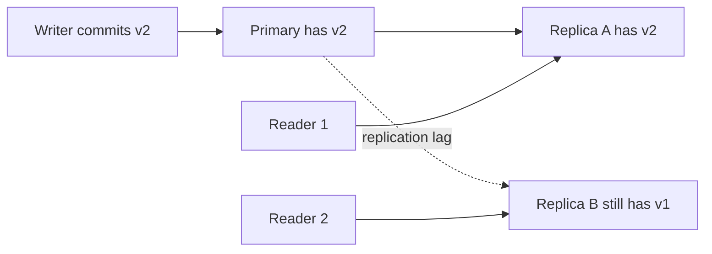
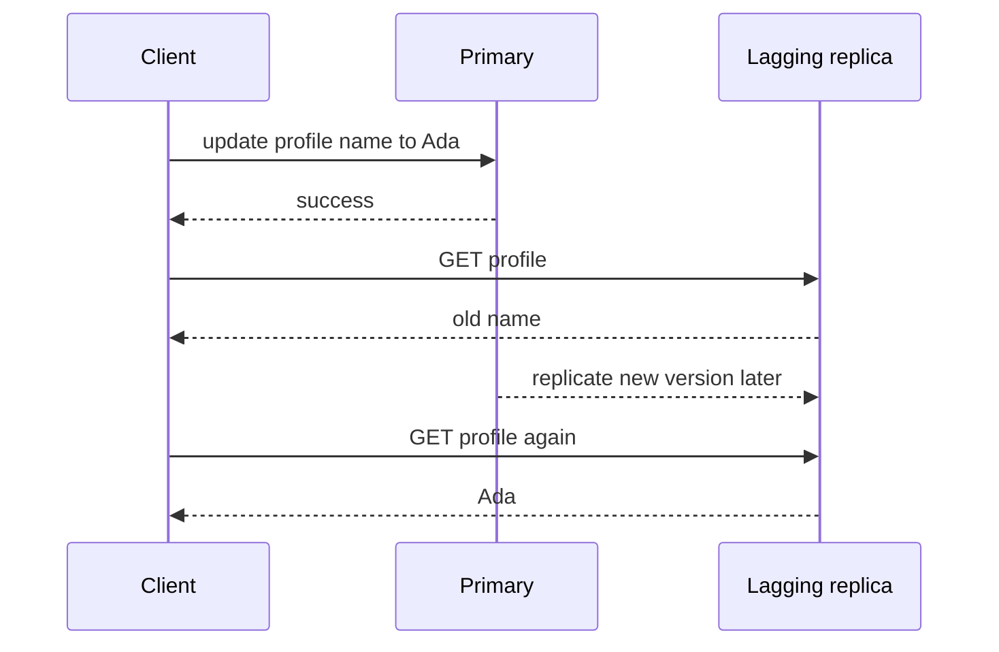
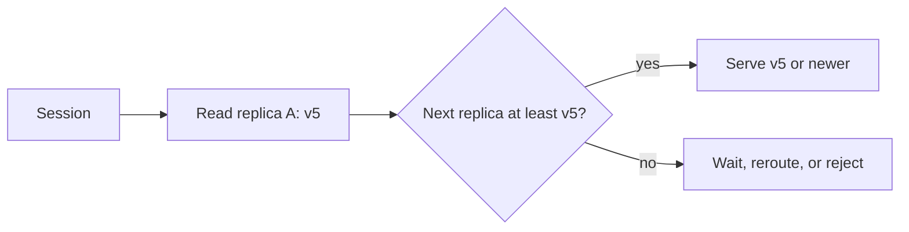
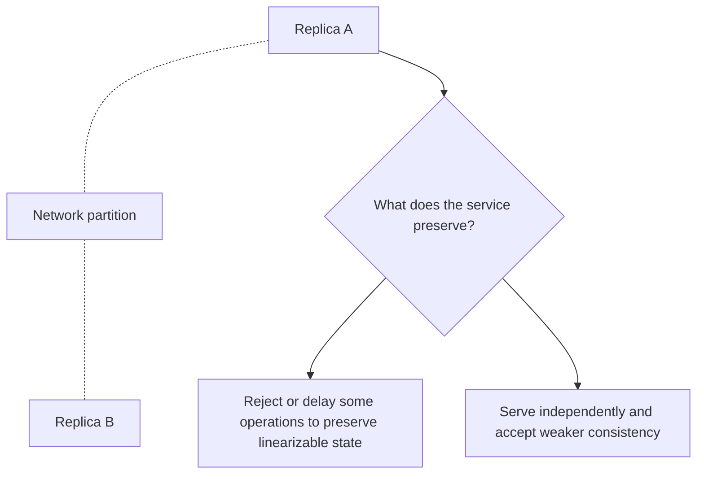

# Distributed Consistency: Reason About What Different Readers Can Observe

## TL;DR

Distributed consistency is an **observable contract** about which writes a reader may see, in what order, and how stale that view may be when copies of state live on different machines.

The useful question is not “is this database strongly consistent?” It is:

- after a successful write, which readers must see it immediately?
- can one client move backward to an older version?
- must causally related writes be observed in order?
- can a read intentionally return an older snapshot?
- what happens when replicas cannot communicate?

<TermBox term="Staleness">
**Staleness** is the gap between the newest committed state that exists and the older state a read is allowed to observe. The gap may be unbounded, time-bounded, version-bounded, or forbidden by the read contract.
</TermBox>

## Consistency is about observations, not durability

A write can be durable and still not be immediately visible everywhere.

For example, Amazon DynamoDB documents that a successful write can be durably persisted while an eventually consistent read may temporarily return an older value. That is not data loss. It is a visibility contract.

Separate these dimensions:

| Dimension | Question |
| --- | --- |
| Durability | Once acknowledged, can the write survive failures? |
| Availability | Can a request get a response now? |
| Consistency | Which committed writes may this read observe? |
| Isolation | How do concurrent transactions appear to interact? |

**Consistency and isolation are related but not interchangeable.** Isolation is primarily about concurrent transaction interleavings on one logical database history. Distributed consistency is about what observers see across replicas, sessions, and time.

## Eventual consistency allows temporary disagreement

With **eventual consistency**, replicas may disagree for a while after a write. If writes stop and communication continues, replicas are expected to converge.

That definition does not automatically provide:

- read-your-writes;
- monotonic reads;
- a maximum staleness bound;
- causal ordering;
- linearizability.

A system can converge eventually while a user still experiences confusing behavior in the meantime.

## Session guarantees remove specific anomalies

Many applications do not require every reader in the world to see the latest write immediately. They require a smaller guarantee for one user or session.

### Read-your-writes

**Read-your-writes** means that after a client observes its write succeed, later reads in the same relevant session do not return a state older than that write.

Common implementation mechanisms include:

- route that user's next read to the writer or primary;
- wait for a replica to catch up to a required log position;
- carry a session token or version fence and reject replicas that are behind it;
- perform a stronger read only for the post-write path.

### Monotonic reads

**Monotonic reads** mean that once a client has observed version `v5`, later reads in the same session do not move backward to `v4`.

This matters even without a write by that client. A load balancer that sends sequential reads to replicas at different replication positions can otherwise make state appear to travel backward in time.

## Causal consistency preserves dependency order

If operation B depends on operation A, a causally consistent system does not let an observer see B without the relevant effect of A.

Example:

1. user publishes a post;
2. another service creates a comment that references that post;
3. a reader should not observe the comment while still seeing a world in which the post does not exist.

<TermBox term="Causal Consistency">
**Causal consistency** preserves the order of operations that are related by cause and effect, while independent concurrent operations may still be observed in different orders by different readers.
</TermBox>

Causal consistency is stronger than unconstrained eventual consistency but weaker than requiring one global real-time order for all operations.

## Linearizability behaves like one current copy

A **linearizable** read/write object behaves as if every operation took effect atomically at one point between its invocation and response, and that order respects real time.

If write `W1` completes before read `R1` begins, `R1` cannot legally return a value older than `W1` for that object.

<TermBox term="Linearizability">
**Linearizability** is a real-time consistency property for operations on an object: completed operations appear in one order that respects real-time precedence. It is stronger than eventual or session consistency and should not be confused with transaction serializability.
</TermBox>

Google Cloud Spanner documents external consistency for transactions, which is stronger than single-object linearizability because it also constrains transaction ordering.

## Bounded staleness makes the lag explicit

Some workloads can tolerate stale data if the bound is explicit.

A **bounded-staleness** contract may say that a read is at most:

- `K` versions behind; or
- `T` seconds behind.

Azure Cosmos DB, for example, documents bounded staleness in those terms and separately exposes session consistency with read-your-writes behavior.

This is often easier to operate than a vague “usually fresh” promise because the product can decide whether the bound is acceptable for each path.

## Quorum is a mechanism, not a guarantee name

Replication systems often use quorums. With `N` replicas, a write may wait for `W` acknowledgements and a read may consult `R` replicas.

An intersection such as `R + W > N` can help a read encounter at least one replica that participated in the latest successful write under the model's assumptions.

But **quorum arithmetic alone does not prove linearizability**. Correctness also depends on details such as:

- how versions are ordered;
- whether concurrent writes can conflict;
- how failed or slow replicas rejoin;
- whether the read performs repair or chooses the newest version correctly;
- whether membership can change;
- what exactly “successful write” means.

Treat quorum as part of the protocol you must analyze, not as a synonym for “strong consistency.”

## CAP applies during a partition

CAP is often compressed into “pick two of three,” which hides the useful part.

The Gilbert-Lynch result formalizes a trade-off between **linearizable consistency** and **availability** when a network partition prevents required components from communicating.

Important boundaries:

- partition tolerance is not a performance feature you casually switch off in a real network;
- CAP does not say latency never matters outside partitions;
- CAP does not classify a whole database forever as simply “CP” or “AP” for every operation;
- different operations and read modes can make different choices.

When no partition exists, systems still trade latency, coordination cost, freshness, and throughput.

## Choose the guarantee from the product invariant

Do not start with a database checkbox. Start with the user-visible invariant.

| Product path | Typical observation requirement |
| --- | --- |
| user edits profile, then reloads | read-your-writes |
| analytics dashboard | bounded or eventual staleness may be fine |
| inventory decrement before checkout approval | stronger coordination may be required |
| social feed ranking | eventual consistency may be acceptable |
| authorization revocation | stale reads may be security-sensitive |
| workflow step depending on prior step | causal or explicitly version-fenced reads |

A stronger guarantee can cost more latency or coordination. A weaker guarantee can push complexity into application reconciliation and UX.

## Production scenario: successful update, stale confirmation page

A user changes the shipping address on an order. The API writes to the primary database and returns success. The browser immediately loads the confirmation page, but that GET is routed to a read replica that is 900 ms behind.

The page shows the old address. The user retries the update. A downstream workflow now sees two legitimate writes and support receives a “your site lost my change” ticket even though no committed write was lost.

**Impact:** users see state go backward after a successful action, repeat operations unnecessarily, and lose trust in the confirmation path.

**Root cause:** the team treated asynchronous replica lag as an infrastructure detail instead of defining a read-your-writes consistency contract for the post-update journey.

**Correct pattern:** attach the committed version or replication position to the session, then route the immediate follow-up read to the primary or to a replica that has caught up to that fence. Keep ordinary browse traffic on eventually consistent replicas if stale data is acceptable there. Measure replica lag and the frequency of fallback-to-primary so the stronger path remains observable.

## Consistency failures are often routing failures

When debugging stale or contradictory reads, inspect the full observation path:

- which replica answered the read;
- what version or log position it had;
- which version the client had already observed;
- whether the session token or version fence survived proxies and retries;
- whether failover changed the writer or replica set;
- whether caches introduced another stale layer;
- whether the application silently mixed strong and eventual read APIs.

The storage engine can satisfy its documented contract while the application still violates the user-visible contract through careless routing.

## Self-check

A user writes `status=PAID`, receives success, then immediately reads from another region and sees `status=PENDING`. Five seconds later the same read returns `PAID`. Was durability necessarily violated?

Show the reasoning

No. The write may have been durably committed while the remote read path was allowed to be stale. The first question is which consistency contract governed the cross-region read. If the product requires read-your-writes, the application needs a stronger read path, session token, version fence, or routing rule. If eventual consistency is acceptable, the temporary stale observation can be within contract.

## Review checklist

- [ ] **Observation contract:** State which committed writes each read path must be able to observe.
- [ ] **Read-your-writes:** Protect user journeys that must immediately reflect their own successful writes.
- [ ] **Monotonic reads:** Prevent a session from moving backward to an older version when that would be confusing or unsafe.
- [ ] **Causal order:** Preserve cause-and-effect dependencies where later state is meaningless without earlier state.
- [ ] **Staleness bound:** Use an explicit time/version bound when eventual freshness is acceptable but unlimited lag is not.
- [ ] **Replica lag:** Measure lag and include the serving replica/version in production evidence.
- [ ] **Quorum semantics:** Verify the full protocol instead of assuming quorum arithmetic implies linearizability.
- [ ] **Partition behavior:** Decide which operations delay, fail, or weaken guarantees when communication is cut.
- [ ] **Cache layers:** Include CDN, application cache, and client cache in the consistency model.

## Agent rule

- [ ] **Name the guarantee, not the product:** Translate “strong,” “eventual,” or vendor-specific labels into observable behavior.
- [ ] **Recover the read path:** Identify writer, replicas, routing, caches, session state, and version propagation before diagnosing inconsistency.
- [ ] **Respect scope:** Do not infer global linearizability from one strongly consistent API, one quorum equation, or one region's behavior.
- [ ] **Separate dimensions:** Keep durability, availability, consistency, and transaction isolation distinct in explanations and tests.
- [ ] **Model partition behavior:** State what happens when replicas cannot coordinate instead of repeating “CAP means pick two.”
- [ ] **Prove user-visible invariants:** Test post-write reads, replica switching, failover, stale caches, and session-token loss against the product contract.

## Sources

Primary sources checked on **2026-09-16**:

- [Amazon DynamoDB — Read consistency](https://docs.aws.amazon.com/amazondynamodb/latest/developerguide/HowItWorks.ReadConsistency.html)
- [Azure Cosmos DB — Consistency level choices](https://learn.microsoft.com/en-us/azure/cosmos-db/consistency-levels)
- [Google Cloud Spanner — TrueTime and external consistency](https://docs.cloud.google.com/spanner/docs/true-time-external-consistency)
- [Gilbert & Lynch — Brewer's conjecture and the feasibility of Consistent, Available, Partition-Tolerant web services](https://groups.csail.mit.edu/tds/papers/Gilbert/Brewer6.pdf)
