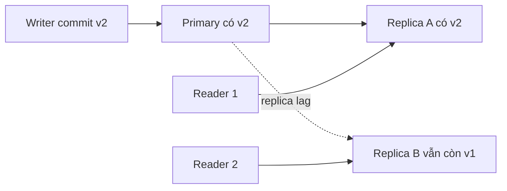
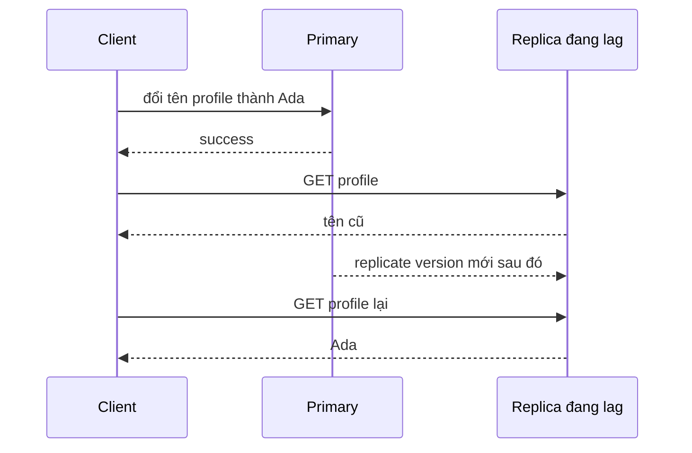
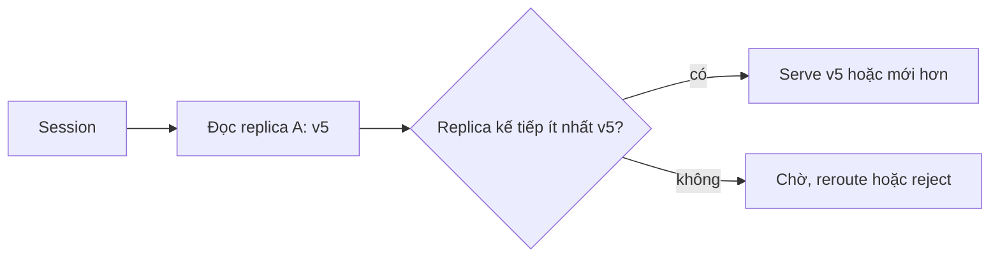
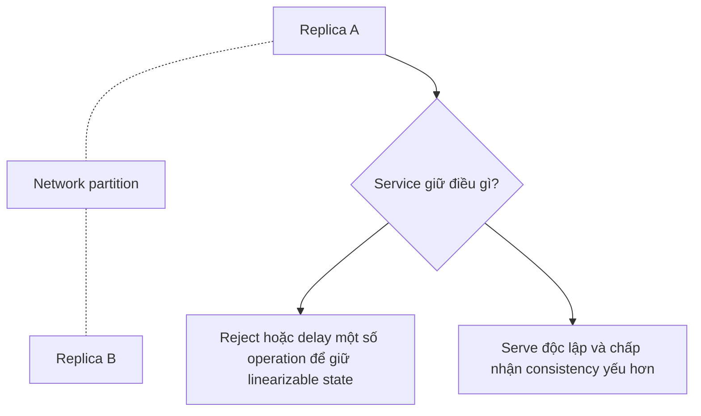

# Tính nhất quán phân tán: Suy luận về điều các reader có thể quan sát

## Tóm tắt

Distributed consistency là một **contract quan sát được** về write nào một reader được phép thấy, theo thứ tự nào và view đó có thể cũ đến mức nào khi nhiều bản sao state nằm trên các máy khác nhau.

Câu hỏi hữu ích không phải “database này có strong consistency không?” mà là:

- sau một write thành công, reader nào phải thấy nó ngay?
- một client có thể quay lại phiên bản cũ hơn không?
- các write có quan hệ nhân quả có phải được quan sát theo đúng thứ tự không?
- read có được chủ động trả về snapshot cũ hơn không?
- chuyện gì xảy ra khi replica không liên lạc được với nhau?

<TermBox term="Staleness">
**Staleness / độ cũ** là khoảng cách giữa state mới nhất đã commit và state cũ hơn mà read vẫn được phép quan sát. Khoảng cách này có thể không giới hạn, bị giới hạn theo thời gian, bị giới hạn theo version hoặc bị cấm hoàn toàn bởi read contract.
</TermBox>

## Consistency nói về observation, không phải durability

Một write có thể bền vững nhưng chưa lập tức nhìn thấy ở mọi nơi.

Ví dụ, Amazon DynamoDB document rằng một write thành công có thể đã được persist bền vững trong khi eventually consistent read tạm thời vẫn trả về giá trị cũ. Đây không phải mất dữ liệu. Đây là visibility contract.

Hãy tách các chiều sau:

| Chiều | Câu hỏi |
| --- | --- |
| Durability | Sau khi acknowledge, write có sống sót qua failure không? |
| Availability | Request có nhận được response ngay lúc này không? |
| Consistency | Read này được phép quan sát những write đã commit nào? |
| Isolation | Các transaction đồng thời trông như tương tác với nhau ra sao? |

**Consistency và isolation có liên quan nhưng không đồng nghĩa.** Isolation chủ yếu nói về cách các transaction đồng thời được biểu diễn trong một logical database history. Distributed consistency nói về điều observer thấy qua replica, session và thời gian.

## Eventual consistency cho phép bất đồng tạm thời

Với **eventual consistency / nhất quán cuối cùng**, các replica có thể bất đồng một thời gian sau write. Nếu write dừng lại và communication tiếp tục, các replica được kỳ vọng sẽ hội tụ.

Định nghĩa đó không tự động cung cấp:

- read-your-writes;
- monotonic reads;
- giới hạn staleness tối đa;
- causal ordering;
- linearizability.

Một hệ thống có thể eventual converge trong khi user vẫn gặp hành vi khó hiểu ở khoảng thời gian trước đó.

## Session guarantee loại bỏ từng loại anomaly cụ thể

Nhiều ứng dụng không cần mọi reader trên toàn cầu lập tức thấy write mới nhất. Chúng cần guarantee hẹp hơn cho một user hoặc session.

### Read-your-writes

**Read-your-writes** nghĩa là sau khi client thấy write của chính mình thành công, các read tiếp theo trong session liên quan không trả về state cũ hơn write đó.

Cơ chế triển khai thường gặp:

- route read tiếp theo của user về writer hoặc primary;
- chờ replica catch up đến log position bắt buộc;
- mang theo session token hoặc version fence và không dùng replica đang đứng sau fence;
- chỉ dùng stronger read cho post-write path.

### Monotonic reads

**Monotonic reads / đọc đơn điệu** nghĩa là khi client đã thấy version `v5`, các read sau trong cùng session không quay ngược lại `v4`.

Điều này quan trọng ngay cả khi client đó không tự write. Load balancer gửi các read tuần tự sang replica ở các replication position khác nhau có thể làm state trông như đi ngược thời gian.

## Causal consistency giữ đúng thứ tự nhân quả

Nếu operation B phụ thuộc operation A, hệ thống có causal consistency không để observer thấy B mà chưa thấy effect liên quan của A.

Ví dụ:

1. user publish một post;
2. service khác tạo comment tham chiếu post đó;
3. reader không nên thấy comment trong một thế giới mà post vẫn chưa tồn tại.

<TermBox term="Causal Consistency">
**Causal consistency / nhất quán nhân quả** giữ thứ tự của các operation có quan hệ nguyên nhân-kết quả, trong khi các operation concurrent độc lập vẫn có thể được các reader khác nhau quan sát theo thứ tự khác nhau.
</TermBox>

Causal consistency mạnh hơn eventual consistency không ràng buộc, nhưng yếu hơn việc yêu cầu một global real-time order cho mọi operation.

## Linearizability hành xử như chỉ có một bản sao hiện tại

Một read/write object **linearizable / có tính tuyến tính** hành xử như thể mỗi operation có hiệu lực atomically tại một điểm giữa invocation và response, và thứ tự đó tôn trọng real time.

Nếu write `W1` hoàn tất trước khi read `R1` bắt đầu, `R1` không được phép trả về value cũ hơn `W1` cho object đó.

<TermBox term="Linearizability">
**Linearizability** là consistency property theo real time cho operation trên một object: các operation đã hoàn tất xuất hiện trong một thứ tự duy nhất tôn trọng real-time precedence. Nó mạnh hơn eventual consistency hoặc session consistency và không nên bị nhầm với transaction serializability.
</TermBox>

Google Cloud Spanner document external consistency cho transaction, mạnh hơn linearizability trên một object vì nó còn ràng buộc thứ tự transaction.

## Bounded staleness làm độ lag trở nên tường minh

Một số workload chấp nhận dữ liệu cũ nếu giới hạn được nói rõ.

Một **bounded-staleness** contract có thể nói read được phép chậm tối đa:

- `K` version; hoặc
- `T` giây.

Azure Cosmos DB document bounded staleness theo các dạng này và tách riêng session consistency có read-your-writes behavior.

Đây thường dễ vận hành hơn lời hứa mơ hồ “thường khá mới”, vì product có thể quyết định bound nào chấp nhận được cho từng path.

## Quorum là cơ chế, không phải tên guarantee

Replication system thường dùng quorum. Với `N` replica, write có thể chờ `W` acknowledgement và read có thể hỏi `R` replica.

Giao nhau như `R + W > N` có thể giúp một read gặp ít nhất một replica từng tham gia successful write mới nhất theo assumptions của model.

Nhưng **quorum arithmetic tự nó không chứng minh linearizability**. Correctness còn phụ thuộc các chi tiết như:

- version được sắp thứ tự ra sao;
- concurrent write conflict thế nào;
- replica fail/chậm rejoin ra sao;
- read repair hoặc chọn newest version có đúng không;
- membership có đổi được không;
- “successful write” thực sự nghĩa là gì.

Hãy xem quorum là một phần protocol cần phân tích, không phải từ đồng nghĩa của “strong consistency”.

## CAP áp dụng khi có network partition

CAP thường bị rút gọn thành “pick two of three”, làm mất phần hữu ích nhất.

Kết quả Gilbert-Lynch formalize đánh đổi giữa **linearizable consistency** và **availability** khi network partition ngăn các component cần phối hợp liên lạc với nhau.

Các boundary quan trọng:

- partition tolerance không phải performance feature có thể tùy ý tắt trên network thực;
- CAP không nói latency ngừng quan trọng khi không có partition;
- CAP không phân loại toàn bộ database mãi mãi chỉ bằng nhãn “CP” hoặc “AP” cho mọi operation;
- operation và read mode khác nhau có thể chọn trade-off khác nhau.

Khi không có partition, hệ thống vẫn đánh đổi latency, coordination cost, freshness và throughput.

## Chọn guarantee từ product invariant

Đừng bắt đầu từ checkbox của database. Bắt đầu từ invariant user nhìn thấy.

| Product path | Observation requirement thường gặp |
| --- | --- |
| user sửa profile rồi reload | read-your-writes |
| analytics dashboard | bounded hoặc eventual staleness có thể chấp nhận |
| trừ inventory trước khi approve checkout | có thể cần coordination mạnh hơn |
| social feed ranking | eventual consistency có thể ổn |
| revoke authorization | stale read có thể nhạy cảm về security |
| workflow step phụ thuộc step trước | causal hoặc read có version fence rõ |

Guarantee mạnh hơn có thể tốn latency hoặc coordination hơn. Guarantee yếu hơn có thể đẩy complexity sang reconciliation và UX của application.

## Kịch bản production: update thành công nhưng confirmation vẫn cũ

User đổi shipping address của order. API write vào primary database và trả success. Browser lập tức load confirmation page, nhưng GET đó được route sang read replica đang chậm 900 ms.

Trang vẫn hiện address cũ. User retry update. Downstream workflow giờ thấy hai write hợp lệ và support nhận ticket “site làm mất thay đổi của tôi” dù không có committed write nào bị mất.

**Hậu quả:** user thấy state đi ngược sau một action thành công, lặp operation không cần thiết và mất niềm tin vào confirmation path.

**Nguyên nhân cốt lõi:** team xem asynchronous replica lag là chi tiết infrastructure thay vì định nghĩa read-your-writes consistency contract cho journey ngay sau update.

**Cách khắc phục chuẩn:** gắn committed version hoặc replication position vào session, rồi route immediate follow-up read về primary hoặc replica đã catch up tới fence đó. Giữ browse traffic bình thường trên eventually consistent replica nếu stale data chấp nhận được. Đo replica lag và tỷ lệ fallback-to-primary để stronger path vẫn có observability.

## Consistency failure thường là routing failure

Khi debug stale hoặc contradictory read, hãy inspect toàn bộ observation path:

- replica nào serve read;
- nó đang ở version hoặc log position nào;
- client trước đó đã thấy version nào;
- session token hoặc version fence có sống qua proxy/retry không;
- failover có đổi writer hoặc replica set không;
- cache có tạo thêm một stale layer không;
- application có âm thầm trộn strong read API với eventual read API không.

Storage engine có thể thỏa documented contract trong khi application vẫn vi phạm user-visible contract vì route không cẩn thận.

## Tự kiểm tra

User write `status=PAID`, nhận success, rồi lập tức read từ region khác và thấy `status=PENDING`. Năm giây sau cùng read đó trả `PAID`. Durability có nhất thiết bị vi phạm không?

Show the reasoning

Không. Write có thể đã commit bền vững trong khi remote read path vẫn được phép stale. Câu hỏi đầu tiên là consistency contract nào áp dụng cho cross-region read. Nếu product yêu cầu read-your-writes, application cần stronger read path, session token, version fence hoặc routing rule. Nếu eventual consistency là đủ, stale observation tạm thời có thể vẫn đúng contract.

## Checklist review

- [ ] **Observation contract:** Nói rõ committed write nào từng read path bắt buộc phải quan sát được.
- [ ] **Read-your-writes:** Bảo vệ user journey cần phản ánh ngay write thành công của chính user đó.
- [ ] **Monotonic reads:** Không để session quay lại version cũ hơn khi điều đó gây khó hiểu hoặc không an toàn.
- [ ] **Causal order:** Giữ dependency nguyên nhân-kết quả khi state sau vô nghĩa nếu thiếu state trước.
- [ ] **Staleness bound:** Dùng bound theo thời gian/version khi eventual freshness chấp nhận được nhưng lag vô hạn thì không.
- [ ] **Replica lag:** Đo lag và đưa serving replica/version vào production evidence.
- [ ] **Quorum semantics:** Kiểm chứng toàn protocol thay vì giả định quorum arithmetic đồng nghĩa linearizability.
- [ ] **Partition behavior:** Quyết định operation nào delay, fail hoặc yếu guarantee khi communication bị cắt.
- [ ] **Cache layers:** Đưa CDN, application cache và client cache vào consistency model.

## Agent rule

- [ ] **Gọi tên guarantee, không gọi tên product:** Dịch “strong”, “eventual” hoặc vendor label thành behavior quan sát được.
- [ ] **Recover read path:** Xác định writer, replica, routing, cache, session state và version propagation trước khi chẩn đoán inconsistency.
- [ ] **Tôn trọng scope:** Không suy ra global linearizability từ một strongly consistent API, một quorum equation hoặc behavior của một region.
- [ ] **Tách các chiều:** Giữ durability, availability, consistency và transaction isolation riêng biệt trong giải thích và test.
- [ ] **Mô hình partition behavior:** Nói rõ chuyện gì xảy ra khi replica không phối hợp được thay vì lặp “CAP nghĩa là pick two.”
- [ ] **Chứng minh invariant user nhìn thấy:** Test post-write read, replica switching, failover, stale cache và session-token loss theo product contract.

## Nguồn

Nguồn chính kiểm tra ngày **2026-09-16**:

- [Amazon DynamoDB — Read consistency](https://docs.aws.amazon.com/amazondynamodb/latest/developerguide/HowItWorks.ReadConsistency.html)
- [Azure Cosmos DB — Consistency level choices](https://learn.microsoft.com/en-us/azure/cosmos-db/consistency-levels)
- [Google Cloud Spanner — TrueTime and external consistency](https://docs.cloud.google.com/spanner/docs/true-time-external-consistency)
- [Gilbert & Lynch — Brewer's conjecture and the feasibility of Consistent, Available, Partition-Tolerant web services](https://groups.csail.mit.edu/tds/papers/Gilbert/Brewer6.pdf)
