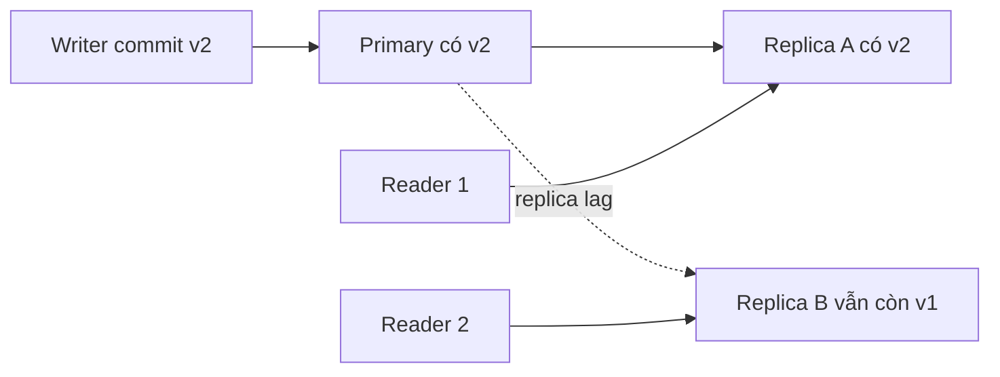
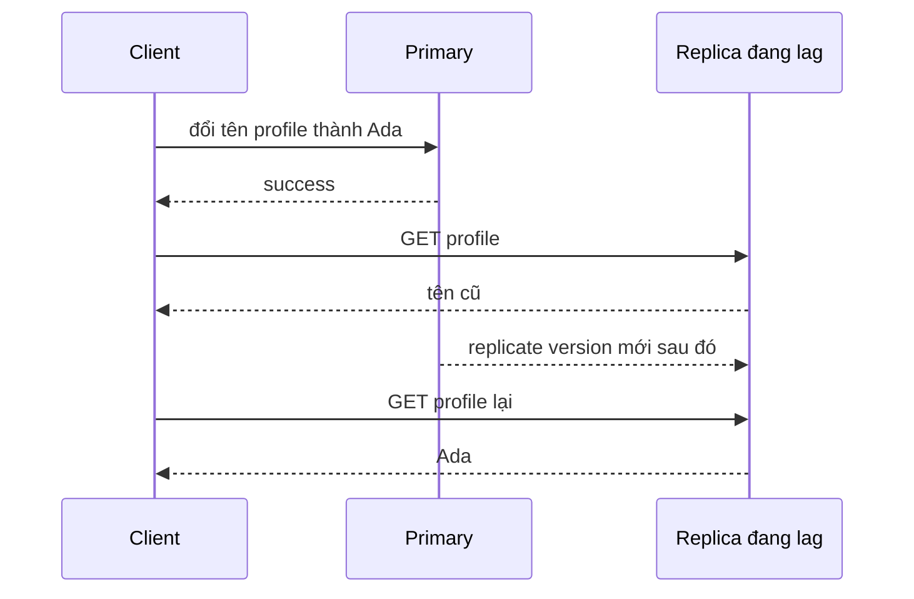
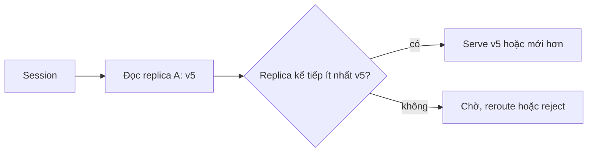
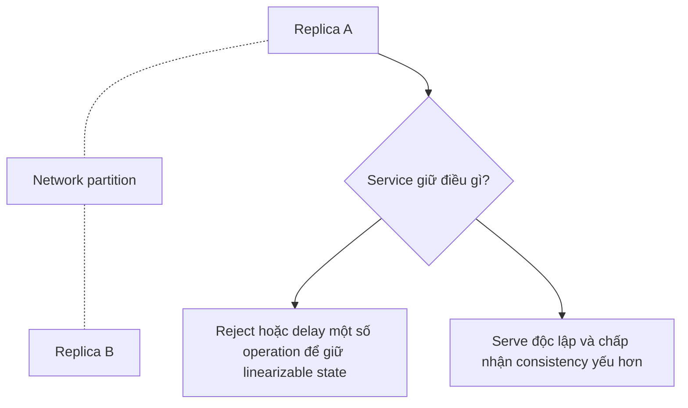

# Tính nhất quán phân tán: Suy luận về điều các reader có thể quan sát

Khách hàng vừa đổi địa chỉ giao hàng của đơn hàng vừa đặt và bấm "Lưu thay đổi". API ghi thành công vào database PostgreSQL primary, phản hồi mã `200 OK`, rồi chuyển hướng trình duyệt sang trang tóm tắt đơn hàng. Thế nhưng, request tải trang ngay sau đó lại được bộ cân bằng tải điều phối vào một read replica đang bị trễ sao chép (replica lag) 900 mili-giây. Màn hình hiện ra địa chỉ *cũ mèm*! Khách hàng hoang mang tột độ tưởng hệ thống bị lỗi, cuống cuồng sửa lại và bấm lưu liên tiếp ba lần. Bộ phận kho vận nhận một loạt cập nhật xung đột, còn đội ngũ hỗ trợ khách hàng nhận được email khiếu nại gay gắt: *"Website làm mất địa chỉ giao hàng của tôi!"* Thực tế không hề có byte dữ liệu nào bị mất hay hỏng trên đĩa—hệ thống chỉ vừa vi phạm hợp đồng nhất quán đọc-sau-khi-ghi (read-your-writes).

Tính nhất quán phân tán không phải là một ô checkbox tiếp thị hay thuộc tính phần cứng của ổ đĩa. Nó xác định ranh giới về mặt thời gian và quan hệ nhân quả đối với những gì người quan sát (reader) được phép thấy khi dữ liệu được nhân bản trên nhiều máy chủ khác nhau.

## TL;DR

> 💡 **Quy tắc bỏ túi:** Tính nhất quán không phải là dữ liệu có an toàn trên đĩa hay không (đó là tính bền vững - durability), mà là người đọc được phép thấy trạng thái nào xuyên suốt không gian và thời gian. Hãy luôn thiết kế dựa trên hợp đồng quan sát (observable contract) rõ ràng thay vì những nhãn mác tiếp thị mơ hồ như "nhất quán mạnh" hay "nhất quán cuối cùng".

- **Nhất quán là một hợp đồng quan sát (Observable contract):** Quy định rõ người đọc được phép thấy những thao tác ghi đã commit nào, theo thứ tự nhân quả ra sao và độ cũ (staleness) tối đa cho phép giữa các bản sao dữ liệu.
- **Nhất quán cuối cùng (Eventual consistency) không đồng nghĩa với dữ liệu mới tức thì:** Các replica chắc chắn sẽ hội tụ khi ngừng ghi, nhưng nếu thiếu cam kết theo phiên (session guarantees), người dùng hoàn toàn có thể đọc phải dữ liệu cũ hoặc thấy dữ liệu nhảy ngược về quá khứ.
- **Session guarantee giải quyết ức chế thực tế của người dùng:** Các mô hình như **read-your-writes** (đọc được chính thay đổi mình vừa ghi) và **monotonic reads** (đọc đơn điệu, không bao giờ thụt lùi về phiên bản cũ hơn) dẹp bỏ trải nghiệm quái đản mà không phải đánh đổi độ trễ và tính sẵn sàng của linearizability toàn cục.
- **Linearizability (tính tuyến tính):** Cam kết nghiêm ngặt theo thời gian thực; mọi thao tác đọc/ghi đều có hiệu lực nguyên tử tại một thời điểm duy nhất trên đồng hồ chuẩn, hành xử như thể toàn hệ thống chỉ có một bản sao duy nhất.
- **Cạm bẫy chết người:** Xem nhẹ độ trễ replica lag như một chi tiết hạ tầng vô hại thay vì gắn session token hoặc version fence để route lượt đọc sau ghi, dẫn đến việc người dùng tưởng mất dữ liệu và liên tục thao tác lặp lại gây nghẽn hệ thống.

<TermBox term="Staleness">
**Staleness / độ cũ** là khoảng cách giữa state mới nhất đã commit và state cũ hơn mà read vẫn được phép quan sát. Khoảng cách này có thể không giới hạn, bị giới hạn theo thời gian, bị giới hạn theo version hoặc bị cấm hoàn toàn bởi read contract.
</TermBox>

## Consistency nói về observation, không phải durability

Một write có thể bền vững nhưng chưa lập tức nhìn thấy ở mọi nơi.

Ví dụ, Amazon DynamoDB document rằng một write thành công có thể đã được persist bền vững trong khi eventually consistent read tạm thời vẫn trả về giá trị cũ. Đây không phải mất dữ liệu. Đây là visibility contract.

Hãy tách các chiều sau:

| Chiều | Câu hỏi |
| --- | --- |
| Durability | Sau khi acknowledge, write có sống sót qua failure không? |
| Availability | Request có nhận được response ngay lúc này không? |
| Consistency | Read này được phép quan sát những write đã commit nào? |
| Isolation | Các transaction đồng thời trông như tương tác với nhau ra sao? |

**Consistency và isolation có liên quan nhưng không đồng nghĩa.** Isolation chủ yếu nói về cách các transaction đồng thời được biểu diễn trong một logical database history. Distributed consistency nói về điều observer thấy qua replica, session và thời gian.

## Eventual consistency cho phép bất đồng tạm thời

Với **eventual consistency / nhất quán cuối cùng**, các replica có thể bất đồng một thời gian sau write. Nếu write dừng lại và communication tiếp tục, các replica được kỳ vọng sẽ hội tụ.

Định nghĩa đó không tự động cung cấp:

- read-your-writes;
- monotonic reads;
- giới hạn staleness tối đa;
- causal ordering;
- linearizability.

Một hệ thống có thể eventual converge trong khi user vẫn gặp hành vi khó hiểu ở khoảng thời gian trước đó.

## Session guarantee loại bỏ từng loại anomaly cụ thể

Nhiều ứng dụng không cần mọi reader trên toàn cầu lập tức thấy write mới nhất. Chúng cần guarantee hẹp hơn cho một user hoặc session.

### Read-your-writes

**Read-your-writes** nghĩa là sau khi client thấy write của chính mình thành công, các read tiếp theo trong session liên quan không trả về state cũ hơn write đó.

Cơ chế triển khai thường gặp:

- route read tiếp theo của user về writer hoặc primary;
- chờ replica catch up đến log position bắt buộc;
- mang theo session token hoặc version fence và không dùng replica đang đứng sau fence;
- chỉ dùng stronger read cho post-write path.

### Monotonic reads

**Monotonic reads / đọc đơn điệu** nghĩa là khi client đã thấy version `v5`, các read sau trong cùng session không quay ngược lại `v4`.

Điều này quan trọng ngay cả khi client đó không tự write. Load balancer gửi các read tuần tự sang replica ở các replication position khác nhau có thể làm state trông như đi ngược thời gian.

## Causal consistency giữ đúng thứ tự nhân quả

Nếu operation B phụ thuộc operation A, hệ thống có causal consistency không để observer thấy B mà chưa thấy effect liên quan của A.

Ví dụ:

1. user publish một post;
2. service khác tạo comment tham chiếu post đó;
3. reader không nên thấy comment trong một thế giới mà post vẫn chưa tồn tại.

<TermBox term="Causal Consistency">
**Causal consistency / nhất quán nhân quả** giữ thứ tự của các operation có quan hệ nguyên nhân-kết quả, trong khi các operation concurrent độc lập vẫn có thể được các reader khác nhau quan sát theo thứ tự khác nhau.
</TermBox>

Causal consistency mạnh hơn eventual consistency không ràng buộc, nhưng yếu hơn việc yêu cầu một global real-time order cho mọi operation.

## Linearizability hành xử như chỉ có một bản sao hiện tại

Một read/write object **linearizable / có tính tuyến tính** hành xử như thể mỗi operation có hiệu lực atomically tại một điểm giữa invocation và response, và thứ tự đó tôn trọng real time.

Nếu write `W1` hoàn tất trước khi read `R1` bắt đầu, `R1` không được phép trả về value cũ hơn `W1` cho object đó.

<TermBox term="Linearizability">
**Linearizability** là consistency property theo real time cho operation trên một object: các operation đã hoàn tất xuất hiện trong một thứ tự duy nhất tôn trọng real-time precedence. Nó mạnh hơn eventual consistency hoặc session consistency và không nên bị nhầm với transaction serializability.
</TermBox>

Google Cloud Spanner document external consistency cho transaction, mạnh hơn linearizability trên một object vì nó còn ràng buộc thứ tự transaction.

## Bounded staleness làm độ lag trở nên tường minh

Một số workload chấp nhận dữ liệu cũ nếu giới hạn được nói rõ.

Một **bounded-staleness** contract có thể nói read được phép chậm tối đa:

- `K` version; hoặc
- `T` giây.

Azure Cosmos DB document bounded staleness theo các dạng này và tách riêng session consistency có read-your-writes behavior.

Đây thường dễ vận hành hơn lời hứa mơ hồ “thường khá mới”, vì product có thể quyết định bound nào chấp nhận được cho từng path.

## Quorum là cơ chế, không phải tên guarantee

Replication system thường dùng quorum. Với `N` replica, write có thể chờ `W` acknowledgement và read có thể hỏi `R` replica.

Giao nhau như `R + W > N` có thể giúp một read gặp ít nhất một replica từng tham gia successful write mới nhất theo assumptions của model.

Nhưng **quorum arithmetic tự nó không chứng minh linearizability**. Correctness còn phụ thuộc các chi tiết như:

- version được sắp thứ tự ra sao;
- concurrent write conflict thế nào;
- replica fail/chậm rejoin ra sao;
- read repair hoặc chọn newest version có đúng không;
- membership có đổi được không;
- “successful write” thực sự nghĩa là gì.

Hãy xem quorum là một phần protocol cần phân tích, không phải từ đồng nghĩa của “strong consistency”.

## CAP áp dụng khi có network partition

CAP thường bị rút gọn thành “pick two of three”, làm mất phần hữu ích nhất.

Kết quả Gilbert-Lynch formalize đánh đổi giữa **linearizable consistency** và **availability** khi network partition ngăn các component cần phối hợp liên lạc với nhau.

Các boundary quan trọng:

- partition tolerance không phải performance feature có thể tùy ý tắt trên network thực;
- CAP không nói latency ngừng quan trọng khi không có partition;
- CAP không phân loại toàn bộ database mãi mãi chỉ bằng nhãn “CP” hoặc “AP” cho mọi operation;
- operation và read mode khác nhau có thể chọn trade-off khác nhau.

Khi không có partition, hệ thống vẫn đánh đổi latency, coordination cost, freshness và throughput.

## Chọn guarantee từ product invariant

Đừng bắt đầu từ checkbox của database. Bắt đầu từ invariant user nhìn thấy.

| Product path | Observation requirement thường gặp |
| --- | --- |
| user sửa profile rồi reload | read-your-writes |
| analytics dashboard | bounded hoặc eventual staleness có thể chấp nhận |
| trừ inventory trước khi approve checkout | có thể cần coordination mạnh hơn |
| social feed ranking | eventual consistency có thể ổn |
| revoke authorization | stale read có thể nhạy cảm về security |
| workflow step phụ thuộc step trước | causal hoặc read có version fence rõ |

Guarantee mạnh hơn có thể tốn latency hoặc coordination hơn. Guarantee yếu hơn có thể đẩy complexity sang reconciliation và UX của application.

## Kịch bản production thực chiến: Cập nhật thành công, trang xác nhận vẫn hiện dữ liệu cũ

Người dùng đổi địa chỉ giao hàng trên đơn hàng vừa đặt. API ghi vào database PostgreSQL primary và trả về phản hồi thành công. Trình duyệt lập tức tải trang xác nhận, nhưng request GET đó bị bộ cân bằng tải điều hướng sang một read replica đang bị trễ sao chép (replica lag) 900 ms.

Trang web vẫn hiển thị địa chỉ cũ. Người dùng hoang mang bấm cập nhật lại lần nữa. Workflow hạ nguồn giờ đây ghi nhận hai lượt ghi hợp lệ và đội ngũ chăm sóc khách hàng nhận được ticket khiếu nại "website làm mất dữ liệu của tôi" dù không hề có lượt ghi đã commit nào bị mất mát.

**Hậu quả:** Người dùng thấy trạng thái hệ thống đi lùi về quá khứ sau một thao tác thành công, dẫn đến việc lặp lại thao tác không cần thiết và đánh mất niềm tin vào hệ thống.

**Nguyên nhân cốt lõi:** Đội ngũ phát triển xem nhẹ độ trễ sao chép bất đồng bộ (asynchronous replica lag) như một chi tiết hạ tầng vô hại thay vì thiết lập một hợp đồng nhất quán đọc-sau-khi-ghi (read-your-writes) cho hành trình người dùng ngay sau thao tác cập nhật.

**Cách khắc phục chuẩn:** Gắn phiên bản đã commit hoặc vị trí replication log vào session của người dùng, rồi định tuyến (route) lượt đọc kế tiếp về thẳng primary hoặc về replica đã đuổi kịp mốc version fence đó. Giữ lưu lượng duyệt xem thông thường trên các replica nhất quán cuối cùng (eventual consistency) nếu việc đọc dữ liệu cũ trong vài giây là chấp nhận được. Đồng thời đo lường độ trễ replica lag và tỷ lệ fallback về primary để duy trì khả năng quan sát (observability) cho hệ thống.

## Sự cố nhất quán thường bắt nguồn từ lỗi định tuyến

Khi điều tra các trường hợp đọc dữ liệu cũ hoặc mâu thuẫn, hãy kiểm tra toàn bộ đường dẫn quan sát (observation path):

- Replica nào đã phục vụ yêu cầu đọc;
- Replica đó đang ở phiên bản hoặc vị trí log nào;
- Client trước đó đã quan sát thấy phiên bản nào;
- Session token hoặc version fence có sống sót qua proxy và các lượt retry không;
- Quá trình failover có thay đổi node writer hoặc tập hợp replica không;
- Tầng cache (Redis, CDN) có tạo thêm một lớp dữ liệu cũ không;
- Ứng dụng có đang âm thầm trộn lẫn API đọc mạnh (strong read) với API đọc nhất quán cuối cùng (eventual read) không.

Hệ thống lưu trữ bên dưới có thể tuân thủ 100% hợp đồng cam kết trong tài liệu, trong khi ứng dụng phía trên vẫn vi phạm hợp đồng mà người dùng nhìn thấy chỉ vì cơ chế định tuyến bất cẩn.

## Tự kiểm tra

Một người dùng cập nhật `status=PAID`, nhận được thông báo thành công, rồi lập tức gửi yêu cầu đọc từ một region khác và thấy `status=PENDING`. Năm giây sau, cùng yêu cầu đọc đó lại trả về `PAID`. Liệu tính bền vững (durability) của hệ thống có nhất thiết bị vi phạm không?

Xem giải thích chi tiết

Hoàn toàn không. Lượt ghi có thể đã được lưu trữ bền vững trên đĩa ngay từ đầu, trong khi đường dẫn đọc liên vùng (cross-region) được thiết kế cho phép có độ trễ nhất định. Câu hỏi đầu tiên cần làm rõ là: Hợp đồng nhất quán nào đang chi phối lượt đọc liên vùng này? Nếu nghiệp vụ bắt buộc phải đạt được read-your-writes, ứng dụng cần thiết lập kênh đọc mạnh hơn, mang theo session token, version fence hoặc quy tắc định tuyến phù hợp. Nếu hệ thống chỉ cam kết nhất quán cuối cùng (eventual consistency), thì việc quan sát thấy dữ liệu cũ tạm thời là hoàn toàn hợp lệ theo đúng hợp đồng thiết kế.

## Checklist review

- [ ] **Observation contract:** Nói rõ committed write nào từng read path bắt buộc phải quan sát được.
- [ ] **Read-your-writes:** Bảo vệ user journey cần phản ánh ngay write thành công của chính user đó.
- [ ] **Monotonic reads:** Không để session quay lại version cũ hơn khi điều đó gây khó hiểu hoặc không an toàn.
- [ ] **Causal order:** Giữ dependency nguyên nhân-kết quả khi state sau vô nghĩa nếu thiếu state trước.
- [ ] **Staleness bound:** Dùng bound theo thời gian/version khi eventual freshness chấp nhận được nhưng lag vô hạn thì không.
- [ ] **Replica lag:** Đo lag và đưa serving replica/version vào production evidence.
- [ ] **Quorum semantics:** Kiểm chứng toàn protocol thay vì giả định quorum arithmetic đồng nghĩa linearizability.
- [ ] **Partition behavior:** Quyết định operation nào delay, fail hoặc yếu guarantee khi communication bị cắt.
- [ ] **Cache layers:** Đưa CDN, application cache và client cache vào consistency model.

## Agent rule

- [ ] **Gọi tên guarantee, không gọi tên product:** Dịch “strong”, “eventual” hoặc vendor label thành behavior quan sát được.
- [ ] **Recover read path:** Xác định writer, replica, routing, cache, session state và version propagation trước khi chẩn đoán inconsistency.
- [ ] **Tôn trọng scope:** Không suy ra global linearizability từ một strongly consistent API, một quorum equation hoặc behavior của một region.
- [ ] **Tách các chiều:** Giữ durability, availability, consistency và transaction isolation riêng biệt trong giải thích và test.
- [ ] **Mô hình partition behavior:** Nói rõ chuyện gì xảy ra khi replica không phối hợp được thay vì lặp “CAP nghĩa là pick two.”
- [ ] **Chứng minh invariant user nhìn thấy:** Test post-write read, replica switching, failover, stale cache và session-token loss theo product contract.

## Nguồn

Nguồn chính kiểm tra ngày **2026-09-16**:

- [Amazon DynamoDB — Read consistency](https://docs.aws.amazon.com/amazondynamodb/latest/developerguide/HowItWorks.ReadConsistency.html)
- [Azure Cosmos DB — Consistency level choices](https://learn.microsoft.com/en-us/azure/cosmos-db/consistency-levels)
- [Google Cloud Spanner — TrueTime and external consistency](https://docs.cloud.google.com/spanner/docs/true-time-external-consistency)
- [Gilbert & Lynch — Brewer's conjecture and the feasibility of Consistent, Available, Partition-Tolerant web services](https://groups.csail.mit.edu/tds/papers/Gilbert/Brewer6.pdf)
