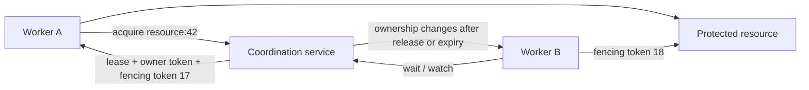
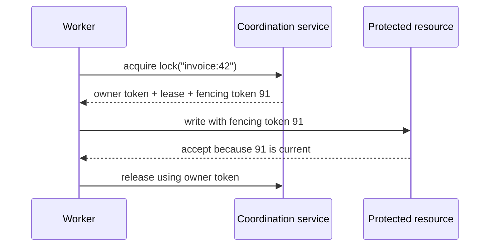

# Distributed Locks: Coordinate Exclusive Work with Leases and Fencing

A backend worker acquires a distributed lock in Redis with a 30-second TTL to process a critical financial settlement. Ten seconds into the task, a severe Stop-The-World garbage collection pause freezes the entire JVM process for 45 seconds. While the worker thread is frozen in time, its lease quietly expires in Redis. A second worker detects the expired lock, claims it with a new lease, and successfully commits fresh updates to the database. Moments later, the first worker awakens from its GC coma, blissfully unaware that its lease has vanished. It proceeds to execute its delayed write—silently overwriting the second worker's valid changes and corrupting financial records.

This scenario exposes the fundamental flaw of treating a distributed lock as a network-wide mutex. Without an end-to-end mechanism to validate whether the writer is still legitimate, mutual exclusion is merely an illusion.

> 💡 **Rule of thumb:** Distributed locks manage coordination order, but only monotonic fencing tokens validated at the target resource can guarantee mutual exclusion. Never assume a thread physically halts when its lease expires.

## TL;DR

- **A distributed lock is a lease-backed ownership protocol, not an in-process mutex:** Unlike local operating system mutexes backed by a unified scheduler, distributed locks grant time-bounded ownership over an unreliable network where processes pause, stall, and desynchronize.
- **Lease expiration guarantees liveness, but cannot prevent stale execution:** TTLs prevent abandoned locks when holders crash, but GC pauses, CPU throttling, and network partitions can cause a holder to outlive its lease while its thread continues mutating external storage.
- **Fencing tokens enforce correctness at the resource boundary:** Every acquired lock must carry a monotonically increasing fencing token. Downstream storage (databases, object stores) must reject any write bearing an older token than the latest one already applied.
- **Safe release requires owner-aware compare-and-delete:** Releasing a lock by blindly deleting the key can delete another worker's newly acquired lock. Always verify that the stored owner token matches the caller's unique token before unlocking.
- **Fatal pitfall:** Relying on client-side timers or lock object checks before writing to storage. Because time runs independently on each node and execution can pause at any instruction, checking "my lease hasn't expired yet" in memory does not prevent a delayed write from corrupting your database after a pause.



<TermBox term="Lease">
A **lease** is time-bounded ownership granted by a coordination system. The holder keeps ownership only while the lease remains valid, usually by renewing it or maintaining a session.

A lease improves liveness because abandoned locks can eventually be released. It does **not** prove that an old holder instantly stops running when the lease expires.
</TermBox>

## A distributed lock is an ownership protocol, not a network mutex

A process-local mutex relies on one runtime and one scheduler. Once a thread acquires it, the runtime can directly prevent another thread from entering the same critical section.

A distributed lock has no such global scheduler. Participants communicate through a coordination service over an unreliable network. A process may hold a lease, pause for garbage collection, lose its session, and resume later without immediately realizing that ownership has moved.

That means the real invariant is not:

> only one process believes it owns the lock

The useful invariant is closer to:

> only work from the **current valid owner** is allowed to affect the protected resource

This distinction matters whenever the critical section touches a database, object store, payment provider, deployment controller, file, queue consumer group, or another system outside the lock service.

## The lock service must establish authoritative ownership

A lock needs one place where ownership is decided. That place is typically a coordination system built on strong ordering or consensus.

etcd exposes a lock service where successful acquisition returns a unique key tied to the caller's lease. Ownership lasts until the key is unlocked or the lease expires. ZooKeeper lock recipes use ephemeral sequential znodes and an ordered namespace so contenders can determine which participant currently owns the lock. Hazelcast's CP Subsystem provides a linearizable `FencedLock` backed by CP coordination.

The implementations differ, but the common shape is:



The coordination layer decides ownership. The protected resource still needs enough context to reject work from an owner that has become stale.

## Lease expiry solves abandoned ownership, not stale execution

Without expiration, a crashed lock holder could block progress forever. Leases give the system a path to recovery:

1. holder acquires a lease-backed lock;
2. holder renews the lease through heartbeat or session activity;
3. if renewals stop long enough, the coordination service expires the lease;
4. another contender may acquire the lock.

This is necessary for liveness, but it creates a subtle safety problem.

A process can stop renewing **without actually being dead**. Causes include:

- long GC pauses;
- CPU starvation;
- suspended virtual machines or containers;
- network partition between the worker and lock service;
- process stalls around I/O;
- scheduler pauses or host overload.

When that process resumes, it may still have code executing inside the old critical section.

A timeout or TTL therefore answers "when may the coordinator grant ownership to someone else?" It does not physically cancel the previous process.

## Fencing tokens make stale holders rejectable

<TermBox term="Fencing token">
A **fencing token** is a monotonically increasing ownership number issued each time a lock is granted to a new owner.

The protected resource remembers the highest token it has accepted and rejects operations carrying an older token. This turns "the old holder might still run" into an enforceable ordering rule at the resource boundary.
</TermBox>

Consider a worker that acquires token 41, then pauses longer than the lease TTL. A second worker acquires token 42. The first worker later resumes.

```mermaid
sequenceDiagram
  participant A as Worker A
  participant C as Lock service
  participant B as Worker B
  participant R as Protected resource

  A->>C: acquire
  C-->>A: lease, fencing token 41
  A--xC: long GC pause; lease expires
  B->>C: acquire
  C-->>B: lease, fencing token 42
  B->>R: mutate with token 42
  R-->>B: accept; remember 42
  A->>R: stale mutate with token 41
  R-->>A: reject token 41 < 42
```

The fencing token protects the resource even when Worker A is still alive and convinced that its old work should continue.

This is stronger than relying on wall-clock checks inside the client. Clock skew, scheduling delay, and message delay make "my local time says the lease should still be valid" an unreliable authority test.

Hazelcast documents this stale-holder problem directly: a client may pause, lose its CP session, and later resume after another client has acquired the lock. Its `FencedLock` returns increasing tokens so an external resource can reject the older holder.

## Ownership identity must make unlock conditional

Release is also a race.

Suppose Worker A owns a lock with a 10-second TTL. It stalls for 12 seconds, so the lock expires. Worker B acquires the same lock. Worker A resumes and runs a blind `DELETE lock-key`.

If unlock is unconditional, A can delete **B's** lock.

The safe pattern is to associate acquisition with a unique ownership token or owner token, then make unlock a compare-and-delete operation:

```text
delete lock only if stored_owner_token == my_owner_token
```

Some lock APIs encapsulate this rule by returning an opaque ownership key that must be presented to unlock. etcd's lock API returns a unique lock key and requires that key for `Unlock`.

The same principle applies to renewals: a holder should only extend the lease that still belongs to its ownership identity.

## Consensus and distributed locks solve different layers

A reliable lock service often depends on consensus, but a lock is not the same thing as consensus.

**Consensus** answers:

> which ordered coordination state is committed and authoritative?

**Distributed locking** answers:

> which participant currently owns a named right to perform exclusive work?

The lock service may use consensus internally to order acquisitions, releases, lease changes, or session state. The application then consumes that ordered coordination state as temporary ownership.

That gives a useful dependency chain:

```text
consensus / linearizable coordination
        -> authoritative lock state
        -> lease + ownership identity
        -> fencing at the protected resource
```

If the lock backend loses quorum, the correct behavior may be to stop granting or renewing locks rather than inventing a second ownership history.

## A database row lock is not automatically a distributed lock

A database lock inside one transactional database can be exactly the right tool when all protected state is in that database and the transaction owns the invariant.

For example, `SELECT ... FOR UPDATE` can serialize updates to one row within a database transaction. That is different from coordinating:

- a database write plus an external API call;
- work across multiple independent databases;
- one active scheduler across many application replicas;
- ownership of a cluster-wide maintenance operation.

Do not introduce a distributed lock when a local mutex, database transaction, unique constraint, atomic compare-and-swap, or queue ownership already protects the invariant more directly.

Every extra lock service adds a new coordination dependency and a new failure mode.

## Idempotency and locks protect different failure modes

A lock reduces **overlap**: it tries to keep multiple workers from acting as current owners at the same time.

Idempotency reduces **duplicate effect**: if the same logical operation is retried or redelivered, repeating it should not create an extra business effect.

You often need both. A worker can lose a lock after performing an external side effect but before recording completion. The replacement worker may retry the same logical operation. Fencing prevents stale ownership; idempotency prevents duplicate business effects.

So this shortcut is unsafe:

```text
we use a distributed lock -> retries cannot duplicate effects
```

Locks are temporary coordination. Idempotency is a property of logical operations and effects.

## Contention is a queueing problem

When many clients want the same lock, the system has contention. Naive polling makes it worse:

```text
while not acquired:
  sleep(100ms)
  try again
```

A large fleet doing this can create a herd effect against the coordination service.

Prefer mechanisms that let contenders wait on ordered or event-driven state:

- watch the predecessor or ownership key when the backend supports watches;
- use a queue or fair waiter structure when ordering matters;
- apply bounded backoff and jitter when retries are unavoidable;
- put a deadline on lock acquisition so callers do not wait forever.

ZooKeeper's lock recipe is designed to avoid the herd effect by having a contender watch the sequential node immediately before it rather than watching the lock root and waking every waiter.

The lock path itself should expose operational evidence: acquisition latency, waiters, timeout rate, lease-renewal failures, expiry count, and fencing rejections.

## Lock granularity defines both safety scope and contention

A lock name is part of the correctness model.

A single global lock such as `billing` is easy to reason about but can serialize unrelated work. A lock per invoice such as `invoice:{id}` allows more concurrency but only works if the invariant is truly per invoice.

Choose lock granularity from the invariant:

| Invariant | Possible lock scope |
| --- | --- |
| one active migration for an entire cluster | cluster-wide migration key |
| one rebalance per shard | shard identifier |
| one invoice finalized once at a time | invoice identifier |
| one scheduled job singleton per tenant | tenant + job identifier |

Too coarse causes avoidable contention. Too fine allows operations that actually share an invariant to overlap.

A distributed lock should therefore be named from **what must not overlap**, not from whatever code function happens to acquire it.

## Keep the critical section short and failure-aware

The longer a critical section runs, the more likely it crosses a lease renewal failure, deploy, host pause, or network incident.

Practical rules:

- acquire as late as possible;
- release as early as possible;
- keep slow unrelated I/O outside the lock when correctness allows;
- make lease-renewal failure visible to the work loop;
- stop or abort work when ownership is known to be lost;
- still use fencing because stopping is not instantaneous;
- avoid nested distributed locks unless you have a deliberate global ordering that prevents deadlock.

If a job legitimately takes longer than the initial TTL, renewal must be part of the protocol rather than a hopeful timer in application code.

## Production scenario: a paused worker writes after its lease expired

A document-processing service uses a 30-second distributed lock per document so only one worker publishes a generated artifact. Worker A acquires `document:842`, begins rendering, then the runtime hits a 45-second GC pause.

The lock service expires A's lease after 30 seconds. Worker B acquires the same lock and receives fencing token 202. B publishes the correct artifact. A resumes with its old local state and uploads an older artifact after B.

**Impact:** users intermittently receive the stale artifact even though monitoring shows that the lock service never granted the lock to two active owners at the same instant.

**Root cause:** the team treated lease expiry as if it physically stopped the old critical section. The protected object store did not validate a fencing token, so the stale holder could still overwrite work from the newer owner.

**Correct pattern:** issue a monotonically increasing fencing token on every successful acquisition, require the publishing boundary to reject any token lower than the highest token already accepted for that document, make release compare-and-delete against the unique owner token, and make the publish operation idempotent so retries cannot create duplicate logical effects.

## Self-check

A worker acquires a lease-backed lock with fencing token 50. It pauses long enough for the lease to expire. Another worker acquires token 51 and updates the protected resource. The first worker resumes. Is checking "my code still has the lock object" sufficient before writing?

<details>
<summary>Show the reasoning</summary>

No. The lock object is only local memory and may represent stale ownership. The old worker must not be trusted merely because it resumed. The protected resource needs an authority check that distinguishes token 50 from the newer token 51, and should reject the stale token. Lease expiry gives the coordinator liveness; fencing enforces ordering at the resource boundary.

</details>

## Review checklist

- [ ] **Invariant:** What exact work or state must not overlap?
- [ ] **Authority:** Which coordination system decides the current owner, and what happens if it loses quorum?
- [ ] **Lease:** What causes ownership to expire, and how is renewal performed and observed?
- [ ] **Identity:** Does every acquisition have a unique owner token so release and renewal are conditional on current ownership?
- [ ] **Fencing:** Can the protected resource reject a stale holder using a monotonically increasing fencing token?
- [ ] **Acquisition:** Is lock waiting bounded by a deadline, with watch/queue behavior or backoff instead of hot polling?
- [ ] **Granularity:** Does the lock scope match the invariant without creating unnecessary contention?
- [ ] **Critical section:** Is slow unrelated work kept outside the lock where possible?
- [ ] **Recovery:** What happens after process pause, network partition, session loss, or lease expiry?
- [ ] **Effects:** Are external effects idempotent when retries or replacement workers can repeat work?

## Agent rule

- [ ] **Do not model a distributed lock as a local mutex:** Recover the lease, session, ownership, and failure semantics first.
- [ ] **Require owner-aware release:** Never use unconditional unlock when another holder may have acquired after expiry.
- [ ] **Fence stale holders:** Prefer monotonic fencing tokens checked at the protected resource for correctness-sensitive work.
- [ ] **Separate locks from idempotency:** Exclusive ownership does not make retries exactly once.
- [ ] **Use the narrowest correct primitive:** Prefer database constraints, row locks, CAS, queues, or local mutexes when they directly own the invariant.
- [ ] **Control contention:** Use watches, queues, deadlines, backoff, and jitter instead of synchronized polling.
- [ ] **Test failure windows:** Exercise long pauses, lease loss, stale-owner resume, release races, and lock-backend quorum loss.

## Sources

Primary sources checked on **2026-09-17**:

- [etcd — API reference: concurrency](https://etcd.io/docs/v3.7/dev-guide/api_concurrency_reference_v3/)
- [etcd — How to create locks](https://etcd.io/docs/v3.7/tasks/developer/how-to-create-locks/)
- [Apache ZooKeeper — Recipes and Solutions](https://zookeeper.apache.org/doc/r3.7.2/recipes.html)
- [Hazelcast — FencedLock](https://docs.hazelcast.com/hazelcast/5.7/data-structures/fencedlock)
