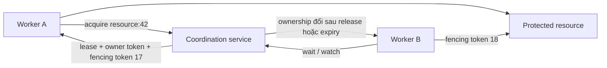
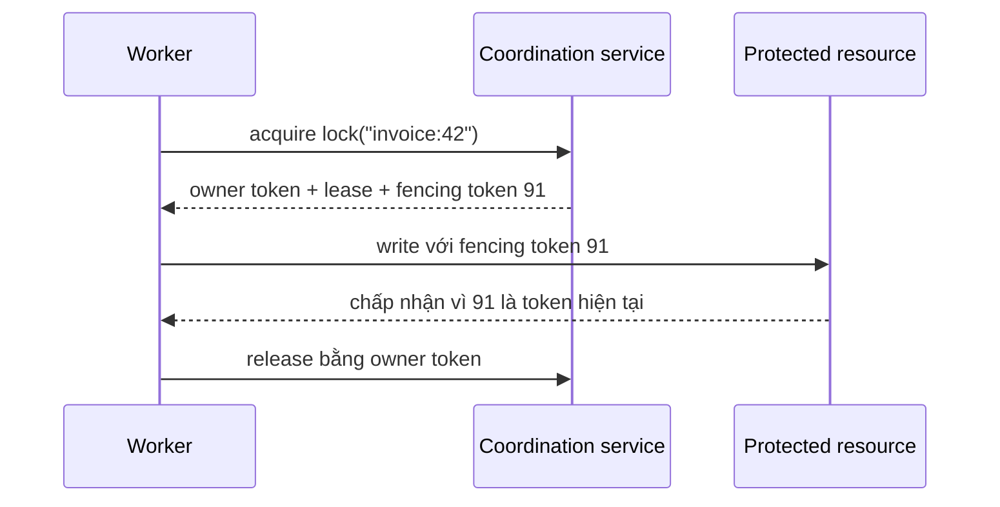

# Khóa phân tán: Điều phối công việc độc quyền bằng lease và fencing

Một worker backend acquire thành công khóa phân tán trên Redis với thời hạn TTL 30 giây để xử lý đối soát giao dịch tài chính. Mới chạy được 10 giây, máy ảo JVM bất ngờ dính một đợt dừng toàn bộ tiến trình (Stop-The-World GC) kéo dài tới 45 giây. Trong khi worker thread bị "đóng băng" thời gian, thời hạn lease trên Redis lặng lẽ hết hạn. Một worker thứ hai phát hiện khóa trống, lập tức acquire một lease mới và ghi dữ liệu thành công xuống cơ sở dữ liệu. Đúng lúc này, worker thứ nhất bừng tỉnh sau cơn ngủ GC, ngây thơ tin rằng mình vẫn là bên giữ khóa hợp pháp, và lập tức đẩy gói ghi cũ xuống database—phá nát toàn bộ dữ liệu chuẩn mà worker thứ hai vừa cập nhật.

Sự cố thực tế này lột trần ảo tưởng nguy hiểm: xem khóa phân tán như một mutex luồng trải dài qua mạng. Nếu không có cơ chế rào chắn kiểm soát tại đích lưu trữ, tính loại trừ tương hỗ (mutual exclusion) phân tán chỉ là một ảo giác mong manh.

> 💡 **Quy tắc bỏ túi:** Khóa phân tán chỉ điều phối thứ tự cấp quyền, nhưng chỉ có token rào chắn tăng đơn điệu được kiểm tra tại tài nguyên đích mới bảo đảm được tính độc quyền dữ liệu. Đừng bao giờ giả định một thread sẽ tự động dừng chạy khi thời hạn lease của nó kết thúc.

## Tóm tắt

- **Khóa phân tán là giao thức sở hữu dựa trên lease, không phải mutex cục bộ:** Khác với mutex của hệ điều hành vốn có chung scheduler ép luồng dừng lại, khóa phân tán chỉ cấp quyền sở hữu có thời hạn qua mạng không đáng tin cậy—nơi các tiến trình có thể tạm dừng, lag mạng hoặc mất phiên làm việc bất cứ lúc nào.
- **Hết hạn lease giải quyết bài toán tiến triển (liveness), không ngăn chặn được thực thi cũ:** TTL giúp giải phóng các khóa bị bỏ rơi khi worker crash, nhưng các đợt GC pause, tranh chấp CPU hay nghẽn mạng có thể khiến worker vượt quá thời hạn lease trong khi thread ứng dụng vẫn tiếp tục chạy tiếp.
- **Token rào chắn (fencing token) thiết lập ranh giới an toàn tại tài nguyên đích:** Mỗi lần cấp khóa thành công bắt buộc phải đi kèm một số thứ tự tăng đơn điệu. Hệ thống lưu trữ đích (database, kho file) phải kiên quyết từ chối mọi thao tác mang token cũ hơn token cao nhất từng ghi nhận.
- **Giải phóng khóa an toàn bắt buộc phải kiểm tra danh tính chủ sở hữu:** Thao tác xóa khóa mù quáng khi hoàn thành công việc có thể vô tình xóa nhầm khóa của một worker mới vừa acquire sau khi lease hết hạn. Luôn sử dụng thao tác xóa có so sánh (compare-and-delete) dựa trên token sở hữu duy nhất.
- **Cạm bẫy chết người:** Tin tưởng tuyệt đối vào đồng hồ local hoặc biến cờ kiểm tra trong bộ nhớ trước khi ghi xuống database. Vì thời gian trôi lệch nhau trên từng máy và tiến trình có thể bị khựng lại tại bất kỳ dòng lệnh nào, việc kiểm tra "lease vẫn còn hạn trong RAM" không thể ngăn một thread bị lag thức dậy và phá hỏng cơ sở dữ liệu.



<TermBox term="Lease">
**Lease** là quyền sở hữu có thời hạn do coordination system cấp. Holder chỉ giữ quyền khi lease còn hợp lệ, thường bằng cách gia hạn qua heartbeat hoặc session activity.

Lease giúp liveness vì lock bị bỏ rơi cuối cùng có thể được giải phóng. Nó **không** chứng minh rằng holder cũ lập tức ngừng chạy khi lease hết hạn.
</TermBox>

## Khóa phân tán là giao thức quyền sở hữu, không phải mutex qua network

Mutex trong một process dựa vào cùng runtime và scheduler. Khi một thread acquire, runtime có thể trực tiếp ngăn thread khác đi vào cùng vùng tới hạn.

Khóa phân tán không có global scheduler như vậy. Các participant giao tiếp với coordination service qua network không đáng tin cậy. Một process có thể giữ lease, dừng lâu vì GC, mất session, rồi chạy tiếp mà chưa kịp nhận ra ownership đã chuyển.

Vì thế invariant thật sự không phải:

> chỉ một process tin rằng nó đang giữ lock

Invariant hữu dụng gần hơn với:

> chỉ công việc từ **owner hiện tại còn hợp lệ** mới được phép tác động lên protected resource

Sự khác biệt này quan trọng khi vùng tới hạn chạm vào database, object store, payment provider, deployment controller, file, queue consumer group hoặc bất kỳ hệ thống nào nằm ngoài lock service.

## Lock service phải thiết lập ownership có authority

Lock cần một nơi quyết định ai là owner. Nơi đó thường là coordination system dựa trên strong ordering hoặc consensus.

etcd cung cấp lock service mà khi acquire thành công sẽ trả về một key duy nhất gắn với lease của caller. Ownership kéo dài cho tới khi key được unlock hoặc lease hết hạn. ZooKeeper recipe cho lock dùng ephemeral sequential znode và namespace có thứ tự để contender xác định participant nào đang sở hữu lock. CP Subsystem của Hazelcast cung cấp `FencedLock` tuyến tính hóa dựa trên cơ chế coordination CP.

Cách triển khai khác nhau, nhưng hình dạng chung là:



Coordination layer quyết định ownership. Protected resource vẫn cần đủ context để từ chối công việc từ owner đã stale.

## Lease expiry giải quyết ownership bị bỏ rơi, không giải quyết stale execution

Nếu không có expiration, một holder đã crash có thể chặn tiến triển mãi mãi. Lease cho hệ thống đường phục hồi:

1. holder acquire lock dựa trên lease;
2. holder gia hạn lease bằng heartbeat hoặc session activity;
3. nếu renewal dừng đủ lâu, coordination service làm lease hết hạn;
4. contender khác có thể acquire lock.

Điều này cần cho liveness, nhưng tạo ra một vấn đề safety tinh vi.

Process có thể ngừng renew **mà chưa chết**. Nguyên nhân gồm:

- GC pause dài;
- CPU starvation;
- VM hoặc container bị suspend;
- phân vùng mạng giữa worker và lock service;
- process stall quanh I/O;
- scheduler pause hoặc host overload.

Khi process chạy lại, code trong vùng tới hạn cũ có thể vẫn tiếp tục.

Timeout hoặc TTL vì thế chỉ trả lời "khi nào coordinator được phép cấp ownership cho người khác?" Nó không thể vật lý cancel process cũ.

## Fencing token giúp stale holder bị từ chối

<TermBox term="Fencing token">
**Fencing token / token rào chắn** là số ownership tăng đơn điệu được cấp mỗi lần lock chuyển cho owner mới.

Protected resource ghi nhớ token lớn nhất từng chấp nhận và từ chối operation mang token cũ hơn. Nhờ đó, tình huống "holder cũ vẫn có thể chạy" được biến thành ordering rule có thể enforce tại resource boundary.
</TermBox>

Giả sử một worker acquire token 41 rồi pause lâu hơn TTL. Worker thứ hai acquire token 42. Worker đầu tiên sau đó chạy tiếp.

```mermaid
sequenceDiagram
  participant A as Worker A
  participant C as Lock service
  participant B as Worker B
  participant R as Protected resource

  A->>C: acquire
  C-->>A: lease, fencing token 41
  A--xC: GC pause dài; lease hết hạn
  B->>C: acquire
  C-->>B: lease, fencing token 42
  B->>R: mutate với token 42
  R-->>B: chấp nhận; ghi nhớ 42
  A->>R: stale mutate với token 41
  R-->>A: từ chối token 41 < 42
```

Fencing token bảo vệ resource kể cả khi Worker A vẫn còn sống và tin rằng công việc cũ của mình nên tiếp tục.

Cách này mạnh hơn việc client tự kiểm tra wall clock. Clock skew, scheduling delay và message delay khiến câu "đồng hồ local nói lease vẫn còn hạn" không thể là authority test đáng tin cậy.

Hazelcast mô tả trực tiếp stale-holder problem này: client có thể pause, mất CP session và sau đó chạy lại khi client khác đã acquire lock. `FencedLock` trả về token tăng dần để external resource có thể từ chối holder cũ.

## Ownership identity phải khiến unlock có điều kiện

Release cũng có race.

Giả sử Worker A giữ lock TTL 10 giây. A stall 12 giây nên lock hết hạn. Worker B acquire cùng lock. Worker A chạy lại và thực hiện `DELETE lock-key` mù quáng.

Nếu unlock vô điều kiện, A có thể xóa **lock của B**.

Pattern an toàn là gắn mỗi lần acquire với một unique ownership token hoặc owner token, rồi biến unlock thành compare-and-delete:

```text
chỉ xóa lock nếu stored_owner_token == my_owner_token
```

Một số API lock đóng gói rule này bằng opaque ownership key phải được đưa lại khi unlock. API lock của etcd trả về unique lock key và yêu cầu key đó cho `Unlock`.

Nguyên tắc tương tự áp dụng cho renewal: holder chỉ được gia hạn lease vẫn thuộc ownership identity của chính nó.

## Consensus và distributed lock giải quyết hai tầng khác nhau

Lock service đáng tin cậy thường phụ thuộc consensus, nhưng lock không đồng nghĩa với consensus.

**Consensus** trả lời:

> coordination state có thứ tự nào đã commit và có authority?

**Distributed lock** trả lời:

> participant nào hiện sở hữu quyền có tên để làm công việc độc quyền?

Lock service có thể dùng consensus bên trong để order acquire, release, thay đổi lease hoặc session state. Ứng dụng sau đó dùng coordination state đã order đó như quyền sở hữu tạm thời.

Chuỗi phụ thuộc hữu ích:

```text
consensus / linearizable coordination
        -> authoritative lock state
        -> lease + ownership identity
        -> fencing tại protected resource
```

Nếu lock backend mất quorum, hành vi đúng có thể là dừng cấp hoặc renew lock thay vì tự tạo một ownership history thứ hai.

## Khóa dòng database không tự động là distributed lock

Database lock bên trong một transactional database có thể là công cụ đúng khi toàn bộ protected state nằm trong database đó và transaction sở hữu invariant.

Ví dụ, `SELECT ... FOR UPDATE` có thể serialize update lên một row trong database transaction. Điều này khác với coordination cho:

- một database write cộng external API call;
- công việc trải qua nhiều database độc lập;
- một scheduler active duy nhất qua nhiều application replica;
- ownership của maintenance operation toàn cluster.

Đừng thêm distributed lock nếu local mutex, database transaction, unique constraint, atomic compare-and-swap hoặc queue ownership đã bảo vệ invariant trực tiếp hơn.

Mỗi lock service mới đều thêm coordination dependency và failure mode mới.

## Idempotency và lock bảo vệ các failure mode khác nhau

Lock giảm **overlap**: cố gắng ngăn nhiều worker cùng hành xử như owner hiện tại.

Idempotency giảm **duplicate effect**: nếu cùng logical operation bị retry hoặc redeliver, lặp lại không được tạo business effect bổ sung.

Thực tế thường cần cả hai. Worker có thể mất lock sau khi external side effect đã xảy ra nhưng trước khi ghi nhận completion. Worker thay thế có thể retry cùng logical operation. Fencing ngăn stale ownership; idempotency ngăn duplicate business effect.

Vì thế shortcut này không an toàn:

```text
đã dùng distributed lock -> retry không thể tạo duplicate effect
```

Lock là coordination tạm thời. Idempotency là thuộc tính của logical operation và effect.

## Contention là bài toán queueing

Khi nhiều client cùng muốn một lock, hệ thống có tranh chấp. Polling ngây thơ làm tình hình tệ hơn:

```text
while chưa acquire:
  sleep(100ms)
  thử lại
```

Một fleet lớn làm vậy có thể tạo herd effect lên coordination service.

Ưu tiên cơ chế cho contender chờ theo trạng thái có thứ tự hoặc event-driven:

- watch predecessor hoặc ownership key khi backend hỗ trợ watch;
- dùng queue hoặc cấu trúc waiter có fairness nếu ordering quan trọng;
- áp bounded backoff và jitter khi buộc phải retry;
- đặt deadline cho lock acquisition để caller không chờ vô hạn.

ZooKeeper lock recipe được thiết kế để tránh hiệu ứng bầy đàn bằng cách cho contender watch sequential node ngay trước nó thay vì watch lock root rồi đánh thức mọi waiter.

Lock path cũng cần operational evidence: acquisition latency, số waiter, timeout rate, lỗi lease renewal, expiry count và fencing rejection.

## Lock granularity xác định cả safety scope lẫn contention

Tên lock là một phần của correctness model.

Một global lock như `billing` dễ suy luận nhưng có thể serialize công việc không liên quan. Lock theo invoice như `invoice:{id}` tăng concurrency nhưng chỉ đúng nếu invariant thực sự theo từng invoice.

Chọn độ hạt / lock granularity từ invariant:

| Invariant | Phạm vi khóa khả dĩ |
| --- | --- |
| chỉ một migration active cho toàn cluster | cluster-wide migration key |
| một lần rebalance cho mỗi shard | shard identifier |
| một invoice chỉ finalize một lần tại một thời điểm | invoice identifier |
| một scheduled job singleton cho mỗi tenant | tenant + job identifier |

Quá coarse gây contention không cần thiết. Quá fine cho phép các operation thực ra cùng chia sẻ invariant chạy chồng lên nhau.

Vì vậy distributed lock nên được đặt tên theo **điều gì không được phép overlap**, không phải theo tên function vô tình gọi acquire.

## Giữ vùng tới hạn ngắn và nhận biết failure

Vùng tới hạn càng dài thì càng dễ cắt qua lease renewal failure, deploy, host pause hoặc network incident.

Rule thực dụng:

- acquire càng muộn càng tốt;
- release càng sớm càng tốt;
- giữ slow I/O không liên quan ở ngoài lock nếu correctness cho phép;
- làm lease-renewal failure hiển thị rõ cho work loop;
- stop hoặc abort work khi biết đã mất ownership;
- vẫn dùng fencing vì việc stop không xảy ra tức thời;
- tránh nested distributed locks trừ khi có global ordering chủ đích để chống deadlock.

Nếu job hợp lệ chạy lâu hơn TTL ban đầu, renewal phải là một phần của protocol thay vì timer hy vọng trong application code.

## Kịch bản production: worker bị pause vẫn ghi sau khi lease hết hạn

Một service xử lý tài liệu dùng distributed lock 30 giây theo từng document để chỉ một worker publish generated artifact. Worker A acquire `document:842`, bắt đầu render, rồi runtime bị GC pause 45 giây.

Lock service làm lease của A hết hạn sau 30 giây. Worker B acquire cùng lock và nhận fencing token 202. B publish artifact đúng. A chạy lại với local state cũ rồi upload một artifact cũ hơn sau B.

**Hậu quả:** người dùng thỉnh thoảng nhận phải artifact cũ (stale) dù số liệu giám sát khẳng định lock service chưa từng cấp phát quyền sở hữu cho hai worker tại cùng một thời điểm.

**Nguyên nhân cốt lõi:** đội ngũ kỹ thuật ngộ nhận rằng việc hết hạn lease sẽ lập tức triệt tiêu tiến trình cũ một cách vật lý. Hệ thống lưu trữ đối tượng đích không kiểm tra token rào chắn, khiến bên giữ khóa cũ vẫn có thể tự do ghi đè lên kết quả của chủ sở hữu mới.

**Cách khắc phục chuẩn:** cấp phát token rào chắn tăng đơn điệu cho mỗi lần acquire thành công, buộc ranh giới xuất bản phải từ chối mọi token thấp hơn token cao nhất từng được chấp nhận cho tài liệu đó, biến thao tác giải phóng khóa thành so sánh và xóa (compare-and-delete) dựa trên token sở hữu duy nhất, và bảo đảm thao tác xuất bản có tính bất biến (idempotent) để việc thử lại không tạo ra tác dụng phụ trùng lặp.

## Tự kiểm tra

Một worker acquire lock dựa trên lease với fencing token 50. Nó pause đủ lâu để lease hết hạn. Worker khác acquire token 51 và cập nhật protected resource. Worker đầu tiên chạy lại. Việc kiểm tra "object lock vẫn còn trong code của tôi" có đủ trước khi write không?

<details>
<summary>Xem giải thích chi tiết</summary>

Không. Lock object chỉ là local memory và có thể đại diện cho ownership đã stale. Worker cũ không đáng tin chỉ vì nó chạy lại. Protected resource cần authority check phân biệt token 50 với token mới hơn 51 và phải từ chối token stale. Lease expiry cung cấp liveness cho coordinator; fencing enforce ordering tại resource boundary.

</details>

## Checklist review

- [ ] **Invariant:** Chính xác công việc hoặc state nào không được phép overlap?
- [ ] **Authority:** Coordination system nào quyết định owner hiện tại, và điều gì xảy ra khi nó mất quorum?
- [ ] **Lease:** Điều gì làm ownership hết hạn, và renewal được thực hiện/quan sát thế nào?
- [ ] **Identity:** Mỗi lần acquire có unique owner token để release và renewal chỉ áp dụng cho ownership hiện tại không?
- [ ] **Fencing:** Protected resource có thể từ chối stale holder bằng fencing token tăng đơn điệu không?
- [ ] **Acquisition:** Thời gian chờ lock có deadline, dùng watch/queue hoặc backoff thay vì hot polling không?
- [ ] **Độ hạt:** Phạm vi khóa có khớp invariant mà không tạo contention không cần thiết không?
- [ ] **Vùng tới hạn:** Slow work không liên quan có được giữ ngoài lock khi có thể không?
- [ ] **Recovery:** Điều gì xảy ra sau process pause, network partition, session loss hoặc lease expiry?
- [ ] **Effect:** External effect có idempotent khi retry hoặc worker thay thế có thể lặp công việc không?

## Quy tắc cho agent

- [ ] **Không mô hình distributed lock như local mutex:** Khôi phục semantics của lease, session, ownership và failure trước.
- [ ] **Release phải nhận biết owner:** Không dùng unlock vô điều kiện khi holder khác có thể đã acquire sau expiry.
- [ ] **Rào stale holder:** Ưu tiên fencing token tăng đơn điệu được protected resource kiểm tra cho công việc nhạy cảm correctness.
- [ ] **Tách lock khỏi idempotency:** Exclusive ownership không biến retry thành exactly once.
- [ ] **Dùng primitive hẹp nhất nhưng đúng:** Ưu tiên database constraint, row lock, CAS, queue hoặc local mutex khi chúng trực tiếp sở hữu invariant.
- [ ] **Kiểm soát contention:** Dùng watch, queue, deadline, backoff và jitter thay vì polling đồng bộ.
- [ ] **Test failure window:** Kiểm tra pause dài, mất lease, stale-owner resume, release race và lock-backend quorum loss.

## Nguồn

Nguồn chính được kiểm tra ngày **2026-09-17**:

- [etcd — API reference: concurrency](https://etcd.io/docs/v3.7/dev-guide/api_concurrency_reference_v3/)
- [etcd — How to create locks](https://etcd.io/docs/v3.7/tasks/developer/how-to-create-locks/)
- [Apache ZooKeeper — Recipes and Solutions](https://zookeeper.apache.org/doc/r3.7.2/recipes.html)
- [Hazelcast — FencedLock](https://docs.hazelcast.com/hazelcast/5.7/data-structures/fencedlock)
