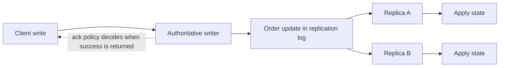
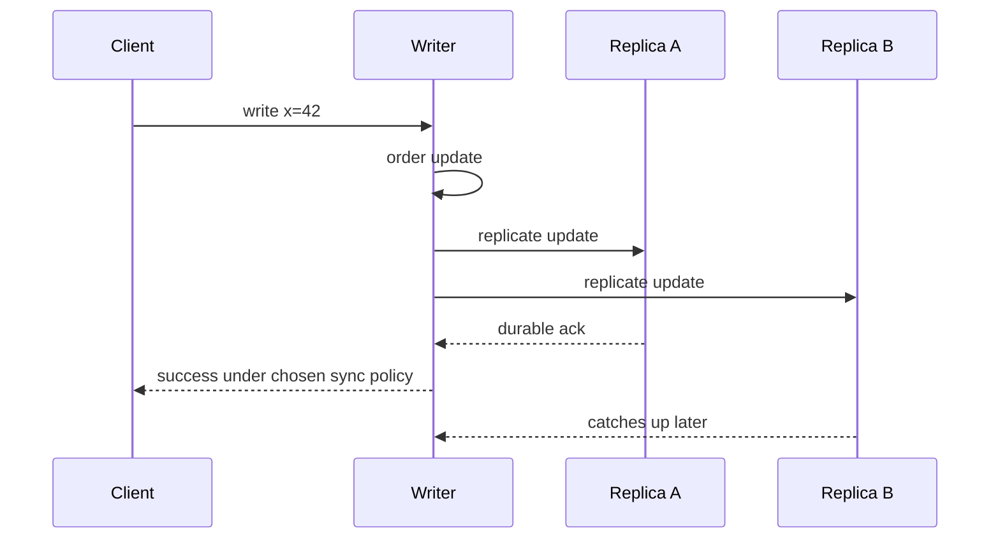
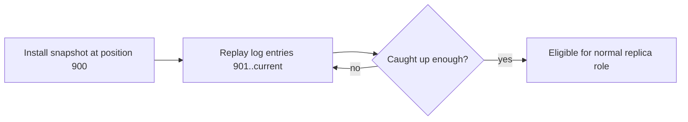
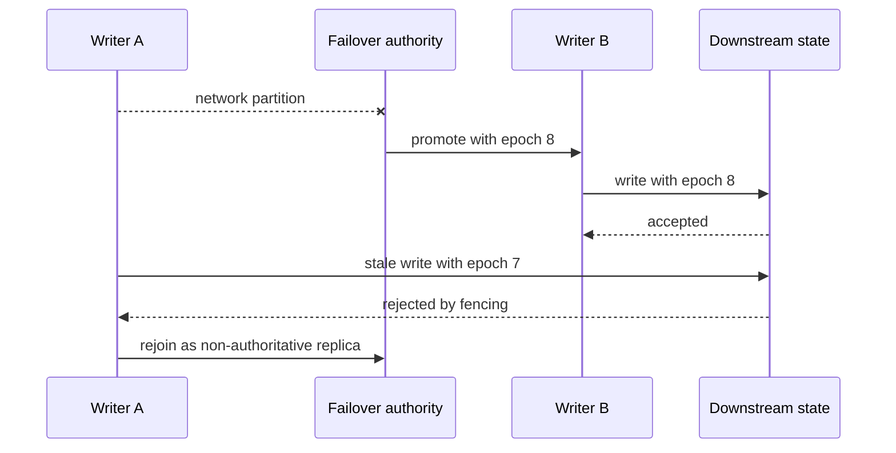

# Distributed Replication: Keep Copies Correct Through Failure and Failover

## TL;DR

Distributed replication keeps **copies of state on multiple nodes**, but the engineering problem is not merely moving bytes. A replication protocol must define:

- which node or rule is authoritative for each update;
- how updates receive an order that replicas can apply;
- when a write may be acknowledged;
- how far a replica may lag;
- how a new or returning replica catches up;
- how authority changes during failover without creating two active writers;
- how conflicting writes are reconciled when the topology intentionally allows more than one writer.

The practical rule is: **treat replication as a copy-and-authority protocol with explicit failure semantics**. Do not assume that “three replicas” automatically means three current copies, zero data loss, or one agreed history.



<TermBox term="Replication factor">
**Replication factor** is the number of copies a replication policy intends to maintain for a unit of data.

A replication factor of three says how many copies should exist. It does not, by itself, say where those copies live, how current they are, which copies may accept writes, or how many correlated failures the system can survive.
</TermBox>

## Replication is broader than database replication

The Atlas lesson on **Database Replication** explains one concrete family in depth: database logs, standby replay, synchronous and asynchronous commit, read routing, and failover.

Distributed replication is the broader systems idea. The replicated state might be:

- a database shard;
- a metadata record;
- a message-stream partition;
- a configuration key;
- a replicated state-machine log;
- an object index or service registry.

The same questions reappear even when there is no SQL database: who orders writes, which acknowledgments count, how a lagging copy recovers, and what prevents two authorities from diverging after a partition.

## An ordered history needs an authority rule

A common replication topology has one active writer, often called a **leader**, and several followers. The leader chooses an order for accepted updates and followers reproduce that ordered history.

<TermBox term="Replication log">
A **replication log** is an ordered record of state changes or commands that replicas can replay to reconstruct the same logical state.

The important property is the ordering relationship used by the protocol. The storage format may be a database WAL, a replicated command log, an append-only stream, or another implementation-specific representation.
</TermBox>

A leader-based flow can be reasoned about as:

```text
client update
  -> authoritative writer validates and orders it
  -> update enters the replication log
  -> replicas receive the ordered update
  -> replicas persist and/or apply it
  -> each replica advances its replication position
```

This is why “the follower has the bytes” and “the follower can serve the new state” are not always the same milestone.

## The acknowledgment boundary defines the write contract

Replication protocols choose a point at which a write becomes successful from the client's perspective.

With **asynchronous replication**, the authoritative writer may acknowledge before another replica durably stores or applies the update. That keeps remote replica latency off the write path, but a sudden loss of the authoritative copy can expose a data-loss window.

With **synchronous replication**, the protocol waits for some remote acknowledgment before returning success. That narrows particular failure windows, but it couples write latency and availability to the required participants.



The words “synchronous” and “asynchronous” are incomplete without the exact acknowledgment point. A system may wait for receipt, durable storage, application to the state machine, or a quorum-specific condition. Those choices provide different guarantees.

PostgreSQL is a useful concrete example: its streaming replication is asynchronous by default, while synchronous replication can make commit wait for configured standby progress. That is a database-specific mechanism illustrating the general acknowledgment-boundary idea.

## Replication lag is distance from a chosen progress point

**Replication lag** is not one universal number. A replica can be behind at different stages:

| Progress point | Question |
| --- | --- |
| Received | Has the replica received the update? |
| Durable | Has it stored the update on durable media? |
| Applied | Has the local state machine incorporated it? |
| Visible | Can a local read observe it? |

A healthy-looking node may still be too stale for a correctness-sensitive request.

That connects directly to the previous **Distributed Consistency** lesson: replication creates multiple observations; the consistency contract decides which observations are allowed for a particular read path.

## A replica must bootstrap before it can stay current

A new node cannot usually replay an unbounded history from the beginning forever. Replication systems therefore combine a state snapshot or base image with a later log tail.



A returning replica faces the same question. If the retained log still covers its missing range, it can catch up incrementally. If the required history has already been compacted or deleted, it may need a fresh snapshot.

The Raft paper describes snapshots that replace older committed log prefixes and can be sent to followers that fall too far behind. PostgreSQL similarly documents catch-up behavior for standbys and the need to reinitialize a standby when required retained WAL is no longer available.

Operationally, bootstrap traffic is not free. A large snapshot can consume network, storage I/O, CPU, and leader bandwidth while the cluster is already degraded.

## Failover changes authority, so the old writer must be fenced

Failover is not merely “start sending traffic to another copy.” It changes which node is allowed to accept authoritative writes.

<TermBox term="Fencing token">
A **fencing token** is a monotonically increasing authority value—such as an epoch, term, or lease generation—that lets downstream components reject work from an older authority.

Fencing protects against a node that was previously valid, became isolated, and later resumes work after a newer authority has already taken over.
</TermBox>

Without fencing, an old writer can return after failover and create **split-brain** behavior: two nodes accept writes that cannot both belong to one authoritative history.



The exact mechanism varies by system. A consensus group may decide leadership and committed log order. An external failover controller may use leases or a strongly coordinated metadata store. A storage device may be fenced at the infrastructure layer. The invariant is the same: **the previous authority must not continue writing after a newer authority exists**.

PostgreSQL's failover documentation explicitly warns that a restarted old primary needs a mechanism to prevent it from acting as primary after a standby has been promoted.

## Multi-writer and leaderless designs move complexity into reconciliation

Not every replication topology chooses one active writer.

A **multi-leader** design can accept writes at several leaders and later reconcile conflicts. A **leaderless** design can send reads and writes directly to multiple replicas without one permanent ordering authority.

These designs can reduce dependence on one write location, but concurrent updates may have no single natural order. The protocol must define how versions are compared and reconciled.

Dynamo is a classic leaderless example. Its design uses object versioning and application-assisted conflict resolution so the system can remain highly available under some failure scenarios. It also uses repair mechanisms to bring replicas back toward convergence.

Useful reconciliation mechanisms include:

- version metadata that detects concurrent siblings instead of silently overwriting one;
- read repair that updates stale replicas while serving reads;
- anti-entropy processes that compare replica ranges in the background;
- application-specific merge rules when the system cannot infer business intent.

A quorum formula can be part of a leaderless replication protocol, but **quorum arithmetic is not automatically consensus** and does not by itself prove one linearizable global history.

## Replication factor is not fault tolerance by itself

Three copies on three processes can still share one failure domain.

Examples of correlated failure include:

- all replicas on one physical host;
- all replicas in one availability zone;
- all copies using the same broken deployment;
- all nodes losing access to the same dependency;
- operator automation deleting or corrupting every copy.

Place replicas according to the failure modes you need to survive. The right placement may span disks, hosts, zones, or regions, but wider placement also increases network latency and operational complexity.

Replication improves the chance that a valid copy survives. It does not replace backups, point-in-time recovery, or protection against logical corruption that is faithfully replicated everywhere.

## Partitioning and replication are orthogonal

**Partitioning** decides which subset of data a node is responsible for. **Replication** decides how many copies of that subset exist and how those copies stay coordinated.

A sharded system often combines both:

```text
shard A -> A1, A2, A3
shard B -> B1, B2, B3
shard C -> C1, C2, C3
```

Changing the shard key changes placement of data across partitions. Changing the replication factor changes copy count within each partition. Treating these as separate dimensions makes capacity and failure analysis much clearer.

## Replication and consensus solve different problems

Replication answers: **how do multiple nodes obtain and maintain copies of state?**

Consensus answers: **how do nodes agree on one value or ordered history despite failures and delay?**

Many replicated state-machine systems combine them: a consensus protocol decides which log entries are committed, and replication distributes those entries to other members.

But replication also exists without a consensus protocol that establishes one global committed history. Asynchronous primary/standby systems and leaderless eventually convergent stores are examples.

So do not infer:

> replicated state -> consensus has happened

or:

> quorum replication -> linearizable consensus

The next Atlas lesson treats consensus as its own concept.

## Production scenario: a failover creates two accepted writers

A regional service stores customer entitlement state on three replicas. Writer A owns epoch 41. A network partition isolates A from the failover controller, and the controller promotes Writer B with epoch 42.

Traffic shifts to B, but A is still reachable by one stale application pool. A continues accepting entitlement updates for several minutes. When connectivity returns, the replicas contain two valid-looking histories.

**Impact:** customers see entitlements appear and disappear depending on which replica serves the request, and reconciliation cannot safely guess which conflicting business update should win.

**Root cause:** the team treated promotion as a routing change. The old writer had no fencing boundary, so losing control-plane connectivity did not revoke its ability to mutate downstream state.

**Correct pattern:** bind every authoritative write to the current epoch or term, make downstream state reject stale authority tokens, and only promote a replica after the failover mechanism establishes one current authority. When the old writer returns, rejoin it as a non-authoritative replica, install a safe snapshot or reconcile retained log history, and verify it has caught up before it can become eligible again.

## Self-check

A three-replica service acknowledges a write after only the current writer persists it. Two followers receive the update later. The writer crashes immediately after returning success, before either follower receives the update.

Does a replication factor of three guarantee that the acknowledged write survives?

<details>
<summary>Show the reasoning</summary>

No. Replication factor describes intended copy count, not the acknowledgment boundary. Under this asynchronous policy, success happened before any follower had the update, so losing the writer in that window can lose an acknowledged write. To narrow that window, the write contract must wait for the required remote progress, accepting the resulting latency and availability trade-off.

</details>

## Review checklist

- [ ] **Authority:** Is it explicit which node or rule may order writes for each replicated data unit?
- [ ] **Acknowledgment:** What exact replica progress must occur before a client sees success?
- [ ] **Lag:** Can operators distinguish receive, durable, apply, and visibility lag where those stages differ?
- [ ] **Bootstrap:** Can a new or stale replica install a snapshot and replay the remaining history safely?
- [ ] **Failover:** What evidence makes a candidate eligible for promotion?
- [ ] **Fencing:** How are writes from an older epoch, term, or lease rejected after authority changes?
- [ ] **Reconciliation:** If multiple writers are allowed, how are concurrent versions detected and merged?
- [ ] **Placement:** Do replicas span the fault domains the availability requirement actually cares about?
- [ ] **Recovery:** Can the system recover from logical corruption without replicating the corruption into every recovery copy?

## Agent rule

- [ ] **Recover the authority model first:** Identify the writer, leader, quorum rule, or conflict-resolution rule before changing replication code.
- [ ] **Name the acknowledgment point:** Do not call replication “synchronous” without stating what remote progress is awaited.
- [ ] **Treat lag as correctness input:** Route stale-tolerant and correctness-sensitive reads according to explicit freshness requirements.
- [ ] **Fence old authorities:** Promotion is incomplete until stale writers can no longer mutate authoritative state.
- [ ] **Separate dimensions:** Keep partitioning, replication, consistency, durability, and consensus distinct in explanations and tests.
- [ ] **Test recovery paths:** Exercise replica bootstrap, catch-up, failover, stale-writer rejoin, and conflict reconciliation where the topology permits them.

## Sources

Primary sources checked on **2026-09-17**:

- [Ongaro & Ousterhout — In Search of an Understandable Consensus Algorithm](https://raft.github.io/raft.pdf)
- [Amazon Science — Dynamo: Amazon's highly available key-value store](https://www.amazon.science/publications/dynamo-amazons-highly-available-key-value-store)
- [PostgreSQL — Log-Shipping Standby Servers](https://www.postgresql.org/docs/current/warm-standby.html)
- [PostgreSQL — Failover](https://www.postgresql.org/docs/current/warm-standby-failover.html)
