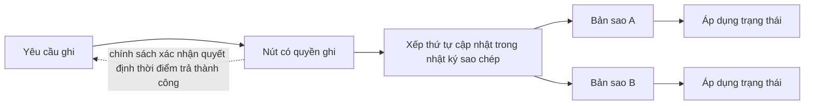
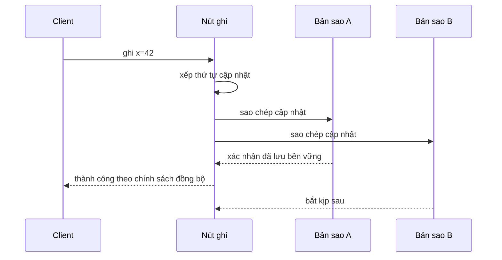
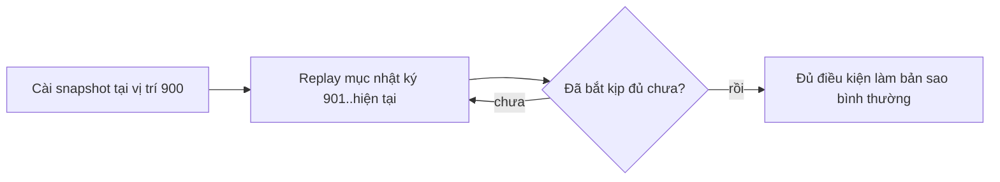
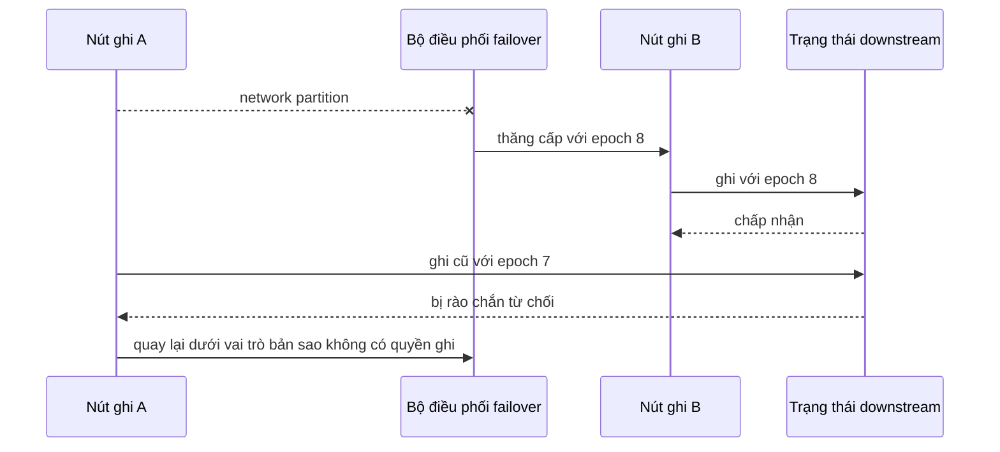

# Sao chép phân tán: Giữ các bản sao đúng qua sự cố và chuyển đổi dự phòng

## Tóm tắt

Sao chép phân tán giữ **nhiều bản sao trạng thái trên nhiều nút**, nhưng bài toán kỹ thuật không chỉ là chuyển byte. Một giao thức sao chép phải xác định:

- nút hoặc quy tắc nào có quyền quyết định từng cập nhật;
- các cập nhật được sắp thứ tự ra sao để bản sao có thể áp dụng;
- khi nào một lần ghi được phép trả về thành công;
- một bản sao được phép chậm đến mức nào;
- bản sao mới hoặc vừa quay lại bắt kịp bằng cách nào;
- quyền ghi chuyển đổi ra sao khi failover mà không tạo hai bên ghi đồng thời;
- xung đột được hòa giải thế nào nếu kiến trúc chủ động cho phép nhiều bên ghi.

Quy tắc thực dụng là: **hãy xem sao chép như một giao thức về bản sao và quyền ghi với failure semantics tường minh**. Đừng suy ra rằng “ba bản sao” tự động đồng nghĩa với ba bản sao đều mới nhất, không thể mất dữ liệu hoặc chỉ có một lịch sử duy nhất.



<TermBox term="Hệ số sao chép">
**Hệ số sao chép** là số lượng bản sao mà chính sách sao chép dự định duy trì cho một đơn vị dữ liệu.

Hệ số bằng ba chỉ nói nên có bao nhiêu bản sao. Nó không tự nói các bản sao nằm ở đâu, mới đến mức nào, bản sao nào được ghi hoặc hệ thống chịu được bao nhiêu lỗi tương quan.
</TermBox>

## Sao chép phân tán rộng hơn sao chép database

Bài **Database Replication** trong Atlas giải thích sâu một họ cơ chế cụ thể: nhật ký database, replay trên standby, commit đồng bộ và bất đồng bộ, định tuyến đọc và chuyển đổi dự phòng.

Sao chép phân tán là ý tưởng hệ thống rộng hơn. Trạng thái được sao chép có thể là:

- một shard database;
- một bản ghi metadata;
- một phân vùng của luồng thông điệp;
- một khóa cấu hình;
- nhật ký của state machine được sao chép;
- chỉ mục đối tượng hoặc service registry.

Ngay cả khi không có SQL database, các câu hỏi cốt lõi vẫn lặp lại: ai sắp thứ tự lần ghi, xác nhận nào được tính, một bản sao chậm phục hồi ra sao và điều gì ngăn hai nguồn quyền ghi cùng phân kỳ sau network partition.

## Một lịch sử có thứ tự cần quy tắc về quyền ghi

Một topology phổ biến có một bên ghi đang hoạt động, thường gọi là **leader**, cùng nhiều follower. Leader chọn thứ tự cho các cập nhật được chấp nhận và follower tái tạo lịch sử theo thứ tự đó.

<TermBox term="Nhật ký sao chép">
**Nhật ký sao chép** là bản ghi có thứ tự của thay đổi trạng thái hoặc command để các bản sao có thể replay và tái tạo cùng trạng thái logic.

Điều quan trọng là quan hệ thứ tự mà giao thức dùng. Biểu diễn lưu trữ có thể là WAL của database, command log được sao chép, luồng append-only hoặc dạng đặc thù khác.
</TermBox>

Có thể suy luận luồng leader-based như sau:

```text
yêu cầu cập nhật
  -> nút có quyền ghi kiểm tra và xếp thứ tự
  -> cập nhật đi vào nhật ký sao chép
  -> các bản sao nhận cập nhật đã có thứ tự
  -> các bản sao lưu bền vững và/hoặc áp dụng cập nhật
  -> mỗi bản sao tiến vị trí sao chép của mình
```

Vì thế “follower đã nhận byte” và “follower đã có thể phục vụ trạng thái mới” không nhất thiết là cùng một mốc.

## Ranh giới xác nhận định nghĩa contract của lần ghi

Giao thức sao chép chọn một mốc mà tại đó lần ghi được xem là thành công từ góc nhìn client.

Với **sao chép bất đồng bộ**, nút có quyền ghi có thể xác nhận trước khi một bản sao khác lưu bền vững hoặc áp dụng cập nhật. Cách này không đặt độ trễ của bản sao từ xa lên write path, nhưng việc mất đột ngột bản sao có quyền có thể để lộ một cửa sổ mất dữ liệu.

Với **sao chép đồng bộ**, giao thức chờ một dạng xác nhận từ xa trước khi trả thành công. Cách này thu hẹp một số cửa sổ lỗi, nhưng gắn độ trễ và availability của write path vào những thành viên bắt buộc phải phản hồi.



Hai nhãn “đồng bộ” và “bất đồng bộ” chưa đủ nếu không nói rõ mốc xác nhận. Hệ thống có thể chờ nhận dữ liệu, lưu bền vững, áp dụng vào state machine hoặc một điều kiện quorum cụ thể. Mỗi lựa chọn tạo ra guarantee khác nhau.

PostgreSQL là ví dụ cụ thể hữu ích: streaming replication mặc định bất đồng bộ, còn synchronous replication có thể khiến commit chờ tiến độ của standby được cấu hình. Đây là cơ chế riêng của database dùng để minh họa ý tưởng tổng quát về ranh giới xác nhận.

## Độ trễ sao chép là khoảng cách tới một mốc tiến độ cụ thể

**Độ trễ sao chép** không phải một con số duy nhất cho mọi hệ thống. Một bản sao có thể chậm ở các stage khác nhau:

| Mốc tiến độ | Câu hỏi |
| --- | --- |
| Đã nhận | Bản sao đã nhận cập nhật chưa? |
| Đã lưu bền vững | Cập nhật đã nằm trên durable media chưa? |
| Đã áp dụng | State machine cục bộ đã áp dụng cập nhật chưa? |
| Đã nhìn thấy | Read cục bộ đã quan sát được cập nhật chưa? |

Một nút trông “khỏe” vẫn có thể quá cũ cho request nhạy cảm về correctness.

Điều này nối trực tiếp với bài **Tính nhất quán phân tán** trước đó: sao chép tạo ra nhiều điểm quan sát, còn consistency contract quyết định điểm quan sát nào được phép dùng cho từng read path.

## Bản sao phải khởi tạo trước khi có thể liên tục theo kịp

Một nút mới không thể mãi mãi replay toàn bộ lịch sử không giới hạn từ đầu. Vì vậy các hệ thống sao chép thường kết hợp snapshot hoặc base image với phần đuôi nhật ký mới hơn.



Bản sao vừa quay lại cũng gặp cùng câu hỏi. Nếu nhật ký còn giữ phần lịch sử nó bị thiếu, bản sao có thể bắt kịp theo kiểu tăng dần. Nếu phần lịch sử cần thiết đã bị compact hoặc xóa, bản sao có thể phải cài snapshot mới.

Bài báo Raft mô tả snapshot thay thế phần prefix đã commit của log và có thể được gửi tới follower tụt quá xa. PostgreSQL cũng mô tả trạng thái catch-up của standby và trường hợp phải khởi tạo lại khi WAL cần thiết không còn được giữ.

Về vận hành, bootstrap không miễn phí. Snapshot lớn có thể tiêu thụ băng thông, I/O lưu trữ, CPU và băng thông của leader ngay lúc cluster đang suy giảm.

## Failover thay đổi quyền ghi, nên bên ghi cũ phải bị rào chắn

Failover không chỉ là “chuyển traffic sang một bản sao khác”. Nó thay đổi nút nào được phép chấp nhận lần ghi có tính authoritative.

<TermBox term="Fencing token">
**Fencing token / token rào chắn** là giá trị quyền tăng đơn điệu, chẳng hạn epoch, term hoặc thế hệ lease, cho phép thành phần downstream từ chối công việc đến từ một nguồn quyền cũ.

Rào chắn bảo vệ trước nút từng hợp lệ, sau đó bị cô lập, rồi quay lại làm việc sau khi một nguồn quyền mới đã tiếp quản.
</TermBox>

Nếu không có rào chắn, bên ghi cũ có thể quay lại sau failover và tạo hành vi **split-brain**: hai nút cùng chấp nhận các lần ghi không thể đồng thời thuộc về một lịch sử authoritative duy nhất.



Cơ chế cụ thể thay đổi theo hệ thống. Một nhóm consensus có thể quyết định leadership và thứ tự log đã commit. Bộ điều phối failover bên ngoài có thể dùng lease hoặc metadata store được phối hợp chặt. Hạ tầng lưu trữ có thể áp rào chắn ở tầng thấp hơn. Invariant vẫn giống nhau: **nguồn quyền cũ không được tiếp tục ghi sau khi nguồn quyền mới đã tồn tại**.

Tài liệu failover của PostgreSQL cảnh báo rõ rằng primary cũ khi khởi động lại cần cơ chế ngăn nó tiếp tục hành xử như primary sau khi standby đã được thăng cấp.

## Topology nhiều bên ghi và không leader chuyển complexity sang hòa giải

Không phải topology sao chép nào cũng chọn một bên ghi đang hoạt động.

Thiết kế **multi-leader** có thể nhận lần ghi ở nhiều leader rồi hòa giải xung đột sau. Thiết kế **leaderless** có thể gửi read và write trực tiếp tới nhiều bản sao mà không có một nguồn xếp thứ tự cố định.

Các thiết kế này giảm phụ thuộc vào một vị trí ghi duy nhất, nhưng cập nhật đồng thời có thể không có một thứ tự tự nhiên duy nhất. Giao thức phải định nghĩa cách so sánh và hòa giải các version.

Dynamo là ví dụ leaderless kinh điển. Thiết kế này dùng versioning cho object và conflict resolution có sự hỗ trợ của application để hệ thống vẫn đạt availability cao trong một số tình huống lỗi. Nó cũng dùng các cơ chế repair để đưa bản sao dần hội tụ trở lại.

Các cơ chế hòa giải hữu ích gồm:

- metadata version giúp phát hiện các sibling đồng thời thay vì âm thầm ghi đè;
- read repair cập nhật bản sao cũ trong quá trình phục vụ read;
- anti-entropy so sánh dải bản sao ở background;
- quy tắc merge theo nghiệp vụ khi hệ thống không thể tự suy ra ý định đúng.

Quorum có thể là một phần của giao thức replication leaderless, nhưng **quorum arithmetic không tự động là consensus** và không tự chứng minh một lịch sử global linearizable duy nhất.

## Hệ số sao chép không tự đồng nghĩa với khả năng chịu lỗi

Ba bản sao chạy trên ba process vẫn có thể chung một fault domain.

Ví dụ lỗi tương quan:

- mọi bản sao cùng trên một physical host;
- mọi bản sao cùng trong một availability zone;
- mọi copy cùng chạy bản deploy lỗi;
- mọi nút cùng mất một dependency dùng chung;
- automation của operator xóa hoặc làm hỏng mọi bản sao.

Hãy đặt bản sao theo loại failure mà yêu cầu availability thực sự cần chịu. Có thể phải trải qua disk, host, zone hoặc region, nhưng phạm vi càng rộng thì network latency và complexity vận hành càng tăng.

Sao chép làm tăng khả năng còn một bản sao hợp lệ. Nó không thay thế backup, point-in-time recovery hoặc cơ chế bảo vệ khỏi logical corruption được sao chép trung thực sang mọi bản sao.

## Partitioning và replication là hai chiều độc lập

**Partitioning** quyết định một nút chịu trách nhiệm cho tập con dữ liệu nào. **Replication** quyết định tập con đó có bao nhiêu bản sao và các bản sao phối hợp ra sao.

Một hệ thống sharded thường kết hợp cả hai:

```text
shard A -> A1, A2, A3
shard B -> B1, B2, B3
shard C -> C1, C2, C3
```

Đổi shard key làm thay đổi cách dữ liệu được đặt giữa các partition. Đổi replication factor làm thay đổi số bản sao trong từng partition. Tách hai chiều này giúp phân tích capacity và failure rõ hơn.

## Replication và consensus giải quyết hai bài toán khác nhau

Replication trả lời: **nhiều nút nhận và duy trì bản sao trạng thái bằng cách nào?**

Consensus trả lời: **các nút đồng ý về một giá trị hoặc lịch sử có thứ tự bằng cách nào khi có failure và delay?**

Nhiều replicated state machine kết hợp hai khái niệm: consensus protocol quyết định log entry nào đã commit, còn replication phân phối các entry đó sang thành viên khác.

Nhưng replication cũng tồn tại khi không có consensus protocol tạo ra một global committed history duy nhất. Hệ thống primary/standby bất đồng bộ và kho leaderless hội tụ cuối cùng là hai ví dụ.

Vì vậy đừng suy ra:

> trạng thái đã được sao chép -> consensus đã xảy ra

hoặc:

> replication theo quorum -> consensus linearizable

Bài Atlas kế tiếp sẽ tách riêng khái niệm consensus.

## Kịch bản production: failover tạo ra hai bên ghi đều được chấp nhận

Một service theo vùng lưu trạng thái entitlement của khách hàng trên ba bản sao. Nút ghi A đang giữ epoch 41. Network partition cô lập A khỏi bộ điều phối failover, và bộ điều phối thăng cấp nút ghi B với epoch 42.

Traffic chuyển sang B, nhưng A vẫn có thể được một application pool cũ truy cập. A tiếp tục nhận cập nhật entitlement trong vài phút. Khi kết nối trở lại, các bản sao chứa hai lịch sử đều trông có vẻ hợp lệ.

**Hậu quả:** quyền của khách hàng xuất hiện rồi biến mất tùy bản sao phục vụ request, còn reconciliation không thể an toàn đoán cập nhật nghiệp vụ xung đột nào phải thắng.

**Nguyên nhân cốt lõi:** team xem promotion như thay đổi routing. Nút ghi cũ không có fencing boundary, nên mất kết nối với control plane không thu hồi khả năng sửa authoritative state.

**Cách khắc phục chuẩn:** gắn mọi lần ghi authoritative với epoch hoặc term hiện tại, buộc downstream state từ chối token quyền cũ và chỉ promotion sau khi cơ chế failover thiết lập được một nguồn quyền hiện tại. Khi nút ghi cũ quay lại, đưa nó về vai trò bản sao không có quyền ghi, cài snapshot an toàn hoặc reconcile phần log còn giữ, rồi xác minh đã bắt kịp trước khi nó có thể đủ điều kiện trở lại.

## Tự kiểm tra

Một service có ba bản sao trả success ngay sau khi chỉ nút ghi hiện tại lưu bền vững cập nhật. Hai follower nhận cập nhật sau. Nút ghi crash ngay sau khi trả success, trước khi follower nào nhận được cập nhật.

Replication factor bằng ba có đảm bảo lần ghi đã xác nhận vẫn tồn tại không?

<details>
<summary>Xem giải thích chi tiết</summary>

Không. Replication factor mô tả số lượng copy dự định duy trì, không mô tả acknowledgment boundary. Với chính sách bất đồng bộ này, success xảy ra trước khi follower nào có cập nhật, nên mất writer trong cửa sổ đó có thể làm mất lần ghi đã được xác nhận. Muốn thu hẹp cửa sổ này, write contract phải chờ tiến độ từ xa cần thiết và chấp nhận trade-off tương ứng về latency và availability.

</details>

## Checklist review

- [ ] **Quyền ghi:** Đã nói rõ nút hoặc quy tắc nào được phép xếp thứ tự write cho từng đơn vị dữ liệu được sao chép chưa?
- [ ] **Xác nhận:** Client chỉ thấy success sau mốc tiến độ nào của replica?
- [ ] **Độ trễ:** Operator có phân biệt được receive, durable, apply và visibility lag khi các stage này khác nhau không?
- [ ] **Khởi tạo:** Replica mới hoặc quá cũ có thể cài snapshot rồi replay phần lịch sử còn lại an toàn không?
- [ ] **Failover:** Bằng chứng nào khiến một candidate đủ điều kiện được thăng cấp?
- [ ] **Rào chắn:** Write từ epoch, term hoặc lease cũ bị từ chối bằng cách nào sau khi quyền thay đổi?
- [ ] **Hòa giải:** Nếu cho phép nhiều writer, concurrent version được phát hiện và merge bằng quy tắc nào?
- [ ] **Vị trí:** Replica có trải qua đúng fault domain mà yêu cầu availability thực sự quan tâm không?
- [ ] **Phục hồi:** Hệ thống có phục hồi được logical corruption mà không dùng chính bản sao đã sao chép corruption làm recovery source không?

## Quy tắc cho agent

- [ ] **Khôi phục authority model trước:** Xác định writer, leader, quorum rule hoặc conflict-resolution rule trước khi thay đổi code replication.
- [ ] **Gọi tên acknowledgment point:** Không gọi replication là “đồng bộ” nếu chưa nói rõ đang chờ tiến độ từ xa nào.
- [ ] **Xem lag là input của correctness:** Route read chấp nhận stale và read nhạy cảm về correctness theo freshness requirement tường minh.
- [ ] **Rào chắn authority cũ:** Promotion chưa hoàn tất nếu writer cũ vẫn có thể sửa authoritative state.
- [ ] **Tách các chiều:** Giữ partitioning, replication, consistency, durability và consensus tách biệt trong giải thích và test.
- [ ] **Test recovery path:** Kiểm tra bootstrap, catch-up, failover, stale-writer rejoin và conflict reconciliation ở topology cho phép các hành vi đó.

## Nguồn

Nguồn chính được kiểm tra ngày **2026-09-17**:

- [Ongaro & Ousterhout — In Search of an Understandable Consensus Algorithm](https://raft.github.io/raft.pdf)
- [Amazon Science — Dynamo: Amazon's highly available key-value store](https://www.amazon.science/publications/dynamo-amazons-highly-available-key-value-store)
- [PostgreSQL — Log-Shipping Standby Servers](https://www.postgresql.org/docs/current/warm-standby.html)
- [PostgreSQL — Failover](https://www.postgresql.org/docs/current/warm-standby-failover.html)
