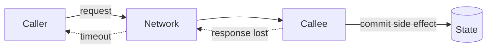
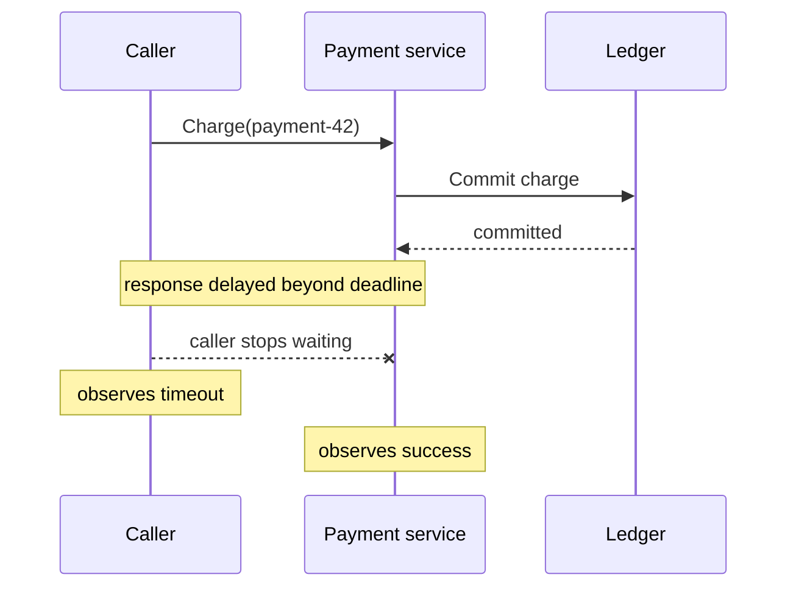
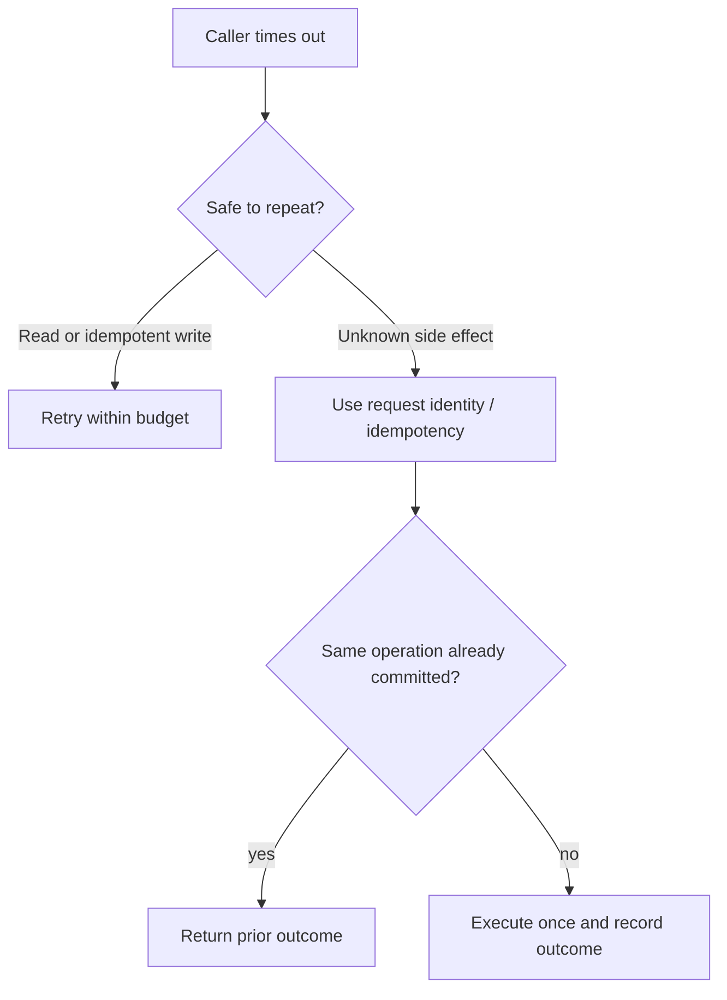
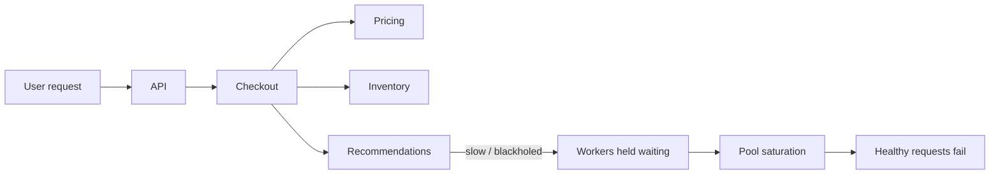

# Partial Failure: Reason About Unknown Outcomes

## TL;DR

A local program often gets a crisp answer: a function returned, or the process crashed. A distributed operation can fail **partially**: one component commits while another times out, a request arrives but its response is lost, or one observer thinks the call failed while another thinks it succeeded.

The hard part is not merely failure. It is **uncertainty about what already happened**.

<TermBox term="Partial Failure">
A **partial failure** happens when some participants or communication paths fail while other parts of the distributed operation continue or complete.
</TermBox>

## A timeout is an observation, not a verdict

Suppose a caller waits two seconds and receives no response. Several realities are possible:

- the request never reached the server;
- the server received it but has not finished;
- the server finished and committed, but the response was lost;
- the response is merely late and arrives after the caller deadline;
- the server crashed before or after changing durable state.

Therefore **a timeout creates an unknown outcome**. It does not prove that the remote operation failed.

This is why treating `DEADLINE_EXCEEDED` as equivalent to “nothing happened” is dangerous for state-changing operations.

## Caller and callee can disagree

gRPC documents an important distributed-systems property: client and server make independent local judgments about an RPC. The server can finish successfully while the client reports deadline exceeded because the response arrived too late.

Neither observer is lying. They have different evidence.

<TermBox term="Ambiguous Outcome">
An **ambiguous outcome** means the caller cannot determine from its local observation whether the remote side effect happened.
</TermBox>

## Failure has more shapes than “server down”

Design for at least these categories:

- **process crash:** one process disappears while peers remain healthy;
- **slow dependency:** a service is alive but misses latency budgets;
- **network partition:** some nodes or paths cannot communicate while others can;
- **lost request:** the caller sent bytes but the callee never received them;
- **lost response:** the callee completed work but the caller never learned that;
- **one-way degradation:** traffic works in one direction or for one subset of nodes only.

A health check that says “up” cannot distinguish all of these states.

## Retrying can repair uncertainty — or duplicate effects

A retry is a new attempt, not a time machine.

If `Charge(payment-42)` committed before the response was lost, retrying an unprotected `Charge()` can create a second charge.

Use a stable **request identity** or idempotency key for operations that may be retried after an ambiguous failure. The server must associate retries with the same logical operation, not merely accept a fresh command each time.

<TermBox term="Request Identity">
A **request identity** is a stable identifier carried across retries so the receiver can recognize multiple transport attempts as one logical operation.
</TermBox>

Idempotency does not make the network reliable. It makes repeated attempts safer.

## Deadlines bound waiting; cancellation bounds wasted work

Every remote dependency consumes time and resources. A caller should propagate a realistic **deadline** rather than letting each nested service start a fresh full timeout.

When the caller no longer needs a result, propagate **cancellation** so downstream work can stop where possible. But cancellation is not rollback: changes committed before cancellation can remain committed.

That distinction matters when a user closes a request, an upstream deadline expires, or a fan-out request abandons slow branches.

## Partial failure creates blast radius through dependency chains

A small failure can become a system failure when synchronous dependencies wait on one another.

Reason about each dependency by asking:

- Is it required for correctness, or merely useful?
- Should we **fail-fast**, **degrade**, use a bounded **fallback**, or **isolate** it?
- What deadline and retry budget does it receive?
- Can one slow dependency exhaust caller threads, connections, or queue capacity?

A noncritical backend is still critical if callers wait forever for it.

## Make uncertainty observable

HTTP status alone is not enough to reconstruct a partial failure. Carry a correlation ID or request ID across service boundaries and preserve it in logs and traces.

Useful signals include dependency latency, timeout rate, retry attempts, duplicate-suppression hits, cancellation count, saturation, and success/error rates by dependency.

For ambiguous writes, record the stable operation ID alongside authoritative business state so an operator can answer: **did this logical operation commit?**

## Production scenario

A checkout service calls a payment provider with `POST /charges`. The provider commits the charge, but the response packet is lost. Checkout reaches its timeout and automatically retries with a fresh request ID.

**Impact:** the customer is charged twice even though the application saw only one checkout action. Operators initially see one timeout and one success, making the incident look contradictory.

**Root cause:** the caller interpreted timeout as proof of failure and retried a non-idempotent side effect without a stable logical request identity. Caller and callee had different local observations of the first attempt.

**Correct pattern:** assign a stable payment operation ID before the first attempt; send it as the idempotency/request key on every retry; set an end-to-end deadline and bounded retry policy; propagate cancellation where useful; persist enough state to reconcile unknown outcomes; and trace attempts with the same correlation ID so operators can distinguish one logical operation from many transport attempts.

Self-check: a payment call timed out. Is it safe to assume no charge happened?

No. The request may have committed and only the response may be missing. Treat the outcome as unknown until you can query/reconcile authoritative state or safely retry using stable request identity and idempotent semantics.

## Production checklist

- [ ] Remote timeouts are modeled as potentially ambiguous outcomes.
- [ ] State-changing retries reuse a stable request identity or idempotency key.
- [ ] Retry budgets are bounded and placed intentionally in the dependency chain.
- [ ] End-to-end deadlines are propagated instead of reset at every hop.
- [ ] Cancellation stops unnecessary downstream work where supported.
- [ ] Code does not assume cancellation rolls back already committed changes.
- [ ] Critical and noncritical dependencies have explicit fail-fast/degrade/fallback/isolation behavior.
- [ ] Connection, worker, thread, and queue saturation are considered in blast-radius analysis.
- [ ] Correlation IDs connect caller, callee, retry, and business-state evidence.
- [ ] Dependency metrics expose latency, timeout, retry, cancellation, and error behavior.
- [ ] Ambiguous writes have a reconciliation path.
- [ ] Failure tests include slow, blackholed, partitioned, and lost-response cases, not only clean 500 errors.

## Agent rule

When a remote call fails, do not collapse “I did not receive a successful response” into “the operation did not happen.” Model the possible remote states, preserve logical request identity across retries, bound waiting and retry amplification, and design an evidence path that can reconcile ambiguous outcomes.

## Sources

- gRPC — [Core concepts: RPC termination, deadlines, and cancellation](https://grpc.io/docs/what-is-grpc/core-concepts/)
- gRPC — [Deadlines](https://grpc.io/docs/guides/deadlines/)
- Amazon Builders' Library — [Timeouts, retries, and backoff with jitter](https://aws.amazon.com/builders-library/timeouts-retries-and-backoff-with-jitter/)
- Amazon Builders' Library — [Making retries safe with idempotent APIs](https://aws.amazon.com/builders-library/making-retries-safe-with-idempotent-APIs/)
- Stripe — [Idempotent requests](https://docs.stripe.com/api/idempotent_requests)
- Google SRE — [Addressing Cascading Failures](https://sre.google/sre-book/addressing-cascading-failures/)
