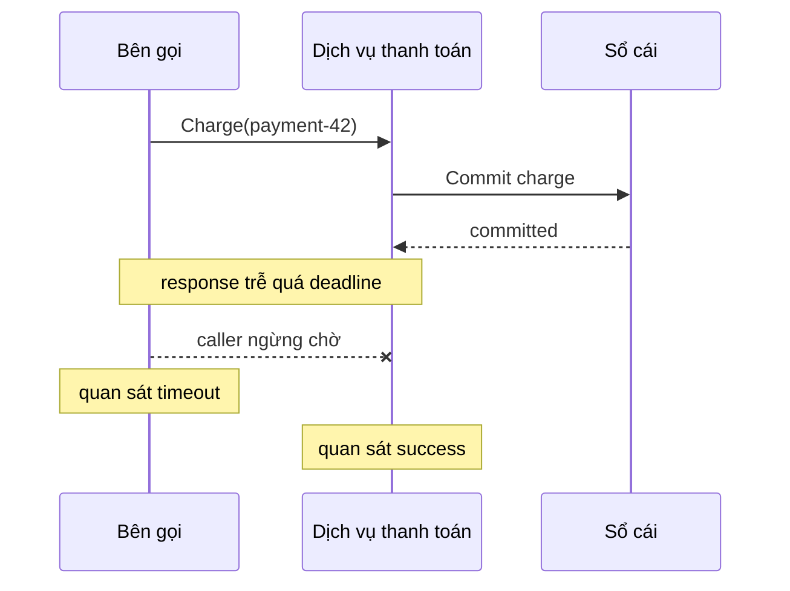
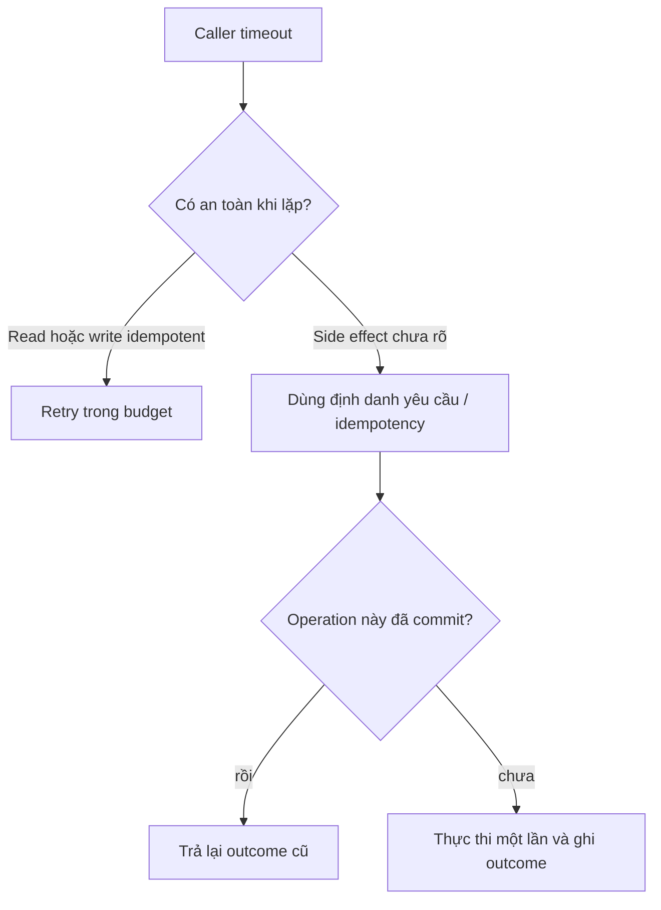
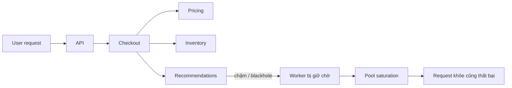

# Partial Failure: Suy luận khi kết quả không chắc chắn

## Tóm tắt nhanh

Trong chương trình cục bộ, kết quả thường khá rõ: hàm trả về hoặc process crash. Với hệ thống phân tán, có thể xảy ra **lỗi một phần**: một component đã commit nhưng component khác timeout, request tới nơi nhưng response bị mất, hoặc một observer cho rằng call thất bại trong khi observer khác thấy thành công.

Khó khăn cốt lõi không chỉ là failure. Đó là **không chắc điều gì đã xảy ra ở phía xa**.

<TermBox term="Partial Failure">
**Partial failure** là tình huống một số participant hoặc đường truyền lỗi trong khi các phần khác của thao tác phân tán vẫn tiếp tục hoặc đã hoàn tất.
</TermBox>

## Timeout là một quan sát, không phải phán quyết

Giả sử bên gọi chờ hai giây nhưng không nhận response. Nhiều thực tế đều có thể đúng:

- request chưa bao giờ tới server;
- server đã nhận nhưng chưa xử lý xong;
- server đã xử lý và commit nhưng response bị mất;
- response chỉ tới trễ sau deadline của caller;
- server crash trước hoặc sau khi đổi durable state.

Vì vậy **timeout không chứng minh operation thất bại**; kết quả vẫn có thể không rõ.

Với thao tác thay đổi state, coi `DEADLINE_EXCEEDED` là “không có gì xảy ra” là một giả định nguy hiểm.

## Bên gọi và bên nhận có thể kết luận khác nhau

gRPC nêu rõ một thuộc tính quan trọng: client và server đưa ra kết luận cục bộ độc lập về cùng một RPC. Server có thể hoàn tất thành công trong khi client báo deadline exceeded vì response tới quá trễ.

Hai phía không mâu thuẫn về tính trung thực; họ chỉ có bằng chứng khác nhau.

<TermBox term="Kết quả mơ hồ">
**Kết quả mơ hồ** là khi bên gọi không thể từ quan sát cục bộ xác định side effect phía xa đã xảy ra hay chưa.
</TermBox>

## Failure có nhiều hình dạng hơn “server down”

Thiết kế nên tính ít nhất các nhóm sau:

- **process crash:** một process biến mất trong khi peer vẫn khỏe;
- **dependency chậm:** service còn sống nhưng vượt latency budget;
- **phân vùng mạng:** một số node hoặc path không giao tiếp được, phần khác vẫn hoạt động;
- **request bị mất:** caller gửi nhưng callee không nhận;
- **mất phản hồi:** callee hoàn tất nhưng caller không biết;
- **degradation một chiều:** traffic chỉ lỗi theo một hướng hoặc một nhóm node.

Một health check báo “up” không phân biệt được hết các trạng thái này.

## Retry có thể sửa uncertainty — hoặc nhân đôi side effect

Một lần retry là attempt mới, không phải quay ngược thời gian.

Nếu `Charge(payment-42)` đã commit trước khi response bị mất, thử lại bằng một lệnh `Charge()` mới có thể tạo giao dịch trùng và tác dụng phụ lặp.

Với operation có thể retry sau failure mơ hồ, hãy dùng **định danh yêu cầu** ổn định hoặc idempotency key. Server phải nhận ra nhiều transport attempt thuộc cùng một logical operation, thay vì coi mỗi retry là command mới.

<TermBox term="Định danh yêu cầu">
**Định danh yêu cầu** là identifier ổn định được giữ qua các retry để receiver nhận ra nhiều attempt chỉ đại diện cho một logical operation.
</TermBox>

Idempotency không làm network đáng tin cậy hơn; nó làm việc thử lại an toàn hơn.

## Deadline giới hạn chờ; cancellation giới hạn công việc lãng phí

Mỗi remote dependency tiêu tốn thời gian và tài nguyên. Bên gọi nên truyền một **hạn chót (deadline)** end-to-end hợp lý thay vì để mỗi hop bắt đầu lại một timeout đầy đủ.

Khi caller không còn cần kết quả, hãy truyền **cancellation** để downstream dừng công việc nếu có thể. Nhưng cancellation không phải rollback: thay đổi đã commit trước lúc hủy có thể vẫn còn nguyên.

Điều này quan trọng khi request phía trên hết deadline, user bỏ thao tác, hoặc fan-out bỏ các nhánh quá chậm.

## Partial failure tạo phạm vi ảnh hưởng qua chuỗi dependency

Một lỗi nhỏ có thể thành lỗi hệ thống nếu các synchronous dependency cứ chờ lẫn nhau.

Với mỗi dependency, hãy hỏi:

- Nó bắt buộc cho correctness hay chỉ hữu ích?
- Nên **fail-fast**, **suy giảm chức năng**, dùng **fallback** có giới hạn hay **cô lập**?
- Nó nhận deadline và retry budget bao nhiêu?
- Một dependency chậm có thể làm cạn thread, connection hoặc queue capacity của caller không?

Backend “không quan trọng” vẫn có thể trở thành critical nếu caller chờ nó vô hạn.

## Làm uncertainty quan sát được

HTTP status một mình không đủ tái dựng partial failure. Hãy truyền **mã tương quan (correlation ID)** hoặc request ID qua boundary và giữ nó trong log/trace.

Các signal hữu ích gồm dependency latency, timeout rate, số retry attempt, duplicate-suppression hit, cancellation count, saturation và success/error rate theo dependency.

Với write có outcome mơ hồ, lưu logical operation ID cùng authoritative business state để operator trả lời được: **operation này đã commit chưa?**

## Kịch bản production

Checkout gọi payment provider bằng `POST /charges`. Provider đã commit charge nhưng response packet bị mất. Checkout timeout rồi tự retry bằng một request ID mới.

**Hậu quả:** khách hàng bị charge hai lần dù chỉ thực hiện một checkout. Operator thấy một timeout và một success nên incident ban đầu trông như dữ liệu mâu thuẫn.

**Nguyên nhân cốt lõi:** caller coi timeout là bằng chứng operation thất bại rồi retry side effect không idempotent mà không có logical request identity ổn định. Bên gọi và bên nhận có hai quan sát cục bộ khác nhau về attempt đầu tiên.

**Cách khắc phục chuẩn:** tạo payment operation ID ổn định trước attempt đầu; gửi cùng idempotency/request key cho mọi retry; đặt deadline end-to-end và retry policy có giới hạn; propagate cancellation khi hữu ích; persist đủ state để reconcile unknown outcome; và trace mọi attempt bằng cùng correlation ID để phân biệt một logical operation với nhiều transport attempt.

Tự kiểm tra: payment call timeout thì có thể kết luận chắc chắn chưa charge không?

Không. Request có thể đã commit và chỉ response bị mất. Hãy coi outcome là chưa rõ cho tới khi query/reconcile authoritative state hoặc retry an toàn bằng request identity ổn định và idempotent semantics.

## Checklist production

- [ ] Remote timeout được mô hình hóa như một outcome có thể mơ hồ.
- [ ] Retry cho state-changing operation dùng lại request identity hoặc idempotency key ổn định.
- [ ] Retry budget có giới hạn và được đặt có chủ đích trong dependency chain.
- [ ] Deadline end-to-end được truyền xuống thay vì reset ở mỗi hop.
- [ ] Cancellation dừng downstream work không còn cần thiết khi protocol hỗ trợ.
- [ ] Code không giả định cancellation rollback thay đổi đã commit.
- [ ] Dependency critical và noncritical đều có hành vi fail-fast/degrade/fallback/isolation rõ.
- [ ] Blast radius tính cả saturation của connection, worker, thread và queue.
- [ ] Correlation ID nối caller, callee, retry và bằng chứng business state.
- [ ] Metric theo dependency thể hiện latency, timeout, retry, cancellation và error.
- [ ] Write có outcome mơ hồ có đường reconciliation.
- [ ] Failure test gồm case chậm, blackhole, partition và lost response, không chỉ clean HTTP 500.

## Agent rule

Khi remote call thất bại, đừng biến “tôi không nhận được success response” thành “operation không xảy ra”. Hãy liệt kê các remote state có thể có, giữ logical request identity qua retry, giới hạn waiting/retry amplification và thiết kế đường bằng chứng để reconcile outcome mơ hồ.

## Nguồn

- gRPC — [Core concepts: RPC termination, deadlines, and cancellation](https://grpc.io/docs/what-is-grpc/core-concepts/)
- gRPC — [Deadlines](https://grpc.io/docs/guides/deadlines/)
- Amazon Builders' Library — [Timeouts, retries, and backoff with jitter](https://aws.amazon.com/builders-library/timeouts-retries-and-backoff-with-jitter/)
- Amazon Builders' Library — [Making retries safe with idempotent APIs](https://aws.amazon.com/builders-library/making-retries-safe-with-idempotent-APIs/)
- Stripe — [Idempotent requests](https://docs.stripe.com/api/idempotent_requests)
- Google SRE — [Addressing Cascading Failures](https://sre.google/sre-book/addressing-cascading-failures/)
