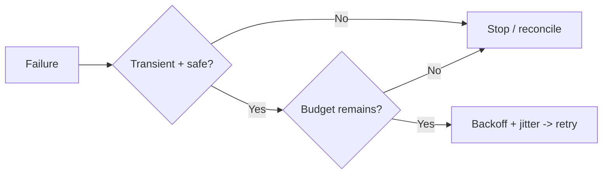
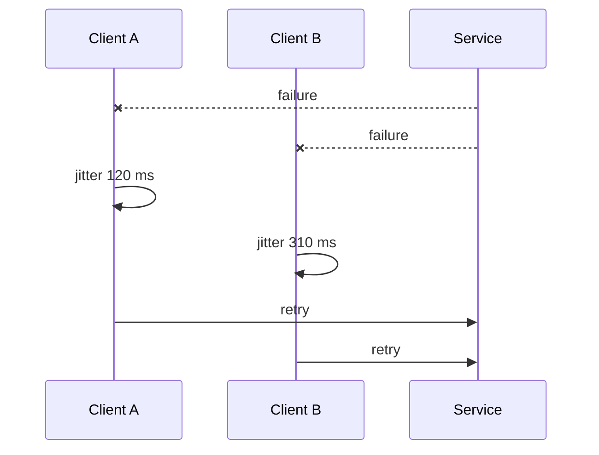

# Retries and Backoff: Recover Without Amplifying Failure

## TL;DR

Retry only when another attempt can plausibly help **and** repetition is safe. Retries consume capacity on a dependency that may already be unhealthy, so bound both correctness risk and extra load.



<TermBox term="Retryability">
A failure is **retryable** when a later attempt can change the outcome. Temporary transport, throttling, or availability failures can qualify; invalid input, bad credentials, and stable business rejection are usually deterministic.
</TermBox>

## Classify before retrying

| Signal | Default decision |
| --- | --- |
| transient transport error | retry if safety and budget hold |
| `429` / `503` | back off; honor valid `Retry-After` |
| auth / validation / business rejection | do not retry unchanged input |
| ambiguous write timeout | require idempotency or reconciliation |

<TermBox term="Retry Budget">
A **retry budget** bounds extra work by attempt count, elapsed time, remaining deadline, or shared quota.
</TermBox>

## Make writes safe first

If attempt one may have committed, a new logical request can duplicate a payment or reservation. Reuse the same idempotency identity or reconcile state first. Retry does not create idempotency.

## Back off, jitter, stay inside the deadline

```text
100 ms -> 200 ms -> 400 ms -> capped delay
```

**Exponential backoff** spaces attempts farther apart. **Jitter** randomizes waits so a fleet does not wake together. Bound attempts and delay, and never sleep past the remaining deadline.



## Choose one retry owner

If Client, Service A, and Service B each allow three total attempts, one original request can drive `3 × 3 × 3 = 27` attempts at the deepest dependency. Pick the layer with context to judge value, safety, and remaining deadline. Existing SDK retries count too.

<TermBox term="Retry Storm">
A **retry storm** is overload amplified by retries: recovery traffic becomes part of the incident.
</TermBox>

## Protect the fleet

During broad failure, a shared **retry budget** or **token bucket** can suppress retries. AWS SDK standard mode uses a token-backed retry quota. Observe original requests separately from attempts, retry reason, exhausted budget, and saturation.

## Production scenario

A gateway calls Checkout → Inventory → database. During a latency spike every layer retries twice, uses deterministic backoff, and reservation writes lack stable idempotency identity.

**Impact:** one user request can drive up to 27 database attempts; synchronized retries create bursts, saturation worsens, and ambiguous writes can duplicate reservations.

**Root cause:** retry ownership was spread across layers, failures were not classified, writes were unsafe to repeat, and timing synchronized the fleet.

**Correct pattern:** choose one retry owner, retry only transient failures, preserve one logical request identity, bound attempts inside the remaining deadline, use exponential backoff with jitter, honor valid `Retry-After`, and stop when the shared retry budget is depleted. Measure original requests separately from attempts.

## Self-check

Your SDK and service wrapper already retry. A dependency starts returning `503`. Should the gateway add another retry loop?

<details>
<summary>Show the reasoning</summary>

No. Recover existing retry layers, choose one owner, and coordinate the total attempt/deadline budget before changing policy.

</details>

## Retry operating checklist

- [ ] Retry transient failures, not deterministic ones.
- [ ] Make ambiguous writes idempotent or reconcile first.
- [ ] Fit retries inside the remaining deadline.
- [ ] Assign one owner and include SDK retries.
- [ ] Cap backoff, add jitter, respect `Retry-After`.
- [ ] Bound fleet retries and observe request vs attempt volume.

## Agent rule

Before adding retries, recover failure class, operation safety, deadline, existing retries, ownership, bounds, backoff/jitter, server hints, fleet budget, and telemetry. Reject uncoordinated retry loops.

## Sources

Primary references verified on **2026-09-15**: [RFC 9110](https://www.rfc-editor.org/rfc/rfc9110.html), [AWS retry guidance](https://docs.aws.amazon.com/wellarchitected/latest/reliability-pillar/rel_mitigate_interaction_failure_limit_retries.html), and [AWS SDK retry behavior](https://docs.aws.amazon.com/sdkref/latest/guide/feature-retry-behavior.html).
