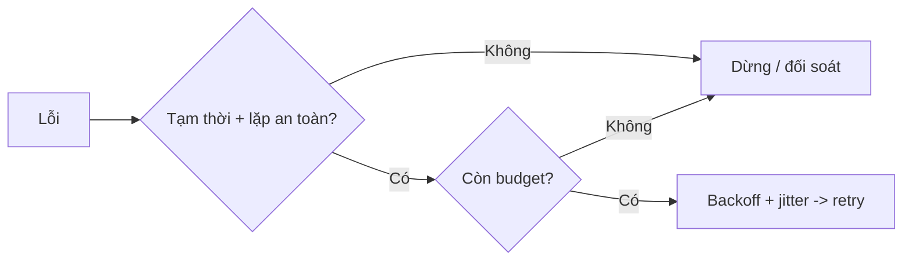
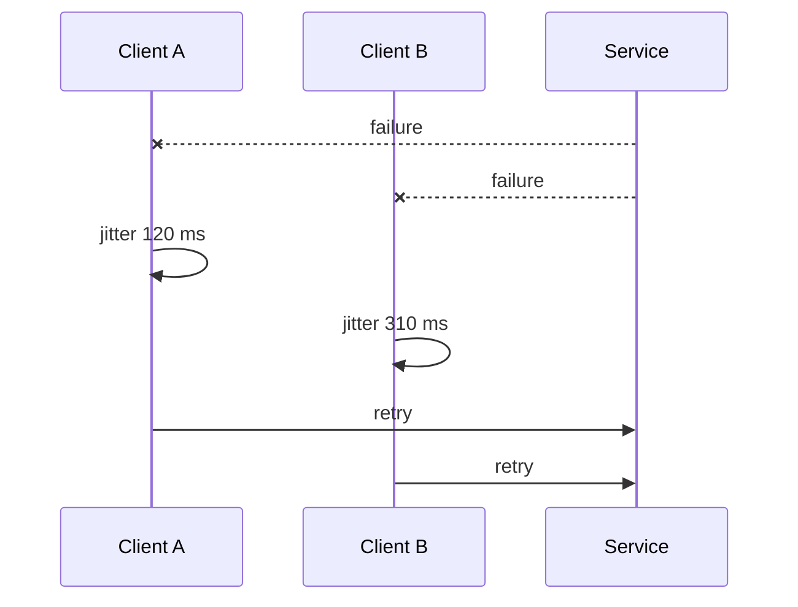

# Retries và Backoff: Phục hồi mà không làm sự cố lan rộng

## Tóm tắt

Hãy hình dung một lối thoát hiểm trên đường cao tốc đang xảy ra ùn tắc nhẹ vào giờ cao điểm. Thay vì kiên nhẫn giảm tốc độ và nhường nhau từng làn, hàng trăm tài xế phía sau đồng loạt nhấn ga, lạng lách và liên tục lao thẳng vào điểm nghẽn cùng một nhịp cứ mỗi hai giây một lần. Hậu quả tức thì là tê liệt toàn diện: một sự cố va chạm nhỏ ban đầu bị biến thành một bãi đỗ xe bất đắc dĩ kéo dài hàng cây số. Trong kiến trúc hệ thống phân tán, kịch bản kinh hoàng này lặp lại y hệt dưới cái tên **cơn bão thử lại (retry storm)**—nơi các đoạn mã retry tự động với ý đồ tốt vô tình biến chính lưu lượng của hệ thống thành một đợt tấn công từ chối dịch vụ (DDoS) đánh sập hoàn toàn service phía sau đang thoi thóp.

> 💡 **Quy tắc bỏ túi:** Chỉ thử lại các lỗi tạm thời trên thao tác idempotent trong giới hạn deadline còn lại; bắt buộc dùng exponential backoff kèm jitter và chỉ định duy nhất một tầng sở hữu retry.

- **Phân loại lỗi trước khi retry:** Chỉ retry các lỗi đường truyền mạng **tạm thời (transient)**, phản hồi chạm giới hạn tần suất (`429`), hoặc máy chủ quá tải nhất thời (`503`). Tuyệt đối không retry các lỗi có tính xác định (deterministic) như sai định dạng dữ liệu, sai quyền truy cập hay vi phạm logic nghiệp vụ vì chúng sẽ **không tự hết**.
- **Tính idempotent là bắt buộc đối với thao tác ghi:** Một lần retry qua mạng là một nỗ lực mới, không phải cỗ máy quay ngược thời gian. Với các thao tác ghi dữ liệu, bắt buộc phải có **định danh yêu cầu (idempotency key)** hoặc cơ chế **đối soát (reconciliation)** để ngăn chặn việc trừ tiền lặp hoặc đặt trùng chỗ khi request đầu tiên đã commit thành công.
- **Giãn cách lũy thừa kèm độ lệch ngẫu nhiên (jitter):** Không bao giờ retry ngay tức khắc. Bắt buộc áp dụng **exponential backoff** để kéo giãn thời gian chờ, đồng thời chèn thêm **jitter** ngẫu nhiên nhằm phân tán lưu lượng, ngăn chặn việc cả một cụm client cùng thức dậy và dội tải vào hệ thống cùng một giây.
- **Chỉ định duy nhất một chủ sở hữu retry (retry owner):** Xác lập rõ quyền sở hữu retry tại một tầng duy nhất trong kiến trúc. Nếu Client, API Gateway và Service trung gian đều độc lập retry 3 lần, một request lỗi từ người dùng sẽ bị khuếch đại thành `3 × 3 × 3 = 27` lượt gọi dồn dập vào tầng database sâu nhất.
- **Cạm bẫy chết người:** **Retry mù quáng ở nhiều tầng với khoảng thời gian cố định.** Việc lồng ghép các vòng lặp retry thiếu jitter qua các tầng microservice sẽ tạo ra vòng lặp khuếch đại phản hồi, biến một biến động độ trễ 200 ms của downstream thành sự cố sập nguồn toàn diện của toàn bộ hạ tầng.



<TermBox term="Retryability">
Failure **retryable** khi attempt sau có thể đổi outcome. Transport tạm thời, throttling hoặc unavailable có thể phù hợp; input/credential sai thường deterministic.
</TermBox>

## Phân loại trước khi retry

| Tín hiệu | Quyết định mặc định |
| --- | --- |
| transient transport error | retry nếu an toàn và còn budget |
| `429` / `503` | back off; tôn trọng `Retry-After` hợp lệ |
| auth / validation / business rejection | không retry input không đổi |
| timeout sau write có outcome mơ hồ | cần idempotency hoặc reconciliation |

<TermBox term="Retry Budget">
**Ngân sách retry** giới hạn công việc thêm bằng số attempt, thời gian đã dùng, deadline còn lại hoặc shared quota.
</TermBox>

## Làm write an toàn trước

Nếu attempt đầu có thể đã commit, request mới có thể tạo effect trùng. Dùng lại idempotency identity hoặc đối soát state trước. Retry không tự tạo idempotency.

## Backoff, jitter và giữ trong deadline

```text
100 ms -> 200 ms -> 400 ms -> capped delay
```

**Exponential backoff** giãn attempt; **jitter** ngẫu nhiên hóa wait để fleet không thức cùng lúc. Cap attempt/delay và không sleep quá deadline còn lại.



## Chọn một retry owner

Nếu Client, Service A và Service B đều cho ba total attempt, một request gốc có thể tạo `3 × 3 × 3 = 27` attempt. Chọn một **retry owner** có đủ context; tính cả SDK retry.

<TermBox term="Retry Storm">
**Bão retry** là overload bị retry khuếch đại: recovery traffic trở thành một phần của sự cố.
</TermBox>

## Bảo vệ cả fleet

Khi failure lan rộng, **retry budget** hoặc **token bucket** có thể giảm retry. Quan sát request gốc tách khỏi số attempt, cùng lý do retry, cạn budget và saturation.

## Kịch bản production

Gateway gọi Checkout → Inventory → database. Khi latency tăng, mọi layer retry hai lần, dùng deterministic backoff và write thiếu stable idempotency identity.

**Hậu quả:** một user request có thể tạo tới 27 database attempt; retry đồng bộ tạo burst, saturation nặng hơn và ambiguous write có thể tạo reservation trùng.

**Nguyên nhân cốt lõi:** retry ownership bị rải ở nhiều layer, failure không được phân loại, write không an toàn khi lặp và timing làm cả fleet đồng bộ.

**Cách khắc phục chuẩn:** chọn một retry owner, chỉ retry transient failure, giữ logical request identity, bound attempt trong deadline còn lại, dùng exponential backoff có jitter, tôn trọng `Retry-After` và dừng khi retry budget cạn. Tách original request khỏi attempt.

## Tự kiểm tra

SDK và service wrapper của bạn đều đã retry. Dependency bắt đầu trả `503`. Có nên thêm retry loop ở gateway không?

<details>
<summary>Xem giải thích chi tiết</summary>

Không. Trước tiên hãy tìm toàn bộ retry hiện có, chọn một owner và phối hợp total attempt/deadline budget rồi mới đổi policy.

</details>

## Checklist vận hành retry

- [ ] Chỉ retry failure tạm thời, không retry lỗi deterministic.
- [ ] Làm ambiguous write idempotent hoặc đối soát trước.
- [ ] Giữ mọi retry trong deadline còn lại.
- [ ] Chọn một retry owner và tính cả SDK retry.
- [ ] Cap backoff, thêm jitter, tôn trọng `Retry-After`.
- [ ] Giới hạn retry toàn fleet và tách request gốc khỏi attempt trong observability.

## Agent rule

Trước khi thêm retry, hãy tìm failure class, safety, deadline, retry hiện có, ownership, bounds, backoff/jitter, server hint, fleet budget và telemetry.

## Nguồn

Nguồn chính kiểm tra ngày **2026-09-15**: [RFC 9110](https://www.rfc-editor.org/rfc/rfc9110.html), [AWS retry guidance](https://docs.aws.amazon.com/wellarchitected/latest/reliability-pillar/rel_mitigate_interaction_failure_limit_retries.html), [AWS SDK retry behavior](https://docs.aws.amazon.com/sdkref/latest/guide/feature-retry-behavior.html).
