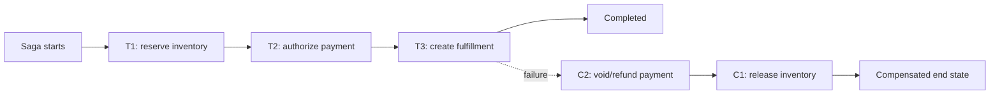
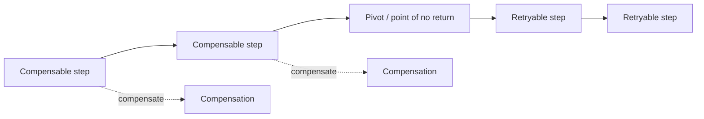
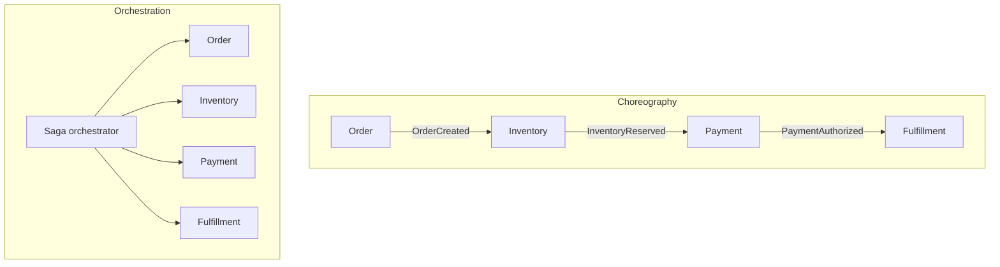

# Sagas: Coordinate Distributed Workflows with Compensation

## TL;DR

A Saga is a **sequence of local transactions** that together implement a long-lived business workflow across independently owned services or data stores. Each step commits locally. If a later step cannot complete, the workflow runs compensating actions for earlier work when the business semantics allow it.

That is a different contract from one ACID transaction. A Saga does not hide intermediate state, does not provide global isolation, and does not make time run backward. It makes progress and recovery explicit.

<TermBox term="Saga">
A **Saga** is a durable multi-step workflow built from local transactions. The workflow records enough state to continue forward, retry, or compensate after process crashes and partial failure.
</TermBox>

## Local commits change the problem

A normal database transaction can keep multiple writes atomic because one transaction manager controls the affected data. A cross-service workflow often cannot rely on the same boundary without a distributed transaction protocol such as 2PC.

A Saga deliberately narrows atomicity. Each participant commits its own local transaction, releases local locks, and communicates the next intent. This supports long-running work that may take seconds, minutes, hours, or longer without holding one global transaction open.

The cost is visible intermediate state. After inventory is reserved but before payment is authorized, other actors can observe a system that is neither at the original state nor at the final state. Saga design therefore requires explicit business states such as `PENDING_PAYMENT`, `RESERVED`, `COMPENSATING`, and `COMPLETED` rather than pretending the workflow is invisible until the end.

## Compensation is semantic undo, not rollback

A database rollback erases uncommitted work inside one transaction. A Saga compensation is a **new committed transaction** whose business meaning counteracts an earlier committed step.

Examples:

| Forward action | Possible compensation | What cannot be erased |
| --- | --- | --- |
| Reserve inventory | Release reservation | The reservation existed and may have affected availability |
| Authorize payment | Void authorization | Provider request/audit history |
| Capture payment | Refund payment | Fees, timing, notifications, settlement history |
| Send email | Send correction | The recipient may already have read the first email |

<TermBox term="Compensating Transaction">
A **compensating transaction** is a new durable action that semantically offsets a previous committed action. It is **not a rollback** and may itself fail, be retried, or require human reconciliation.
</TermBox>

A useful compensation should be idempotent whenever possible. Replaying `ReleaseReservation(sagaId, reservationId)` should not release twice. The compensation also needs its own durable status; “we attempted the refund” is not equivalent to “the refund succeeded.”

## Classify steps as compensable, pivot, or retryable

Many practical Saga designs become clearer when steps are classified around a **pivot**.

Before the pivot, completed steps must have a credible compensation path. The pivot is the point where the workflow commits to a business outcome that should no longer be abandoned casually. After the pivot, later steps should normally be designed as retryable until completion instead of trying to unwind the committed outcome.

<TermBox term="Pivot Transaction">
A **pivot transaction** is the workflow's point of no return. Before it, backward recovery through compensation remains acceptable. After it, the preferred strategy is forward recovery through idempotent retry, reconciliation, or repair.
</TermBox>

The pivot is a business decision, not a framework feature. For one workflow it may be “capture payment”; for another it may be “issue a non-refundable entitlement” or “hand the parcel to an external carrier.”

## Unknown outcome comes before compensation

Distributed calls can time out after the remote side has committed. Suppose the Payment service receives `AuthorizePayment(op-42)`, commits the authorization, but the response is lost. The Saga sees a timeout.

Compensating immediately is unsafe because the coordinator does not yet know whether there is anything to compensate. The safe sequence is usually:

1. Keep the step in an `UNKNOWN` or `AWAITING_CONFIRMATION` state.
2. Retry or query with the same stable operation ID.
3. Reconcile the remote result.
4. Only then decide whether to continue forward or compensate.

This is the same partial-failure rule that makes idempotency essential. A timeout is evidence that the result is unknown, not proof that the operation failed.

## Choreography and orchestration are coordination styles

Saga semantics do not require one particular topology. Two common styles are choreography and orchestration.

**Choreography** lets participants react to events and emit new events. It keeps a central coordinator out of the happy path, but the workflow graph can become implicit across subscriptions. Cycles, hidden dependencies, compensation ownership, and end-to-end debugging become harder as the number of participants grows.

**Orchestration** gives one durable coordinator explicit knowledge of the workflow state machine. Participants receive commands and report outcomes. The control flow is easier to inspect and change, but the orchestrator becomes an important production component whose state, availability, versioning, and recovery must be engineered carefully.

Choose based on workflow complexity and ownership. “No central service” is not automatically looser coupling if every participant must know which event advances which other participant.

## Persist workflow state, not just messages

A production Saga needs a durable state model. At minimum, record:

- a stable **Saga ID** or workflow ID;
- current workflow state and completed step states;
- command/event identity and correlation ID;
- attempts, timestamps, and timeout/deadline metadata;
- compensation status separately from forward-step status;
- enough input or references to resume deterministically after restart.

A process-local promise chain is not a durable Saga. If the coordinator crashes after payment succeeds, a replacement process must be able to reconstruct what happened and what is safe to do next.

Messaging durability is a separate boundary. A transactional outbox can atomically store a participant's local state change and the command/event that advances the Saga. Inbox or processed-message records can make consumers duplicate-safe. The outbox solves reliable publication; the Saga solves multi-step business coordination. They often work together but are not substitutes.

## Isolation still needs a business design

Sagas do not provide isolation across the whole workflow. Other requests can observe or modify data while the Saga is in progress.

Common countermeasures include:

- explicit `PENDING` or `RESERVED` states that block invalid transitions;
- expiring reservations instead of permanent resource consumption;
- semantic locks such as “order is being cancelled” rather than a database lock held for minutes;
- version checks or optimistic concurrency before applying later steps;
- commutative operations when possible;
- business rules that tolerate a known intermediate state and reconcile it later.

The right question is not “how do I hide every intermediate state?” but “which invariants must hold while the workflow is incomplete?”

## Compensation can fail too

Backward recovery is itself a distributed workflow. Refund APIs can time out. Inventory release can hit a transient database failure. A participant can be unavailable for hours.

Therefore compensation needs the same engineering discipline as forward work: stable identity, idempotency, bounded retries, durable state, backoff, dead-letter or quarantine paths for deterministic failures, and operator-visible reconciliation.

Never mark a Saga `COMPENSATED` merely because compensations were scheduled. Mark it only after the required compensating outcomes are confirmed.

## Production micro-scenario: fulfillment fails after payment

Checkout creates order `o-731` under Saga `saga-8841`.

1. Inventory reserves the final unit with reservation `r-91`.
2. Payment authorizes `$149` under idempotency key `saga-8841:authorize`.
3. Fulfillment rejects the destination because the carrier cannot serve the address.
4. The Saga enters compensation: void payment, then release inventory.
5. The payment void call times out after the provider may already have accepted it.

**Impact:** The order remains stuck in `COMPENSATING`. Inventory is still unavailable, support sees an authorized payment, and a naive retry risks submitting a second void/refund or releasing resources before the payment result is known.

**Root cause:** The workflow treated compensation like a synchronous rollback and treated a timeout as proof of failure. It did not persist compensation state or reuse a stable operation identity for reconciliation.

**Correct pattern:** Persist the Saga and every step outcome. Keep the payment compensation in an unknown state, query or retry using the same idempotency key until the provider result is known, then release inventory only according to the workflow's explicit compensation order. Alert on Saga age and compensation failures so unresolved cases reach an operator instead of disappearing in logs.

Show the reasoning

The forward payment step and the compensation step cross the same unreliable network boundary. Both can commit remotely while the response is lost. The safe model is therefore symmetrical: a timeout creates uncertainty, stable identity makes retry/reconciliation safe, and durable workflow state prevents a crash from erasing what still needs to happen.

## Observability should answer “which workflows are stuck?”

Useful Saga telemetry includes:

- count of Sagas by state;
- age of the oldest nonterminal Saga;
- per-step latency and retry rate;
- compensation rate and compensation failure count;
- time spent in `UNKNOWN` or reconciliation states;
- transitions into manual intervention or quarantine;
- correlation from Saga ID to participant logs, messages, and traces.

A global error rate alone is not enough. Ten workflows stuck for three hours can be more urgent than thousands of healthy workflows completing with occasional retries.

## Saga versus neighboring patterns

**Saga versus 2PC/distributed transaction.** 2PC coordinates a shared commit decision across participating transactional resources. A Saga allows each local transaction to commit independently and recovers through forward progress or compensation. Choose based on the required atomicity and the systems involved, not because one pattern is fashionable.

**Saga versus transactional outbox.** Outbox closes the local database-plus-message dual-write gap. It does not define the multi-step business workflow, compensation order, or pivot. A Saga frequently uses outbox at participant boundaries.

**Saga versus workflow engine.** A workflow engine can provide durable timers, retries, state persistence, and orchestration primitives. Those capabilities help implement a Saga, but the business semantics of compensation, pivot points, and invariants still belong to the application design.

## When a Saga is the wrong tool

Do not introduce a Saga when one local ACID transaction already owns the invariant. It adds states, retries, compensation logic, and operational work.

Be cautious when an operation has no credible compensation and cannot be made safely retryable after a pivot. In that case the architecture may need a different ownership boundary, a reservation/preauthorization model, stricter coordination, or explicit human approval before the irreversible step.

## Failure-oriented review checklist

- [ ] **Boundary:** Does the workflow truly span independently committed resources, or would one local transaction be simpler?
- [ ] **State:** Is the Saga ID and each forward/compensation step persisted durably?
- [ ] **Unknown outcomes:** Does a timeout enter reconciliation instead of being treated as definite failure?
- [ ] **Idempotency:** Can every retryable forward step and compensation replay safely under a stable operation ID?
- [ ] **Compensation:** Does each compensable step have a semantically valid inverse, including irreversible side effects that cannot be erased?
- [ ] **Pivot:** Is the point of no return explicit, with forward recovery after it?
- [ ] **Isolation:** Are intermediate states protected by reservations, semantic locks, version checks, or business invariants?
- [ ] **Delivery:** Are local state changes and Saga messages connected safely, for example with an outbox/inbox boundary?
- [ ] **Observability:** Can operators find stuck Sagas, old unknown states, and failed compensations quickly?
- [ ] **Manual recovery:** Is there a documented reconciliation path for cases automation cannot resolve?

## Rules for agents

- [ ] Do not describe Saga compensation as if it were a database rollback.
- [ ] Persist workflow progress before relying on another process to continue it.
- [ ] Treat timeout as an unknown outcome and reconcile with stable identity before compensating.
- [ ] Make forward retries and compensations idempotent wherever the downstream system allows it.
- [ ] Make the pivot and irreversible side effects explicit in the workflow design.
- [ ] Do not assume Sagas provide isolation; design valid intermediate states deliberately.
- [ ] Use outbox/inbox patterns to protect message boundaries without confusing them with Saga semantics.
- [ ] Alert on Saga age and compensation failure, not only request-level error rates.

## Primary sources

- Hector Garcia-Molina and Kenneth Salem, **Sagas**, ACM SIGMOD 1987: https://dl.acm.org/doi/10.1145/38714.38742
- AWS Prescriptive Guidance, **Saga patterns**: https://docs.aws.amazon.com/prescriptive-guidance/latest/cloud-design-patterns/saga-patterns.html
- Microsoft Azure Architecture Center, **Saga distributed transactions pattern**: https://learn.microsoft.com/en-us/azure/architecture/patterns/saga
