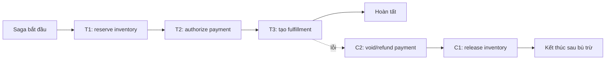
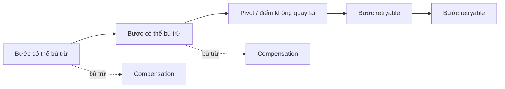
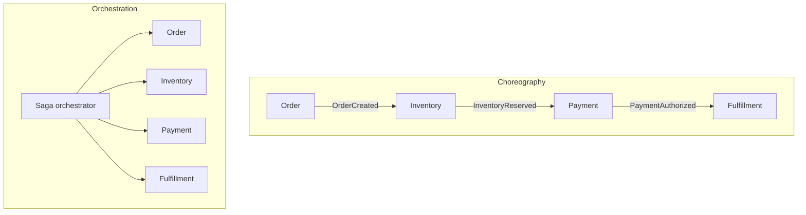

# Sagas: Điều phối workflow phân tán bằng bù trừ

## TL;DR

Saga là một **chuỗi local transaction** cùng nhau triển khai một business workflow dài hạn qua các service hoặc data store có quyền sở hữu độc lập. Mỗi bước commit cục bộ. Nếu một bước phía sau không thể hoàn tất, workflow chạy các hành động bù trừ cho phần việc đã commit trước đó khi business semantics cho phép.

Đây là contract khác với một transaction ACID duy nhất. Saga không che giấu trạng thái trung gian, không cung cấp isolation toàn cục và không làm thời gian quay ngược. Nó làm progress cùng recovery trở nên tường minh.

<TermBox term="Saga">
Một **Saga** là workflow nhiều bước bền vững được xây từ các local transaction. Workflow lưu đủ trạng thái để tiếp tục tiến về trước, retry hoặc bù trừ sau process crash và partial failure.
</TermBox>

## Local commit làm bài toán thay đổi

Một database transaction thông thường có thể giữ nhiều write nguyên tử vì một transaction manager kiểm soát dữ liệu liên quan. Workflow xuyên service thường không có cùng boundary đó nếu không dùng giao thức distributed transaction như 2PC.

Saga chủ động thu hẹp atomicity. Mỗi participant commit local transaction của mình, giải phóng lock cục bộ rồi truyền ý định tiếp theo. Cách này phù hợp với long-running workflow kéo dài vài giây, vài phút, vài giờ hoặc lâu hơn mà không giữ một global transaction mở suốt thời gian đó.

Đổi lại, trạng thái trung gian trở nên quan sát được. Sau khi inventory đã reserve nhưng trước khi payment được authorize, actor khác có thể thấy hệ thống không còn ở trạng thái ban đầu nhưng cũng chưa đạt trạng thái cuối. Vì vậy thiết kế Saga cần các business state tường minh như `PENDING_PAYMENT`, `RESERVED`, `COMPENSATING` và `COMPLETED` thay vì giả định workflow vô hình cho tới cuối.

## Bù trừ là semantic undo, không phải rollback

Database rollback xóa phần việc chưa commit bên trong một transaction. Saga compensation là một **transaction mới đã commit** có ý nghĩa nghiệp vụ đối nghịch hoặc bù lại một bước đã commit trước đó.

Ví dụ:

| Hành động tiến | Bù trừ có thể dùng | Điều không thể xóa khỏi lịch sử |
| --- | --- | --- |
| Reserve inventory | Release reservation | Reservation đã từng tồn tại và có thể ảnh hưởng availability |
| Authorize payment | Void authorization | Request cùng audit history ở provider |
| Capture payment | Refund payment | Phí, timing, notification, settlement history |
| Gửi email | Gửi email đính chính | Người nhận có thể đã đọc email đầu |

<TermBox term="Compensating Transaction">
Một **compensating transaction** là hành động bền vững mới bù lại về mặt ngữ nghĩa cho một hành động đã commit trước đó. Nó **không phải rollback** và bản thân nó cũng có thể lỗi, phải retry hoặc cần con người reconcile.
</TermBox>

Compensation nên idempotent khi có thể. Replay `ReleaseReservation(sagaId, reservationId)` không được giải phóng hai lần. Compensation cũng cần trạng thái bền vững riêng; “đã thử refund” không đồng nghĩa với “refund đã thành công”.

## Phân loại bước: compensable, pivot và retryable

Nhiều thiết kế Saga thực tế trở nên dễ suy luận hơn khi chia các bước quanh một **pivot**.

Trước pivot, các bước đã hoàn thành cần có compensation path đáng tin. Pivot là điểm workflow đã cam kết với một kết quả nghiệp vụ không nên bị hủy bỏ tùy tiện nữa. Sau pivot, các bước phía sau thường nên được thiết kế retryable tới khi hoàn tất thay vì tiếp tục cố unwind kết quả đã cam kết.

<TermBox term="Pivot Transaction">
Một **pivot transaction** là điểm không quay lại của workflow. Trước pivot, backward recovery bằng bù trừ còn chấp nhận được. Sau pivot, chiến lược ưu tiên là forward recovery bằng idempotent retry, reconciliation hoặc repair.
</TermBox>

Pivot là quyết định nghiệp vụ, không phải feature của framework. Ở workflow này nó có thể là “capture payment”; ở workflow khác có thể là “phát hành entitlement không hoàn tiền” hoặc “bàn kiện hàng cho carrier bên ngoài”.

## Unknown outcome phải được xử lý trước compensation

Distributed call có thể timeout sau khi phía remote đã commit. Giả sử Payment service nhận `AuthorizePayment(op-42)`, commit authorization nhưng response bị mất. Saga chỉ nhìn thấy timeout.

Bù trừ ngay lúc đó là không an toàn vì coordinator chưa biết có gì để bù trừ hay không. Trình tự an toàn thường là:

1. Giữ bước ở trạng thái `UNKNOWN` hoặc `AWAITING_CONFIRMATION`.
2. Retry hoặc query bằng cùng stable operation ID.
3. Reconcile kết quả ở remote.
4. Chỉ sau đó mới quyết định tiếp tục tiến hay bù trừ.

Đây chính là quy tắc partial failure khiến idempotency trở nên bắt buộc. Timeout là bằng chứng rằng kết quả không chắc chắn, không phải bằng chứng operation đã thất bại.

## Choreography và orchestration là hai kiểu điều phối

Saga semantics không bắt buộc một topology duy nhất. Hai kiểu phổ biến là choreography và orchestration.

**Choreography** để các participant phản ứng với event rồi phát event mới. Nó loại bỏ central coordinator khỏi happy path, nhưng workflow graph dễ trở nên ẩn trong subscription. Khi số participant tăng, cycle, hidden dependency, ownership của compensation và end-to-end debugging trở nên khó hơn.

**Orchestration** dùng một coordinator bền vững có tri thức tường minh về workflow state machine. Participant nhận command và trả outcome. Control flow dễ quan sát, thay đổi và recovery hơn, nhưng orchestrator trở thành production component quan trọng cần được thiết kế kỹ về state, availability, versioning và recovery.

Chọn theo độ phức tạp của workflow và ownership. “Không có central service” không tự động đồng nghĩa với loose coupling nếu mỗi participant vẫn phải biết event nào kích hoạt participant nào khác.

## Lưu trạng thái workflow, không chỉ lưu message

Một Saga production cần durable state model. Tối thiểu nên lưu:

- **Saga ID** hoặc workflow ID ổn định;
- trạng thái workflow hiện tại và trạng thái từng bước đã hoàn thành;
- command/event identity và correlation ID hay mã tương quan;
- số lần thử, timestamp và metadata timeout/deadline;
- trạng thái compensation tách riêng trạng thái forward step;
- đủ input hoặc reference để resume tất định sau restart.

Một promise chain chỉ tồn tại trong process không phải Saga bền vững. Nếu coordinator crash sau khi payment thành công, process thay thế phải tái dựng được chuyện gì đã xảy ra và bước nào tiếp theo là an toàn.

Messaging durability là boundary riêng. Transactional outbox có thể atomically lưu local state change của participant cùng command/event đẩy Saga tiến tiếp. Inbox hoặc processed-message record giúp consumer duplicate-safe. Outbox giải reliable publication; Saga giải multi-step business coordination. Hai pattern thường đi cùng nhau nhưng không thay thế nhau.

## Isolation vẫn cần thiết kế nghiệp vụ

Saga không cung cấp isolation cho toàn workflow. Request khác có thể đọc hoặc sửa dữ liệu trong khi Saga chưa kết thúc.

Các countermeasure phổ biến gồm:

- state `PENDING` hoặc `RESERVED` tường minh để chặn transition không hợp lệ;
- reservation có expiry thay vì chiếm tài nguyên vĩnh viễn;
- semantic lock như “order đang được hủy” thay vì giữ database lock nhiều phút;
- version check hoặc optimistic concurrency trước khi áp bước tiếp theo;
- dùng operation có tính giao hoán khi phù hợp;
- business rule chấp nhận trạng thái trung gian đã biết rồi reconcile sau.

Câu hỏi đúng không phải “làm sao che mọi trạng thái trung gian?” mà là “invariant nào phải luôn đúng trong lúc workflow chưa hoàn tất?”.

## Compensation cũng có thể lỗi

Backward recovery bản thân nó cũng là distributed workflow. Refund API có thể timeout. Inventory release có thể gặp database failure tạm thời. Participant có thể unavailable nhiều giờ.

Vì vậy compensation cần cùng kỷ luật kỹ thuật như forward work: stable identity, idempotency, bounded retry, trạng thái bền vững, backoff, dead-letter/quarantine cho deterministic failure và reconciliation có thể nhìn thấy bởi operator.

Không được mark Saga là `COMPENSATED` chỉ vì compensation đã được schedule. Chỉ kết luận khi các outcome bù trừ bắt buộc đã được xác nhận.

## Production micro-scenario: fulfillment lỗi sau payment

Checkout tạo order `o-731` dưới Saga `saga-8841`.

1. Inventory reserve đơn vị hàng cuối cùng với reservation `r-91`.
2. Payment authorize `$149` bằng idempotency key `saga-8841:authorize`.
3. Fulfillment từ chối địa chỉ vì carrier không phục vụ khu vực đó.
4. Saga chuyển sang bù trừ: void payment rồi release inventory.
5. Call void payment timeout sau khi provider có thể đã chấp nhận request.

**Hậu quả:** Order mắc kẹt ở `COMPENSATING`. Inventory vẫn unavailable, support thấy một authorization còn mở và retry ngây thơ có thể gửi void/refund lần hai hoặc release resource trước khi biết payment thật sự ở trạng thái nào.

**Nguyên nhân cốt lõi:** Workflow coi compensation như synchronous rollback và coi timeout là bằng chứng chắc chắn của failure. Nó không lưu trạng thái compensation bền vững và không tái sử dụng stable operation identity để reconciliation.

**Cách khắc phục chuẩn:** Persist Saga cùng outcome của từng bước. Giữ payment compensation ở trạng thái unknown, query hoặc retry bằng cùng idempotency key tới khi biết chắc kết quả provider, rồi chỉ release inventory theo compensation order tường minh của workflow. Alert theo tuổi Saga và compensation failure để case chưa giải quyết được tới tay operator thay vì biến mất trong log.

Xem cách suy luận

Forward payment step và compensation step đều đi qua cùng một unreliable network boundary. Cả hai đều có thể commit ở remote trong khi response bị mất. Vì vậy mô hình an toàn là đối xứng: timeout tạo ra uncertainty, stable identity làm retry/reconciliation an toàn và durable workflow state ngăn process crash xóa mất việc còn phải làm.

## Observability phải trả lời được “Saga nào đang bị kẹt?”

Telemetry hữu ích cho Saga gồm:

- số Saga theo từng state;
- tuổi của Saga chưa terminal lâu nhất;
- per-step latency và retry rate;
- compensation rate cùng compensation failure count;
- thời gian nằm trong `UNKNOWN` hoặc reconciliation state;
- số transition sang manual intervention hoặc quarantine;
- correlation từ Saga ID tới participant log, message và trace.

Global error rate đơn thuần là chưa đủ. Mười workflow bị kẹt ba giờ có thể cấp bách hơn hàng nghìn workflow hoàn tất bình thường với retry lẻ tẻ.

## Saga so với các pattern lân cận

**Saga so với 2PC/distributed transaction.** 2PC điều phối một commit decision chung giữa các transactional resource tham gia. Saga cho phép từng local transaction commit độc lập rồi recovery bằng forward progress hoặc bù trừ. Chọn theo atomicity thật sự cần và loại hệ thống tham gia, không theo độ nổi tiếng của pattern.

**Saga so với transactional outbox.** Outbox đóng local dual-write gap giữa database và message. Nó không định nghĩa multi-step business workflow, thứ tự compensation hay pivot. Saga thường dùng outbox ở participant boundary.

**Saga so với workflow engine.** Workflow engine có thể cung cấp durable timer, retry, state persistence và primitive cho orchestration. Những capability đó giúp triển khai Saga, nhưng business semantics của compensation, pivot và invariant vẫn thuộc application design.

## Khi nào không nên dùng Saga

Không nên đưa Saga vào khi một local ACID transaction đã sở hữu đầy đủ invariant. Saga sẽ thêm state, retry, compensation logic và operational work không cần thiết.

Hãy thận trọng khi operation không có compensation đáng tin và cũng không thể làm retryable an toàn sau pivot. Khi đó kiến trúc có thể cần boundary ownership khác, reservation/preauthorization model, coordination chặt hơn hoặc human approval tường minh trước bước không thể đảo ngược.

## Checklist review theo failure

- [ ] **Boundary:** Workflow có thật sự đi qua nhiều resource commit độc lập, hay một local transaction sẽ đơn giản hơn?
- [ ] **State:** Saga ID và từng forward/compensation step có được lưu bền vững không?
- [ ] **Unknown outcome:** Timeout có đưa workflow vào reconciliation thay vì bị coi là failure chắc chắn không?
- [ ] **Idempotency:** Mọi forward step có retry và compensation có replay an toàn dưới stable operation ID không?
- [ ] **Compensation:** Mỗi bước compensable có inverse hợp lệ về ngữ nghĩa chưa, kể cả side effect không thể xóa khỏi lịch sử?
- [ ] **Pivot:** Điểm không quay lại có tường minh không, và sau đó có ưu tiên forward recovery không?
- [ ] **Isolation:** Trạng thái trung gian có được bảo vệ bằng reservation, semantic lock, version check hoặc business invariant không?
- [ ] **Delivery:** Local state change và Saga message có được nối an toàn, ví dụ bằng outbox/inbox boundary không?
- [ ] **Observability:** Operator có tìm nhanh Saga bị kẹt, unknown state quá lâu và compensation lỗi không?
- [ ] **Manual recovery:** Có reconciliation path được tài liệu hóa cho case automation không giải quyết được không?

## Quy tắc cho agent

- [ ] Không mô tả Saga compensation như thể đó là database rollback.
- [ ] Persist workflow progress trước khi phụ thuộc process khác tiếp tục nó.
- [ ] Xem timeout là unknown outcome và reconcile bằng stable identity trước khi bù trừ.
- [ ] Làm forward retry và compensation idempotent ở mọi nơi downstream cho phép.
- [ ] Làm pivot cùng irreversible side effect tường minh trong workflow design.
- [ ] Không giả định Saga cung cấp isolation; hãy thiết kế valid intermediate state có chủ đích.
- [ ] Dùng outbox/inbox để bảo vệ message boundary nhưng không nhầm chúng với Saga semantics.
- [ ] Alert theo tuổi Saga và compensation failure, không chỉ request-level error rate.

## Tài liệu chính

- Hector Garcia-Molina và Kenneth Salem, **Sagas**, ACM SIGMOD 1987: https://dl.acm.org/doi/10.1145/38714.38742
- AWS Prescriptive Guidance, **Saga patterns**: https://docs.aws.amazon.com/prescriptive-guidance/latest/cloud-design-patterns/saga-patterns.html
- Microsoft Azure Architecture Center, **Saga distributed transactions pattern**: https://learn.microsoft.com/en-us/azure/architecture/patterns/saga
