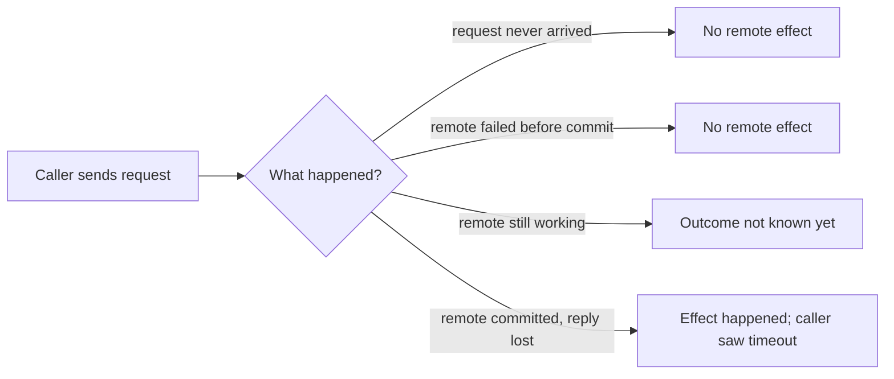
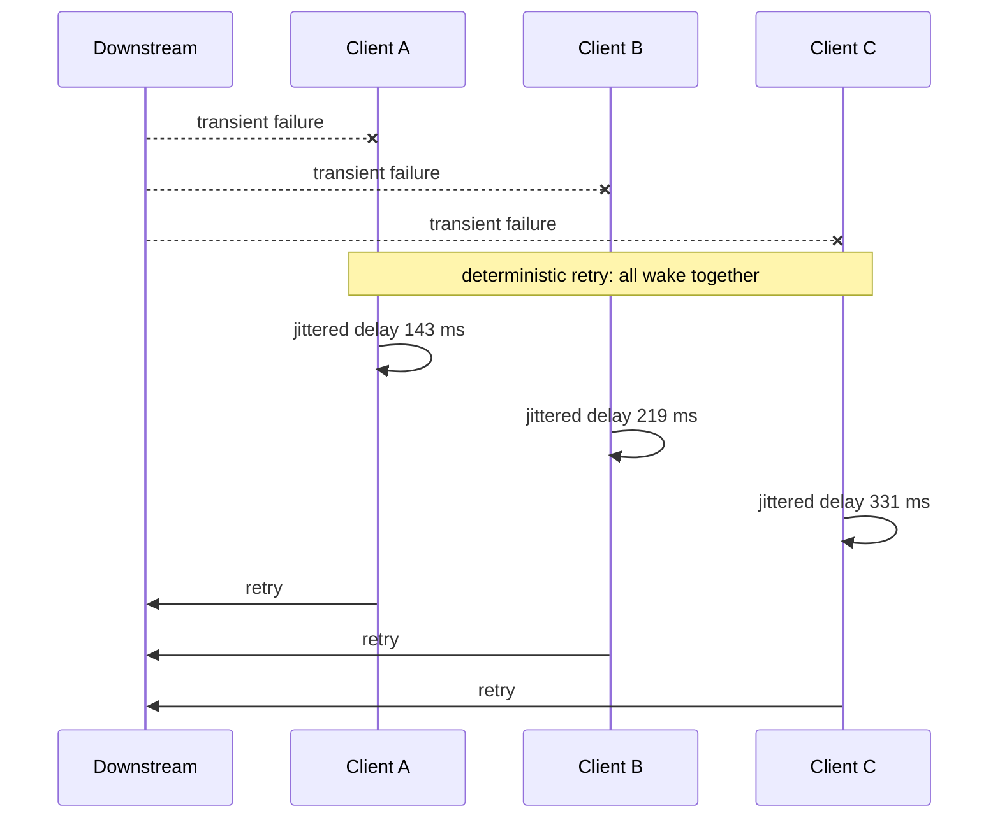
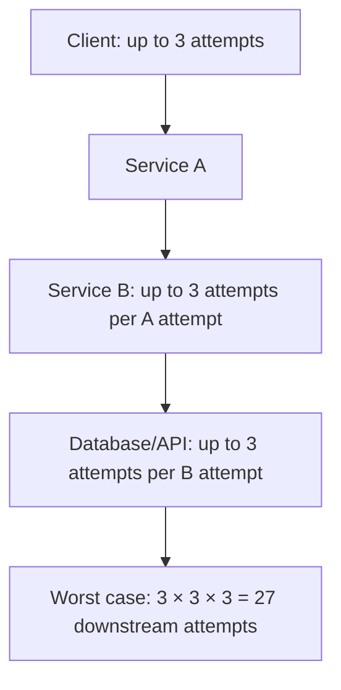

# Timeouts, Retries & Backoff: Bound Failure Without Amplifying It

## TL;DR

Picture an undersea fiber-optic cable experiencing intermittent packet loss under deep-sea tidal friction. A payment gateway issues a \$1,000 settlement request to an acquiring bank. After waiting 2.5 seconds, the caller's socket times out with an error. Frustrated, an unconfigured automated retry loop immediately fires again, and again, and again. Behind the scenes, the acquiring bank had actually authorized the initial charge on disk—only the outbound acknowledgment packet was dropped by the degraded fiber. Within ten seconds, four duplicate charges post to the customer's credit card, while thousands of identical automated retries swamp the acquiring bank's connection queues until its database collapses into complete gridlock. A timeout never proves that an operation failed; it simply proves that **you ran out of patience**.

> 💡 **Rule of thumb:** In distributed systems, timeouts bound waiting time while idempotency bounds correctness risk; never retry across layers without an end-to-end deadline, exponential backoff, and randomized jitter.

- **A timeout is a local boundary, not a remote verdict:** When a timeout expires, the downstream dependency may have crashed before starting, may still be actively executing, or may have committed durable side effects whose response was lost in transit.
- **End-to-end deadlines over naive timeouts:** Propagate a unified **deadline** across the entire call tree; subtracting elapsed upstream time prevents downstream tiers from burning precious compute on work whose caller has already timed out.
- **Strict safety classification:** Only retry **transient** errors on operations guaranteed to be **idempotent**; deterministic client errors, authentication failures, and unverified mutations must never be retried blindly.
- **Exponential backoff with jitter & single ownership:** Back off exponentially to give dependencies breathing room, inject randomized **jitter** to prevent thundering herds, and assign **retry ownership** to a single tier to avoid multiplicative load cascades (`3 × 3 × 3 = 27`).
- **Fatal pitfall:** **Blindly retrying non-idempotent mutations upon timeout.** Assuming that an unanswered call never took effect and firing rapid retries without a stable idempotency key is the premier recipe for duplicated financial charges, corrupted inventory, and self-inflicted denial-of-service outages.

## Partial failure changes what an error means

In a local function call, an exception usually gives you a clear control-flow boundary. Across a network, there are more states:



The last two cases are why a timeout is an **ambiguity boundary**, not proof that nothing happened.

<TermBox term="Partial failure">
A **partial failure** means one component can fail, stall, or become unreachable while other components continue running.

**Why it matters here:** the caller and callee can disagree about whether an operation completed. Retry design has to handle that uncertainty without turning one ambiguous attempt into duplicate effects or excess load.
</TermBox>

## Timeout versus deadline

A **timeout** is a bound on how long one operation waits. A **deadline** is the latest point by which the larger request still has value.

If a user-facing request has 800 ms left, giving each downstream hop a fresh 800 ms timeout can make the total latency exceed the request budget.


The exact API differs by framework, but the reasoning is stable: a downstream call should know how much useful time remains, including time needed for the caller to finish its own work.

<TermBox term="Deadline">
A **deadline** is an end-to-end time boundary for completing useful work. A timeout is usually a relative waiting limit for one operation within that deadline.

**Why it matters here:** deadline propagation prevents every layer from independently spending the full original budget and helps stop retries that can no longer finish in time.
</TermBox>

### Know what your timeout actually covers

A client library may expose separate or combined limits for connection establishment, DNS, TLS handshake, request write, response headers, body reads, or an entire call. Do not assume a setting named `timeout` covers the whole remote interaction.

Choose values from the request's latency objective and downstream behavior, then verify what the client actually measures. A timeout that is too low creates false failures and retries; one that is too high lets stalled dependencies consume threads, sockets, memory, or request slots for too long.

## Retry only when another attempt can help

A retry spends more capacity on a dependency that is already having trouble. It is useful when the failure is transient and another attempt has a reasonable chance of succeeding. It is harmful when the failure is deterministic or the downstream is saturated.

| Failure / response | Default reasoning |
| --- | --- |
| transient transport failure before a safe operation completes | retry may help if budget remains |
| `429 Too Many Requests` | retry only with bounded policy; respect server hints such as `Retry-After` when applicable |
| `503 Service Unavailable` | retry may help, but back off and stay within the caller deadline |
| authentication / authorization failure | do not retry unchanged credentials |
| validation or business-rule rejection | do not retry the same request unchanged |
| timeout after a write may have reached the server | outcome is ambiguous; retry only with idempotency or reconciliation semantics |

HTTP semantics call safe methods idempotent, and define `PUT`, `DELETE`, and safe methods as idempotent. That is a protocol-level property of intended effect, not permission to blindly repeat every application workflow. A `POST` can also be made safely repeatable when the API provides an idempotency contract such as a caller-generated request key.

<TermBox term="Idempotency">
An operation is **idempotent** when repeating the same logical request does not create additional intended effects after the first success.

**Why it matters here:** a lost response can make a successful write look like a failure. Idempotency lets the caller retry the same logical operation without creating a second payment, order, reservation, or message intent.
</TermBox>

## Backoff gives the dependency room to recover

Immediate retries concentrate more traffic at the exact moment a dependency is slow or overloaded. Exponential backoff spaces attempts farther apart:

```text
base = 100 ms
attempt 1 delay ≈ 100 ms
attempt 2 delay ≈ 200 ms
attempt 3 delay ≈ 400 ms
attempt 4 delay ≈ 800 ms
```

Cap both the delay and the total number of attempts. A backoff schedule is subordinate to the end-to-end deadline: do not sleep for 800 ms when only 300 ms of useful request time remains.

### Add jitter so clients do not wake up together

Deterministic backoff can still synchronize a large fleet. If 10,000 clients all fail at the same instant and all wait exactly 200 ms, they can create another spike together.



Jitter randomizes retry timing so recovery traffic is spread over time. The exact jitter algorithm is a policy choice; the key property is avoiding synchronized retries while respecting the retry cap and deadline.

## Layered retries multiply load

Suppose a request passes through three layers and each layer allows up to three total attempts for its downstream call.



Five layers with the same pattern can produce `3^5 = 243` attempts at the deepest dependency. The exact number is less important than the architectural rule: **retries compose multiplicatively**.

Choose the retry owner deliberately. In many request paths, one layer near the original caller has enough context to decide whether retrying is useful and can prevent lower layers from multiplying attempts. Infrastructure libraries may still need narrowly scoped transport retries, but the total policy must be coordinated rather than accidental.

## Retry budgets are reliability budgets

A bounded retry policy should answer all of these questions:

- Which failures are retryable?
- Which operation semantics make a retry safe?
- Which layer owns retries?
- How many attempts are allowed?
- How much total deadline remains?
- What backoff and jitter policy is used?
- Does the server provide a retry hint such as `Retry-After`?
- When do we stop and surface failure instead of adding more load?

A maximum attempt count alone is not enough. Three attempts that each wait 5 seconds are incompatible with a 2-second user deadline.

## Production scenario: a latency spike becomes a retry storm

A checkout service calls an inventory service, which calls a database. During a database latency spike:

- checkout times out inventory after 300 ms and retries twice immediately;
- inventory independently retries each database query twice;
- a gateway above checkout also retries the whole request;
- all callers use the same fixed timeout and retry timing;
- the reservation endpoint lacks an idempotency key.

**Impact:** the database receives many times the original request rate exactly while it is already slow. Latency climbs further, queues grow, and some ambiguous reservation attempts create duplicates.

**Root cause:** every layer interpreted timeout as permission to retry, retry ownership was not coordinated, delays were synchronized, and write retries were not tied to an idempotency contract or an end-to-end deadline.

**Correct pattern:** assign retry ownership to one appropriate layer, bound attempts by the remaining deadline, classify which failures are transient, use exponential backoff with jitter, make the reservation operation idempotent, and stop retrying when the downstream is unlikely to recover inside the request budget. Track attempt counts, timeout stage, retry reason, latency, saturation, and duplicate-key reuse so retry behavior is visible in production.

The important change is not one magic timeout value. It is turning retry behavior into an explicit **load-control and correctness policy**.

## Self-check

A request traverses Client → Service A → Service B → Database. The first three layers each allow three total attempts for the next hop. The database becomes slow.

Before opening the answer, predict the maximum number of database attempts one original client request can trigger, then identify the design mistake.

<details>
<summary>Show the reasoning</summary>

If Client, A, and B each perform up to three total attempts, one original request can drive up to `3 × 3 × 3 = 27` database attempts.

The mistake is not “three retries are always wrong.” The mistake is allowing retry policy to emerge independently at every layer. Pick a retry owner, make lower-level retry behavior explicit, preserve one end-to-end deadline, and ensure the repeated operation is safe.

</details>

## Retry policy checklist

- [ ] **Deadline:** Is there one end-to-end deadline or budget, and is remaining time propagated to downstream work?
- [ ] **Timeout scope:** Do I know whether the timeout covers connect, TLS, write, headers, body, or the full request?
- [ ] **Failure class:** Am I retrying a transient failure rather than deterministic auth, validation, or business rejection?
- [ ] **Idempotency:** If the first attempt may have committed, can the same logical request be repeated without duplicate effects?
- [ ] **Ownership:** Is one layer responsible for the meaningful retry decision instead of every layer retrying independently?
- [ ] **Bounded attempts:** Is there a small maximum attempt count and a stop condition tied to remaining deadline?
- [ ] **Backoff:** Do retries become less frequent instead of immediately adding load?
- [ ] **Jitter:** Are retries desynchronized across callers?
- [ ] **Server hints:** Do we interpret `Retry-After` or equivalent signals without exceeding our own deadline?
- [ ] **Observability:** Can we see original requests versus attempts, exhausted retries, timeout stage, retry reason, saturation, and duplicate-prevention behavior?

## Agent rule

When asked to “add retries,” do not start with a loop. Recover the operation semantics, failure classes, timeout scope, total deadline, idempotency guarantee, retry owner, attempt cap, backoff/jitter policy, server hints, and observability first. Reject retry plans that can multiply across layers or repeat an ambiguous write without a duplicate-prevention strategy.

## Related concepts

- **Idempotency** — makes ambiguous write retries safe when the API contract supports it.
- **Delivery Semantics** — repeated attempts and repeated deliveries are related but not identical reliability problems.
- **Transactional Outbox** — moves durable publication intent into the same local transaction as state changes.
- **Logs, Metrics & Traces** — retry attempts must be distinguishable from original request volume.
- **Reliable Checkout Flow** — combines idempotency, partial-failure handling, durable work, and retries in one architecture walkthrough.

Continue through the [Backend Systems](/docs/learning-paths/backend-systems) path toward delivery semantics and the transactional outbox.

## Sources

Primary and first-party references verified on **2026-09-10**:

- [RFC 9110 — HTTP Semantics: Idempotent Methods](https://www.rfc-editor.org/rfc/rfc9110#section-9.2.2)
- [RFC 9110 — HTTP Semantics: Retry-After](https://www.rfc-editor.org/rfc/rfc9110#section-10.2.3)
- [AWS Builders' Library — Timeouts, retries, and backoff with jitter](https://aws.amazon.com/builders-library/timeouts-retries-and-backoff-with-jitter/)
- [Amazon Builders' Library — Making retries safe with idempotent APIs](https://aws.amazon.com/builders-library/making-retries-safe-with-idempotent-APIs/)
- [AWS Well-Architected Framework — Control and limit retry calls](https://docs.aws.amazon.com/wellarchitected/latest/reliability-pillar/rel_mitigate_interaction_failure_limit_retries.html)

This lesson is **evolving** with a 180-day review target because client behavior, framework timeout semantics, and operational recommendations change even though the core partial-failure and retry-amplification model is durable.
