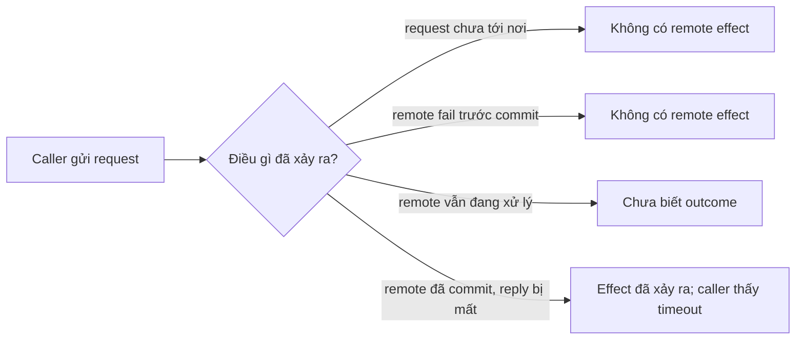
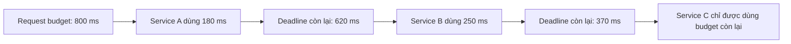
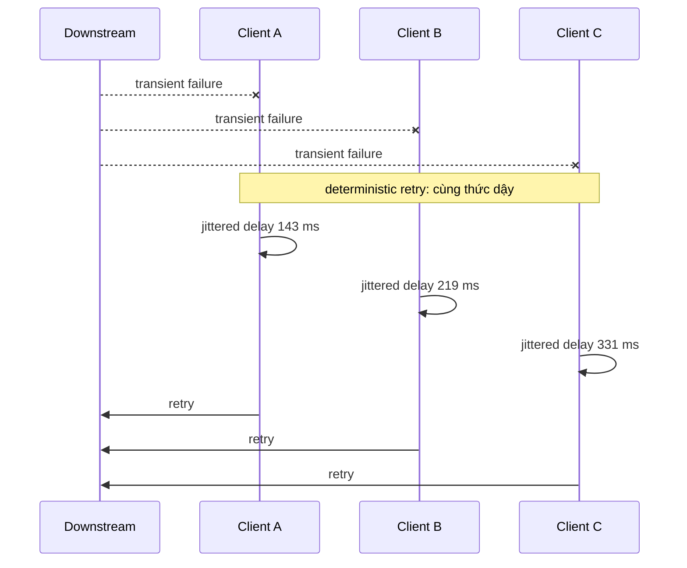
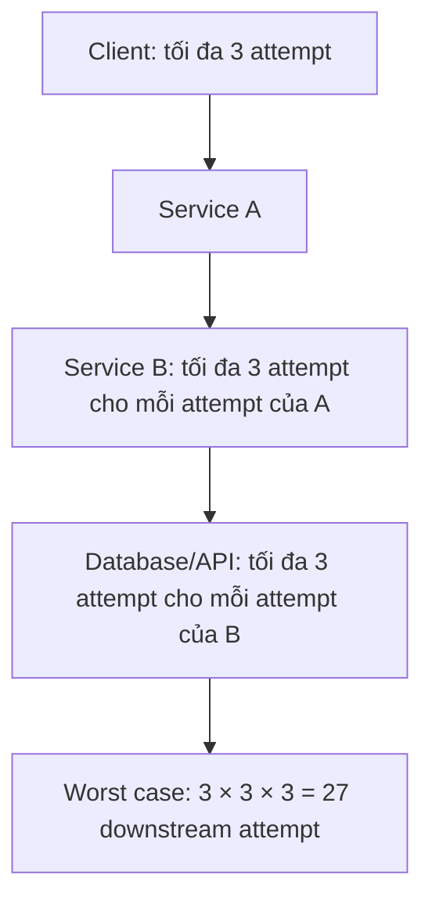

# Timeout, Retry & Backoff: Giới hạn Sự cố mà Không Khuếch đại

## Tóm tắt

Timeout không chứng minh operation ở remote đã thất bại. Nó chỉ cho biết **phía gọi đã ngừng chờ**. Downstream có thể đã fail, vẫn đang chạy, hoặc đã commit side effect nhưng response bị mất.

Vì vậy một retry policy an toàn cần nhiều hơn “thử lại”:

1. mang theo **deadline** hoặc budget end-to-end, không cấp lại full timeout độc lập ở mỗi hop;
2. chỉ retry failure mà attempt mới có khả năng cải thiện;
3. chỉ retry khi operation idempotent hoặc có cơ chế khác giúp lặp an toàn;
4. giới hạn số attempt và tổng thời gian retry;
5. dùng exponential backoff có jitter để caller không đồng bộ với nhau;
6. chọn một retry owner khi nhiều layer đều có thể retry;
7. quan sát attempt, budget cạn, downstream saturation và duplicate-prevention outcome.

## Partial failure làm thay đổi ý nghĩa của lỗi

Với function call cục bộ, exception thường cho control-flow boundary khá rõ. Qua network thì có nhiều trạng thái hơn:



Hai trường hợp cuối là lý do timeout là một **ranh giới bất định**, không phải bằng chứng rằng không có gì xảy ra.

<TermBox term="Partial failure">
**Partial failure** xảy ra khi một component có thể fail, stall hoặc mất kết nối trong khi component khác vẫn tiếp tục chạy.

**Vì sao quan trọng ở đây:** caller và callee có thể không đồng ý về việc operation đã hoàn tất hay chưa. Retry design phải xử lý bất định đó mà không biến một attempt mơ hồ thành duplicate effect hoặc load dư thừa.
</TermBox>

## Timeout so với deadline

**Timeout** là giới hạn thời gian chờ của một operation. **Deadline** là thời điểm muộn nhất mà request lớn hơn vẫn còn giá trị.

Nếu user request chỉ còn 800 ms, việc cấp cho mỗi downstream hop một timeout mới 800 ms có thể làm tổng latency vượt request budget.



API cụ thể khác nhau theo framework, nhưng reasoning ổn định: downstream call nên biết còn bao nhiêu thời gian hữu ích, bao gồm cả phần thời gian caller cần để hoàn tất công việc của nó.

<TermBox term="Deadline">
**Deadline** là ranh giới thời gian end-to-end để hoàn thành công việc còn hữu ích. Timeout thường là giới hạn chờ tương đối cho một operation bên trong deadline đó.

**Vì sao quan trọng ở đây:** deadline propagation ngăn mỗi layer độc lập tiêu toàn bộ budget ban đầu và giúp dừng những retry không còn khả năng hoàn thành kịp thời.
</TermBox>

### Biết timeout của bạn thực sự bao phủ gì

Client library có thể có limit riêng hoặc gộp cho connect, DNS, TLS handshake, request write, response headers, body read hoặc toàn call. Không nên giả định setting tên `timeout` luôn bao phủ toàn remote interaction.

Chọn giá trị từ latency objective của request và behavior của downstream, rồi xác minh client thực sự đo phần nào. Timeout quá thấp tạo false failure và retry; timeout quá cao giữ thread, socket, memory hoặc request slot quá lâu khi dependency bị stall.

## Chỉ retry khi attempt mới có thể giúp

Retry dùng thêm capacity của dependency đang gặp vấn đề. Nó hữu ích khi failure mang tính transient và attempt khác có khả năng thành công. Nó có hại khi failure deterministic hoặc downstream đã saturation.

| Failure / response | Reasoning mặc định |
| --- | --- |
| transient transport failure trước khi một operation an toàn hoàn tất | retry có thể hữu ích nếu còn budget |
| `429 Too Many Requests` | chỉ retry với policy bounded; tôn trọng hint như `Retry-After` khi phù hợp |
| `503 Service Unavailable` | retry có thể giúp, nhưng phải backoff và ở trong caller deadline |
| authentication / authorization failure | không retry với credential không đổi |
| validation hoặc business-rule rejection | không retry cùng request không đổi |
| timeout sau một write có thể đã tới server | outcome mơ hồ; chỉ retry khi có idempotency hoặc reconciliation semantics |

HTTP định nghĩa safe methods là idempotent, đồng thời `PUT`, `DELETE` và safe methods có semantics idempotent. Đây là thuộc tính ở protocol level về intended effect, không phải giấy phép lặp mù mọi workflow của application. `POST` cũng có thể được làm lặp an toàn nếu API cung cấp idempotency contract như caller-generated request key.

<TermBox term="Idempotency">
Một operation **idempotent** khi việc lặp lại cùng logical request không tạo thêm intended effect sau lần thành công đầu tiên.

**Vì sao quan trọng ở đây:** response bị mất có thể khiến một write thành công trông như failure. Idempotency cho phép caller retry cùng logical operation mà không tạo payment, order, reservation hoặc message intent thứ hai.
</TermBox>

## Backoff cho dependency thời gian hồi phục

Retry ngay lập tức dồn thêm traffic vào đúng lúc dependency đang chậm hoặc quá tải. Exponential backoff giãn các attempt ngày càng xa:

```text
base = 100 ms
attempt 1 delay ≈ 100 ms
attempt 2 delay ≈ 200 ms
attempt 3 delay ≈ 400 ms
attempt 4 delay ≈ 800 ms
```

Phải cap cả delay và tổng số attempt. Backoff schedule luôn phụ thuộc end-to-end deadline: không ngủ 800 ms khi chỉ còn 300 ms request time hữu ích.

### Thêm jitter để client không cùng thức dậy

Deterministic backoff vẫn có thể đồng bộ cả fleet. Nếu 10.000 client cùng fail tại một thời điểm và cùng chờ đúng 200 ms, chúng có thể tạo spike mới cùng lúc.



Jitter ngẫu nhiên hóa retry timing để recovery traffic trải ra theo thời gian. Thuật toán jitter cụ thể là policy choice; thuộc tính quan trọng là tránh synchronized retry trong khi vẫn tôn trọng retry cap và deadline.

## Retry ở nhiều layer nhân tải lên

Giả sử một request đi qua ba layer và mỗi layer cho tối đa ba attempt tổng cộng đối với downstream call của nó.



Năm layer với pattern giống vậy có thể tạo `3^5 = 243` attempt ở dependency sâu nhất. Con số cụ thể kém quan trọng hơn architectural rule: **retry compose theo kiểu nhân**.

Hãy chọn retry owner có chủ đích. Trong nhiều request path, một layer gần caller gốc có đủ context để quyết định retry còn hữu ích hay không và có thể ngăn lower layer nhân attempt. Infrastructure library đôi khi vẫn cần transport retry hẹp, nhưng total policy phải được phối hợp thay vì phát sinh ngẫu nhiên.

## Retry budget cũng là reliability budget

Một bounded retry policy phải trả lời đủ các câu hỏi:

- Failure nào retryable?
- Operation semantics nào làm retry an toàn?
- Layer nào sở hữu retry?
- Cho phép bao nhiêu attempt?
- Còn bao nhiêu total deadline?
- Dùng backoff và jitter policy nào?
- Server có hint như `Retry-After` không?
- Khi nào phải dừng và trả failure thay vì thêm load?

Chỉ có maximum attempt count là chưa đủ. Ba attempt mỗi lần chờ 5 giây không tương thích với user deadline 2 giây.

## Kịch bản production: latency spike biến thành retry storm

Một checkout service gọi inventory service, và inventory gọi database. Khi database có latency spike:

- checkout timeout inventory sau 300 ms rồi retry ngay hai lần;
- inventory độc lập retry mỗi database query hai lần;
- gateway phía trên checkout cũng retry toàn request;
- tất cả caller dùng cùng fixed timeout và retry timing;
- reservation endpoint không có idempotency key.

**Hậu quả:** database nhận request rate cao gấp nhiều lần ban đầu đúng lúc nó đang chậm. Latency tăng tiếp, queue dài ra, và một số reservation attempt mơ hồ tạo duplicate.

**Nguyên nhân cốt lõi:** mọi layer coi timeout là permission để retry, retry ownership không được phối hợp, delay đồng bộ, và write retry không gắn với idempotency contract hay end-to-end deadline.

**Cách khắc phục chuẩn:** giao retry ownership cho một layer phù hợp, bound attempt theo remaining deadline, phân loại transient failure, dùng exponential backoff có jitter, làm reservation operation idempotent, và ngừng retry khi downstream khó có khả năng hồi phục trong request budget. Theo dõi attempt count, timeout stage, retry reason, latency, saturation và duplicate-key reuse để retry behavior nhìn thấy được ở production.

Thay đổi quan trọng không phải một timeout value thần kỳ. Đó là biến retry behavior thành **load-control và correctness policy** explicit.

## Tự kiểm tra

Một request đi qua Client → Service A → Service B → Database. Ba layer đầu mỗi layer cho tối đa ba attempt tổng cộng cho hop tiếp theo. Database trở nên chậm.

Trước khi mở đáp án, hãy dự đoán số database attempt tối đa mà một original client request có thể tạo ra, rồi xác định lỗi thiết kế.

<details>
<summary>Xem reasoning</summary>

Nếu Client, A và B mỗi nơi đều thực hiện tối đa ba attempt tổng cộng, một original request có thể tạo `3 × 3 × 3 = 27` database attempt.

Lỗi không phải “ba retry luôn sai”. Lỗi là để retry policy hình thành độc lập ở mọi layer. Hãy chọn retry owner, làm lower-level retry behavior explicit, giữ một end-to-end deadline và bảo đảm operation lặp lại là an toàn.

</details>

## Checklist review retry policy

- [ ] **Deadline:** Có một end-to-end deadline/budget và remaining time có được propagate xuống downstream không?
- [ ] **Timeout scope:** Tôi có biết timeout bao phủ connect, TLS, write, headers, body hay toàn request không?
- [ ] **Failure class:** Tôi đang retry transient failure thay vì auth, validation hoặc business rejection deterministic không?
- [ ] **Idempotency:** Nếu attempt đầu có thể đã commit, cùng logical request có thể lặp mà không tạo duplicate effect không?
- [ ] **Ownership:** Có một layer chịu trách nhiệm retry decision có ý nghĩa thay vì mọi layer retry độc lập không?
- [ ] **Bounded attempts:** Có maximum attempt nhỏ và stop condition gắn với remaining deadline không?
- [ ] **Backoff:** Retry có thưa dần thay vì ngay lập tức thêm load không?
- [ ] **Jitter:** Retry có được desynchronize giữa caller không?
- [ ] **Server hints:** Có diễn giải `Retry-After` hoặc signal tương đương mà không vượt deadline riêng không?
- [ ] **Observability:** Có nhìn thấy original request so với attempt, exhausted retry, timeout stage, retry reason, saturation và duplicate-prevention behavior không?

## Quy tắc cho agent

Khi được yêu cầu “thêm retry”, không bắt đầu bằng một loop. Trước tiên phải lấy operation semantics, failure classes, timeout scope, total deadline, idempotency guarantee, retry owner, attempt cap, backoff/jitter policy, server hints và observability. Từ chối retry plan có thể nhân tải qua nhiều layer hoặc lặp một ambiguous write mà không có duplicate-prevention strategy.

## Khái niệm liên quan

- **Idempotency** — làm ambiguous write retry an toàn khi API contract hỗ trợ.
- **Delivery Semantics** — repeated attempt và repeated delivery liên quan nhưng không phải cùng một reliability problem.
- **Transactional Outbox** — đưa durable publication intent vào cùng local transaction với state change.
- **Logs, Metrics & Traces** — retry attempt phải phân biệt được với original request volume.
- **Reliable Checkout Flow** — kết hợp idempotency, partial-failure handling, durable work và retry trong một architecture walkthrough.

Tiếp tục theo lộ trình [Backend Systems](/vi/docs/learning-paths/backend-systems) tới delivery semantics và transactional outbox.

## Nguồn

Các nguồn chuẩn và first-party được xác minh ngày **2026-09-10**:

- [RFC 9110 — HTTP Semantics: Idempotent Methods](https://www.rfc-editor.org/rfc/rfc9110#section-9.2.2)
- [RFC 9110 — HTTP Semantics: Retry-After](https://www.rfc-editor.org/rfc/rfc9110#section-10.2.3)
- [AWS Builders' Library — Timeouts, retries, and backoff with jitter](https://aws.amazon.com/builders-library/timeouts-retries-and-backoff-with-jitter/)
- [Amazon Builders' Library — Making retries safe with idempotent APIs](https://aws.amazon.com/builders-library/making-retries-safe-with-idempotent-APIs/)
- [AWS Well-Architected Framework — Control and limit retry calls](https://docs.aws.amazon.com/wellarchitected/latest/reliability-pillar/rel_mitigate_interaction_failure_limit_retries.html)

Bài này được phân loại **evolving** với chu kỳ review 180 ngày vì client behavior, framework timeout semantics và operational recommendation có thể đổi dù mental model cốt lõi về partial failure và retry amplification khá bền vững.
