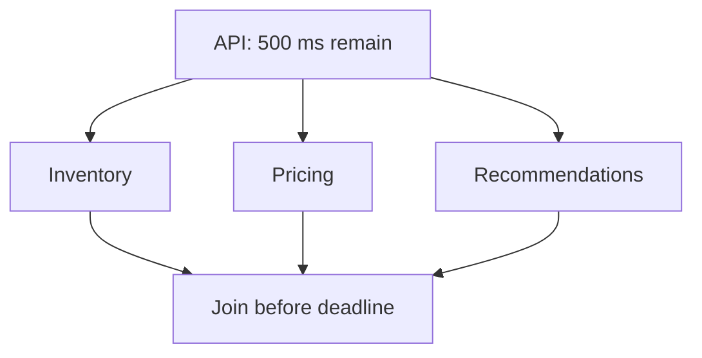

# Timeouts: Operate With Explicit Time Budgets

## TL;DR

A timeout bounds how long one wait may consume resources. A **deadline** bounds when the larger operation stops being useful. Operate remote calls with explicit scopes, one end-to-end budget, propagated remaining time, cancellation, and stage-level telemetry.


<TermBox term="Timeout">
A **timeout** is a maximum wait for a specific operation or phase. It protects finite resources; it does not prove the remote operation did nothing.
</TermBox>

<TermBox term="Deadline">
A **deadline** is the latest time by which the end-to-end operation still has value. Each downstream hop should consume only the remaining budget.
</TermBox>

## Know what the timeout covers

A setting named `timeout` is meaningless until you know its scope. A client may expose separate limits for DNS resolution, TCP **connect**, TLS handshake, request **write**, response headers, body **read**, idle time, or the overall call.


A connect timeout cannot bound a stalled body read. A socket read timeout may reset whenever bytes arrive and therefore may not bound total request duration. Verify library semantics rather than trusting a friendly option name.

## Propagate remaining budget, not the original timeout

If an incoming request has 600 ms left, a downstream call must not receive a fresh 2-second allowance. Propagate the **remaining budget** and reserve enough time for local work and the final response.

gRPC deadline propagation implements this model: elapsed time is deducted before an outgoing RPC receives its timeout equivalent.

For a simple path, reason with:

```text
remaining = request_deadline - now
child_budget = remaining - local_finish_reserve
```

Reject work early when `child_budget <= 0` instead of starting a call that cannot produce a useful result.

## Choose values from objectives and distributions

Timeouts are production policy, not constants copied from a blog post. Start from the caller SLO and the downstream **latency distribution**, including network overhead. Decide what **false timeout** rate is acceptable, then inspect the corresponding percentile and add justified padding.

AWS describes this explicitly: for service-to-service calls, choose an acceptable false-timeout probability and inspect the matching downstream latency percentile. Be careful when p50 and tail latency are close, or when Internet network variance dominates.

Too high:

- threads, sockets, memory, and request slots remain occupied;
- slow dependencies expand blast radius;
- user-visible latency exceeds its value window.

Too low:

- healthy tail latency becomes false failure;
- callers may create unnecessary follow-on work;
- small latency shifts become incident-level timeout spikes.

## Fan-out must share one deadline

Parallelism does not create more time. In a fan-out, every branch competes inside the same end-to-end deadline.



Classify branches by necessity. A required dependency may fail the request when its budget expires; an optional dependency may be cancelled and omitted. Do not let one optional branch keep the whole request alive after useful time is gone.

## Cancellation stops waste; it is not rollback

When the deadline expires, propagate **cancellation** so downstream work can stop. But cancellation does **not** mean rollback. gRPC explicitly warns that changes made before cancellation are not rolled back.

That means a timed-out write can still require idempotency or reconciliation. Timeout handling controls waiting and resource usage; Partial Failure governs uncertainty about side effects.

## Observe timeout stage and dependency

A single `timeout_count` metric is too weak. Record at least:

- dependency/route and timeout stage: DNS, connect, TLS, write, headers, read, overall;
- configured budget and remaining budget at dispatch;
- downstream latency percentiles and caller SLO;
- deadline-exceeded and cancellation counts;
- saturation signals such as active requests, connection pools, queues, or workers.

Correlate traces so operators can distinguish “could not connect” from “server took 480 ms but the caller had only 120 ms left.”

<TermBox term="False Timeout">
A **false timeout** occurs when a call would have completed successfully but the caller's threshold expires first. Some false timeouts are intentional; the acceptable rate should be explicit and measured.
</TermBox>

## Production scenario

An API has a 1-second user SLO. It calls Service A and Service B sequentially. Each client uses a default 1-second overall timeout, and Service B also has a 1-second connect/read timeout. During a latency increase, upstream requests keep waiting well beyond the useful user budget while workers and sockets remain occupied.

**Impact:** tail latency rises above the SLO, worker and connection pools saturate, and healthy traffic begins timing out behind slow requests.

**Root cause:** every hop started a fresh full timeout instead of sharing the remaining deadline, and telemetry reported only generic `timeout` errors without identifying the stage or dependency.

**Correct pattern:** define one end-to-end deadline, subtract elapsed/local-reserve time before each call, configure connect and request/read scopes deliberately, cancel abandoned work, and tune thresholds from latency percentiles plus an explicit false-timeout target. Emit timeout stage, configured budget, remaining budget, dependency latency, and saturation metrics.

## Self-check

A request has 300 ms remaining. Your service needs about 60 ms after the dependency returns to serialize and send the response. Should you start a downstream call with a fresh 500 ms timeout?

<details>
<summary>Show the reasoning</summary>

No. The downstream budget is at most roughly 240 ms, often less after safety margin. A fresh 500 ms timeout violates the parent deadline and can consume resources for work whose result is already useless. Propagate the remaining deadline and reserve time for local completion.

</details>

## Timeout operating checklist

- [ ] **Scope:** Do I know whether each timeout covers DNS, connect, TLS, write, headers, read, idle, or overall duration?
- [ ] **Deadline:** Is there one end-to-end deadline tied to the caller's usefulness/SLO?
- [ ] **Propagation:** Does every downstream hop receive only remaining time?
- [ ] **Reserve:** Is time kept for local completion and response delivery?
- [ ] **Tuning:** Is the value based on measured latency distribution and an explicit false-timeout target?
- [ ] **Fan-out:** Do parallel branches share the same deadline and classify required versus optional work?
- [ ] **Cancellation:** Does expired/abandoned work propagate cancellation without assuming rollback?
- [ ] **Observability:** Can operators identify timeout stage, dependency, budget, latency, and saturation?

## Agent rule

When asked to “set a timeout,” first recover the end-to-end SLO/deadline, exact client timeout scopes, downstream latency distribution, acceptable false-timeout rate, remaining-budget propagation, local reserve, cancellation behavior, and telemetry. Do not choose a value before knowing what it actually bounds.

## Related concepts

- **Partial Failure** — explains why timeout does not prove a write failed.
- **Retries and Backoff** — decides whether another attempt should consume the remaining budget.
- **SLIs and SLOs** — provide the latency objective that timeout policy must serve.
- **Logs, Metrics & Traces** — reveal timeout stage and resource pressure.

## Sources

Primary references verified on **2026-09-12**:

- [gRPC — Deadlines](https://grpc.io/docs/guides/deadlines/)
- [gRPC — Core concepts: deadlines, termination, cancellation](https://grpc.io/docs/what-is-grpc/core-concepts/)
- [Amazon Builders' Library — Timeouts, retries, and backoff with jitter](https://aws.amazon.com/builders-library/timeouts-retries-and-backoff-with-jitter/)
- [AWS Well-Architected — Set client timeouts](https://docs.aws.amazon.com/wellarchitected/latest/framework/rel_mitigate_interaction_failure_client_timeouts.html)
