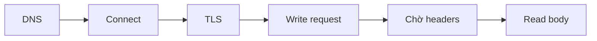
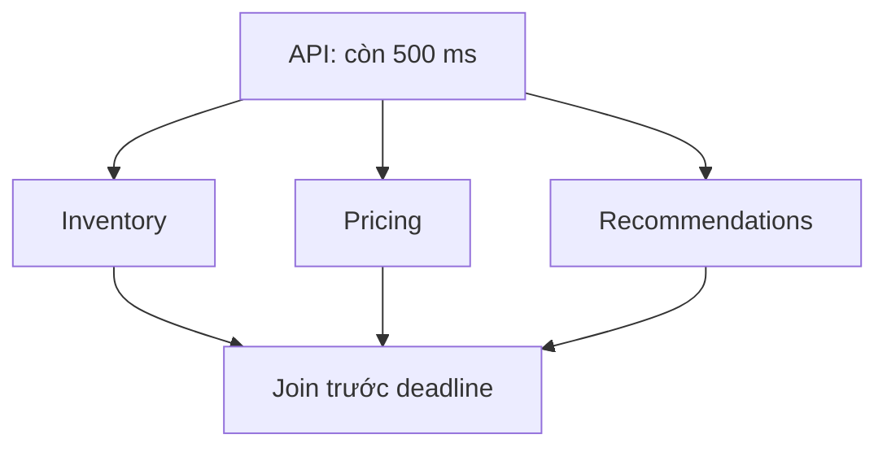

# Timeout: Vận hành với ngân sách thời gian rõ ràng

## Tóm tắt

Timeout giới hạn thời gian một lần chờ được phép giữ tài nguyên. **Deadline** giới hạn thời điểm toàn bộ thao tác còn hữu ích. Hãy vận hành remote call bằng scope rõ ràng, một ngân sách end-to-end, truyền thời gian còn lại, cancellation và telemetry theo từng giai đoạn.


<TermBox term="Timeout">
**Timeout** là giới hạn chờ tối đa cho một operation hoặc phase cụ thể. Nó bảo vệ tài nguyên hữu hạn; nó không chứng minh remote operation chưa làm gì.
</TermBox>

<TermBox term="Deadline">
**Deadline** là thời điểm muộn nhất mà operation end-to-end còn giá trị. Mỗi downstream hop chỉ được dùng phần ngân sách còn lại.
</TermBox>

## Biết chính xác timeout đang bao phủ gì

Một option tên `timeout` chưa nói lên điều gì nếu chưa biết scope. Client có thể có giới hạn riêng cho DNS resolution, TCP **connect**, TLS handshake, **write** request, chờ response headers, **read** body, idle time hoặc toàn bộ call.



Connect timeout không chặn được body read bị treo. Socket read timeout có thể được reset mỗi khi có byte mới nên không nhất thiết giới hạn tổng thời gian request. Hãy verify semantics của library thay vì tin vào tên option.

## Truyền ngân sách còn lại, không cấp lại timeout ban đầu

Nếu incoming request chỉ còn 600 ms, downstream call không được nhận lại 2 giây mới. Hãy **truyền deadline** hoặc thời gian còn lại và giữ đủ thời gian để local work cùng response cuối hoàn tất.

gRPC deadline propagation dùng đúng mô hình này: elapsed time được trừ trước khi timeout tương đương được truyền sang outgoing RPC.

Một cách reasoning đơn giản:

```text
remaining = request_deadline - now
child_budget = remaining - local_finish_reserve
```

Nếu `child_budget <= 0`, fail sớm thay vì khởi động call không còn cơ hội tạo kết quả hữu ích.

## Chọn giá trị từ objective và phân phối độ trễ

Timeout là production policy, không phải hằng số copy từ blog. Bắt đầu từ caller SLO và **phân phối độ trễ** của downstream, bao gồm network overhead. Chọn tỷ lệ **timeout giả** chấp nhận được, rồi xem percentile tương ứng và thêm padding có lý do.

AWS mô tả trực tiếp cách này: với service-to-service call, chọn xác suất false timeout chấp nhận được rồi quan sát latency percentile tương ứng. Cần cẩn thận khi p50 gần tail latency hoặc khi độ biến thiên Internet chi phối.

Timeout quá cao:

- thread, socket, memory và request slot bị giữ lâu;
- dependency chậm mở rộng blast radius;
- user latency vượt khỏi khoảng còn giá trị.

Timeout quá thấp:

- tail latency khỏe mạnh bị biến thành lỗi giả;
- caller tạo thêm work không cần thiết;
- dao động latency nhỏ có thể thành timeout spike toàn hệ thống.

## Fan-out vẫn chỉ có một deadline

Chạy song song không tạo thêm thời gian. Trong một **fan-out**, nhiều dependency song song vẫn cạnh tranh trong cùng deadline end-to-end.



Phân loại branch theo mức cần thiết. Dependency bắt buộc có thể làm request fail khi hết budget; dependency tùy chọn có thể bị cancel và bỏ khỏi response. Đừng để một branch không quan trọng giữ sống cả request sau khi thời gian hữu ích đã hết.

## Cancellation dừng lãng phí; cancellation không rollback

Khi deadline hết, hãy truyền **cancellation** để downstream dừng work nếu có thể. Nhưng **hủy không rollback**. gRPC cảnh báo rõ rằng thay đổi xảy ra trước cancellation không tự hoàn tác.

Vì vậy một timed-out write vẫn có thể cần idempotency hoặc reconciliation. Timeout handling kiểm soát việc chờ và tiêu thụ tài nguyên; Partial Failure giải thích sự không chắc chắn về side effect.

## Quan sát theo giai đoạn timeout và dependency

Một metric `timeout_count` chung là quá yếu. Ít nhất cần ghi:

- dependency/route và **giai đoạn timeout**: DNS, connect, TLS, write, headers, read, overall;
- configured budget và thời gian còn lại lúc dispatch;
- **độ trễ dependency** theo percentile và caller SLO;
- deadline-exceeded cùng cancellation count;
- saturation như active requests, connection pool, queue hoặc worker.

Trace cần giúp operator phân biệt “không connect được” với “server mất 480 ms nhưng caller chỉ còn 120 ms”.

<TermBox term="Timeout giả">
**Timeout giả** xảy ra khi call có thể hoàn tất thành công nhưng threshold của caller hết trước. Một lượng false timeout có thể là chủ ý; tỷ lệ chấp nhận được phải được đo và công khai.
</TermBox>

## Tình huống production

Một API có user SLO 1 giây. Nó gọi Service A rồi Service B theo chuỗi. Mỗi client dùng default overall timeout 1 giây, và Service B còn có connect/read timeout 1 giây. Khi latency tăng, upstream request tiếp tục chờ lâu hơn budget có ích trong khi worker và socket vẫn bị giữ.

**Hậu quả:** tail latency vượt SLO, worker và connection pool bão hòa, rồi traffic khỏe mạnh cũng timeout phía sau các request chậm.

**Nguyên nhân cốt lõi:** mỗi hop tự cấp lại full timeout thay vì chia sẻ deadline còn lại, còn telemetry chỉ báo lỗi `timeout` chung chung mà không chỉ rõ stage hay dependency.

**Cách khắc phục chuẩn:** định nghĩa một deadline end-to-end, trừ elapsed time và local reserve trước mỗi call, cấu hình connect với request/read scope có chủ ý, cancel work đã hết giá trị, và tune threshold từ latency percentile cùng target timeout giả rõ ràng. Emit timeout stage, configured budget, remaining budget, dependency latency và saturation metrics.

## Tự kiểm tra

Một request còn 300 ms. Service của bạn cần khoảng 60 ms sau khi dependency trả về để serialize và gửi response. Có nên gọi downstream với timeout mới 500 ms không?

<details>
<summary>Xem cách suy luận</summary>

Không. Downstream budget tối đa chỉ khoảng 240 ms, thường còn thấp hơn sau safety margin. Timeout 500 ms mới sẽ phá parent deadline và giữ tài nguyên cho work mà kết quả đã hết giá trị. Hãy truyền thời gian còn lại và giữ reserve cho local completion.

</details>

## Checklist vận hành timeout

- [ ] **Scope:** Mỗi timeout đang bao phủ DNS, connect, TLS, write, headers, read, idle hay overall duration?
- [ ] **Deadline:** Có một deadline end-to-end gắn với usefulness/SLO của caller không?
- [ ] **Propagation:** Mỗi downstream hop chỉ nhận thời gian còn lại không?
- [ ] **Reserve:** Có giữ thời gian cho local completion và response delivery không?
- [ ] **Tuning:** Giá trị có dựa trên phân phối độ trễ đo được và target timeout giả rõ ràng không?
- [ ] **Fan-out:** Các branch song song có chia sẻ cùng deadline và phân loại required/optional work không?
- [ ] **Cancellation:** Work hết hạn có được cancel mà không giả định rollback không?
- [ ] **Observability:** Operator có xác định được stage, dependency, budget, latency và saturation không?

## Quy tắc cho agent

Khi được yêu cầu “set timeout”, trước tiên phải khôi phục SLO/deadline end-to-end, exact timeout scope của client, phân phối độ trễ downstream, tỷ lệ timeout giả chấp nhận được, cách truyền remaining budget, local reserve, cancellation behavior và telemetry. Đừng chọn con số trước khi biết nó đang giới hạn điều gì.

## Khái niệm liên quan

- **Partial Failure** — giải thích vì sao timeout không chứng minh write thất bại.
- **Retries and Backoff** — quyết định một attempt khác có nên dùng phần budget còn lại hay không.
- **SLIs and SLOs** — cung cấp latency objective mà timeout policy phải phục vụ.
- **Logs, Metrics & Traces** — cho thấy stage timeout và resource pressure.

## Nguồn

Tài liệu primary được kiểm tra ngày **2026-09-12**:

- [gRPC — Deadlines](https://grpc.io/docs/guides/deadlines/)
- [gRPC — Core concepts: deadlines, termination, cancellation](https://grpc.io/docs/what-is-grpc/core-concepts/)
- [Amazon Builders' Library — Timeouts, retries, and backoff with jitter](https://aws.amazon.com/builders-library/timeouts-retries-and-backoff-with-jitter/)
- [AWS Well-Architected — Set client timeouts](https://docs.aws.amazon.com/wellarchitected/latest/framework/rel_mitigate_interaction_failure_client_timeouts.html)
