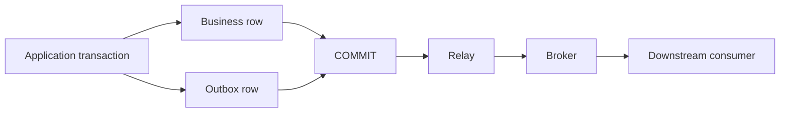
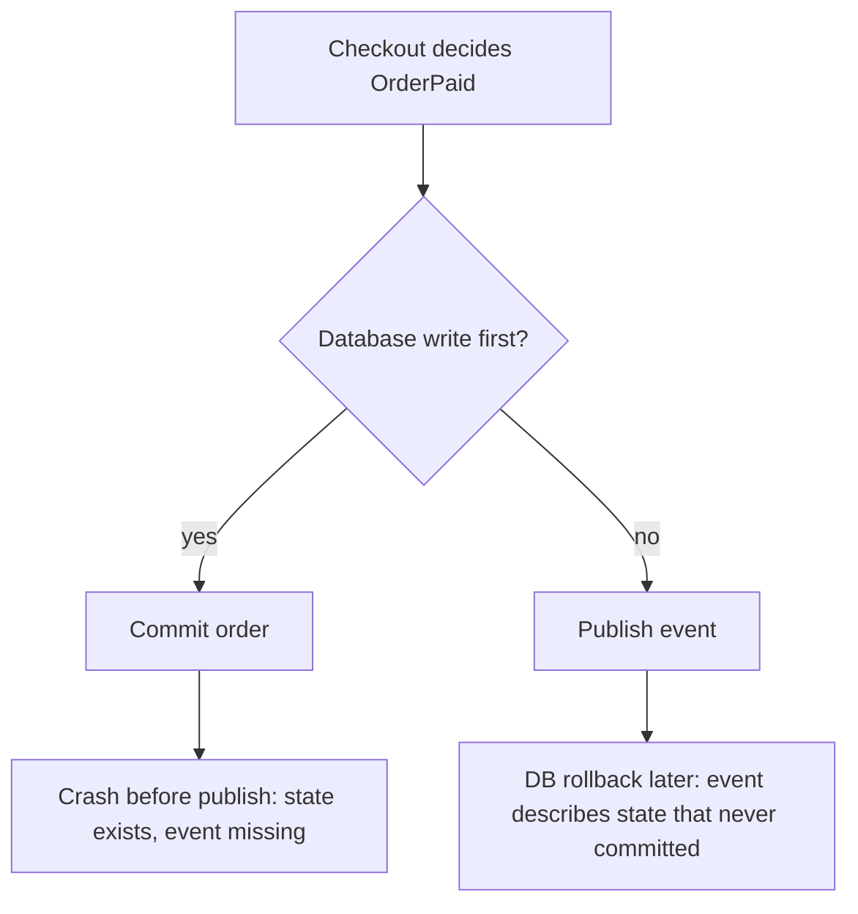
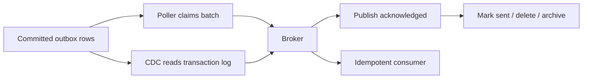

# Transactional Outbox: Publish Events Without a Dual-Write Gap

During a high-traffic flash sale, an e-commerce checkout handler processes a customer's payment webhook. The application marks the order as `PAID` in PostgreSQL, commits the transaction, and prepares to call `messageBroker.publish('OrderPaid')`. But right in the 3-millisecond window between the database commit and the network call, the container runtime kills the pod due to an out-of-memory (OOM) eviction. The database durably records the customer's payment, but the event vanishes into thin air. Fulfillment never packs the order, inventory counts drift, and furious customers bombard support demanding their merchandise. The system state has been torn in half by a **dual-write gap**.

When an operation must both update internal database state and notify the outside world, executing them as two independent calls across network boundaries makes partial failure inevitable.

## TL;DR

> 💡 **Rule of thumb:** You cannot achieve atomicity across two independent storage engines without distributed transactions. Instead of reaching for fragile 2PC coordination, commit the business state and the publication intent into the same local database transaction, and let an asynchronous relay handle message dispatch.

- **The dual-write gap** is an inevitable failure mode whenever an application attempts two uncoordinated writes (e.g., database commit and message broker publish); one can always succeed while the other fails.
- **Transactional outbox guarantees atomicity locally:** By persisting business data mutations and an **outbox record containing the publication intent in the same database transaction**, both succeed or roll back together.
- **Asynchronous relaying decouples latency:** A dedicated background worker—either a database poller leveraging `SELECT ... FOR UPDATE SKIP LOCKED` or a Change Data Capture (CDC) engine like Debezium—relays committed outbox rows to the broker outside the user request lifecycle.
- **At-least-once delivery requires idempotency:** Because relay retries and network hiccups can cause duplicate publications, downstream message consumers must enforce idempotency using stable event IDs.
- **Fatal pitfall:** Reversing the write sequence—publishing to the broker *before* committing the database transaction—creates disastrous "phantom events", causing downstream systems to ship goods or charge money for orders whose database transactions ultimately roll back.



<TermBox term="Transactional Outbox">
A **transactional outbox** stores a durable communication intent beside business state inside one local database transaction. A relay publishes that intent after commit. The pattern removes the database-plus-broker dual-write atomicity gap; it does not make the whole workflow exactly-once.
</TermBox>

## Start with the dual-write failure matrix

Suppose checkout marks an order `PAID` and publishes `OrderPaid`.

A naive implementation might do this:

```text
BEGIN
UPDATE orders SET status = 'PAID' WHERE id = ?
COMMIT

publish OrderPaid
```

The database and broker are two independently failing systems. Reversing the order does not fix the problem.



The outbox changes the boundary. The application does not try to atomically control the database and broker. It atomically controls only resources already inside one local transaction: the business row and the outbox record.

A typical outbox record carries enough information for deterministic publication and duplicate handling:

```text
id            globally unique event ID
aggregate_id  order-123
aggregate_type Order
event_type    OrderPaid
payload       serialized event body
sequence      optional per-aggregate ordering value
created_at    durable creation timestamp
```

The `id` becomes a stable event ID or message ID that downstream consumers can use for deduplication.

<TermBox term="Publication Intent">
A **publication intent** is the durable statement “after this transaction commits, this event must be offered to the messaging boundary.” It is not proof that the broker has accepted the message yet.
</TermBox>

## Commit before publish

The central invariant is simple: **commit before publish**. More precisely, the business change and outbox record commit together; only a committed record is eligible for publication.

Pseudo-code:

```ts
await db.transaction(async (tx) => {
  await tx.orders.markPaid(orderId);
  await tx.outbox.insert({
    id: eventId,
    aggregateId: orderId,
    eventType: 'OrderPaid',
    payload,
  });
});
```

The request can now return after the local transaction commits. Publication is decoupled from request latency and from the request process lifetime.

If the process dies one instruction after commit, the outbox row survives. On restart, a relay can discover it and continue publishing.

## Relay the committed rows

There are two common relay families.

**Polling publisher.** A worker queries committed outbox rows, claims a bounded batch, publishes them, waits for broker acknowledgement, and then marks or deletes the rows. With multiple pollers, the database must prevent two workers from owning the same claim at the same time. PostgreSQL-style `SELECT ... FOR UPDATE SKIP LOCKED`, an explicit lease, or an atomic status transition are implementation options; the exact choice belongs to the database and workload.

**Change data capture (CDC).** A log-based connector observes committed changes to the outbox table and transforms them into broker records. Debezium's Outbox Event Router is one concrete implementation. CDC removes application polling, but it moves operational responsibility into the database-log/connector pipeline.

Neither approach changes the core invariant: only committed outbox state is publishable.



## Why duplicate publication is normal

The relay has its own ambiguity window:

1. Publish event `E42`.
2. Broker durably accepts `E42`.
3. Relay crashes before recording “published” in the database.
4. Relay restarts and publishes `E42` again.

That is usually the correct failure mode. Retrying protects against loss, while duplicate-safe processing protects against repeated effects.

Do not claim that the outbox creates end-to-end **exactly-once** business effects. It removes one dual-write gap. Broker redelivery, relay retries, consumer crashes, and external side effects still have their own boundaries.

A consumer can make a durable business effect idempotent by atomically recording the event ID with the effect it protects:

```text
BEGIN
INSERT INTO processed_events(event_id) VALUES ('E42')
  -- unique constraint rejects a replay
APPLY business change
COMMIT
```

If the consumer also writes to another remote system, that remote effect needs its own idempotency contract or coordination strategy.

## Preserve only the ordering you actually need

Outbox creation order is not automatically broker consumption order. Multiple relay workers, retry, multiple broker partitions, and consumer concurrency can all reorder observations.

If the domain requires per-aggregate ordering, make that requirement explicit. Common tools include:

- a per-aggregate `sequence` written with the business transaction;
- the aggregate ID as the broker partition key;
- consumer checks for missing or stale sequence numbers;
- serial relay ownership only where required, rather than globally serializing the whole outbox.

Global ordering is far more expensive than per-aggregate ordering and is rarely the real invariant.

## Operate the relay as a production subsystem

A transactional outbox is not complete when the table exists. The relay needs bounded work, retry policy, poison-event handling, cleanup, and telemetry.

For a polling relay:

- Claim small batches so one worker does not hold database locks while publishing thousands of records.
- Keep ownership explicit. A row being retried by worker A should not be silently stolen by worker B unless the claim lease expired or an atomic state transition allows it.
- Use bounded retry with backoff for transient broker failures.
- After repeated deterministic failures such as invalid serialization or schema rejection, quarantine the poison record or send it through a deliberate DLQ workflow instead of retrying forever.
- Retain sent rows long enough for auditing and reconciliation, then delete or archive them under an explicit retention policy.

For observability, at minimum track:

- unpublished backlog count;
- age of the oldest unpublished event;
- publish latency from outbox commit to broker acknowledgement;
- retry/error rate by failure class;
- quarantined or DLQ event count;
- relay throughput versus creation rate.

The oldest-event age is often more actionable than backlog count alone: ten records stuck for two hours can be worse than ten thousand records draining normally.

## Production micro-scenario: payment committed, event disappeared

A checkout service updates `orders.status = 'PAID'`, commits, then publishes `OrderPaid` to a broker. During a deploy, the process is terminated in the few milliseconds after the database commit but before the publish call executes.

**Impact:** Fulfillment never starts for a paid order. The API returned success and the database is correct locally, but downstream systems never observe the transition.

**Root cause:** The service treated a database commit and a broker publish as if they formed one atomic operation. They were a dual write across two failure domains with no durable publication intent between them.

**Correct pattern:** In the same database transaction that marks the order paid, insert an outbox row with a stable event ID, aggregate ID, event type, payload, and optional sequence. Commit both together. Let a relay publish after commit, retry ambiguous failures, and require idempotent consumers because duplicate publication remains possible.

<details>
<summary>Show the reasoning</summary>

Publishing before the database commit only inverts the failure. A rollback can leave downstream systems acting on an event whose business state never became durable. The outbox works because the atomic boundary is reduced to one local database transaction, while communication becomes recoverable asynchronous work.

</details>

## Polling versus CDC

Choose the relay mechanism based on operational ownership, not fashion.

A polling publisher is often easier when the application team already operates workers and needs direct control over batch size, claim policy, retry, and cleanup. The trade-off is query load and the need to design safe concurrent claiming.

CDC is attractive when reliable log capture is already part of the platform. It can reduce polling and naturally observes only committed changes, but connector lag, schema evolution, offsets, retention, and connector recovery become part of the system's operating model.

Both still need message identity, ordering rules, monitoring, and duplicate-safe consumers.

## Outbox versus adjacent patterns

**Outbox versus two-phase commit (2PC).** 2PC or another distributed transaction protocol tries to coordinate commit across multiple transactional resources. The outbox deliberately avoids requiring the database and broker to participate in one distributed transaction. It accepts asynchronous publication instead.

**Outbox versus Saga.** A Saga coordinates a business workflow that spans multiple local transactions and compensating actions. An outbox solves the narrower problem of reliably publishing communication intent from one local transaction. A Saga step may use an outbox to announce that its local transaction committed.

**Outbox versus Event Sourcing.** Event sourcing makes events the source of truth for state reconstruction. An outbox is normally a delivery bridge from ordinary business state to a messaging system. They can coexist, but they answer different questions.

## Failure-oriented operating checklist

- [ ] **Atomic write:** Are the business change and outbox record committed in the same database transaction?
- [ ] **Stable identity:** Does every record have a durable event ID that survives retries?
- [ ] **Claiming:** Can multiple relay workers claim work without publishing the same row concurrently by accident?
- [ ] **Acknowledgement boundary:** Is a row marked sent only after the broker's required durability acknowledgement?
- [ ] **Duplicate safety:** Can relay retry or broker redelivery repeat the message without repeating the protected business effect?
- [ ] **Ordering:** Is the required ordering scope explicit, such as per aggregate or partition key?
- [ ] **Poison handling:** Is there a bounded retry and quarantine/DLQ path for deterministic failures?
- [ ] **Cleanup:** Is retention, deletion, or archival of sent records explicit and observable?
- [ ] **Lag:** Do dashboards and alerts include backlog plus oldest unpublished event age?

## Agent rules

- [ ] Never fix a database-plus-broker dual write by merely swapping operation order.
- [ ] Keep the atomic boundary local: business state and publication intent belong in one transaction.
- [ ] Treat relay publication as at-least-once unless a narrower guarantee is proven end to end.
- [ ] Preserve event ID and aggregate ordering metadata across every retry.
- [ ] Require idempotency at consumers that protect non-repeatable business effects.
- [ ] Make relay lag, retry, poison records, and cleanup visible before calling the pattern production-ready.
- [ ] Use 2PC only when its distributed coordination semantics are intentionally required; do not assume outbox is a synonym for distributed transaction.
- [ ] Use Saga for multi-service business workflow coordination; use outbox to reliably publish a local transaction's committed intent.

## Primary references

- AWS Prescriptive Guidance, **Transactional outbox pattern**: https://docs.aws.amazon.com/prescriptive-guidance/latest/cloud-design-patterns/transactional-outbox.html
- Debezium Documentation, **Outbox Event Router**: https://debezium.io/documentation/reference/transformations/outbox-event-router.html
