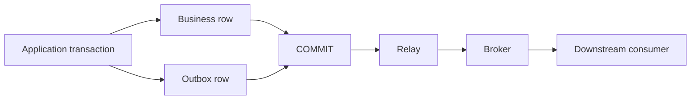
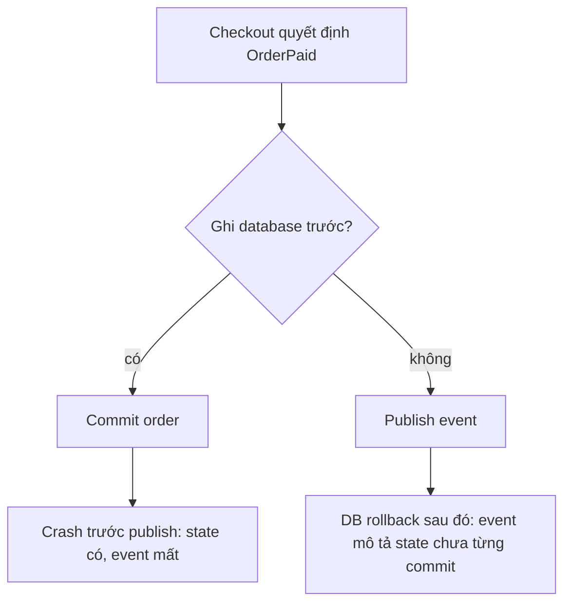
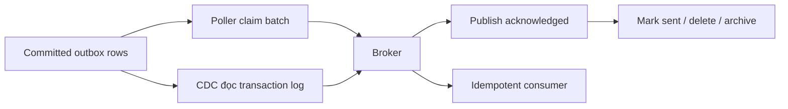

# Transactional Outbox: Phát sự kiện mà không tạo khoảng trống dual-write

Trong một đợt flash sale nghẹt thở, handler xử lý thanh toán nhận webhook từ cổng ngân hàng. Ứng dụng cập nhật trạng thái đơn hàng thành `PAID` trong database PostgreSQL, commit transaction thành công, rồi chuẩn bị gọi lệnh `messageBroker.publish('OrderPaid')`. Nhưng đúng trong khoảng trống 3 mili-giây định mệnh giữa lúc database vừa commit xong và trước khi lời gọi mạng kịp kích hoạt, container pod bị hệ thống Kubernetes thu hồi tài nguyên (OOM eviction) và sập nguồn tức tưởi. Kết quả: Database ghi nhận khách hàng đã trả tiền, nhưng sự kiện phát đi bị biến mất không dấu vết. Bộ phận kho vận không bao giờ nhận được lệnh đóng gói hàng, số lượng tồn kho bị lệch lạc, và khách hàng phẫn nộ dội bão khiếu nại lên tổng đài hỗ trợ. Trạng thái hệ thống đã bị xé toạc làm đôi bởi **lỗi ghi kép (dual-write gap)**.

Khi một tác vụ vừa phải cập nhật cơ sở dữ liệu nội bộ vừa phải thông báo cho thế giới bên ngoài qua mạng, việc thực hiện hai thao tác ghi độc lập chắc chắn sẽ dẫn đến thảm họa lỗi cục bộ (partial failure).

## TL;DR

> 💡 **Quy tắc bỏ túi:** Tuyệt đối không thể commit nguyên tử đồng thời giữa hai hệ thống lưu trữ độc lập mà không dùng điều phối phân tán đắt đỏ. Thay vì sa lầy vào giao dịch phân tán 2PC nặng nề, hãy ghi trạng thái nghiệp vụ và ý định phát sự kiện vào cùng một database transaction cục bộ, rồi để một tiến trình relay chuyển tiếp bất đồng bộ.

- **Khoảng trống ghi kép (Dual-write gap):** Việc cập nhật database và phát event lên broker như hai thao tác tách biệt không bao giờ đạt tính nguyên tử; một bên thành công thì bên còn lại hoàn toàn có thể sập.
- **Transactional outbox giải quyết triệt để tính nguyên tử:** Bằng cách lưu thay đổi nghiệp vụ và một **bản ghi outbox chứa ý định phát sự kiện trong cùng một database transaction**, bảo đảm cả hai cùng commit thành công hoặc cùng rollback.
- **Bộ chuyển tiếp bất đồng bộ (Relay):** Sử dụng cơ chế polling worker (với `SELECT ... FOR UPDATE SKIP LOCKED`) hoặc Change Data Capture (CDC / Debezium) để quét các bản ghi outbox đã commit và đẩy sang broker, giải phóng hoàn toàn độ trễ của request người dùng.
- **Chấp nhận phát lại (At-least-once):** Do cơ chế retry của relay khi mạng chập chờn, event có thể bị phát lại nhiều lần; vì vậy downstream consumer bắt buộc phải xử lý lũy đẳng (idempotent) dựa trên event ID ổn định.
- **Cạm bẫy chết người:** Đảo ngược thứ tự thực thi (phát event lên message broker trước rồi mới commit database) sẽ tạo ra "sự kiện ma" (phantom event) nguy hiểm — các dịch vụ hạ nguồn vội vã trừ tiền hoặc xuất kho cho những đơn hàng mà transaction database sau đó lại bị rollback thất bại.



<TermBox term="Transactional Outbox">
**Transactional outbox** lưu một ý định giao tiếp bền vững cạnh business state trong cùng một local database transaction. Relay publish ý định đó sau commit. Pattern này loại bỏ dual-write atomicity gap giữa database và broker; nó không biến toàn workflow thành exactly-once.
</TermBox>

## Bắt đầu từ failure matrix của dual-write

Giả sử checkout chuyển một order sang `PAID` và publish `OrderPaid`.

Một implementation ngây thơ có thể làm như sau:

```text
BEGIN
UPDATE orders SET status = 'PAID' WHERE id = ?
COMMIT

publish OrderPaid
```

Database và broker là hai hệ thống có thể hỏng độc lập. Đổi ngược thứ tự cũng không giải quyết được vấn đề.



Outbox thay đổi boundary. Ứng dụng không cố điều khiển database và broker như một transaction nguyên tử duy nhất. Nó chỉ atomically control các tài nguyên vốn đã nằm trong cùng local transaction: business row và bản ghi outbox.

Một bản ghi outbox điển hình mang đủ dữ liệu cho publication tất định và duplicate handling:

```text
id             event ID duy nhất toàn cục
aggregate_id   order-123
aggregate_type Order
event_type     OrderPaid
payload        event body đã serialize
sequence       sequence tùy chọn theo aggregate
created_at     timestamp tạo bền vững
```

`id` trở thành event ID hoặc message ID ổn định để downstream consumer deduplicate.

<TermBox term="Publication Intent">
**Publication intent** là phát biểu bền vững rằng “sau khi transaction này commit, event này phải được đưa tới messaging boundary.” Nó chưa phải bằng chứng rằng broker đã nhận message.
</TermBox>

## Commit trước, publish sau

Invariant trung tâm rất đơn giản: **commit trước publish**. Cụ thể hơn, business change và outbox record commit cùng nhau; chỉ record đã commit mới được phép publish.

Pseudo-code:

```ts
await db.transaction(async (tx) => {
  await tx.orders.markPaid(orderId);
  await tx.outbox.insert({
    id: eventId,
    aggregateId: orderId,
    eventType: 'OrderPaid',
    payload,
  });
});
```

Request có thể hoàn tất sau khi local transaction commit. Publication được tách khỏi request latency và lifetime của process xử lý request.

Nếu process chết ngay sau commit, outbox row vẫn còn. Khi khởi động lại, relay có thể tìm record và tiếp tục publish.

## Relay các record đã commit

Có hai họ implementation phổ biến.

**Polling publisher.** Worker query các outbox row đã commit, nhận quyền xử lý một batch giới hạn, publish chúng, chờ broker acknowledgement rồi mark hoặc delete các row. Khi có nhiều poller, database phải ngăn hai worker cùng claim một row tại cùng thời điểm. Cơ chế kiểu PostgreSQL `SELECT ... FOR UPDATE SKIP LOCKED`, lease tường minh hoặc atomic status transition đều là các lựa chọn; cách cụ thể phụ thuộc database và workload.

**Change data capture (CDC).** Connector đọc transaction log, quan sát thay đổi đã commit của outbox table rồi chuyển chúng thành broker record. Debezium Outbox Event Router là một implementation cụ thể. CDC loại bỏ application polling, nhưng operational responsibility chuyển sang database-log/connector pipeline.

Dù chọn cách nào, invariant vẫn giống nhau: chỉ outbox state đã commit mới được publish.



## Duplicate publication là trạng thái bình thường

Relay có ambiguity window riêng:

1. Publish event `E42`.
2. Broker đã lưu `E42` bền vững.
3. Relay crash trước khi ghi “published” vào database.
4. Relay restart và publish `E42` lần nữa.

Đây thường là failure mode đúng. Retry bảo vệ khỏi mất event; duplicate-safe processing bảo vệ business effect khỏi bị lặp.

Đừng claim rằng outbox tạo ra business effect **exactly-once** end-to-end. Nó loại bỏ một dual-write gap. Broker redelivery, relay retry, consumer crash và external side effect vẫn có boundary riêng.

Consumer có thể làm business effect bền vững trở nên idempotent bằng cách ghi event ID atomically cùng effect được bảo vệ:

```text
BEGIN
INSERT INTO processed_events(event_id) VALUES ('E42')
  -- unique constraint chặn replay
APPLY business change
COMMIT
```

Nếu consumer còn gọi một remote system khác, remote effect đó cần idempotency contract hoặc coordination strategy riêng.

## Chỉ giữ ordering thật sự cần thiết

Thứ tự tạo outbox không tự động trở thành thứ tự consumer quan sát. Nhiều relay worker, retry, nhiều broker partition và consumer concurrency đều có thể reorder event.

Nếu domain yêu cầu ordering theo aggregate, hãy biến yêu cầu đó thành explicit contract. Các công cụ thường gặp gồm:

- `sequence` theo aggregate được ghi cùng business transaction;
- aggregate ID làm partition key của broker;
- consumer kiểm tra sequence bị thiếu hoặc stale;
- serialize relay ownership chỉ ở nơi thực sự cần, thay vì serialize toàn bộ outbox.

Global ordering đắt hơn rất nhiều so với per-aggregate ordering và hiếm khi là invariant thật sự.

## Vận hành relay như một production subsystem

Transactional outbox chưa hoàn chỉnh chỉ vì có table. Relay cần bounded work, retry policy, poison-event handling, cleanup và telemetry.

Với polling relay:

- Claim batch nhỏ để một worker không giữ database lock trong lúc publish hàng nghìn record.
- Ownership phải tường minh. Row đang retry bởi worker A không nên bị worker B lấy ngầm trừ khi claim lease hết hạn hoặc atomic state transition cho phép.
- Dùng bounded retry với backoff cho broker failure tạm thời.
- Sau nhiều lần lỗi tất định như serialization sai hoặc schema rejection, hãy cách ly poison record hoặc đẩy qua workflow DLQ có chủ đích thay vì retry vô hạn.
- Giữ sent row đủ lâu cho audit và reconciliation, sau đó xóa hoặc archive theo retention policy rõ ràng.

Về observability, tối thiểu theo dõi:

- unpublished backlog count;
- tuổi của event chưa publish cũ nhất;
- publish latency từ lúc outbox commit tới broker acknowledgement;
- retry/error rate theo failure class;
- số event bị quarantine hoặc DLQ;
- relay throughput so với tốc độ tạo record.

Tuổi của event cũ nhất thường actionable hơn backlog count đơn thuần: mười record bị kẹt hai giờ có thể nghiêm trọng hơn mười nghìn record đang drain bình thường.

## Kịch bản production thực chiến: Đã commit thanh toán, sự kiện bốc hơi

Dịch vụ checkout cập nhật `orders.status = 'PAID'`, commit vào database PostgreSQL, rồi chuẩn bị gọi lệnh publish `OrderPaid` lên message broker. Đúng lúc đó, quá trình deploy phiên bản mới kích hoạt khiến tiến trình cũ bị ngắt đột ngột (SIGKILL) chỉ vài mili-giây sau khi database vừa commit nhưng trước khi hàm publish kịp chạy.

**Hậu quả:** Quy trình kho vận (fulfillment) không bao giờ được kích hoạt cho đơn hàng đã thanh toán. API phía frontend đã trả về thông báo thành công cho người dùng và database lưu đúng trạng thái cục bộ, nhưng các hệ thống hạ nguồn không bao giờ nhận biết được sự kiện này.

**Nguyên nhân cốt lõi:** Đội ngũ phát triển coi database commit và broker publish như thể chúng tạo thành một thao tác nguyên tử duy nhất. Trên thực tế, đó là một lỗi ghi kép (dual-write) qua hai hệ thống độc lập mà hoàn toàn thiếu vắng một ý định phát sự kiện bền vững ở giữa.

**Cách khắc phục chuẩn:** Trong cùng một transaction đánh dấu đơn hàng là đã thanh toán, hãy chèn thêm một bản ghi outbox chứa `event_id` bất biến, `aggregate_id`, `event_type`, `payload` và `sequence` nếu cần thiết. Commit cả hai cùng nhau. Để tiến trình relay phát sự kiện sau khi commit, kiên trì retry khi gặp sự cố mạng mập mờ, đồng thời bắt buộc consumer phía sau phải lũy đẳng (idempotent) để phòng ngừa việc phát lại.

<details>
<summary>Xem giải thích chi tiết</summary>

Việc đổi thứ tự (publish lên broker trước rồi mới commit database) chỉ đảo ngược thảm họa chứ không hề giải quyết được bài toán. Một lỗi rollback database sau đó sẽ khiến các hệ thống hạ nguồn xử lý một sự kiện ma mà trạng thái nghiệp vụ thực tế chưa từng tồn tại bền vững. Transactional outbox thành công vì nó thu hẹp ranh giới nguyên tử về duy nhất một local database transaction, đồng thời biến việc giao tiếp mạng thành một tác vụ bất đồng bộ có khả năng tự phục hồi.

</details>

## Polling hay CDC

Chọn relay mechanism theo operational ownership, không theo trào lưu.

Polling publisher thường dễ hơn khi application team đã vận hành worker và cần trực tiếp control batch size, claim policy, retry và cleanup. Đánh đổi là query load và nhu cầu thiết kế concurrent claiming an toàn.

CDC hấp dẫn khi reliable log capture đã là capability của platform. Nó có thể giảm polling và tự nhiên chỉ quan sát committed change, nhưng connector lag, schema evolution, offset, retention và connector recovery trở thành một phần operating model.

Cả hai vẫn cần message identity, ordering rule, monitoring và duplicate-safe consumer.

## Outbox so với các pattern lân cận

**Outbox so với two-phase commit (2PC).** 2PC hoặc distributed transaction protocol khác cố coordinate commit qua nhiều transactional resource. Outbox chủ động tránh bắt database và broker cùng tham gia một giao dịch phân tán. Nó chấp nhận publication bất đồng bộ.

**Outbox so với Saga.** Saga coordinate một business workflow đi qua nhiều local transaction và compensating action. Outbox giải bài toán hẹp hơn: publish đáng tin cậy ý định giao tiếp từ một local transaction. Một Saga step có thể dùng outbox để thông báo local transaction của nó đã commit.

**Outbox so với Event Sourcing.** Event sourcing lấy event làm source of truth để tái tạo state. Outbox thường là delivery bridge từ business state thông thường sang messaging system. Hai pattern có thể cùng tồn tại nhưng trả lời hai câu hỏi khác nhau.

## Checklist vận hành theo failure

- [ ] **Atomic write:** Business change và outbox record có được commit trong cùng một transaction không?
- [ ] **Stable identity:** Mỗi record có event ID bền vững qua mọi retry không?
- [ ] **Claiming:** Nhiều relay worker có thể claim work mà không vô tình publish cùng một row song song không?
- [ ] **Acknowledgement boundary:** Row chỉ được mark sent sau broker durability acknowledgement cần thiết chưa?
- [ ] **Duplicate safety:** Relay retry hoặc broker redelivery có thể lặp message mà không lặp protected business effect không?
- [ ] **Ordering:** Scope ordering cần thiết đã rõ chưa, ví dụ per aggregate hoặc partition key?
- [ ] **Poison handling:** Có bounded retry và quarantine/DLQ path cho deterministic failure chưa?
- [ ] **Cleanup:** Retention, delete hoặc archive sent record đã rõ và observable chưa?
- [ ] **Lag:** Dashboard và alert có cả backlog lẫn tuổi event chưa publish cũ nhất chưa?

## Quy tắc cho agent

- [ ] Không sửa database-plus-broker dual-write chỉ bằng cách đổi thứ tự hai operation.
- [ ] Giữ atomic boundary ở local: business state và publication intent phải nằm trong cùng transaction.
- [ ] Xem relay publication là at-least-once trừ khi có bằng chứng cho một guarantee hẹp hơn end to end.
- [ ] Giữ nguyên event ID và aggregate ordering metadata qua mọi retry.
- [ ] Yêu cầu idempotency ở consumer bảo vệ business effect không thể lặp an toàn.
- [ ] Làm relay lag, retry, poison record và cleanup observable trước khi gọi pattern là production-ready.
- [ ] Chỉ dùng 2PC khi thực sự cần semantics của distributed coordination; không coi outbox là từ đồng nghĩa với distributed transaction.
- [ ] Dùng Saga cho multi-service business workflow coordination; dùng outbox để publish đáng tin cậy committed intent của local transaction.

## Tài liệu chính

- AWS Prescriptive Guidance, **Transactional outbox pattern**: https://docs.aws.amazon.com/prescriptive-guidance/latest/cloud-design-patterns/transactional-outbox.html
- Debezium Documentation, **Outbox Event Router**: https://debezium.io/documentation/reference/transformations/outbox-event-router.html
