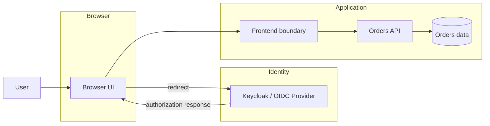
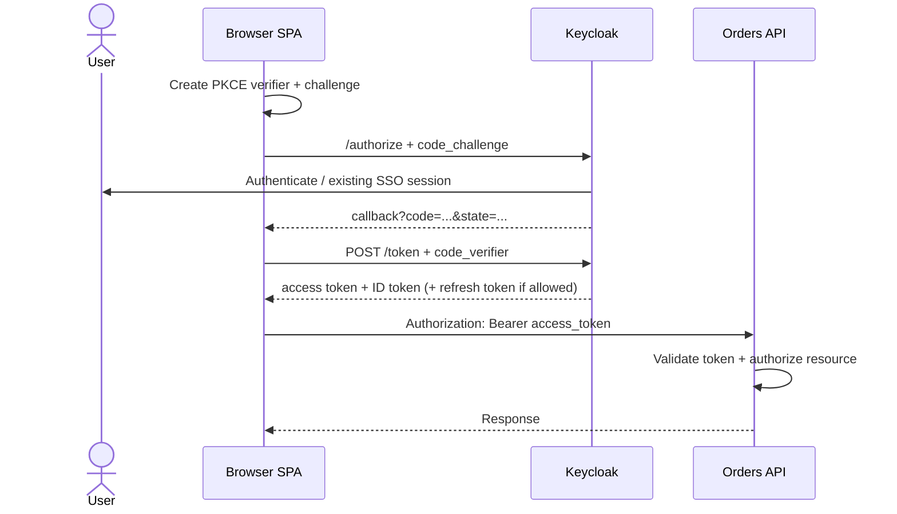
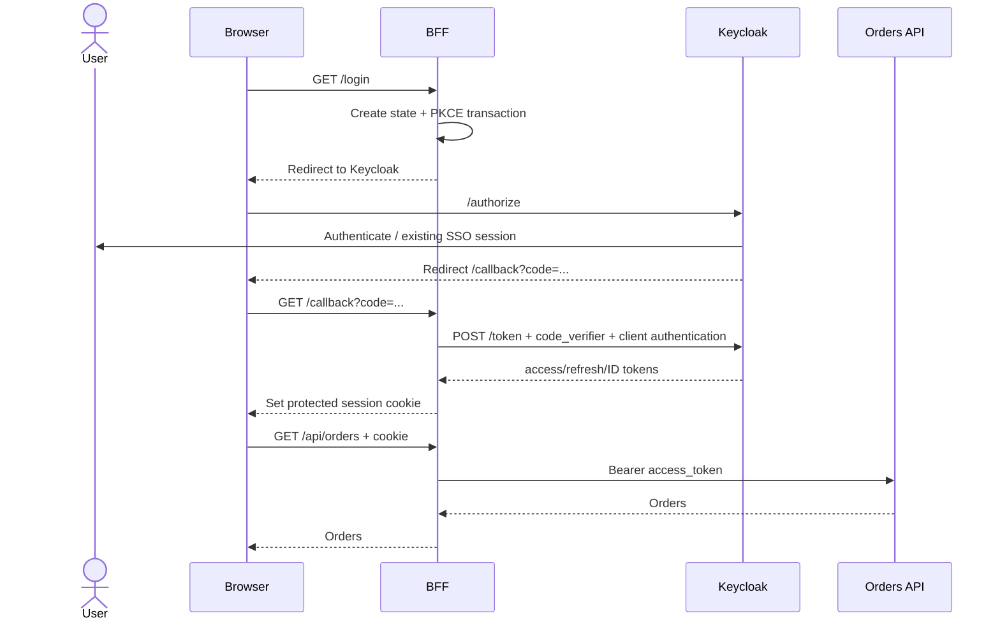
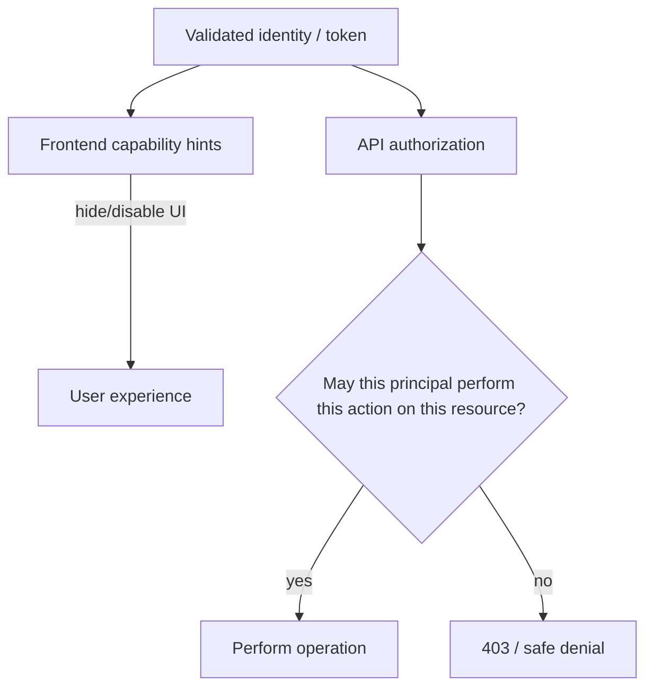

# Frontend Authentication Architecture: SPA vs BFF with OIDC & Keycloak

## Production crisis & TL;DR

A frontend team finishes an OIDC migration and everything looks healthy in development. In production, the SPA stores a long-lived refresh token in browser persistence. A third-party widget later ships an XSS bug. Malicious JavaScript can now read the token and replay it outside the browser, long after the tab is closed.

The architectural mistake was not "using OAuth." It was failing to ask **which component should own OAuth credentials, which component should call the API, and what an injected script can steal or cause the browser to send**.

> 💡 **Rule of thumb:** Choose the browser authentication architecture by deciding **where tokens live, who performs the code exchange and refresh, how API calls are authorized, and which browser threats you are accepting**.

- **Direct SPA:** the browser is the OAuth client, uses Authorization Code + PKCE, receives tokens, and calls APIs directly.
- **BFF:** the server-side Backend for Frontend is the OAuth client, keeps access/refresh tokens away from browser JavaScript, and gives the browser a protected cookie session.
- **HttpOnly is not a CSRF defense.** It blocks JavaScript from reading a cookie; the browser can still attach that cookie to requests.
- **Frontend role checks are UX, not the security boundary.** The API must validate credentials and authorize the concrete action/resource.
- **Fatal pitfall:** choosing token storage by convenience before deciding the trust boundary and threat model.

## System goal and constraints

Assume a React or Next.js frontend, Keycloak as the OpenID Provider / Authorization Server, and an Orders API.

We want browser login through Keycloak, authenticated UI state, authorized API calls, refresh without repeated interactive login, deliberate logout semantics, and enough evidence to diagnose failures.

The difficult part is that "the user is logged in" can describe several different pieces of state.

<TermBox term="Browser authentication architecture">
A **browser authentication architecture** defines which component acts as the OAuth/OIDC client, where tokens or session identifiers are held, and how authenticated browser actions reach protected APIs.

**Why it matters:** Direct SPA and BFF can use the same Keycloak realm but expose credentials to very different browser threats.
</TermBox>

## High-level trust boundaries



Do not collapse these into one vague "auth service." Keycloak authenticates and issues protocol credentials. The frontend creates user experience. The API protects business resources.

## Architecture A: direct SPA as the OAuth client

In the direct SPA pattern, browser code handles the OAuth/OIDC transaction.



RFC 10017 describes browser-based OAuth clients as public clients: browser code cannot keep a client secret from the user or from malicious JavaScript executing in the origin. Authorization Code + PKCE is the current browser baseline; a client identifier is not a secret.

### What the frontend owns

The SPA needs to own enough state to correlate the redirect transaction, complete the code + PKCE exchange, know whether the UI is authenticated, refresh according to provider/library behavior, and attach the access token to the intended API.

Keycloak's JavaScript adapter uses OIDC, supports Authorization Code flow, and documents S256 as the default PKCE method when PKCE is enabled.

### What the browser threat means

If access or refresh tokens are available to JavaScript, malicious JavaScript running in that origin can potentially access the same in-memory authority or perform calls on the user's behalf.

Persisting credentials in localStorage or sessionStorage increases the persistence window because the values remain JavaScript-readable. OWASP's current session guidance explicitly warns against storing authentication tokens or session IDs there.

That does not mean every SPA must become a BFF. It means token exposure is an explicit architectural trade-off, not a hidden implementation detail.

## Architecture B: Backend for Frontend as the OAuth client

In the BFF pattern, OAuth responsibilities move to a server component associated with the frontend.

<TermBox term="Backend for Frontend (BFF)">
A **Backend for Frontend** in this OAuth pattern is a server-side component that acts as the confidential OAuth client, keeps OAuth access/refresh tokens in the backend session context, and forwards API requests with the correct access token.

**Why it matters:** browser JavaScript receives a session interface rather than reusable OAuth bearer credentials.
</TermBox>



RFC 10017 assigns three core responsibilities to the BFF: it is the confidential OAuth client, manages tokens in a cookie-associated session, and forwards resource-server requests with the correct access token.

The browser can therefore operate without receiving the OAuth bearer token.

## The BFF moves risk; it does not delete risk

A BFF reduces direct token exposure to browser JavaScript, but browser requests are now authenticated with a cookie.

<TermBox term="CSRF">
**Cross-Site Request Forgery (CSRF)** is an attack where a browser is induced to send an authenticated request that the user did not intend.

**Why it matters:** HttpOnly prevents JavaScript from reading a cookie, but browsers still attach eligible cookies to requests. Cookie-authenticated state-changing endpoints therefore need deliberate CSRF defenses.
</TermBox>

For a BFF session cookie, RFC 10017 requires Secure and HttpOnly and recommends SameSite=Strict, Path=/, no Domain attribute, plus an HTTP-set cookie prefix where available. OWASP similarly treats SameSite as defense in depth and notes that many deployments still need CSRF tokens or equivalent origin-bound defenses.

```text
HttpOnly   -> script cannot read the cookie
Secure     -> cookie is sent only over secure transport
SameSite   -> constrains cross-site cookie sending
CSRF check -> verifies request intent for state-changing operations
```

A secure cookie is not the same thing as an authorized business operation.

## Compare the two architectures by responsibility

| Question | Direct SPA | BFF |
| --- | --- | --- |
| OAuth client | Browser application | Server-side BFF |
| Client secret | Cannot be confidential | Can be protected server-side |
| PKCE | Yes | Yes in RFC 10017 BFF flow |
| Access token visible to browser JS | Yes | No by design |
| Refresh token visible to browser JS | Depends on provider/library | No by design |
| API call | Browser → API | Browser → BFF → API |
| Browser authentication state | Token/session state in app | Cookie session |
| Main browser risk | token exposure to injected JS | CSRF/session-riding plus XSS actions |
| CORS pressure | Often browser → API cross-origin | Often reduced with same-origin BFF |
| Operational cost | simpler topology | extra server/proxy/session component |

RFC 10017 presents BFF, token-mediating backend, and browser OAuth client in decreasing order of security, while also documenting their complexity trade-offs. This is not a universal mandate to deploy a BFF for every application.

## Trace one login in DevTools

When debugging, stop thinking "Keycloak is redirecting a lot." Trace each boundary.

### Direct SPA

1. **Navigation to /authorize**
   - confirm client_id and exact redirect_uri;
   - confirm response_type=code;
   - confirm scope contains openid for OIDC;
   - confirm PKCE challenge and method;
   - observe state and nonce where used.

2. **Callback**
   - the browser returns with a short-lived authorization code;
   - do not expect an access token in the URL for Authorization Code flow;
   - verify application state correlation.

3. **Token request**
   - code + code_verifier are exchanged;
   - a browser client must not pretend a bundled client secret is confidential.

4. **API call**
   - Authorization: Bearer access_token;
   - if it fails, separate token validation from business authorization.

### BFF

1. browser hits /login on the BFF;
2. BFF creates the OAuth transaction and redirects to Keycloak;
3. callback code returns through the browser to the BFF;
4. BFF performs token exchange server-side;
5. browser receives a session cookie, not the OAuth access token;
6. browser calls the BFF with the cookie;
7. BFF obtains or refreshes the access token and calls the API.

This sequence is especially useful when the browser network panel does **not** show /token: that may be correct in a BFF architecture because the exchange happens server-to-server.

## UI authorization and API authorization are different

A frontend may use claims to decide whether to render an "Approve refund" button. That is useful UX. It is not enforcement.



The user can call the API without clicking your button. The API must independently verify the principal, token purpose/audience, and application-specific permission.

## Refresh is part of the architecture

Do not bolt refresh on after login.

In a direct SPA, refresh behavior depends on the chosen provider/library and whether browser-held refresh tokens are permitted. Keycloak's JavaScript adapter exposes token refresh behavior through its adapter API.

In a BFF, the backend associates the refresh token with the server-side session and can refresh access tokens without exposing the refresh token to JavaScript.

In either case, access-token expiry is not equivalent to logout, refresh failure needs an explicit session outcome, and permission changes can require stronger revocation behavior than simply waiting for expiry.

## Logout has multiple scopes

A useful mental model is three layers:

```text
1. UI state            -> frontend no longer shows authenticated state
2. Application session -> SPA/BFF local credentials or cookie are cleared
3. IdP / SSO session   -> Keycloak login session ends when the chosen flow requires it
```

Clearing React state alone does not revoke a server session. Clearing one application session does not automatically log the user out of every SSO-connected application.

## Production micro-scenario: "secure cookie" but no CSRF boundary

A team migrates from browser tokens to a BFF and correctly sets its session cookie to Secure; HttpOnly. They assume the browser is now protected because injected JavaScript cannot read the credential. The BFF exposes POST /api/payments/refund and authenticates only by cookie. No CSRF token or Origin/Referer validation is used.

- **Impact:** A logged-in user's browser can be induced to submit an authenticated state-changing request from an attacker-controlled site when cookie policy and request shape allow it.
- **Root cause:** The team treated credential confidentiality (HttpOnly) as request-intent validation.
- **Correct pattern:** Protect the session cookie, use an appropriate SameSite policy, enforce CSRF defenses for state-changing cookie-authenticated endpoints, and still perform API/resource authorization.

## Check your mental model

> **Scenario:** The frontend hides the Admin tab unless the decoded access token contains an admin role. A user cannot see the tab. Is the admin API protected?

<details>
<summary>Show the reasoning</summary>

No.

The frontend check improves UX but is attacker-controlled logic. A caller can bypass the UI and send a request directly. The API must validate the access token for its expected issuer/audience/profile and enforce the required authorization policy for the requested resource.

</details>

## Architecture review checklist

- [ ] **Ownership:** Which component is the OAuth/OIDC client?
- [ ] **Threat model:** Can browser JavaScript read reusable bearer credentials?
- [ ] **Flow:** Is Authorization Code + PKCE used for browser OAuth?
- [ ] **Secrets:** Are confidential client credentials kept exclusively server-side?
- [ ] **Redirect:** Are redirect URIs tightly registered?
- [ ] **Session:** If using BFF cookies, are Secure, HttpOnly, SameSite, Path, and Domain intentional?
- [ ] **CSRF:** Are cookie-authenticated state-changing endpoints protected?
- [ ] **CORS:** If the browser calls an API cross-origin, are origins and credentials configured deliberately?
- [ ] **Tokens:** Are ID Tokens kept distinct from API access tokens?
- [ ] **Validation:** Does the API validate issuer, audience/resource, time, signature/key, and token profile?
- [ ] **Authorization:** Does the API authorize the concrete action/resource after authentication?
- [ ] **Refresh:** Is refresh-token ownership and failure behavior explicit?
- [ ] **Logout:** Are UI, application-session, and IdP/SSO logout scopes distinguished?
- [ ] **Evidence:** Can you trace authorize, callback, token/session establishment, API call, refresh, and logout?

## Related Atlas lessons

- [OAuth 2.0 & OpenID Connect](/docs/backend-engineering/oauth-and-oidc) teaches the protocol primitives behind both shapes.
- [Keycloak in Practice](/docs/backend-engineering/keycloak-in-practice) maps the protocol to realms, clients, roles, client scopes, and mappers.
- [Auth Debugging Field Guide](/docs/backend-engineering/auth-debugging-field-guide) turns 401, 403, CORS, redirect mismatch, issuer, and audience errors into a boundary-first debugging workflow.
- [Cookies and Sessions](/docs/web-platform/cookies-and-sessions) explains browser cookie/session behavior.
- [Same-Origin Policy and CORS](/docs/web-platform/same-origin-and-cors) explains cross-origin browser enforcement.

## Sources

- [RFC 10017 — OAuth 2.0 for Browser-Based Applications](https://www.rfc-editor.org/rfc/rfc10017.html)
- [RFC 9700 — Best Current Practice for OAuth 2.0 Security](https://www.rfc-editor.org/rfc/rfc9700.html)
- [OWASP Session Management Cheat Sheet](https://cheatsheetseries.owasp.org/cheatsheets/Session_Management_Cheat_Sheet.html)
- [OWASP Cross-Site Request Forgery Prevention Cheat Sheet](https://cheatsheetseries.owasp.org/cheatsheets/Cross-Site_Request_Forgery_Prevention_Cheat_Sheet.html)
- [Keycloak JavaScript Adapter](https://www.keycloak.org/securing-apps/javascript-adapter)
- [OpenID Connect Core 1.0](https://openid.net/specs/openid-connect-core-1_0-18.html)
